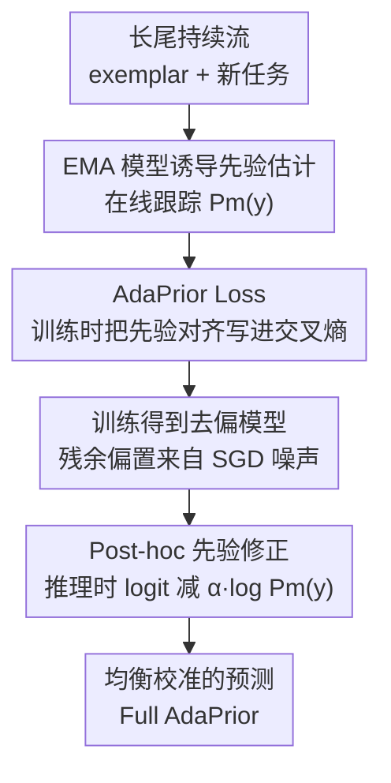

# AdaPrior: Bayesian-Inspired Adaptive Prior Correction for Long-Tailed Continual Learning

**会议**: CVPR 2026  
**论文**: [CVF Open Access](https://openaccess.thecvf.com/content/CVPR2026/html/Bhat_AdaPrior_Bayesian-Inspired_Adaptive_Prior_Correction_for_Long-Tailed_Continual_Learning_CVPR_2026_paper.html)  
**代码**: 待确认  
**领域**: 持续学习 / 长尾识别  
**关键词**: 长尾类增量学习, 贝叶斯先验修正, EMA 先验估计, logit 调整, 模型诱导先验

## 一句话总结
AdaPrior 把长尾类增量学习（LTCIL）重新理解成"模型诱导先验漂移"问题，用 EMA 在线估计模型自己学到的先验 $P_m(y)$，再在训练损失和推理后处理两处用它做贝叶斯对齐去偏，单阶段、即插即用，在 CIFAR100-LT / ImageNet-subset-LT / iNaturalist18-subset 上一致超过近期 LTCIL 基线。

## 研究背景与动机
**领域现状**：长尾类增量学习要同时扛两个老大难——灾难性遗忘（旧任务只剩少量 exemplar）和类别不均衡（头部类样本多、尾部类极少）。主流做法要么靠重采样/重加权，要么靠两阶段分类器对齐（先正常训，再在一个均衡子集上 fine-tune 分类器，如 GVAlign、LWS）。

**现有痛点**：两阶段方法多一轮均衡重训，计算开销大、可扩展性差；单阶段的 logit 调整类方法（如频率先验 $\log P(y)$ 修正、梯度重加权）则**假设模型准确学到了 $P(y|x)$、且类别先验等于数据集频率 $P_\text{freq}(y)$**。

**核心矛盾**：作者指出一个被忽略的"隐藏失效模式"——**先验漂移（prior drift）**。在持续流里，随着任务到来，模型预测越来越偏向最近见过的类，即使数据集类频率固定不变，模型**实际学到的先验** $P_m(y)$ 也会随表征漂移、replay 不均衡、蒸馏而不断偏移，和静态频率先验 $P_\text{freq}(y)$ 对不上。于是用固定的 $\log P(y)$ 去修正常常过修或欠修，反而把后验 $P(y|x)$ 拉偏。Fig.1 直接画出：经典 LUCIR+CE 和近期 GVAlign 训到后期都对新任务类产生强烈偏置。

**本文目标**：把 LTCIL 从"数据计数偏置"重述为"分布失配（distribution misalignment）"问题，去对齐的是**模型诱导先验**而非数据频率，并且要单阶段、低开销、对任意 CIL 方法即插即用。

**核心 idea**：用 $P_m(y)\approx \mathbb{E}_x[P(y|x)]$ 在线估计模型自己的先验（EMA 跟踪），然后在**训练损失**和**推理后处理**两个层面同时做贝叶斯对齐，把后验拉回均衡评测分布 $P_t(y)$（LTCIL 评测集是均匀分布）。

## 方法详解

### 整体框架
AdaPrior 的全部修改都发生在"logit–先验"这一层接口上，因此与 backbone 无关、可挂在任意 CIL 流水线（论文基于 LUCIR）。整条思路是：**先在线估出模型当前真实学到的先验 $P_m(y)$，再用它分别在训练时（改损失）和推理时（改 logit）做两道去偏**。

贝叶斯出发点是 Eq.2：当训练分布不均衡时，学到的后验被先验比 $\frac{P_t(y)}{P(y)}$ 扭曲，所以经典 logit 调整用 $z_t = z - \log P(y) + \log P_t(y)$ 去纠。AdaPrior 的关键改动是把这里的静态 $P(y)$ 换成**动态的 $P_m(y)$**。它支持三种模式：① 只做推理后处理（Post-hoc）；② 只改训练损失（AdaPrior Loss）；③ 两者叠加（Full AdaPrior = Loss 先训出去偏模型，post-hoc 再扫掉 SGD 噪声留下的残余偏置）。

### 关键设计

**1. EMA 在线估计模型诱导先验：把"模型自己的偏见"实时量出来**

这是全方法的地基，针对的痛点是"静态频率先验 $P(y)$ 和模型实际偏置对不上"。AdaPrior 不再用数据集类计数，而是直接从模型当前后验里量先验：$P_m(y)\approx \frac{1}{|D_\tau|}\sum_{x\in D_\tau} P_m(y|x)$，其中 $P_m(y|x)=\mathrm{Softmax}(z(x,y))$，相当于对当前任务数据上模型 softmax 输出做平均。推理时直接用这个经验平均；训练时 $P_m(y)$ 在不停变，于是用 EMA 跟踪：

$$P_m^{i}(y) = (1-\gamma)\,P_m^{i-1}(y) + \gamma\,\frac{1}{|B_i|}\sum_{x\in B_i} P_m(y|x)$$

$i$ 是迭代步、$B_i$ 是当前 batch、$\gamma$ 是动量；初始化 $P_m^0(y)=P(y)$（类频率）。这个更新本质是 Robbins–Monro 递归，作者用 Theorem 3 证明：平稳时几乎必然收敛到真先验，缓慢漂移时跟踪误差有界，量级为 $O(\gamma)+O(\bar d/\gamma)$（$\bar d$ 是每步漂移上界）——$\gamma$ 大则适应快但噪声大，$\gamma$ 小则稳但慢，实测最优在 $\gamma\approx0.05$。它像 BatchNorm 的 running stat 一样只是个 detach 的长度-$K$ 向量，额外开销仅 $O(K)$ 内存、无额外前向、训练时间几乎不变。这一步之所以关键，是因为后面两道去偏全靠这个"会随模型漂移而漂移"的先验，而不是写死的频率。

**2. AdaPrior Loss：把先验对齐塞进交叉熵，从梯度层面去偏**

光在推理后处理改，训练本身仍偏向头部类，尾部表征学不好。所以第二道设计把先验修正直接写进损失：

$$L_{PA} = -\log \frac{\exp\!\big(\bar z(x,y)+\log \tfrac{P_m(y)}{P_t(y)}\big)}{\sum_k \exp\!\big(\bar z(x,k)+\log \tfrac{P_m(k)}{P_t(k)}\big)}$$

$\bar z$ 是未调整 logit。它沿用长尾里 logit 重加权的思路，但把固定频率换成会演化的 $P_m$。Theorem 2 给出它的可解释分解：展开后约等于 $\mathrm{CE}(P(y), P_m(y|x)) + \mathrm{KL}(P_m(y)\,\|\,P_t(y))$——也就是说这个损失**同时**最小化预测误差和"模型先验与目标均衡先验之间的散度"，把过去要靠第二阶段均衡 fine-tune 才能做的事，并进一个单阶段目标里。这正是它能去掉两阶段重训的理论支点：先验对齐变成训练里自带的一项，而不是事后补丁。

**3. Post-hoc 贝叶斯修正：推理时按模型先验一键纠偏**

即便训练去了偏，SGD 噪声仍会留下残余偏置。第三道设计在推理时做一次轻量 logit 修正（Theorem 1）：

$$z^{\tau}(x,y) = \bar z^{\tau}(x,y) + \alpha\,\big(\log P_t(y) - \log P_m^{\tau}(y)\big)$$

$\alpha\in[0,1]$ 是回火（tempering）系数，$\alpha=0$ 退回未修正、$\alpha=1$ 是完整贝叶斯修正。由于 LTCIL 评测集均衡（$P_t(y)$ 均匀），上式简化为 $z^{(\alpha)}(x,y)=z(x,y)-\alpha\log P_m^{\tau}(y)$，即按模型估出的先验把高频类 logit 压下去、把真值类抬上来（Fig.1 右）。$\alpha$ 之所以必要：$P_m$ 是从有限、漂移的数据估出来的，会有噪声，所以不能硬上完整修正，用 $\alpha$ 在"无修正"和"满额贝叶斯"之间平滑插值，实测最优在 $\alpha\approx0.6\text{–}0.7$，过大反而过修。Full AdaPrior 就是设计 2 训练 + 设计 3 推理的叠加，残余偏置被这一步扫掉。

## 实验关键数据

### 主实验
基于 LUCIR 流水线，CIFAR100-LT 用 ResNet-32、ImageNet-subset-LT / iNaturalist18-subset 用 ResNet-18，IF=100，每类 exemplar=20，评测平均增量精度。LFS（从零学）比 LFH（从一半学起）更难。

Shuffled LTCIL（Table 1，平均增量精度 %）：

| 数据集/设置 | 任务划分 | GradReweight[15] | LUCIR+CE | AdaPrior Loss | Full AdaPrior |
|------|------|------|------|------|------|
| CIFAR100-LT · LFS | 10 任务 | 35.66 | 29.97 | 34.07 | **36.94** |
| CIFAR100-LT · LFH | 5 任务 | 40.18 | 36.69 | 40.97 | **43.31** |
| ImageNet-subset · LFS | 10 任务 | 45.12 | 34.77 | 42.04 | **45.28** |
| ImageNet-subset · LFH | 10 任务 | 49.13 | 48.98 | 58.21 | **59.28** |

iNaturalist18-subset（Table 3，自然极端不均衡 IF≈435，LFH）：

| 方法 | Ordered 5 任务 | Ordered 10 任务 | Shuffled 5 任务 | Shuffled 10 任务 |
|------|------|------|------|------|
| GVAlign[21]（两阶段） | 72.42 | 70.69 | 67.23 | 64.41 |
| LUCIR[18] | 70.29 | 69.65 | 62.83 | 63.39 |
| AdaPrior Loss | 74.31 | 72.52 | 67.69 | 67.57 |
| Full AdaPrior | **74.41** | 72.26 | **69.52** | **68.10** |

单阶段的 AdaPrior 在最严苛的自然长尾上反超两阶段 GVAlign，验证了"动态先验估计在真实不均衡下更稳"的核心主张。

### 消融实验

与其它 logit 调整方法对比（Table 5，Shuffled LT，平均增量精度 %）：

| 方法 | CIFAR100-LT 10 任务 | ImageNet-subset 10 任务 | 说明 |
|------|------|------|------|
| LUCIR+CE | 37.45 | 48.98 | 基线 |
| +logN[32] | 41.60 | 55.03 | 静态频率先验修正 |
| +Balsoft[35] | 41.06 | 54.75 | 平衡 softmax |
| +AdaPrior*（仅 post-hoc） | 41.91 | 56.27 | 只用动态先验做后处理 |
| +AdaPrior Loss | 41.15 | 58.21 | 只改训练损失 |
| +Full AdaPrior | **42.85** | **59.28** | Loss + post-hoc |

校准对比（Table 6，ImageNet-subset-LT，越低越好）：

| 方法 | Mean ECE (5/10 任务) | Mean NLL (5/10 任务) |
|------|------|------|
| LUCIR+CE | 0.1500 / 0.1045 | 2.5242 / 2.2785 |
| +LogN | 0.1393 / 0.1032 | 2.4453 / 2.2680 |
| +AdaPrior | **0.1322 / 0.1013** | **2.4218 / 2.2597** |

### 关键发现
- **动态先验 > 静态频率先验**：同样是 logit 调整，把 $P(y)$ 换成 EMA 估的 $P_m(y)$（AdaPrior* vs logN）在两个数据集上都更高，印证"先验在 LTCIL 里会随任务漂移、写死频率会失效"。
- **Loss 与 post-hoc 互补**：单独 AdaPrior Loss 已强，叠加 post-hoc 进一步扫残余偏置，Full 版几乎在所有 split 取得 SOTA；post-hoc 单用也能涨点（即插即用最低成本）。
- **超参不敏感、稳健**：$\gamma\approx0.05$、$\alpha\approx0.6\text{–}0.7$ 为最优峰，曲线平缓；在 IF=10/100/200 和 exemplar=5/10/15/20 下都保持领先，甚至每类仅 5 个 exemplar 时仍有竞争力，说明先验对齐能部分补偿样本稀缺。
- **不靠数据增强**：去掉 Mixup 后（Table 4）AdaPrior 仍超 GVAlign，说明增益来自先验修正本身而非增强。
- **跨 backbone**：把 post-hoc 直接套到 PODNET（无调参）仍有 +1~3% 提升（附录 Tab.7），佐证"只动概率头、与架构解耦"。

## 亮点与洞察
- **重新定义问题**：把 LTCIL 的偏置来源从"数据计数"重述为"模型诱导先验漂移"，并用 Fig.1 实证即使类频率固定、偏置照样随训练增长——这个视角转换是全文最"啊哈"的点。
- **一个先验估计撑起两道去偏**：EMA 估出的 $P_m(y)$ 同时喂给训练损失和推理后处理，机制统一、无额外阶段，且像 BatchNorm 一样几乎零开销。
- **损失的可解释分解**：把魔改的交叉熵证明成 $\mathrm{CE}+\mathrm{KL}(P_m\|P_t)$，让"为什么这样改"有据可依，而不是凑出来的偏置项；这个"把对齐写进损失、KL 项收敛先验"的思路可迁移到其它分布失配场景（如域自适应、测试时适应）。
- **回火系数 $\alpha$ 的处理**：承认估计先验带噪、用 $\alpha$ 在无修正与满额贝叶斯间插值，是个朴素但有效的稳健化技巧。

## 局限性 / 可改进方向
- 实验全部在 CNN（LUCIR/PODNET）+ 中小规模数据上，论文自己也把 Transformer / 多模态 backbone 留作 future work——"只动概率头所以架构无关"目前更多是论断而非充分验证。⚠️ ImageNet-LT(1k) 与 Food-101-LT 结果放在附录，正文未给完整表格，规模化证据偏弱。
- 收敛/跟踪保证（Theorem 3）依赖"类条件 $P(x|y)$ 缓慢变化、后验近似真后验"等标准假设；当任务间分布剧烈跳变（强表征漂移）时这些假设是否成立、$P_m$ 是否还稳，缺乏针对性压力测试。
- 评测先验 $P_t(y)$ 被设为均匀（benchmark 设定），方法天然吃这个简化；若真实部署评测分布本身也长尾/未知，post-hoc 那步如何取 $P_t$ 没展开。
- $\alpha$ 在 held-out 验证集上选——持续学习里能否始终有干净均衡的验证 split 值得商榷。

## 相关工作与启发
- **vs 两阶段 LTCIL（GVAlign[21] / LWS[29] / Wang[44]）**：它们靠第二阶段在均衡子集上重对齐分类器，开销大、难扩展；AdaPrior 把对齐并进单阶段损失（KL 项），省掉重训，在极端自然长尾 iNaturalist 上还反超它们。
- **vs 静态 logit 调整（logN[32] / Balanced Softmax[35]）**：它们假设先验=数据频率，在 LTCIL 里先验会漂移而失配；AdaPrior 用 EMA 从模型输出动态估先验，Table 5 直接验证动态优于静态。
- **vs 梯度重加权（GradReweight[15]）**：同为单阶段，但 He et al. 仍依赖频率先验假设；AdaPrior 从根上换掉先验来源，并附带更好的校准（更低 ECE/NLL）。

## 评分
- 新颖性: ⭐⭐⭐⭐ 把 LTCIL 重述为"模型诱导先验漂移"并用 EMA 动态估计，视角清晰、与静态频率先验形成明确对照。
- 实验充分度: ⭐⭐⭐⭐ 三个数据集 + 多 IF / exemplar / backbone / 校准消融较全，但大规模(1k)与 Transformer 验证仍偏弱。
- 写作质量: ⭐⭐⭐⭐ 动机—理论—方法—实验链条顺，三个 Theorem 把直觉钉实，图 1 概念图直观。
- 价值: ⭐⭐⭐⭐ 单阶段、即插即用、几乎零开销，对长尾持续学习落地很实用。

<!-- RELATED:START -->

## 相关论文

- [\[CVPR 2026\] Confusion-Aware Spectral Regularizer for Long-Tailed Recognition](confusion-aware_spectral_regularizer_for_long-tailed_recognition.md)
- [\[CVPR 2026\] Adaptive Bayesian Early-Exit Networks for Efficient Non-Transferable Learning](adaptive_bayesian_early-exit_networks_for_efficient_non-transferable_learning.md)
- [\[CVPR 2026\] A Faster Path to Continual Learning](a_faster_path_to_continual_learning.md)
- [\[CVPR 2026\] FEAT: Federated Geometry-Aware Correction for Exemplar Replay under Continual Dynamic Heterogeneity](feat_federated_geometry_aware_correction_for_exemplar_replay_under_continual_dynamic_heterogeneity.md)
- [\[CVPR 2026\] Spectral Mixture-of-Experts for Continual Learning](spectral_mixture-of-experts_for_continual_learning.md)

<!-- RELATED:END -->
