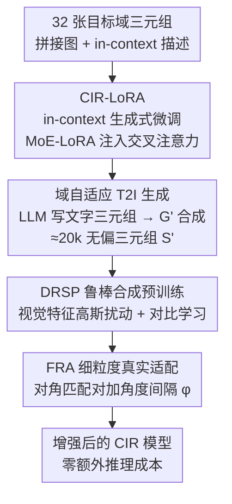

# Adapting In-context Generation for Enhanced Composed Image Retrieval

**会议**: CVPR 2026  
**论文**: [CVF Open Access](https://openaccess.thecvf.com/content/CVPR2026/html/Li_Adapting_In-context_Generation_for_Enhanced_Composed_Image_Retrieval_CVPR_2026_paper.html)  
**代码**: https://github.com/JThuge/DAIG  
**领域**: 多模态VLM / 图文检索  
**关键词**: 组合图像检索, 少样本, 文生图微调, 合成三元组, 域自适应

## 一句话总结
本文提出 DAIG：用 32 张目标域样本对预训练 T2I 模型（Flux）做 in-context 微调（CIR-LoRA），让它批量合成"无偏、贴合目标域"的组合图像检索（CIR）三元组，再用一个两阶段训练框架（特征扰动预训练 DRSP + 角度间隔微调 FRA）把这些合成数据喂给任意现成 CIR 模型，在 CIRR/FashionIQ 上以即插即用、零额外推理成本的方式显著涨点。

## 研究背景与动机

**领域现状**：组合图像检索（Composed Image Retrieval, CIR）的输入是「参考图 $I_r$ + 一句相对描述 $T_c$」组成的双模态 query，目标是从图库里检索出符合用户改图意图的目标图 $I_t$。有监督 CIR 方法（CLIP4CIR、BLIP4CIR、SPRC 等）靠 VLM 的跨模态对齐做得很好，但严重依赖人工标注的 $(I_r, T_c, I_t)$ 三元组。

**现有痛点**：标注三元组极其昂贵，使得有监督 CIR 难以扩展。零样本 CIR（ZS-CIR）想绕开标注，但三条主流路线各有硬伤：反演网络（把图映射成伪词 token）、训练自由的 LLM 推理检索（慢、复杂度高）、以及三元组合成（CompoDiff/VISTA/CoAlign 等）。其中三元组合成最有潜力，但合成的数据**不带目标域知识**，存在难以消除的 domain gap。

**核心矛盾**：最接近本文的工作 CoAlign 用冻结的 T2I 模型做 zero-shot in-context 生成——LLM 先写出文字三元组，填进版面模板，再让 T2I 一次前向生成"左右两张语义相关子图"，裁开当作参考图和目标图。但它有两个根本问题：(1) 生成图与真实目标域之间分布漂移大；(2) 缺乏任务先验，导致左右子图背景过于相似，当成 $I_r/I_t$ 时引入额外偏置。换句话说，免费生成的三元组**又偏又脏**，需要额外过滤还效果有限。

**本文目标**：在只有少量标注（few-shot）甚至少到 32 张样本时，如何造出既贴合目标域、又干净无偏的 CIR 训练三元组，并让任意现成 CIR 模型用上它涨点。

**切入角度**：作者发现 LoRA 本身就有"从极少样本捕捉并对齐目标域分布"的内在属性，而 in-context 描述能把 CIR 任务目标注入 T2I 模型。于是把"用冻结模型生成"改成"用 few-shot 微调过的模型生成"。

**核心 idea**：用 32 张目标域样本对 T2I 模型做参数高效 in-context 微调（CIR-LoRA），把域先验 + 任务先验同时打进去，生成无偏的域自适应三元组；再用两阶段框架（合成数据鲁棒预训练 + 真实数据细粒度微调）即插即用地增强现成 CIR 模型。

## 方法详解

### 整体框架

DAIG 整体分三块串行流动：**(i) In-context 生成式微调** → **(ii) 域自适应 in-context 生成** → **(iii) 两阶段 CIR 训练框架**。

第一块的输入是 32 个目标域三元组，输出是一个"懂目标域、懂 CIR 任务"的 T2I 模型 $G'$；做法是把每个三元组拼成左右拼接图 + in-context 文字描述，用 CIR-LoRA 微调 Flux。第二块用 $G'$ 配合 LLM 批量造数据：LLM 按 `(object, edit)` 模板生成约 2 万条文字三元组，转成 in-context 描述喂给 $G'$，一次前向合成左右子图，裁开得到合成三元组集 $S'$（约 20k）。第三块把 $S'$ 和真实标注 $S$ 分两阶段用掉：先在合成数据上做特征扰动的鲁棒预训练（DRSP），再在真实标注上做带角度间隔的细粒度微调（FRA）。整个第三块对任意 CIR 模型即插即用，且推理时不增加任何开销。

### 关键设计

**1. CIR-LoRA：用 in-context 微调把域先验 + 任务先验同时打进 T2I 模型**

针对"冻结 T2I 生成又偏又缺任务先验"的痛点，作者不再冻结模型，而是用 32 张样本做参数高效微调。具体把每个目标域三元组的 $I_r$ 和 $I_t$ 左右拼成一张 stitched image，再用 captioner 给两张图生成描述 $T_r, T_t$，连同 $T_c$ 填进固定版面模板得到 in-context 描述 $T_{ic}$（"Square grid layout... Left: $T_r$. Change: $T_c$. Right: $T_t$."）。微调时 backbone 全程冻结，只在每个 block 的交叉注意力层并入一个可学习的 CIR-LoRA：

$$\text{Attention}(Q,K,V)=\text{Softmax}\!\left(\frac{QK^{T}}{\sqrt{d}}\right)V,\quad K=W_k\,\tau_{txt}(T_{ic}),\ V=W_v\,\tau_{txt}(T_{ic})$$

其中 $Q$ 是图像 query，$\tau_{txt}$ 编码 in-context 描述作为 $K,V$ 注入文本条件。CIR-LoRA 的关键不是普通 LoRA，而是给每个投影权重 $W$ 配一组 MoE 专家 $B_i\in\mathbb{R}^{d\times r}, A_i\in\mathbb{R}^{r\times l}$（默认 2 个专家，rank=32），由路由函数 $r=R[\tau_{txt}(T_{ic})]\in\mathbb{R}^K$ 按描述特性给样本分配专家权重，更新权重为 $W'=W+\beta\sum_{i=1}^{K} r_i B_i A_i$，只训练 $\Delta W$，用 flow matching 监督。这样设计有效是因为：LoRA 的内在属性让它从极少样本就能对齐目标域分布（解决域偏置）；in-context 描述让模型抓住 CIR 任务目标，而 MoE 路由能对相对描述里五花八门的编辑操作（增/删/替换/视角/数量变化）分配最优专家（解决任务先验缺失）。微调后的 $G'$ 几乎不再吐出有伪影/版面错误的图，因此**不需要 CoAlign 那种额外数据过滤**。

**2. DAIG 生成管线：LLM 写脚本 + G' 出图，批量造无偏域自适应三元组**

有了 $G'$ 后还需要规模化造数据。作者设计指令模板 $P(\text{object}, \text{edit})$ 驱动 LLM：从预定义的 object 集合和 edit 集合里随机采样，要求 LLM 按 JSON 输出一个符合 CIR 要求的 $(T_r, T_c, T_t)$，并用目标域样本作为 `examples` 约束语言风格。迭代采样得到 $M$ 条文字三元组后，转成 in-context 描述喂进 $G'$ 一次前向合成 $I_r, I_t$，得到合成三元组集 $S'=\{I_r^i, T_c^i, I_t^i\}_{i=1}^M$（论文用 Qwen2.5-VL-32B 当 captioner、Qwen2.5-32B 当 LLM，产 20k 条）。这套管线之所以有效，是因为 object×edit 的组合采样保证了多样性，$G'$ 的域+任务先验保证了高保真和无偏，三者叠加让合成数据"多样 + 高保真 + 贴合目标域和 CIR 任务"，单张三元组生成只要约 2 秒。

**3. DRSP 分布鲁棒合成预训练：扰动视觉特征统计量，把稀疏合成分布撑开**

痛点是：T2I 合成图相对真实目标域往往落在一个**稀疏分布**里，直接拿 $S'$ 训 CIR 模型容易过拟合。作者借鉴域泛化思路，把 CIR 模型图像编码器输出的视觉特征 $v\in\mathbb{R}^{B\times L\times D}$ 的统计量（均值 $\mu(v)$、标准差 $\sigma(v)$，即"风格"）建模成多元高斯，沿 batch 维算方差 $\Sigma_\mu, \Sigma_\sigma$，用重参数化采样出扰动后的统计量 $\tilde\mu(v)=\mu(v)+\epsilon_\mu\Sigma_\mu(v)$、$\tilde\sigma(v)=\sigma(v)+\epsilon_\sigma\Sigma_\sigma(v)$，再把特征重新归一化-反归一化：

$$\tilde v=\tilde\sigma(v)\,\frac{v-\mu(v)}{\sigma(v)}+\tilde\mu(v)$$

之后用 $\tilde v$ 替换 $v$ 做后续融合与对齐，标准对比损失优化。训练时以概率 $p=0.5$ 决定该 batch 是否扰动。它有效是因为：通过扰动 batch 级统计量把稀疏的合成分布"撑成"对目标域更鲁棒的近似，增大拟合难度从而提升泛化；而且不引入任何额外参数，推理时直接关掉扰动，**零额外推理成本**。

**4. FRA 细粒度真实适配：给匹配对加角度间隔，逼模型学细粒度差异**

预训练完后还要弥合最后的 domain gap、并增强细粒度判别力。FRA 在真实标注 $S$ 上微调：算 query 特征与 batch 内所有 target 特征的余弦相似度，但在角度空间给所有匹配对（相似度矩阵的对角元）加一个角度间隔 $\varphi$：

$$p_{i,j}=\frac{e^{\cos(\theta_{i,j}/\tau)}}{\sum_{k\in B} e^{\cos(\theta_{i,k}/\tau)}},\quad \theta_{i,j}=\arccos\big(\text{sim}(f_q^i, f_t^j)\big)+\varphi\cdot\mathbb{I}(i=j)$$

其中 $\tau$ 是可学习温度系数，$\mathbb{I}(\cdot)$ 是指示函数只对对角正样本对加 margin（$\varphi=3\times10^{-3}$）。再用 $p_{i,j}$ 和真值算交叉熵优化。痛点对应"合成预训练后仍差最后一公里、且细粒度区分不够"——加角度间隔人为抬高正样本对的判别难度，逼模型学到更具判别性的表示，从而更好地跨越域差。DRSP 与 FRA 互补：前者在合成数据上保泛化、后者在真实数据上抠细粒度。

### 一个完整示例

以 SPRC 为基座、32-shot 设定走一遍：取 32 张 FashionIQ 时尚域三元组 → 拼接成左右图 + in-context 描述 → CIR-LoRA 微调 Flux 出 $G'$（单卡 H800 几小时）；LLM 按 `(object=连衣裙, edit=换成有袖印花)` 等组合产 2 万条文字三元组 → $G'$ 合成 20k 张三元组（约 10 小时）；DRSP 在这 20k 合成数据上做特征扰动预训练 SPRC；FRA 再在那 32 张真实样本上加角度间隔微调。最终 SPRC 在 CIRR test 32-shot 的 Recall@5 从 57.61% 提到 72.41%（+14.80%），全程不改 SPRC 推理结构、不增推理延迟。

## 实验关键数据

### 主实验

CIRR test set（核心看 Recall@5 与 Avg.）：DAIG 即插即用三个基座，在 32-shot / 1% / 100% 三档数据率上都涨，100% 设定刷到新 SOTA。

| 设定 | 方法 | R@1 | R@5 | R@10 | Avg. |
|------|------|-----|-----|------|------|
| 32-shot | CLIP4CIR† | 22.87 | 52.12 | 64.63 | 52.12 |
| 32-shot | + DAIG | 31.02 | 63.71 | 75.81 | 61.51 |
| 32-shot | BLIP4CIR† | 9.06 | 27.86 | 38.65 | 27.27 |
| 32-shot | + DAIG | 26.75 | 57.01 | 70.19 | 57.09 |
| 32-shot | SPRC† | 29.88 | 57.61 | 69.25 | 62.46 |
| 32-shot | + DAIG | 42.05 | 72.41 | 82.00 | 71.87 |
| 100% | SPRC† | 52.05 | 82.22 | 89.98 | 81.27 |
| 100% | + DAIG | **53.88** | **84.10** | 90.60 | **82.40** |

即插即用幅度（32-shot, CIRR Recall@5）：CLIP4CIR +11.59%、BLIP4CIR +29.15%、SPRC +14.80%；BLIP4CIR 基座本身弱（27.86），涨幅最大。100% 满数据下仍超 SPRC 1.88% R@5、超 Re-ranking 2.35% Avg@10。FashionIQ 上平均 R@50 超 CCIN 1.20%。

### 合成数据集对比（DAIG 数据质量的硬核证据）

仅用 20k 合成三元组（不含 FRA，DAIG-DRSP）就全面碾压几十万到千万级的现成数据集，说明"贴合目标域"比"数据量大"更重要。

| 数据集 | 规模 | CIRR Avg. | FashionIQ Avg@10 |
|--------|------|-----------|------------------|
| ST18M | 18M | 62.47 | 30.97 |
| LaSCo | 389k | 68.29 | 30.81 |
| WebVid-CoVR | 1.6M | 67.81 | 34.37 |
| CIRHS（zero-shot in-context）| 534k | 69.14 | 37.44 |
| **DAIG-DRSP（本文）** | **20k** | **71.68** | **44.74** |

### 消融实验

逐组件拆解（基座 SPRC，FRA 在 1% 真实数据上评）：

| 阶段 | 配置 | CIRR R@5 | FashionIQ Avg@10 | 说明 |
|------|------|----------|------------------|------|
| DRSP | ZSIG（零样本生成）| 66.10 | 39.66 | 起点 |
| DRSP | + 标准 LoRA | 70.19 | 41.62 | 域微调本身有效 |
| DRSP | + CIR-LoRA | 71.01 | 43.89 | MoE 任务先验 +1.66/+2.27 |
| DRSP | + 特征扰动 | 72.02 | 45.02 | 扰动 +1.06/+1.13 |
| FRA | w/o 角度间隔 φ | 74.65 | 44.98 | — |
| FRA | w/ 角度间隔 φ | **75.52** | **45.51** | +0.87/+0.53 |

### 关键发现

- **域适配 > 数据规模**：20k 贴域合成数据完胜 18M 的 ST18M，证明 DAIG 的价值在"无偏 + 贴合目标域"而非堆量。
- **基座越弱受益越大**：BLIP4CIR 在 32-shot CIRR Recall@5 暴涨 +29.15%，说明合成监督对弱基座补强尤其有效。
- **超参不敏感**：角度间隔 $\varphi$ 最优 $3\times10^{-3}$ 但各值附近平稳；扰动概率 $p=0.5$ 明显优于不扰动；合成三元组到 20k 收益显著，30k 后边际递减——所以用 20k 是性价比甜点。
- **少样本极限**：8-shot/16-shot 设定下，DAIG（SPRC 基座）远超 PromptCLIP、PTG，FashionIQ Avg@10 从 PTG 的 30.6 拉到 43.7。

## 亮点与洞察

- **把"用冻结模型生成"改成"用 few-shot 微调过的模型生成"**：一个看似小的转变，却同时解决了域偏置（LoRA 内在对齐属性）和任务先验缺失（in-context 描述 + MoE 路由），还顺带省掉了下游数据过滤步骤。
- **CIR-LoRA 用 MoE 应对编辑操作的多样性**：相对描述里的编辑动作（增删替换、视角、数量变化）千差万别，用专家路由按样本分权，比单一 LoRA 更能覆盖这个谱系——这个"用 MoE 吸收任务内多样性"的思路可迁移到其他需要可控生成的合成数据任务。
- **DRSP 的特征统计量扰动零成本涨点**：把图像特征的 mean/std 当"风格"做高斯扰动撑开稀疏合成分布，不加参数、推理关掉，是个干净的即插即用正则，可直接搬到任何"合成数据训练真实任务"的场景。
- **两阶段解耦泛化与细粒度**：合成数据保泛化（DRSP）、真实数据抠细粒度（FRA），分工明确且对任意 CIR 模型即插即用、零推理开销，工程友好。

## 局限性 / 可改进方向

- **依赖一个强 T2I 基座（Flux）+ 大 LLM/captioner（Qwen2.5-VL-32B）**：生成管线本身算力门槛不低（虽然微调只需单卡几小时，但 20k 三元组要约 10 小时生成），小团队复现成本仍在。
- **object/edit 集合需人工或先验构造**：⚠️ 论文说这两个集合"可手动或自动构造、应多样且贴合目标域"，但自动构造的质量如何、对最终性能多敏感，正文未深入分析，可能成为新的人工依赖点。
- **仅在 FashionIQ/CIRR 两个 benchmark 验证**：都偏标准 CIR 场景，对更开放域、更长尾的目标域是否仍能用 32 张样本对齐分布，存疑（⚠️ 论文未覆盖）。
- **改进思路**：把 object/edit 集合的构造也自动化闭环（如从目标域图库自动挖掘编辑动作分布），或把 DRSP 的特征扰动从高斯假设换成更贴合真实 gap 的分布建模。

## 相关工作与启发

- **vs CoAlign（zero-shot in-context 生成）**：CoAlign 用**冻结** DiT 做上下文一致的子图生成，但不带目标域知识、左右子图背景过似、需额外过滤。本文用 **few-shot 微调**的 $G'$ 注入域+任务先验，生成无偏三元组且免过滤，534k 的 CIRHS 反被 20k 的 DAIG 数据超越。
- **vs CompoDiff / VISTA（早期 T2I 造三元组）**：它们首次尝试用 T2I 造 CIR 数据但成像质量低、伪影重；本文靠 CIR-LoRA + Flux 把成像质量和域对齐都拉上来。
- **vs PromptCLIP / PTG（少样本 CIR）**：前者靠 prompt tuning/masking 造伪三元组，质量低、监督弱甚至不如 ZS-CIR；DAIG 在 8/16-shot 上大幅超越，证明"造高质量数据"比"prompt 微调"更适合少样本。
- **启发**：当下游任务苦于标注稀缺时，"花极少样本微调一个生成模型来批量造贴域训练数据"可能比"直接在少样本上 prompt 调优"更划算——前提是生成模型本身有强 in-context 能力可被激发。

## 评分
- 新颖性: ⭐⭐⭐⭐ 首个把 few-shot T2I 微调用于 CIR 三元组生成，CIR-LoRA + 两阶段框架组合清晰
- 实验充分度: ⭐⭐⭐⭐⭐ 两 benchmark × 三基座 × 三数据率 + 数据集对比 + 逐组件消融 + 三个超参曲线，非常扎实
- 写作质量: ⭐⭐⭐⭐ 动机—方法—实验逻辑顺，图 2 三段式概览到位
- 价值: ⭐⭐⭐⭐ 即插即用、零额外推理成本、数据稀缺场景受益大，实用性强

<!-- RELATED:START -->

## 相关论文

- [\[CVPR 2026\] Life-IQA: Boosting Blind Image Quality Assessment through GCN-enhanced Layer Interaction and MoE-based Feature Decoupling](life-iqa_boosting_blind_image_quality_assessment_through_gcn-enhanced_layer_inte.md)
- [\[ACL 2025\] Towards Text-Image Interleaved Retrieval](../../ACL2025/others/towards_text-image_interleaved_retrieval.md)
- [\[ECCV 2024\] Active Generation for Image Classification](../../ECCV2024/others/active_generation_for_image_classification.md)
- [\[CVPR 2026\] Large-scale Robust Enhanced Ensemble Clustering via Outlier Decoupling](large-scale_robust_enhanced_ensemble_clustering_via_outlier_decoupling.md)
- [\[AAAI 2026\] LeanRAG: Knowledge-Graph-Based Generation with Semantic Aggregation and Hierarchical Retrieval](../../AAAI2026/others/leanrag_knowledge-graph-based_generation_with_semantic_aggregation_and_hierarchi.md)

<!-- RELATED:END -->
