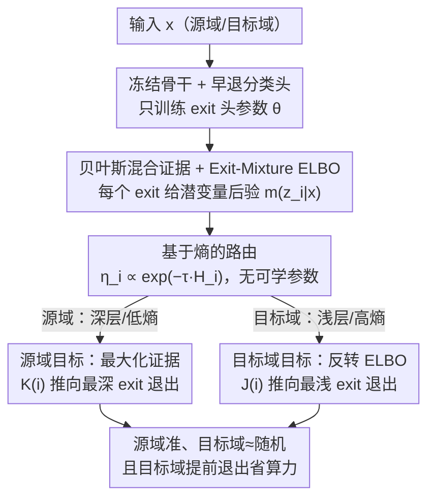

# Adaptive Bayesian Early-Exit Networks for Efficient Non-Transferable Learning

**会议**: CVPR 2026  
**论文**: [CVF Open Access](https://openaccess.thecvf.com/content/CVPR2026/html/Luan_Adaptive_Bayesian_Early-Exit_Networks_for_Efficient_Non-Transferable_Learning_CVPR_2026_paper.html)  
**代码**: 未公开  
**领域**: 模型版权保护 / 非迁移学习 / 动态早退网络  
**关键词**: Non-Transferable Learning, Early-Exit Network, 贝叶斯路由, 模型IP保护, 动态推理

## 一句话总结
ENL-DEE 把"非迁移学习（NTL）"重新设计成一个**贝叶斯早退网络**——冻结骨干、只训练若干早退分类头，用基于熵的路由让源域样本走到深层退出（保性能）、目标域样本在浅层就被踢出（非语义特征、精度接近随机），从而在大幅省训练/推理成本的同时强化模型版权保护。

## 研究背景与动机
**领域现状**：训练一个好模型代价高昂，模型本身是值钱的知识产权（IP）。非迁移学习（Non-Transferable Learning, NTL）是一类做"使用授权"的方法：让模型在授权的**源域**上保持高精度，同时**故意**在未授权的**目标域**上表现差，以此控制"模型只能在被允许的数据上用"。典型场景是医院 A 训练的诊断模型，被刻意限制在别的医院数据上失效。主流方法（NTL[36]、CUTI[37]）靠最大化源/目标域特征分布的差异、或强调授权域的私有风格特征来阻断跨域迁移。

**现有痛点**：作者指出现有 NTL 有三个硬伤。① **训练低效**——它们要重训整个骨干、更新全部参数，大模型上几乎不可行；② **推理低效**——源域和目标域数据都要走完整个网络，而目标域数据本来就是要让它"算不准"，让它跑完全程纯属浪费；③ **共享骨干带来优化冲突**——源域要"算得准"、目标域要"算不准"，但两者共用同一套参数，加上源/目标域类别重叠，这两个目标会互相打架，结果是源域精度被拖累、目标域又压不够狠，NTL 效果两头都不到位。

**核心矛盾**："在同一套参数上同时最大化源域、最小化目标域"本质是一对相互冲突的优化目标。现有确定性（deterministic）方法把每个输入和决策都当成确定的，忽略了不同域数据的不确定性，导致优化不稳、冲突难调。

**本文目标**：要一个既省训练/推理成本、又能把源/目标域优化**解耦**的 NTL 框架。

**切入角度**：作者观察到——深层特征语义丰富、利于分类；浅层特征低级、非语义、判别力弱。那么如果能让**源域走深、目标域走浅**，就天然实现了"源域准、目标域不准"，而且目标域提前退出还顺手省了算力。要可靠地做这个"走多深"的决策，需要刻画每个退出点的不确定性——于是用**贝叶斯**框架估计每个 exit 的置信度，把固定路由换成自适应路由。

**核心 idea**：用"冻结骨干 + 多个早退分类头 + 贝叶斯熵路由 + 域非对称损失"代替"重训共享骨干"，把 NTL 从一个全网络优化问题，变成一个只调退出头、按域分流退出深度的轻量问题。

## 方法详解

### 整体框架
ENL-DEE（Efficient Non-transferable Learning via Dynamic Early-Exit）建立在一个**冻结的骨干**上，在不同深度插入 $E$ 个早退分类头（exit）。给定输入 $x$，每个 exit $i$ 先由骨干输出一个该层潜变量 $z_i$ 的高斯后验 $m(z_i\mid x)$，再经该 exit 自己的分类头给出预测分布 $p_\theta^{(i)}(y\mid x)$。框架把"从哪个 exit 出"建模成一个离散路由变量 $d$，用每个 exit 预测分布的**熵**算出软路由权重 $\eta_i(x)$（越自信、熵越低，权重越大），并用一个**域相关的路由先验** $\pi^{(s)}/\pi^{(t)}$ 把源域往深层推、把目标域往浅层推。训练时**只更新各 exit 分类头的参数 $\theta$**，骨干始终冻结；源域和目标域用**符号相反**的损失，从而各自占用不同的 exit 参数集合，绕开共享骨干的优化冲突。推理时数据在中间层就能出结果——源域大概率落到最深 exit、目标域大概率被最浅 exit 踢出。

### 关键设计

**1. 冻结骨干、只训练早退分类头：把"重训全网"换成"只调退出口"**

现有 NTL 最大的成本来源是重训整个骨干。ENL-DEE 直接冻住骨干 $f_e$，骨干只负责为每个 exit 输出潜变量的高斯参数——均值 $f_e^\mu(x)$ 和协方差 $f_e^\Sigma(x)$，即 $m(z_i\mid x)=\mathcal N\!\big(z_i\mid f_e^\mu(x), f_e^\Sigma(x)\big)$；可学习参数 $\theta$ 只存在于各 exit 的分类头里。这样训练成本从"更新全部权重"降到"更新几个轻量分类头"。更关键的是，这一步也是解决优化冲突的物理基础：因为源域和目标域被路由到**不同**的 exit、各自优化各自的头参数（distinct parameter sets），"源域要准 / 目标域要不准"这对矛盾目标不再挤在同一套共享权重上互相覆盖，从根上缓解了优化冲突。

**2. Exit-Mixture ELBO：用贝叶斯混合把"该信哪个退出口"变成可优化的下界**

痛点是确定性 NTL 把每个退出决策当成固定的，无法刻画"这个样本在这一层到底有多可信"。ENL-DEE 从概率混合视角出发：整个预测似然是各 exit 作为混合分量、按路由权重 $\eta_i(x)$ 加权的边缘，
$$p_\theta(y\mid x)=\sum_{i=1}^E \eta_i(x)\!\int p_\theta(y\mid z_i)\,p_\theta(z_i\mid x, d{=}i)\,dz_i.$$
这个边缘一般不可解，于是引入摊销后验 $\{m(z_i\mid x)\}$ 和 $q(d\mid x)$，用 Jensen 不等式得到可优化的下界（Exit-Mixture ELBO）：
$$\mathcal L_{\text{ELBO}}(x,y)=\sum_{i=1}^E \eta_i(x)\Big[\mathbb E_{z_i\sim m}\log p_\theta(y\mid z_i)-\mathrm{KL}\big(m(z_i\mid x)\,\|\,p(z_i)\big)\Big]-\mathrm{KL}\big(q(d\mid x)\,\|\,\pi\big).$$
其中先验 $p(z_i)=\mathcal N(0,I)$。第一项让每个 exit 的预测与真值 $y$ 一致、同时用 KL 约束潜表示别太复杂；最后一项把数据相关的路由 $q(d\mid x)$ 对齐到**域相关先验** $\pi$（源域 $\pi^{(s)}$ 偏深、目标域 $\pi^{(t)}$ 偏浅）。潜变量用重参数化 $z_i=f(x,\epsilon),\ \epsilon\sim\mathcal N(0,I)$ 采样，使得在冻结骨干的前提下仍可梯度优化。这一设计把"早退路由"从启发式阈值升级成有理论依据的变分目标，置信度估计天然带进来。

**3. 基于熵的路由：用预测分布的熵当置信度，零额外参数地决定退出深度**

需要一个不引入新参数、又能反映"这个 exit 对该样本有多确定"的路由权重。作者直接用每个 exit 预测分布的香农熵
$$H_i(x)=-\sum_c p_\theta^{(i)}(y{=}c\mid x)\log p_\theta^{(i)}(y{=}c\mid x),$$
再经 Boltzmann 形式映射成路由权重
$$\eta_i(x)=\frac{\exp(-\tau H_i(x))}{\sum_{j=1}^E \exp(-\tau H_j(x))},\qquad \tau>0\ (\text{取 }\tau{=}1).$$
熵低（更自信）的 exit 拿到更大权重，熵高（不确定）的 exit 权重被压低。因为 $\eta_i$ 完全由 exit 自身输出的熵算出，**不含任何可学习参数**，所以前面 ELBO 里 $\theta$ 只属于分类头。这让"走多深"成为数据驱动的自适应决策，而不是写死的层选择。

**4. 域非对称的深度塑形目标：让源域"深而决断"、目标域"浅而摆烂"**

光有路由还不够，得用损失把源/目标域往相反方向拽。作者定义一个深度塑形系数 $K(i)=\mathbb I[i{=}E]-\mathbb I[i{<}E]$（最深 exit 取 $+1$、其余浅层取 $-1$）。**源域**最大化证据、同时塑形熵——惩罚浅层过早决断、鼓励在深层果断退出：
$$\mathcal L_s(x_s,y_s)=-\mathcal L_{\text{ELBO}}^{(s)}(x_s,y_s)+\alpha\sum_{i=1}^E \eta_i(x_s)\,K(i)\,H_i(x_s).$$
**目标域**则相反：用 $J(i)=-K(i)$ 反转熵塑形，并把 ELBO 整体"反着用"（线 1 惩罚预测拟合、奖励潜表示简单，同时把路由 $q(d\mid x_t)$ 软对齐到偏浅先验 $\pi^{(t)}$）：
$$\mathcal L_t(x_t,y_t)=\mathcal F^{(t)}(x_t,y_t)+\alpha\sum_{i=1}^E \eta_i(x_t)\,J(i)\,H_i(x_t),$$
其中 $\mathcal F^{(t)}$ 是把 ELBO 取反号的目标域版本。总目标按权重 $\beta$ 联合源/目标域：
$$\min_\theta\ \mathbb E_{(x_s,y_s)\sim\mathcal D_s}\mathcal L_s(x_s,y_s)+\beta\,\mathbb E_{(x_t,y_t)\sim\mathcal D_t}\mathcal L_t(x_t,y_t).$$
效果上，源域样本被推到最深 exit（深层语义特征 → 高精度），目标域样本被推到最浅 exit（非语义特征 → 精度接近随机），既实现了 NTL 的"源准目标差"，又让目标域提前退出省算力。这种"熵驱动的样本级自适应"与"KL 驱动的域级正则"之间的拉扯，正是源/目标域退出深度差异的来源。

### 损失函数 / 训练策略
- 总损失 = 源域损失 + $\beta\times$ 目标域损失，$\beta\ge 0$ 控制保护强度（消融显示 $\beta{=}1$ 最佳）。
- 熵塑形权重 $\alpha\ge 0$；路由温度 $\tau{=}1$。
- 训练只更新各 exit 分类头参数，骨干冻结；潜变量经重参数化采样以保证可微。
- ViT 上的默认配置（Design 1）：每个 exit 头为两层线性，分支接在第 3/6/9/11 个 transformer block 后。

## 实验关键数据

### 主实验
设置：源域上 NTL 方法精度应**尽量高**、目标域上应**尽量低**。指标除精度外用 **Performance Gain (PG)**：
$$\text{PG}=\big(Acc_s^{m}-Acc_s^{SL}\big)+\big(\overline{Acc}_t^{SL}-\overline{Acc}_t^{m}\big),$$
即"本方法相对普通监督学习 SL 在源域涨了多少 + 在目标域降了多少"，PG 越大越好。Baseline 为 SL（无保护）、NTL[36]、SOTA 的 CUTI[37]。

ViT 上 CIFAR-10 / STL-10 的 Target-Specified 任务（源/目标域精度与 PG，越大越好）：

| 方法 | 源域 | 源域精度 | 目标域精度 | PG |
|------|------|---------|-----------|-----|
| SL | CIFAR-10 | 83.22 | 62.60(STL) | 0.0 |
| NTL | CIFAR-10 | 76.00 | 10.50(STL) | 44.9 |
| CUTI | CIFAR-10 | 74.42 | 10.50(STL) | 43.3 |
| **ENL-DEE** | CIFAR-10 | **82.10** | 11.00(STL) | **50.5** |
| **ENL-DEE** | STL-10 | **77.82** | 10.10(CIFAR) | **40.1** |

ViT 上 ENL-DEE 把源域精度几乎保到 SL 水平（82.1 vs 83.2，而 NTL/CUTI 掉到 74~76），目标域照样压到 ~11%，PG 全面领先。ResNet-34 上（Table 1）ENL-DEE PG 51.7 / 38.9 与 NTL（54.9 / 38.0）持平、明显优于 CUTI（52.5 / 13.7）。

DomainNet（ResNet-34，6 域）更能看出差距——这是最能说明问题的一张表：

| 方法 | clipart | info | paint | qd | real | sketch |
|------|---------|------|-------|-----|------|--------|
| NTL (PG) | −6.45 | −1.86 | −6.20 | −38.75 | −9.15 | −8.69 |
| CUTI (PG) | −20.93 | −5.45 | −16.01 | −30.75 | −21.17 | −23.45 |
| **ENL-DEE (PG)** | **2.05** | **3.12** | **10.82** | **0.49** | **4.79** | **7.32** |

在 6 域复杂场景下 NTL/CUTI 的 PG **全线为负**（保护过头把源域也打崩了，最差 −38.75），而 ENL-DEE 在每个域组合上都保持**正 PG**，源域不崩、目标域被压住，是优化解耦最直接的证据。

### 退出分布统计（机制验证，PACS / ViT）
直接验证"源域走深、目标域走浅"是否真的发生（目标域为 S，数字为样本在各 exit 退出的占比）：

| 来源 | exit0 | exit1 | exit2 | exit3 | exit4 |
|------|-------|-------|-------|-------|-------|
| 源域 | 0.09% | 0.00% | 0.26% | 0.00% | **99.65%** |
| 目标域 | **95.70%** | 2.64% | 0.66% | 0.00% | 0.99% |

源域 99.65% 落到最深 exit4、目标域 95.70% 在最浅 exit0 就被踢出——退出行为和设计意图几乎完全吻合，目标域提前退出也直接兑现了推理省算力的承诺。

### 消融实验

| 配置 | 行为 | 说明 |
|------|------|------|
| $\beta=0$ | 退化为 SL（PG≈0） | 不施加目标域损失，无保护 |
| $\beta=1$ | **PG 最高（如 Real-World 16.94）** | 源/目标域损失平衡，最佳 |
| $\beta=2$ | PG 下降（如 4.69~9.94） | 保护过强，源域被拖累 |
| $\beta=3$ | PG 进一步下降甚至转负（−1.99） | 过度压制，源域精度崩 |
| Exit 头架构 Design 1/2/3 | 三种头/插入位置均有效，Design 1 最好 | 方法对头架构不敏感 |

Office-Home（ViT）的 $\beta$ 扫描显示 $\beta{=}1$ 是甜点：$\beta$ 太小没保护、太大把源域也牺牲掉。Design 1（两层线性头、接第 3/6/9/11 block）优于三层头（Design 2）和更浅插入位置（Design 3），说明退出头不必复杂。此外在 Swin Transformer、target-free（用 GAN 合成目标域）、digit 数据集水印所有权验证等设置上也都验证了有效性。

### 关键发现
- **退出分布表是全文最有说服力的证据**：99.65% vs 95.70% 的极端分离直接证明贝叶斯熵路由 + 域非对称损失确实把源/目标域分到了两端，而不只是"精度差出来了"。
- **DomainNet 上 baseline PG 全负、本方法全正**，说明现有 NTL 在多域、类别重叠重的复杂场景下会"保护过头连源域一起打崩"，而 ENL-DEE 的参数解耦真正避免了这种冲突。
- $\beta$ 是保护强度旋钮，$\beta{=}1$ 最优；过大反而损害源域可用性——NTL 的本质是 trade-off，这个消融把 trade-off 画得很清楚。

## 亮点与洞察
- **把"非迁移"和"早退效率"两件事用同一机制一并解决**：让目标域提前退出，既是"算不准"（非语义浅层特征），又顺手省了推理算力——一个设计同时吃到保护和效率两个收益，很巧。
- **冻结骨干 + 只训退出头**：把 NTL 的训练成本从"重训全网"压到"调几个轻量分类头"，这是让 NTL 在大模型上落地的关键工程取向，可直接迁移到任何已有预训练骨干。
- **零参数的熵路由**：用预测熵 + Boltzmann 当置信度路由，不引入额外可学习参数，既省事又让 ELBO 里的参数干净地只属于分类头——这个"用熵当软门控"的 trick 可复用到一般的动态早退/条件计算场景。
- **优化冲突的解法是"物理隔离"**：源/目标域走不同 exit、占不同参数集，从根上避开共享权重互相覆盖，比在同一套参数上调权重更彻底。

## 局限与展望
- **作者承认**：当前假设目标域是**静态**的；现实中目标域分布可能随时间漂移，如何在目标域演化时仍保持非迁移性是未来方向。
- **自己发现**：⚠️ 论文未给出与 baseline 的**训练/推理时间或 FLOPs 的定量对比**——"提升效率"主要靠"冻结骨干""提前退出"在逻辑上论证 + 退出分布间接佐证，缺一张直接的耗时/算力表，效率收益的量级不够实锤。
- 目标域损失里把 ELBO"反着用"（惩罚拟合、奖励潜表示简单）在直觉上合理，但这种反向优化是否会让浅层退出头学到退化/不稳定的表示，论文未深入分析。
- $\beta$、$\alpha$、$\tau$ 等超参对不同数据集的敏感性只给了 $\beta$ 的扫描，$\alpha/\tau$ 基本取固定值，鲁棒性证据有限。

## 相关工作与启发
- **vs NTL[36]**：NTL 靠最大化源/目标域特征分布差异、重训整个骨干来阻断迁移；本文冻结骨干、只训退出头，并用退出深度而非全局特征差异实现非迁移。复杂多域场景下 NTL 的 PG 会全线转负（保护过头），本文靠参数解耦保持正 PG。
- **vs CUTI[37]**：CUTI（SOTA）通过强调授权域私有风格特征阻断跨域，仍需更新全部参数、推理走完整网络；本文训练只调退出头、推理可中间层退出，且 ViT/DomainNet 上 PG 更高。
- **vs 普通早退网络（BranchyNet 等）**：传统早退网络对源/目标域**一视同仁**地为省算力而退出，无法服务 NTL；本文给源/目标域设了**相反**的退出目标（深 vs 浅），是首个把早退网络用于模型版权验证与使用授权的工作。

## 评分
- 新颖性: ⭐⭐⭐⭐⭐ 首次把动态早退网络 + 贝叶斯熵路由引入非迁移学习，用退出深度差异实现 IP 保护，视角新颖。
- 实验充分度: ⭐⭐⭐⭐ 覆盖 6 个数据集、多骨干、所有权验证/target-free 多任务，退出分布与 β 消融到位；但缺直接的效率（时间/FLOPs）定量对比。
- 写作质量: ⭐⭐⭐⭐ 动机清晰、贝叶斯目标推导完整；部分公式排版较密，初读门槛偏高。
- 价值: ⭐⭐⭐⭐ 给大模型时代的 NTL 提供了一条"冻骨干、只训退出头"的低成本落地路径，工程意义明确。

<!-- RELATED:START -->

## 相关论文

- [\[CVPR 2026\] AdaPrior: Bayesian-Inspired Adaptive Prior Correction for Long-Tailed Continual Learning](adaprior_bayesian-inspired_adaptive_prior_correction_for_long-tailed_continual_l.md)
- [\[CVPR 2026\] Towards Knowledge-augmented Bayesian Deep Learning For Computer Vision](towards_knowledge-augmented_bayesian_deep_learning_for_computer_vision.md)
- [\[CVPR 2026\] Efficient Unrolled Networks for Large-Scale 3D Inverse Problems](efficient_unrolled_networks_for_large-scale_3d_inverse_problems.md)
- [\[CVPR 2026\] Adaptive Data Augmentation with Multi-armed Bandit: Sample-Efficient Embedding Calibration for Implicit Pattern Recognition](adaptive_data_augmentation_with_multi-armed_bandit_sample-efficient_embedding_ca.md)
- [\[CVPR 2026\] Smart Replay: Adaptive Scheduling of Memory Rehearsal for Computational Resource-Aware Incremental Learning](smart_replay_adaptive_scheduling_of_memory_rehearsal_for_computational_resource-.md)

<!-- RELATED:END -->
