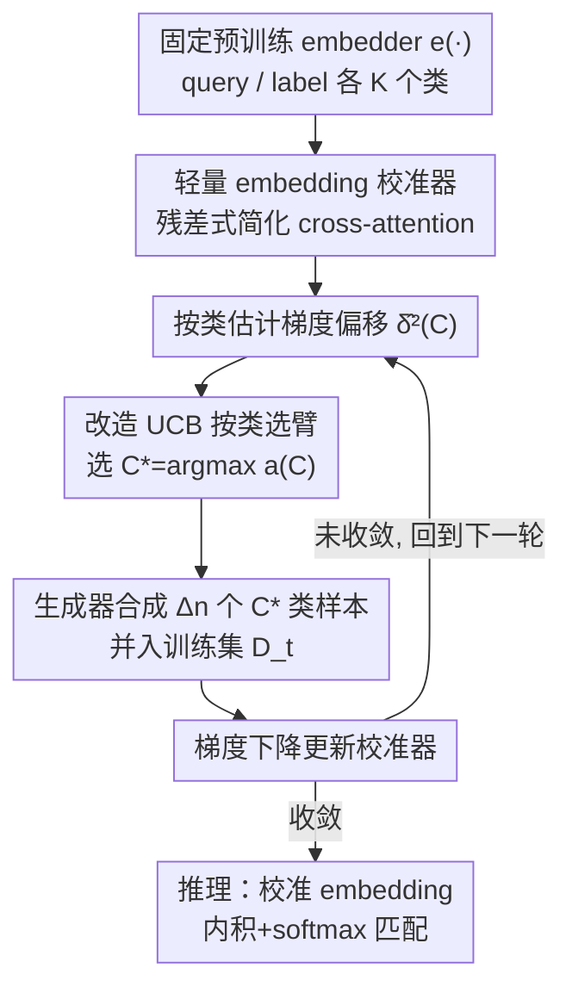

# Adaptive Data Augmentation with Multi-armed Bandit: Sample-Efficient Embedding Calibration for Implicit Pattern Recognition

**会议**: CVPR 2026  
**论文**: [CVF Open Access](https://openaccess.thecvf.com/content/CVPR2026/html/Tang_Adaptive_Data_Augmentation_with_Multi-armed_Bandit_Sample-Efficient_Embedding_Calibration_for_CVPR_2026_paper.html)  
**代码**: 待确认  
**领域**: 少样本学习 / 数据增强 / Embedding 校准  
**关键词**: 嵌入校准, 多臂老虎机, 自适应数据增强, 少样本, 长尾识别

## 一句话总结
ADAMAB 在冻结的预训练 embedding 模型之上训练一个轻量"校准器"，并用改造过的 UCB（多臂老虎机）算法**按类**自适应地决定该合成增强哪些数据，从而在每类只有 2–5 个初始样本的少样本长尾识别任务上把准确率提升最多约 40%，且有收敛性的理论保证。

## 研究背景与动机
**领域现状**：用 LLM/VLM 做隐式模式识别（长尾主题分类、细粒度类别、安全意图分类等）时，主流做法是 in-context learning、embedding 相似度检索、reranker，或者对基础模型做微调/PEFT。

**现有痛点**：这些做法在"数据稀缺 + 长尾知识"的场景同时栽跟头。一方面，基础模型的预训练语料没覆盖这些细分知识，且它们是"为生成而训练"——更擅长拟合似然 $p(x\mid y)$ 而不是分类需要的后验 $p(y\mid x)$，所以零样本分类准确率本就不高；另一方面，微调要么算力贵到离谱（CLIP 都有 0.4B 参数），要么干脆不可行（闭源模型只给 API、连 LoRA 都用不上）。主动学习能省标注，但它假设有个**大的**无标注样本池可挑，长尾少样本场景根本没有这个池子。合成数据增强能摆脱人力，但现有方法多是**随机增强**——既浪费先进生成模型（GPT-Image-1 这类）的非平凡调用成本，又会在少样本训练中引入高方差梯度，把收敛带偏。

**核心矛盾**：少样本下，小训练集算出的经验梯度和真实梯度之间存在系统性的"梯度偏移"（gradient shifting），而盲目随机增强并不能高效地把这个偏移压下去——它只在期望意义上无偏，方差却很大。

**本文目标**：在不碰基础模型参数、每类只有极少初始样本的约束下，找到一种"花最少的生成预算、收敛又快又稳"的数据增强策略。

**切入角度**：把"该合成哪类数据"建模成一个多臂老虎机问题——每个类是一只臂，每轮选一只臂去合成 $\Delta n$ 个样本，目标是让选出来的类最大程度降低梯度偏移。

**核心 idea**：用"在固定 embedding 上训轻量校准器" + "用改造的 UCB 按类做自适应数据增强"两件事组合，既省算力又省数据，还能给出收敛保证。

## 方法详解

### 整体框架
ADAMAB 解决的是：固定一个预训练 embedder $e(\cdot)$，只训练一个挂在它上面的轻量校准器，去识别长尾/隐式模式；训练数据靠"按需合成"补齐。整条 pipeline 是一个**"选类 → 合成 → 训练"交替迭代**的闭环：每一轮，先用当前模型估计每个类的梯度，再用 MAB 采集函数挑出"增强后最能压低梯度偏移"的那个类 $C_t^*$，调生成模型为该类合成 $\Delta n$ 个样本并入训练集，然后跑一步梯度下降更新校准器，循环到收敛。推理时则用校准后的 query/label embedding 做内积 + softmax 得到匹配分数。

### 关键设计

**1. 轻量 embedding 校准器：在不碰大模型参数的前提下把 embedding "掰正"**

痛点是基础模型既不让动参数、动了也太贵，但它的 embedding 在长尾知识上"差一口气"。ADAMAB 不去改 embedder，而是在它输出之上各挂一个小网络，对 query 和 label 的 embedding 做**残差式修正**：

$$\tilde{e}_\psi(q) = e(q) + Q(e(q);\psi), \qquad \tilde{e}_\phi(p_C) = e(p_C) + P(e(p_C);\phi)$$

校准后用内积 + softmax 算 query 对每个类标签的匹配分数，并以交叉熵训练 $\psi,\phi$：$s(q,p_C)=\frac{\exp(\tilde{e}_\psi^T(q)\tilde{e}_\phi(p_C))}{\sum_{C'}\exp(\tilde{e}_\psi^T(q)\tilde{e}_\phi(p_{C'}))}$，损失 $l=-\log s(q,p_y)$。残差结构保证最大限度保留预训练 embedding 的原始效用，校准器只学"增量"。作者点明这两个小网络可以看作**单头、value 取单位阵的简化 cross-attention**。实现上每个校准器是三层前馈 + 残差，维度 $(d_e/4, d_e/4, d_e)$，参数量只有约 0.6M–2.7M（相对 0.4B 的 CLIP 几乎可忽略），所以非常适合资源受限的少样本训练。

**2. 自适应数据增强 = 压低"梯度偏移"的采集问题**

痛点是少样本下经验梯度 $g_t=\frac{1}{|D_t|}\sum_{x\in D_t}\nabla l(x;w_t)$ 偏离真实梯度 $\nabla L(w_t)$，作者把这个偏差定义为梯度偏移 $\delta_t^2=\Vert g_t-\nabla L(w_t)\Vert^2$。论文先给出一条收敛界（Theorem 1）：在 $\beta$-smooth 假设和 $\eta_t\le 1/\beta$ 下，

$$\inf_{t\le T}\Vert\nabla L(w_t)\Vert^2 \le \frac{2L(w_1)}{\sum_t\eta_t}+\frac{\sum_t\eta_t\delta_t^2}{\sum_t\eta_t}$$

也就是说**收敛速度直接被梯度偏移 $\delta_t^2$ 拖累**。于是把"增强什么数据"建成采集函数 $a(x;w_t)$：每轮选 $x_t^*=\arg\max_x a(x;w_t)$ 并入训练集，目标是补进去之后让梯度偏移最小。理想采集函数就是直接最小化补样后的偏移（论文 Eq.8）。但这里有两个拦路虎：① 样本空间通常是无限的，没法直接搜最优样本；② 真实梯度 $\nabla L(w_t)$ 在少样本下根本不知道。这两点正是下一个设计要拆解的。

**3. 改造 UCB 的按类 MAB 选择 + 置信界放松：把无限搜索压成有限选臂，并保证收敛**

针对上面两个拦路虎：① **把"选样本"换成"选类"**——类数 $K$ 有限，决策空间立刻可解；选定类 $C_t^*$ 后再用生成器从该类条件分布 $p_x(\cdot\mid C_t^*)$ 随机合成 $\Delta n$ 个样本。② **用当前样本估计真实梯度**，但少样本估计不准，于是借鉴 MAB 里的 UCB，给采集函数加一个置信项补偿估计不确定性。最终的采集函数（Eq.9）是：

$$a(C;w_t,D_{t-1}) = -\hat{\delta}_t^2(C) + \frac{\alpha}{\sqrt{n_{t-1}+\Delta n}}\sqrt{\frac{1}{n_{C,t-1}}}$$

其中第一项 $-\hat\delta_t^2(C)$ 是"利用"——估计把 $\Delta n$ 个 $C$ 类样本补进去后的梯度偏移（用各类经验梯度 $\nabla\hat L_C$ 和类间平衡的整体梯度 $\nabla\hat L=\frac1K\sum_C\nabla\hat L_C$ 估计）：

$$\hat{\delta}_t^2(C)=\Big\Vert \frac{\Delta n}{n_{t-1}+\Delta n}\nabla\hat L_C(w_t) + \frac{n_{t-1}}{n_{t-1}+\Delta n}\nabla L(D_{t-1};w_t) - \nabla\hat L(w_t)\Big\Vert_2^2$$

第二项 $\frac{\alpha}{\sqrt{n_{t-1}+\Delta n}}\sqrt{1/n_{C,t-1}}$ 是"探索"——某类已有样本 $n_{C,t-1}$ 越少，这一项越大，越倾向去探索它。**关键创新在于那个 $\sqrt{n_{t-1}+\Delta n}$ 的放松因子**：标准 UCB 没有这个分母，作者证明（Sec. A.2 / Remark 1）正是这个放松让 Theorem 2 的收敛成立——它鼓励训练后期仍保持探索、让选择更均匀，使瞬时 regret 随轮次 $t$ 增大而衰减。但作者强调这**不等于随机均匀选择**：当各类样本数趋于均衡时，主导项重新变成压低梯度偏移的第一项，从而让收敛更快更稳。最终 ADAMAB 拿到 $\inf_{t\le T}\mathbb{E}\Vert\nabla L(w_t)\Vert^2\le \mathcal{O}(1/T)+\mathcal{O}(\sqrt{\log T/T})+\sup_t\inf_C\delta_t^2(C)$，最后一项是任何自适应增强能达到的最小偏移、通常可忽略，所以 $T$ 增大时近似收敛到驻点。据作者称，这是**首个带收敛保证的少样本自适应数据增强框架**。

### 损失函数 / 训练策略
训练目标是校准器的交叉熵分类损失 $l(q,y)=-\log s(q,p_y)$。训练流程见 Algorithm 1：每轮先算各类经验梯度和平衡梯度、再算每类的 $\hat\delta_t^2(C)$ 与采集函数、选臂 $C_t^*$、合成并入数据、做一步梯度下降，交替进行直到收敛。每类合成样本上限设为 $3\Delta n$（文本 $\Delta n=5$，OxfordPets $\Delta n=3$，Flowers102/CUB200 $\Delta n=2$）。生成器：文本用 GPT-4o-mini，图像用 GPT-Image-1-mini；embedder 文本用 OpenAI-text-embedding-3-small / QWen3-emb-06b，图像用 CLIP-ViT-Large / Voyage-multimodal-3。

## 实验关键数据

数据集覆盖文本（MultiWD 6 类、Forbidden Question Set 13 类、TREC 30 类）与图像（OxfordPets 37 类、Flowers102 102 类、CUB200 200 类），初始数据每类仅 2–5 个。

### 主实验
文本任务（节选 zero-shot 准确率，括号为相对原 embedder 的提升）：

| 方法 | MultiWD | FQS | TREC | 参数 |
|------|---------|-----|------|------|
| GPT-4o-mini (ICL) | 37.89% | 80.31% | 60.03% | n/a |
| OpenAI-emb-3-small（原始） | 39.21% | 72.92% | 35.03% | n/a |
| Calibration w/ 仅初始集 | 50.66% (+11.45%) | 82.15% (+9.23%) | 46.80% (+11.77%) | +2.65M |
| Calibration w/ 随机增强 | 56.83% (+17.62%) | 86.15% (+13.23%) | 57.56% (+22.53%) | +2.65M |
| **Calibration w/ ADAMAB** | **58.15% (+18.94%)** | **89.54% (+16.62%)** | **61.63% (+26.60%)** | +2.65M |

图像任务（zero-shot，CLIP-ViT-Large 为 embedder）：

| 方法 | OxfordPets | Flowers102 | CUB200 | 参数 |
|------|-----------|-----------|--------|------|
| CLIP-ViT-Large（原始） | 82.88% | 60.99% | 33.18% | 0.4B |
| Calibration w/ 仅初始集 | 90.95% (+8.07%) | 90.61% (+29.62%) | 62.44% (+29.26%) | +0.66M |
| Calibration w/ 随机增强 | 91.90% (+9.02%) | 90.26% (+29.27%) | 64.96% (+31.78%) | +0.66M |
| **Calibration w/ ADAMAB** | **93.20% (+10.32%)** | **93.17% (+32.18%)** | **68.60% (+35.42%)** | +0.66M |

在相同增强预算下，ADAMAB 一致优于随机增强；且校准器（仅 0.66M–2.65M 参数）就能把 CLIP/embedding 模型大幅拉升，甚至超过用来生成数据的 GPT-4o-mini 本身的分类准确率——因为校准器把基础模型擅长的"生成似然"蒸馏并收敛到"分类后验"上。

### 消融实验
| 配置 | 现象 | 说明 |
|------|------|------|
| 仅初始集 vs +随机增强 vs +ADAMAB | 准确率逐级上升 | 合成数据有用，自适应选类比随机更有用 |
| 增强轮数 / 每类样本数渐增（Fig.3） | 先升后降 | 样本多到一定程度后，小生成器合成数据同质化 → 过拟合掉点 |
| 探索系数 $\alpha=0$ | 明显劣于 $\alpha>0$ | $\alpha=0$ 时贪心选最小经验偏移的类，但少样本估计偏差大 → 高 regret、收敛差 |
| $\alpha>0$（Fig.4） | 不敏感，略增 | 少样本下需要探索来稳住收敛，印证置信界放松的必要性 |

### 关键发现
- **MAB 选类 + 探索是涨点关键**：去掉探索（$\alpha=0$）退化成对噪声很大的经验梯度偏移做贪心，反而最差；只要 $\alpha>0$ 性能就稳，且对具体取值不敏感。
- **合成数据不是越多越好**：小生成器（GPT-4o-mini / GPT-Image-1-mini）即便精调 prompt 和 temperature 仍会产出同质样本，超过某个量后多样性不足导致过拟合，准确率回落——这给"增强预算上限设 $3\Delta n$"提供了实证依据。
- **越细粒度/长尾，校准收益越大**：Flowers102、CUB200 这类细粒度任务上，校准带来 +30% 量级的绝对提升。

## 亮点与洞察
- **把数据增强重写成 MAB 选臂**：用"每类一只臂、按梯度偏移做采集函数"把无限的样本搜索空间压成有限的类选择，既让最大化可解，又能套用 UCB 的探索-利用框架，思路干净。
- **置信界放松带来理论保证**：在标准 UCB 上乘 $\sqrt{n_{t-1}+\Delta n}$ 这一改动看似细微，却是收敛证明成立的关键，把"自适应数据增强"从启发式做成了有 regret 界的算法——这是论文最"啊哈"的点。
- **校准器超越生成器本身**：用 GPT-4o-mini 生成数据训出的校准器，分类准确率反超 GPT-4o-mini 直接分类，直观解释了"生成模型擅长似然、分类要后验"的鸿沟，也说明 embedding 校准是把生成能力转成判别能力的低成本通道。
- **可迁移 trick**：残差式轻量校准器（单头、value=单位阵的简化 cross-attention）是一个通用的"在冻结 embedding 上薄薄加一层"的范式，可迁移到任何只给 API、不让微调的闭源 embedding 服务。

## 局限与展望
- **依赖生成器质量与多样性**：方法的天花板被小生成器的同质化卡住（消融已显示样本过多反而掉点）；换更强生成器成本又上去了，"省成本"和"数据多样性"之间仍有张力。
- **梯度偏移估计仍是近似**：$\hat\delta_t^2(C)$ 用当前少量样本估计真实梯度，本身有偏；论文靠置信界放松缓解，但极端少样本（如每类 2 个）下估计噪声有多大、对选臂的影响，文中主要靠 $\alpha$ 兜底，⚠️ 这部分稳健性边界以原文理论分析为准。
- **类粒度选择的代价**：选"类"而非"样本"虽然让问题可解，但一轮只增强一个类、且同类内随机生成，可能错过"某个类内特定难样本"才是真正有用的情形。
- **评测以分类任务为主**：是否能推广到检索、排序等非分类的模式识别任务，文中未充分展开。

## 相关工作与启发
- **vs PEFT（LoRA / Adapter）**：PEFT 仍要访问并改基础模型参数，闭源 API 模型上不可用；ADAMAB 完全 embedder-agnostic，只在输出 embedding 上挂校准器，适配闭源场景。
- **vs 主动学习**：主动学习从大无标注池里挑信息量高的样本，依赖大池子 + 人工标注；ADAMAB 在没有大池子的少样本场景，转而"合成"而非"挑选"，并自动给合成样本带标签（来自被选类），去掉了人力。
- **vs 随机数据增强**：随机增强期望无偏但方差大，少样本下梯度偏移大、收敛次优；ADAMAB 用改造 UCB 显式压低偏移并给出 regret 界，相同预算下更快更稳。

## 评分
- 新颖性: ⭐⭐⭐⭐⭐ 首个带收敛保证的少样本自适应数据增强框架，MAB 选类 + 置信界放松的组合干净且有理论支撑
- 实验充分度: ⭐⭐⭐⭐ 跨文本/图像 6 个数据集、对比 ICL/reranker/embedding 多类基线，消融覆盖样本量与探索系数；但缺与更多自适应增强方法的横向对比
- 写作质量: ⭐⭐⭐⭐ 动机—理论—算法链条清晰，理论部分需对照附录才能完全跟上
- 价值: ⭐⭐⭐⭐ 面向"闭源 embedding + 少样本长尾"这一现实痛点，低成本、可即插，落地价值高

<!-- RELATED:START -->

## 相关论文

- [\[CVPR 2026\] DREAM: Document Recognition with Explicit Adaptive Memory](dream_document_recognition_with_explicit_adaptive_memory.md)
- [\[CVPR 2026\] OntoAug: Rethinking Generative Data Augmentation via Ontology Guidance](ontoaug_rethinking_generative_data_augmentation_via_ontology_guidance.md)
- [\[CVPR 2026\] Adaptive Bayesian Early-Exit Networks for Efficient Non-Transferable Learning](adaptive_bayesian_early-exit_networks_for_efficient_non-transferable_learning.md)
- [\[CVPR 2026\] Cross-View Distillation and Adaptive Masking for Incomplete Multi-View Multi-Label Classification](cross-view_distillation_and_adaptive_masking_for_incomplete_multi-view_multi-lab.md)
- [\[CVPR 2026\] Rethinking BCE Loss for Multi-Label Image Recognition with Fine-Tuning](rethinking_bce_loss_for_multi-label_image_recognition_with_fine-tuning.md)

<!-- RELATED:END -->
