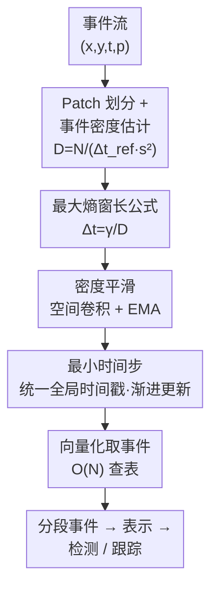

# Adaptive Spatial-Temporal Window: Unlocking the Potential of Event Cameras in Heterogeneous Velocity Scenarios

**会议**: CVPR 2026  
**论文**: [CVF Open Access](https://openaccess.thecvf.com/content/CVPR2026/html/Sui_Adaptive_Spatial-Temporal_Window_Unlocking_the_Potential_of_Event_Cameras_in_CVPR_2026_paper.html)  
**代码**: 无（论文未公开链接）  
**领域**: 事件相机 / 神经形态视觉  
**关键词**: 事件相机, 事件切分, 最大熵, 异速场景, 目标检测与跟踪

## 一句话总结
针对一个画面里既有快物体又有慢物体的"异速场景"，本文提出 ASTW 事件切分策略：把像素平面切成小 patch，基于最大熵原理推导出"每个 patch 的最优时间窗 $\Delta t = \gamma / D$"的解析公式（$D$ 是事件密度），再用向量化 $O(N)$ 实现，让每个空间区域自适应选窗，目标检测最高 +2.6 mAP、跟踪最高 +2.2 SR。

## 研究背景与动机
**领域现状**：事件相机输出的是异步事件流 $(x,y,t,p)$，下游算法（检测、跟踪）几乎都要先把流"切段"再转成 event frame/voxel 之类的表示。切段（partitioning）是几乎所有事件视觉的第一步，主流做法是**固定时间窗（Fixed Time Window）**或**固定事件数（Fixed Number of Events）**。

**现有痛点**：固定策略用一套预设规则套整个视野（FOV），既不随场景动态变化，也对所有空间位置一视同仁——快物体需要短窗（否则拖影模糊），慢物体需要长窗（否则信息不够）。已有的**自适应**策略（ATS、AEC、Adaptive Global Decay、SpikeSlicer 等）只做了**时间自适应**：它们对整帧统一估一个最优窗长，能应付"单个物体速度随时间变"的情况，却处理不了"同一时刻 FOV 里多个物体速度各不相同"的**空间异质性**。

**核心矛盾**：现实场景常常是**异速场景（Heterogeneous Velocity Scenarios, HVS）**——既有时间异质又有空间异质。要处理它，切分必须同时具备**时间自适应**和**空间局部性**。但同时考虑空间局部性的少数方法要么没自适应（TORE 在每个像素维护定长队列），要么算力太贵（Event Lifetime 要逐事件估速度推算寿命，56 µs/event 且对噪声敏感）。

**本文目标 / 切入角度**：设计一个**既局部又自适应、还算得快**的切分策略。作者的关键观察是：事件数量和运动满足 $N(\Delta t)=c\cdot L\cdot v\cdot \Delta t$（亮度恒定假设下，事件由运动触发，边长 $L$ 越长、速度 $v$ 越快，单位时间产生的事件越多）。于是"该选多长的窗"本质上由局部的 $L\cdot v$ 决定，而这个量恰好可以用**统计上易得的事件密度**间接代替，无需显式估速度。

**核心 idea**：把像素平面切成不重叠 patch，用**最大熵原理**为每个 patch 推出最优窗长 $\Delta t_{ij}=\gamma/D_{ij}$，用事件密度 $D$ 替代昂贵的速度估计，再向量化到 $O(N)$。

## 方法详解

### 整体框架
ASTW 的目标只有一个：**给每个空间 patch 单独算出此刻应该用多长的时间窗去取事件**。整体流程是一个随时间滚动的循环：先在一个参考窗 $\Delta t_{\text{ref}}$ 内统计每个 patch 的事件密度 $D_{ij}$ → 对密度做空间平滑+EMA 时间平滑得到鲁棒的 $\bar D_{ij}$ → 用解析公式把 $\bar D_{ij}$ 换算成每个 patch 的窗长 $\Delta t_{ij}$ → 用向量化查表按各自窗长取事件、并用"最小时间步"统一推进全局时间戳。整个过程不需要训练，是个纯几何/统计的预处理模块，可以插在任意检测/跟踪网络前面。

### 关键设计

**1. 最大熵窗长公式：把"该选多长窗"变成对事件密度的一次除法**

痛点是：要给每个 patch 选最优窗，最直接的办法是估出局部的边长 $L$ 和速度 $v$，但逐 patch 估速度又贵又不稳。作者绕开它——从**信息熵**入手。把事件转成最简单的二值 Event Frame（有事件为 1、无为 0），一个 patch 的信息熵为
$$H_{ij}=-p_{ij}\log_2 p_{ij}-(1-p_{ij})\log_2(1-p_{ij}),$$
其中 $p_{ij}$ 是该 patch 内非零像素占比。当 $p_{ij}=1/2$ 时熵取最大值 1 bit——直觉上就是"patch 里物体边缘最清晰、亮暗一半一半"。作者据此立两条约束：**局部信息最大化**（每个 patch 都尽量 $p=1/2$）与**空间一致性**（所有 patch 信息量均衡，都取 $1/2$）。由于 $p_{ij}=L_{ij}v_{ij}\Delta t_{ij}/s^2$，令所有 patch 满足 $p=1/2$ 得到
$$\frac{c\cdot L_{ij}\cdot v_{ij}\cdot \Delta t_{ij}}{s^2}=\gamma,$$
$\gamma$ 是信息常数。这条式子直接说明：**边越长、动越快，窗就该越短**。再定义事件密度
$$D_{ij}=\frac{N_{ij}}{\Delta t_{\text{ref}}\cdot s^2}=\frac{c\cdot L_{ij}\cdot v_{ij}}{s^2},$$
代入即得极简结论 $D_{ij}\cdot \Delta t_{ij}=\gamma$，也就是 $\Delta t_{ij}=\gamma/D_{ij}$。这一步的巧妙在于：$D$ 只是"参考窗内数一下事件个数"，统计上极易得到，于是把昂贵的速度估计偷换成了一次密度统计+除法，这是 ASTW 又快又自适应的根源。

**2. 密度平滑（空间卷积 + EMA）：让窗长估计在多尺度和快变下不抖**

纯靠 Eq.4 的瞬时密度 $D_{ij}$ 不鲁棒：物体可能横跨多个 patch（空间尺度多样），也可能运动突变（时间上抖）。作者对密度图做两重平滑——空间上用一个 $n\cdot s$ 大小的卷积核 $K$ 把相邻 patch 的密度融合（兼顾不同空间尺度），时间上用指数滑动平均 EMA 融合历史：
$$\widetilde{D}_{ij}=(K*D)_{ij},\qquad \bar D_{ij}(t)=\alpha\widetilde{D}_{ij}(t)+(1-\alpha)\bar D_{ij}(t-1).$$
最终窗长改写为带截断的形式 $\Delta t_{ij}=\mathrm{clamp}\!\big(\frac{\gamma}{\bar D_{ij}+\varepsilon},\Delta t_{\min},\Delta t_{\max}\big)$（$\varepsilon=10^{-3}$ 防除零）。论文可视化（Fig.3）显示，平滑后能明显抑制 patch 边界处的伪影。这一步让"密度→窗长"这个映射在真实噪声下可用，是公式落地的关键补丁。

**3. 最小时间步策略：让逐 patch 各自选窗不破坏场景的因果一致性**

如果每个 patch 真的各取各的窗、各自推进时间，整个画面的时间戳会乱套、还可能漏事件。作者让**所有 patch 共享同一个结束时间戳**，各自按自己的 $\Delta t_{ij}$ 向前取事件；全局时间戳每次只前进**所有窗里最小的那个** $\Delta t_{\text{step}}=\min(\Delta t_{ij})$。这样保证了渐进式更新、不漏任何事件（代价是某些 patch 的窗会有重叠，实验证明可接受）。它的价值在于：既给了每个区域独立的窗长自由度，又把它们钉在统一的时间参考上——这正是"快物体所在 patch 能立刻缩短窗、毫秒级响应突然闯入的行人"的机制来源。

**4. 向量化实现：把逐 patch 循环压成 $O(N)$**

朴素实现要对每个 patch 循环取事件（Algorithm 1 第 6 行），慢。作者把所有事件坐标 $(x,y)$ 整除 patch 大小 $s$ 映射到 patch 索引 $(g_x,g_y)$，以索引在 $\Delta t_{ij}$ 表里向量化查出每个事件对应的窗长，再用时间戳比较一次性保留落窗内的事件——全程无 per-patch 循环，复杂度 $O(N)$。实测平均 7.43 µs/event，与 TORE（2.04）同量级，比 Event Lifetime（56.38）快 7.6×、比 Adaptive Global Decay（16.76）快 2.3×。这一步把"理论上能算"变成"实时能用"。

## 实验关键数据

### 主实验
检测在 Gen1（304×240，车/行人），跟踪在 EventVOT 与自建 HetVel。对所有方法保持表示策略、训练配置、网络完全一致，只换切分策略。

| 任务 / 模型 | 指标 | ASTW | 次优 | 提升 |
|------|------|------|------|------|
| 检测 ResNet-50 | mAP / AP50 | 50.6 / 76.0 | 48.3 / 75.2 (TORE) | +2.3 / +0.8 |
| 检测 Swin V2 | mAP / AP50 | 46.6 / 75.2 | 44.0 / 73.2 | +2.6 / +2.0 |
| 检测 RVTs(recurrent) | mAP / AP50 | 48.3 / 75.4 | 47.3 / 73.8 (TORE) | +1.0 / +1.6 |
| 跟踪 EventVOT | SR / PR / NPR | 62.3 / 60.5 / 85.1 | 62.1 / 60.5 / 84.8 | +0.2 / 0 / +0.3 |
| 跟踪 HetVel | SR / PR / NPR | 50.7 / 58.5 / 84.9 | 48.6 / 56.3 / 82.7 | +2.1 / +2.2 / +2.2 |

ASTW 在所有配置（前馈/循环、CNN/Transformer 骨干）上都是最好。一个有意思的现象：前馈模型的增益明显大于循环模型——作者归因于循环架构（RVTs 的 LSTM）训练时本就在学时间依赖，对切分质量的依赖更小。跟踪任务整体对切分更不敏感（更依赖特征响应强度），所以 EventVOT 上提升较小；但在专为 HVS 设计的 HetVel 上 ASTW 优势被显著放大（+2.1~2.2）。

### 消融实验
Gen1 + ResNet-50。

| 配置 | mAP | 说明 |
|------|------|------|
| Full model | 50.6 | 完整 ASTW |
| w/o Patch 划分 | 46.6 | 掉 4.0，去掉空间局部性影响最大 |
| w/o 因果一致性 | 49.4 | 掉 1.2，统一时间参考很关键 |
| w/o 空间平滑 | 50.1 | 掉 0.5 |
| w/o 时间平滑(EMA) | 50.3 | 掉 0.3 |

不同事件表示上 ASTW 也一致优于固定窗 baseline：Time Surface 53.0 vs 51.3、Event Count 52.1 vs 50.1、Voxel Grid 49.0 vs 47.6，说明 ASTW 是表示无关的即插即用前端。

### 关键发现
- **Patch 划分是最大贡献来源**：去掉它直接掉 4.0 mAP，远超其余组件，印证了本文最核心的卖点——空间局部性。其余三件（因果一致性 1.2、空间平滑 0.5、时间平滑 0.3）依次递减但都有正贡献。
- **超参很稳**：patch size=4 最佳（统计稳定性与局部性的平衡），信息常数 $\gamma$ 在 1.0–2.0 内 mAP 几乎不变（取 1.7），参考窗 $\Delta t_{\text{ref}}$ 在 250–500 ms 稳定（取 250 ms），$\Delta t_{\min}=10$ ms、$\Delta t_{\max}=250$ ms 最优。
- **极端场景能力**：快物体场景下 ASTW 能把 1 秒事件流切成约 800–1000 段（平均 1 ms 出一帧），可有效处理高达 2400 px/s 的运动速度；估算时速 100 km/h 的车在单段内只移动 0.03 m，大幅压低切分引入的延迟。

## 亮点与洞察
- **用最大熵把"选窗"变成一行解析公式**：从信息熵 $p=1/2$ 最优出发，推出 $\Delta t=\gamma/D$，再用事件密度替掉速度估计——把一个看似需要光流/速度估计的难题，化简成"数事件个数+除法"，这是全文最漂亮的一步。
- **事件密度 $D=N/(\Delta t_{\text{ref}} s^2)$ 是隐式的局部 $Lv$ 代理**：免去逐像素估速，既省算力又更抗噪，思路可迁移到任何"需要局部运动强度但又不想显式估速度"的事件任务（如事件去噪、自适应表示）。
- **HetVel 数据集填空白**：首个面向异速场景的 RGB-事件双模态数据集（FLIR Blackfly-S + Prophesee EVK-4，RGB 100 fps 辅助打高频标签，33 段视频含交通/运动），为 HVS 研究提供了真实 benchmark。

## 局限与展望
- **窗重叠被"实验证明可接受"带过**：最小时间步策略会让部分 patch 的时间窗重叠，论文只说实验上可接受，未量化重叠带来的冗余事件比例或对下游的影响，⚠️ 这块解释偏轻。
- **依赖亮度恒定/运动触发假设**：建模假设事件仅由物体运动触发（brightness constancy），对光照剧变、闪烁、强噪声等非运动触发事件，密度估计可能失真，论文未讨论。
- **跟踪增益有限**：EventVOT 上几乎与 TORE/固定窗持平，说明 ASTW 的优势主要体现在对切分敏感的检测任务和真正异质的 HVS 上；对特征响应主导的任务收益小。
- **未开源 + 关键复杂度细节在补充材料**：$O(N)$ 复杂度分析、各 baseline 实现细节、HetVel 细节都放在 Supplementary，正文不可完全自洽复现。

## 相关工作与启发
- **vs 固定策略（Fixed Time Window / Fixed Number of Events）**：固定窗用一套规则套全 FOV，既不自适应也无空间局部性；ASTW 逐 patch 自适应选窗，检测最高 +2.6 mAP。
- **vs 纯时间自适应（ATS / AEC / Adaptive Global Decay / SpikeSlicer）**：它们对整帧统一估窗，能处理时间异质但处理不了同一时刻多物体异速；ASTW 引入 patch 级空间局部性补上这块。
- **vs 兼顾局部性的方法（TORE / Event Lifetime）**：TORE 用定长像素队列保证局部性但无自适应；Event Lifetime 逐事件估速度做到了局部+自适应却太贵（56 µs/event）且对噪声敏感。ASTW 用密度代理同时拿下局部性+自适应+效率（7.43 µs/event），是表 1 里唯一两栏全 ✓ 且算得快的。
- **vs 表示级方法（SITS / VK-SITS）**：它们在表示阶段按局部速度调整，但仍依赖上游切分定窗，难同时满足快物体低延迟和慢物体信息充分；ASTW 在切分阶段就解决，二者正交可叠加。

## 评分
- 新颖性: ⭐⭐⭐⭐ 用最大熵把空间局部+时间自适应统一进一行解析公式，事件密度代理速度的思路很干净
- 实验充分度: ⭐⭐⭐⭐ 覆盖检测/跟踪、前馈/循环、CNN/Transformer，含细致超参敏感性，并自建 HetVel；但关键复杂度与数据集细节藏在补充材料
- 写作质量: ⭐⭐⭐⭐ 推导清晰、图示到位，公式与动机咬合紧
- 价值: ⭐⭐⭐⭐ 即插即用、表示无关的切分前端 + 首个 HVS 双模态数据集，对神经形态视觉社区实用

<!-- RELATED:START -->

## 相关论文

- [\[CVPR 2026\] Event Structural Valley: A Unified Theoretical and Practical Framework for Event Camera Autofocus](event_structural_valley_a_unified_theoretical_and_practical_framework_for_event_.md)
- [\[CVPR 2026\] Event-based Visual Deformation Measurement](event-based_visual_deformation_measurement.md)
- [\[CVPR 2026\] Event Stream Filtering via Probability Flux Estimation](event_stream_filtering_via_probability_flux_estimation.md)
- [\[ACL 2025\] Unlocking Speech Instruction Data Potential with Query Rewriting](../../ACL2025/others/unlocking_speech_instruction_data_potential_with_query_rewriting.md)
- [\[CVPR 2025\] Full-DoF Egomotion Estimation for Event Cameras Using Geometric Solvers](../../CVPR2025/others/full-dof_egomotion_estimation_for_event_cameras_using_geometric_solvers.md)

<!-- RELATED:END -->
