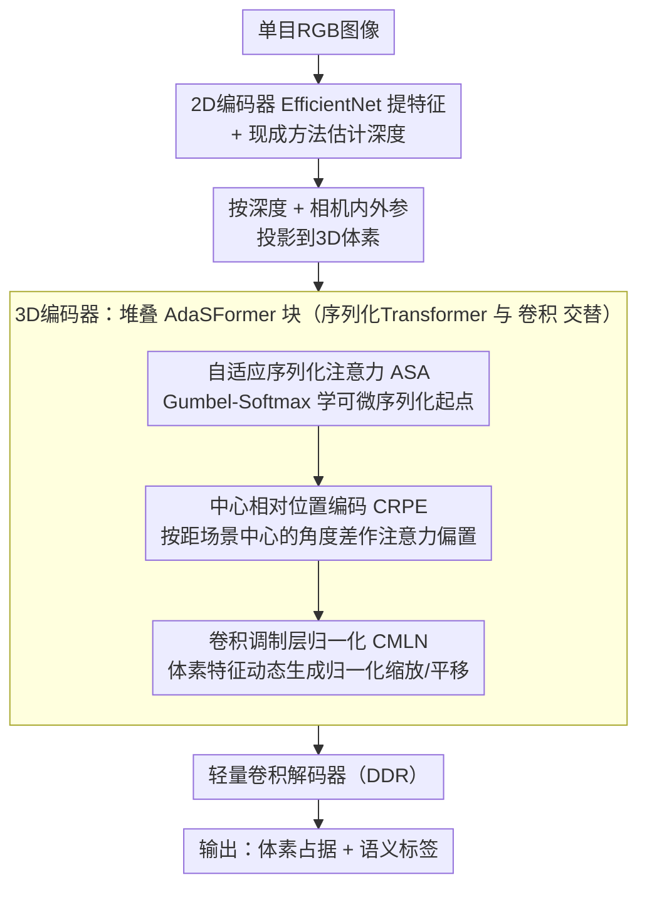

# AdaSFormer: Adaptive Serialized Transformers for Monocular Semantic Scene Completion from Indoor Environments

**会议**: CVPR 2026  
**arXiv**: [2603.25494](https://arxiv.org/abs/2603.25494)  
**代码**: [https://github.com/alanWXZ/AdaSFormer](https://github.com/alanWXZ/AdaSFormer)  
**领域**: 其他  
**关键词**: 语义场景补全, 序列化Transformer, 自适应注意力, 室内场景, 单目RGB

## 一句话总结
提出AdaSFormer，一种针对室内单目语义场景补全(MSSC)的序列化Transformer框架，通过自适应序列化注意力(可学习偏移量)、中心相对位置编码和卷积调制层归一化三个核心设计，在NYUv2和Occ-ScanNet上达到SOTA。

## 研究背景与动机

**领域现状**：单目语义场景补全从单张RGB图像预测完整3D场景的体素占据和语义标签。室外(自动驾驶)场景已有大量研究，但室内MSSC因空间布局复杂和严重遮挡而更具挑战。

**现有痛点**：现有室内方法主要依赖CNN架构——局部感受野无法建模长程依赖，3D卷积核增大计算开销立方增长。Transformer虽能建模全局上下文，但直接应用于密集3D体素计算和内存开销巨大。

**核心矛盾**：室内场景需要强全局上下文推理（推断遮挡区域的几何和语义），但高分辨率3D体素使Transformer的 $O(N^2)$ 复杂度不可行。

**切入角度**：序列化Transformer将不规则3D数据转为有序序列，通过局部分组将复杂度降至 $O(N \cdot G)$，但现有方法的分组方案固定，感受野受限。

**核心idea**：引入可学习偏移量自适应调整序列化起点→不同层获得不同感受野→更灵活的空间表示。

## 方法详解

### 整体框架
AdaSFormer要解决的是从一张室内RGB图重建出完整3D语义体素，而高分辨率体素让标准Transformer的 $O(N^2)$ 注意力不可行。它的做法是把不规则3D数据序列化成有序token、用局部分组把复杂度压到 $O(N \cdot G)$，再在序列化方式、位置编码、特征归一化三处针对室内SSC做改造。具体流程：单目RGB先经2D编码器(EfficientNet)提特征并估计深度，按深度投影到3D空间，送入由多个AdaSFormer块组成的3D编码器——每个块交替使用序列化Transformer(建模长程上下文)和卷积(补充局部几何)，最后接一个轻量卷积解码器输出体素占据与语义。三个核心设计ASA、CRPE、CMLN都嵌在AdaSFormer块内部，分别管"怎么序列化""注意力怎么感知空间""CNN和Transformer特征怎么对齐"。

### 关键设计

**1. 自适应序列化注意力(ASA)：让序列化的起点变成可学习的**

序列化Transformer把3D体素沿某条扫描曲线展平成1D序列再分组做局部注意力，但分组的起点一旦固定，每个window覆盖的空间就被锁死——同一个起点可能恰好框住一个完整物体，也可能把半个桌子和半面墙塞进同一组，感受野完全由这个人为选择决定。ASA的思路是让网络自己学这个起点：设patch大小为 $P$，引入 $K$ 个候选偏移（均匀间隔 $P/K$），让不同层选不同偏移从而获得不同感受野。难点在于"选哪个偏移"是离散决策、不可导，作者用Straight-Through Gumbel-Softmax绕过：前向走硬选择 $\mathbf{y}_{hard}$ 保证确实落在某个离散偏移上，反向用软分布 $\mathbf{y}_{soft} = \text{softmax}((\mathbf{l} + \mathbf{g})/\tau)$ 传梯度让候选logits可训练，并配合温度退火

$$\tau_t = \max(\tau_{min}, \tau_{init} \cdot \exp(-\alpha t))$$

随训练逐步降温、让选择从软逼近硬。相比Swin Transformer那种固定且不可学的2D窗口偏移，ASA沿1D序列操作、偏移空间更广，且偏移本身参与端到端优化，等于让每一层自动找最适合当前内容的分组方式。

**2. 中心相对位置编码(CRPE)：按"离场景中心多远"编码空间信息密度**

由于AdaSFormer块里已有卷积分量在编码局部位置，再叠一套常规的绝对/相对位置编码会冗余。CRPE换了个角度：它编码的不是"在哪"而是"这个位置的信息有多丰富"。具体先取所有占据体素坐标的均值作为场景中心 $\mathbf{c}$，再算每个体素相对中心的偏航角差 $\Delta\theta$ 和俯仰角差 $\Delta\phi$，拼接后过一个MLP作为注意力偏置注入。这样设计是因为室内场景的结构和语义信息分布是以中心为导向的——靠近中心的区域通常物体密集、信息丰富，外围则更空旷稀疏，把这种"信息丰富度随距中心远近变化"的先验喂给注意力，比单纯告诉它绝对坐标更对室内SSC的胃口。

**3. 卷积调制层归一化(CMLN)：用体素特征动态调制归一化参数来对齐CNN与Transformer**

AdaSFormer块里卷积和Transformer交替工作，但两者提取的特征类型根本不同(卷积偏局部纹理几何、Transformer偏全局关系)，直接拼接交替会让特征统计量频繁跳变、训练困难。CMLN的做法是不再用固定的LayerNorm仿射参数，而是让归一化的缩放和平移由当前体素特征动态生成：

$$\text{CMLN}(h_i \mid X_{voxel}) = \gamma(X_{voxel}) \odot \frac{h_i - \mu_i}{\sigma_i} + \beta(X_{voxel})$$

其中 $\gamma, \beta$ 由体素特征 $X_{voxel}$ 经一个小MLP产生。这相当于让卷积侧的特征统计去调制Transformer侧的归一化，使两种异构表示在每个块的衔接处自适应对齐，避免直接交替带来的学习冲突。

### 损失函数 / 训练策略
标准SSC损失（交叉熵+场景补全IoU相关损失）。

## 实验关键数据

### 主实验（NYUv2 数据集）

| 方法 | 会议 | SC IoU% | SSC mIoU% |
|------|------|---------|-----------|
| MonoScene | CVPR'22 | 42.51 | 26.94 |
| NDC-Scene | ICCV'23 | 44.17 | 29.03 |
| ISO | ECCV'24 | 47.11 | 31.25 |
| MonoMRN | ICCV'25 | 53.16 | 26.80* |
| **AdaSFormer (Ours)** | CVPR'26 | **SOTA** | **SOTA** |

*注：MonoMRN在SC IoU上强但SSC mIoU较低，AdaSFormer在两个指标上均达到SOTA。

### 消融实验（NYUv2）

| 配置 | SC IoU | SSC mIoU |
|------|--------|----------|
| 基线 (标准序列化Transformer) | 基准 | 基准 |
| + ASA (可学习偏移) | +提升 | +提升 |
| + CRPE (中心相对编码) | +提升 | +提升 |
| + CMLN (调制归一化) | +提升 | +提升 |
| 全部组合 | **最优** | **最优** |

### 关键发现
- 自适应序列化注意力是最关键组件——可学习偏移比固定偏移提升显著
- 中心相对位置编码在室内场景中特别有效——室内场景的结构更以中心为导向
- CMLN解决了直接CNN-Transformer交替的特征不匹配问题
- 在NYUv2和Occ-ScanNet两个数据集上均达到SOTA
- 相比全3D Transformer内存和计算开销大幅减小

## 亮点与洞察
- **可学习序列化偏移**：用Gumbel-Softmax让离散的序列化起点选择变可微，这是对序列化Transformer的通用改进，可迁移到点云分割和3D检测
- **空间信息丰富度编码**：不同于标准位置编码记录绝对/相对位置，CRPE编码的是空间信息密度——距离场景中心更远的区域通常信息更稀疏
- **CNN-Transformer异构特征桥接**：CMLN为混合架构设计中的特征统计不匹配问题提供了优雅的解决方案

## 局限与展望
- 仅在室内场景上验证（NYUv2较小），更大规模室内数据集的效果待验证
- 深度估计质量对整体性能影响大，端到端训练需确保深度网络和补全网络的协同
- 场景中心用占据体素均值计算可能不鲁棒——如果占据分布偏斜怎么办？
- 可学习偏移的K个候选值是预定义的等间距，自适应间距可能更优

## 相关工作与启发
- **vs MonoScene/NDC-Scene/ISO**: 全CNN架构缺乏全局推理能力，本文引入Transformer弥补
- **vs OctFormer/PTv3**: 通用序列化Transformer设计，本文增加了可学习偏移以适应SSC
- **vs Swin Transformer**: Swin的窗口偏移固定且限于2D，本文的序列化偏移沿1D序列操作更灵活

## 评分
- 新颖性: ⭐⭐⭐⭐ 可学习序列化偏移有创意，CRPE和CMLN设计合理
- 实验充分度: ⭐⭐⭐⭐ NYUv2和Occ-ScanNet验证全面，但室内数据集规模较小
- 写作质量: ⭐⭐⭐⭐ 方法描述清晰，图示直观
- 价值: ⭐⭐⭐ 室内SSC方向改进，但应用场景相对狭窄

<!-- RELATED:START -->

## 相关论文

- [\[AAAI 2026\] Towards Temporal Fusion Beyond the Field of View for Camera-based Semantic Scene Completion](../../AAAI2026/others/towards_temporal_fusion_beyond_the_field_of_view_for_camera-based_semantic_scene.md)
- [\[CVPR 2026\] SimRecon: SimReady Compositional Scene Reconstruction from Real Videos](simrecon_simready_compositional_scene_reconstruction_from_real_videos.md)
- [\[ICLR 2026\] The Counting Power of Transformers](../../ICLR2026/others/the_counting_power_of_transformers.md)
- [\[NeurIPS 2025\] Incomplete Multi-view Clustering via Hierarchical Semantic Alignment and Cooperative Completion](../../NeurIPS2025/others/incomplete_multi-view_clustering_via_hierarchical_semantic_alignment_and_coopera.md)
- [\[AAAI 2026\] Tab-PET: Graph-Based Positional Encodings for Tabular Transformers](../../AAAI2026/others/tab-pet_graph-based_positional_encodings_for_tabular_transformers.md)

<!-- RELATED:END -->
