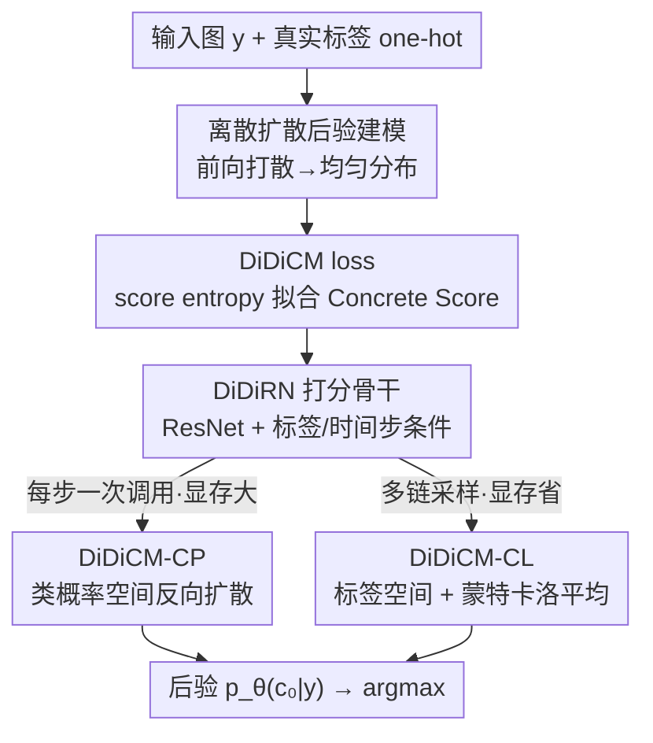

# Advancing Image Classification with Discrete Diffusion Classification Modeling

**会议**: CVPR 2026  
**论文**: [CVF Open Access](https://openaccess.thecvf.com/content/CVPR2026/html/Belhasin_Advancing_Image_Classification_with_Discrete_Diffusion_Classification_Modeling_CVPR_2026_paper.html)  
**代码**: https://github.com/omerb01/didicm  
**领域**: 扩散模型 / 图像分类  
**关键词**: 离散扩散, 图像分类, Concrete Score, 后验建模, 不确定性  

## 一句话总结
把图像分类从"一次性预测标签"改造成"在离散类标签空间里跑一个扩散过程来逼近后验 $P(c\mid y)$"，用预测 Concrete Score 的方式迭代去噪，几步扩散就能在 ImageNet 上超过同等 ResNet，且输入越退化（低分辨率 / 少数据）领先越多。

## 研究背景与动机
**领域现状**：图像分类的主流范式十几年没变——拿一个网络 $f_\theta(y)$ 直接从输入图 $y$ 回归出 $K$ 维类别概率，用交叉熵 $\ell_{CE}(y,c)=-\log f_\theta(y)_c$ 训练。架构（ResNet/ViT）和训练 recipe 一直在进步，但"输入→标签一步到位"这件事本身没动过。

**现有痛点**：在高不确定性场景下（图像被降质、训练数据稀缺，典型如医学影像、自动驾驶），这套范式表现明显变差。作者点出根因：当观测 $y=h(x)$ 是干净图 $x$ 经过某个未知、可能随机且不可逆的变换得到时，交叉熵实际是在 $c\sim P(c\mid x)$ 上优化，而我们真正想建模的是 $c\sim P(c\mid y)$。两者之间的差异给优化注入了无法消除的随机偏差，数据越少这个偏差越突出。

**核心矛盾**：传统分类器把标签当成确定性目标去拟合，却忽略了从 $x$ 到 $y$ 这步退化带来的内禀不确定性——它没有在"给定退化观测"的条件下显式建模标签分布的歧义。

**本文目标**：直接、解析地逼近退化观测下的后验 $p_\theta(c\mid y)\approx P(c\mid y)$，而不是绕路去先重建干净图再分类（那样计算量巨大）。

**切入角度**：扩散模型已经证明能在连续空间里建模复杂分布。作者的观察是：分类的目标空间是**有限离散**的（$K$ 个类，先验 $P(c)$ 完全可枚举），这个 tractability 恰好能化解离散扩散在语言领域遇到的求和爆炸难题。于是问："能不能把扩散机制搬到离散标签空间，专门为分类服务？"

**核心 idea**：用一个在**类标签空间**上定义前向/反向过程的离散扩散框架（DiDiCM）替代"一步预测标签"，模型学的不是标签本身而是 **Concrete Score**（连续 score 函数在离散域的推广），通过几步反向扩散把均匀分布逐步refine 成后验。

## 方法详解

### 整体框架
DiDiCM 把分类看成"在 $K$ 维类标签单纯形上做扩散"。**前向过程**从真实标签的 one-hot 出发，按一个连续时间马尔可夫过程不断把它"打散"，最终在 $t=1$ 退化成所有类别上的均匀分布（完全噪声态）。**训练**时不直接预测标签，而是训练一个打分模型 $s_\theta(y,c_t,t)$ 去逼近 Concrete Score（噪声分布各类概率之比），用一个为分类量身改写的 score entropy 损失优化。**推理**时从均匀分布出发，反向跑若干步把它收敛到后验 $p_\theta(c_0\mid y)$，取 argmax 即分类结果。

反向过程作者给了两种模拟方式以权衡算力/显存：**DiDiCM-CP**（在类概率空间走，每步一次模型调用、显存 $O(K^2)$）和 **DiDiCM-CL**（在采样出的标签上走，显存只要 $O(K+N)$、但要多条采样链做蒙特卡洛平均）。打分模型本身用专门改造的 **DiDiRN** 骨干实现——在 ResNet 上加噪声标签和时间步的条件模块，从而能跟标准 ResNet 公平对比。

### 关键设计

**1. 把分类重构成类标签后验的离散扩散：用 Concrete Score 代替直接预测标签**

针对"交叉熵在 $P(c\mid x)$ 上优化、忽略退化不确定性"这个根本痛点，作者把目标改成在标签空间显式建模 $P(c\mid y)$。前向过程由一个线性 ODE 定义，$\frac{dq(c_t\mid y)}{dt}=R_t\cdot q(c_t\mid y)$，其中 $R_t=\sigma_t(\mathbf{1}\mathbf{1}^T-KI)$ 是均匀转移率矩阵——它以一定速率把当前类标签随机转移到其它类，$t\to1$ 时退化成均匀分布。借助 $R$ 的特征分解 $R=U\Lambda U^{-1}$，任意噪声水平的前向分布有闭式解 $q(c_t\mid y)=U\exp(\bar\sigma_t\Lambda)U^{-1}\cdot q(c_0\mid y)$，无需逐步模拟。

模型要学的不是标签，而是 **Concrete Score** 矩阵 $S_t(i,j;y):=q(c_t{=}i\mid y)/q(c_t{=}j\mid y)$——即各类概率两两之比，是连续 score 函数在离散域的推广。之所以有效：score 这个量天然刻画了"往哪个类别移动概率上升"，反向 ODE 只需要它就能把噪声态拉回后验；而且分类的 $K$ 有限、先验可枚举，让这套在语言域会爆炸的离散扩散在分类里完全 tractable。

**2. DiDiCM loss：一个对分类保持 tractable 的 score entropy 变体**

真实 $S_t$ 拿不到，需要一个目标去训练 $s_\theta(y,c_t,t)\approx[S_t(1,c_t;y),\dots,S_t(K,c_t;y)]^T$（构造上令 $s_\theta(\cdot)_{c_t}=1$）。作者改写了 Lou et al. 的 score entropy，得到按噪声 $\sigma_t$ 加权、以 $y$ 为条件的 DiDiCM 损失：

$$\mathcal{L}_{\text{DiDiCM}}(\theta)=\mathbb{E}_{t,\,y,c_t}\Big[\tfrac{\sigma_t}{K}\big(\mathbf{1}^T A(S_t(\cdot,c_t;y))+\mathbf{1}^T s_\theta(y,c_t,t)-S_t(\cdot,c_t;y)^T\log s_\theta(y,c_t,t)\big)\Big]$$

其中 $A(a)=a(\log a-1)$ 逐元素作用，保证 $\mathcal{L}\geq0$ 且约束分数为正。直觉上这就是 score matching：把 $s_\theta$ 推向真值列 $S_t(\cdot,c_t;y)$。关键区别在于——语言域里这个损失因为要对巨大离散空间求和而 intractable，而分类里 $K$ 有限、$S_t$ 可由闭式前向分布算出，整个目标完全可算。训练一步只需：采样噪声水平 $t$、由闭式前向得 $q_t$、采一个噪声标签 $j\sim q_t$、令真值分数 $s=q_t/[q_t]_j$，再回传。

**3. DiDiCM-CP：利用 score 矩阵的秩一结构，把每步成本压到一次模型调用**

朴素反向需要构造完整的 $S_t^\theta\in\mathbb{R}^{K\times K}$，每步要对所有 $K$ 个标签各调一次模型——$K=1000$、8 步就是 8000 次前向，无法接受。作者观察到 $S_t$ 是**秩一矩阵** $S_t=q(c_t\mid y)\big(1/q(c_t\mid y)\big)^T$，因此只要拿到 $q_\theta(c_t\mid y)$ 这一列就能重建整个矩阵。而 $q_\theta(c_t\mid y)$ 可由单次模型输出归一化得到：$q_\theta(c_t\mid y)=s_\theta(y,j,t)/\sum_i s_\theta(y,j,t)_i$。

于是每个扩散步只需一次模型调用，复杂度降到 $1/\Delta t$ 次。理论上输入哪个 $j$ 都不影响结果，但作者经验发现取 $j:=\arg\min p_\theta(c_t\mid y)$（当前噪声后验里概率最低的类）效果最好。代价是要维护 $K\times K$ 的转移矩阵 $Q_t^\theta=I+R_t^\theta\Delta t$，显存 $O(K^2)$。这是算力优先的变体。

**4. DiDiCM-CL：在采样标签上扩散 + 蒙特卡洛平均，把显存压回线性**

CP 的 $O(K^2)$ 显存在大 $K$ 时吃紧。CL 换个思路：把反向过程**条件在采样出的具体标签 $c_t$ 上**，此时 $p(c_t\mid y)$ 退化成 $c_t$ 的 one-hot，反向转移简化为只依赖 $s_\theta$ 一列的 $K$ 维向量（公式 10），显存降到 $O(K+N)$。单条链从随机标签 $c_1$ 出发逐步采样到一个候选 $c_0^i$，但单条候选未必代表真标签，于是跑 $N$ 条独立链、用蒙特卡洛平均估后验 $p_\theta(c_0\mid y)\approx\frac1N\sum_i e_{c_0^i}$。

代价是计算量从 $1/\Delta t$ 升到 $N/\Delta t$ 次模型调用。但实验显示 32 NFEs（2 扩散步 × $N{=}16$）就能逼近上界精度。这是显存优先的变体，CP/CL 一起给了使用者一条"算力↔显存"可调的曲线。

**5. DiDiRN：在 ResNet 上加噪声标签/时间步条件，让对比公平**

打分模型 $s_\theta(y,c_t,t)$ 比普通分类器多吃两个输入：噪声标签 $c_t$ 和噪声水平 $t$，因此不能直接套 ResNet。作者借鉴 Guided Diffusion 的条件机制设计 DiDiRN：保留 ResNet 三段式主干（初始卷积+池化的底层特征 → $B$ 个残差块的深层特征 → 全局池化+全连接出预测），只新增轻量条件模块——给标签和时间步各做 embedding 并相加成一个汇总向量；在每个残差块里把该向量经 SiLU+Linear 变换后加到 skip connection 上，再用 GroupNorm+SiLU 归一。这样卷积主干结构原封不动，从而能跟文献里 well-established 的 ResNet 数字**直接公平对比**，证明增益来自扩散框架而非换了更强的骨干。

### 损失函数 / 训练策略
训练目标即上面的 DiDiCM loss（公式 5），按 Algorithm 1 单步执行。实验沿用 ResNet-SB 的 A1 recipe（当前 ResNet-50 的 SOTA 训练配方），并设 Weak Aug（标准 PyTorch 增广）与 Strong Aug（完整 ResNet-SB 增广）两档，以隔离"框架增益"和"增广增益"。

## 实验关键数据

### 主实验
ImageNet-1k 上，DiDiCM-CP（8 步、DiDiRN-50）对比同 recipe 的标准 ResNet-50。用三种输入分辨率（224/112/56，作为退化代理）× 三种训练数据比例（1.0/0.5/0.25）组成 9 档不确定性。下表取两个极端档（Strong Aug）：

| 配置（Strong Aug） | 指标 | 标准 ResNet-50 | DiDiCM-CP | 提升 |
|--------------------|------|----------------|-----------|------|
| 无不确定性（res224, 100%） | Top-1 | 80.42 | 80.40 | ≈持平 |
| 无不确定性（res224, 100%） | Top-5 | 94.60 | 95.29 | +0.69 |
| 高不确定性（res56, 25%） | Top-1 | 53.77 | 59.05 | +5.3 |
| 高不确定性（res56, 25%） | Top-5 | 76.03 | 81.93 | +5.9 |

Weak Aug 下领先更明显：在最高不确定性档（res56, 25%）DiDiCM 取得 +13.1（Top-1）/ +13.8（Top-5）的增益。整体规律是——低不确定性时与标准分类器持平或略优，不确定性越高领先越大，印证后验建模在退化/少数据下的价值。

### 消融实验
质量-效率分析（res56、全量数据，Top-1）：

| 方法 | 达到近上界精度所需预算 | 说明 |
|------|------------------------|------|
| DiDiCM-CP | 仅 2 扩散步 | 每步一次模型调用，算力最省 |
| DiDiCM-CL | 32 NFEs（2 步 × $N{=}16$） | 显存 $O(K+N)$，多链平均 |
| 标准分类器 | 1 次 | 单次前向，作为参照上界 |

| 设计选择 | 效果 | 说明 |
|----------|------|------|
| CP 取 $j=\arg\min p_\theta$ | 最佳 | 选当前后验最低概率类作打分输入，优于其它选择策略（Appendix B）|
| Weak Aug DiDiCM vs Strong Aug 标准 | 高不确定性下仍超越 | 说明 DiDiCM 更易训练，简单增广即可压过 SOTA 配方 |

### 关键发现
- **增益随不确定性单调放大**：从 res224/100% 的≈持平，到 res56/25% 的 +13% 量级，曲线随退化加剧拉开，直接支撑"后验建模对抗不确定性"的核心论点。
- **少步即近上界**：CP 仅 2 步就逼近上界精度，缓解了"扩散要多次顺序前向"的效率顾虑；CL 在 32 NFEs 达最佳。
- **框架增益≠骨干增益**：DiDiRN 保持 ResNet 卷积主干不变，无不确定性时 Top-1 80.4% 与 ResNet-50 文献最高值持平，说明高不确定性下的领先来自扩散后验建模本身。

## 亮点与洞察
- **"分类即离散扩散后验估计"的视角转换**很干净：传统分类是 DiDiCM 在 0 扩散步时的特例，框架天然把"建模 $P(c\mid y)$"这件被忽略的事摆到台面上。
- **秩一性把 $K\times K$ 的代价砍成单次调用**是让离散分类扩散真正可用的关键工程洞察——没有它，1000 类 8 步要 8000 次前向，方法直接破产。
- **CP/CL 双变体给出算力↔显存的连续可调旋钮**，这种"同一框架两种模拟"的设计思路可迁移到其它离散结构预测任务（如多标签、序列标注）。
- **把语言域 intractable 的 score entropy 在分类域变 tractable**，本质是抓住"分类目标空间有限可枚举"这一结构红利，值得在其它小离散空间任务复用。

## 局限与展望
- **作者承认的局限**：依赖顺序模型评估，推理比单次前向的标准分类器慢（即便 CP 只要 2 步，也仍是数倍开销）；CP 的 $O(K^2)$ 显存在超大类目（$K\gg1000$）下会成为瓶颈。
- **自己发现的局限**：实验只在 ImageNet-1k + ResNet-50/DiDiRN 上验证，未涉及 ViT 等现代骨干，也未在真实退化（而非分辨率代理）数据上系统评估；"分辨率当退化代理"虽可控但与实际 corruption 分布有差距（ImageNet-C 仅放在附录）。
- **改进思路**：探索把 CP 的转移矩阵稀疏化/低秩化以支持超大 $K$；研究自适应步数（按样本不确定性动态决定扩散步数）以进一步压缩平均推理成本。

## 相关工作与启发
- **vs 标准交叉熵分类器**：后者直接回归标签、隐式在 $P(c\mid x)$ 上优化；DiDiCM 在标签空间跑扩散显式逼近 $P(c\mid y)$，退化/少数据下更稳，代价是多次顺序前向。
- **vs 把生成扩散模型改作分类（如 diffusion classifier 系列）**：那些方法常把确定性分类器输出当生成目标、依赖大数据和重算力，且仍忽略数据/标签的不确定性；DiDiCM 直接在标签空间公式化与优化，更解析、更省算力。
- **vs SEDD / D3PM（离散扩散语言模型）**：DiDiCM 继承 SEDD 的 Concrete Score + 连续时间离散扩散原理，但利用分类标签空间有限可枚举的 tractability，把语言域会爆炸的损失改写成完全可算的分类专用版本。
- **vs ESC（Belhasin et al. 的期望分数分类器）**：ESC 先重建干净信号再分类、需对退化观测做平均；DiDiCM 直接估退化图上的标签后验，省掉显式干净图重建，大幅降低计算复杂度。

## 评分
- 新颖性: ⭐⭐⭐⭐⭐ 首个为分类专门设计的离散扩散框架，"分类=标签空间后验扩散"视角新颖且自洽。
- 实验充分度: ⭐⭐⭐⭐ ImageNet 9 档不确定性 + 两档增广 + 质量-效率分析较系统，但骨干/数据集偏单一。
- 写作质量: ⭐⭐⭐⭐ 推导完整、动机清晰，公式较密但逻辑链顺。
- 价值: ⭐⭐⭐⭐ 在高不确定性分类上给出可观且可解释的增益，秩一加速让方法真正可用，思路可迁移。

<!-- RELATED:START -->

## 相关论文

- [\[CVPR 2026\] Prototype-based Causal Intervention for Multi-Label Image Classification](prototype-based_causal_intervention_for_multi-label_image_classification.md)
- [\[ECCV 2024\] Active Generation for Image Classification](../../ECCV2024/others/active_generation_for_image_classification.md)
- [\[CVPR 2026\] Revisiting F-measure Optimization in Multi-Label Classification: A Sampling-based Approach](revisiting_f-measure_optimization_in_multi-label_classification_a_sampling-based.md)
- [\[CVPR 2026\] Hyperbolic Defect Feature Synthesis for Few-Shot Defect Classification](hyperbolic_defect_feature_synthesis_for_few-shot_defect_classification.md)
- [\[CVPR 2026\] EXOTIC: External Vision-driven Incomplete Multi-view Classification](exotic_external_vision-driven_incomplete_multi-view_classification.md)

<!-- RELATED:END -->
