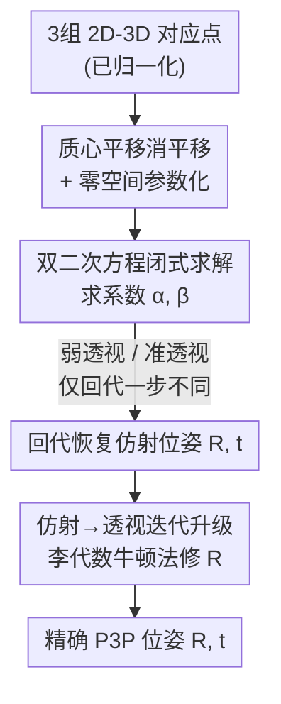

# Affine Perspective-Three-Point Problem

**会议**: CVPR 2026  
**论文**: [CVF Open Access](https://openaccess.thecvf.com/content/CVPR2026/html/Nakano_Affine_Perspective-Three-Point_Problem_CVPR_2026_paper.html)  
**代码**: 无  
**领域**: 3D视觉 / 几何最小求解器  
**关键词**: P3P, 相机位姿, 仿射相机, 弱透视, 准透视  

## 一句话总结
把经典 P3P（三点位姿求解）放到弱透视/准透视这两种仿射相机模型下，推导出只需解一个**双二次方程**的闭式最小求解器，再用一个轻量的迭代升级把仿射解"修"成精确透视解，两步迭代就能在精度上追平 SOTA 的精确 P3P 求解器，且更快。

## 研究背景与动机

**领域现状**：P3P（Perspective-Three-Point）是标定相机从 3 组 2D–3D 对应点求位姿的**最小问题**，是 SfM、Visual SLAM、机器人导航里 RANSAC 的核心最小求解器。经典做法把相机到三个 3D 点的距离当未知数，用余弦定理列方程，最终归结为一个**四次多项式**；后来又有把 P3P 重述成两条二次曲线求交（cubic + quadratic）的做法来提稳定性和速度。P3P 求解器作为 RANSAC 内核，最看重的就是数值稳定性和速度。

**现有痛点**：精确 P3P 不可避免要解三次或四次方程——四次方程求根本身就比二次方程麻烦、容易碰到复数根和退化情形，需要小心处理判别式与数值稳定性。能不能在某些成像条件下换一个**更简单的方程**来解？

**核心矛盾**：透视投影因为要除以逐点变化的深度 $z_i^c$ 而**本质非线性**，这正是 P3P 阶数高的根源。但在"远景 + 场景深度变化相对距离很小"的成像条件下，仿射相机模型（弱透视、准透视）用一个常数深度 $z_i^c \approx z_0$ 近似，把投影变成线性映射——非线性一旦去掉，方程的阶数就有望塌下来。

**本文目标**：(1) 在仿射相机模型下推导 P3P 的直接闭式最小求解器；(2) 因为仿射只在小深度变化时有效，再给一个能把仿射解升级到精确 P3P 解的迭代修正，搭一座"仿射 → 透视"的平滑桥。

**切入角度**：作者发现弱透视和准透视**共享同一套推导骨架**——质心平移 + 零空间参数化——最后都塌缩成同一种双二次（四次但只含偶次项）方程，模型间唯一的区别只是一步回代。双二次方程可以直接套二次求根公式，只需看判别式符号就能避开复数运算，求实根又简单又稳。

**核心 idea**：用"仿射相机近似把 P3P 降成双二次方程 + 迭代升级补回透视精度"来代替"直接解四次/三次精确 P3P"。

## 方法详解

### 整体框架

输入是 3 组 2D–3D 对应点 $\{m_i \leftrightarrow X_i\}_{i=1,2,3}$（图像点已用内参归一化），输出是相机旋转 $R$ 与平移 $t$。整条流水线分两段：**先用仿射模型闭式求一个初始位姿**（弱透视或准透视，都归结为解一个双二次方程），**再用迭代升级把这个仿射解逼成精确透视 P3P 解**。仿射段负责"便宜地给个好起点"，升级段负责"补回透视该有的精度"。

### 关键设计

**1. 质心平移 + 零空间参数化：把仿射 P3P 化成只含两个未知数**

仿射投影是线性映射，而且物体质心 $X_g = \frac{1}{3}\sum X_i$ 的投影恰好等于图像点质心 $m_g = \frac{1}{3}\sum m_i$。利用这一点，作者对图像点和 3D 点都减去各自质心（$\hat m_i = m_i - m_g$、$\hat X_i = X_i - X_g$），一举把平移 $t$ 从方程里消掉，问题只剩旋转相关的量。以弱透视为例，令 $p = \frac{1}{z_0} r_1$、$q = \frac{1}{z_0} r_2$，由两组中心化后的对应点（第三组因线性而冗余）可写出 $\big[\hat m_1\ \hat m_2\big] = \big[p\ q\big]^{\!T}\big[\hat X_1\ \hat X_2\big]$，进而得到关于 $p, q$ 的四条线性约束 $p^Ta_1=1,\ p^Ta_2=0,\ q^Ta_1=0,\ q^Ta_2=1$，其中 $[a_1\ a_2]=[\hat X_1\ \hat X_2][\hat m_1\ \hat m_2]^{-1}$。

把这些约束写成矩阵形式后，未知向量 $[p^T,1]^T$ 和 $[q^T,1]^T$ 落在两个 $2\times4$ 系数矩阵的零空间里；而这两个系数矩阵前 $2\times3$ 部分完全相同、只差第四列，于是**共享同一个零空间向量 $n_1$**。作者手工写出三个零空间向量 $n_1, n_2, n_3$，做 Gram–Schmidt 正交化并归一化后，得到极其干净的参数化：

$$
\begin{bmatrix}p\\1\end{bmatrix}=\alpha\begin{bmatrix}v_1\\0\end{bmatrix}+\begin{bmatrix}v_2\\1\end{bmatrix},\qquad
\begin{bmatrix}q\\1\end{bmatrix}=\beta\begin{bmatrix}v_1\\0\end{bmatrix}+\begin{bmatrix}v_3\\1\end{bmatrix}.
$$

这样整个仿射 P3P 就被压缩成**只剩两个标量未知数 $\alpha,\beta$**，且 $v_1,v_2,v_3$ 满足 $v_1^Tv_2=v_1^Tv_3=0,\ \|v_1\|=1$ 这种好用的正交性质——这是后面能塌成双二次方程的关键。弱透视和准透视到这一步的推导**完全一致**，只是 $p,q$ 的定义不同。

**2. 双二次方程闭式求 $\alpha,\beta$：用二次求根公式替代四次/三次方程**

有了 $\alpha,\beta$ 参数化，再套旋转矩阵的正交约束 $R^TR=I$ 就能定出它们。弱透视下，由 $r_1\perp r_2$（即 $p^Tq=0$）得到 $\alpha\beta + v_2^Tv_3 = 0$，由 $\|r_1\|=\|r_2\|$（即 $\|p\|^2=\|q\|^2$）得到 $\alpha^2-\beta^2+\|v_2\|^2-\|v_3\|^2=0$。从第一式解出 $\beta=-v_2^Tv_3/\alpha$ 代入第二式，得到关于 $\alpha$ 的**双二次方程**：

$$
\alpha^4 + \big(\|v_2\|^2-\|v_3\|^2\big)\alpha^2 - \big(v_2^Tv_3\big)^2 = 0.
$$

它只含偶次项，可令 $\alpha^2$ 为新未知数后用**二次求根公式**直接解，最多四个实根；只要检查判别式符号就能避免复数运算，求实根又快又稳。求得 $\alpha$ 后回代得 $\beta$，再由 $r_1\propto \alpha v_1+v_2$、$r_2\propto \beta v_1+v_3$、$r_3=r_1\times r_2$ 恢复旋转，参考平面深度 $z_0=\frac{1}{2}(r_1^Ta_1+r_2^Ta_2)$，平移 $t=z_0[m_g^T,1]^T-RX_g$。

准透视稍微复杂些：因为它的投影里带 $r_3$ 修正项（$p=\frac{1}{z_0}(r_1-x_0r_3)$、$q=\frac{1}{z_0}(r_2-y_0r_3)$，其中 $(x_0,y_0)=(u_g,v_g)$），需要用 $\|p\|^2,\|q\|^2,p^Tq$ 三式两两消去 $z_0^2$，得到两条含 $\alpha,\beta$ 的多项式 $k_1\alpha^2+k_2\alpha\beta+k_3=0$ 与 $k_4\alpha^2+k_5\beta^2+k_6=0$，消元后**同样塌成一个双二次方程** $(k_1^2k_5+k_2^2k_4)\alpha^4+(2k_1k_3k_5+k_2^2k_6)\alpha^2+k_3^2k_5=0$。恢复运动时准透视还要多一步：由 $r_3=r_1\times r_2$ 与 $r_1=z_0p+x_0r_3,\ r_2=z_0q+y_0r_3$ 联立，解一个 $3\times3$ 线性系统 $r_3=z_0^2(I-y_0z_0[p]_\times+x_0z_0[q]_\times)^{-1}(p\times q)$ 先得 $r_3$，再回代出 $r_1,r_2$。**两种模型的唯一区别就在"双二次方程的系数 + 回代恢复运动"这一步**，前面的骨架共用。

**3. 仿射→透视迭代升级：在 SO(3) 上用李代数牛顿法补回透视精度**

仿射解假定常数深度，直接拿去用在真透视相机上精度会偏低，尤其深度变化大时。作者借用 Ke 等人的精确 P3P 表述：从两组对应点消去深度，得到约束 $c_{ij}^T R d_{ij}=0$（其中 $c_{ij}=(m_i\times m_j)$、$d_{ij}=X_i-X_j$）。从仿射解给出的初始 $R$ 出发，逐步修正使其满足这三条约束。

升级用**小角度近似的牛顿法**：把增量旋转写成 $\Delta R\approx I+[\Delta r]_\times$，约束变为 $c_{ij}^T(I+[\Delta r]_\times)Rd_{ij}=0$，于是解一个最多 $3\times3$ 的线性系统得到 $\Delta r$，再用罗德里格斯公式算出精确增量 $\Delta R=\exp([\Delta r]_\times)$ 并更新 $R\leftarrow\Delta R\,R$，迭代到 $\Delta r$ 足够小。旋转定下后，平移 $t$ 再由一个线性系统 $[m_i]_\times t=-[m_i]_\times RX_i$ 解出。这个升级方案有两个好处：**每步只解最多 $3\times3$ 线性系统**（而 SLAM 里联合优化 $[\Delta r,t]\in\mathbb R^6$ 要解 $6\times6$），更便宜；而且因为增量始终走指数映射，**任何一步停下来旋转都还在 SO(3) 上**，可以随时早停，不像基于距离约束的 P3P 那样必须把约束精确收敛到零才有合法旋转。

## 实验关键数据

实验全部用 MATLAB 实现，只和当前 SOTA 的精确 P3P 求解器 **Ding** 对比（Ding 优于 [24,26,33,36] 等其他求解器）。方法记号：`Weak`/`Para` 表示弱/准透视求解器，下标表示升级迭代次数（`Weak0` 是纯仿射、`Para2` 是准透视 + 2 步升级）。Ding 因为精确求解 P3P，在无噪声合成实验里误差恒为零。

### 主实验（真实数据集，LO-RANSAC）

EPOS 数据集（小深度变化，6D 物体位姿，约 6600 实例）与 IMC2023 数据集（大深度变化，室外 SfM 定位，约 5800 图）上的召回率/耗时/RANSAC 迭代数对比：

| 数据集 | 方法 | 召回(严格阈值) | 召回(宽松阈值) | 总耗时(min)↓ | 总迭代(×10⁶)↓ |
|--------|------|------|------|------|------|
| EPOS | Ding+LO | 8.3 (2°/2%) | 36.8 (5°/5%) | 14.1 | 2.32 |
| EPOS | Para2+LO | 8.5 | 37.1 | 14.7 | 2.32 |
| EPOS | Weak2+LO | 8.4 | 37.1 | 14.6 | 2.32 |
| EPOS | Para0+LO | 7.9 | 37.0 | 13.4 | 2.33 |
| EPOS | Weak0+LO | 7.7 | 36.5 | 11.9 | 2.41 |
| IMC2023 | Ding+LO | 25.1 (0.5°/1%) | 51.9 (3°/3%) | 38.0 | 1.51 |
| IMC2023 | Para2+LO | 25.1 | 51.7 | 38.9 | 1.52 |
| IMC2023 | Weak2+LO | 25.0 | 51.9 | 39.2 | 1.52 |
| IMC2023 | Para0+LO | 23.4 | 50.7 | 44.3 | 1.91 |
| IMC2023 | Weak0+LO | 23.5 | 50.7 | 44.6 | 2.00 |

`Weak2`/`Para2` 在两个数据集上召回率都和 Ding 几乎一模一样。小深度变化的 EPOS 上，纯仿射 `Weak0`/`Para0` 也够用（`Para0` 因近似阶数更高，召回略高于 `Weak0`，实证了理论）；大深度变化的 IMC2023 上，纯仿射明显落后 Ding，且此时 weak 与 para 的近似差异不再有实际区别。

### 合成数据：单次求解耗时（μs，越低越快）

| 方法 | Ding | Weak0 | Weak1 | Weak2 | Para0 | Para1 | Para2 |
|------|------|-------|-------|-------|-------|-------|-------|
| 耗时(μs) | 50.1 | 40.3 | 44.2 | 45.5 | 42.0 | 46.7 | 48.1 |

仿射求解器因为只解双二次方程，比 Ding 更快：1 步升级（`Weak1`/`Para1`）约快 10%，2 步升级（`Weak2`/`Para2`）仍快约 4%——**追平精度的同时还更省时间**。

### 关键发现
- **升级迭代是精度的命门**：在深度变化敏感性（$0\le|\Delta z/z_0|\le0.5$）和图像噪声鲁棒性（$0\le\sigma\le5$px）两组 10⁶ 次试验里，纯仿射 `Weak0`/`Para0` 都很脆弱，但**两步升级**后 `Weak2`/`Para2` 的中位误差曲线与 Ding 几乎完全重合。
- **2 步几乎就够**：从仿射这种低精度初值出发，仅 2 次升级就达到与精确求解器相当的精度，说明这个初值离精确解已经不远。
- **纯仿射只在小深度变化场景实用**：RANSAC 实验中，大深度变化（$-0.5\le\Delta z/z_0\le1.0$）下 `Weak0`/`Para0` 随外点比例上升收敛率骤降；其平均耗时看似下降并非提速，而是收敛失败更频繁、省掉了最后的 LM 精修步骤。⚠️ 比较耗时时需注意这个 caveat。

## 亮点与洞察
- **"统一骨架 + 一步之差"很优雅**：弱透视和准透视这两种看似不同的仿射模型，被证明共享"质心平移 + 零空间参数化 + 双二次方程"的整套推导，仅在回代恢复运动那一步不同——把两个求解器的实现成本几乎合并成一个。
- **降阶的本质是去非线性**：透视 P3P 阶数高源于逐点除以深度的非线性；仿射近似用常数深度把映射线性化，方程阶数随之从四次降到"双二次"，可直接套二次求根公式、靠判别式符号避开复数。这种"换近似模型换更简单方程"的思路可迁移到 P4Pfr、P1P、多视图几何等更复杂的相机几何问题。
- **升级方案天然守 SO(3)**：在李代数上做小角度牛顿迭代，每步走指数映射，保证任意一步停下旋转都合法，可随时早停；相比基于距离约束、必须精确收敛才有合法旋转的 P3P 表述，这是工程上很实在的便利。

## 局限与展望
- 作者承认：仿射相机本质只是透视的近似，纯仿射求解器（`Weak0`/`Para0`）只在**小深度变化**场景实用，大深度变化必须靠升级迭代补救。
- 本文目标明确不是"让仿射相机去 P3P benchmark 打擂台"，而是展示仿射相机在简化几何问题上的价值——所以并未在所有指标上追求超越 Ding，而是追平。
- ⚠️ 自己发现的局限：实验全程只与 Ding 单一基线比较，虽说 Ding 是 SOTA，但缺少与多个精确求解器并列的横向数值表；且全部用 MATLAB 实现，绝对耗时数值的工程参考意义需谨慎。
- 作者展望：因缺公开数据集，对超变焦/远心相机的评估留作未来工作；并提出 P4Pfr、P1P、多视图几何等更复杂问题也可借助仿射相机有效求解。

## 相关工作与启发
- **vs Ding（two-conic 精确 P3P，SOTA）**：Ding 直接精确求解 P3P（cubic + quadratic 组合），误差恒为零；本文先解更简单的双二次方程得仿射近似解、再迭代升级，**2 步即追平 Ding 的精度且更快**（单次快 4–10%）。区别在于"精确一步到位" vs "便宜近似 + 轻量精修"。
- **vs 经典四次 P3P [16,18]**：经典法把点到相机距离当未知数、用余弦定理列方程归结为四次多项式，早期还需 SVD 求位姿；本文绕开四次方程，只解双二次，数值上更易稳定处理实根与退化。
- **vs SLAM 联合位姿优化 [25,31]**：SLAM 常在 $[\Delta r,t]\in\mathbb R^6$ 上联合优化、每步解 $6\times6$ 系统；本文升级只优化旋转、每步解最多 $3\times3$ 系统，更便宜，且旋转始终在 SO(3) 上。

## 评分
- 新颖性: ⭐⭐⭐⭐ 把仿射相机模型重新引入 P3P，证明弱/准透视共享推导并塌成双二次方程，"近似降阶 + 迭代升级"是干净且少见的视角。
- 实验充分度: ⭐⭐⭐⭐ 合成（深度/噪声/RANSAC）+ 两个真实数据集覆盖小/大深度变化，含精度与速度对比；略遗憾只对单一基线 Ding。
- 写作质量: ⭐⭐⭐⭐⭐ 推导层层递进、公式完整、模型间差异交代清楚，几何最小求解器论文里少有的好读。
- 价值: ⭐⭐⭐⭐ 追平 SOTA 还更快、实现成本低，且为 P4Pfr/P1P/多视图几何等指出可借仿射相机简化的方向。

<!-- RELATED:START -->

## 相关论文

- [\[AAAI 2026\] Automated Reproducibility Has a Problem Statement Problem](../../AAAI2026/others/automated_reproducibility_has_a_problem_statement_problem.md)
- [\[AAAI 2026\] The Publication Choice Problem](../../AAAI2026/others/the_publication_choice_problem.md)
- [\[CVPR 2026\] HypeVPR: Exploring Hyperbolic Space for Perspective to Equirectangular Visual Place Recognition](hypevpr_exploring_hyperbolic_space_for_perspective_to_equirectangular_visual_pla.md)
- [\[CVPR 2026\] DDSF: Robust Few-Shot Learning via Disentangled Subspaces with Determinantal Point Process](ddsf_robust_few-shot_learning_via_disentangled_subspaces_with_determinantal_poin.md)
- [\[CVPR 2026\] Rethinking Knowledge Transfer in Image Quality Assessment: A Perceptual Preference Structure Alignment Perspective](rethinking_knowledge_transfer_in_image_quality_assessment_a_perceptual_preferenc.md)

<!-- RELATED:END -->
