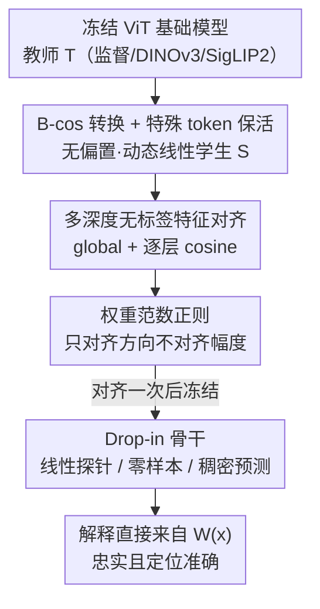

# Align Once to Explain: Feature Alignment for Scalable B-cosification of Foundational Vision Transformers

**会议**: CVPR 2026  
**论文**: [CVF Open Access](https://openaccess.thecvf.com/content/CVPR2026/html/Maser_Align_Once_to_Explain_Feature_Alignment_for_Scalable_B-cosification_of_CVPR_2026_paper.html)  
**代码**: https://github.com/rmaser/aloe  
**领域**: 可解释性 / 视觉基础模型  
**关键词**: B-cos网络, 特征对齐, 内在可解释性, 视觉基础模型, 无标签蒸馏

## 一句话总结
ALOE 用一次性、无标签的"师生特征对齐"把冻结的 ViT 基础模型（监督 / DINOv3 / SigLIP2）转成内在可解释的 B-cos 版本，对齐一次即可作为骨干 drop-in 复用到分类、零样本、稠密预测等任务，比原始 B-cosification 在 ViT 上提升 >4.9 个百分点的精度，同时给出忠实且定位准确的解释，数据效率高 100–1000×。

## 研究背景与动机
**领域现状**：DINOv3、CLIP、SigLIP2 这类大规模视觉基础模型是当今迁移学习和零样本任务的默认骨干，但它们的决策过程几乎是黑箱。要解释它们，主流是事后归因（post-hoc，如 Integrated Gradients、AttnLRP、Grad-CAM 系），但事后解释往往噪声大、对被解释模型不一定忠实（faithful）。

**现有痛点**：另一条路是"内在可解释架构"——通过架构约束让模型的解释天然忠实，其中 **B-cos 网络**很有代表性：它把线性层换成无偏置、动态线性的 B-cos 变换，整网最终等价于一个输入相关的动态线性映射 $y(\mathbf{x})=\mathbf{W}(\mathbf{x})\,\mathbf{x}$，于是 $\mathbf{W}(\mathbf{x})$ 本身就是模型计算的精确、可视化的"解释"。但从头训 B-cos 太贵；于是 **B-cosification**（[4]）提出把现成模型事后改造成 B-cos 变体。问题在于：B-cosification 的配方是为监督 CNN 设计的，迁到 ViT 上效果很差，有时甚至打不过从头训，而现代基础模型几乎都是 ViT，这就让它实用价值大打折扣。

**核心矛盾**：B-cosification 依赖"在原任务上做有监督微调"来恢复性能，但对 ViT 这套监督微调既需要标签、又恢复不出基础模型那种通用特征几何，导致下游迁移、零样本能力大幅退化——可解释和"保住基础模型的本事"之间出现了割裂。

**本文目标 / 切入角度**：作者把问题重新框成"**特征对齐**"而非"任务微调"——既然要的是让 B-cos 学生保留教师的通用表征，那就直接在表征空间上让学生逼近冻结的教师，而不依赖任何标签或具体下游任务。

**核心 idea**：把冻结基础模型当教师，把它的 B-cos 化版本当学生，用**无标签的多层 cosine 特征对齐**让学生在嵌入几何上对齐教师；只对齐**一次**，得到的 B-cos 骨干就能 drop-in 复用到所有下游任务，把可解释性的成本一次性摊销掉（Align **Once** to Explain）。

## 方法详解

### 整体框架
ALOE 是一条三步流水线：**(1) 转 B-cos** → **(2) 对齐一次** → **(3) 部署复用**。输入是一个冻结的 ViT 基础模型教师 $\mathcal{T}$（可以是监督、自监督 DINOv3、或视觉-语言 SigLIP2 任一范式）；先用保结构的转换把它复制成一个无偏置、动态线性的 B-cos 学生 $\mathcal{S}$；然后在无标签网络图像上，用 cosine 目标让学生的全局嵌入和逐层 token 特征对齐教师；对齐完成后冻结学生骨干，线性探针 / 零样本 / 稠密预测都直接接在它上面，而解释天然来自 $\mathbf{W}(\mathbf{x})$，无需任何针对任务的可解释性调参。

### 关键设计

**1. B-cos 转换 + 特殊 token 保活：把基础模型改成动态线性又不破坏 ViT 的计算路由**

B-cos 变换是整套可解释性的根基。它把每个线性单元替换成无偏置的
$$\mathrm{B\text{-}cos}(\mathbf{x};\mathbf{w}) = \Big(\big|\cos(\mathbf{x},\mathbf{w})\big|^{\,B-1}\times \widehat{\mathbf{w}}\Big)^{\!\top}\mathbf{x} = \mathbf{w}(\mathbf{x})^{\top}\mathbf{x},$$
其中 $\widehat{\mathbf{w}}=\mathbf{w}/\lVert\mathbf{w}\rVert_2$，$B$ 控制对齐强度。$\big|\cos(\mathbf{x},\mathbf{w})\big|^{B-1}$ 这个余弦幂项既提供学习所需的非线性，又把权重往输入方向"压"——$B>1$ 时促使权重-输入对齐，使逐层堆叠后的整网等价动态线性映射 $\mathbf{W}(\mathbf{x})$ 更聚焦于任务相关区域，从而 $\mathbf{W}(\mathbf{x})\mathbf{x}$ 就是一张忠实的解释图。具体转换沿用 [4] 的保结构配方：patch embedding、MLP 块、投影头里的线性层换成 B-cos 层（固定 $B=2$），去掉所有偏置（含归一化层的偏置）、用非中心化归一化；自注意力本身已是动态线性、连同位置编码一并保持不动；3 通道输入扩成 6 通道 $(r,g,b,1-r,1-g,1-b)$ 以支持彩色解释。

ViT 特有的难点是 `[CLS]` 和 register token（如 DINOv3）对性能至关重要。作者的做法是**让这些特殊 token 的通路与教师保持完全一致**，这样后续对齐能做到 token 一对一匹配、保住基础模型原本的计算路由——这是 ViT 上 B-cos 解释能忠实的前提（SigLIP2 的图像编码器不用 `[CLS]`/register，则对应改用注意力池化输出）。学生在宽度、深度、tokenization 上都镜像教师，因此对齐时无需任何投影头。

**2. 多深度无标签特征对齐：global + 逐层 cosine，既保嵌入几何又稳优化**

这是 ALOE 取代"有监督微调"的核心。痛点是 B-cosification 靠任务标签微调，既退化通用特征又依赖标签；ALOE 改成在无标签图像上直接对齐表征。目标分两部分：一个**全局项**保最终嵌入空间的几何（下游分类、稠密、零样本都靠它），一个**逐层 token 项**保中间计算、并稳定优化。总损失为
$$\mathcal{L} = \lambda_{\mathrm{g}}\,\mathcal{L}_{\mathrm{global}} + \lambda_{\mathrm{l}}\,\mathcal{L}_{\mathrm{layers}} + \mathcal{L}_{\mathrm{reg}}.$$
全局项是末层图像表征的 cosine 距离 $\mathcal{L}_{\mathrm{global}} = \frac{1}{|\mathcal{B}|}\sum_{\mathbf{x}}\big(1-\cos(E_{\mathcal{S}}(\mathbf{x}),E_{\mathcal{T}}(\mathbf{x}))\big)$；逐层项在选定深度 $\ell$ 上对每个 token $t$ 算 cosine 距离 $\mathcal{L}_{\mathrm{layers}} = \frac{1}{|\mathcal{B}|}\sum_{\ell}\frac{1}{|\mathcal{T}^{\ell}_{\mathrm{tok}}|}\sum_{t}\big(1-\cos(h^{\ell}_{\mathcal{S},t},h^{\ell}_{\mathcal{T},t})\big)$。监督深度取 $\mathcal{L}_{\mathrm{depth}}=\{\lfloor L/3\rfloor,\lfloor 2L/3\rfloor,L\}$ 三个等距层（1/3、2/3、全深度），并且**精确对齐每个教师真正承载语义的 token**（DINOv3 对 `[CLS]`+register，SigLIP2 对注意力池化嵌入），保证一对一路由。消融显示精度随对齐深度增加到 2/3 处持续上升、对齐全部层反而不再有增益，故选三个等距深度，$(\lambda_{\mathrm{g}},\lambda_{\mathrm{l}})=(1,1)$ 在所有模型上都好用。

**3. 权重范数正则：只对齐方向不对齐幅度，防长训练时权重范数爆炸**

长训练中 B-cos 学生的权重范数容易发散，破坏对齐。作者加一项把学生和教师**共享层权重矩阵的 Frobenius 范数**耦合起来：
$$\mathcal{L}_{\mathrm{reg}} = \alpha\sum_{\ell\in\mathcal{P}}\big(\lVert\mathbf{W}^{(T)}_\ell\rVert_F - \lVert\mathbf{W}^{(S)}_\ell\rVert_F\big)^2.$$
它鼓励学生只在**方向**上对齐教师、而把幅度约束住，从而避免权重范数爆炸导致的发散。这点配合 cosine 的尺度不变性，让训练在大模型上也稳。

**4. cosine 作为默认对齐目标：尺度不变、跨范式跨规模最稳**

为什么用 cosine 而不是 MSE / InfoNCE / SigLIP？因为不同教师、不同 token 的特征尺度差异很大。cosine 尺度不变，直接优化角度一致性，而角度一致正是 DINOv3、SigLIP 这类模型预训练时本来就在优化的目标，因此对齐起来最自然。相比之下，MSE 对绝对尺度敏感；InfoNCE / SigLIP 这类对比目标引入了 batch 负样本，可能扭曲教师的局部几何。消融里 cosine 和 SigLIP 在各模型上最一致，但 cosine 更简单，故定为默认。

### 损失函数 / 训练策略
对齐数据用无标签网络图像集 CC3M / CC12M / YFCC15M（主结果用 YFCC15M），分辨率随教师默认（通常 224×224），增广只用随机裁剪和水平翻转以保特征几何。教师冻结，学生用 AdamW + cosine 学习率调度、混合精度，固定 $B=2$、偏置保持为 0、不显式做权重归一化；梯度范数裁剪到 1.0、不用 weight decay 以稳大模型；在 30k held-out 子集上按对齐损失早停，学习率在 $\{3\text{e-}3,1\text{e-}3,5\text{e-}4\}$ 中扫，batch size 1024。

## 实验关键数据

### 主实验
在 ViT-B/16 上跨监督 / SigLIP2 / DINOv3 三种范式做 10 数据集线性探针，ALOE 全面碾压 vanilla B-cosification，并逼近原始基础模型（教师灰色行）：

| 教师范式 (ViT-B/16) | 指标 | B-cosification | ALOE | 教师 | ALOE vs B-cosif. |
|--------------------|------|----------------|------|------|-------------------|
| 监督 [20] | IN1k LP top-1 | 71.76 | **81.00** | 80.74 | +9.24 p.p. |
| 监督 [20] | 10 数据集均值 | 66.99 | **80.23** | 79.13 | +13.24 p.p. |
| SigLIP2 | 10 数据集均值 | 80.86 | **88.48** | 89.63 | +7.62 p.p. |
| DINOv3 | 10 数据集均值 | 73.68 | **89.50** | 90.25 | +15.82 p.p. |
| DINOv3 | k-NN IN1k | 71.03 | **81.39** | 82.27 | +10.36 p.p. |
| SigLIP2 | 零样本 IN1k@1 | 61.01 | **77.20** | 78.07 | +16.19 p.p. |

稠密预测（NYUv2 单目深度，ViT-B/16 线性探针）上 ALOE 也明显优于 B-cosification：相对 $\delta_1$ 从 0.83 提到 0.94、RMSE 从 0.46 降到 0.30，逼近 DINOv3 教师（0.97 / 0.24）。可解释性上，SigLIP2 教师的 GridPG 定位分 ALOE 达 84.2% 对教师 AttnLRP 的 54.4%，且解释天然来自 $\mathbf{W}(\mathbf{x})$、无需事后方法。

### 消融实验

| 配置 | 关键指标 | 说明 |
|------|---------|------|
| 仅 Pool（global-only） | 75.51 | SigLIP2 平均 LP 精度，只对齐全局嵌入 |
| +$L$ | 77.85 | 加末层逐层对齐 |
| +$\{2/3,L\}$ | 85.24 | 加 2/3 深度，大跳 |
| +$\{1/3,2/3,L\}$ | **85.42** | 三等距深度（最终配置） |
| +All（所有层） | 84.93 | 对齐全部层反而略降 |

数据效率：用 YFCC15M 把对齐数据从 100% 缩到 1%（约 150k 图）时，SigLIP2 的 IN1k 线性探针精度几乎持平（83.80% → 83.33%），相当于只用 SigLIP2 那 ~10B 预训练语料的约 0.0015%；在 B-cosification 的数据预算下，ALOE 仍领先 +8.4 p.p.。对齐目标消融中 cosine 与 SigLIP 最稳，MSE / InfoNCE 不一致。

### 关键发现
- **深度对齐贡献最大**：从仅全局（75.51）加到 2/3 深度（85.24）是最大跳变，说明保住中间层 token 计算对 ViT 的迁移性能至关重要；但对齐到全部层反而轻微掉点，三等距深度是甜点。
- **数据效率极高**：100–1000× 更少图像就能恢复教师大部分泛化能力，1% 数据即饱和——核心原因是"对齐已训好的几何"比"从头学几何"省太多。
- **跨范式 / 跨规模一致**：监督、自监督、视觉-语言三种教师都受益，且模型越大越逼近教师，DINOv3 上提升尤其夸张（均值 +15.82 p.p.）。

## 亮点与洞察
- **把"可解释化"重写成"特征对齐"**：最巧的一步是不再用任务标签微调、而是直接在表征空间对齐冻结教师。这既绕开了标签依赖，又把"保住基础模型本事"和"获得内在解释"统一进同一个 cosine 目标里——这是 ALOE 能在 ViT 上同时拿到高精度 + 高定位的根因。
- **"对齐一次、处处解释"的摊销思想**：可解释性成本只付一次，之后骨干 drop-in 到任意下游，解释天然来自 $\mathbf{W}(\mathbf{x})$ 不需逐任务调参——这个"一次性内在可解释骨干"的工程范式可迁移到任何想要忠实解释的视觉系统。
- **特殊 token 保活是 ViT 上成败的关键细节**：保持 `[CLS]`/register 通路与教师一致以实现 token 一对一路由，正是之前 CNN 版 B-cosification 迁到 ViT 失败的盲点。
- **延伸到 VLM/MLLM**：对齐后的 B-cos SigLIP2 还能给零样本 VLM 出 token 级视觉解释，甚至接进 LLaVA-style Gemma-9B 做生成 token 的视觉 grounding，展示了内在可解释视觉骨干的多模态潜力。

## 局限与展望
- **MLLM 端到端尚未闭环**：当前把解释传过语言模型仍依赖事后的 AttnLRP，真正端到端内在可解释的 MLLM 留作未来工作。
- **依赖高质量教师**：ALOE 是"对齐教师"，性能天花板由教师决定，弱教师下能否还原解释忠实度未充分验证。⚠️
- **解释质量主要用 GridPG / 像素删除 + 人评衡量**，这些代理指标与真实"人类可理解性"之间仍有 gap；论文也承认完整的忠实度评测放在附录。
- **改进思路**：把权重范数正则推广到更激进的范式（如纯生成式骨干）、或探索把对齐目标与下游任务联合的轻量自适应，可能进一步缩小与教师的最后一点差距。

## 相关工作与启发
- **vs B-cosification [4]**：两者都想把现成模型转成 B-cos。B-cosification 靠有监督微调、为 CNN 设计，迁到 ViT 性能不足且需标签；ALOE 改为无标签多层特征对齐 + 保特殊 token，去掉了监督微调、补上了 ViT 的性能缺口、还保住了对比零样本能力（>4.9 p.p. 精度优势）。
- **vs 从头训 B-cos 网络 [9]**：从头训需在基础模型规模上重训、代价极高；ALOE 用 100–1000× 更少图像复用教师几何，几乎追平教师精度。
- **vs 知识蒸馏 (KD)**：ALOE 形式上像 KD（师生特征对齐），但目标不是压缩、而是"把冻结基础模型转成内在可解释的同尺寸 B-cos 对应物"，且无标签、保通用特征、给忠实解释。
- **vs 事后归因 (AttnLRP / IntGrad / Grad-CAM)**：事后方法噪声大、不一定忠实于被解释模型；ALOE 的解释由架构保证（$\mathbf{W}(\mathbf{x})$ 是计算的精确分解），定位分（GridPG）也显著更高。

## 评分
- 新颖性: ⭐⭐⭐⭐ 把可解释化重构成无标签特征对齐、解决 ViT 上 B-cosification 的老大难，思路清晰但属在 B-cos 框架内的有力推进
- 实验充分度: ⭐⭐⭐⭐⭐ 三种预训练范式 × 多规模 × 10 数据集，线性探针/k-NN/零样本/稠密/解释全覆盖，消融到位
- 写作质量: ⭐⭐⭐⭐ 动机与设计交代清楚，图表丰富；部分细节（完整忠实度评测、MLLM）放附录
- 价值: ⭐⭐⭐⭐⭐ 给"基础模型规模的内在可解释骨干"提供了实用且高数据效率的落地路径，对安全敏感场景意义大

<!-- RELATED:START -->

## 相关论文

- [\[CVPR 2025\] TraF-Align: Trajectory-aware Feature Alignment for Asynchronous Multi-agent Perception](../../CVPR2025/others/traf-align_trajectory-aware_feature_alignment_for_asynchronous_multi-agent_perce.md)
- [\[CVPR 2026\] Keep It Frozen: Domain-Routed Conditional Residual Modulation for Multi-Domain Vision Transformers](keep_it_frozen_domain-routed_conditional_residual_modulation_for_multi-domain_vi.md)
- [\[AAAI 2026\] Scalable Vision-Guided Crop Yield Estimation](../../AAAI2026/others/scalable_vision-guided_crop_yield_estimation.md)
- [\[CVPR 2026\] NAF: Zero-Shot Feature Upsampling via Neighborhood Attention Filtering](naf_zero-shot_feature_upsampling_via_neighborhood_attention_filtering.md)
- [\[CVPR 2026\] Upsample Anything: A Simple and Hard to Beat Baseline for Feature Upsampling](upsample_anything_a_simple_and_hard_to_beat_baseline_for_feature_upsampling.md)

<!-- RELATED:END -->
