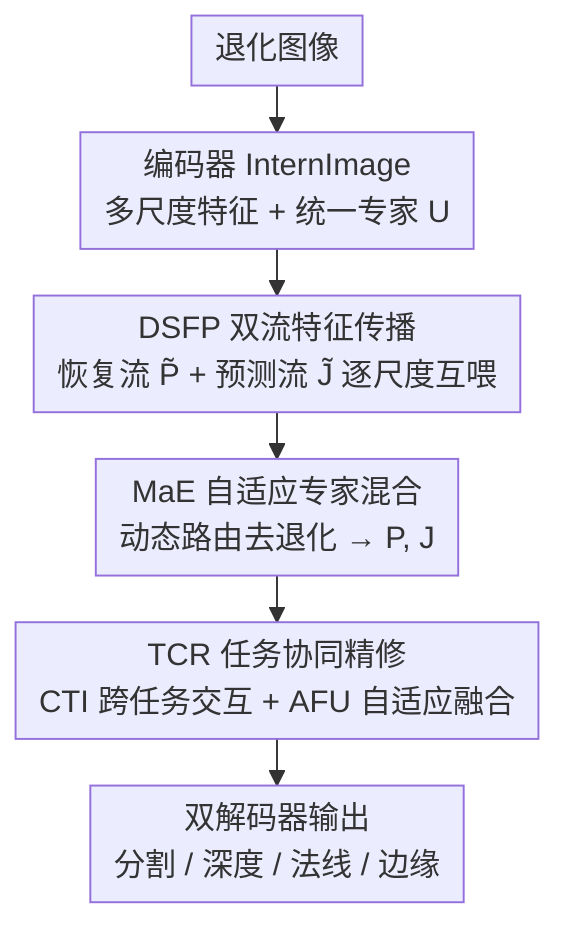

# ALLNet: Multi-task Dense Prediction for Degraded Images

**会议**: CVPR 2026  
**论文**: [CVF Open Access](https://openaccess.thecvf.com/content/CVPR2026/html/Wang_ALLNet_Multi-task_Dense_Prediction_for_Degraded_Images_CVPR_2026_paper.html)  
**代码**: 未公开  
**领域**: 多任务密集预测 / 图像恢复  
**关键词**: 多任务密集预测, 图像恢复, 退化图像, 专家混合(MoE), 跨任务协同  

## 一句话总结
ALLNet 把"先恢复、再做密集预测"的两阶段级联拆掉，用一个 U-Net 双解码器在每个尺度上让恢复流与预测流互相喂特征，靠一个退化自适应的专家混合模块（MaE）做去退化、再靠一个跨任务协同精修模块（TCR）做双向语义对齐，在退化版 NYUD-v2 / PASCAL-Context 上四个任务全面超过现有 SOTA。

## 研究背景与动机
**领域现状**：多任务密集预测（MDP）把语义分割、深度估计、表面法线、边缘检测等像素级任务塞进一个共享编码器 + 多解码器的网络里联合训练，靠任务间相关性互相增益，比单任务更省算力也更鲁棒。但绝大多数 MDP 工作都默认输入是干净的高质量图像。

**现有痛点**：真实场景里噪声、雨、雾、运动模糊随时会污染图像。主流应对是"分而治之"的两阶段管线（图 1a）：先用 all-in-one 恢复网络（去噪/去雨/去雾）把退化图洗干净，再把中间结果喂给 MDP 模型出预测。这条路有三个硬伤——其一，恢复和预测被人为切断，信息流断在各自阶段内部，没有跨阶段、跨任务的全局融合，恢复学到的低层增强和预测需要的高层语义无法互相反哺，还多出一截结构复杂度和推理延迟；其二，现有 all-in-one 恢复模型为了吃多种退化往往做成一坨紧耦合的单体结构，缺乏特征协同机制，也没法当成模块灵活塞进下游任务框架；其三，退化会遮蔽语义结构，各任务解码器在退化特征空间里各自演化、互不感知，缺少显式的跨注意力来打通异质特征空间。

**核心矛盾**：恢复（低层、退化感知）与多任务预测（高层、语义协同）本该互相强化，但两阶段范式把它们隔开了，导致"低层增强"和"高层语义理解"无法在全局上下文里彼此印证。

**本文目标**：在一个统一网络里同时完成多场景去退化与多任务密集预测，让两者全局协同优化。作者称这是首个面向退化图像的多任务密集预测（论文记作 DTPDI）尝试。

**核心 idea**：用"双流特征传播 + 退化自适应专家路由 + 跨任务协同精修"替代级联，把恢复流和预测流在每个尺度上拧成一股，实现红色箭头标注的双向特征交互（图 1b）。

## 方法详解

### 整体框架
ALLNet 是一个 U-Net 形状的网络：一个共享编码器（用 InternImage 当 backbone 做多尺度特征提取）+ 两个并行解码器——多场景恢复解码器和多任务预测解码器。整篇方法围绕一个核心信念：恢复与预测不该串行，而该在**每个尺度**上互相喂特征。这条贯穿全程的机制叫双流特征传播（DSFP）。

具体地，在每个尺度上，一个统一专家 $U$ 先从编码器特征里抽出初始退化场景特征 $\tilde{P}$ 和初始预测特征 $\tilde{J}$。这两股特征先进 MaE（专家混合）模块：MaE 通过动态路由把退化特征送到合适的恢复专家，得到去退化增强后的场景特征 $P$，并据此引导出预测特征 $J$。随后 $P$ 与 $J$ 进 TCR（任务协同精修）模块，做跨任务语义与细节的双向精修。两个解码器联合完成特征解缠与优化，最终输出多退化场景下的密集预测结果。

### 关键设计

**1. DSFP 双流特征传播：把"先恢复后预测"改成逐尺度互喂**

这一条直接打的是两阶段范式信息流被切断的痛点。传统做法里恢复网络的输出是一张图，预测网络只看这张图，恢复学到的退化感知特征和预测需要的任务语义之间没有任何中间层的交互。DSFP 让恢复解码器和预测解码器在 $s=1/32, 1/16, 1/8, 1/4$ 每个尺度上并行推进，并在每个尺度做一次双流交互：恢复流持续输出退化感知特征、预测流持续输出任务语义特征，两者通过 MaE 和 TCR 反复融合而非在末端才碰头。它的价值在于打破了"恢复→预测"的单向瓶颈，让低层增强和高层语义在多个尺度上互相反哺，也正因为恢复被做成可插拔的流而非前置黑盒，整个恢复组件可以当模块嵌入更大的视觉系统。DSFP 本身不是一个独立算子，而是 MaE 与 TCR 赖以协同的"骨架"，下面两个设计就是挂在这条双流上的具体模块。

**2. MaE 自适应专家混合：用退化感知的专家梯度 + 图像级路由做可扩展的多退化恢复**

针对的是现有 all-in-one 恢复模型紧耦合、难当模块、对不同退化"一刀切"的问题。MaE 包含两部分。

其一是**恢复专家结构**。作者基于一个观察设计专家梯度：局部退化和全局退化对模型容量、感受野的需求不同。于是专家沿两条互补维度缩放——通道维递减，第 $i$ 个专家通道数 $C_i = C/\alpha \times i$；空间维递增，窗口划分尺寸 $W_i$ 随之增大以增强复杂专家的全局建模力，形成"通道递减、窗口递增"的层级专家梯度。每个专家内部把输入特征 $P_{in}$ 通道切成三个互补子张量，走三条并行分支：全局关联建模 $M_1$ 用窗口自注意力建长程依赖，$A = \mathrm{Softmax}(QK^\top/\sqrt{d_k})$、$M_1(P^{Att}_{in}) = AV$；局部不变提取 $M_2$ 用动态卷积挖局部纹理，$M_2(P^{Conv}_{in}) = \Phi_{depth}(P^{Conv}_{in};\Theta_{dyn}) \odot \omega(\Phi_{point}(P^{Conv}_{in}))$；窗口 MLP $M_3$ 做空间-通道联合交互。三条分支并行容易缺乏互动，作者再加一个 Mutual Branch Interaction（MBI）让分支互相增强：

$$P^i_{out} = M_i(P^i_{in}) + \lambda_i \cdot \sigma\Big(\sum_{j \neq i} P^j_{out}\Big), \quad P_{out} = \mathrm{MBI}(P^i_{out})$$

最后统一专家 $U$ 与恢复专家通过 SKFF 选择性核融合，得到 $J = \mathrm{SKFF}(P, \tilde{J}) = s_1 \cdot P + s_2 \cdot \tilde{J}$。

其二是**自适应感知路由**。不同于以往按 token 路由，MaE 用图像级策略为整张输入特征选专家。一个轻量先验提取模块对输入做全局平均池化，输出两个信号：与专家数对齐的先验向量 Prior、以及温度因子 $t$。路由规则为：

$$\mathrm{Prior} = \mathrm{Linear}(\mathrm{GAP}(P_{in})), \quad T = \sigma(t) + 0.5, \quad G(P_{in}) = \mathrm{topk}\Big(\mathrm{Softmax}\big(\tfrac{P_{in} + \lambda \cdot \mathrm{Prior} + \epsilon}{T}\big)\Big)$$

其中高斯噪声 $\epsilon \sim \mathcal{N}(0, 1/n^2)$ 是探索项保证训练采样充分；温度 $T$ 被约束在 $[0.5,1.5]$，复杂退化用高温做平滑分布让多专家协同、简单退化用低温锐化分布提高路由确定性；$\lambda$ 平衡特征驱动与先验引导。为了让路由偏向参数更省的专家，作者引入复杂度感知重要度 $\mathrm{Imp}_i$（用各专家参数量归一化的偏置 $B$ 加权），并用辅助损失约束专家利用均衡：

$$L_{aux}(P_{in}) = \varphi \cdot \mathrm{CV}(\mathrm{Imp}(P_{in}))^2 + \phi \cdot \mathrm{CV}(\mathrm{Load}(P_{in}))^2$$

$\mathrm{Load}$ 是批内实际分配、$\mathrm{CV}$ 是变异系数，$\varphi, \phi$ 可学习初值 0.5，同时鼓励重要度与负载分布的稀疏，实现按能力高效路由。

**3. TCR 任务协同精修：用显式跨注意力打通恢复与预测的异质特征空间**

打的是退化场景下各任务解码器特征空间碎片化、缺乏跨任务依赖建模的痛点。TCR 让恢复从语义引导中获益、预测从增强细节中获益，实现双向协同。它含两个单元。

**CTI（跨任务交互单元）** 先为每个任务建全局语义 token：$\theta_t = \theta^{rand}_t + \lambda \cdot \mathrm{MLP}(\mathrm{GAP}(\tilde{J}_t))$，其中 $\theta^{rand}_t$ 是可学习随机初始化的动态偏置。再用这些 token 与聚合特征做查询交互得到任务特征 $P_t = \theta_t \times P$，该操作保留空间维、强依赖各空间位置上跨任务的全局关系。把所有任务 token 聚成 $\Theta = [\theta_1;\cdots;\theta_T]$、对应特征 $P_{all}$，通过跨任务注意力让每个任务感知并整合其他任务的语义：

$$A = \mathrm{Softmax}\Big(\tfrac{Q_a K_a}{\sqrt{C_a}}\Big), \quad \Theta' = A \times \Theta, \quad P'_{all} = A \times P_{all}$$

之后再做任务内自注意力精修 $P''_t, \Theta'' = \mathrm{MDTA}(\theta'_t; P'_t)$，残差连接保证信息流稳定，聚合得 $P''$。

**AFU（自适应融合单元）** 在 CTI 建立的全局协同表征基础上，把精修后的任务 token $P''_t$ 当 query、$J$ 当 key-value，建一条全局到局部的任务专属双向映射：

$$J' = \mathrm{Softmax}\Big(\tfrac{(W_q(J))(W_k(P''))^\top}{\sqrt{C_a}}\Big)(W_v(P'')) + J$$

这样含跨任务协同信息的全局语义就被自适应注入特征、同时保留原始空间结构，最后 $J_{out} = \mathrm{FFN}(J')$ 变换到解码器维度。CTI 与 AFU 合起来构成"任务协同 + 特征融合"的完整通路。

### 损失函数 / 训练策略
任务监督损失（Task Supervision Loss）作用在双解码器输出上做多任务监督，配合 MaE 的路由辅助损失 $L_{aux}$ 约束专家均衡。训练用 InternImage 作 backbone，PyTorch + NVIDIA 5090，两个数据集各训 40000 iteration、batch size 4；Adam 优化器（$\beta_1=0.9, \beta_2=0.999$），InternImage-S 初始解码器通道 640，学习率 $6 \times 10^{-5}$、weight decay 0.05，多项式学习率衰减；恢复解码器沿用同一优化器与策略。所有超参与消融都在 NYUD-v2 上选定。

## 实验关键数据

### 主实验
数据集用 NYUD-v2（1449 张室内场景，795 训练）和 PASCAL-Context（10103 张，4998 训练），按既有模型合成高斯噪声、雨纹、雾、运动模糊四类退化。为公平起见所有对比方法都在退化版数据上重训。

| 数据集 | 任务/指标 | 本文 | 之前最好 | 说明 |
|--------|-----------|------|----------|------|
| NYUD-v2 | Semseg mIoU ↑ | 55.41 | 51.31 (MLoRE) | +4.10 |
| NYUD-v2 | Depth Rmse ↓ | 0.4992 | 0.5457 (TaskPrompter) | 更低更好 |
| NYUD-v2 | Normal mErr ↓ | 18.85 | 19.71 (MLoRE) | 更低更好 |
| NYUD-v2 | Boundary odsF ↑ | 79.13 | 74.47 (MLoRE) | +4.66 |
| PASCAL-Context | Semseg mIoU ↑ | 80.23 | 77.31 (MLoRE) | +2.92 |
| PASCAL-Context | Parsing mIoU ↑ | 69.40 | 66.58 (BridgeNet) | +2.82 |
| PASCAL-Context | Saliency maxF ↑ | 85.78 | 81.64 (MLoRE) | +4.14 |
| PASCAL-Context | Normal mErr ↓ | 13.92 | 15.23 (BridgeNet) | 更低更好 |

对比两阶段范式（表 2，两阶段方法用 AdaIR 先恢复再预测）：ALLNet 作为 "one-piece" 一体化方案，在所有任务上仍超过最强两阶段组合（如 NYUD-v2 Semseg 55.41 vs MLoRE 两阶段 52.43、Boundary 79.13 vs 77.40），印证全局优化优于级联。

### 消融实验
逐组件叠加（InternImage-T 基线，$\Delta_{MTL}$ 为多任务相对单任务的平均增益）：

| 配置 | Seg. mIoU ↑ | Dep. rmse ↓ | Norm. mErr ↓ | Edge odsF ↑ | $\Delta_{MTL}$(%) ↑ |
|------|------|------|------|------|------|
| STL（单任务上界） | 55.08 | 0.5793 | 19.17 | 79.25 | – |
| MTL baseline | 48.69 | 0.5905 | 20.34 | 75.56 | -6.07 |
| +MaE | 53.28 | 0.5567 | 19.88 | 77.62 | -0.26 |
| +MaE+CTI | 54.75 | 0.5311 | 19.49 | 78.18 | 1.85 |
| +MaE+CTI+AFU | 55.06 | 0.5141 | 18.90 | 79.00 | 3.07 |
| +MaE+CTI+AFU+$\theta_t$ | 55.41 | 0.4992 | 18.85 | 79.13 | 3.87 |

### 关键发现
- **MaE 是基础但不够**：朴素 MTL baseline 比单任务掉了 6.07%（负迁移），加 MaE 把 $\Delta_{MTL}$ 从 -6.07 救回 -0.26，说明去退化是退化场景下多任务能跑起来的前提；但只有 MaE 还没能转正。
- **TCR 两个单元才是转正关键**：加 CTI 把 $\Delta_{MTL}$ 推到 +1.85、再加 AFU 到 +3.07，去掉任一都会显著掉点，证明跨任务双向协同才是把负迁移变成正增益的主力；最后加全局 token $\theta_t$ 进一步到 +3.87。
- **路由策略对比**（表 4，固定专家分配后测 PSNR）：朴素 MoE 把退化样本均匀摊给所有专家，结果各专家表现趋同、跨任务泛化平庸；MaE 的复杂度偏置路由能把雨退化主要路由到 E1、雾退化路由到 E4，专家间出现可辨的分工，PSNR 更高。
- **t-SNE 可视化**：恢复特征 $P$ 按退化类型聚类（MaE 学到退化感知特征），预测特征 $P''_t$ 按任务聚类且不同退化下的同类场景聚到一起（TCR 学到退化不变的任务相关特征），印证了双流解缠——$P$ 管低层退化、$P''_t$ 管高层语义。

## 亮点与洞察
- **把 all-in-one 恢复重新表述成"单输出多条件的多任务学习"**：每种退化类型/级别看作一个任务条件，这个视角让恢复和密集预测能放进同一个多任务框架统一优化，是全篇能"一体化"的概念前提。
- **MaE 的"通道递减、窗口递增"专家梯度很巧**：用一条简单的缩放规则让不同专家天然具备不同容量和感受野，匹配局部退化（小窗、大通道）和全局退化（大窗、小通道）的不同需求，比堆同构专家更省也更可解释。
- **图像级路由 + 温度自适应**：抛开 token 级路由的开销，用一张图一个路由决策，还让温度随退化复杂度自调（复杂多专家协同、简单单专家确定），这套思路可迁移到其他"按输入难度调度模块"的场景。
- **负迁移→正增益的清晰因果链**：消融把"为什么退化场景多任务会负迁移、靠哪个模块救回来"讲得很干净（MaE 救去退化、TCR 救跨任务协同），是一份说服力很强的 ablation。

## 局限与展望
- **依赖合成退化**：真实退化数据稀缺甚至无法采集，全部实验在合成的雨/雾/噪声/模糊上做，真实退化下的泛化未验证（作者也把"真实数据上的无监督学习"列为未来工作）。
- **结构偏重**：U-Net 双解码器 + 多专家 + 跨任务注意力叠起来并不轻，论文未给出参数量/FLOPs/延迟与两阶段的系统对比，"省延迟"的卖点主要停留在论述层面 ⚠️（以原文为准）。
- **任务集合受限**：只测了 4-5 个密集预测任务的子集，专家数 $n$、温度区间 $[0.5,1.5]$ 等关键超参的敏感性分析较少。
- **改进方向**：作者点了轻量化架构；此外路由先验目前只来自 GAP，若能显式引入退化类型估计或不确定性，可能让专家分工更稳。

## 相关工作与启发
- **vs 两阶段级联（恢复网络 + MDP，如 MLoRE+AdaIR）**：他们先恢复成图再预测，信息流断在两阶段之间；本文用 DSFP 在每个尺度双向互喂，全局协同优化，实验中 one-piece 全面超过最强两阶段组合。
- **vs all-in-one 恢复（AirNet 学退化表示、PromptIR 用 prompt）**：他们是为恢复本身服务的单体网络、缺模块化难嵌入下游；MaE 把恢复做成可路由、可当独立网络也可当增强模块的专家混合，补上了模块化与可扩展。
- **vs 标准 MoE / Path-Restore 等调度**：标准 MoE 缺退化复杂度评估、把样本均匀摊给专家；MaE 引入复杂度感知路由 + 辅助负载均衡损失，实现按退化类型与难度的差异化分工。
- **vs 多任务交互模块（如 InvPT / TaskPrompter / MLoRE）**：它们在干净图像上做跨任务交互；TCR 把跨任务注意力放到退化场景，用 CTI+AFU 显式桥接恢复的低层增强与预测的高层语义。

## 评分
- 新颖性: ⭐⭐⭐⭐⭐ 首个面向退化图像的多任务密集预测一体化框架，三个模块各有针对性创新
- 实验充分度: ⭐⭐⭐⭐ 两数据集多任务 + 两阶段对比 + 逐组件消融 + 路由/t-SNE 分析较完整，但缺真实退化与效率对比
- 写作质量: ⭐⭐⭐⭐ 动机与模块逻辑清晰，公式略密、部分记号（DTPDI、维度）需对照原文
- 价值: ⭐⭐⭐⭐ 退化场景密集预测有实际意义，模块化恢复组件可迁移到其他视觉系统

<!-- RELATED:START -->

## 相关论文

- [\[CVPR 2026\] Region-Wise Correspondence Prediction between Manga Line Art Images](region-wise_correspondence_prediction_between_manga_line_art_images.md)
- [\[CVPR 2026\] UPLiFT: Efficient Pixel-Dense Feature Upsampling with Local Attenders](uplift_efficient_pixel-dense_feature_upsampling_with_local_attenders.md)
- [\[CVPR 2026\] A Difference-in-Difference Approach to Detecting AI-Generated Images](a_difference-in-difference_approach_to_detecting_ai-generated_images.md)
- [\[CVPR 2026\] Learning What Helps: Task-Aligned Context Selection for Vision Tasks](learning_what_helps_task-aligned_context_selection_for_vision_tasks.md)
- [\[CVPR 2026\] A Debiased Reconstruction-based Framework for Training-Free Detection of AI-Generated Images](a_debiased_reconstruction-based_framework_for_training-free_detection_of_ai-gene.md)

<!-- RELATED:END -->
