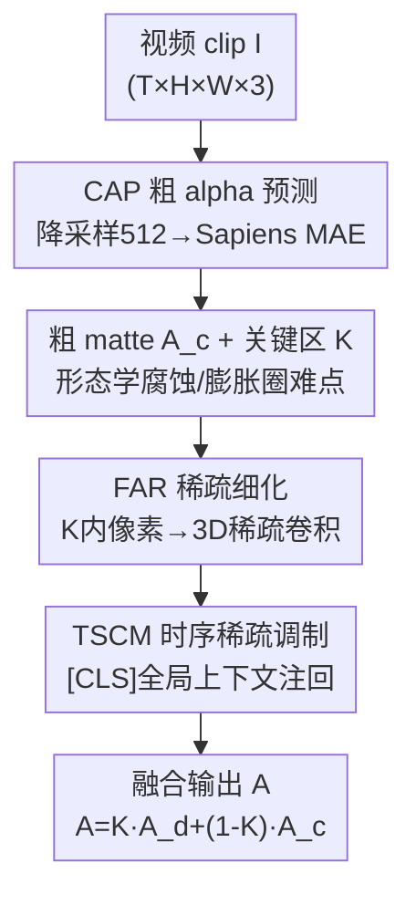

# $\alpha$Matte4K & $\mu$Matting: Dataset and Model for Ultra-Micro Precision Alpha Video Matting

**会议**: CVPR 2026  
**论文**: [CVF Open Access](https://openaccess.thecvf.com/content/CVPR2026/html/Chen_alphaMatte4K__muMatting_Dataset_and_Model_for_Ultra-Micro_Precision_Alpha_CVPR_2026_paper.html)  
**代码**: https://github.com/kadatec/mu-Matting  
**领域**: 视频理解 / 视频抠图  
**关键词**: 视频抠图, alpha matting, 4K高分辨率, PBR合成数据集, 稀疏3D卷积  

## 一句话总结
针对 4K 人像视频抠图，本文一边用物理渲染（PBR）造了一个像素级精确、前景背景物理自洽的大规模数据集 $\alpha$Matte4K，一边提出 $\mu$Matting——先用人像先验 MAE 出一张粗 alpha 并圈出"难点区域"，再只对这些稀疏区域做 3D 卷积细化，从而首次实现不降采样的全分辨率 4K 视频抠图，精度和时序一致性都超过现有 SOTA。

## 研究背景与动机

**领域现状**：高分辨率人像视频抠图要同时满足三件事——空间细节（发丝、半透明边缘）、时序一致（不闪烁）、以及 4K+ 可扩展性。现有方法在时序建模上分两类：逐帧法（RVM、AdaM 用 ConvGRU 或 attention 携带时序信息）和分块法（VMFormer 联合处理多帧），后者在高分辨率下多帧自注意力的算力/显存开销爆炸。

**现有痛点**：为了降算力，主流方法普遍走"先降采样、抠完再上采样"的路子，这会把半透明区域的 alpha 预测糊掉（Fig.2 直接指出 down-up sampling 导致 matte 不准）。另一条线靠外部 mask 稳前景（MaGGie、MatAnyone 依赖 SAM2 给初始 mask），但这把系统复杂度和推理开销抬高了，且 SAM2 一旦出错，错误会直接传导到抠图阶段。

**核心矛盾**：质量和效率在高分辨率下不可兼得——要精度就得保住原分辨率算力扛不住，要效率就得降采样牺牲细节。同时，监督学习的根子在数据：经典合成公式 $I = \alpha F + (1-\alpha)B$ 要求 alpha 监督本身既准又时序连贯，但现有数据集（VM、HHM50K）的 alpha 来自手工标注 / 抠图算法 / 绿幕抠像，本身就含噪不准；VM 这类还只给前景，需要拼贴外部背景，导致光照/几何/运动上的物理不自洽。

**切入角度**：作者重新审视视频的时序结构，做了一个关键观察——时序变化是**稀疏分布**的：一段 2 秒 clip 里只有 **13.7%** 的像素随时间明显变化，且集中在边界和细节区，大片前景其实是静止的（Fig.2 底部热力图）。这意味着没必要对整帧高分辨率做昂贵的时空计算，把算力只砸在那 13.7% 的难点区域即可。

**核心 idea**：模型侧——"粗定位 + 难区精修"的两阶段、分辨率无关框架，用稀疏 3D 卷积只细化关键区域；数据侧——彻底用 PBR 物理渲染从零生成 4K 数据集，让 alpha 标注像素级精确、前景背景天然物理一致。

## 方法详解

本文是一篇 dataset + model 论文，两条线分别讲清楚：**$\alpha$Matte4K** 解决"训练数据不准、不自洽"，**$\mu$Matting** 解决"4K 下质量-效率不可兼得"。

### 整体框架

$\mu$Matting 是一个分辨率无关的两阶段框架。输入是一段 $T$ 帧视频 clip $I \in \mathbb{R}^{T\times H\times W\times 3}$（实现取 $T=4$），输出是全分辨率 alpha matte $A$。第一阶段 **CAP（Coarse Alpha Predictor）** 把视频降到 512×512，用预训练人像 MAE 出一张粗 alpha $A_c^{\downarrow}$，并通过形态学操作圈出需要精修的"关键区域" $K$（发丝、衣物边缘、半透明区）；第二阶段 **FAR（Fractional Alpha Refiner）** 只把 $K$ 内的像素抽成稀疏表示，过 3D 稀疏卷积网络做细化，其中 **TSCM** 模块把全局时空上下文注回稀疏特征。最后用 $A = K\times A_d + (1-K)\times A_c$ 把精修结果 $A_d$ 和稳定的粗预测 $A_c$ 融合——非关键区保留稳定的粗预测，关键区享受精修。

### 关键设计

**1. $\alpha$Matte4K：用 PBR 四阶段管线造一个像素级精确、前景背景物理自洽的 4K 数据集**

针对"现有数据 alpha 不准 + 拼贴背景物理不自洽"这个根因，作者干脆放弃标注/抠像，全程用物理渲染（PBR）从虚拟场景里"算"出 alpha。管线四步：① **数字角色**——从 MetaHuman 取 30 个高质量人体模型（肤色/年龄/发型/服饰多样），用 Mixamo 骨骼动作驱动（走、跳、互动等）；② **3D 场景**——在 Unreal Engine 里搭 22 个大规模城市/自然环境，采样 900 个机位放人；③ **相机轨迹**——多种预设运动轨迹，相机视角和角色动作约每 130 帧切换一次以制造时序变化、避免重复；④ **渲染**——按短视频常见的 9:16 竖屏渲染。

关键在于 alpha 是物理渲染逐像素**算**出来的数值真值，而非手标，因此在发丝、运动模糊这类"几乎无法手工标注"的区域也能保住精确边界；同时光照、阴影、空间布局、发丝动力学都在同一物理场景内一致建模，从根上消除了前景背景的物理违和。最终 $\alpha$Matte4K 含 900 段视频、超 11.5 万帧、2160×3840 全 4K，覆盖多样人物/动作/场景/运镜，是目前最大规模的高质量人像视频抠图数据集。

**2. CAP 粗 alpha 预测：首次把人像 MAE 先验引入视频抠图，稳住前景整体性**

针对"逐帧/分块法前景不稳、易内部空洞或外部杂讯"的痛点，CAP 先把 clip 降到 512×512，送进 **Sapiens-0.3B**——一个在 3 亿+ 人像图上预训练的 masked autoencoder（MAE）。选它是因为它带强人像先验，能保证粗预测 $A_c^{\downarrow}$ 的前景结构完整、连贯，这对下游精修至关重要（作者称这是 MAE 人像先验首次用于视频抠图）。编码器把每帧转成 patch token 加一个全局 `[CLS]` token，解码出粗 alpha。

随后对 $A_c^{\downarrow}$ 中 $\alpha \in (0,1)$ 的非二值区域做形态学腐蚀/膨胀，得到一张平滑且扩张的关键区掩码 $K^{\downarrow}$——它精准框住边界和半透明结构（发丝、身体边缘），只有这些区域会进入第二阶段精修。粗 matte 和关键区都会上采样回原分辨率。监督上用 $L_{stage1}$ 结合 L1 与拉普拉斯金字塔损失，既管逐像素精度又管多尺度结构一致：
$$L_{stage1} = \frac{1}{|N|}\sum_{i\in N}|A_c^{\downarrow(i)} - A_{gt}^{\downarrow(i)}| + \sum_{l=1}^{5}\frac{1}{2^{2l}}\|L_l(A_c^{\downarrow}) - L_l(A_{gt}^{\downarrow})\|_1$$

**3. FAR 稀疏细化：只对 13.7% 的难点区域做 3D 卷积，实现无损 4K 精修**

这是"质量-效率"矛盾的解法。把原视频 $I$ 和上采样后的粗 matte $A_c$ 沿通道拼成 $I' \in \mathbb{R}^{T\times H\times W\times 4}$，再根据关键区 $K$ 只抽出需要优化的像素，转成稀疏表示 $S_{in}\in\mathbb{R}^{N_k\times 4}$（$N_k$ 是抽出的像素数，远小于全帧）。$S_{in}$ 过一个 3D 稀疏编码器（分层压缩并保留多尺度特征），再由 3D 稀疏解码器逐级重建、融合对应分辨率的编码特征恢复空间细节，输出稀疏 alpha $S_{out}\in\mathbb{R}^{N_k\times 1}$，按原稀疏索引映射回全分辨率得到 $A_d$。整个过程**只更新 $K$ 内像素**，所以不需要对整帧 4K 做昂贵计算、也不必降采样——这正是"无损 4K"的来源：稀疏 3D 卷积天然跨相邻帧聚合时空特征，又把算力只花在那 13.7% 真正会变的像素上。

**4. TSCM 时序稀疏上下文调制：补回稀疏采样丢掉的全局时空上下文**

稀疏函数只盯着选中区域，会忽略全局信息。TSCM（Temporal Sparse Context Modulator）就是用来补这个缺口的低开销模块：它把 CAP 编码器输出的全局 `[CLS]` token 投影到隐藏维 $\dim_h=256$，过 GRU 建模跨帧时空依赖，取末态 $h_T$ 经全连接 + sigmoid 后，逐元素乘回稀疏编码特征 $f_{enc}$：
$$f_{enc} = \sigma\big(\mathrm{FC}(\mathrm{GRU}(\mathrm{Proj}([CLS])))\big)\odot f_{enc}$$
这样稀疏特征就被注入了跨帧全局上下文，增强时序一致性和全局感知。妙处在于它只加 0.79M 参数（占总量 0.21%），却在所有指标上都涨。

### 损失函数 / 训练策略

第二阶段对精修输出 $A_d$ 在区域 $K$ 上算区域损失 $L_{region}$（同样是 L1 + 拉普拉斯），并引入时序一致性损失 $L_{temporal}$，在相邻帧重叠区 $K_\cap = K_t \cap K_{t+1}$ 上约束相邻帧 alpha 差分逼近真值差分：
$$L_{temporal} = \sum_t \frac{1}{|K_\cap|}\sum_{i\in K_\cap}\big((A_d^{(i,t)} - A_d^{(i,t+1)}) - (A_{gt}^{(i,t)} - A_{gt}^{(i,t+1)})\big)^2$$
再对融合后的整图加全局监督 $L_{entire}$。第二阶段总损失 $L_{stage2} = \lambda_r L_{region} + \lambda_e L_{entire} + \lambda_t L_{temporal}$，权重 $\lambda_r=1,\lambda_e=0.5,\lambda_t=0.5$。训练数据用 HHM50K（强化 CAP 前景定位）+ VM-HD（拼 DVM 背景）+ $\alpha$Matte4K。

## 实验关键数据

### 主实验

在真实世界基准 CRGNN 和拼贴测试集 VM 1920×1080 上对比（指标越低越好，MAD/MSE ×10³、Grad ×10⁻³、dtSSD ×10²）：

| 测试集 | 指标 | $\mu$Matting | RVM | SparseMat | VMFormer |
|--------|------|------|------|------|------|
| CRGNN | MAD↓ | **4.50** | 6.18 | 6.23 | 144.99 |
| CRGNN | MSE↓ | **1.57** | 2.87 | 2.86 | 132.82 |
| CRGNN | dtSSD↓ | **4.74** | 5.07 | 6.43 | 14.39 |
| VM 1920 | MAD↓ | **4.21** | 6.57 | 7.97 | 6.21 |
| VM 1920 | MSE↓ | 1.62 | 1.93 | 3.08 | **1.52** |

在 4K 可扩展性测试集 VM-4K（50 段视频、每段 100 帧 3840×2160）上，只比能跑 4K 推理的方法：

| 方法 | MAD↓ | MSE↓ | Grad↓ | dtSSD↓ |
|------|------|------|------|------|
| RVM | 5.85 | 1.34 | 23.26 | 1.85 |
| SparseMat | 6.82 | 2.32 | 16.28 | 3.44 |
| **$\mu$Matting** | **2.71** | **0.74** | **7.07** | **1.11** |

4K 下 $\mu$Matting 把 MAD 从 RVM 的 5.85 砍到 2.71、Grad 从 23.26 砍到 7.07，优势在高分辨率下尤其明显。

### 消融实验

**数据集有效性**（CRGNN，-V 仅用 VM 微调、-M 用 VM+$\alpha$Matte4K 混合微调 5 epoch）：

| 方法 | MAD↓ | MSE↓ | Grad↓ | dtSSD↓ |
|------|------|------|------|------|
| RVM-V | 6.45 | 3.08 | 14.91 | 5.28 |
| RVM-M | **6.14** | **2.88** | **14.27** | **5.13** |
| BiMatting-V | 22.01 | 15.53 | 23.44 | 3.23 |
| BiMatting-M | **16.61** | **10.66** | **20.23** | **3.00** |
| $\mu$Matting-V | 5.79 | 2.33 | 16.84 | 5.69 |
| $\mu$Matting（混合） | **4.50** | **1.57** | **13.57** | **4.74** |

加入 $\alpha$Matte4K 后所有方法、所有指标一致变好，验证了物理真实性和精确标注确实提升模型预测与一致性。

**CAP 与 TSCM 模块消融**：

| 配置 | 测试集 | MAD↓ | MSE↓ | Grad↓ | 说明 |
|------|------|------|------|------|------|
| LPN（SparseMat 原件） | HHM2K LR | 8.21 | 4.38 | 3.33 | 低分辨率粗预测 baseline |
| CAP（替换 LPN） | HHM2K LR | **7.61** | **4.01** | **2.17** | 人像 MAE 先验更准 |
| w/o TSCM | CRGNN | 4.64 | 1.61 | 14.08 | 去掉 TSCM |
| Full $\mu$Matting | CRGNN | **4.50** | **1.57** | **13.57** | 完整模型 |

### 关键发现
- **稀疏假设站得住**：2 秒 clip 里仅 13.7% 像素随时间变化，这是整个"粗定位 + 难区精修"设计的实证基石；把算力集中到难点区，4K 下精度反而全面领先。
- **人像 MAE 先验贡献明显**：CAP 换掉 SparseMat 的 LPN 后，HHM2K 上 MAD 8.21→7.61、Grad 3.33→2.17，前景更完整、内部空洞和外部杂讯都减少。
- **TSCM 性价比极高**：仅 0.79M 参数（0.21% 总量），却在所有指标上都涨，说明给稀疏特征注回全局时序上下文确有必要。
- **为什么两个合成集叠加能提升真实世界表现**：t-SNE 可视化显示 $\alpha$Matte4K 的数据分布比 VM 更贴近真实视频分布，这解释了它带来的真实场景增益。
- **效率**：381.71M 参数，4K 推理占显存 6.8GB、11.8 FPS（2K 为 15.2 FPS），作者明确效率不是主攻点，但框架有实时 4K 潜力。

## 亮点与洞察
- **用一个数据观察驱动整套架构**：13.7% 的时序稀疏性不是事后解释，而是直接决定了"只精修关键区"的稀疏 3D 设计——把"观察→设计"的逻辑链摆得很清楚，是很好的研究范式示范。
- **PBR 造数据集釜底抽薪**：抠图最难的发丝/运动模糊区域恰恰是人工最标不准的，物理渲染把 alpha 变成"算出来的真值"，绕开标注精度天花板，这个思路可迁移到任何需要高精度软分割监督的任务。
- **稀疏 3D 卷积 + 全局 token 调制**的组合很巧：稀疏卷积省算力但丢全局，恰好用 CAP 已经算好的 `[CLS]` token 经 GRU 补回时序全局上下文，几乎零额外成本，复用了第一阶段的副产物。
- **粗-精融合公式 $A=K\cdot A_d+(1-K)\cdot A_c$** 简单但稳：非关键区一律信任稳定的粗预测，避免精修网络在大片静止前景上乱动，是工程上很实用的稳态保证。

## 局限与展望
- 作者承认效率不是主攻点：当前 4K 仅 11.8 FPS，未达实时，未来工作要把两个组件都往实时 4K 推。
- $\alpha$Matte4K 虽物理自洽，但仍是**纯合成**数据（MetaHuman + UE 渲染），真实人像的皮肤纹理、复杂材质、真实噪声分布可能与渲染存在 domain gap；论文用 t-SNE 论证分布接近，但真实世界泛化仍依赖与 VM 等数据混训。⚠️ 合成-真实差距的长期影响有待更大规模真实测试验证。
- 关键区 $K$ 由形态学操作 + 阈值得到，若第一阶段 CAP 在某些极端姿态/遮挡下漏判，难点区可能圈不全，精修也就无从谈起——两阶段的上限受制于第一阶段定位质量。
- 方法专为**人像**视频抠图设计（人像 MAE 先验、人体素材），迁移到通用物体抠图需要换 backbone 先验，适用范围受限。

## 相关工作与启发
- **vs RVM / AdaM（逐帧 + 记忆）**：它们靠 ConvGRU / attention 携带时序但要降采样保算力，4K 下细节糊；本文只对稀疏难区做 3D 卷积，全分辨率无损，4K MAD 从 5.85 降到 2.71。
- **vs VMFormer（分块多帧注意力）**：多帧自注意力在高分辨率下显存/算力爆炸，且在 CRGNN 真实集上因 domain 不适配严重掉点（MAD 144.99）；本文稀疏化避开了这个开销。
- **vs SparseMat（稀疏图像抠图）**：同样走稀疏路线，但 SparseMat 根植于图像抠图、仅靠简单帧差缺时序连续性；本文用 3D 稀疏卷积 + TSCM 把时序建进来，并直接拿 CAP 替换其 LPN 证明粗预测更优。
- **vs MaGGie / MatAnyone（SAM2 引导）**：它们依赖外部 mask 稳前景，SAM2 出错会传导；本文用自带的人像 MAE 先验稳前景，无需外部模型，pipeline 更鲁棒。

## 评分
- 新颖性: ⭐⭐⭐⭐⭐ 数据观察（13.7% 时序稀疏）驱动稀疏精修架构，加上 PBR 造高精 4K 数据集，data + model 双线创新都扎实
- 实验充分度: ⭐⭐⭐⭐⭐ 真实/拼贴/4K 三类测试集 + 数据集有效性 + CAP/TSCM 模块消融 + 效率分析，覆盖全面
- 写作质量: ⭐⭐⭐⭐ 动机-观察-设计逻辑清晰，图表到位；个别公式记号（如下采样上标）略密
- 价值: ⭐⭐⭐⭐⭐ 首个无损 4K 视频抠图框架 + 最大规模高质量数据集，已开源，对短视频/虚拟会议等实际场景价值高

<!-- RELATED:START -->

## 相关论文

- [\[ECCV 2024\] COIN-Matting: Confounder Intervention for Image Matting](../../ECCV2024/others/coin-matting_confounder_intervention_for_image_matting.md)
- [\[CVPR 2026\] AniMimic: Imitating 3D Animation from Video Priors](animimic_imitating_3d_animation_from_video_priors.md)
- [\[CVPR 2026\] From Pixel to Precision: Enhancing Handwritten Mathematical Expression Recognition with Image-Level Reward](from_pixel_to_precision_enhancing_handwritten_mathematical_expression_recognitio.md)
- [\[CVPR 2026\] What Is the Optimal Ranking Score Between Precision and Recall? We Can Always Find It and It Is Rarely F₁](what_is_the_optimal_ranking_score_between_precision_and_recall_we_can_always_fin.md)
- [\[CVPR 2026\] A Unified Framework for Knowledge Transfer in Bidirectional Model Scaling](a_unified_framework_for_knowledge_transfer_in_bidirectional_model_scaling.md)

<!-- RELATED:END -->
