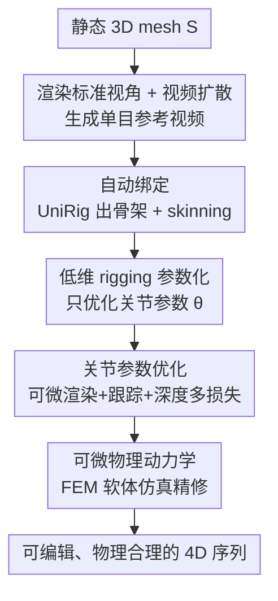

# AniMimic: Imitating 3D Animation from Video Priors

**会议**: CVPR 2026  
**论文**: [CVF Open Access](https://openaccess.thecvf.com/content/CVPR2026/html/Xie_AniMimic_Imitating_3D_Animation_from_Video_Priors_CVPR_2026_paper.html)  
**代码**: [项目页](https://xpandora.github.io/AnimaMimic/)（无开源代码）  
**领域**: 3D视觉 / 4D生成  
**关键词**: 3D动画, 视频扩散先验, 可微渲染, 可微物理仿真, 自动绑定骨骼

## 一句话总结
AniMimic 把视频扩散模型生成的单目动画当作运动监督，给一个静态 3D mesh 自动绑骨、用可微渲染优化关节参数把 2D 运动"抬"回 3D，再用可微 FEM 软体仿真补上惯性与弹性，产出可编辑、物理合理、可直接进动画流水线的 4D 序列。

## 研究背景与动机
**领域现状**：做一段有表现力的 3D 动画长期靠艺术家手工绑骨、打关键帧、调形变，既慢又依赖经验。另一边，视频扩散模型（Kling、Sora 这类）已经能从文本/图片生成动态且视觉连贯的 2D 运动，运动想象力很强。

**现有痛点**：视频扩散的输出停留在 2D 图像平面，没有显式 3D 结构，不能直接拿去渲染、仿真或交互编辑。为了把这种运动先验变成 3D，已有的 4D 生成方法走了两条路，但都不好用：一条用 score-distillation sampling（SDS）直接优化 NeRF / Gaussian splats，几何和外观纠缠在一起，优化慢、可控性差、难接入标准动画流水线；另一条用隐式辐射场或 Gaussian 从生成视频里重建运动，但这种表示和现代 CG 工作流不兼容，难编辑、难复用。

**核心矛盾**：视频扩散的"创造力"在 2D，而下游动画需要的"结构可控性"在显式 3D rigged mesh，二者之间隔着一道没人架好的桥；同时纯 LBS 绑定优化出的运动是准静态的（quasi-static），缺惯性和弹性，看起来不真实。

**本文目标**：不去重建几何，而是直接**给一个已有的显式 3D mesh 赋予运动**——既要把视频扩散的运动先验吃进来，又要保持 mesh 的可编辑、可仿真。

**切入角度**：借鉴传统动画师的工作流——先勾骨架、再迭代细化运动。于是用"骨架 + mesh"这种低维表示来参数化运动，而不是直接动几万个顶点。

**核心 idea**：用可微渲染把视频扩散生成的 2D 运动监督回传到**关节参数**上（低维、稳定），再用一个嵌进优化环里的**可微物理仿真**把准静态运动升级成有惯性弹性的真实动力学。

## 方法详解

### 整体框架
输入是一个带纹理的静态 mesh $S$（艺术家做的或 text/image-to-3D 生成的），输出是一段动画序列 $\{S_1, ..., S_T\}$。流程分两大阶段：先把 mesh 渲成一张标准视角图，喂给视频扩散模型生成单目参考视频（提供运动先验）；用前馈绑定网络自动构出骨架 + skinning 权重，把 mesh 变成可动的 rigged 表示。**第一阶段**通过可微渲染 + 点跟踪 + 深度监督优化关节的旋转/平移参数，把 mesh 运动对齐到视频线索；**第二阶段**接入可微软体仿真，用物理形变进一步精修，补上 LBS 缺的惯性弹性效果，并消除绑定带来的表面瑕疵。

### 关键设计

**1. 低维 rigging 参数化：把"动几万个顶点"换成"动几十个关节"**

直接优化 mesh 顶点位置维度太高，搜索空间巨大，容易不稳定或陷入次优。AniMimic 改成用骨架系统建模运动：一个根关节 $J_0$ 加一组关节 $\{J_i\}_{i=1}^K$，每个关节带局部旋转 $R_i \in SO(3)$ 和平移 $t_i$，全局变换靠前向运动学（FK）沿运动链递推 $T_i = T_{\text{parent}(i)}[R_i \mid t_i]$；顶点形变用 Linear Blend Skinning（LBS）：$x_i = \sum_{k=1}^K w_{ik} T_k X_i$，$\sum_k w_{ik}=1$。骨架和 skinning 权重不手工做，而是用前馈网络 **UniRig** 在大规模绑定模型上训练后直接预测。最终待优化的姿态参数 $\theta = \{(r_i, t_i)\}_{i=0}^K$，其中 $r_i$ 用 6D 旋转表示（再经连续 6D→$SO(3)$ 映射成合法旋转矩阵）。这样把高维顶点运动压成低维关节参数，优化稳定、可控、且天然可编辑——这是后面所有监督能稳定收敛的前提。

**2. 关节参数优化：用视频扩散的 2D 运动多路监督把姿态"抬"回 3D**

光有低维参数还不够，得有信号告诉它"该怎么动"。AniMimic 把视频扩散生成的参考帧序列 $\{I_t\}$ 当监督，对每帧关节参数 $\theta_t$ 做优化，总损失为

$$L = \lambda_{rgb}L_{rgb} + \lambda_{mask}L_{mask} + \lambda_{track}L_{track} + \lambda_{depth}L_{depth} + \lambda_{smooth}L_{smooth} + \lambda_{reg}L_{reg}.$$

各项各司其职：$L_{rgb}$、$L_{mask}$ 用 PyTorch3D 的可微 SoftPhong 与轮廓渲染，把渲染出的外观/前景对齐参考帧（mask 用 SAM2 提取）；考虑到扩散视频会有幻觉区域和光影不一致，单纯比像素不稳，于是加 $L_{track}$——在参考图前景采样像素、反投影到 mesh 三角面记下重心坐标 $\beta_i$，用 **AllTracker** 跟踪这些点在生成视频里的 2D 轨迹，约束 mesh 投影点贴着轨迹走；渲染和跟踪都缺深度约束，再用 **VGGT** 预测逐帧深度做 $L_{depth}$（带归一化算子缓解尺度歧义）；$L_{smooth}$ 用一阶+二阶顶点差惩罚相邻帧的突变保证时序连贯；$L_{reg}$ 把非根关节的旋转平移幅度 clip 在阈值 $\hat\theta$ 内，防止局部变换爆掉。这一套多路监督的关键在于互补——渲染管外观、跟踪管轨迹、深度管 z 向、平滑管时序——单靠任何一路都会形变跑偏。

**3. 可微物理动力学：用 FEM 软体仿真把准静态运动升级成有惯性弹性的真实动力学**

绑定优化出的运动有两个硬伤：自动绑定网络给的 skinning 权重不完美会造成表面瑕疵（抖动、自相交）；LBS 本身是准静态的，抓不住惯性、弹性这类动态响应。AniMimic 把一个**可微 FEM 软体仿真**塞进优化环来精修。它把表面三角网格用 TetWild 转成四面体网格 $S_{\text{tet}}$，按牛顿第二定律 $\frac{d^2x}{dt^2}=M^{-1}f(x)$ 建模连续体形变，用后向欧拉做数值积分并写成优化式时间积分

$$x^{n+1} = \arg\min_x \tfrac{1}{2}\|x - \tilde{x}\|_M^2 + \Psi(x),$$

弹性能用 Fixed Corotated 模型、牛顿法加线搜索求解；再借伴随法 + 自动微分让整个时间积分对状态和材料参数可微，从而能端到端回传梯度。每个关节的全局变换 $T_i$ 作为最近四面体的驱动边界条件。材料侧优化各四面体的杨氏模量 $E_i$，让仿真形变匹配参考视频；为避免自由度过多，先按到各关节的空间邻近度把四面体聚类、簇内共享一个 $E_i$，再逐步细分簇做 coarse-to-fine 优化（实践中优化 $\log E_i$ 提升稳定性）。这一步是把"看着像"的运动变成"物理上站得住"的运动的关键。

### 损失函数 / 训练策略
两阶段都用 Adam，学习率 $10^{-3}$。第一阶段优化关节参数 $\theta_t$（总损失见设计 2）；第二阶段在同一损失目标 $L$ 下优化逐元素杨氏模量 $E_i$（关节变换 $T_i$ 充当边界条件），并对 $\log E_i$ 做优化以稳数值。物理模块用 Warp 实现（支持 AutoDiff）。参考视频由"渲染单帧 → LLM 生成运动 prompt → Kling 图生视频"产出。

## 实验关键数据

### 主实验
在自建的多源带纹理 3D 模型数据集上（含公开数据集与 text/image-to-3D 工具生成的角色、动物等），每个方法生成 20 段运动，并按输入视角 + ±45° 两个新视角的多视角协议渲染评测。

| 方法 | SSIM↑ | LPIPS↓ | VBAQ↑ | VBOC↑ | VBIQ↑ |
|------|-------|--------|-------|-------|-------|
| SC4D | **0.9403** | 0.0924 | 0.541 | 0.174 | 0.392 |
| DreamMesh4D | 0.8662 | 0.1482 | 0.543 | 0.175 | 0.550 |
| Puppeteer | 0.9023 | 0.1097 | 0.572 | 0.176 | **0.632** |
| **本文** | 0.9318 | **0.0849** | **0.581** | **0.176** | 0.606 |

本文在 LPIPS、整体时序一致性（VBOC）、美学质量（VBAQ）上领先。SC4D 的 SSIM 最高，但作者解释那是因为它保留了低频结构却常生成错误纹理、扭曲几何，时序与画质实际很差——说明 SSIM 单看会误导。

### 用户研究（2AFC，本文相对各 baseline 的偏好率）
| 对比对象 | 视觉质量 VQ | 时序一致 TC | 运动合理 MP | 总体 |
|----------|------------|------------|------------|------|
| vs SC4D | 96% | 93% | 92% | 91% |
| vs DreamMesh4D | 88% | 91% | 95% | 91% |
| vs Puppeteer | 74% | 78% | 69% | 71% |

用户在所有维度都更偏好本文，尤其运动合理性；相对 Puppeteer 优势最小（71% 总体），说明 Puppeteer 画质虽好但运动范围受限是主要可被超越点。

### 消融实验
| 配置 | 现象 | 说明 |
|------|------|------|
| Full | 形状/运动一致，贴合参考视频 | 完整模型 |
| w/o Depth | 出现形变扭曲、偏离参考运动 | 缺 z 向约束 |
| w/o Mask | 同上 | 缺前景对齐 |
| w/o Track | 同上 | 缺轨迹约束 |
| w/o Physics | 大形变区域抖动、自相交 | 缺软体仿真精修 |

### 关键发现
- 多路损失任意去掉一项都会让部件扭曲、偏离参考运动，三路监督（mask/track/depth）是互补的，缺一不可。
- 物理精修阶段专治绑定 mesh 在大局部形变区的抖动与自相交，让几何与运动都变平滑——这是和"纯 LBS 准静态"4D 方法拉开差距的核心。
- baseline 各有短板：SC4D 点表示导致拓扑破洞（如狗尾巴缺一块）；DreamMesh4D 控制节点多、关节处几何扭曲且只能做小幅近刚体运动；Puppeteer 时序稳但运动范围明显受限（恐龙转脖子只能小幅抬头）。

## 亮点与洞察
- **"不重建几何，只赋予运动"的取舍很聪明**：绕开 4D 重建里几何-外观纠缠的老大难，直接动已有 explicit mesh，天然保住可编辑、可仿真、可进标准流水线——这是把生成式视频接到工业动画的实用桥。
- **可微物理进优化环这一步是画龙点睛**：多数 LBS-based 4D 方法到关节优化就停了、运动准静态；把可微 FEM 软体仿真嵌进来同时治表面瑕疵和缺动力学两个病，杨氏模量 coarse-to-fine 聚类优化也是降自由度的实用 trick。
- **多路监督对抗扩散视频的不可靠**：扩散视频有幻觉和光影漂移，作者没硬信像素，而是用点跟踪 + 深度把"靠谱的几何线索"挑出来当监督，思路可迁移到任何"拿生成视频当弱监督"的任务。
- **SSIM 高不等于好**：用 SC4D 的例子点破单一相似度指标的误导性，提醒读 4D/视频生成结果时要看 LPIPS + 时序 + 用户研究综合判断。

## 局限与展望
- 强依赖外部组件链路（视频扩散 Kling、UniRig 绑定、SAM2、AllTracker、VGGT），任一环节出错（如绑定权重差、跟踪漂移）都会传导到最终结果；论文也承认绑定瑕疵正是要靠物理精修来补救。
- 运动先验来自单目视频扩散，复杂遮挡、大幅自遮挡或多物体交互场景下，2D→3D 抬升的歧义可能难解（⚠️ 论文未给这类极端 case 的定量分析）。
- 评测规模偏小（每方法 20 段序列），且数据集为自建多源集合，跨方法可比性依赖作者的多视角渲染协议；物理仿真 + 逐元素材料优化的计算开销与单序列耗时未在正文给出。
- 改进方向：引入多视角/多条参考视频降低单目歧义；把材料参数预测也做成前馈网络以摆脱逐序列优化；扩展到关节-接触（如脚踩地、手抓物）的物理约束。

## 相关工作与启发
- **vs SDS-based 4D（SC4D 等 Gaussian/NeRF 路线）**：他们直接优化隐式表示、几何外观纠缠、慢且难编辑；本文动 explicit mesh，可控可编辑，且 LPIPS/时序更好，但 SSIM 略低。
- **vs DreamMesh4D**：同样 mesh-based，但它靠大量独立控制节点、关节处易扭曲且只能小幅近刚体运动；本文用骨架低维参数化 + 物理精修，运动幅度更大更稳。
- **vs Puppeteer / AKD（Skeleton-Rigging-Skinning 路线）**：它们也走绑定+可微渲染，但运动准静态、范围受限；本文的差异化贡献正是把**可微物理仿真**塞进优化环，捕捉惯性弹性，产出物理合理的动力学。

## 评分
- 新颖性: ⭐⭐⭐⭐ 首次把可微 FEM 软体仿真嵌进"视频扩散先验驱动的 explicit mesh 绑定优化"环里，组合新颖且针对真实痛点。
- 实验充分度: ⭐⭐⭐ 主表 + 用户研究 + 损失/物理消融齐全，但序列数偏少、缺耗时与极端场景定量分析。
- 写作质量: ⭐⭐⭐⭐ 两阶段管线讲得清楚，公式与监督设计交代到位，图示丰富。
- 价值: ⭐⭐⭐⭐ 把生成式视频接进可编辑可仿真的工业动画流水线，实用导向强。

<!-- RELATED:START -->

## 相关论文

- [\[CVPR 2026\] 3D-Object Perception Transformer (3PT)](3d-object_perception_transformer_3pt.md)
- [\[CVPR 2026\] Efficient Unrolled Networks for Large-Scale 3D Inverse Problems](efficient_unrolled_networks_for_large-scale_3d_inverse_problems.md)
- [\[CVPR 2026\] 4DWorldBench: A Comprehensive Evaluation Framework for 3D/4D World Generation Models](4dworldbench_a_comprehensive_evaluation_framework_for_3d4d_world_generation_mode.md)
- [\[CVPR 2026\] $\alpha$Matte4K & $\mu$Matting: Dataset and Model for Ultra-Micro Precision Alpha Video Matting](alphamatte4k_mumatting_dataset_and_model_for_ultra-micro_precision_alpha_video_m.md)
- [\[ICCV 2025\] Jigsaw++: Imagining Complete Shape Priors for Object Reassembly](../../ICCV2025/others/jigsaw_imagining_complete_shape_priors_for_object_reassembly.md)

<!-- RELATED:END -->
