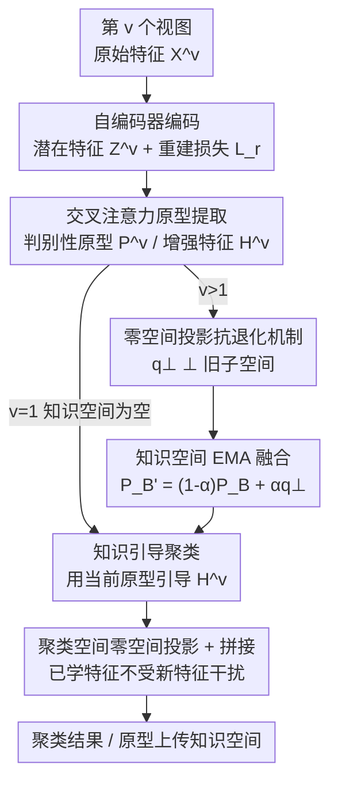

# Anti-Degradation Lifelong Multi-View Clustering

**会议**: CVPR 2026  
**论文**: [CVF Open Access](https://openaccess.thecvf.com/content/CVPR2026/html/Li_Anti-Degradation_Lifelong_Multi-View_Clustering_CVPR_2026_paper.html)  
**代码**: https://github.com/lee-xingfeng/ALMC/  
**领域**: 多视图聚类 / 终身学习  
**关键词**: 多视图聚类, 终身学习, 零空间投影, 知识退化, 流式视图  

## 一句话总结
针对"视图随时间不断到来"的流式多视图聚类场景，ALMC 把每个新视图的原型投影到旧知识子空间的**零空间**（正交方向）后再融合，从数学上保证新知识不覆盖旧知识，在 6 个基准上多数指标取得 SOTA（如 ALOI-10 ACC 从 87.4% 提到 90.9%）。

## 研究背景与动机
**领域现状**：多视图聚类（MVC）通过整合多个异构视图（如医疗诊断里的生理信号、病历、影像）来挖掘样本的共享结构，主流方法分为子空间、图、多核、深度四类，其中深度 MVC 因强非线性表达能力最受关注。

**现有痛点**：绝大多数深度 MVC 都隐含假设"所有视图一开始就全部可得"。但真实部署中视图是**持续、动态流式**到达的（如智慧监控里视频/热成像/音频从分布式传感器源源不断采集）。要处理这种数据流，需要的是**终身学习**框架而不是静态模型。已有的流式方法 LSVC（基于规则更新知识库）、DSVC（对齐原型分布缓解漂移）虽然尝试用一致性对齐 / 知识蒸馏来把新知识与旧知识对齐，但都**无法从根本上阻止知识退化**。

**核心矛盾**：各视图之间差异很大，于是"学新知识"和"保旧知识"天然冲突。过去视图的知识只被压缩进一个原型里保存，增量更新会在**同一个表示空间内**让新原型滑动、覆盖、扭曲早先学到的信息；这些被污染的原型又被用来指导后续视图，误差在终身学习全程**累积**，最终导致聚类结果严重退化。一致性对齐这类做法只是"事后拉近"，新知识仍然不可避免地干扰了已学的表示空间。

**本文目标**：设计一个能在视图流上**稳定增长**、且对旧知识"零干扰"的终身多视图聚类框架。

**核心 idea**：用线性代数里的**零空间投影**代替"事后对齐"——把每个新视图的原型更新约束到旧知识子空间的正交补（零空间）方向上，使新知识与旧知识在几何上正交，从而在更新发生的那一刻就保证不覆盖旧知识，并辅以理论证明。

## 方法详解

### 整体框架
ALMC 处理一条视图流 $\{X^i\}_{i=1}^{V}$（共 $V$ 个视图、$N$ 个样本），每个视图依次到达、训练完即把自己的原型知识"上传"到一个持久的**知识空间**供后续视图复用。单个视图的处理链路是：先用**自编码器**把原始特征编码为统一维度 $d$ 的潜在表示 $Z^v\in\mathbb{R}^{N\times d}$（并由解码器重建、用重建损失抑制冗余）；再经 MLP + **交叉注意力**抽取更具判别性的原型 $P^v$ 与增强特征 $H^v$；当 $v>1$ 时，新原型先被投影到旧知识子空间的**零空间**再以 EMA 方式融入知识空间，同时用知识空间里存的原型 $P_B$ 通过**知识引导损失**去校准当前视图的特征分布；最后在**聚类空间**同样对每个新视图特征做零空间投影后拼接，保证已学特征不被新特征污染。

### 关键设计

**1. 零空间投影抗退化机制：让新知识更新与旧知识正交，从根上不覆盖**

这是全文核心，直接针对"新原型在旧表示空间里滑动、覆盖旧知识"这个痛点。给定算子 $A$，其零空间是满足 $Av=0$ 的向量集合 $\text{Null}(A)=\{v\in V: Av=0\}$。在知识空间里，当视图 $v>1$ 时，设已存的原型知识为 $P_B$、当前视图原型为 $P_n$，目标是把 $P_n$ 投影到 $P_B$ 的零空间。作者先用 Lemma 1 证明 $P_B$ 与 $P_B(P_B)^T$ 拥有相同的左零空间，于是改在 $d\times d$ 的 $P_B(P_B)^T$ 上算投影更省算力：对它做 SVD 得 $U,\Lambda,U^T$，**剔除非零特征值对应的列**得到子矩阵 $\hat U$（其列张成旧子空间的正交补），投影矩阵就是

$$P=\hat U\hat U^T,\qquad q^{\perp}=PP_n\in S^{\perp}.$$

Lemma 2 进一步证明对任意旧原型 $p\in S$ 都有 $p^T q^{\perp}=0$，即投影后的 $q^{\perp}$ 与所有旧原型正交、只携带旧知识空间里没有的新信息。和 LSVC/DSVC 的"事后对齐"本质不同：对齐只是把新旧拉近、干扰已经发生；零空间投影是在更新发生前就把新增量限制到正交方向，**干扰量恒为零**，作者用实验和理论双重佐证了这一点。

**2. 交叉注意力原型提取：从复杂潜在特征里抽出真正判别性的原型**

光靠 MLP 把潜在特征 $Z^v$ 映射成原型 $U^v$ 不足以提炼出复杂特征里的共享判别知识。ALMC 引入交叉注意力，让原型与特征互相增强：

$$A^v=\text{Softmax}\!\left(\frac{(W_Z^v Z^v)^T W_U^v U^v}{\sqrt{d}}\right),\quad P^v=U^v+A^v W_H'^v Z^v,\quad H^v=Z^v+A^v W_P'^v U^v.$$

其中 $W_Z^v,W_U^v$ 是潜在特征与原型的线性映射，$W_H'^v,W_P'^v$ 是各自的精炼层。结果是同时得到更判别的原型 $P^v$ 和增强特征 $H^v$，为后续零空间投影和知识引导提供高质量输入——原型质量直接决定了知识空间存进去的"是不是好知识"。

**3. 知识空间 EMA 融合 + 知识引导聚类：稳健地累积知识并用它校准特征分布**

新原型投影成 $q^{\perp}$ 后，用 EMA 加权融合进知识空间：$P_B'=(1-\alpha)P_B+\alpha q^{\perp}$。作者证明把 $P_B'$ 投回旧子空间 $S$ 时 $P_S(P_B')=(1-\alpha)P_B$——也就是说 EMA 只是把旧原型幅度按可控因子 $(1-\alpha)$ 缩放，方向不变，而正交的 $q^{\perp}$ 在旧子空间上的投影分量为零，旧原型表示完全不受影响。多步更新后知识沿零空间方向稳定累积：$P_B^t=(1-\alpha)^t P_B+\sum_{k=0}^{t-1}(1-\alpha)^k q^{\perp}_{t-k}$。

知识被妥善保存后，再用它来引导聚类。知识引导损失 $L_g$ 度量当前特征与原型知识的相似度：先算 $M(h_i^v,p_j^v)=\exp(S(h_i^v,p_j^v))$，归一化得"第 $j$ 个原型包含第 $i$ 个特征"的概率 $G_{i,j}=\frac{\exp(S(h_i^v,p_j^v))}{\sum_{k=1}^{K}\exp(S(h_i^v,p_k^v))}$，损失为 $L_g=\frac{1}{KN}\sum_{j=1}^{K}\sum_{i=1}^{N}\log G_{i,j}$。第一个视图知识空间为空，直接用 $P^v$ 引导 $H^v$；后续视图则用知识空间里存的 $P_B$ 引导，让特征同时受益于历史与当前原型。最后在**聚类空间**对每个新到视图的特征同样做零空间投影再拼接，确保已学特征在聚类阶段也不被新特征污染。

### 损失函数 / 训练策略
总目标为重建损失与知识引导损失的加权和：

$$L=\beta L_r+\gamma L_g,$$

其中重建损失 $L_r=\lVert X^v-F_{\Phi^v}^v(E_{\theta^v}^v(X^v))\rVert_2^2$（$E,F$ 为编/解码器）用于抑制冗余、保留对聚类有用的特征，$L_g$ 为上文的知识引导损失。训练用 PyTorch 实现，每个到达视图跑 200 epoch、batch 256、学习率 1e-4，Adam 优化、ReLU 激活；$\beta,\gamma$ 在 $10^1\!\sim\!10^{-1}$ 区间表现最佳。

## 实验关键数据

### 主实验
在 6 个多视图基准（Oxford4、ALOI-10、NUS、OutdoorScene、ALOI-100、Aloideep3v）上对比 8 个深度 MVC 和 2 个流式视图聚类方法（LSVC、DSVC）。ALMC 在 5 个数据集上取得最优、NUS 上次优。下表为部分代表性结果（ACC / NMI / ARI，%）：

| 数据集 | 指标 | ALMC(本文) | 次优方法 | 提升 |
|--------|------|-----------|----------|------|
| ALOI-10 | ACC | **90.90** | 87.38 (ICMVC) | +3.52 |
| ALOI-10 | ARI | **83.37** | 78.74 (DSVC) | +4.63 |
| OutdoorScene | ACC | **64.26** | 61.79 (APADC) | +2.47 |
| ALOI-100 | ACC | **82.62** | 80.53 (DSVC) | +2.09 |
| Aloideep3v | ACC | **88.18** | 88.17 (FMCSC) | +0.01 |
| Oxford4 | ACC | **36.87** | 36.30 (DSVC) | +0.57 |

相比代表性流式方法 DSVC，ALMC 避开了"分布一致性对齐"带来的信息损失，并充分利用所有视图的知识而非只依赖当前视图原型；各指标方差较低也说明它对数据流不确定性更鲁棒。

### 消融实验
框架含三大组件：知识聚合学习模块（$L_r$）、知识空间（含零空间投影）、知识引导学习模块（$L_g$）。Model I 去掉 $L_g$ 和零空间投影；Model II 仅去掉零空间投影；Model III 去掉 $L_r$；Model IV 去掉 $L_g$ 并把零空间投影**换成分布一致性损失**。下表为 ACC（%）：

| 配置 | ALOI-10 | OutdoorScene | ALOI-100 | 说明 |
|------|---------|--------------|----------|------|
| Model I | 52.81 | 40.51 | 61.98 | 去 $L_g$ + 零空间投影，掉得最惨 |
| Model II | 76.92 | 55.69 | 77.33 | 去零空间投影 |
| Model III | 81.28 | 56.29 | 60.95 | 去重建损失 $L_r$ |
| Model IV | 82.21 | 55.80 | 81.31 | 用分布一致性替代零空间投影 |
| Full Model | **90.90** | **64.26** | **82.62** | 完整模型 |

### 关键发现
- **零空间投影是退化问题的关键**：Model II（去掉投影）相比 Full 在 ALOI-10 上 ACC 从 90.9% 掉到 76.9%；即便用分布一致性损失替代（Model IV）也只到 82.2%，证明"事后对齐"确实不如"正交更新"能从根上防退化。
- **知识引导损失 $L_g$ 贡献最大**：Model I 同时去掉 $L_g$ 和投影后塌到 52.8%，说明用知识空间原型引导特征分布对聚类结构至关重要。
- **稳定性优势**：在 OutdoorScene 上随视图增多，LSVC 聚类性能剧烈震荡，而 ALMC 稳步上升（Fig. 6b）；打乱视图到达顺序（Order A–E）精度差异极小，对视图序列鲁棒。
- $\beta,\gamma$ 过大过小都会损害精度，需在三项损失间取得平衡（最佳区间 $10^1\!\sim\!10^{-1}$）。

## 亮点与洞察
- **把"防遗忘"从优化技巧升级为代数约束**：用零空间投影保证 $p^T q^{\perp}=0$，干扰量在数学上恒为零，并配 Lemma 1/2 与 EMA 不变性证明——这比 EWC/蒸馏那类"软约束"更彻底，是可迁移到任意终身表示学习的范式。
- **算力上的小巧思**：直接对 $P_B$ 求零空间维度高，作者证明 $P_B$ 与 $P_B(P_B)^T$ 同左零空间，于是在 $d\times d$ 的小矩阵上做 SVD，把投影计算压到可控规模。
- **双空间一致防护**：不仅在知识空间防原型被覆盖，还在聚类空间对特征做同样的零空间投影 + 拼接，保证"存的知识"和"用的特征"两头都不退化。

## 局限与展望
- 零空间投影要求旧知识子空间有足够的正交补维度——当视图非常多、子空间几乎占满整个特征空间时，零空间维度会被耗尽，新知识"无处安放"，论文未讨论这一上限。⚠️ 此为笔者推断，以原文为准。
- 评测集中在传统多视图特征数据集（HSB/RGB/SIFT/GIST 等手工或浅层特征），类别数最多到 1000（Aloideep3v），但样本量都不大（千到万级），在大规模、真实流式（如长视频流）场景下的可扩展性尚待验证。
- 相似度 $S(\cdot,\cdot)$ 的具体形式、以及 EMA 系数 $\alpha$ 如何随视图数自适应，文中交代较略，复现时需查附录。

## 相关工作与启发
- **vs LSVC**：LSVC 用基于规则的知识库更新，规则预设导致在分布漂移下不稳健（实验里随视图增多剧烈震荡）；ALMC 用零空间投影做几何级的零干扰更新，性能稳步增长。
- **vs DSVC**：DSVC 用分布一致性对齐缓解增量漂移，但对齐会损失信息、且仍只靠当前视图原型；ALMC 充分利用所有历史视图知识，并从原理上阻止退化（消融里分布一致性替代版 Model IV 明显逊于完整模型）。
- **vs 一般终身学习（EWC/蒸馏类）**：那些方法用正则或蒸馏"软性"约束参数/输出，干扰仍会累积；ALMC 把约束下沉到表示空间的正交性，是更硬的保证，思路可迁移到知识保持型的表示学习与聚类。

## 评分
- 新颖性: ⭐⭐⭐⭐⭐ 首次揭示并系统研究流式视图聚类的知识退化问题，用零空间投影给出有理论证明的解法
- 实验充分度: ⭐⭐⭐⭐ 6 数据集 + 10 个对比方法 + 消融/顺序/参数分析较全，但数据集规模偏小、缺真实流式场景
- 写作质量: ⭐⭐⭐⭐ 动机与机制讲得清楚、附引理证明，个别符号（相似度 $S$、$\alpha$ 自适应）交代偏略
- 价值: ⭐⭐⭐⭐ 抗退化范式对终身/持续表示学习有可迁移的指导意义

<!-- RELATED:START -->

## 相关论文

- [\[CVPR 2026\] Multi-Hierarchical Contrastive Spectral Fusion for Multi-View Clustering](multi-hierarchical_contrastive_spectral_fusion_for_multi-view_clustering.md)
- [\[CVPR 2026\] Scalable Multi-View Subspace Clustering with Tensorized Anchor Guidance](scalable_multi-view_subspace_clustering_with_tensorized_anchor_guidance.md)
- [\[CVPR 2026\] Reliable Clustering Number Estimation for Contrastive Multi-View Clustering](reliable_clustering_number_estimation_for_contrastive_multi-view_clustering.md)
- [\[CVPR 2026\] Learning Anchor in Dual Orthogonal Space for Fast Multi-view Clustering](learning_anchor_in_dual_orthogonal_space_for_fast_multi-view_clustering.md)
- [\[CVPR 2026\] Imbalanced View Contribution Evaluation and Refinement for Deep Incomplete Multi-View Clustering](imbalanced_view_contribution_evaluation_and_refinement_for_deep_incomplete_multi.md)

<!-- RELATED:END -->
