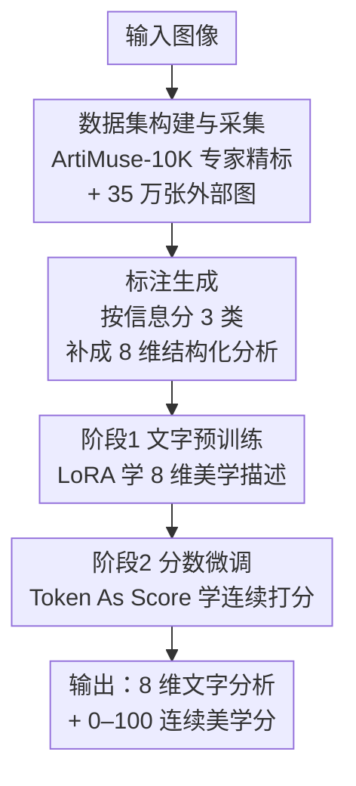

# ArtiMuse: Fine-Grained Image Aesthetics Assessment with Joint Scoring and Expert-Level Understanding

**会议**: CVPR 2026  
**论文**: [CVF Open Access](https://openaccess.thecvf.com/content/CVPR2026/html/Cao_ArtiMuse_Fine-Grained_Image_Aesthetics_Assessment_with_Joint_Scoring_and_Expert-Level_CVPR_2026_paper.html)  
**代码**: 论文称模型与数据集将公开，未在正文给出具体链接（⚠️ 以官方发布为准）  
**领域**: 多模态VLM / 图像美学评估  
**关键词**: 图像美学评估, 多模态大模型, Token As Score, 专家标注数据集, 联合评分

## 一句话总结
ArtiMuse 用一个 InternVL-3-8B 基座的多模态大模型，同时输出 8 维细粒度专家级美学文字分析和一个连续美学分数，靠新提出的 Token As Score 把连续打分塞进 LLM 的离散 token 生成里，并配套发布了首个 10000 张专家逐维标注的 ArtiMuse-10K 数据集，在多个美学评分基准上刷新 SOTA。

## 研究背景与动机
**领域现状**：图像美学评估（IAA）要回答的是"这张图美不美、为什么美"，比只看模糊/噪声/压缩的图像质量评估（IQA）高一个层次，涉及构图、色彩和谐、情感表达等主观维度。近两年主流做法从早期的回归网络（TANet、AesMamba）转向 MLLM——让多模态大模型既能看图又能用语言描述，泛化和感知能力明显更强。

**现有痛点**：作者点出三个具体短板。其一是**模态偏置**：现有 MLLM 方法要么只出分数（score-only）、要么只出文字（text-only），AesExpert 能写专家风格点评却给不出分数，Q-Align 能出分数却缺细粒度维度评价，没人能"既评又分"。其二是**缺细粒度属性拆解**：大多只给一个整体印象分，无法支撑进一步的美学诊断。其三是**数据集太弱**：现有 IAA 数据集要么规模小、要么粒度粗、要么标注者是非专家、内容偏摄影而缺设计/AIGC，难以喂出真正懂美学的模型。

**核心矛盾**：MLLM 天生是为**离散 token 生成**设计的，而美学分数是**连续值**——这两者本质冲突。Q-Align 之类把连续分数硬切成"差/一般/好"几个离散等级再加权还原，量化损失大、预测不准；直接让模型用文字吐数字（Text As Score）又会严重幻觉。

**本文目标**：做一个统一模型，在一次前向里同时给出（1）8 个可解释维度的专家级文字分析，（2）一个精确的连续美学分数；并补齐高质量专家标注数据这一块短板。

**核心 idea**：用 LLM 词表里**现成的离散 token** 去稠密映射 0–100 的连续分数（Token As Score），既不扩词表也不重训分词器，再用"先练文字、后练打分"的两阶段 LoRA 训练保住文字能力，配合专家逐维标注的 ArtiMuse-10K 把美学先验喂进模型。

## 方法详解

### 整体框架
ArtiMuse 是一条三段式的数据—训练流水线，目标是把"专家怎么评美学"蒸进一个 MLLM。输入是任意图像，输出是 8 维结构化文字分析 + 一个 0–100 的连续美学分。整体走三步：先**采数据并处理**（自建 ArtiMuse-10K 的 1 万张专家精标图 + 从 APDDv2/Impressions/AVA 等收来的 35 万张图），再做**标注生成**（按每张图已有信息分三类，把稀疏标注补成 8 维完整结构化分析），最后做**两阶段模型训练**（文字预训练 → 分数微调）。基座是 InternVL-3-8B，作者把它的动态分辨率改成固定分辨率，视觉编码器、MLP、LLM 三部分联合训练，其中 LLM 走 LoRA。

### 关键设计

**1. ArtiMuse-10K：首个专家逐维标注的细粒度美学数据集**

这一设计直击"数据集太弱"的痛点。作者联合从业 3 到 30 多年的美学专家，先系统定义出 8 个可解释的美学维度——构图与设计（Composition & Design）、视觉元素与结构、技术执行、原创性与创意、主题与传达、情感与观者反应、整体格式塔（Overall Gestalt）、综合评价——再据此采集 10000 张图，覆盖平面设计、3D 设计、AIGC 生成图、摄影、书画 5 大类共 15 个子类（中国画、雕塑、日常摄影等）。每张图都由专家写出 8 维文字分析 + 一个整体分数。相比之前要么只有分数没文字、要么只有泛泛点评没分数、要么标注者是非专家的数据集（见相关工作对比表），ArtiMuse-10K 是同时具备"专家、细粒度（8 属性）、多内容域、既有分又有文"的第一个，这是 ArtiMuse 能学到专家审美的根。作者还特意保留低质量样本，缓解当代 LLM "什么图都夸"的正向偏置。

**2. 三类自适应标注生成：把 35 万张稀疏标注图补成 8 维完整分析**

1 万张专家精标不够喂大模型，作者额外收了 35 万张带各种美学相关 caption 的图，但这些图的标注稀疏程度不一，于是设计了按信息量分流的标注生成机制。**Type 1（只有分数）**：用一个提示词把已知分数 + 图像喂给 MLLM，让它据此生成覆盖 8 维的整体性分析；**Type 2（有部分文字点评）**：把专家原始评语 + 图喂进去，让 MLLM 围绕 8 个维度逐项扩写成结构化分析；**Type 3（专家精选图）**：直接请专家按预定义维度做完整结构化分析并给整体分。这样设计的关键动机是——作者实证发现 MLLM 有系统性的"正向偏置"（不管图好坏都猛夸），所以高价值的 Type 3 由人类专家把关产出可靠 ground truth，Type 1/2 才交给 MLLM 自动补全。三类标注共同把数据规模撑大、又保住了真实性。

**3. Token As Score：用现成 token 稠密映射连续分数**

这是全文最核心的技术贡献，解决"MLLM 离散生成 vs 美学分数连续"的根本矛盾。作者从 LLM 原生词表里挑出 **101 个现成 token**，分别对应整数分 0 到 100，记作 `[Aes_Score_Token_i]`。挑选标准是 token 要短、且本身带有序语义——实现上用双字母组合（如分数 1 对应的实际 token 是 `ab`，分数 2 是 `ac`……），这样**不扩词表、不重训分词器**。训练时把归一化到 [0,100] 的分数映射成对应 token，让模型学着预测这个离散 token；推理时不取 argmax，而是对全部 101 个分数 token 的概率分布求**期望**得到连续分：

$$S_{Aes} = \sum_{i=0}^{100} i \cdot p_i = \sum_{i=0}^{100} i \cdot \frac{e^{l_i}}{\sum_{j=0}^{100} e^{l_j}}$$

其中 $l_i$、$p_i$ 是第 $i$ 个分数 token 的 logit 和 softmax 概率。为什么有效：对比 Text As Score（直接吐数字文本，幻觉严重）和 Level As Score（Q-Align 那种只有"差/一般/好"5 档，粒度太粗、档位词还能被进一步拆成 token 引入噪声），Token As Score 用 101 档既保住了足够粒度、又借期望平滑得到连续值，把量化损失降到最低。作者还消融了 token 数量：太少粒度不够，太多引入复杂度，最终 100 个 token 最优；而且把"新加进词表的 token"或"无序 token"用上都会掉点，印证了"复用现成有序 token"这一选择。

**4. 两阶段 LoRA 训练：先练文字、后练打分，互不打架**

IAA/IQA 里一个公认难题是 MLLM 难以同时保住文字理解和打分能力。作者把训练拆成两阶段：**阶段一文字预训练**用全部带美学分析 caption 的图，让模型学会写结构化的 8 维美学分析，同时尽量保留 MLLM 的预训练知识；**阶段二分数微调**才把每张图的整体分转成专用分数 token 当训练目标，专攻打分。两阶段都对 LLM 做 LoRA 微调（视觉编码器和 MLP 一起训），损失就是标准 GPT 交叉熵。关键动机是：分数微调阶段的数据比文字预训练单调得多，如果对 LLM 做全量微调，很容易把阶段一学到的美学先验冲掉；LoRA 的低秩约束让模型在学会打分的同时守住语言能力。消融里全量微调（exp d）和联合训练（exp e）都明显不如两阶段 LoRA（exp h），坐实了这一设计。

### 损失函数 / 训练策略
统一用 GPT 交叉熵损失（预测 logits 与目标 token 之间）。基座 InternVL-3-8B，固定分辨率。文字预训练 batch 128、学习率 4e-5、cosine 退火、1 epoch；分数微调 batch 128、学习率 2e-5、2 epoch。4 张 A100-80G 训练，文字预训练约 5 小时，分数微调在 ArtiMuse-10K 上仅 10 分钟、在 200 万级的 AVA 上约 4 小时收敛。

## 实验关键数据

### 主实验：美学评分（SRCC/PLCC，越高越好）
ArtiMuse 在多个评分基准上几乎全面领先，尤其在 PARA 和 ArtiMuse-10K 上 PLCC 比次优高出 0.05+。

| 数据集 | 指标 | ArtiMuse | Q-Align(次优) | 提升 |
|--------|------|----------|---------------|------|
| AVA | SRCC/PLCC | 0.827 / 0.826 | 0.822 / 0.817 | 略升（与 Next-Token 持平为最佳梯队） |
| PARA | SRCC/PLCC | 0.936 / 0.958 | 0.913 / 0.888 | PLCC +0.070 |
| TAD66K | SRCC/PLCC | 0.510 / 0.543 | 0.501 / 0.531 | +0.012 |
| FLICKR-AES | SRCC/PLCC | 0.814 / 0.837 | 0.798 / 0.818 | +0.019 |
| ArtiMuse-10K | SRCC/PLCC | 0.614 / 0.627 | 0.551 / 0.573 | PLCC +0.054 |

泛化测试中，两个模型都只在 AVA 上微调、再零样本迁移到其它数据集，ArtiMuse 全面超过 Q-Align（如 ArtiMuse-10K 上 0.395/0.376 vs 0.337/0.320），且零样本迁移甚至超过部分专门 IAA 模型。

### 结构化文字分析（选择率，由 Gemini-2.0-flash 与人类评判）
让评判方在专家描述为参照下选"哪个模型 8 维分析最好"，ArtiMuse 在 8 个维度上全面胜出。

| 维度 | AesExpert | QwenVL | InternVL | ArtiMuse |
|------|-----------|--------|----------|----------|
| 构图与设计 | 0.0% | 12.7% | 10.4% | **76.9%** |
| 技术执行 | 0.0% | 9.9% | 10.4% | **79.7%** |
| 原创性与创意 | 0.0% | 13.7% | 8.5% | **77.8%** |
| 8 维平均 | 0.1% | 14.3% | 14.5% | **71.1%** |
| 人类投票偏好 | 1.5% | 11.5% | 19.2% | **67.8%** |

### 消融实验（AVA 上 SRCC/PLCC）
| 配置 | SRCC/PLCC | 说明 |
|------|-----------|------|
| (h) 完整模型 | 0.827 / 0.826 | 两阶段 LoRA + Token As Score(100) |
| (b) 去掉"带分数 caption"子集 | 0.621 / 0.627 | 掉最多（含 AVA 数据），数据构成最关键 |
| (d) LLM 全量微调 | 0.816 / 0.814 | 冲掉文字预训练的美学先验 |
| (e) 联合训练（非两阶段） | 0.821 / 0.820 | 不如两阶段 |
| (f) Text As Score | 0.820 / 0.819 | 文字吐分数，幻觉拖累 |
| (g) Level As Score(Q-Align) | 0.820 / 0.818 | 仅 5 档粒度不足 |

### 关键发现
- **数据构成影响最大**：去掉"带分数 caption"子集（含 AVA）掉点最严重（PLCC 0.826→0.627），说明高质量分数标注数据是性能命脉。
- **两阶段 > 联合/全量微调**：保住文字预训练学到的美学先验，比端到端联合训练更稳。
- **Token As Score 的甜点是 100 档**：太少粒度不够、太多徒增复杂度；用扩词表 token 或无序 token 都会掉点，验证"复用现成有序 token"的合理性。
- **有趣的对照**：(f) Text As Score 和 (g) Level As Score 性能接近，反衬出文字预训练阶段本身对最终打分的重要贡献。

## 亮点与洞察
- **"既评又分"的统一范式**：第一个在一次前向里同时给出专家级 8 维文字诊断 + 精确连续分的 IAA 模型，补上了 score-only / text-only 的模态偏置缺口。
- **Token As Score 是可迁移的小 trick**：把"连续回归"问题转写成"对现成有序 token 求概率期望"，不动词表不动分词器，几乎零成本——这套思路可直接搬到任何要让 MLLM 输出连续标量（质量分、年龄、价格区间）的任务上。
- **正向偏置的工程对策很务实**：识别出 MLLM "见图就夸"的系统偏置后，用专家标注的 Type 3 做 ground truth、并刻意保留低质量样本，是数据侧而非模型侧解决偏置的好例子。
- **两阶段 LoRA 保能力**：用 LoRA 的低秩约束在"学新技能（打分）"时守住"老技能（写分析）"，对所有"多任务会互相冲掉"的微调场景有借鉴意义。

## 局限与展望
- **作者承认的局限**：当前模型只能"分析"，还不能给出专业的美学**改进建议**（怎么把图改得更美），留作未来工作。
- **自己发现的局限**：8 维属性体系和整体分仍由专家主观定义，跨文化/跨画种的审美差异是否被覆盖未充分讨论；评分泛化在 OOD 数据上仍明显掉点（如 ArtiMuse-10K 零样本仅 0.395），说明"美学分布漂移"这一老问题没被根治。
- **方法侧可改进**：Token As Score 把分数离散成 101 个整数档，理论上仍有 1 分的量化下限；结构化文字分析的评判用 Gemini 当裁判，可能引入裁判模型自身的偏好。

## 相关工作与启发
- **vs Q-Align**: 都能打分，但 Q-Align 用 Level As Score（5 个离散等级加权还原），粒度粗、等级词还会被拆 token 引噪；ArtiMuse 用 101 档现成 token + 期望，粒度更细、且额外给出 8 维文字分析。多数基准上 ArtiMuse 评分与泛化都更优。
- **vs AesExpert**: AesExpert 能写专家风格点评但**给不出分数**；ArtiMuse 把文字与打分统一，且文字分析的选择率（71.1% avg）远高于 AesExpert（0.1%）。
- **vs 回归模型（TANet / AesMamba）**: 纯回归出分但缺可解释性和泛化；ArtiMuse 借 MLLM 的语言理解既给分又给可解释维度分析，零样本迁移甚至超过这些专用模型。
- **vs APDDv2 数据集**: APDDv2 也是专家标注（1 万级）但只有 1 个整体点评属性、3 个内容类；ArtiMuse-10K 扩到 8 属性、5 大类 15 子类，覆盖 AIGC 与设计，粒度和内容域都更广。

## 评分
- 新颖性: ⭐⭐⭐⭐ Token As Score 的"复用现成有序 token + 求期望"很巧，专家逐维数据集也是实打实的贡献，但单点技术不算颠覆。
- 实验充分度: ⭐⭐⭐⭐⭐ 5 个评分基准 + 8 维文字分析 + 人类研究 + 完整消融（数据/训练/打分策略/token 数），覆盖很全。
- 写作质量: ⭐⭐⭐⭐ 动机—矛盾—方案的逻辑链清晰，图 5/6 把流水线和打分对比讲得直观。
- 价值: ⭐⭐⭐⭐⭐ 数据集 + 模型 + 打分范式都将公开，对 AIGC 评测、创作辅助、摄影教育是即用型基建。

<!-- RELATED:START -->

## 相关论文

- [\[CVPR 2026\] Beyond Global Similarity: Multi-Conditional Retrieval for Fine-Grained Cross-Modal Understanding](beyond_global_similarity_multi-conditional_retrieval_for_fine-grained_cross-moda.md)
- [\[ACL 2025\] FRACTAL: Fine-Grained Scoring from Aggregate Text Labels](../../ACL2025/others/fractal_fine-grained_scoring_from_aggregate_text_labels.md)
- [\[CVPR 2026\] Rethinking BCE Loss for Multi-Label Image Recognition with Fine-Tuning](rethinking_bce_loss_for_multi-label_image_recognition_with_fine-tuning.md)
- [\[CVPR 2026\] Rethinking Knowledge Transfer in Image Quality Assessment: A Perceptual Preference Structure Alignment Perspective](rethinking_knowledge_transfer_in_image_quality_assessment_a_perceptual_preferenc.md)
- [\[CVPR 2026\] From Pixel to Precision: Enhancing Handwritten Mathematical Expression Recognition with Image-Level Reward](from_pixel_to_precision_enhancing_handwritten_mathematical_expression_recognitio.md)

<!-- RELATED:END -->
