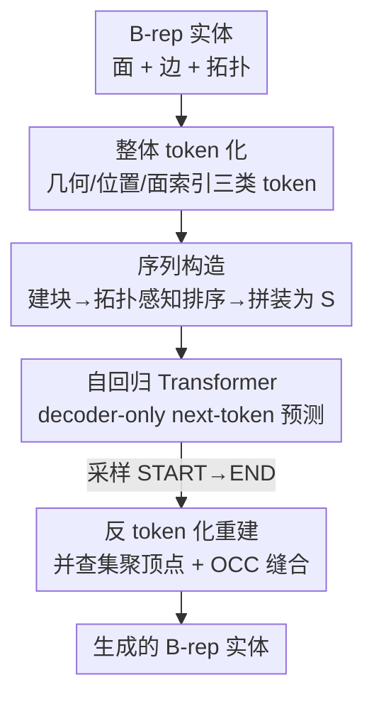

# AutoRegressive Generation with B-rep Holistic Token Sequence Representation

**会议**: CVPR 2026  
**论文**: [CVF Open Access](https://openaccess.thecvf.com/content/CVPR2026/html/Li_AutoRegressive_Generation_with_B-rep_Holistic_Token_Sequence_Representation_CVPR_2026_paper.html)  
**代码**: https://github.com/123qiang06/BrepARG  
**领域**: 3D视觉 / CAD生成  
**关键词**: B-rep生成, CAD, 自回归生成, token序列化, VQ-VAE  

## 一句话总结
BrepARG 首次把 CAD 的边界表示（B-rep）的几何与拓扑编码成**一条统一的 token 序列**，从而能用 decoder-only Transformer 做 next-token 自回归生成，在 DeepCAD/ABC 上拿到 SOTA，且训练只需 1.2 天、单张 4090 推理一个模型约 1.5 秒。

## 研究背景与动机

**领域现状**：B-rep 是工业 CAD 表示实体模型的基础范式，它用参数化的面、边、顶点 + 它们之间的拓扑邻接关系来描述一个实体。近年的 B-rep 生成方法（BrepGen、DTGBrepGen、HolisticBrep 等）大多用**图结构**来建模，并把几何学习和拓扑学习拆成两条解耦的流水线。

**现有痛点**：这种「图 + 分阶段」的范式有两个硬伤。其一，几何和拓扑被分到不同网络/不同阶段里学（如 DTGBrepGen 用两套网络分别建模拓扑结构和几何基元），表示是**碎片化**的，模型还要额外组件去拼接，复杂度高；其二，图结构天然不是序列，**用不上** Transformer 这类需要序列输入、且在 LLM 上被证明强大可扩展的自回归架构。还有一类方法（BrepDiff、Hola）干脆只生成面几何，拓扑要靠后处理重建。

**核心矛盾**：B-rep 本身是「连续、异构的参数化几何」和「离散的拓扑连接」紧耦合在一起的——面是 32×32 的曲面采样、边是 32 点的曲线采样，几何是连续值；而拓扑是「哪条边连哪两个面」这种纯离散的关系。要把这两种性质完全不同的东西塞进**同一个 token 序列**里，让一个自回归模型一口气把它们一起生成出来，是个没人解决过的难题。

**本文目标 + 切入角度**：作者的观察是——拓扑的本质只是「连接关系」，只要能把连接关系也表达成 token，几何和拓扑就能放进同一个序列。于是 BrepARG 把整个 B-rep 编码成一条 holistic token sequence，把 B-rep 生成**重新定义成纯序列建模任务**。

**核心 idea**：用「几何 token + 位置 token + 面索引 token」三类离散符号统一表示几何与拓扑，再用拓扑感知的排序把它们拼成一条因果序列，让 decoder-only Transformer 通过 next-token prediction 同时生成形状和连接。

## 方法详解

### 整体框架
BrepARG 的输入是一个 B-rep 实体（一堆参数化的面和边 + 拓扑），输出是生成的新 B-rep。整条管线分四步：先把 B-rep **整体 token 化**成三类离散 token；再按「先建块、后排序、最后拼装」的层级方式构造出一条统一序列 $S$；然后训练一个 decoder-only Transformer 在这条序列上做 next-token prediction；推理时从 START token 自回归采样到 END，最后**反 token 化**把序列解码回完整 B-rep 实体。关键在于：几何（连续）和拓扑（离散）被统一进同一条 token 流，自回归模型在单一数据流里**同时**生成几何形状和拓扑连接。

### 关键设计

**1. 整体 token 化：把异构几何与离散拓扑都压成三类 token**

这一步直接针对「几何连续、拓扑离散、塞不进同一序列」的核心矛盾，用三类 token 把它们统一成离散符号。**几何 token**：每个面在 UV 参数域均匀采 32×32 点得到 $F\in\mathbb{R}^{32\times32\times3}$，每条边沿 U 轴采 32 点得到 $E\in\mathbb{R}^{32\times3}$（边再广播成 $32\times32\times3$ 以喂给同一个 2D 卷积网络）；面和边共用一个 VQ-VAE，把采样特征下采样 16 倍得到 $2\times2$ 的潜在图（4 个潜在向量），各自最近邻查码本，4 个码本索引就是该面/边的几何 token，面和边共享码本以减小词表、复用 token。**位置 token**：每个基元的包围盒是 6 个连续标量 $b=[x_{min},y_{min},z_{min},x_{max},y_{max},z_{max}]\in[-1,1]^6$。作者发现用单个码字表示整个包围盒会让 VQ-VAE 退化成大样本空间上的聚类、精度不够，拆成子向量量化也学不准，于是改用**逐坐标均匀标量量化**——直接用公式把每个坐标映射到离散索引，每个坐标先归一化裁剪到 $[0,1]$ 得 $\tilde b_j$，再

$$k_j = \text{round}\big((L-1)\tilde b_j\big)\in\{0,\dots,L-1\}$$

得到 6 个位置 token（$L=2048$ 级），反量化用线性映射 $b_j = \frac{2k_j}{L-1}-1$。这种确定性的量化比让网络去学「连续坐标→离散 token」的映射稳定得多、精度更高。**面索引 token（拓扑）**：拓扑的本质是连接关系，作者把所有闭合面沿缝切开、保证每条边正好是两个面的边界，然后给每个面贴一个唯一面索引作标识，再给每条边贴上它所连两个面的索引——这样「边连哪两个面」的邻接就被**显式**写进 token 里，顶点则隐式地由边端点表达。

**2. 序列构造：拓扑感知排序 + 统一无重叠词表，把三类 token 拼成一条因果序列**

有了三类 token，还得拼成一条对自回归友好的序列，这一步解决「任意排序会破坏 B-rep 结构完整性、且长程依赖难学」的问题。**几何块构造**：每个面块含 6 个位置 token、4 个几何 token、1 个面索引 token，$f_i = [(t^p_1,\dots,t^p_6),(t^g_1,\dots,t^g_4),t^{idx}]$；每个边块开头放 2 个面索引 token（这条边所连两个面），显式编码「两面一边」的连接，再接 6 位置 + 4 几何，$e_j = [t^{idx}_1,t^{idx}_2,(t^p_1,\dots,t^p_6),(t^g_1,\dots,t^g_4)]$。**拓扑感知排序**：面块按「先选度数最高的面、再 DFS 优先访问低度邻居」排，让拓扑相邻的面在序列里也挨得近，得到面序列 $S_f$；边块按其相邻面的最大索引升序（MAX-IDX-A）排，让边紧挨着它关联的面，从而收紧面-边之间的注意力跨度、缓解长程依赖，得到边序列 $S_e$。排完后仿 GraphGPT 对所有面索引做 **re-index**——加一个随机整数 $r\in[0,n_{max})$ 再对 $n_{max}$ 取模（$n_{max}$ 为数据集中最大面数），把拓扑编码随机化以提升泛化。**最终拼装**：所有面块在前、边块在后，加分隔符与首尾标记 $S = [\text{START},\,S_f,\,\text{SEP},\,S_e,\,\text{END}]$。为避免四类符号（面索引/几何/位置/特殊）token 索引冲突，用分段无重叠的偏移把它们映射到一段连续整数空间：$o_{geo}=n_{max}$，$o_{pos}=n_{max}+N_{geo}$，$o_{spec}=n_{max}+N_{geo}+L$，从而合并成单一词表。

**3. 自回归生成：decoder-only Transformer + 因果掩码做 next-token 预测**

既然 B-rep 已经是一条统一 token 序列，就能直接套自回归框架联合学习几何-拓扑的分布。模型用 stacked 多头自注意力 + 前馈的 decoder-only Transformer（8 层、8 头、嵌入维 256、FFN 1024），带因果掩码，每个 token 嵌入加离散位置编码后，在 teacher forcing 下做 next-token prediction，训练目标是最大化数据集中所有序列的联合概率：

$$\prod_{S\in D}\prod_{i=1}^{T(S)} p_\theta\big(t_i \mid e(t_{<i});\theta\big)$$

推理时从 START（无条件）或类别 token（类条件）起，用 nucleus（top-$p$）采样逐 token 生成直到 END。这样几何形状和拓扑连接在**同一条数据流**里被一起生成，彻底去掉了以往的多阶段流水线。其中 VQ-VAE 训练借鉴 CVQ-VAE 的码本重启策略（特征池在线重初始化 + 概率最近邻采样）来救活低使用率码字、防止码本坍塌。

**4. 反 token 化重建：并查集聚顶点 + OpenCascade 缝合成合法实体**

生成的只是 token 序列，要变回真正的 B-rep 实体还得反 token 化。由于 token 块长度固定、有 SEP 分隔，可直接切出每个面/边对应的块：几何 token 过 VQ-VAE 解码器、位置 token 套反量化公式 $b_j=\frac{2k_j}{L-1}-1$，恢复几何；面-边邻接由共享的面索引 token 建立（每条边连两个面，进而推出面-面邻接）。难点是顶点——序列里没有显式顶点，作者把每条边的端点当候选顶点，用**基于并查集的贪心聚类**在每个面边界内按几何邻近 + 局部环拓扑迭代合并不同边最近的候选点，并跨面统一共享顶点组以保证全局一致，最后每个顶点取其候选点的质心，得到唯一顶点表、边-顶点连接和环结构，再用 OpenCascade 的 sew 函数缝合成有效实体。这一步是把「序列 token」落地成「可用 CAD 模型」的最后一公里。

### 损失函数 / 训练策略
VQ-VAE 阶段用重建损失 $L_{rec}=\|x-\hat x\|_2^2$ + CVQ-VAE 码本重启，AdamW（lr $1\times10^{-4}$），DeepCAD 上 4×H20 训约 12 小时。自回归阶段用上式的 next-token 极大似然，AdamW（lr $1\times10^{-3}$，batch 128），DeepCAD 训 500 epoch 约 17 小时；总计约 1.2 天。

## 实验关键数据

### 主实验
DeepCAD（80,509）与 ABC（105,798）上的无条件生成，分布指标用 3000 生成 + 1000 参考样本（每个采 2000 点），CAD 指标直接在 3000 个生成实体上算，取 10 次独立运行均值。

| 数据集 | 指标(↑/↓) | DeepCAD基线最优 | BrepARG(本文) | 说明 |
|--------|-----------|------------------|----------------|------|
| DeepCAD | COV ↑ | 74.52 (DTGBrepGen) | **75.45** | 覆盖率最高 |
| DeepCAD | MMD ↓ (×10²) | 0.93 (BrepDiff) | **0.89** | 最小匹配距离最低 |
| DeepCAD | JSD ↓ (×10²) | 1.02 (DTGBrepGen) | **1.02** | 持平最优 |
| DeepCAD | Valid ↑ | 79.80 (DTGBrepGen) | **87.60** | 有效率大涨 ~8 点 |
| ABC | COV ↑ | 66.07 (DTGBrepGen) | **70.10** | — |
| ABC | Valid ↑ | 57.59 (DTGBrepGen) | **67.54** | 有效率 +10 点 |

效率上同样领先（Table 2）：

| 方法 | 训练时间 | 推理时间(单个) |
|------|----------|----------------|
| BrepGen | 7.5 天 | 8.4 s |
| DTGBrepGen | 3.0 天 | 3.6 s |
| BrepDiff | 1.8 天 | 8.3 s |
| **Ours** | **1.2 天** | **1.5 s** |

### 消融实验
核心消融是验证「拓扑感知排序」是否真的有用（Table 4 面排序 / Table 5 边排序，$p=0.9$）：

| 配置 | COV ↑ | MMD ↓(×10²) | Valid ↑ | 说明 |
|------|-------|-------------|---------|------|
| 面序: RAND | 71.10 | 0.947 | 67.92 | 随机排序，有效率最差 |
| 面序: ZYX | 74.82 | 0.917 | 83.12 | 按质心坐标排 |
| 面序: DEG-A | 74.09 | 0.906 | 82.98 | 度数升序 |
| 面序: BFS | 74.65 | 0.918 | 85.94 | 广搜遍历 |
| 面序: **DFS(本文)** | **75.45** | **0.887** | **87.60** | 高度数起点 + 优先低度邻居 |
| 边序: RAND | 74.25 | 0.913 | 85.43 | 随机边排序 |
| 边序: **MAX-IDX-A(本文)** | **75.45** | **0.887** | **87.60** | 按相邻面最大索引升序 |

另有 top-$p$ 敏感性（Table 3）：$p$ 越小有效率越高（$p=0.6$ 时 Valid 90.25%）但 COV/多样性下降（COV 降到 63.50），$p=0.9$ 是质量-多样性的较好折中。

### 关键发现
- **拓扑感知排序是有效率（Validity）的最大功臣**：面排序从随机的 67.92% 提到 DFS 的 87.60%，说明把拓扑相邻的面放近、边紧挨关联面，确实让自回归模型更容易学到连贯、可缝合的结构。
- **位置 token 必须用确定性标量量化而非 VQ**：作者明确指出让 VQ-VAE 量化整个包围盒会退化成聚类、精度不足，改用公式化的逐坐标量化才稳。
- **效率优势显著**：相比 BrepGen 训练快 6 倍、推理快 5.6 倍，序列化 + 自回归比扩散/多阶段流水线更省。
- $p$ 可作为「质量 vs 多样性」的旋钮，部署时可按需调。

## 亮点与洞察
- **把拓扑「token 化」的思路很巧**：拓扑邻接被压成「面索引 token」这种共享标签，几何和拓扑因此能进同一条序列——这是让 B-rep 用上自回归架构的关键一步，很有迁移价值（任何「实体+连接关系」的结构化数据都能照此序列化）。
- **统一无重叠词表的偏移设计**很工程化但很关键：用 $o_{geo}, o_{pos}, o_{spec}$ 把四类异构符号映射到不冲突的连续整数区间，是让单一 Transformer 端到端处理多源离散符号的干净做法。
- **「序列→实体」的并查集聚顶点 + OCC 缝合**补上了「token 序列没有显式顶点」的缺口，是把生成式输出真正落地成合法 CAD 实体的实用 trick。

## 局限与展望
- 作者承认两类失败来源：① VQ-VAE 量化几何特征带来的**精度损失**；② 长自回归序列建模的复杂度上升，二者都会损害生成稳定性，未来想用更高保真的量化和更高效的自回归策略。
- ⚠️ 过滤掉了 >50 面或单面 >30 边的复杂模型（沿用 DTGBrepGen 设定），ABC 还额外剔除 <10 面的简单件，**复杂工业级 B-rep 的表现未验证**。
- 顶点靠几何邻近 + 并查集贪心重建，端点很近或局部环歧义时可能误并/漏并，重建鲁棒性依赖几何精度。
- top-$p$ 越高有效率越掉（$p=0.95$ 时 Valid 仅 82.85），质量-多样性难两全。

## 相关工作与启发
- **vs BrepGen / DTGBrepGen（图 + 多阶段）**：它们把几何和拓扑解耦到不同网络/阶段、靠图结构建模，本文把两者统一进一条 token 序列用单个自回归 Transformer 联合生成，去掉了多阶段流水线，训练/推理都更快、Valid 更高。
- **vs BrepDiff / Hola（只建面几何）**：它们只生成面、拓扑要额外步骤重建，本文从一开始就把拓扑显式编码进序列，端到端一起生成。
- **vs AutoBrep / BrepGPT（同期序列化工作）**：都用专门 token 编码拓扑，但本文在序列构造策略（DFS + MAX-IDX-A 拓扑感知排序）和离散几何表示（共享 VQ-VAE + 标量量化包围盒）上不同，并额外用随机旋转 + re-index 提升泛化。

## 评分
- 新颖性: ⭐⭐⭐⭐⭐ 首个把 B-rep 几何+拓扑统一成单条 token 序列、用自回归生成的框架。
- 实验充分度: ⭐⭐⭐⭐ 三数据集 + 完整排序消融 + 效率/采样分析，但仅限过滤后的中小复杂度模型。
- 写作质量: ⭐⭐⭐⭐ token 化与序列构造讲得清晰、图文配合好。
- 价值: ⭐⭐⭐⭐⭐ 为 B-rep/CAD 生成打开了「序列建模 + LLM 式自回归」的新方向，效率与质量双优。

<!-- RELATED:START -->

## 相关论文

- [\[CVPR 2026\] BrepVGAE: Variational Graph Autoencoder with Unified Latent Representation for B-rep](brepvgae_variational_graph_autoencoder_with_unified_latent_representation_for_b-.md)
- [\[CVPR 2026\] Progressive Neural Architecture Generation](progressive_neural_architecture_generation.md)
- [\[CVPR 2026\] Dynamics: Language-Based Representation for Inferring Rigid-Body Dynamics From Videos](dynamics_language-based_representation_for_inferring_rigid-body_dynamics_from_vi.md)
- [\[CVPR 2026\] Adapting In-context Generation for Enhanced Composed Image Retrieval](adapting_in-context_generation_for_enhanced_composed_image_retrieval.md)
- [\[CVPR 2026\] Bidirectional Query-Driven Generation of Parametric CAD Sketch](bidirectional_query-driven_generation_of_parametric_cad_sketch.md)

<!-- RELATED:END -->
