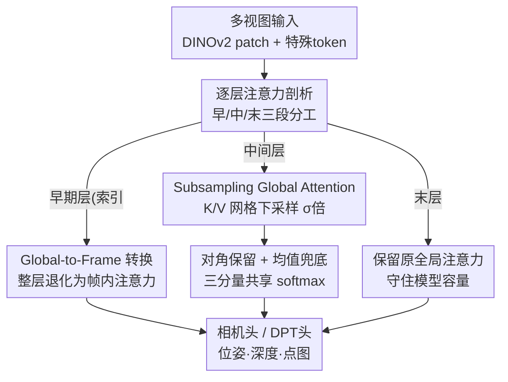

# AVGGT: Rethinking Global Attention for Accelerating VGGT

**会议**: CVPR 2026  
**论文**: [CVF Open Access](https://openaccess.thecvf.com/content/CVPR2026/html/Sun_AVGGT_Rethinking_Global_Attention_for_Accelerating_VGGT_CVPR_2026_paper.html)  
**代码**: 无（论文未公开仓库）  
**领域**: 3D视觉 / 模型压缩  
**关键词**: VGGT加速, 全局注意力, K/V下采样, 多视图3D重建, 免训练  

## 一句话总结
通过逐层剖析 VGGT/π³ 中全局注意力的真实作用（早期层无效、中间层做跨视图对齐、末层只微调），提出一个免训练的两步加速方案——把早期全局层换成帧内注意力、对剩余全局层只对 K/V 做网格下采样——在几乎不掉精度的前提下，把 800 帧输入的推理提速 8–10×。

## 研究背景与动机
**领域现状**：以 VGGT、π³ 为代表的前馈式多视图 3D 重建模型，用一个统一 Transformer 同时输出相机位姿、深度、点图和点跟踪。它们的核心是**交替的全局自注意力 + 帧内自注意力**：全局注意力让所有视图的所有 patch token 互相可见，从而建立跨视图一致性。VGGT 的消融证明全局自注意力优于跨注意力，这个设计被 π³、MapAnything 等后续工作继承。

**现有痛点**：全局自注意力对 $N$ 帧、每帧 $L$ 个 token 的复杂度是 $O((NL)^2)$，帧数一多就爆炸——800 帧时 VGGT 单次推理要约 400 秒、35 PFLOPs。已有的加速方法（FastVGGT 用 token merging、FasterVGGT 用 SpargeAttention 块稀疏）都是从别的领域**搬来一套稀疏注意力**直接套，缺乏对 VGGT 前向过程的系统分析，没真正利用全局注意力"对齐为主"的本质，因此在极密集视图下经常失效甚至 OOM。

**核心矛盾**：大家默认"全局注意力的每一层、每一对 token 都重要"，于是只能在通用稀疏化上做文章。但全局注意力到底在做什么？是不是所有层、所有 token 都不可省？这个问题没人系统回答过——这正是盲目加速的根源。

**本文目标**：拆成两个问题。**(Q1)** 交替注意力为什么有效，全局层各自扮演什么角色？**(Q2)** 既然全局注意力这么贵，能不能在不掉精度的前提下削掉它的开销？

**切入角度**：作者对 VGGT/π³ 的全局层做**逐层注意力可视化**（取注意力最高的 Top-50 query→key 对），发现一个清晰的分工：**早期层**的注意力很均匀、强匹配往往只是连相同 y 坐标的 token（被位置编码主导，把图像旋转 180° 后这些"枢纽 key"就漂移了，说明不编码视图不变的 3D 结构）；**中间层**注意力突然变稀疏、峰值陡增，最高激活几乎只落在两类——自身 patch，以及不同视图里同一空间位置的 patch，这才是真正在建跨视图对应；**末层**又退回早期那种均匀、弱峰值的形态，说明点云已基本对齐、只做微调。

**核心 idea**：把全局注意力理解成**点云对齐**——对齐两片点云只需要少量锚点，稠密逐 token 匹配是冗余的。据此提出免训练两步加速：早期全局层直接转成帧内注意力，中间全局层只保留全部 Query、对 K/V 做激进的网格下采样。

## 方法详解

### 整体框架
VGGT 的 aggregator 有 48 个 Transformer block，全局与帧内注意力交替出现（全局层按深度从 0 编号到 23）。本文不改任何权重、不训练，只在推理时改全局层的算法：先按"层角色分工"把 24 个全局层切成**早 / 中 / 末**三段，早段（索引 $<t_{\text{early}}$）整层换成帧内注意力（Global-to-Frame，G2F），中段保留为全局注意力但对 K/V 网格下采样（Subsampling Global Attention，SGA），末段原样保留以守住模型容量。VGGT 取 $t_{\text{early}}=9$（转掉索引 0–8），π³ 取 $t_{\text{early}}=10$。

### 关键设计

**1. Global-to-Frame 转换：把无效的早期全局层退化为帧内注意力**

早期全局层不参与跨视图对应（特征此时还没有足够 3D 信息），却照样吃 $O((NL)^2)$ 的全局复杂度，纯属浪费。本文的做法极其轻量：VGGT 在进全局 block 前会把张量从帧内布局 $(BN, L, C)$ 重排成 $(B, NL, C)$ 让所有帧联合做注意力；要把一个全局 block 转成帧内，只需**跳过这次重排**，保持 $(BN, L, C)$ 的逐帧布局，每帧独立做注意力，其余参数、特殊 token 全不动。这一步把受影响 block 的复杂度从 $O((NL)^2)$ 降到 $O(NL^2)$——少了帧数平方那一项。

之所以敢整层删掉跨视图交互，是因为消融 VGGT(G2F) 证明：即便早期层不做任何视图间信息交换，AUC@5 从 63.18 只掉到 62.83，几乎无损。这直接验证了"早期层对建立多视图一致性不是必需"的判断。

**2. Subsampling Global Attention（SGA）：把全局注意力当点云对齐，只对 K/V 网格下采样**

中间全局层确实在做对齐，但"对齐两片点云只需少量锚点"——所以没必要让稠密的全部 token 都当 Key/Value。本文把每个 patch token 看成 2D 网格上的伪点，做**网格下采样**：引入总下采样因子 $\sigma = s_h s_w$，在每个 $s_h \times s_w$ 窗口里只保留第一个 patch token 作为 K/V，而**全部 Query 和全部特殊 token 一律保留**。论文给定的映射是 $\sigma{=}2\Rightarrow(1,2)$、$\sigma{=}4\Rightarrow(2,2)$、$\sigma{=}6\Rightarrow(2,3)$、$\sigma{=}9\Rightarrow(3,3)$。标准注意力为

$$\text{Attn}(Q, K, V) = \text{softmax}\!\left(\frac{QK^\top}{\sqrt{d}}\right)V,$$

SGA 把 $K, V$ 从全集换成下采样子集 $S$（VGGT 中第一帧作为参考视图不压缩，π³ 全帧均匀压缩），于是全局注意力计算约**加速 $\sigma$ 倍**。

为什么只压 K/V 不压 Query？因为 Query 决定哪些 token 能收到跨视图更新，砍 Query 会让得到更新的 token 集合塌缩、破坏 token 多样性，直接拖垮稠密 3D 预测。作者还对比过随机网格采样、SIFT 关键点采样，固定网格采样在精度和速度上都最好。

**3. 对角保留 + 均值兜底：补回被丢弃 token 的自相关与全局响应**

只做基础下采样会丢两类信息：每个 token 自身的自注意力项（维持局部特征一致性），以及被丢掉那些列的整体贡献。受第 3 节"高激活项要么是对角、要么是跨视图匹配"的观察启发，增强版把注意力拆成**三个互不相交的分量**：(i) 保留子集 $S$；(ii) 对角自项（每个 token 看到自己）；(iii) 用**单个均值 Key/Value 对**近似所有被丢弃 patch 的聚合响应。三者**共享同一次 softmax 归一化**，让权重联合归一、不冗余。这个均值分量只带来 $O(N)$ 额外开销，不影响整体加速比；消融显示它在稀疏输入（10 帧）下与基础版几乎一致、在稠密输入（300 帧）下还能略涨。

> ⚠️ 三分量共享 softmax 的精确归一化形式论文正文未给完整公式（细节在补充材料），此处按文字描述复述，以原文为准。

### 损失函数 / 训练策略
**完全免训练**：所有改动都发生在推理期，不改任何权重、不微调、不引入新参数。$t_{\text{early}}$ 和 $\sigma$ 都是推理时可调的超参，分别控制早期转换的层数边界与全局下采样的强度。

## 实验关键数据

在 VGGT 与 π³ 上分别实例化为 AVGGT、Aπ³，括号内数字为下采样因子（如 AVGGT(2) 即 2× 下采样）。所有实验在 A100（80GiB）+ FlashAttention-2 上跑。对比方法 FastVGGT、FasterVGGT（两档配置 25/75）。

### 主实验：加速比与精度
极密集设定下（7-Scenes 扩到 800 帧）最能体现优势——此时 FasterVGGT 直接 OOM：

| 方法 (800帧) | AUC@5 ↑ | AUC@30 ↑ | Time(s) ↓ | 相对原模型 |
|--------------|---------|----------|-----------|-----------|
| π³ (baseline) | 27.43 | 80.57 | 298.5 | 1× |
| Aπ³(9) | 26.58 | 79.41 | 30.3 | **≈10× 提速** |
| VGGT (baseline) | 23.55 | 74.16 | 397.1 | 1× |
| AVGGT(9) | 24.90 | 77.38 | 50.0 | **≈8× 提速，精度反超** |
| FasterVGGT 25/75 | OOM | OOM | OOM | 失效 |

不同上下文长度的提速：100 帧 ≈2×、300 帧 ≈4–5×、800 帧 ≈8–10×。稀疏设定（RealEstate10K 10 帧、TUM-dynamics 90 帧、DTU 点图）下精度与原模型基本持平：

| 设定 | 方法 | 关键指标 | Time(s) ↓ |
|------|------|---------|-----------|
| RealEstate10K(10帧) | VGGT | AUC@5 63.18 | 0.307 |
| | AVGGT(2) | AUC@5 61.96 | 0.298 |
| | FasterVGGT 75 | AUC@5 38.79（崩） | 0.307 |
| TUM-dynamics(90帧) | VGGT | ATE 0.012 | 7.924 |
| | AVGGT(4) | ATE 0.012 | 3.761 |

可见 FastVGGT/FasterVGGT 因为引入额外计算，在短序列（10 帧）上甚至比原模型更慢，而本文方法即便在短序列也有小幅稳定加速。

### 消融实验（VGGT，RealEstate10K 位姿）
| 配置 | AUC@5 ↑ | AUC@15 ↑ | AUC@30 ↑ | 说明 |
|------|---------|----------|----------|------|
| VGGT | 63.18 | 81.10 | 88.13 | 原模型 |
| VGGT(G2F) | 62.83 | 80.88 | 87.98 | 早期层转帧内→几乎无损 |
| VGGT(G2M) | 61.79 | 80.06 | 87.43 | 早期 K/V 全换成单个均值 token→可比 |
| AVGGT(2)⁻ | 59.64 | 79.31 | 87.16 | 末层(20–23)也转帧内→明显掉点 |
| AVGGT(2) | 61.96 | 80.44 | 87.76 | 完整方法 |
| AVGGT(9) | 53.26 | 75.47 | 84.72 | 稀疏设定下 9× 过激→掉点 |

### 关键发现
- **早期全局层确实无用**：G2F（不做任何跨视图交换）和 G2M（K/V 压成一个均值 token）都与原模型几乎持平，双重证明早期层不做有意义的选择性注意。
- **末层不可全删**：把末层(20–23)也转帧内的 AVGGT(2)⁻ 比 AVGGT(2) 明显掉点，说明末层虽以微调为主，仍有非可忽略的贡献——这也是只删早期、保留末层的依据。
- **稀疏 vs 稠密的反差恰好印证"全局注意力=对齐"**：稀疏设定下增大 $\sigma$ 必然掉点（对齐锚点变少），而稠密设定下因视图重叠冗余多，$\sigma{=}9$ 反而能超过原模型——下采样的精度对密度的依赖，正好说明全局层的功能是建立跨视图对齐。

## 亮点与洞察
- **"分析驱动加速"而非"搬稀疏算子"**：先用逐层 Top-k 注意力可视化 + 180° 旋转探针搞清每段全局层在干什么，再针对性地删/压，方法和发现严丝合缝；这比直接套 token merging / 块稀疏更可解释，也是它在极密集下不崩的根本原因。
- **点云对齐视角是把"激进下采样"合理化的关键**：把 patch token 当伪点、把全局注意力当点云对齐，一下子就解释了"为什么只留少量 K/V 锚点也够"——这个类比可迁移到任何用全局注意力做几何对应的模型。
- **只压 K/V 不压 Query 的非对称设计**很巧：保住所有 Query 就保住了"谁能收到跨视图更新"，避免稠密预测塌缩，这是加速 3D 稠密任务时容易踩的坑。
- **三分量共享 softmax 的均值兜底**用 $O(N)$ 代价补回被丢列的全局响应，在稠密时还能反涨，是个低成本高回报的 trick。

## 局限与展望
- 论文未公开代码仓库，复现门槛较高；不少关键结论（π³ 的逐层分析、随机/SIFT 采样对比、三分量精确公式）都放在补充材料。
- $t_{\text{early}}$、$\sigma$ 需按数据集/密度手调（VGGT 用 9、π³ 用 10），缺少自适应选择机制；稀疏设定下 $\sigma$ 太大（如 9×）会明显掉点，强度选择仍依赖经验。
- 网格下采样"每窗口取第一个 token"对纹理/结构分布不均的场景可能丢关键锚点，作者虽证明优于随机/SIFT，但固定网格本身对极端视角变化的鲁棒性未充分讨论。⚠️ 此为笔者推测，原文未单独实验。
- 方法绑定 VGGT 式"全局+帧内交替"架构，对纯全局或其他注意力布局的 3D 模型是否同样适用未验证。

## 相关工作与启发
- **vs FastVGGT**：它观察到 token 高度相似、用 token merging 缩短序列；本文不合并 token 而是按几何对齐视角下采样 K/V，且 FastVGGT 因额外开销在短序列反而变慢、点图任务掉点，本文在长短序列都稳定加速。
- **vs FasterVGGT**：它也分析了 VGGT（发现注意力稀疏、中间层更重要）但加速时改用 SpargeAttention 块稀疏，与其经验发现"只是弱相关"；本文方法**完全由分析推导**（删早期、压中间、留末层），且在 800 帧极密集下不 OOM，FasterVGGT 直接失效。
- **vs VGGT-Long**：它把长序列切块顺序处理再额外对齐，引入分块开销；本文不切块、一次性处理全序列，靠算法级稀疏化降本。

## 评分
- 新颖性: ⭐⭐⭐⭐ 分析驱动的免训练加速，点云对齐视角解释力强，但单点技术（K/V 下采样）本身不算全新
- 实验充分度: ⭐⭐⭐⭐ 覆盖稀疏/稠密/极密集、位姿+点图、双 backbone，消融完整；部分结论压在补充材料
- 写作质量: ⭐⭐⭐⭐ 分析→方法→实验逻辑闭环清晰，可视化有说服力
- 价值: ⭐⭐⭐⭐ 让 VGGT 类模型在数百帧场景实用化（8–10× 且不崩），对 3D 基础模型落地有直接意义

<!-- RELATED:START -->

## 相关论文

- [\[CVPR 2026\] Accelerating Diffusion via Hybrid Data-Pipeline Parallelism Based on Conditional Guidance Scheduling](accelerating_diffusion_via_hybrid_data-pipeline_parallelism_based_on_conditional.md)
- [\[CVPR 2026\] Global Underwater Geolocation from Time-Lapse Polarization Imagery](global_underwater_geolocation_from_time-lapse_polarization_imagery.md)
- [\[CVPR 2026\] OntoAug: Rethinking Generative Data Augmentation via Ontology Guidance](ontoaug_rethinking_generative_data_augmentation_via_ontology_guidance.md)
- [\[CVPR 2026\] Beyond Global Similarity: Multi-Conditional Retrieval for Fine-Grained Cross-Modal Understanding](beyond_global_similarity_multi-conditional_retrieval_for_fine-grained_cross-moda.md)
- [\[CVPR 2026\] MUFASA: A Multi-Layer Framework for Slot Attention](mufasa_a_multi-layer_framework_for_slot_attention.md)

<!-- RELATED:END -->
