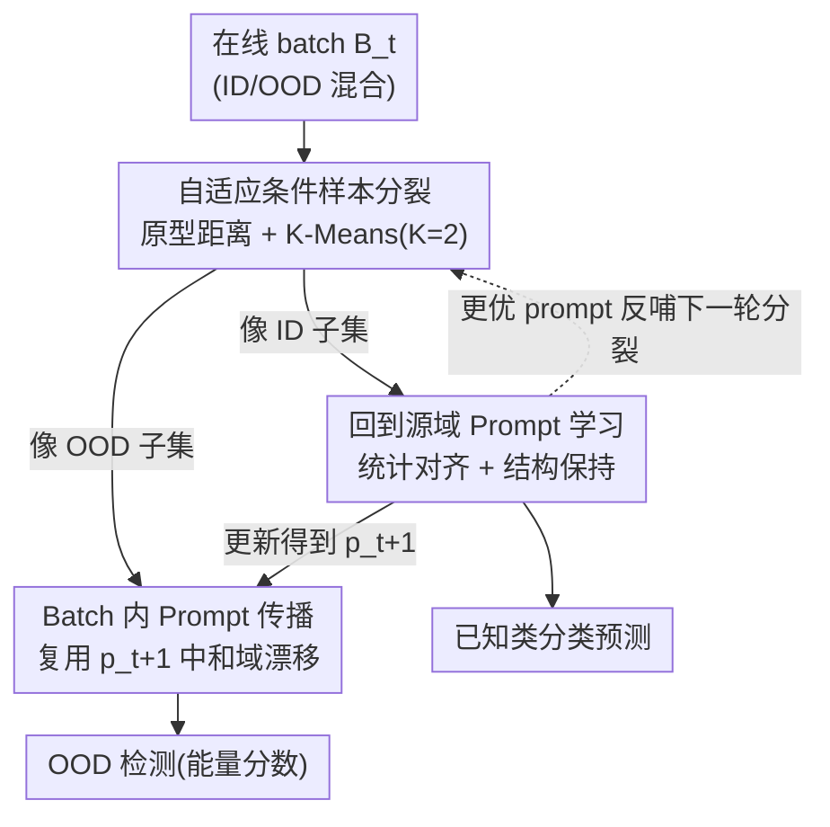

# Back to Source: Open-Set Continual Test-Time Adaptation via Domain Compensation

**会议**: CVPR 2026  
**arXiv**: [2604.21772](https://arxiv.org/abs/2604.21772)  
**代码**: https://github.com/ekyle0522/DOCO (有)  
**领域**: 测试时自适应 / 开放集识别 / OOD 检测  
**关键词**: 测试时自适应、持续学习、开放集、OOD 检测、视觉提示学习

## 一句话总结
针对"域持续漂移 + 未知新类同时出现"的开放集持续测试时自适应（OCTTA）场景，本文提出 DOCO：先把当前 batch 分成像 ID / 像 OOD 两堆，只用 ID 样本学一个把特征统计"拉回源域"的视觉 prompt，再把这个 prompt 直接复用到同 batch 的 OOD 样本上以剥离它们的语义新颖度，三步形成闭环互助，在 ImageNet-C 上 H-score 比次优方法高 4.7%。

## 研究背景与动机

**领域现状**：测试时自适应（TTA）让一个源域训练好的模型在推理时只用无标签目标数据在线适配域漂移。近年发展出两条现实轴线——持续 TTA（CoTTA、EATA、SAR、ViDA、DPCore 等）应对源源不断变化的域流；开放集 TTA（OSTTA、UniEnt、STAMP、COME 等）应对测试中冒出训练时没见过的新类。

**现有痛点**：真实部署里这两件事是**同时**发生的：一个野外感知系统既要从晴天高速适配到雾天森林（域漂移），又要识别路上突然出现的鹿这种没见过的物体（语义漂移）。本文把这个交叉场景正式定义为 **OCTTA（Open-set Continual Test-Time Adaptation）**，并指出现有方法在此会三重失灵：① 持续域流加剧灾难性遗忘；② ID 与 OOD 样本混在一个 batch 里会污染 BN/归一化统计、误导熵最小化；③ 最致命的是**域漂移和语义漂移的对抗性耦合**。

**核心矛盾**：严重的域漂移会让特征空间"塌缩"——把已知类和未知类的 embedding 一起挤进一个无法区分的区域（论文 Fig.1 的 t-SNE 直观展示了这点）。这个塌缩同时摧毁了模型的分类能力和检测新类的能力，二者无法解耦。

**本文目标**：在域不断变、新类不断冒的在线流里，既正确分类已知类，又可靠检出未知类，且每步只用当前 batch + 一次反向传播。

**切入角度**：作者的关键观察是——如果能把目标域特征统计"补偿"回源域的样子（back to source），被塌缩的特征就能重新分开；而 OOD 样本和同 batch 的 ID 样本共享同一个"域漂移因子"$\delta_t$，所以用 ID 样本学到的补偿可以**直接搬给 OOD 用**，搬完之后 OOD 的语义新颖度才暴露出来。

**核心 idea**：用一个轻量视觉 prompt 做"域补偿"，让 ID/OOD 分裂 → ID 上学 prompt → prompt 传给 OOD 三步形成自我强化的闭环。

## 方法详解

### 整体框架
DOCO 把"域适应"和"OOD 检测"拧成一个在线闭环。每来一个 batch $\mathcal{B}_t$：先用当前 prompt $p_t$ 提特征，按"离源域类原型有多远"把 batch 切成像 ID 的子集 $\hat{\mathcal{B}}_t^{\mathrm{ID}}$ 和像 OOD 的子集 $\hat{\mathcal{B}}_t^{\mathrm{OOD}}$；只在 ID 子集上做一步反传，学到把特征统计拉回源域的新 prompt $p_{t+1}$；再把 $p_{t+1}$ 立刻施加到同 batch 的 OOD 样本上，中和它们的域漂移、暴露语义新颖度供检测。更干净的分裂 → 更准的 prompt → 更好的推理与下一轮分裂，构成良性循环。骨干是冻结的 ViT-B/16，只更新 8 个 prompt token（VPT 范式），天然抗遗忘。

### 关键设计

**1. 自适应条件样本分裂：在塌缩的特征里把 ID 和 OOD 切开**

闭环的前提是把每个 batch 切成 ID / OOD 两堆，否则 OOD 会污染 prompt 学习。但严重域漂移会让 ID 和 OOD 的判别信号大量重叠，直接在原始特征上切很不准。作者的做法是用**当前 prompt $p_t$ 先补偿一遍**再切：对补偿后的特征 $z=\phi(x;p_t)$，定义原型距离 $d_{\mathrm{proto}}(z) = 1 - \max_{c\in\mathcal{Y}^S} C(z, w_c)$，其中 $\{w_c\}$ 是冻结分类头的权重、当作源域类原型，$C(\cdot,\cdot)$ 是余弦相似度。距离越小说明越靠近某个源域原型、越像 ID。然后对这一 batch 的标量距离集合跑 $K$=2 的 K-Means，把质心较小的那簇判为 ID、较大的判为 OOD。妙处在于：经过结构保持的 prompt 有很强的跨域泛化（即使新域第一个 batch 也能压低统计损失），把原本重叠的双峰重新拉开，使聚类分裂可靠——这正是 DOCO 应对"Continual"的关键

**2. 回到源域 Prompt 学习：把 ID 特征统计拉回源域、又不扭曲语义**

切出 ID 子集后要学一个 prompt 来"中和域漂移"。最直接的想法是让 ID batch 的特征统计去贴源域统计：离线预存源域特征的均值 $\mu_S$、标准差 $\sigma_S$（仅用 300 个无标签样本算），训练时最小化统计对齐损失 $\mathcal{L}_{\mathrm{stat}}(p_t) = \|\hat{\mu}_{t,p}^{\mathrm{ID}} - \mu_S\|_2 + \|\hat{\sigma}_{t,p}^{\mathrm{ID}} - \sigma_S\|_2$。但只用这一项有个坑：batch 统计既含域漂移、也含 batch 自己的窄语义——如果一个 batch 只有"猫狗"，硬把它的统计贴到含上千类的源域统计，prompt 会被迫扭曲特征结构、过拟合到这个 batch 的窄语义而不是学通用域补偿。

为此作者加了一个**结构保持正则**：要求加 prompt 前后样本两两之间的相似度几何不变。设 ID 子集 $n$ 个样本，$z_i^{\mathrm{raw}}=\phi(x_i)$、$z_i^{p_t}=\phi(x_i;p_t)$ 分别是原始和加 prompt 的特征，正则项是两个成对余弦相似度矩阵之差的 Frobenius 范数：

$$\mathcal{L}_{\mathrm{reg}}(p_t) = \left\| \mathrm{sim}(\hat{Z}_{t,p}^{\mathrm{ID}}) - \mathrm{sim}(\hat{Z}_{t,\mathrm{raw}}^{\mathrm{ID}}) \right\|_F$$

总目标 $\mathcal{L}_{\mathrm{DOCO}}(p_t) = \mathcal{L}_{\mathrm{stat}}(p_t) + \beta \mathcal{L}_{\mathrm{reg}}(p_t)$。统计对齐负责"拉回源域"，结构正则负责"别为了贴统计而毁掉相对几何"，两者一拉一拽让 prompt 学到的是泛化的域补偿而非 batch 私货——这也是它跨域泛化好、能撑起样本分裂的原因

**3. Batch 内 Prompt 传播：把 ID 学到的域知识直接搬给 OOD 用**

学到 $p_{t+1}$ 后怎么用在 OOD 上？关键洞察是同一 batch 的所有样本共享同一个 batch 级域因子 $\delta_t$：把特征近似写成 $\phi(x) \approx s(x) + \delta_t$（$s(x)$ 是类语义、$\delta_t$ 是域因子），那么用纯 ID 学到的 $p_{t+1}$ 施加到 OOD 上就有 $\phi(x;p_{t+1}) \approx \phi(x) - \delta_t \approx s(x)$，相当于把 OOD 的域成分也减掉、只留语义。补偿后用冻结分类头 $h$ 算 logit、用能量分数判 OOD。这步之所以非平凡：它(i) 把分错进 OOD 的真 ID 样本拉回源域邻域、(ii) 让真 OOD 相对"补偿后的源域几何"显得更新颖、(iii) **不对 OOD 样本反传**，避免伪标签噪声泄漏、稳住整 batch 的决策边界。这就把"域漂移"和"语义新颖"解耦开了

### 损失函数 / 训练策略
- 骨干 ViT-B/16（ImageNet-1K 预训练，timm 权重）全程冻结，只更新 $L=8$ 个 prompt token；多数 baseline 只更 LayerNorm 仿射参数，CoTTA 则更全部参数。
- 每个 batch 用 AdamW（学习率 $1\text{e-}1$）做**一步**反传更新 prompt，结构正则权重 $\beta=0.5$。
- 离线预存源域统计用 300 个无标签样本；在线前 prompt 先做一次性自监督更新 50 步 refine 初始状态。
- 测试流按 Huber 污染模型 $P_{\text{test}} = (1-\kappa)P_{\text{ID-C}} + \kappa P_{\text{OOD-C}}$ 组织，OOD 比例 $\kappa=0.5$，batch size 统一 64；超参只在第一个"数据集-域"组合上调，之后冻结迁到所有未见数据集（盲测协议）。

## 实验关键数据

### 主实验
ImageNet→ImageNet-C（severity=5，$\kappa=0.5$，15 种 corruption 平均，跨 6 个 OOD 数据集），ACC 衡量已知类分类、AUC 衡量 OOD 检测、H-score 为二者调和平均：

| 方法 | Avg. ACC | Avg. AUC | H-score |
|------|----------|----------|---------|
| Source | 49.8 | 68.0 | 56.4 |
| EATA (ICML'22) | 52.9 | 67.3 | 57.8 |
| OSTTA (ICCV'23) | 56.2 | 61.9 | 58.5 |
| UniEnt (CVPR'24) | 57.8 | 77.0 | 65.4 |
| E-COME (ICLR'25) | 58.3 | 75.5 | 65.2 |
| DPCore (ICML'25) | 54.1 | 76.2 | 62.6 |
| **DOCO (Ours)** | **61.5** | **82.7** | **70.1** |

DOCO 把 H-score 推到 **70.1%**，比次优 UniEnt 高 **4.7%**，且 ACC（61.5%）和 AUC（82.7%）同时领先——说明它对"分类"和"检测"是平衡增强而非顾此失彼。

更难的 LAION-C benchmark（severity=3，6 个不断切换的域）上，所有方法都大幅掉点，但 DOCO 仍以 **H-score 32.7%** 居首，领先最近的 DPCore（30.3%）**2.4%**。闭集 CTTA（IN-C/A/R/Sketch/L 五数据集平均）上 DOCO 也以 **43.1%** ACC 最优，说明开放集设计不会损害普通 TTA 场景。

### 消融实验
拆解三大组件——Sample Splitting (S)、OOD Propagation (O)、Structural Regularizer (R)，P 列为 prompt 方法上的 H-score（ImageNet-C）：

| 配置 | S | O | R | H-score | Gain |
|------|---|---|---|---------|------|
| Source | - | - | - | 56.4 | - |
| w/o S.O.R（仅统计对齐） | - | - | - | 64.0 | +7.6 |
| w/o S.O | - | - | ✓ | 67.6 | +11.2 |
| w/o R | ✓ | ✓ | - | 68.5 | +12.1 |
| **Full Model** | ✓ | ✓ | ✓ | **70.1** | **+13.7** |

### 关键发现
- **三组件缺一不可且互补**：仅靠统计对齐只有 +7.6%；加上 S+O（分裂+传播）一下跳到 +12.1%（68.5）；再补结构正则 R 收尾到 70.1%。三者是协同放大而非简单叠加。
- **结构正则是"分裂失败时的安全网"**：即使关掉分裂机制（w/o S.O），结构正则也能阻止 prompt 把 OOD 语义对齐到源域 ID，相比 w/o S.O.R 还能多拿 +3.6%——意味着即便极端情况下切不开 ID 子集，模型也不会崩。
- **超参不敏感 + 数据高效**：$\beta$ 和 $L$ 在很宽范围内 H-score 保持高位（broad plateau）；batch size ≥8 就达一线性能；仅用 **50 个源样本**就逼近全量效果。
- **域顺序鲁棒**：6 种随机域排序下 DOCO 准确率稳定，在 Contrast 这类难域上别的方法骤降而它仍强，证明效果不依赖有利的域序列。

## 亮点与洞察
- **"共享域因子可搬运"是全文最巧的杠杆**：用纯 ID 样本学补偿、再无成本地搬给同 batch 的 OOD，把"学不到 OOD 怎么补偿"这个死结绕开了——前提仅是同 batch 共享 $\delta_t$ 这个温和假设，且不对 OOD 反传避免噪声泄漏，工程上极干净。
- **闭环自强化设计值得复用**：分裂↔学 prompt↔传播三步互为因果、彼此越用越准，这种"用上一步的产物改善下一步输入"的在线良性循环，可迁移到任何需要在线伪标签的自适应任务。
- **结构保持正则解决了"统计对齐过拟合窄语义"的隐患**：用成对相似度矩阵的不变性约束几何，是一个轻量但通用的 trick，可用在任何"靠统计对齐做域适应又怕扭曲语义"的场景。
- **把 OCTTA 正式建模为 Huber 污染混合**，并用 t-SNE/Grad-CAM 直观展示"特征塌缩→域补偿→重新可分"，问题定义和可视化都很有说服力。

## 局限与展望
- **"同 batch 共享单一域因子 $\delta_t$"是核心假设**：现实中一个 batch 可能混入多个域（如视频转场、多传感器），此时 $\phi(x)\approx s(x)+\delta_t$ 的单因子近似会失效，prompt 传播的"减域因子"逻辑会打折。
- **依赖 batch 内有足够 ID 样本**：$\kappa$ 很高（OOD 占比极大）或 batch 很小时，ID 子集统计噪声大、K-Means 分裂可能退化；论文靠结构正则兜底，但小 batch 下确实观察到去掉正则就明显掉点。
- **预存源域统计的前提**：需要离线拿到 300（甚至 50）个源样本算 $\mu_S/\sigma_S$，纯黑盒/无源场景不适用。
- **仅在分类+OOD 检测任务上验证**：检测、分割等密集预测下"特征统计回源"的可行性未知，是值得延伸的方向。

## 相关工作与启发
- **vs UniEnt (CVPR'24)**：UniEnt 在伪 ID 上最小化、伪 OOD 上最大化熵；本文不靠熵优化，而是"补偿域漂移→暴露语义新颖度"，在 ImageNet-C 上 H-score 高 4.7%，且对 $\kappa$ 变化更稳。
- **vs CoTTA (CVPR'22)**：CoTTA 更新全部参数靠权重/增广平均稳住长程更新；DOCO 只更 8 个 prompt token，抗遗忘更彻底、计算更省，且原生支持开放集。
- **vs DPCore (ICML'25)**：DPCore 用动态 prompt coreset 记忆重现域；DOCO 不维护域记忆，靠"每 batch 现学现搬"的闭环应对持续漂移，OOD 检测 AUC 更高（82.7 vs 76.2）。
- **vs 训练时显式分离域因子的 OOD 泛化工作**：那些方法在训练阶段显式去除域成分；DOCO 是**测试时在线的过程内纠正**，无需重训、只用当前 batch。

## 评分
- 新颖性: ⭐⭐⭐⭐⭐ 首次正式定义 OCTTA，并用"ID 学补偿、搬给 OOD"的闭环巧妙解耦域漂移与语义漂移
- 实验充分度: ⭐⭐⭐⭐⭐ ImageNet-C/LAION-C/闭集 CTTA 三套 benchmark + 组件消融 + 超参/batch/源样本/域序敏感性 + 可视化，盲测协议严谨
- 写作质量: ⭐⭐⭐⭐ 动机清晰、图示直观、公式完整；闭环三步的因果关系讲得透
- 价值: ⭐⭐⭐⭐⭐ OCTTA 贴近真实野外部署，方法轻量（仅 8 prompt token、一步反传）、即插即用、数据高效，实用性强

<!-- RELATED:START -->

## 相关论文

- [\[CVPR 2026\] Neural Collapse in Test-Time Adaptation](neural_collapse_in_test-time_adaptation.md)
- [\[CVPR 2026\] Towards Stable Federated Continual Test-Time Adaptation in Wild World](towards_stable_federated_continual_test-time_adaptation_in_wild_world.md)
- [\[CVPR 2026\] Curvature-Aware Zeroth-Order Optimization for Memory-Efficient Test-Time Adaptation](curvature-aware_zeroth-order_optimization_for_memory-efficient_test-time_adaptat.md)
- [\[CVPR 2026\] Dance Across Shifts: Forward-Facilitation Continual Test-Time Adaptation through Dynamic Style Bridging](dance_across_shifts_forward-facilitation_continual_test-time_adaptation_through_.md)
- [\[ICML 2025\] Ranked Entropy Minimization for Continual Test-Time Adaptation](../../ICML2025/others/ranked_entropy_minimization_for_continual_test-time_adaptation.md)

<!-- RELATED:END -->
