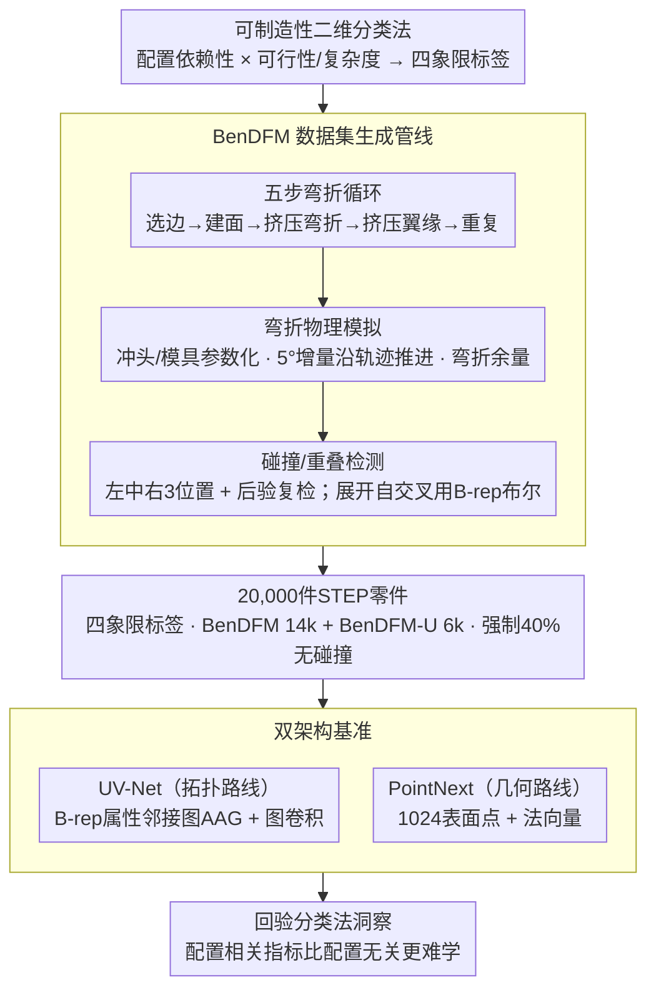

# BenDFM: A Taxonomy and Synthetic CAD Dataset for Manufacturability Assessment in Sheet Metal Bending

**会议**: CVPR 2026  
**arXiv**: [2603.13102](https://arxiv.org/abs/2603.13102)  
**代码**: [github.com/UGent-CVAMO/bendfm](https://github.com/UGent-CVAMO/bendfm)  
**领域**: CAD / 智能制造 / 几何深度学习  
**关键词**: 可制造性评估, 钣金弯曲, 合成CAD数据集, DFM分类法, B-rep学习

## 一句话总结

提出可制造性指标的二维分类法（配置依赖性 x 可行性/复杂度）和首个钣金弯曲合成 CAD 数据集 BenDFM（20,000 零件，含可制造和不可制造设计），基准测试显示拓扑感知的图表示（UV-Net, AUC 0.896）在四类任务上全面优于点云方法（PointNext, AUC 0.844）。

## 研究背景与动机

**领域现状**：设计可制造性（DFM）要求在设计阶段预测生产可行性和难度。深度学习在制造过程选择（process selection）上已有显著进展，但在工艺内可制造性评估（Intra-Process Manufacturability Assessment, IPMA）上进展缓慢。

**现有痛点**：(1) "可制造性"定义混乱——有的依赖特定设备配置（如可用冲头尺寸），有的是普遍几何约束（如展开自交叉），有的是离散判断，有的是连续度量，语义混淆阻碍方法对比和知识迁移；(2) 工业数据集存在严重"幸存者偏差"——只保留经过优化的可制造设计，不可制造的失败案例被丢弃，模型无法学习导致生产失败的几何特征；(3) 现有合成数据集主要服务减材工艺（钻孔、铣削），基于简单立方体几何，且已被证明泛化能力差。

**核心矛盾**：钣金弯曲需要模拟顺序弯折操作和复杂零件-工具交互（碰撞检测），比简单孔径比判断复杂得多，但既无数据集也无统一定义框架。

**本文目标** 系统化定义可制造性概念空间 + 为钣金弯曲创建首个包含可制造/不可制造设计的合成 CAD 数据集。

**切入角度**：先建立分类法统一语言，再用参数化建模+弯折物理模拟生成标注丰富的数据集。

**核心 idea**：二维分类法（配置依赖 x 可行性/复杂度）+ 过程感知合成管线（弯折轨迹+碰撞检测）= 首个可支撑学习型 DFM 的钣金弯曲数据集。

## 方法详解

### 整体框架

这篇论文要解决的不是某个新模型，而是给"可制造性评估"这件事补上缺失的两块地基：一套统一的概念分类法，和一个真正含有失败案例的数据集。它的逻辑链条是：先用一个二维分类法把混乱的"可制造性"定义切成四个明确象限，让不同论文说的是同一种语言；再据此设计一条参数化弯折 + 物理模拟的合成管线，生成 20,000 件 STEP 零件，每件都带上四象限对应的标签（含大量不可制造设计）；最后把两种代表性 3D 学习架构（UV-Net 和 PointNext）放进这个数据集做基准，用实验回过头验证分类法揭示的洞察——配置相关的指标确实比配置无关的更难学。

### 关键设计

**1. 可制造性二维分类法：给"可制造"四个字一个坐标系**

研究背景里指出的第一个痛点，是文献里"可制造性"语义混乱：有的依赖具体设备配置，有的是普遍几何约束，有的是离散判断，有的是连续度量，混在一起导致方法无法横向比较、知识无法迁移。本文把所有可制造性指标摊到一个二维平面上：横轴区分**配置无关**（几何固有，换什么设备都改变不了，如展开自交叉）与**配置相关**（依赖具体工具/设备，换套工具可能就解决，如冲头碰撞）；纵轴区分**可行性**（离散判断"能不能造出来")与**复杂度**（连续度量"有多难造")。四个象限各有一个钣金弯曲里的典型实例：几何可行性对应展开重叠（任何设备都做不出来），配置可行性对应冲头碰撞（换工具可能可解），几何复杂度对应展开面积（纯几何属性），配置复杂度对应翻转次数（依赖弯折顺序）。这个坐标系之所以有用，是因为它一眼解释了为什么现有文献定义差这么多——它们其实落在不同象限；同时它划清了模型泛化能力的边界：一个只学过某套工具的模型，在配置相关象限上天然不可能跨配置泛化。

**2. BenDFM 数据集生成管线：把失败案例造进数据里**

工业数据集的"幸存者偏差"是第二个痛点——只留下优化过的可制造设计，失败案例被丢弃，模型根本没机会学到导致生产失败的几何特征。本文用一条基于 PythonOCC 的参数化管线主动制造这些失败案例。零件生成是个五步循环：选边 → 构建弯折面 → 挤压弯折 → 挤压翼缘 → 重复，加权采样偏好靠近底部和较长的边缘，并支持弯折减让、斜面/圆面翼缘、对称偏置，由此生成 20,000 件零件。

真正决定标签质量的是物理模拟那一层。工具（冲头、模具）的几何被显式参数化、以三角函数定义形状；弯折过程不是一步到位，而是沿弯折轨迹以 5 度增量逐步推进，每步都计算弯折余量（bend allowance）并在该中间角度做碰撞检测——这样能捕捉到"中途某个角度撞上、但终态看不出"的情形。碰撞检测还做了两点增强：冲头/模具在左/中/右 3 个位置各实例化一次，反映实际产线的对齐灵活性（某个位置撞了换个位置可能就行）；并在所有弯折完成后做一次后验复检，捕获后续翼缘对先前已成形弯折的干涉。展开重叠则通过 B-rep 布尔运算检测展开平面图案的自交叉。

最终数据集为 20,000 件 STEP 零件，每件附带展开模型、完整弯折序列参数和四象限可制造性标签，并切成两个平衡子集：BenDFM 子集 14,000 件用于碰撞任务（50/50 平衡），BenDFM-U 子集 6,000 件用于展开重叠任务（50/50 平衡）。一个容易被忽视但关键的设计是强制 40% 的弯折无碰撞——否则随机生成的零件大多是显然不可制造的废件，决策边界会被这些简单负样本支配，模型学不到微妙的、接近边界的判别特征。

**3. 双架构基准：用拓扑 vs 点云的对照验证分类法**

有了数据集，论文选了两种表示思路截然不同的 SOTA 架构来跑基准，目的不只是刷分，而是验证"拓扑信息对可制造性到底重不重要"以及"配置相关指标是否真的更难"。UV-Net 走拓扑路线，在 B-rep 的属性邻接图（AAG）上操作：每个面用 $10\times10$ 的 UV 网格采样、每条边用 10 点序列采样，先经 2D/1D CNN 编码再送进图卷积网络，因而保留了面与面之间的邻接关系。PointNext 走几何路线，把零件采成 1024 个表面点、用坐标加法向量作特征，丢掉了显式拓扑。两者在四个象限任务上的对照，正好把"是否保留 B-rep 拓扑"这一变量单独拎出来检验。

### 损失函数 / 训练策略

分类任务用 BCE 损失，回归任务用 MSE 损失；统一 Adam 优化器，$\text{lr}=0.0005$，batch=32，早停 patience=20。数据按 80/10/10 划分，每个实验用 5 个不同随机种子重复，报告均值和标准差。

## 实验关键数据

### 主实验：可行性分类

| 模型 | 任务 | AUC | Acc(%) | F1(%) | 类型 |
|------|------|-----|--------|-------|------|
| UV-Net | 冲头碰撞（配置可行性） | 0.840 | 76.07 | 75.41 | 分类 |
| PointNext | 冲头碰撞 | 0.827 | 73.83 | 71.74 | 分类 |
| UV-Net | 展开重叠（几何可行性） | **0.896** | **81.80** | 81.31 | 分类 |
| PointNext | 展开重叠 | 0.844 | 76.13 | 76.55 | 分类 |

### 主实验：复杂度回归

| 模型 | 任务 | MAE | RMSE | MAPE(%) | 类型 |
|------|------|-----|------|---------|------|
| UV-Net | 翻转次数（配置复杂度） | **0.54** | 0.86 | 35.52 | 回归 |
| PointNext | 翻转次数 | 0.59 | 0.90 | 39.33 | 回归 |
| UV-Net | 展开面积（几何复杂度） | **14.60** | 20.68 | 5.90 | 回归 |
| PointNext | 展开面积 | 20.24 | 28.82 | 8.28 | 回归 |
| Baseline（训练集均值） | 翻转次数 | 0.984 | 1.180 | 67.67 | - |
| Baseline（训练集均值） | 展开面积 | 89.81 | 111.35 | 46.01 | - |

### 消融/分析

| 分析维度 | 结论 | 说明 |
|---------|------|------|
| UV-Net vs PointNext | 四任务全面优于点云 | B-rep 拓扑关系对可制造性预测至关重要 |
| 几何类 vs 配置类 | AUC 0.896 vs 0.840 | 几何类指标系统性更容易学习 |
| 40% 无碰撞弯折 | 有效防止简单负样本支配 | 创建更微妙的决策边界 |
| 折叠 vs 展开几何输入 | 展开几何略优 | 展开几何直接暴露碰撞约束 |

### 关键发现

- UV-Net 在四个任务上全面优于 PointNext，表明保留 B-rep 拓扑关系对可制造性预测至关重要
- 几何类指标（配置无关）系统性地比配置类指标更容易学习——配置依赖引入了额外的工具特定复杂性
- 配置复杂度（翻转次数）MAPE 仍达 35.52%，说明从最终几何推断操作序列信息是核心挑战
- 两种模型均大幅超越基线（均值预测），但距离实用部署仍有差距

## 亮点与洞察

- 分类法切中要害：实际解释了不同论文对"可制造性"定义差异大的原因，为社区提供统一语言和研究路线图
- 数据集设计周全：动态弯折轨迹模拟、三位置对齐灵活性、后验碰撞检测在合成数据中罕见
- 配置无关 vs 配置相关的性能差异验证了分类法的核心洞察：泛化性与配置特异性存在本质权衡
- 为工业 AI 领域提供了急需的基础设施（数据集+基准+分类法），具有基础性贡献

## 局限与展望

- 仅用一组固定冲头/模具配置，未验证跨配置泛化能力
- 模型只看最终 CAD 几何，未编码弯折操作序列信息——序列架构（如 RNN/Transformer）可能捕获操作顺序依赖
- 合成数据与真实工业零件的域差距需实物验证（springback、弹性恢复等物理现象未建模）
- 仅覆盖钣金弯曲，其他成形工艺（深拉、冲压、弯管）有待扩展
- 可探索逆问题：从候选工具集中推荐最佳配置，将 IPMA 转化为配置选择任务

## 相关工作与启发

- **vs Ghadai et al. (2018)**：用简单立方体+钻孔做减材工艺 DFM，BenDFM 几何复杂度和物理真实性远高，且首创覆盖成形工艺
- **vs Peddireddy et al. (2021)**：关注减材工艺的内部空腔/底切，BenDFM 需要模拟动态弯折轨迹和零件-工具交互
- **vs SMCAD (Ma & Yang, 2024)**：SMCAD 为少量固定基础几何添加特征做特征识别，BenDFM 从参数化弯折过程生成，几何多样性和 DFM 相关性更高
- **分类法启发**：配置依赖性维度对任何数据驱动 DFM 系统的可迁移性分析都有指导意义

## 评分

⭐⭐⭐⭐ (3.5/5)

- **新颖性** ⭐⭐⭐⭐：分类法系统化填补定义空白，数据集首创覆盖成形工艺
- **实验充分度** ⭐⭐⭐：两种架构有代表性，但缺更多方法对比和跨配置实验
- **写作质量** ⭐⭐⭐⭐⭐：结构清晰，叙事逻辑完整，分类法阐述精准
- **价值** ⭐⭐⭐⭐：为制造 AI 社区提供急需的基础设施（分类法+数据集+基准）

<!-- RELATED:START -->

## 相关论文

- [\[CVPR 2026\] SldprtNet: A Large-Scale Multimodal Dataset for CAD Generation in Language-Driven 3D Design](sldprtnet_a_large-scale_multimodal_dataset_for_cad_generation_in_language-driven.md)
- [\[CVPR 2026\] What Is the Optimal Ranking Score Between Precision and Recall? We Can Always Find It and It Is Rarely F₁](what_is_the_optimal_ranking_score_between_precision_and_recall_we_can_always_fin.md)
- [\[CVPR 2026\] POLISH'ing the Sky: Wide-Field and High-Dynamic Range Interferometric Image Reconstruction](polishing_the_sky_widefield_and_highdynamic_range.md)
- [\[CVPR 2026\] Crowdsourcing of Real-world Image Annotation via Visual Properties](crowdsourcing_of_real_world_image_annotation_via_visual_properties.md)
- [\[CVPR 2026\] SimRecon: SimReady Compositional Scene Reconstruction from Real Videos](simrecon_simready_compositional_scene_reconstruction_from_real_videos.md)

<!-- RELATED:END -->
