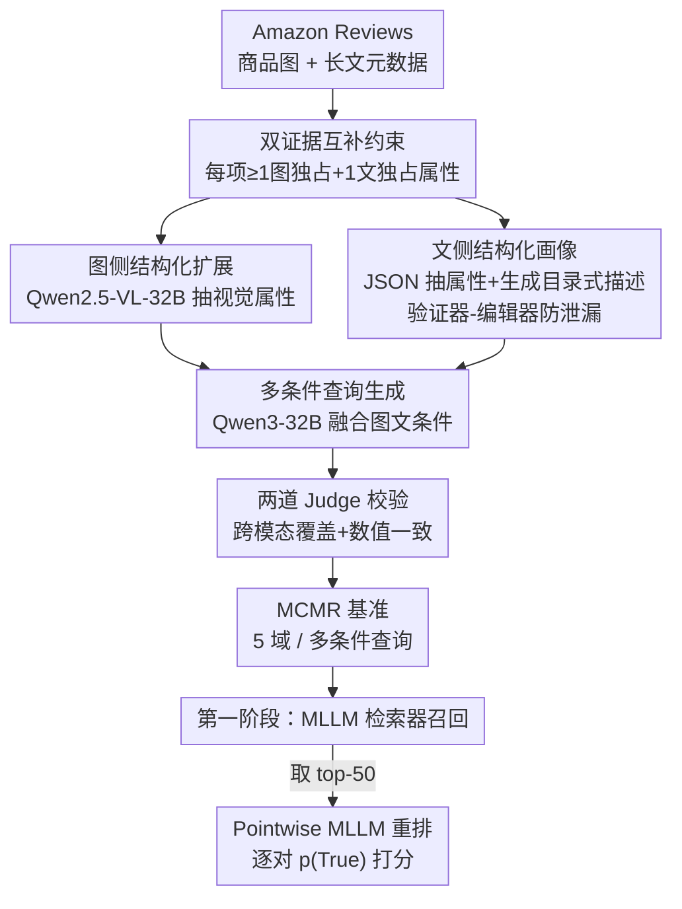

# Beyond Global Similarity: Multi-Conditional Retrieval for Fine-Grained Cross-Modal Understanding

**会议**: CVPR 2026  
**论文**: [CVF Open Access](https://openaccess.thecvf.com/content/CVPR2026/html/Lu_Beyond_Global_Similarity_Multi-Conditional_Retrieval_for_Fine-Grained_Cross-Modal_Understanding_CVPR_2026_paper.html)  
**代码**: https://github.com/EIT-NLP/MCMR  
**领域**: 细粒度跨模态检索  
**关键词**: 多条件检索, 跨模态对齐, MLLM 检索, 双证据约束, Pointwise 重排  

## 一句话总结
本文提出 MCMR 基准——一个要求"图像与文本上的多个互补条件同时满足才算命中"的细粒度跨模态商品检索数据集，并系统评测了主流 MLLM 检索器与 MLLM-as-Reranker，发现现有检索器擅长粗粒度召回但难以做多条件的精排，而显式逐对验证的 pointwise 重排能大幅提升 top 排序质量。

## 研究背景与动机

**领域现状**：跨模态检索主流是 CLIP / ALIGN / BLIP 这类双编码器，把图文映到共享空间用余弦相似度匹配；近年又演化出把 MLLM 末层隐状态直接 pooling 成统一嵌入的"MLLM-as-embedding"路线（VLM2Vec、MM-Embed、GME 等），支持开放式自然语言指令检索。

**现有痛点**：这些模型都被训练去对齐"整图—整句"的全局语义，caption 往往只是对图像的笼统概括，于是模型偏向全局语义一致、对细粒度跨模态理解很弱。更关键的是评测层面：现有基准很难同时满足复杂检索需要的三个性质——(i) 细粒度属性推理、(ii) 多条件查询、(iii) 跨模态证据（不同条件分别落在图与文上）。MS-COCO/Flickr30K 只做粗粒度图文对齐；FashionIQ/CIRR 虽细粒度但围绕单一视觉改动、且大多数属性看图就能判断，本质是单模态；text-only 的多条件检索（MultiConIR）把证据全放在文本里，回避了跨模态融合；MERIT 引入交错图文查询，但依赖参考图（"和商品 1 同款"），强调视觉比对而非独立属性指定，也没把"需要看图才能判定的属性"和"藏在文本元数据里的属性"分开。

**核心矛盾**：现有基准要么有细粒度、要么有多条件，但没有一个把"细粒度 + 多条件 + 证据跨两个模态"同时立起来，导致根本无法诊断模型是否真的在做约束感知（constraint-aware）的组合推理，还是仅靠某一模态的全局相似度蒙对。

**本文目标**：造一个能强制模型同时满足多个、且分散在图文两侧的细粒度条件的检索基准，并用统一协议评测检索器 + 重排器，量化它们的模态依赖与细粒度短板。

**切入角度**：作者从一个观察出发——只要数据里每个商品都被设计成"有些属性只能看图判定、有些属性只能读元数据判定"，任务就无法被单一模态解掉，从而天然逼出跨模态融合。

**核心 idea**：用"双证据互补约束 + 全部条件 AND 才算相关"重新定义检索任务，配合一条 LLM 协作流水线大规模生成可验证的多条件自然语言查询，把跨模态组合推理变成可度量、可诊断的问题。

## 方法详解

本文不是提出一个新检索模型，而是构造一个新基准 **MCMR（Multi-Conditional Multimodal Retrieval）** 并定义其评测协议。因此"方法"由两条主线组成：(1) 数据集如何被设计与生产，使其真正考验多条件跨模态推理；(2) 检索 + 重排两阶段评测协议如何度量模型在这件事上的能力。原子单元是一个"商品 = 一张图 + 一段长文元数据"，两个模态贡献互补信息；一条查询是用户用第一人称写的、混合了若干视觉条件和若干文本条件的自然语言，候选只有在**所有**条件都满足时才算正例。

### 整体框架

数据从 Amazon Reviews (2023) 语料出发，覆盖上衣、下装、珠宝、鞋、家具五个商品域。先做清洗与"互补性"筛选保证每个商品图文各自携带独占属性；再用一条"中型模型量产、强模型验证精修"的协作流水线，从图侧抽结构化视觉属性、从文侧抽结构化文本画像，分别生成纯文本目录式描述（防视觉泄漏）和融合双侧条件的多条件查询，并经两道 judge 校验跨模态覆盖与数值/时间一致性。最后在统一协议下评测：第一阶段用 MLLM 检索器对融合图文候选做召回，第二阶段取 top-50 用 MLLM 做 pointwise 重排逐对判真伪。

### 关键设计

**1. 双证据互补约束：逼模型必须同时读图与读文，堵死单模态捷径**

这一条直击"FashionIQ/CIRR 看图就能解、MultiConIR 看文就能解"的痛点。MCMR 在数据策展阶段强制要求每个商品**至少包含一个只能从图像推断的细粒度属性**（如纹理、布局、结构细节、形状）**和一个只能从长文元数据推断的属性**（如材质、价格、产地、版型）。形式上，一条查询的条件集合 $C=\{c_1,\dots,c_n\}$ 被人为拆成视觉条件子集 $C_v$ 与文本条件子集 $C_t$ 且两者都非空；候选 $d$ 相关当且仅当 $\mathrm{rel}(q,d)=\bigwedge_{i=1}^{n}\mathbb{1}[d\models c_i]=1$，即所有条件 AND 满足，缺一不可。正因为 $C_v$ 与 $C_t$ 都非空，任何只编码图或只编码文的系统在原理上都拿不到完整证据——这把"跨模态融合"从一个软偏好变成了硬性必需，也是 MCMR 区别于此前所有基准（见对比表里它独占 Dual-Evidence + Multi-Attribute + Long-form Metadata 三项）的根本所在。

**2. 协作式 LLM 构造流水线：中型模型量产、强模型验证，规模化生成可验证的多条件查询**

要在五个域上造出上万条"图文互补、可核验"的查询，纯人工不现实、纯单模型又易引入跨模态泄漏（把只能看图的属性写进纯文本描述里，任务就退化了）。作者用一条分工流水线解决：图侧用 Qwen2.5-VL-32B-Instruct 产出带类别标签的结构化视觉摘要，**严格排除功能性/臆测性内容**，形成视觉证据层；文侧用 JSON 抽取模板把标题、描述、特征列表转成结构化文本画像，并只在品牌与图像属性共现时才允许出现品牌（防泄漏）；随后 Qwen3-32B-Instruct **仅基于文本元数据**生成 80–120 词的目录式描述，且用 DeepSeek-R1-Distill-Qwen-32B 做"验证器—编辑器"环路检测跨模态泄漏；查询生成阶段再由 Qwen3-32B 同时 condition 在图属性与文本摘要上，产出第一人称、多条件、归一化了数值与时间的"购物者"口吻查询，并按域定制 prompt（如服装看面料/版型/护理、珠宝看宝石/切工/镶嵌）。这套"强弱搭配"既压成本又保真度，作者还做了 100 样本人评：机器生成查询与人写查询的平均分（4.33 vs. 4.41）和偏好率（47% vs. 49%）几乎持平，说明生成质量接近人工。

**3. Pointwise MLLM 重排协议：用逐对显式验证补第一阶段精排的短板**

第一阶段检索器把候选库压到很小后，仍然普遍 top-1 命中很低（多条件下细排很弱）。作者引入第二阶段 pointwise 重排：取最强一阶段检索器（融合设定下 R@50 最高的 LLaVE-7B，R@50=72.01）返回的 **top-50** 候选，逐个把"文本查询 + 候选的图像和元数据"喂给一个视觉语言 MLLM，让它在统一 prompt 下输出二元相关判断（true/false）。打分用的是模型在首个回答位置上对 `True` token 的归一化 logit 概率 $s(q,d)=p(\texttt{True}\mid q, \text{img}_d, \text{meta}_d)$（在 `{True, False}` 两个 token 上 softmax 归一），按该分数排序、并以原检索名次打破平局。这个设计把"一次比全库"换成"一次只判一对"，让模型能逐条核对查询与候选是否一致，从而在最该用力的 top 位置补强排序——这也是论文核心发现之一：重排器在 nDCG@1 上能冲到 70–80，远超一阶段检索器可怜的 Recall@1。

### 一个完整示例

以一条鞋类查询为例（图 1/图 2 风格）："我想找一双男士棕色皮质高帮工装靴、系带闭合、带 OrthoLite 缓震鞋垫、价格 260 美元以内。"其中"棕色 / 高帮 / 系带闭合"是只能看图判定的**视觉条件** $C_v$，"皮质 / OrthoLite 鞋垫 / <\$260"是藏在元数据里的**文本条件** $C_t$。一个只看图的检索器可能把同样棕色高帮、但鞋垫和价格不符的靴子排到前面（文本条件不满足→负例）；一个只读文的检索器可能匹配上材质和价格、却是低帮款（视觉条件不满足→负例）。只有同时满足 $C_v\wedge C_t$ 的那双 Danner Bull Run 才是正例。第二阶段重排器拿到 top-50 后，对每个候选把图 + 元数据 + 查询一起读，逐条核对六个条件后输出 $p(\texttt{True})$，把真正全满足的那双顶到第一。

## 实验关键数据

评测在两张 A100(80GB) 上、全部 zero-shot 进行。检索器：GME-Qwen2-VL-7B、LLaVE-7B、VLM2Vec、LamRA-Ret-Qwen2.5VL-7B、CORAL、MM-EMBED；重排器：Qwen2.5/3-VL 系列、InternVL3-8B、Qwen3-VL-Reranker-8B、lychee-reranker-mm。指标用 Recall@K、nDCG@K、MRR@10。数据集覆盖五域，含约 3,997 条查询、约 104,981 个候选（查询均长 ~36 token、候选均长 ~191 token；摘要另称 "10,400 products"，与表 2 候选总数不一致，⚠️ 以原文为准）。

### 主实验（融合候选 image+text，节选 R@1/R@10/R@100）

| 模型 | 规模 | R@1 | R@10 | R@100 | nDCG@10 |
|------|------|-----|------|-------|---------|
| CORAL | 3B | **26.57** | **53.34** | 77.73 | 39.35 |
| LLaVE | 7B | 24.99 | 53.13 | **78.64** | 37.88 |
| MM-EMBED | 8B | 21.74 | 47.91 | 74.16 | 33.75 |
| GME-Qwen2VL | 7B | 21.23 | 45.74 | 73.52 | 32.48 |
| LamRA-Qwen2.5VL | 7B | 17.96 | 43.30 | 73.24 | 29.53 |
| VLM2Vec | 4B | 1.83 | 7.03 | 18.96 | 4.02 |

主结论：即便图文都给全，主流检索器 R@1 也只有 18–27%（VLM2Vec 仅 1.83%），但 R@100 能到 73–79%——正例往往被召回了却排不进前列，早排与长尾之间的巨大落差说明模型粗粒度召回尚可、多条件精排很差，给下游重排留下大量空间。

### 模态消融（候选侧去图 / 去文，R@1 与 R@10）

| 设定 | 模型 | R@1 | R@10 | 现象 |
|------|------|-----|------|------|
| Image-only | GME-Qwen2VL | 21.79 | 51.10 | 视觉强，几乎不掉、R@1 略涨 |
| Image-only | LLaVE | **0.90** | 3.93 | 去文即崩（融合时 R@1=24.99） |
| Image-only | MM-EMBED | 13.23 | 35.68 | 中等下滑 |
| Text-only | MM-EMBED | 12.98 | — | 文本侧最强但仍很弱 |
| Text-only | GME-Qwen2VL | — | 29.60 | 由 51.10→29.60（R@100 78.86→57.50） |

### 重排提升（pointwise，在 LLaVE top-50 上，nDCG@1/5/10/50）

| 重排器 | nDCG@1 | nDCG@5 | nDCG@10 | nDCG@50 |
|--------|--------|--------|---------|---------|
| lychee-reranker-mm | **82.51** | 83.71 | 85.42 | 87.26 |
| InternVL-8B / Qwen3-VL-Reranker-8B | 70–80 区间 | … | … | … |

### 关键发现
- **视觉是 MCMR 的主导判别信号**：text-only 候选在 R@10 上普遍弱于 image-only，且远低于融合；但融合仍比 image-only 高出约 4–8 点，证明文本元数据确实贡献了图像之外的互补约束——这正中数据集"图文各有独占属性"的设计。
- **强全局相似 ≠ 鲁棒**：GME 在去模态下很稳，而 LLaVE/CORAL 早排骤降（LLaVE 去文 R@1 从 24.99→0.90），说明它们重度依赖某一模态的先验；作者据此呼吁未来模型应"把查询条件显式保留、逐条核验，并减少模态间冗余"。
- **重排器把增益集中在最顶端**：nDCG@1 提升最大、到 nDCG@50 逐渐收窄；且参数量不预测重排能力，架构与图文 grounding 比规模更关键（lychee-mm 全程最强，超过更大的 8B 模型）。

## 亮点与洞察
- **"双证据 + AND 全满足"是把跨模态从软偏好变硬约束的巧妙杠杆**：只要在策展阶段保证图文各有独占属性，就在数据层面堵死了单模态捷径，比在模型层面加 loss 约束更干净、更可诊断。
- **"中型模型量产 + 强模型验证 + 验证器-编辑器防泄漏"是一套可复用的合成数据质控范式**：尤其"纯文本描述阶段显式剔除视觉描述符"这一步，是防止多条件基准退化成单模态的关键 trick，可迁移到任何需要"模态隔离"的数据合成。
- **"一阶段召回弱、二阶段逐对验证强"的对比本身就是论据**：它直接暴露了 embedding 式检索在组合推理上的天花板，也为"先粗召回再 MLLM 精排"的工业 pipeline 提供了量化依据。

## 局限与展望
- 这是基准+评测论文，**没有提出新的检索/重排模型**，只诊断问题、未给出解法。
- 数据全部来自电商商品（Amazon Reviews）五个域，结论能否外推到非商品、非属性化的开放域检索存疑。
- 查询由 LLM 合成，尽管做了人评与双 judge 校验，仍可能带有生成模型的风格偏置；摘要"10,400 products"与表 2 候选总数 ~105K 口径不一致 ⚠️。
- 改进思路：把"双证据互补约束 + 逐条核验"反过来用作训练信号（如让检索器显式输出每个条件的满足度），或把 pointwise 重排蒸馏回一阶段嵌入以兼顾效率与精排。

## 相关工作与启发
- **vs FashionIQ / CIRR**: 它们做"参考图 + 一句改动"的单视觉编辑、看图即可验证，本质单模态；MCMR 强制图文各有独占属性、多条件 AND，真正考验跨模态融合。
- **vs MultiConIR**: 同样多条件，但其证据全在文本、回避跨模态；MCMR 把条件分散到两个模态。
- **vs MERIT**: MERIT 用交错图文、依赖参考图做视觉比对（"和商品 1 同款"），强调比对而非独立属性指定；MCMR 用纯文本查询独立指定属性，并显式区分"需视觉 grounding"与"在元数据里"的属性，便于分析跨模态证据整合。

## 评分
- 新颖性: ⭐⭐⭐⭐ 把"细粒度+多条件+跨模态双证据"三性质首次同时立起来，任务定义有真创新，但落点是基准而非新模型。
- 实验充分度: ⭐⭐⭐⭐ 5 检索器 × 3 模态设定 + 5+ 重排器，查询侧/候选侧双向消融，诊断很扎实。
- 写作质量: ⭐⭐⭐⭐ 动机与发现讲得清楚，构造流水线图文并茂；个别数据口径（10,400 vs 105K）需读者自行对账。
- 价值: ⭐⭐⭐⭐ 给"约束感知跨模态检索"提供了急需的诊断 testbed，对工业级"召回+MLLM 重排"管线有直接参考意义。

<!-- RELATED:START -->

## 相关论文

- [\[CVPR 2026\] ArtiMuse: Fine-Grained Image Aesthetics Assessment with Joint Scoring and Expert-Level Understanding](artimuse_fine-grained_image_aesthetics_assessment_with_joint_scoring_and_expert-.md)
- [\[CVPR 2026\] Cross-View Distillation and Adaptive Masking for Incomplete Multi-View Multi-Label Classification](cross-view_distillation_and_adaptive_masking_for_incomplete_multi-view_multi-lab.md)
- [\[ACL 2025\] Tuna: Comprehensive Fine-grained Temporal Understanding Evaluation on Dense Dynamic Videos](../../ACL2025/others/tuna_temporal_understanding.md)
- [\[CVPR 2026\] Rethinking BCE Loss for Multi-Label Image Recognition with Fine-Tuning](rethinking_bce_loss_for_multi-label_image_recognition_with_fine-tuning.md)
- [\[CVPR 2026\] ID-Sim: An Identity-Focused Similarity Metric](id-sim_an_identity-focused_similarity_metric.md)

<!-- RELATED:END -->
