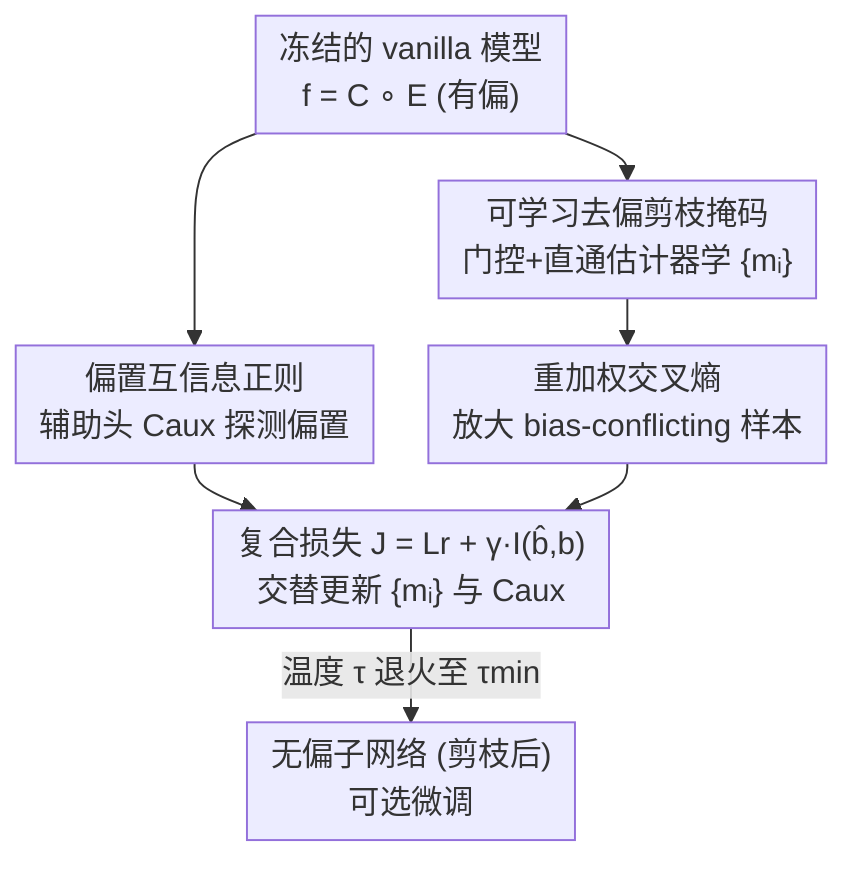

# Bias In, Bias Out? Finding Unbiased Subnetworks in Vanilla Models

**会议**: CVPR 2026  
**论文**: [CVF Open Access](https://openaccess.thecvf.com/content/CVPR2026/html/De_Moura_Matos_Bias_In_Bias_Out_Finding_Unbiased_Subnetworks_in_Vanilla_Models_CVPR_2026_paper.html)  
**代码**: https://github.com/ivanluizmatos/BISE  
**领域**: 模型去偏 / 结构化剪枝  
**关键词**: 算法偏见, 子网络抽取, 结构化剪枝, 互信息正则, 公平性  

## 一句话总结
BISE 提出：一个在偏置数据上常规训练（vanilla）出来的有偏模型里，其实**已经藏着一个相对无偏的子网络**——只要冻结原参数、学一组结构化剪枝掩码，配合「重加权交叉熵 + 偏置互信息正则」把依赖捷径特征的神经元剪掉，就能在不重训、不需要额外无偏数据集的前提下抽出这个子网络，性能与 SOTA 去偏方法持平、再微调可反超，同时模型更小更快。

## 研究背景与动机
**领域现状**：深度模型靠从数据里学统计规律取胜，但当训练集存在「捷径」（shortcut）——例如人脸识别里的光照、背景色这类与标签强相关但无因果关系的伪特征——模型会偷懒去依赖这些伪特征，导致**算法偏见**。学界把符合伪相关的样本叫 bias-aligned（占训练集多数），不符合的叫 bias-conflicting（稀缺）。

**现有痛点**：主流去偏方法分两类。**数据中心**（重采样、过采样、bias-conflicting 增广）需要能往数据分布里注入/剔除特定样本，但 bias-conflicting 样本本就稀缺，难以平衡；**模型中心**（对抗去偏、公平约束、解耦表征）几乎都要把整个模型**从头重训**，大规模部署时代价高、甚至不可行。两类方法都把偏见当成「外部需要额外训练信号去清除的杂质」。

**核心矛盾**：它们都默认「干净模型必须靠额外训练或额外数据造出来」，却没人去问一个反直觉的问题——一个有偏模型内部，是不是**本来就含有一块无偏的表征**，只是被那些依赖捷径的神经元淹没了？已有工作（FFW [66]）证明无偏子网络在原理上存在，但它依赖原数据集的**无偏变体**来挖，现实里拿不到这种无偏数据集。

**本文目标**：在 (i) 不动原模型任何参数、(ii) 只用原始有偏训练集、不借助任何无偏数据集 的双重约束下，把藏在 vanilla 模型里的无偏子网络挖出来。

**切入角度**：把「去偏」重新表述成「**结构化剪枝**」——既然偏见来自一部分过度依赖伪特征的神经元/滤波器，那只要识别并删掉它们，剩下的子网络自然更少依赖偏置。剪枝顺带还能加速推理，是去偏方法里少见的「越改越小」。

**核心 idea**：冻结原网络，只学一组二值掩码 $M$ 去开关每个神经元；用「放大稀缺 bias-conflicting 样本的重加权损失」保证子网络在无偏分布上不掉点，用「对抗式的偏置互信息正则」逼着掩码把泄露偏置信息的神经元剪掉。

## 方法详解

### 整体框架
BISE（Bias-Invariant Subnetwork Extraction）的输入是一个已经在有偏训练集 $D_{train}$ 上常规训练好的 vanilla 模型 $f = C \circ E$（编码器 $E$ + 分类头 $C$）和该有偏训练集本身；输出是一组结构化剪枝掩码，套上去就得到一个无偏子网络。整个过程中**原模型 $f$ 的参数全程冻结**，只训练两样东西：① 挂在编码器每个神经元输出上的掩码参数 $\{m_i\}$；② 一个临时的辅助偏置分类头 $C_{aux}$。

流程是一个交替优化的循环：先把掩码注入编码器、把 $C_{aux}$ 接到瓶颈层并预训练它学会从特征里读出偏置标签；然后进入主循环，每个 minibatch 上**一边**用复合损失 $J$ 更新掩码（让子网络既会做主任务又难以泄露偏置）、**一边**更新 $C_{aux}$（让它持续保持「能读出偏置」的探针能力，从而给出有效的互信息上界）；每隔 $\upsilon$ 个 epoch 把温度 $\tau$ 退火一次（乘以 $\kappa$）让掩码越来越接近硬二值，直到 $\tau < \tau_{min}$ 停止，返回最终掩码。有无偏验证集时用它挑最优掩码（记为 best），没有就直接用最后一步的掩码（记为 last）。子网络可选地再在 $D_{train}$ 上微调以进一步提升。

### 关键设计

**1. 可学习去偏剪枝掩码：把「挑哪些神经元留下」变成端到端可训的二值开关**

针对「不能动原参数、又要选出无偏子网络」这个核心约束，BISE 把网络拆成 $f = C \circ E$，在编码器每个神经元/滤波器的输出 $h_i$（非线性之后）上挂一个掩码参数 $m_i$，做结构化剪枝（删的是整个神经元/滤波器/通道，因此能直接在普通硬件上加速，不需要专用稀疏硬件）。门控写成：

$$\hat{h}_i = h_i \cdot \mathbb{1}\{\hat{m}_i \ge 0.5\}, \quad \hat{m}_i = \sigma\!\left(\frac{m_i}{\tau}\right)$$

其中 $m_i$ 初始化为 0、可训练，$\tau > 0$ 是温度，训练中退火趋零。$m_i \ge 0$ 保留、$m_i < 0$ 剪掉；温度 $\tau$ 越小，sigmoid 越陡，掩码越接近硬二值、对「留/剪」的判断越自信。难点在于指示函数 $\mathbb{1}\{\cdot\}$ 的导数几乎处处为 0、原点处未定义，没法直接反传，BISE 用**直通估计器（straight-through estimator）**绕过：前向走硬阈值、反向把梯度直接透传给连续的 $m_i$，从而能用 SGD 端到端学这组掩码。被训练的 $m_i$ 只占原模型权重的一小部分，所以整套抽取很轻。

**2. 重加权交叉熵：放大稀缺 bias-conflicting 样本，防止子网络又学回捷径**

如果直接拿原始交叉熵 $L_{CE}(\hat{y}, y)$ 在有偏的 $D_{train}$ 上优化掩码，由于 bias-aligned 样本占压倒性多数，优化器会被带着选出一个「在 $D_{train}$ 上表现好、但在无偏测试集上照样烂」的子网络——等于白去偏。BISE 把它换成按组重加权的版本 $L_r$，给每个 $(y,b)$ 组一个与其规模成反比的权重，把稀缺的 bias-conflicting 样本的贡献放大：

$$L_r(\hat{y}, y) = \frac{1}{N}\sum_{j=1}^{N} \ell(\hat{y}_j, y_j)\cdot r_j$$

其中 bias-aligned 样本 $r_j = \frac{1}{C\rho}$，否则 $r_j = \frac{C-1}{C(1-\rho)}$；$\rho$ 是训练集中 bias-aligned 样本的比例，$C$ 是目标/偏置类别数。权重设计基于两条假设：某集合上的权重之和应等于其基数；若数据集本就无偏则所有权重应相等。这样掩码的「主任务损失」实际是在一个被还原成近似平衡的分布上算的，逼着子网络把准确率建立在因果特征而非捷径上。消融里这一项是无偏场景能拿高分的决定性因素。

**3. 偏置互信息正则：用对抗式辅助头把「泄露偏置信息」的神经元逼出来剪掉**

只靠重加权还不够主动「擦除」偏置。BISE 借鉴隐私保护的思路：在瓶颈层（$E$ 的输出 $\hat{z}$）上额外挂一个与 $C$ 同尺寸的辅助分类头 $C_{aux}$，专门训练它从特征里预测偏置标签 $b$。若 $C_{aux}$ 是完美分类器，则预测偏置与真偏置的互信息 $I(\hat{B}, B)$ 就是「主分类器 $C$ 能利用的偏置信息量」的一个**上界**，即 $I(\hat{B}, B) \ge I(\hat{Y}, B)$。于是把复合损失更新成：

$$J(\hat{y}, y, \hat{b}, b) = L_r(\hat{y}, y) + \gamma\, I(\hat{b}, b)$$

掩码 $\{m_i\}$ 去**最小化** $J$（既要主任务准、又要让偏置信息尽量挤不出瓶颈），同时 $C_{aux}$ 持续**最小化** $L_{CE}(\hat{b}, b)$ 去**最大化**自己的探测能力——这构成一个对抗式的极小极大博弈：探针越努力读偏置、掩码越被迫剪掉那些泄露偏置的神经元。$\gamma$ 控制正则强度。消融表明这一项主要贡献**稀疏度**（更好地正则化瓶颈、减少偏置特征残留）；但 $\gamma$ 过大时 $I(\hat{b},b)$ 会压过 $L_r$，逼出一个「对 $b$ 极度不变但主任务也做不好」的子网络，所以需要适中取值（实验取 $\gamma=1$）。

### 损失函数 / 训练策略
最终目标是复合损失 $J = L_r(\hat{y}, y) + \gamma I(\hat{b}, b)$，掩码与 $C_{aux}$ 交替优化（Algorithm 1）。掩码用 SGD（lr $10^{-2}$、momentum 0.9、weight decay $10^{-4}$）；$C_{aux}$ 用 SGD（lr 0.1），预训练 $E=50$ epoch；温度每 $\upsilon=10$ epoch 乘 $\kappa=0.5$，到 $\tau_{min}=10^{-3}$ 停止；$\gamma=1$。互信息项 $I(\hat{y},b)$ 只在 bias-conflicting 样本上算（bias-aligned 样本里 $y,b$ 高度相关，算上去会让该项虚高）。可选的微调阶段用重加权损失 $L_r$ 在 $D_{train}$ 上继续训子网络，且不改变子网络尺寸。

## 实验关键数据

### 主实验
在 5 个去偏基准上评测：BiasedMNIST、Corrupted-CIFAR10、CelebA、Multi-Color MNIST（多偏置）、CivilComments（文本/BERT）。核心结论：BISE 抽出的子网络「拿来即用」就普遍超过 vanilla 模型，且与 SOTA 去偏方法竞争；再微调常能反超；同时模型更稀疏、FLOPs 更低。

BiasedMNIST 主任务准确率（不同 bias-aligned 比例 $\rho$）：

| 方法 | ρ=0.99 | ρ=0.995 | ρ=0.997 |
|------|--------|---------|---------|
| Vanilla | 88.9 | 75.1 | 66.1 |
| LfF | 95.1 | 90.3 | 63.7 |
| SoftCon | 95.2 | 93.1 | 88.6 |
| BCon+BBal | 98.1 | 97.7 | **97.3** |
| **BISE** | 96.1 | 92.2 | 90.8 |
| **BISE + 微调** | **98.1** | 96.3 | 95.9 |

注：除 BISE 外的方法推理复杂度与 vanilla 相同（不剪参数）；BISE 在 ρ=0.997 时把稀疏度提到 35.0%、MFLOPs 从 415.4 降到 269.6，**越极端偏置反而剪得越多**。CelebA 上 BISE 89.7 / 微调 91.8（vanilla 仅 76.5），稀疏度约 67.6%、FLOPs 近乎砍半（1818.6 → 821.5 MFLOPs）。CivilComments 上 BISE 的 WGA 80.4，与 Group DRO 持平并居 SOTA，微调后 81.0。

跨数据集的稀疏度/加速（节选）：

| 数据集 | 稀疏度 S(%) | FLOPs 变化 |
|--------|-------------|------------|
| BiasedMNIST (ρ=0.997) | 35.0 | 415.4 → 269.6 MFLOPs |
| Corrupted-CIFAR10 (ρ=0.99) | 92.2 | 37.1 → 15.7 MFLOPs |
| CelebA | ~67.6 | 1818.6 → 821.5 MFLOPs |

值得一提的是 Multi-Color MNIST（多偏置）上，BISE 的无偏平均准确率（60.3，微调后 70.6）甚至高于 **FFW**（36.37）——而 FFW 是**用了无偏数据集**来去偏的，BISE 只用有偏训练集就反超，直接回应了「不需要无偏数据集」这一卖点。

### 消融实验
在 BiasedMNIST（ρ=0.99）上拆解复合损失 $J$ 的两个组件：

| 重加权 $L_{CE}$ | 互信息 $I(\hat{b},b)$ | Acc.(%) | 稀疏度 S(%) | MFLOPs |
|:---:|:---:|------|------|------|
| - | - | 91.9 | 5.8 | 390.9 |
| ✓ | - | 96.0 | 18.5 | 338.2 |
| - | ✓ | 91.1 | 18.7 | 337.3 |
| ✓ | ✓ | **96.1** | **20.9** | **328.3** |

### 关键发现
- **重加权决定准确率，互信息决定稀疏度**：去掉重加权（仅互信息）准确率从 96.1 掉到 91.1，几乎回到无去偏水平；去掉互信息（仅重加权）准确率仍有 96.0 但稀疏度从 20.9% 降到 18.5%——两项分工明确，重加权管「不掉点」、互信息管「多剪枝/擦偏置」。
- **γ 不是越大越好**：γ=0 仍能找到无偏子网络但更稠密；γ 无节制增大时，互信息项压过主任务损失，准确率反而下降。
- **学出来的掩码优于随机/幅度剪枝**：作者对比了基于 L2 范数的幅度剪枝和随机剪枝，BISE 的端到端掩码在去偏上更有效（Fig. 3b），说明「剪哪些神经元」本身需要被偏置信号引导，而非靠通用重要性准则。
- **偏置越强收益越明显**：ρ 越高（伪相关越极端）vanilla 掉得越狠，而 BISE 相对提升越大、剪得也越多。

## 亮点与洞察
- **范式转变：去偏 = 在已有模型里「做减法」而非「做加法」**。绝大多数去偏方法都在加东西（加数据、加损失、重训），BISE 反过来论证「无偏表征本就存在于有偏模型内部」，只需结构化剪枝把依赖捷径的神经元删掉——这是个很反直觉但被实验支持的视角。
- **去偏与压缩一举两得**。别的去偏方法推理成本和 vanilla 一样，BISE 是唯一「越去偏、模型越小越快」的，CelebA 上 FLOPs 近乎砍半还涨点，对实际部署很友好。
- **用「隐私上界」做去偏**的迁移很巧：把 $C_{aux}$ 的偏置预测互信息当作主分类器可利用偏置信息的上界，再去最小化它，把隐私保护里的思路干净地搬到了公平性场景；这套「辅助探针 + 极小极大」可迁移到任何「想擦掉表征里某种属性」的任务。
- **直通估计器 + 温度退火**让二值掩码端到端可学，是抽取离散子结构的通用配方，可复用于其他「学结构」问题。

## 局限与展望
- **受限于「子网络必须已存在于稠密网络内」**：BISE 不更新原参数，所以无法达到「重训原参数」那种灵活度与粒度——如果一个偏置模型内部根本不存在足够好的无偏子网络（例如偏置已深度耦合进所有神经元），BISE 就无能为力，这时只能靠微调补救。
- **依赖偏置标签 $b$**：方法假设训练时已知每个样本的偏置标签来训 $C_{aux}$ 与做重加权，现实中偏置属性常常未知或难标注，这限制了其在「偏置未知」场景的直接适用。⚠️ 论文未在「无偏置标签」设定下评测。
- **bias-conflicting 极稀缺时重加权可能不稳**：$r_j$ 依赖准确的 $\rho$，且把极少数 conflicting 样本权重放得很大，可能引入方差（实验里 Corrupted-CIFAR10 的 std 确实较大，如 ρ=0.99 时 ±11.42）。
- **C=|Y|=|B| 的简化假设**：沿用文献设定假设目标类数与偏置类数相等，更一般的非对称/连续偏置场景未充分讨论。

## 相关工作与启发
- **vs FFW [66]**：同样是「找无偏子网络」，但 FFW 需要原数据集的**无偏变体**来驱动剪枝，现实拿不到；BISE 只用有偏训练集 + 重加权 + 互信息正则就把子网络挖出来，Multi-Color MNIST 上无偏准确率反超 FFW（60.3 vs 36.37），是本文最直接的差异化优势。
- **vs 对抗去偏 / 公平约束（LNL、EnD、Group DRO 等）**：这些 in-processing 方法把整个模型重训，BISE 冻结原参数只学掩码，吸收了它们的损失平衡与对抗思想（$C_{aux}$ 即对抗式探针），但代价从「重训全模型」降到「训一小撮掩码参数」，且产出更小的模型。
- **vs 去偏蒸馏（SimKD、DeTT 等）**：蒸馏要预先定义一个更小的学生网络结构，BISE 不需要预设结构——子网络结构由掩码自动涌现，本质是「在原网络拓扑内自动做架构搜索式的剪枝」。
- **vs 通用剪枝/公平剪枝**：以往剪枝研究多希望「保持或略升」原模型性能，且发现剪枝常**加剧**对弱势类/分布偏移的敏感；BISE 反其道而行，**主动让剪枝后的子网络偏离有偏的原网络行为**，把剪枝从「压缩工具」重新定位成「去偏工具」。

## 评分
- 新颖性: ⭐⭐⭐⭐⭐ 「有偏模型里本就藏着无偏子网络、只用有偏数据就能挖出」是反直觉且被验证的范式转变，且把去偏与压缩统一。
- 实验充分度: ⭐⭐⭐⭐ 覆盖 5 个基准含文本/多偏置，主结果+稀疏度+消融+敏感性齐全；但部分结果方差偏大、且未在偏置标签未知设定下评测。
- 写作质量: ⭐⭐⭐⭐ 动机层层递进、方法与损失推导清晰；算法与图示到位，公式记号略多。
- 价值: ⭐⭐⭐⭐⭐ 去偏方法里少有的「越改越小越快」，对受 EU AI Act 等合规约束的实际部署很有吸引力。

<!-- RELATED:START -->

## 相关论文

- [\[CVPR 2026\] Bias at the End of the Score](bias_at_the_end_of_the_score.md)
- [\[CVPR 2026\] Rank-Guided Pseudo-Bias Learning for Robust Black-Box Adaptation](rank-guided_pseudo-bias_learning_for_robust_black-box_adaptation.md)
- [\[ACL 2025\] Causal Estimation of Tokenisation Bias](../../ACL2025/others/causal_tokenisation_bias.md)
- [\[ECCV 2024\] Rethinking Data Bias: Dataset Copyright Protection via Embedding Class-Wise Hidden Bias](../../ECCV2024/others/rethinking_data_bias_dataset_copyright_protection_via_embedding_class-wise_hidde.md)
- [\[ICML 2026\] DISCO: Mitigating Bias in Deep Learning with Conditional Distance Correlation](../../ICML2026/others/disco_mitigating_bias_in_deep_learning_with_conditional_distance_correlation.md)

<!-- RELATED:END -->
