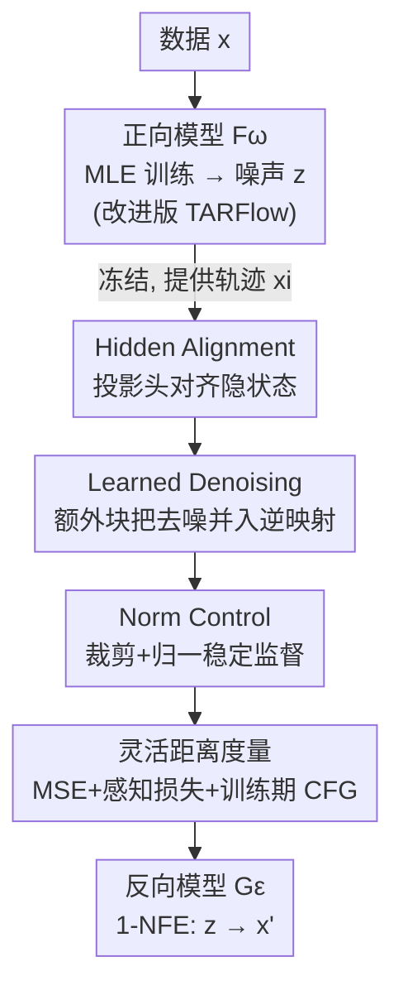

# Bidirectional Normalizing Flow: From Data to Noise and Back

**会议**: CVPR 2026  
**论文**: [CVF Open Access](https://openaccess.thecvf.com/content/CVPR2026/html/Lu_Bidirectional_Normalizing_Flow_From_Data_to_Noise_and_Back_CVPR_2026_paper.html)  
**代码**: 论文未给出链接（MIT / Kaiming He 团队，⚠️ 以官方发布为准）  
**领域**: 图像生成 / Normalizing Flow 生成模型  
**关键词**: Normalizing Flow, 学习逆映射, 隐状态对齐, 1-NFE 生成, ImageNet  

## 一句话总结
BiFlow 把标准 Normalizing Flow 里"反向过程必须是正向过程精确解析逆"的硬约束拆掉，改成单独训练一个反向模型去**近似**逆映射（用隐状态对齐做监督），从而让反向模型可以是双向注意力 Transformer，一次前向（1-NFE）就生成图像，在 ImageNet 256×256 上以 133M 的小模型拿到 FID 2.39，比同源的自回归 TARFlow 既更好又快上两个数量级。

## 研究背景与动机
**领域现状**：Normalizing Flow（NF）是一类有原则的生成模型，由正向过程（数据 → 噪声）和反向过程（噪声 → 数据）组成。它和 Flow Matching / 扩散这类连续时间模型的关键区别在于：NF 的数据-噪声轨迹是**学出来的**，而不是用时间调度预先规定的——这被认为是 NF 的优势。最近 TARFlow / STARFlow 把 Transformer 和自回归流（autoregressive flow）塞进 NF，大幅缩小了 NF 与现代生成模型的质量差距。

**现有痛点**：但 NF 的这套"学习轨迹"优势是有代价的。为了让变量替换公式里的 Jacobian 行列式可计算、可微，正向过程必须**显式可逆**，这严重限制了能用的架构（很难直接用 U-Net 或标准 ViT）。TARFlow 为了维持可计算的行列式，把正向过程拆成上千步的自回归链（如 8 个 block × 256 token = 2048 步），于是它的"精确解析逆"在推理时必须**逐 token 串行解码**，难以并行——既慢，又把"只能因果注意力、不能前馈"的架构约束一并带到了推理阶段。此外 TARFlow 还要额外做一步 score-based 去噪，几乎让推理成本翻倍。

**核心矛盾**：NF 的"精确解析逆"这个性质，本来是为了让训练时的似然计算成立，但它**只在推理时**才真正被用到（把噪声映回数据）。而为了得到这个解析逆，整个正向架构都被绑死。也就是说：训练需要的"可逆"，和推理需要的"逆映射"，被错误地耦合成了同一个东西。

**本文目标**：解耦正向与反向。正向模型只需满足可计算、可学习（继续用改进版 TARFlow），反向模型则单独学一个去**近似**逆映射，不再要求精确可逆。

**核心 idea**：用一个**可学习、近似**的反向模型 $G_\epsilon$ 替代"精确解析逆"。它可以是任意架构（双向注意力 Transformer），用灵活的损失训练，单次前向就把噪声直接映回干净数据。作者发现：这个学出来的逆甚至**比精确解析逆生成质量更好**，因为它直接对齐真实数据分布，而不是去复刻解析逆产生的合成样本。

## 方法详解

### 整体框架
BiFlow 分两阶段训练。第一阶段和经典 NF 一样，用最大似然训练一个正向模型 $F_\omega$（这里是改进版 TARFlow，记为 iTARFlow），把数据映成高斯噪声 $z=F_\omega(x)$；第二阶段**冻结** $F_\omega$，单独训练一个反向模型 $G_\epsilon$ 来近似它的逆。关键在于 $G_\epsilon$ 不受显式可逆约束，可以是前馈、非因果的双向注意力 Transformer，推理时一次前向（1-NFE）把噪声 $z$ 映回干净样本 $x'$。

正向 NF 的训练目标仍是变量替换下的对数似然（$F:=f_{B-1}\circ\cdots\circ f_1\circ f_0$）：

$$\log p(x) = \log p_0(z) + \sum_i \log\left|\det \frac{\partial f_i(x_i)}{\partial x_i}\right|$$

注意：这个 log-det 项只要求 $F$ "可逆"，并**不要求**它有"显式可逆的写法"——显式逆只在推理把噪声映回数据时才需要。BiFlow 正是抓住这个缝隙：训练用正向，推理用单独学的反向，二者解耦。

### 关键设计

**1. Hidden Alignment：用投影头对齐隐状态，让"学逆映射"既有全轨迹监督又不锁死架构**

直接学逆映射有个根本难题：把纯噪声一步映成数据是高度欠约束的，只用一个末端重建损失（Naive Distillation，$\mathcal{L}_{naive}(x)=D(x, x')$，其中 $x'=G_\epsilon(F_\omega(x))$）监督太弱。一个自然的加强方式是 Hidden Distillation：让正向轨迹的每个中间状态 $\{x_i\}$ 监督反向轨迹的对应状态 $\{h_i\}$，即 $\mathcal{L}_{hidden}(x)=\sum_i D(x_i, h_i)$。但这样会逼着反向模型每个中间状态都退回到和输入同维的空间，再升回隐空间，反复投影造成信息损失、限制架构表达力——实验里它反而比 Naive 还差（FID 55.0 vs 43.4）。

BiFlow 的 Hidden Alignment 解法是：保留全轨迹监督，但不再强求中间状态待在输入空间。它给反向模型每层隐状态 $h_i$ 配一个**可学习投影头** $\phi_i$，让投影后的表示去对齐正向状态：

$$\mathcal{L}_{align}(x) = \sum_i D(x_i, \phi_i(h_i))$$

其中 $h_0=x'$、$\phi_0$ 取恒等。这一小改让反向模型既享受逐块的全轨迹监督，又把"表示空间"和"输入 token 空间"解耦，避免反复投影带来的语义畸变。三种策略里它最好（FID 36.93），并明显超过精确解析逆（44.46）。

**2. Learned Denoising：把去噪并进逆映射，省掉一整次前向-反向的 score 计算**

TARFlow 这类 SOTA NF 其实偏离了纯流式建模：训练时喂的是加噪输入 $\tilde{x}=x+\sigma\epsilon$，推理时先生成 $\tilde{x}=F_\omega^{-1}(z)$，再做一步 score-based 去噪 $x\leftarrow\tilde{x}+\sigma^2\nabla_{\tilde{x}}\log p(\tilde{x})$。这步 score 要走一整次前向-反向（约 15.8× flops），几乎让推理成本翻倍。

BiFlow 把去噪直接焊进反向模型：在正向轨迹起点前再补上干净数据 $x$，并给反向模型加一个额外块专门学 $h_0\to x'$ 的去噪，和逆映射联合训练。于是 $G_\epsilon$ 直接学的是噪声 $z$ 到**干净数据 $x$** 的对应（而非加噪的 $\tilde{x}$），单次前向出干净样本。这一个额外块换掉了一整次前向-反向 score 计算；消融里去掉去噪 FID 直接崩到 100.5，换回 score-based 去噪也只有 42.6，而学习式去噪是 31.88（均 w/o CFG）。

**3. Norm Control：压住正向中间状态的范数波动，让 MSE 监督在各 block 间均衡**

NF 公式下正向模型产生的中间状态范数是不受约束的，跨 block 经常剧烈起伏。用 MSE 这类对幅度敏感的损失做对齐监督时，这会导致不同深度的监督强度严重失衡。BiFlow 用两个互补策略：在正向模型上，把每个变换 $f_i$ 的输出参数裁剪到固定区间 $[-c, c]$，限制过度缩放、稳定中间态范数；在反向模型上，对每个中间状态先归一化再做隐对齐，使各深度贡献相当、促进尺度不变学习。消融显示：不做任何 norm control 时 FID 45.54，裁剪策略能拉到 31.88。

**4. 灵活距离度量与训练期 CFG：1-NFE + 显式配对带来的"所见即所得"训练，让感知损失可用**

BiFlow 有两个其他生成范式难有的性质：(i) 1-NFE——反向模型单次前向出样本，生成样本在训练时直接可得；(ii) 显式配对——正向过程天然给出数据 $x$ 与噪声 $z$ 的一一对应，直接当训练对。两者合起来形成"所见即所得"的监督：生成样本立刻能算损失并反传。于是几乎任意距离度量都能用、还能组合。默认用 MSE 对齐中间状态，在 VAE 解码后的图像端再加感知损失（VGG/LPIPS + ConvNeXt V2 特征），各项损失自适应重加权。感知损失对精确解析逆是几乎用不上的，而这里轻松可用——消融里 MSE→+LPIPS→+ConvNeXt 把 FID 从 31.88 一路压到 2.46。

此外，CFG 也被搬到训练阶段：$h_{i+1}=(1+w_i)G^i_\epsilon(h_i\mid c)-w_i\,G^i_\epsilon(h_i)$，并把 CFG 尺度作为条件喂入，让模型在单次前向内就支持一系列 guidance 强度，省掉推理时为 CFG 多做一遍前向的开销。训练期 CFG 相比推理期 CFG 既减半推理成本又把 FID 从 6.90(NFE=2) 改善到 6.79(NFE=1)。

### 损失函数 / 训练策略
两阶段：先 MLE 训正向 $F_\omega$（iTARFlow），再冻结它训反向 $G_\epsilon$。反向目标 = 重建损失 $D(x, x')$ + 各中间状态的 hidden alignment 损失，距离度量默认 MSE，最终配置叠加感知损失（VGG + ConvNeXt），所有损失项自适应重加权；配合 norm control 与训练期 CFG。模型在预训练 VAE 的隐空间上跑（ImageNet 256×256 → 32×32×4 latent），反向骨干是带现代组件的 ViT、patch size 2、序列长 256。

## 实验关键数据

### 主实验
ImageNet 256×256 类条件生成，FID-50K + IS（5 万张）。核心对比是 BiFlow（学习逆）对自家精确解析逆基线 iTARFlow：

| 模型 | NFE | FID ↓ | #参数 | TPU 单图耗时 | 相对 iTARFlow 加速(TPU, 不含VAE) |
|------|-----|-------|-------|--------------|------------------------------|
| BiFlow-B/2 (本文) | 1 | **2.39** | 133M | 0.29+1.3 ms | — |
| iTARFlow-B/2 | 256×2 串行 | 6.83 | 120M | 65+1.3 ms | 224× |
| iTARFlow-XL/2 | 256×2 串行 | 4.54 | 690M | 202+1.3 ms | 697× |

BiFlow-B/2 用 133M 小模型，FID 反而**超过**了 690M 的 iTARFlow-XL/2 精确解析逆（2.39 vs 4.54），同时 1-NFE 对比 256×2 步串行解码，TPU 上同尺寸约 42× 加速、对 XL 可达 697×（不含 VAE）。

与各生成范式横向比（1-NFE 阵营）：

| 方法 | 范式 | NFE | FID ↓ | IS ↑ |
|------|------|-----|-------|------|
| STARFlow-XL/1 | 自回归 NF | 串行 | 2.40 | - |
| **BiFlow-B/2 (本文)** | NF, 1-NFE | 1 | **2.39** | **303.0** |
| StyleGAN-XL | GAN | 1 | 2.30 | 265.1 |
| MeanFlow-XL/2 | 1-NFE flow | 1 | 3.43 | 247.5 |
| iMF-XL/2 | 1-NFE flow | 1 | 1.72 | 282.0 |

BiFlow 在 NF 家族里刷到 SOTA（与 1.4B 的 STARFlow-XL 持平但参数小一个量级），在 1-NFE 生成里也很有竞争力，IS 303.0 居前列（⚠️ 原文表头箭头疑为排版错，FID 越低越好、IS 越高越好，已按惯例标注）。

### 消融实验
反向模型学习策略（BiFlow-B/2, 160 ep, w/o CFG）：

| 策略 | 注意力 | FID ↓ | 相对精确逆 |
|------|--------|-------|-----------|
| 精确解析逆 | 因果 | 44.46 | — |
| Naive Distillation | 双向 | 43.41 | −1.05 |
| Hidden Distillation | 双向 | 55.00 | +10.54（更差） |
| **Hidden Alignment** | 双向 | **36.93** | **−7.53** |

其余关键设计消融（BiFlow-B/2, FID w/o CFG）：

| 维度 | 配置 | FID ↓ | 说明 |
|------|------|-------|------|
| 去噪 | learned denoise | 31.88 | 完整 |
| | no denoise | 100.51 | 崩溃 |
| | score-based denoise | 42.62 | 退回 TARFlow 式 |
| Norm control | clip | 31.88 | 完整 |
| | none | 45.54 | 不控范数 |
| 距离度量 | MSE | 31.88 | 仅 MSE |
| | +LPIPS | 14.15 | 加感知 |
| | +LPIPS+ConvNeXt | 2.46 | 最佳 |

### 关键发现
- **学出来的逆能超过精确解析逆**：核心反直觉点。原因是 $G_\epsilon$ 直接重建真实图像、对齐真实数据分布，而不是去复刻解析逆产出的合成样本；又在冻结正向下端到端优化，学到更稳定全局一致的映射。
- **感知损失是质量飞跃的主力**：距离度量从 MSE 到 +LPIPS+ConvNeXt，FID 从 31.88 暴跌到 2.46，这正是"1-NFE + 显式配对"才解锁的能力。
- **去噪不能省**：去掉去噪 FID 崩到 100.5，说明这步在 TARFlow 系建模里是结构性必需，BiFlow 的贡献是把它做得更便宜更好。
- **scaling 有饱和**：不用 ConvNeXt 感知损失时 B→XL 有明显增益（MSE: 6.79→4.61）；一旦加上 ConvNeXt，继续放大收益递减甚至 FID 回升（2.46→2.57），作者猜测与过拟合有关。

## 亮点与洞察
- **"训练需要可逆 ≠ 推理需要解析逆"的拆解**：抓住 log-det 只需 $F$ 可逆、解析逆只在推理用到这个缝隙，把绑死 NF 架构的根源解开——这是全文最漂亮的观察。
- **隐状态对齐 + 可学习投影头**：在"全轨迹监督"和"架构自由"之间找到第三条路，避开 Hidden Distillation 反复投影的坑，这套"对齐而非强等"的思路可迁移到其他需要逐层蒸馏/对齐的场景。
- **把后处理焊进模型**：score 去噪、CFG 都从"推理时额外一遍前向"挪进训练，换来推理 flops 约 4× 的削减——一个很实用的"把推理成本前移到训练"范式。

## 局限与展望
- **强依赖一个预训练好的正向模型**：BiFlow 是两阶段、正向冻结，反向质量受限于 iTARFlow 的轨迹质量；正向若不够好，逆近似的上限也被压低。
- **scaling 饱和未解**：加 ConvNeXt 感知损失后放大模型收益递减甚至倒退，作者自承可能过拟合，留作 future work；这意味着当前 2.39 的最优配置不一定随规模继续变好。
- **VAE 解码成为新瓶颈**（作者指出）：BiFlow 生成器已极快，VAE 解码（49M、308 Gflops）反而占了大头，端到端加速因此被摊薄（含 VAE 时 TPU 加速从 697× 降到 128×）。
- ⚠️ 代码与完整附录细节（自适应重加权、norm control 超参）在正文外，复现需依赖 Appendix。

## 相关工作与启发
- **vs TARFlow / STARFlow**：同样把 Transformer 引入 NF，但它们坚持"精确解析逆 + 因果自回归解码 + score 去噪"，推理慢且架构受限；BiFlow 复用它们当正向模型，却换成可学习的双向反向模型，质量更好、快两个数量级。
- **vs 蒸馏（distillation）**：BiFlow 用了预训练正向模型，表面像蒸馏，但它不是去复刻教师的合成轨迹，而是直接对真实数据做隐状态对齐重建，因此能**超过**"教师"的精确解析逆——这是它与常规一致性/轨迹蒸馏的本质区别。
- **vs Flow Matching / 扩散**：FM/扩散是预先调度轨迹的连续时间 NF；BiFlow 保留了 NF"学习轨迹"的特性并证明它不必带来推理瓶颈，作者据此呼吁探索两类方法的协同。

## 评分
- 新颖性: ⭐⭐⭐⭐⭐ 把 NF 的"解析逆"硬约束解耦为可学习近似逆，是对经典范式的根本性松绑
- 实验充分度: ⭐⭐⭐⭐ ImageNet 多尺寸 + 三类逆学习策略 + 四组设计消融充分，但仅单数据集、scaling 饱和未深究
- 写作质量: ⭐⭐⭐⭐⭐ 动机层层递进、三种策略对比清晰、反直觉结论有解释
- 价值: ⭐⭐⭐⭐⭐ 让 NF 在 1-NFE 生成里追平 GAN/扩散，并把后处理前移到训练，有很强的范式启发

<!-- RELATED:START -->

## 相关论文

- [\[CVPR 2026\] A Unified Framework for Knowledge Transfer in Bidirectional Model Scaling](a_unified_framework_for_knowledge_transfer_in_bidirectional_model_scaling.md)
- [\[CVPR 2026\] Bidirectional Query-Driven Generation of Parametric CAD Sketch](bidirectional_query-driven_generation_of_parametric_cad_sketch.md)
- [\[ICML 2025\] Learning Distances from Data with Normalizing Flows and Score Matching](../../ICML2025/others/learning_distances_from_data_with_normalizing_flows_and_score_matching.md)
- [\[ICML 2026\] Cascaded Flow Matching for Heterogeneous Tabular Data with Mixed-Type Features](../../ICML2026/others/cascaded_flow_matching_for_heterogeneous_tabular_data_with_mixed-type_features.md)
- [\[CVPR 2026\] Back to Source: Open-Set Continual Test-Time Adaptation via Domain Compensation](back_to_source_open-set_continual_test-time_adaptation_via_domain_compensation.md)

<!-- RELATED:END -->
