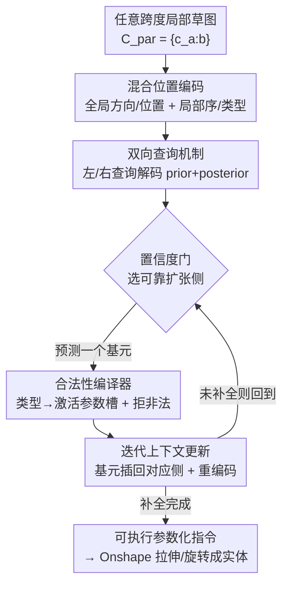

# Bidirectional Query-Driven Generation of Parametric CAD Sketch

**会议**: CVPR 2026  
**论文**: [CVF Open Access](https://openaccess.thecvf.com/content/CVPR2026/html/Liu_Bidirectional_Query-Driven_Generation_of_Parametric_CAD_Sketch_CVPR_2026_paper.html)  
**代码**: 无（未公开）  
**领域**: 参数化CAD草图生成  
**关键词**: 参数化CAD、草图补全、双向查询、置信度引导、混合位置编码  

## 一句话总结
CADSketcher 把参数化 CAD 草图补全从"前缀→续写"的单向自回归改成"任意中间片段→向两侧外扩"的双向查询生成，靠双向查询学习 + 置信度门控 + 合法性编译器，在 SketchGraphs 上把草图级精度从 ~33% 拉到 45.6%、把非法率压到 0。

## 研究背景与动机

**领域现状**：参数化 CAD 草图（2D 蓝图，定义直线/圆/圆弧等基元及其约束）是 3D 建模的起点。学习式 CAD 自动建模主流把草图表示成一串"建模指令 token"，再用自回归 Transformer（如 Vitruvion）从左到右逐个预测基元，或用视觉/多模态线索（CAD-VLM）增强几何推理。

**现有痛点**：这些方法几乎都把草图生成当成"从图像/文本/手绘一次性生成整张草图"的条件生成问题，忽略了真实 CAD 工作流的两个本质特征——**交互增量**与**状态依赖**。一是设计师通常从一段已有的局部几何或粗略意图出发逐步细化，而已观测的局部片段可能落在完整序列的任意位置（arbitrary-span），不止是前缀；二是每加一个基元都会挂接到已有几何上、改变拓扑状态，早期偏差会沿序列向下游传播、把整张草图带偏。

**核心矛盾**：标准自回归架构隐含假设了"固定的、单向的构造顺序"（把当前步当成严格前缀），但现实中草图可能沿多条合理轨迹演化、被反复修正、甚至回头改早期几何。CAD 草图补全更像一个 **out-filling**（从中间状态向两侧外扩，没有标准方向）问题，而不是 NLP 里"在固定上下文之间填空"的 infilling。

**本文目标**：让模型内化 CAD 草图的增量、非线性构造逻辑，从**任意跨度的局部草图**同时推断它**之前和之后**的建模指令，生成可直接在标准 CAD 系统里执行的指令序列。

**核心 idea**：把草图补全重新表述为**查询驱动的双向生成**——用两组可学习的方向查询（prior / posterior）从共享上下文表示里分别探询左右两侧的缺失指令，再在推理时用置信度决定每步往哪侧扩、用合法性编译器保证每个基元可执行。

## 方法详解

### 整体框架
CADSketcher 的输入是任意跨度的局部草图 $C_{par}=\{c_{a:b}\}$（每条指令 $c_i=(\omega_i,\varepsilon_i)$ 由基元类型命令 $\omega_i$ 和几何参数 $\varepsilon_i$ 组成），输出是其余指令 $C_{oth}=C\setminus C_{par}$，使得拼起来是一张几何完整、语义连贯的草图。优化目标是 $C_{oth}^{*}=\arg\max_{C_{oth}} p_\theta(C_{oth}\mid C_{par})$。

整个流程分两个阶段。**阶段一·双向草图学习（训练用）**：把局部草图 token 化、叠加混合位置编码，过一个 4 层 Transformer 编码器 $E$ 得到局部草图特征 $f_{par}$（作为维持几何/结构一致性的语义锚点）；再把可学习的左/右查询拼到 token 序列后面，喂进 8 层带 cross-attention 的解码器 $D$，同时解码 prior 和 posterior 上下文。**阶段二·置信度引导补全（推理用）**：每步用"选择—预测—更新"循环，先用置信度门选出更可靠的扩张方向，预测下一个基元，再把它插回局部上下文的对应一侧、刷新状态，直到草图补全。

### 关键设计

**1. 双向查询机制：把"前缀续写"改成"中间向两侧外扩"**

这是针对"局部片段可能落在序列任意位置、缺失指令分布在两侧"的痛点。作者不再用 next-token 单向预测，而是把补全建模成 $p_\theta(C_{oth}\mid C_{par})=\prod_{t=1}^{T} p_\theta(c_t\mid S_t, Q_d)$，其中 $S_t=C_{par}\cup C_{<t}$ 是当前状态，$Q_d\in\{Q_{prior},Q_{post}\}$ 指定相对 $C_{par}$ 的查询方向，$T$ 是直到草图重建完成才停的自适应步长。$Q_{prior}$ 和 $Q_{post}$ 是两组**可学习查询嵌入**（各 256 维），分别拼到 token 化局部草图后面形成方向专属查询序列，交给解码器在 $f_{par}$ 引导下逐步还原。

为了让"逐步外扩"这种天然串行的查询能并行训练，作者还做了**并行上下文学习**：把指令序列拆成锚定在局部上下文的左右两条独立分支，右（posterior）支保持原始基元顺序、左（prior）支在**基元级别翻转**（不打乱基元内 token 顺序），各自尾部追加等量查询嵌入，再用专门的注意力掩码和 padding 掩码限制"每个查询只能看到它合法的上下文区域"（第一个查询只看 $C_{par}$，第二个多看一个 token）。这样既能并行高效推理，又能联合建模左右上下文、避免方向漂移和分布差异。

**2. 混合位置编码：让任意跨度片段也有稳定的位置先验**

痛点在于：前缀补全可以直接用绝对位置索引对齐序列，但 arbitrary-span 场景下观测片段可以出现在任意位置，难以刻画 prior 与 posterior 之间的逻辑依赖。作者把位置编码解耦成全局和局部两层：全局层有方向编码 $E^{dir}_{global}$（标记基元属于 prior 还是 posterior 跨度）和相对位置编码 $E^{pos}_{global}$（相对中心边界的偏移量）；局部层有槽序编码 $E^{ord}_{local}$（基元内 token 顺序）和类型编码 $E^{type}_{local}$（几何角色）。最终编码为

$$E_{pos}=w_{dir}E^{dir}_{global}+w_{pos}E^{pos}_{global}+w_{ord}E^{ord}_{local}+w_{type}E^{type}_{local}$$

其中 $w_{dir},w_{pos},w_{ord},w_{type}$ 是可学习的权重系数，用来平衡各分量贡献。这套编码把"全局建模进度"和"局部基元语义"同时灌进表示，为鲁棒的任意跨度补全提供稳定位置先验——消融里去掉它（w/o HyPE）草图级精度从 45.6% 掉到 42.6%。

**3. 置信度门 + 合法性编译器：每步选可靠方向、保证基元可执行**

针对"随机或固定方向忽略了两侧不对称、演化的状态，容易走进次优轨迹累积几何误差"的痛点。作者把推理写成迭代的选择—预测—更新循环：选择 $d_t\sim\pi_\theta(d\mid S_t),\ d\in\{prior,post\}$；预测 $c_t\sim p_\theta(c\mid S_t,Q_d)$；更新 $S_{t+1}=U(S_t,c_t)$。其中**置信度门**在每步同时估计左右两侧 type token 的预测概率，用温度控制选出确定性更高的扩张侧，避免盲目探入不确定/低似然区域。**合法性编译器**则利用 CAD 指令的强参数约束：一旦预测出类型命令，就只激活它对应的参数槽、拒绝不兼容的预测，保证每个基元满足构造规则和几何可解性。两者配合既把生成导向可靠路径、又强制几何合法，把非法率压到 0（w/o ValComp 时会出现非法案例、IR 升到 0.03）。

**4. 迭代局部上下文更新：跟住不断演化的草图状态**

由于草图补全是状态驱动的、每条新指令都会改几何重塑上下文，模型必须持续与演化状态同步。不同于标准自回归只在尾部追加 token，这里**每个新生成的基元按所选扩张方向插回上下文的对应一侧**，更新后的序列用混合位置编码重新编码、再过编码器得到刷新后的上下文特征，查询边界也重新对齐到最新的局部锚点以保持一致条件。这种迭代式上下文刷新让解码忠实跟随设计轨迹，避免静态上下文假设带来的漂移——去掉它（w/o CtxUpdate）草图级精度掉到 35.7%，是消融里掉点第二多的模块。

### 损失函数 / 训练策略
用序列级损失 $L_{seq}$ 监督双向草图学习，对离散化指令 token 做逐位置交叉熵，并用指示函数屏蔽掉属于局部上下文的基元，只让生成的基元参与 loss：

$$L_{seq}=-\sum_{i=1}^{T}\mathbb{1}[c_i\notin C_{par}]\log p_\theta(\hat{c}_i=c_i\mid S_i,Q_d)$$

编码器 4 层、解码器 8 层（带 cross-attention），8 头、FFN 隐层 1024、dropout 0.2；AdamW（初始 lr $1\times10^{-4}$）+ ExponentialLR，batch 256、200 epoch，4×A100 训练约 48 小时。

## 实验关键数据

数据集：SketchGraphs（约 693k 训练 / 各 38.5k 验证测试，参数 6-bit 量化），并在 CAD as a Language 上做跨数据集评测。基线含 Vitruvion（自回归）、CAD-VLM（跨模态）、DeepCAD（隐式 latent）以及两个为任意跨度补全定制的 Dual-AR、Dec-Only。

### 主实验：部分→完整补全 & 早期扩张
保留每个序列连续 50–80% 基元作为局部上下文做"部分→完整补全"；保留 20–50% 做"早期扩张"（温度 0.9）。

| 任务 | 指标 | 本文 | 最强基线 | 说明 |
|------|------|------|----------|------|
| 部分→完整 | ACC_skt ↑ | **45.6** | 33.5 (Dual-AR) | 草图级精度 |
| 部分→完整 | F1 ↑ | **59.2** | 48.8 (Dual-AR) | 重建完整度 |
| 部分→完整 | IR ↓ | **0** | 0.03 (CAD-VLM) | 非法率 |
| 早期扩张 | COV ↑ | **77.0** | 75.9 (Vitruvion) | 覆盖度 |
| 早期扩张 | JSD ↓ | **0.89** | 1.87 (CAD-VLM) | 分布散度（×10⁻²） |
| 早期扩张 | Unique ↑ | **84.9** | 80.3 (CAD-VLM) | 多样性 |

部分→完整补全上 token/基元/草图三级精度、F1 全面领先、IR 最低；早期扩张上 COV/MMD/JSD/Unique 都更好且 IR 仅 0.21%，说明它既能可靠补全又能支持早期多样化构思。跨数据集（CAD as a Language）上 ACC_skt 14.1 vs 次优 7.96、IR 0.02，验证了分布偏移下的鲁棒性。补全结果还在 Onshape 里经拉伸/旋转生成了拓扑合法的实体。

### 消融实验
| 配置 | ACC_skt | F1 | IR | 说明 |
|------|---------|-----|-----|------|
| Full Model | 45.6 | 59.2 | 0 | 完整模型 |
| w/o BiQuery | 33.7 | 48.6 | 0 | 退化成双头自回归，掉最多 |
| w/o HyPE | 42.6 | 57.0 | 0 | 只剩全局相对位置编码 |
| w/o ConfGate | 37.8 | 51.5 | 0 | 固定右优先方向 |
| w/o ValComp | 38.5 | 52.8 | 0.03 | 关掉约束 → 出现非法 |
| w/o CtxUpdate | 35.7 | 50.9 | 0 | 不刷新状态 |

### 关键发现
- **双向查询贡献最大**：去掉后 ACC_skt 从 45.6 掉到 33.7（-11.9），退化成两个独立头的自回归，全局约束和语义连续性同时被破坏。
- **上下文更新次重要**：w/o CtxUpdate 掉到 35.7，印证"状态依赖"假设——不刷新状态就会因静态上下文漂移。
- **合法性编译器是非法率唯一来源**：只有去掉它 IR 才非零（0.03），其余配置 IR 都是 0，说明它专管几何可执行性而非精度。
- **置信度门换来约 8 个点**：固定方向（w/o ConfGate）ACC_skt 37.8，说明"每步选可靠侧"对抑制误差累积确实有效。

## 亮点与洞察
- **把 CAD 草图补全重新定义为 out-filling**：明确区分于 NLP 的 infilling（固定上下文间填空），指出草图是"从中间向两侧无标准方向外扩"，这个 framing 本身就把单向自回归的不适配讲透了。
- **可学习查询嵌入 + 基元级翻转左支**：用一组方向查询统一表达"往左/往右补"，再靠基元级翻转把双向问题摊平成两条可并行的单向流，是把双向生成做高效的关键 trick。
- **置信度门让模型"挑软柿子先捏"**：每步比较两侧 type token 确定性、先扩更确定的一侧，本质是把"哪侧更好预测就先定哪侧"变成显式策略，可迁移到任何两端外扩的结构化序列生成。
- **合法性编译器把领域约束硬编码进解码**：类型确定后只激活对应参数槽、拒非法预测，直接把 IR 干到 0，比起事后过滤更省事。

## 局限与展望
- 作者承认：当前方法**不显式建模几何约束**（因为 CAD 工作流里草图绘制和约束指定通常解耦），生成的草图缺少显式约束关系。
- 数据多样性有限，支持的建模基元只覆盖最常用的直线/圆弧/圆三类，虽然框架可扩展到更多指令类型但尚未验证。
- 自己发现的局限：评测主要在 SketchGraphs 这类相对规整的工程草图上，对高度自由曲线/样条等更复杂基元、以及真实人工设计中频繁的"回头改早期几何"行为，是否仍稳定未充分展示；置信度门的温度、各位置编码权重等超参的敏感性正文未给。
- 改进思路：把几何约束（平行、对称、等距）作为额外监督或解码期约束注入，或许能进一步降低视觉上的几何畸变。

## 相关工作与启发
- **vs Vitruvion（自回归基线）**: 它用标准从左到右 next-token 预测、隐含固定单向构造顺序；本文用双向查询从任意跨度向两侧外扩，ACC_skt 45.6 vs 2.11，差距主要来自 framing（前缀续写 vs 中间外扩）。
- **vs CAD-VLM（跨模态）**: 它靠视觉-符号融合增强几何推理；本文不引入视觉模态，纯靠双向查询 + 混合位置编码 + 置信度引导，在补全和扩张两个任务上都更好且 IR 更低。
- **vs Dual-AR（定制双分支自回归）**: 它用两条独立解码流分别扩左右上下文；本文共享上下文表示 + 并行掩码联合建模两侧，避免了独立分支的方向漂移与分布差异，ACC_skt 45.6 vs 33.5。

## 评分
- 新颖性: ⭐⭐⭐⭐⭐ 把 CAD 草图补全 reframe 成 out-filling 并用双向查询解，切入角度新且贴合真实交互工作流。
- 实验充分度: ⭐⭐⭐⭐ 双任务 + 跨数据集 + 五模块消融 + CAD 平台落地齐全，缺超参敏感性与更复杂基元验证。
- 写作质量: ⭐⭐⭐⭐ 动机推导清晰、公式到位，模块命名一致；部分实现细节压在附录。
- 价值: ⭐⭐⭐⭐ 可直接接入标准 CAD 系统生成可执行指令，对交互式参数化设计自动化有实用价值。

<!-- RELATED:START -->

## 相关论文

- [\[CVPR 2026\] CAD-Refiner: A Unified Framework for CAD Generation and Iterative Editing](cad-refiner_a_unified_framework_for_cad_generation_and_iterative_editing.md)
- [\[CVPR 2026\] Bidirectional Normalizing Flow: From Data to Noise and Back](bidirectional_normalizing_flow_from_data_to_noise_and_back.md)
- [\[CVPR 2026\] Convolutional Neural Networks Driven by Content Similarity](convolutional_neural_networks_driven_by_content_similarity.md)
- [\[CVPR 2026\] A Unified Framework for Knowledge Transfer in Bidirectional Model Scaling](a_unified_framework_for_knowledge_transfer_in_bidirectional_model_scaling.md)
- [\[CVPR 2026\] EXOTIC: External Vision-driven Incomplete Multi-view Classification](exotic_external_vision-driven_incomplete_multi-view_classification.md)

<!-- RELATED:END -->
