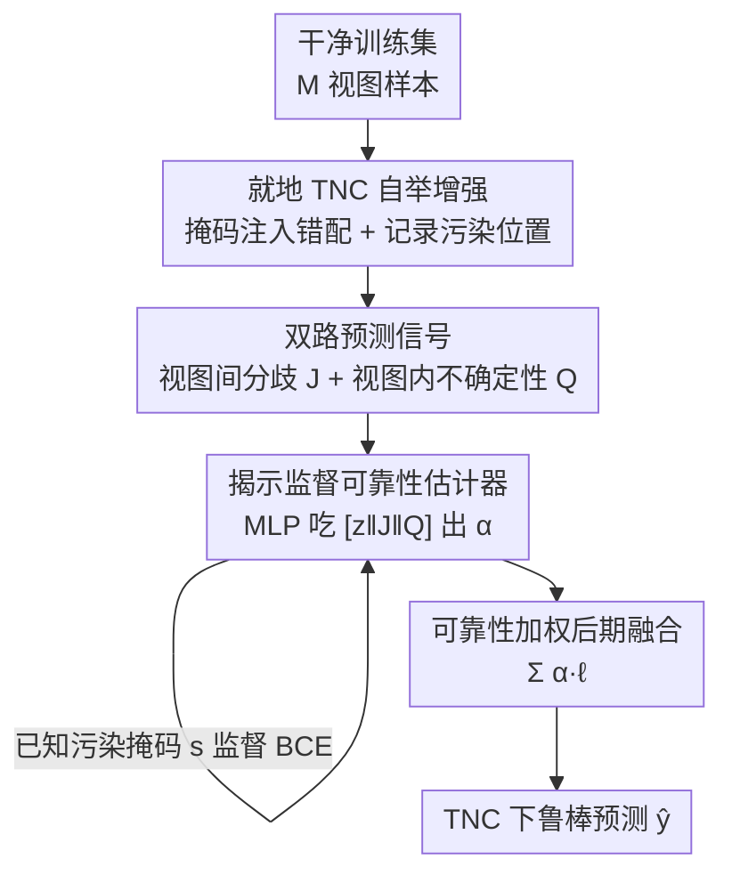

# Bootstrapping Multi-view Learning for Test-time Noisy Correspondence

**会议**: CVPR 2026  
**论文**: [CVF Open Access](https://openaccess.thecvf.com/content/CVPR2026/html/He_Bootstrapping_Multi-view_Learning_for_Test-time_Noisy_Correspondence_CVPR_2026_paper.html)  
**代码**: https://github.com/XLearning-SCU/2026-CVPR-BML  
**领域**: 多视图学习 / 可信融合  
**关键词**: 测试时噪声对应, 多视图融合, 可靠性估计, 自举增强, 揭示监督

## 一句话总结
针对部署时才出现的"视图错配"（Test-time Noisy Correspondence, TNC），BML 在干净训练集上**就地自举注入可控错配并记录被污染的视图**，用这份已知答案监督一个轻量可靠性估计器（同时吃视图内不确定性 + 视图间预测分歧），推理时直接用估计的可靠性权重加权融合压制坏视图，在 11 个基准上稳定超过现有 SOTA。

## 研究背景与动机
**领域现状**：多视图/多模态学习靠融合互补视图（RGB、深度、文本等）提升感知与决策。一类"可信融合"方法（TMC、ECML、FUML 等）会给每个视图估一个可靠性/不确定性权重，融合时给可疑视图降权。

**现有痛点**：现实部署里，传感器异步采样、瞬时网络拥塞等会让**推理时**某些视图与真实标签不再对应——作者把这种现象正式定义为 **Test-time Noisy Correspondence (TNC)**。而现有方法的可靠性权重几乎全是**在干净、对齐良好的训练集上学的**，然后硬套到推理时的噪声输入上。

**核心矛盾**：这里存在一个被忽视的 **train-test 任务鸿沟**——训练阶段模型从没见过错配样本，估出来的可靠性是"盲估"，在 TNC 下往往过度自信、标定失准；而且这些方法多是**无监督**地间接推断不确定性，没有任何"这个视图到底是不是坏的"的直接监督信号。

**本文目标**：在不引入任何额外数据/标注的前提下，让模型显式地"学会在 TNC 下融合"——既要在测试集真实分布上训练可靠性估计器，又要给它明确的监督信号。

**切入角度**：错配既然是"把视图 m 换成了别的样本的视图 m"，那它在训练时是**可以人为制造并且自己知道答案的**。于是作者从"数据"和"模型"两端同时下手：数据端就地造可控错配、模型端用"已知被污染位置"当监督。

**核心 idea**：用 **reveal-supervised（揭示监督）** 范式替代无监督不确定性——自举生成带 TNC 的增强集、把人为注入的噪声位置作为监督标签，直接训练一个轻量可靠性估计器。

## 方法详解

### 整体框架
BML 是一个即插即用的后期融合框架。设 $M$ 视图分类任务，每个视图 $m$ 经过编码器-分类器 $[f(\cdot;\theta_m), g(\cdot;\phi_m)]$ 得到特征 $z_i^{(m)}$、logits $\ell_i^{(m)}$ 和预测分布 $p_i^{(m)}=\mathrm{softmax}(\ell_i^{(m)})$。最终融合是**视图自适应的加权求和**：

$$\bar{\ell}_i=\sum_{m=1}^{M}\alpha_i^{(m)}\ell_i^{(m)},\qquad \bar{y}_i=\arg\max_{c}\bar{\ell}_{i,c}$$

整个方法的关键就是怎么得到每个视图的可靠性权重 $\alpha_i^{(m)}\in(0,1)$。BML 的流水线是：每个 epoch 开始时，从干净训练集就地自举生成一份带可控错配的增强集（并记下哪些视图被污染）→ 把增强集和干净数据交织送进训练 → 对每个视图，用一个轻量 MLP 估计器 $E(\cdot;\psi_m)$ 吃"特征 + 视图间预测分歧 $J$ + 视图内不确定性 $Q$"三路证据，输出可靠性 → 用"被污染位置"这个已知答案监督估计器 → 推理时直接用估计的 $\alpha$ 加权融合。

### 关键设计

**1. 就地 TNC 自举增强：把"训练没见过错配"的鸿沟从数据端补上**

现有方法的根本问题是训练集干净、测试集带错配，估计器从没"见过"它将来要处理的输入。BML 直接在训练集上**模拟出 TNC**：每个 epoch 开始，先从 $N$ 个样本里采一个子集 $\widetilde{S}$（$|\widetilde{S}|=\lfloor\rho N\rfloor$，$\rho$ 是增强率）。对子集里每个样本 $i$，抽一个视图级掩码 $s_i=(s_i^{(1)},\dots,s_i^{(M)})\in\{0,1\}^M$，并约束在 TNC 的"少数错配"区间：

$$1\le\sum_{m=1}^{M}s_i^{(m)}\le\Big\lfloor\tfrac{M}{2}\Big\rfloor$$

即至少错配 1 个、至多错配一半视图，保证剩下的干净视图仍能识别标签。当 $s_i^{(m)}=1$ 时，把视图 $m$ 的输入**在自举池内换成另一个样本 $j$ 的同视图** $x_j^{(m)}$（标签 $y_i$ 不变，从而制造"视图与标签不对应"），$s_i^{(m)}=0$ 则保留原视图。子集外的样本掩码恒为 0。"就地（in-place）+ 每个 epoch 重采样"是关键——既不需要外部数据，又能让错配模式不断变化，避免估计器记住固定的污染模式。

**2. 揭示监督的可靠性估计器：把人造噪声的"已知答案"当监督**

既然错配是自己造的，**哪个视图被污染是已知的**——这正是无监督方法缺的监督信号。BML 用一个轻量 MLP $E(\cdot;\psi_m)$ 把每个视图的证据 $u_i^{(m)}$ 映射成可靠性分数 $\alpha_i^{(m)}=\sigma[E(u_i^{(m)};\psi_m)]\in(0,1)$。然后用掩码的反码 $1-s_i^{(m)}$（干净=1、污染=0）作为标签，对 $\alpha$ 做二元交叉熵监督：

$$\mathcal{L}_w(\psi)=-\frac{1}{NM}\sum_{i=1}^{N}\sum_{m=1}^{M}\Big[(1-s_i^{(m)})\log\alpha_i^{(m)}+s_i^{(m)}\log(1-\alpha_i^{(m)})\Big]$$

这个目标把干净视图的可靠性推向 1、被污染视图推向 0，让权重直接服务于鲁棒融合。和过去"无监督地建模不确定性、再寄希望于它恰好等价于可靠性"相比，这里是**直接告诉模型答案**，因此权重更稳定、更可解释。

**3. 双路预测衍生信号：光看特征不够，再补"分歧"和"含糊"两个证据**

只从特征 $z_i^{(m)}$ 学可靠性不足以判断错配，因为特征本身不直接量化"这个视图有多噪"。BML 再补两路从预测里挖的信号。其一是**视图间预测分歧**，用对称化的 Jeffreys 散度衡量视图 $m$ 与其它视图的不一致：

$$J_i^{(m)}=\frac{1}{M-1}\sum_{n\neq m}\Big[D_{KL}(p_i^{(m)}\|p_i^{(n)})+D_{KL}(p_i^{(n)}\|p_i^{(m)})\Big]$$

$J_i^{(m)}$ 越大，说明该视图越偏离其它视图的共识、越可能错配。其二是**视图内预测不确定性**，用归一化熵衡量视图自身的预测质量：

$$Q_i^{(m)}=-\log\Big[1+\frac{\sum_{c=1}^{C}p_{i,c}^{(m)}\log p_{i,c}^{(m)}}{\log C}\Big]$$

预测越自信 $Q$ 越小、越含糊越大。两者互补——$J$ 看"跟别人比对不对得上"，$Q$ 看"自己有没有把握"。最后把三路拼起来作为估计器输入：

$$u_i^{(m)}=[z_i^{(m)}\,\|\,J_i^{(m)}\,\|\,Q_i^{(m)}]\in\mathbb{R}^{d+2}$$

这样估计器能更好地把可信证据（低 $J$、低 $Q$）和坏视图（高 $J$ 和/或高 $Q$）区分开。

### 损失函数 / 训练策略
端到端联合优化分类损失与可靠性监督损失。分类用融合后预测的交叉熵 $\mathcal{L}_{cls}=-\frac{1}{|\mathcal{B}|}\sum_{i\in\mathcal{B}}\log\hat{p}_{i,y_i}$，总损失为：

$$\mathcal{L}=\mathcal{L}_{cls}+\lambda\,\mathcal{L}_w$$

$\lambda>0$ 平衡任务目标与自举监督（特征向量数据集 $\lambda=1.0$，原始数据集 SUN R-D-T 上 $\lambda=50.0$）。推理时对潜在噪声输入直接算 $\hat{J}$、$\hat{Q}$、$\alpha$ 并加权融合，**无需任何显式噪声指示器**，因为估计器已在自举集上学会自动识别并压制不一致视图。

## 实验关键数据

### 主实验
11 个基准（10 个特征向量数据集 + 自建原始数据集 SUN R-D-T），对比 9 个 SOTA（TMC/UIMC/ECML/CCML/ETF/TMCEK/FUML 等可信方法 + MAMC/RML 确定性方法），噪声比 $\eta\in\{0\%,50\%,100\%\}$，10 个随机种子取均值。下表节选部分数据集的平均准确率（AVG. 为该表 5 个数据集均值）：

| 噪声比 | 数据集组 | 之前最佳 baseline | BML | 提升 |
|--------|---------|------------------|-----|------|
| 0% | Caltech/Leaves/HW/LandUse/Scene | 89.38 (FUML) | **92.45** | +3.07 |
| 50% | 同上 | 83.49 (FUML) | **89.02** | +5.53 |
| 100% | 同上 | 78.11 (FUML) | **85.39** | +7.28 |
| 0% | CCV/Fashion/NUS-OBJ/AWA/YouTubeFace | 64.51 (ETF) | **69.79** | +5.28 |
| 50% | 同上 | 57.04 (FUML) | **63.72** | +6.68 |
| 100% | 同上 | 51.32 (FUML) | **57.83** | +6.51 |

噪声越大、BML 优势越明显（100% TNC 下领先幅度最大），印证它确实补上了 train-test 鸿沟。即便 0% 干净场景，BML 也全面领先（如 LandUse 上超 RML 6.03%、NUS-OBJ 上超 FUML 4.77%），说明揭示监督让它即使对齐良好也能利用逐视图质量。SUN R-D-T 原始数据集（RGB+深度+文本三视图）上 BML 在三档噪声均显著最优（0%/50%/100% 分别 68.15/64.54/60.97，均超第二名约 4-5 个点）。

### 消融实验
50% TNC 下逐组件消融（7 个数据集 AVG.）：

| 配置 | AVG. | 说明 |
|------|------|------|
| FULL | **79.38** | 完整 BML |
| W/O $\mathcal{L}_w$ | 71.77 | 去掉揭示监督损失，掉 **7.61**（最关键） |
| W/O on-the-fly | 74.25 | 不每 epoch 重采样错配，掉 5.13 |
| W/O $J$ | 78.35 | 去掉视图间分歧信号，掉 1.03 |
| W/O $Q$ | 79.14 | 去掉视图内不确定性，掉 0.24 |

### 关键发现
- **揭示监督损失 $\mathcal{L}_w$ 贡献最大**：去掉它直接掉 7.61，说明"用已知污染位置当监督"是 BML 区别于无监督可信方法的核心，远比两路预测信号重要。
- **on-the-fly 重采样不可省**：固定污染模式（W/O on-the-fly）掉 5.13，验证自举式多样化错配能防止估计器过拟合到特定噪声模式。
- **两路预测信号是锦上添花**：$J$（+1.03）比 $Q$（+0.24）更有用，因为视图间分歧更直接地暴露"错配"这种跨视图不一致；$Q$ 提供的额外信息相对有限。
- **可靠性标定合理**（Q3）：可视化显示干净视图与噪声视图的可靠性 $\alpha$ 分布明显分离，证明估计器确实把坏视图降权了。

## 亮点与洞察
- **把"测试时才出现的错配"形式化为 TNC 并指出 train-test 任务鸿沟**：这是一个被以往 noisy correspondence 研究忽视的部署侧问题（过去几乎只在训练时处理 NC），定义清晰、动机扎实。
- **"自己造噪声所以自己知道答案"的揭示监督范式很巧妙**：把无监督不确定性估计变成有监督二分类，既省标注又稳定，这个"用可控数据增强反向制造监督信号"的思路可迁移到其它"测试时分布偏移但偏移可模拟"的问题。
- **即插即用的后期融合**：只在融合权重上动刀、不改主干编码器，迁移成本低，且在干净数据上也不掉点甚至涨点。

## 局限与展望
- **TNC 假设"多数视图仍对齐"**（错配数 $1\le k_i\le\lfloor M/2\rfloor$）：当过半视图同时坏掉时方法不再适用，作者主要在此 regime 验证。
- **自举增强是"换同视图的别的样本"**：模拟的是"视图与标签不对应"，但真实部署里的退化可能是噪声/模糊/时序错位等更复杂形态，⚠️ 这类非"整体替换"型错配是否同样有效，文中未充分覆盖。
- **可靠性估计器的标定依赖增强分布**：若测试时错配统计与自举注入的差异很大，监督信号的有效性可能下降，可考虑自适应调整 $\rho$ 或错配类型。
- 多数实验在特征向量数据集上，原始数据（图像/文本）只有一个自建 SUN R-D-T，更大规模真实多模态部署场景的验证仍有限。

## 相关工作与启发
- **vs 可信多视图融合（TMC / ECML / FUML）**：他们用 EDL 或模糊集理论**无监督**地在干净训练集上估不确定性，BML 指出这会带来 train-test 鸿沟与盲估；BML 改用自举增强 + 揭示监督**有监督**地学可靠性，在所有噪声档全面领先（FUML 是各表第二名时 BML 仍稳超 5-7 个点）。
- **vs 训练时 noisy correspondence 方法（鲁棒目标 / 样本重加权 / 对应矫正）**：他们把错配当训练阶段现象处理，BML 把视角扩展到**部署/推理阶段**，是对这条线的互补。
- **vs 确定性多视图方法（MAMC / RML）**：他们靠提升表示质量或跨视图对齐，但默认测试时对应干净，遇到 TNC 会脆化；BML 显式建模测试时错配，鲁棒性更强。

## 评分
- 新颖性: ⭐⭐⭐⭐⭐ 形式化 TNC 这一被忽视问题，并用"自造噪声反向制造监督"的揭示监督范式优雅破题
- 实验充分度: ⭐⭐⭐⭐⭐ 11 个基准 × 3 档噪声 × 10 种子，消融与可靠性可视化齐全
- 写作质量: ⭐⭐⭐⭐ 问题定义与方法叙述清晰，公式排版有 OCR 噪声但逻辑完整
- 价值: ⭐⭐⭐⭐⭐ 即插即用、面向真实部署的鲁棒融合，思路可迁移到其它可模拟的测试时偏移

<!-- RELATED:START -->

## 相关论文

- [\[CVPR 2026\] Cluster-aware Anchor Learning for Multi-View Clustering](cluster-aware_anchor_learning_for_multi-view_clustering.md)
- [\[CVPR 2026\] Neural Collapse in Test-Time Adaptation](neural_collapse_in_test-time_adaptation.md)
- [\[CVPR 2026\] Cross-View Distillation and Adaptive Masking for Incomplete Multi-View Multi-Label Classification](cross-view_distillation_and_adaptive_masking_for_incomplete_multi-view_multi-lab.md)
- [\[CVPR 2026\] Learning Anchor in Dual Orthogonal Space for Fast Multi-view Clustering](learning_anchor_in_dual_orthogonal_space_for_fast_multi-view_clustering.md)
- [\[CVPR 2026\] Multi-Hierarchical Contrastive Spectral Fusion for Multi-View Clustering](multi-hierarchical_contrastive_spectral_fusion_for_multi-view_clustering.md)

<!-- RELATED:END -->
