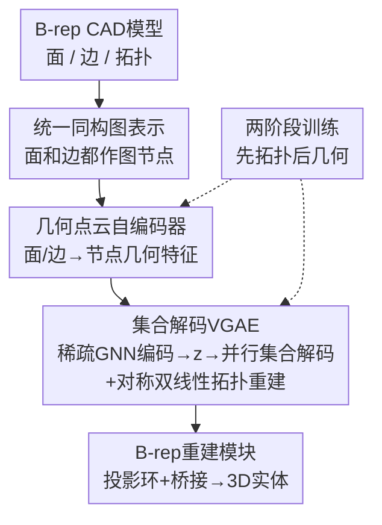

# BrepVGAE: Variational Graph Autoencoder with Unified Latent Representation for B-rep

**会议**: CVPR 2026  
**论文**: [CVF Open Access](https://openaccess.thecvf.com/content/CVPR2026/html/Guo_BrepVGAE_Variational_Graph_Autoencoder_with_Unified_Latent_Representation_for_B-rep_CVPR_2026_paper.html)  
**代码**: 无  
**领域**: B-rep / CAD 表示学习  
**关键词**: B-rep生成, 变分图自编码器, 集合解码, 拓扑-几何耦合, CAD  

## 一句话总结
BrepVGAE 把 CAD 的 B-rep 模型里异质的「面」和「边」统一表示成同一张稀疏同构图的节点，用变分图自编码器压成一个全局 latent 向量，再用集合并行解码器一次性重建出全图的拓扑邻接和连续几何特征，在重建精度、拓扑有效率和生成多样性上都明显超过 BrepGen 等方法。

## 研究背景与动机
**领域现状**：B-rep（边界表示）是现代 CAD 系统的底层数据结构，用「面 / 边 / 顶点 + 它们之间的拓扑关系」来描述一个 3D 实体。要让生成模型直接学并生成 B-rep，主流做法要么把 CAD 建成操作序列（DeepCAD 用 Transformer 建 sketch+参数操作的序列），要么把 B-rep 当图来做（UV-Net、BRepNet 等用 face-adjacency 图做识别/分割），要么用扩散/自回归直接生成（SolidGen 自回归生顶点/边/面，BrepGen 用结构化 latent-geometry 树）。

**现有痛点**：作者点出三个根本性难题。其一，几何和拓扑强耦合，生成时常常出现「面拼不起来 / 不水密」的无效结果；其二，B-rep 图极度稀疏，普通图生成模型很难适配 CAD 级别的复杂结构；其三，现有图生成方法普遍缺乏鲁棒地重建**连续节点特征**的机制——它们大多只重建邻接矩阵（link prediction）或离散标签，对 CAD 这种每个节点都带连续几何（UV 曲面、曲线采样）的场景束手无策。

**核心矛盾**：更深一层的矛盾在于 B-rep 图是**异质的**——面和边是两种本质不同的几何图元（面是二维曲面，边是一维曲线），传统基于图的表示无法为面和边建立统一的表述，这就限制了在一个共享 latent 空间里同时编解码几何与拓扑的能力。

**本文目标**：构建一个能**整体（holistically）**编码并解码完整 B-rep 的框架——从单一 latent 向量里同时还原拓扑邻接和所有节点的连续几何特征，且保证拓扑有效。

**切入角度**：作者的关键观察是——既然面和边的「异质性」是症结，那就干脆把它们**抹平成同一种东西**：把边也当成图节点，让面节点和边节点共享同一套节点表示，这样整张图就从异质图变成了同构（isomorphic）稀疏图，下游的消息传递、池化、解码就都能用统一的算子处理。

**核心 idea**：把面和边统一为同构图节点 + 用集合（set）并行解码器从单一 latent 一次性还原「拓扑 + 连续几何」，配两阶段训练让几何与拓扑稳定耦合。

## 方法详解

### 整体框架
BrepVGAE 的输入是一个 B-rep CAD 模型（一堆面、边及其拓扑），输出是重建/生成出来的完整 3D 实体。整条管线由 4 个模块串起来：先把面和边统一成一张**稀疏同构图**，每个面/边各自先经过一个**点云自编码器**压成节点几何特征；这些节点特征送进**集合解码 VGAE**——稀疏 GNN 编码 + 多头注意力池化得到全局 latent $z$，再用可学习 query 的集合并行解码器从 $z$ 一次性吐出全图节点特征，并用对称双线性层一次重建邻接矩阵；最后 **B-rep 重建模块**把预测出来的拓扑 + 几何用投影环和桥接算法装配成一个水密实体。贯穿全程的是一个**两阶段训练策略**，先冻结几何只学拓扑，再渐进引入几何重建。

### 关键设计

**1. 统一同构图表示：把面和边都当成同一种图节点**

针对「面和边异质、无法统一表述」这个症结，作者构造了一张**稀疏同构图** $X \in \mathbb{R}^{N \times d}$，其中 $N$ 是面节点和边节点的总数——也就是说边不再是连接面的「边」，而是和面平起平坐的**节点**。面和边统一用维度 $d = 33$ 的节点表示，图级 latent 维度 $L = 256$。邻接矩阵只保留 **Face–Edge** 和 **Edge–Edge** 两个子块、不含自环（面与面之间在 B-rep 里本就不直接相连）。这样原本复杂的异质 CAD 拓扑就被转成了一张统一、可学习、且高度稀疏的同构图。训练时还做图增广（随机丢节点、扰动边），并同步更新 mask 和邻接矩阵以避免产生孤立边。这个表示是整篇方法的地基：正因为面和边同构，后面的稀疏 GNN、注意力池化、集合解码才能用一套算子无差别处理。

**2. 几何点云自编码器：分别为面/边量身定做高保真几何编解码**

光把几何抽象成节点还不够，每个节点得携带能还原出真实曲面/曲线的连续几何特征。作者为面和边各设计一个**点云自编码器**：面用下采样（DS）编码器（卷积-转置卷积架构）编码从曲面采样的点云，边用一维残差块 + 膨胀卷积（dilated conv，在不增大模型的前提下扩大感受野，保住曲线细节）。两者都输出形如 $[B, F, 32]$ 的特征（$B$ 为 batch、$F$ 为节点数），并都用 $\tanh$ 把输出限到 $[-1, 1]$ 提升数值稳定性、对齐下游模块；最后再拼一个一维 type 向量标明这个节点是面还是边（凑成 $d=33$）。几何损失是 MSE 与对称 Chamfer Distance（CD）的加权和，权重按面/边点数差异调节。消融显示：去掉 CD 损失后 Face VAE 的 CD 从 0.619 恶化到 1.126，说明 CD 对几何保真至关重要。

**3. 集合并行解码 + 对称双线性拓扑重建：从单一 latent 一次性生成全图**

这是全文最核心、也最能解决「连续特征难重建 + 自回归低效」的设计。**图编码**端：多层同构稀疏 GNN 做消息传递（每层解耦地对 message 和 self-loop 做线性变换、按度归一化聚合、残差更新），得到节点嵌入 $H \in \mathbb{R}^{N \times d}$；再用带可学习 query $q$ 的多头注意力池化把任意规模的图压成一个向量 $h$，MLP 映射出均值 $\mu$ 和对数方差 $\log \sigma^2$，重参数化采样得到全局 latent：

$$z = \mu + \epsilon \odot \exp\!\Big(\tfrac{1}{2}\log \sigma^2\Big), \quad \epsilon \sim \mathcal{N}(0, I)$$

这个单一的 $z$ 是整个解码阶段唯一的条件。**集合并行解码**端：为避免自回归逐节点生成，作者把 $z$ 线性映成隐状态并扩展成 $M$ 组并行的 key/value $K, V \in \mathbb{R}^{M \times d}$，再实例化 $N_{\max}$ 个可学习 query $Q$，让 query 经过若干层 Pre-LN 残差形式的交叉注意力 + FFN 与 $K,V$ 交互：$\tilde U^{(t)} = Q^{(t)} + \mathrm{MHA}(\mathrm{LN}(Q^{(t)}), \mathrm{LN}(K), \mathrm{LN}(V))$，$U^{(t)} = \tilde U^{(t)} + \mathrm{FFN}(\mathrm{LN}(\tilde U^{(t)}))$，再叠加节点 index 嵌入和 type 嵌入、过一层自注意力得到统一节点表示 $U$，最后用 type-conditioned 线性投影分别产出面特征 $F$、边特征 $E$ 和分类头 $C(U) \in \mathbb{R}^{N_{\max}\times 3}$。**拓扑重建**端：用对称双线性层一次性重建邻接矩阵——面-边连接打分 $S_{FE}(i,j) = x_{f_i}^\top W_{FE} x_{e_j} + b_{FE}$，其中 bias $b_{FE}$ 用训练集的基线正例率初始化以稳定早期训练；边-边连接为保证对称且排除自环，用显式对称参数化 $W_{EE} = \mathrm{tril}(A) + \mathrm{tril}(A,-1)^\top$，只训练有效的上三角项，两个打分都过 sigmoid，并对目标做 label smoothing（裁剪到 $[0.05, 0.95]$）防止过自信。整套机制让所有节点从一个 latent **并行**生成、邻接矩阵**一次**重建，既避开了自回归的低效，又能重建出连续几何——这正是旧的 inner-product / autoregressive-adjacency 解码器做不到的。

**4. 两阶段训练 + 匈牙利匹配：解开几何-拓扑耦合，防早期几何错误干扰拓扑**

集合解码产出的是一个**无序集合**，没法直接和 ground truth 节点逐个对齐。作者先用**匈牙利算法**做一对一最优匹配，以平方欧氏距离 $C_{ij} = \|u_i - v_j\|_2^2$ 为代价矩阵求最优匹配 $\pi$，得到特征匹配损失 $L_{\text{feat}} = \frac{1}{n}\sum_i \|u_i - v_{\pi(i)}\|_2^2$（面、边独立匹配后加权求和）。同时注入 CAD 物理先验——**度收敛约束**：每条边理想上应连接 2 个面，对预测的连边数偏离 2 的情况加惩罚 $L_{\text{deg}}$。更关键的是**两阶段训练**：第一阶段冻结几何自编码器（$\lambda_{\text{geo}}=0$），只训图 VAE 的拓扑头和 type 头（图损失 $L_{\text{Graph}} = \lambda_{\text{BCE}}L_{\text{adj}} + \lambda_{\text{deg}}L_{\text{deg}} + \lambda_{\text{type}}L_{\text{type}}$，邻接用带 label smoothing 的 masked focal loss）；第二阶段才解冻几何、用线性 warm-up 渐进把几何重建损失从 0 拉到 1（$L_{\text{Geometry}} = \lambda_{\text{geo}}(\lambda_{\text{MSE}}L_{\text{MSE}} + \lambda_{\text{CD}}L_{\text{CD}})$），总损失 $L = L_{\text{Graph}} + L_{\text{Geometry}}$。这样做的直接动机是：如果一上来就端到端联合训，早期粗糙的几何重建误差会污染拓扑学习；先把拓扑学稳、再渐进引入几何，就能让两者稳定耦合。消融里端到端训练 COV 只有 60.20，而两阶段拿到 78.75，差距巨大。

### 损失函数 / 训练策略
- 总损失 $L = L_{\text{Graph}} + L_{\text{Geometry}}$，分两阶段启用。
- 训练分三段共 600 epoch：Stage 1（200 ep）冻结几何只训图 VAE；Stage 2-1（200 ep）渐进解冻几何、几何损失权重 0→1 线性增长；Stage 2-2（200 ep）全模型端到端联合训。
- 数据增广分段控制：第一段开随机节点/边扰动，第二段起关闭以求稳定收敛。
- 实现：PyTorch，2×NVIDIA H20 GPU，混合精度，AdamW（lr=5e-4），每 batch 256 样本。

## 实验关键数据

### 主实验
在 DeepCAD 数据集上做无条件生成对比（预处理：去 NURBS 等非多边形面、面数 ≤30 边数 ≤90、去多形体/重复模型）。Ours(\*N/\*S/\*H) 分别对应最近邻 / Sinkhorn / 匈牙利三种匹配策略，越严越好。

| 方法 | COV↑ | MMD↓ | JSD↓ | Novel↑ | Unique↑ | Valid↑ |
|------|------|------|------|--------|---------|--------|
| DeepCAD | 65.46 | 1.29 | 1.67 | 87.4 | 89.3 | 46.1 |
| SolidGen | 71.03 | 1.08 | 1.31 | 99.1 | 96.2 | 60.3 |
| BrepGen | 73.87 | **1.04** | 1.28 | 99.8 | 99.7 | 62.9 |
| Ours(\*N) | 73.40 | 1.34 | 1.30 | 97.2 | 97.0 | 63.7 |
| Ours(\*S) | 78.71 | 1.18 | 1.25 | 99.8 | 99.8 | 70.7 |
| **Ours(\*H)** | **79.82** | 1.13 | **1.21** | 98.2 | 98.1 | **72.6** |

几何重建（点云自编码器）层面，Ours 的 Surface VAE 把 CD 从 BrepGen 的 1.285 降到 0.619（论文称 −51.8%），Edge VAE 把 CD 从 1.117 降到 0.658。⚠️ 边的 CD 降幅按表格数字算约 −41%，与正文所述 −35.4% 略有出入，以原文为准。ABC 数据集（面数 ≤50、边数 ≤150）上 Ours(\*H) 的 COV 73.51 也明显高于 BrepGen 的 64.33、Valid 63.1 高于 57.2，说明可扩展性。

### 消融实验
四组消融均在 DeepCAD 60K 模型上训 600 epoch、统一用匈牙利匹配。

| 配置 | COV↑ | MMD↓ | JSD↓ | Precision↑ | ELBO↑ |
|------|------|------|------|-----------|-------|
| **GNN：** GAT | 60.46 | 1.38 | 1.56 | 68.58 | -4.89 |
| **GNN：** GCN | 68.78 | 1.18 | 1.33 | 60.21 | -3.65 |
| **GNN：** Ours(SparseGNN) | **78.75** | 1.18 | 1.27 | **70.96** | **-3.21** |
| **解码：** Single-Query | 65.30 | 1.48 | 1.58 | 60.81 | -3.95 |
| **解码：** Fixed-Queries | 63.53 | 1.52 | 1.62 | 58.92 | -4.66 |
| **解码：** No-KV-Expansion | 70.25 | 1.35 | 1.45 | 65.40 | -3.80 |
| **训练：** End-to-End | 60.20 | 1.52 | 1.62 | 58.68 | -4.27 |
| **训练：** Freeze-Geo Whole | 76.35 | 1.26 | 1.37 | 68.80 | -3.45 |
| **训练：** Ours(Two-Stage) | **78.75** | **1.18** | **1.27** | **70.96** | **-3.21** |

### 关键发现
- **两阶段训练贡献最大**：端到端联合训 COV 仅 60.20，两阶段拉到 78.75（+18.5），验证了「早期几何误差会污染拓扑学习」的判断；全程冻结几何（76.35）也不如渐进解冻，说明几何最终仍需参与微调。
- **稀疏 GNN 优于 GAT/GCN**：GAT 对节点向量的平滑反而让几何解码变难（COV 60.46），GCN 受限于其邻接拓扑处理能力；稀疏 GNN 借助高效消息传递更契合 B-rep 的极端稀疏性。
- **多槽可学习 query 不可替代**：单 query（表达力受限）、固定 query（灵活性差）、不做 KV 扩展（信息传递平庸）三种退化都明显掉点，COV 从 78.75 跌到 63–70。
- **Precision 低于 Valid 不是 bug**：作者专门解释（图 7）——集合解码是生成式的，一个 GT 面节点可能被生成成两个拓扑同样有效的面节点，导致严格一对一匹配下的 Precision 被拉低，但模型本身仍是有效的，所以 Valid 反而更高。
- 此外 latent 空间还能直接做**零件检索**：把零件编码成 256 维向量后按 L2 距离排序（0–3 视为同类），能在几何和拓扑两个维度上稳健识别相似零件。

## 亮点与洞察
- **「把边升格为节点」一招解异质**：B-rep 难学的根因是面/边异质，作者没有去设计复杂的异质图算子，而是直接把边也当节点、做成同构图，让所有下游算子瞬间统一——这种「把问题消解掉而不是硬解」的思路很值得借鉴。
- **集合解码 + 对称双线性 = 一次出图**：用可学习 query 的并行集合解码替代自回归，邻接矩阵用对称双线性层一次重建，既快又能同时还原连续几何，绕开了图生成里「只能重建邻接、不能重建连续特征」的老问题。
- **物理先验当正则**：把「一条边理想连 2 个面」这种 CAD 领域常识写成度收敛约束 $L_{\text{deg}}$，是领域知识注入神经网络的好例子，可迁移到任何带强结构先验的图生成任务。
- **课程式两阶段训练**：先学拓扑骨架、再渐进填几何血肉，对任何「结构 + 连续属性」强耦合的生成任务都有参考价值。

## 局限性 / 可改进方向
- **受限于规则化预处理**：训练时去掉了 NURBS 等非多边形面，并强制面/边数量上限（DeepCAD 面≤30/边≤90，ABC 面≤50/边≤150），对真实工业里超大、含自由曲面的复杂 B-rep 能否扩展，论文未充分验证。
- **MMD 并非全面领先**：BrepGen 在 MMD 上（1.04）仍略优于 Ours(\*H)（1.13），说明在「与参考集最近邻的平均 Chamfer 距离」这一指标上本方法没有占满全部优势。
- **Precision–Valid 错位需谨慎解读**：严格匹配下 Precision 偏低虽被解释为生成式特性，但也意味着用 Precision 作训练监督/早停信号时可能误导，作者靠 Valid 兜底。
- **正文与表格数字小幅不一致**（如边 CD 降幅 35.4% vs 表格约 41%、个别 COV 写成 78.15% 与表内 78.75% 混用），读结论时建议以表格为准。
- 重建模块依赖投影环 DFS + 桥接（G2 连续）等较多手工几何算法，端到端程度有限，复杂拓扑下的鲁棒性有待观察。

## 相关工作与启发
- **vs VGAE / GraphVAE / JTVAE 等图 VAE**：经典图 VAE 多是 GCN 编码 + inner-product 解码做 link prediction，或单次解码小图的邻接 + 节点标签；本文把 B-rep 当**带类型的稀疏异质图**（面/边为两类节点），用并行集合解码器还原**每节点连续几何嵌入**，并用对称双线性头一次重建完整稀疏邻接，专门针对 B-rep 的极端稀疏与类型化连接模式。
- **vs BrepGen / HoLa-BRep / DTGBrepGen**：BrepGen 用结构化 latent-geometry 树 + 重复节点合并的扩散来恢复拓扑；HoLa-BRep 只在曲面上定义整体 latent、再用神经交点网络推曲线/顶点；DTGBrepGen 用两阶段 Transformer 显式解耦拓扑与几何再扩散。BrepVGAE 与它们的根本区别是把 B-rep 编进**统一的几何-拓扑 latent**，从单一全局 latent 一次性解出全部连续节点特征 + 完整稀疏邻接，并用两阶段课程耦合拓扑学习与高保真几何重建。
- **vs UV-Net / BRepNet / AAGNet 等 CAD 图学习**：这些是判别式管线（分割 / 识别 / 特征识别），用 face-adjacency 图 + 联合 CNN/GNN 消息传递；本文同样做拓扑感知的消息传递，但目标是**生成式**——从紧凑 latent 联合解码几何与拓扑，并顺带展示了 latent 可用于零件检索。

## 评分
- 新颖性: ⭐⭐⭐⭐⭐ 「面/边统一为同构图节点 + 集合并行解码一次出全图」是 B-rep 生成里少见且自洽的全新范式。
- 实验充分度: ⭐⭐⭐⭐ 主结果 + 几何重建 + 四组消融 + 跨数据集（DeepCAD/ABC）+ 检索都覆盖，但缺自由曲面/超大模型的压力测试。
- 写作质量: ⭐⭐⭐ 思路清晰、公式给得全，但正文与表格数字多处小幅不一致，细节需对照表格读。
- 价值: ⭐⭐⭐⭐ 为 CAD 生成提供了统一 latent 的可行路径，且对零件检索、特征识别等下游有迁移潜力。

<!-- RELATED:START -->

## 相关论文

- [\[CVPR 2026\] AutoRegressive Generation with B-rep Holistic Token Sequence Representation](autoregressive_generation_with_b-rep_holistic_token_sequence_representation.md)
- [\[CVPR 2026\] Negative Binomial Variational Autoencoders for Overdispersed Latent Modeling](negative_binomial_variational_autoencoders_for_overdispersed_latent_modeling.md)
- [\[CVPR 2026\] A Unified Framework for Knowledge Transfer in Bidirectional Model Scaling](a_unified_framework_for_knowledge_transfer_in_bidirectional_model_scaling.md)
- [\[CVPR 2026\] CAD-Refiner: A Unified Framework for CAD Generation and Iterative Editing](cad-refiner_a_unified_framework_for_cad_generation_and_iterative_editing.md)
- [\[CVPR 2026\] Dynamics: Language-Based Representation for Inferring Rigid-Body Dynamics From Videos](dynamics_language-based_representation_for_inferring_rigid-body_dynamics_from_vi.md)

<!-- RELATED:END -->
