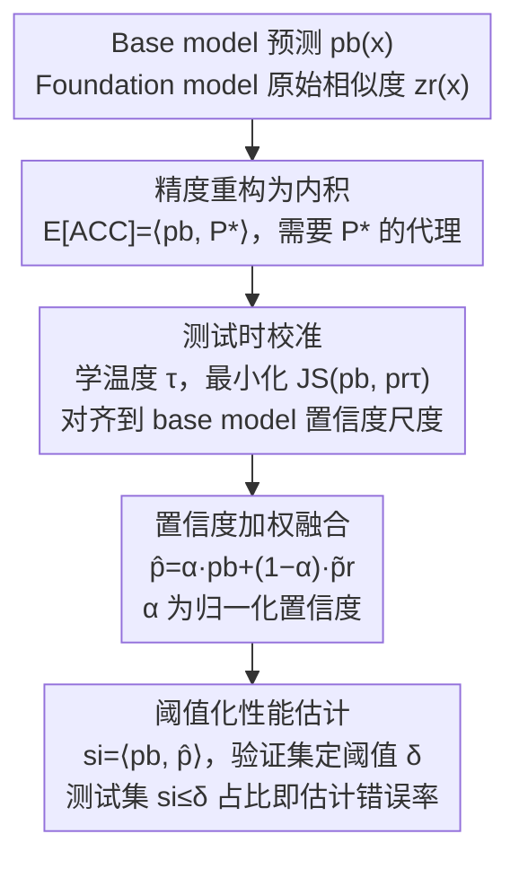

# Bridging Domain Expertise and Generalization for Performance Estimation

**会议**: CVPR 2026  
**论文**: [CVF Open Access](https://openaccess.thecvf.com/content/CVPR2026/html/Li_Bridging_Domain_Expertise_and_Generalization_for_Performance_Estimation_CVPR_2026_paper.html)  
**代码**: 无  
**领域**: 模型评估 / 性能估计  
**关键词**: 性能估计, 分布偏移, 基础模型, 测试时校准, 置信度融合  

## 一句话总结
在没有标签的分布偏移测试集上估计模型精度时，本文不再只看被评估模型自己的输出，而是引入一个基础模型（CLIP/SigLIP）当"外部参照"，先用 JS 散度把它的预测校准到与被评估模型同一个置信度尺度，再按置信度加权融合成一个"伪真标签"分布，用被评估模型预测与这个分布的一致性来估计精度，平均 MAE 从次优的 6.72% 降到 6.53%。

## 研究背景与动机

**领域现状**：性能估计（performance estimation）要解决的是——给定一个训练好的分类器和一个**无标签**的测试集，在不看真标签的前提下预测这个模型在该测试集上的精度。当测试集和训练集分布一致时这不难，但实际部署经常违反 i.i.d. 假设，测试分布偏移（covariate shift）后精度会显著下降，于是"无标签估精度"成了部署可靠模型的刚需。主流做法五花八门：预测一致性（agreement）、置信度统计（AC/DoC/ATC）、预测分布刻画（ProjNorm/COT）等。

**现有痛点**：尽管方法各异，这些指标有一个共同的死穴——**全部只用被评估模型自己的输出**。而分布一偏移，模型自身的预测就变得有偏：置信度不再与精度正相关，agreement 分数甚至会在预测**持续错误**时反而升高。换句话说，你拿一个已经"看走眼"的模型的输出去推断它自己有多准，偏差会被放大。

**核心矛盾**：被评估模型（base model）有**领域专长**（task-oriented 训练带来的 domain expertise），但分布偏移后**泛化能力崩塌**、预测有偏。要打破"自证"的循环，必须引入一个**独立于被评估模型、且泛化能力强**的外部知识源来交叉验证。

**本文目标**：找到一个比"模型自身输出"更可靠的真标签代理（surrogate of ground-truth），用它来锚定精度估计。

**切入角度**：基础模型（CLIP、SigLIP）在大规模多样数据上训练，天生具备跨域泛化；而 base model 保留了领域专长。两者**互补**——一个泛化广、一个专精深。把它们整合起来，理论上能得到比任何单方都更稳的参照信号。但直接整合并不简单：两个模型来自不同训练范式、不同特征空间，置信度尺度不兼容，且分布偏移下普遍存在严重的 miscalibration（尤其 CLIP 的原始余弦相似度几乎是均匀分布，毫无区分度）。

**核心 idea**：先把基础模型的预测**校准对齐**到 base model 的置信度尺度（建立共享概率空间），再**按置信度加权融合**成一个"伪真标签"分布，最后用 base model 预测与该分布的一致性来估精度——即论文提出的 **FRAP（Fused Reference Alignment Prediction）**。

## 方法详解

### 整体框架

FRAP 的出发点是一个**精度重构**：在目标域上，模型的期望精度可以写成"被评估模型预测分布"与"真标签 one-hot 分布"的逐样本内积之和（见关键设计 1）。被评估模型预测前向一次就能拿到，真标签分布 $P^*$ 在无标签目标域里是未知的——FRAP 的全部工作就是构造一个**融合分布 $\hat{P}$ 来当 $P^*$ 的代理**。

整条 pipeline 是清晰的三步串行：① **测试时校准**——基础模型输出原始相似度，先学一个温度 $\tau$ 把它的预测分布对齐到 base model；② **置信度加权融合**——把校准后的基础模型预测和 base model 预测按各自置信度加权混合成融合分布；③ **阈值化性能估计**——用 base model 预测与融合分布的内积当样本得分，在带标签验证集上定一个阈值 $\delta$，测试集上得分低于 $\delta$ 的样本比例就是估计错误率。

### 关键设计

**1. 把精度重构为"预测↔真标签"的内积：给整套估计法奠定理论代理目标**

性能估计要先有一个可优化的目标。本文把目标域上的经验精度做了一步关键重写：对样本 $x_i$ 引入 one-hot 真标签分布 $P^*(\cdot|x_i)$，则期望精度可近似为被评估模型预测分布与真标签分布的逐样本内积均值

$$\mathbb{E}[\text{ACC}] \approx \frac{1}{N}\sum_{i=1}^{N}\sum_{j=1}^{K} \hat{P}_\theta(j|x_i)\, P^*(j|x_i).$$

这一步的价值在于把"估精度"明确拆成两半：$\hat{P}_\theta$（被评估模型预测）可前向获得，而 $P^*$（真标签分布）未知。于是整个问题被干净地归约成"**如何在无标签时构造一个好的 $P^*$ 代理**"——后面所有设计都服务于这个代理。和那些直接拿置信度/agreement 当指标的方法相比，这个内积形式给了 FRAP 一个明确的数学落脚点，而不是又一个启发式分数。

**2. 测试时校准：用 JS 散度把基础模型对齐到 base model 的置信度尺度**

直接把两个模型的预测拿来融合行不通，因为它们的置信度尺度天差地别：base model 用有监督交叉熵训练，输出尖锐的峰；基础模型用对比学习在图文对上训练，输出**几乎均匀**的平坦分布——CLIP 的原始余弦相似度即使对分类正确的样本，top-1 概率也只比其他类略高（论文归因于对比学习 uniformity-alignment 的内在 trade-off）。这种尺度错配会让融合权重系统性地偏向某一方。

最朴素的修法是给基础模型套一个固定小温度，但合适的温度依赖标签数据、且在源域调好的温度迁移到偏移目标域就失效。本文改用**动态校准**：在无标签测试集上学一个温度 $\tau$，使基础模型的温度缩放预测 $P^r_\tau$ 与 base model 预测 $\hat{P}_\theta$ 的 JS 散度最小

$$\mathcal{L}_{\text{cal}}(x;\tau) = \text{JS}\!\left(\hat{P}_\theta(\cdot|x),\, P^r_\tau(\cdot|x)\right),\qquad \tau^* = \arg\min_{\tau>0}\, \mathbb{E}_{x\sim D_{\text{test}}}\big[\mathcal{L}_{\text{cal}}(x;\tau)\big],$$

其中 $P^r_\tau(j|x) = \mathrm{softmax}(z^r_j(x)/\tau)$，$z^r_j$ 是图像与第 $j$ 类文本嵌入的余弦相似度。这里把 base model 当成"锚"：虽然它分布偏移下偏过自信，但它的置信度尺度仍远比基础模型那种近均匀分布更有信息量，因此用它来反向约束基础模型的温度，得到一个**无监督、自适应测试集**的校准。⚠️ 一个反直觉的发现见关键发现：动态学到的 $\tau$ 在 ECE 上未必最低，但它对下游融合最有用。

**3. 置信度加权融合：让"更可信的那个模型"在融合分布里占更大权重**

校准把两个模型放进同一个概率空间后，融合不该简单取平均——置信度本身就编码了"该信谁多一点"。本文为每个输入 $x$ 取两模型的最大概率作为置信度 $c_b(x)=\max_j \hat{P}_\theta(j|x)$、$c_r(x)=\max_j P_r(j|x)$，归一化成权重

$$\alpha(x) = \frac{c_b(x)}{c_b(x)+c_r(x)},\qquad \hat{P}(\cdot|x) = \alpha(x)\,P_b(\cdot|x) + (1-\alpha(x))\,\tilde{P}_r(\cdot|x).$$

形式上融合分布是在概率单纯形 $\Delta_K$ 上、对两模型预测按权重做平方距离最小的插值点。直觉是：哪个模型在这个样本上更自信（且经校准后这种自信是可信的），它在融合里就占更大份额。融合分布同时吸收了基础模型的跨域泛化和 base model 的领域专长，作为 $P^*$ 的代理。这个设计的有效性依赖关键设计 2 的校准——没有先对齐尺度，置信度加权会被错配的尺度带偏。

**4. 阈值化估计：把"逼近真标签"降级成"二分类对错判定"，补上代理的系统偏差**

融合分布终究只是 $P^*$ 的近似，与理想 one-hot 标签有不可消除的偏差，直接拿内积当精度会有系统误差。本文借鉴 ATC 思路加了一步阈值化：样本得分 $\text{Est}(x)=\langle P_b(x), \hat{P}(x)\rangle$（即关键设计 1 的内积形式），在带标签的源域验证集 $D_s$ 上选阈值 $\delta$，使得"得分低于 $\delta$ 的样本比例"恰好等于 base model 在验证集上的真实错误率：

$$\frac{1}{|D_s|}\sum_{x\in D_s}\mathbb{I}\{\text{Est}(x)<\delta\} = \frac{1}{|D_s|}\sum_{(x,y)\in D_s}\mathbb{I}\{\hat{y}(x)\neq y\}.$$

把同一个 $\delta$ 搬到无标签测试集，得分低于 $\delta$ 的样本占比就是估计错误率。这一步的巧妙在于：它不要求融合分布完美逼近真标签（那很难），只要求估计器能正确判断"这个样本得分在阈值之上还是之下"——把一个**回归式逼近**问题降级成**二分类**问题，鲁棒性大增。

### 损失函数 / 训练策略

FRAP 没有可训练的主干，唯一被优化的参数是温度 $\tau$（关键设计 2，梯度下降 $\tau \leftarrow \tau - \eta\nabla_\tau\mathcal{L}_B$ 直到收敛）。基础模型用公开预训练权重、**不微调**（CLIP ViT-B/32、SigLIP ViT-B/16）。整个流程是 test-time、per-dataset 的轻量过程，计算量随类别数**线性**增长（基础模型推理），不像 COT/COTT 的最优传输求解随类别数二次/三次增长，因此在大类别空间下显著更省。

## 实验关键数据

设置：在 10 个基准（MNIST、CIFAR-10/100、ImageNet、Tiny-ImageNet、FMoW、4 个 BREEDS）的自然偏移（如 ImageNet-V2、CIFAR-10.1，记 -N）和合成损坏（如 CIFAR-C、ImageNet-C，记 -S）上评估，跨 DenseNet121/ResNet18/50、3 个随机种子、多个 epoch 训练 base model。指标为 **MAE**（真实错误率与估计错误率的平均绝对差，越低越好）。

### 主实验

FRAP 与代表性 baseline 在 18 个偏移设定上的平均 MAE 对比（节选关键列）：

| 方法 | 平均 MAE(%) ↓ | 备注 |
|------|------|------|
| **FRAP (CLIP)** | **6.53** | 本文，最优 |
| COTT | 6.72 | 次优，但 OT 求解随类别数二次/三次增长 |
| COT | 7.65 | 同上 |
| FRAP (SigLIP) | 7.32 | 换基础模型仍有竞争力 |
| ATC-MC / ATC-NE | 8.45 / 8.48 | 阈值化置信度 |
| ProjNorm | 10.46 | 预测分布刻画 |
| DoC / AC / IM | 12.70 / 12.30 / 13.76 | 置信度统计 |
| GDE | 14.87 | 预测一致性 |

FRAP(CLIP) 在 18 个数据集中有 6 个取得单项最优，且计算上比 COT/COTT 高效得多。

### 消融实验

温度方案消融（关键设计 2，平均 MAE %）：

| 配置 | 平均 MAE(%) ↓ | 说明 |
|------|------|------|
| RAP（无校准） | 8.20 | 不做温度缩放，直接融合 |
| FRAP$_{\tau=0.05}$ | 8.19 | 固定温度 0.05 |
| FRAP$_{\tau=0.01}$ | 6.61 | 固定温度 0.01 |
| **FRAP$_{\text{dyna}}$（TTC）** | **6.53** | 动态学习温度（本文标准配置） |

参照模型依赖性与鲁棒性（关键设计 3，平均 MAE %）：

| 配置 | MAE(%) ↓ | 说明 |
|------|------|------|
| Base（CLIP，直接用伪标签当真值） | 10.32 | 仅靠零样本能力 |
| Fix（CLIP，固定缩放） | 6.61 | FRAP 框架 + 固定温度 |
| TTC（CLIP，测试时校准） | 6.53 | 完整 FRAP |
| Random 参照（Dirichlet 随机分布） | 8.10 | 参照彻底失效时仍优雅退化、不崩溃 |

### 关键发现

- **校准好 ≠ 估计准**：固定温度 $\tau=0.01$ 的 ECE 反而比动态 TTC 更低（多个数据集上），但其下游估计 MAE（6.61%）却略差于 TTC（6.53%）。作者解释：校准目标（ECE）与下游目标（让置信度加权融合有效）并不一致，动态 $\tau$ 实际上是在做"两模型尺度对齐"的隐式正则，保住了融合的可用性——这是全文最有洞察的发现。
- **增益来自框架而非单纯蹭基础模型**：直接拿 CLIP 伪标签当真值（Base）只有 10.32% MAE，而完整 FRAP 是 6.53%，说明收益来自"校准+融合+阈值"的设计而非基础模型的零样本能力。
- **参照失效时优雅退化**：用 Dirichlet 随机分布当参照，FRAP 仍有 8.10% MAE 而非灾难性崩溃，证明 TTC 让框架对参照质量不敏感、架构无关。
- **融合提升语义一致性**：用 Semantic Alignment Score（基于 WordNet 的语义相似度，见 Eq.3）度量，融合预测相对 base/CLIP 的 SAS gap 在自然偏移下几乎 100% 为正、合成损坏下也大多为正，说明融合预测即使 top-1 错了也更语义贴近真标签。

## 亮点与洞察
- **跳出"自证循环"的视角**：性能估计长期困在"用模型自己的输出推断模型自己有多准"，本文一句"引入独立的外部泛化参照"就点破了问题根源，而基础模型恰好天然满足"独立 + 强泛化"——切入点干净有力。
- **JS 对齐当无监督校准器**：把 base model 当"锚"、用 JS 散度反向约束基础模型温度，是一个无需任何标签、自动适配测试集的巧妙校准范式，可迁移到任何"两个尺度不兼容的概率输出需要融合"的场景。
- **"降级成二分类"的阈值化**：不追求完美逼近真标签、只需判对错在阈值哪一侧，是把难问题化简的经典 trick，鲁棒性显著优于直接回归式估计。
- **ECE 与下游目标解耦的反直觉发现**："校准误差更低却估计更差"提醒后人：中间指标（ECE）不能盲目当代理目标优化，要盯住真正的下游目标。

## 局限与展望
- 作者承认 FRAP **并非在所有基准上都赢**：其有效性受限于基础模型的泛化上界——基础模型在某域弱，FRAP 在该域也好不到哪去。
- 参照模型的选择会影响估计天花板，"如何系统地挑最合适的参照"仍是开放问题，本文留作未来工作。
- ⚠️（自己发现）实验仅覆盖图像分类的 covariate shift（标签空间不变），label shift、开放集、回归任务等是否适用未验证；基础模型用的也都是 CLIP/SigLIP 这类 VLM，对纯视觉自监督基础模型是否同样有效未知。
- 改进方向：作者提出可发展领域自适应/任务专用的参照模型、把 FRAP 扩展到 NLP 等其他模态（用强语言基础模型）、设计与性能估计目标更紧耦合的融合与校准目标。

## 相关工作与启发
- **vs ATC / DoC / AC（置信度统计类）**：它们只用 base model 自身置信度做阈值/统计，分布偏移下置信度失真就跟着失真；FRAP 引入外部基础模型当参照，打破自证循环，平均 MAE 从 ~8.5% 降到 6.53%。
- **vs COT / COTT（最优传输类）**：COTT 是次优 baseline（6.72%），但其 OT 求解随类别数二次/三次增长；FRAP 仅需基础模型线性推理、无 OT 求解，在大类别空间下显著更高效且更准。
- **vs Source-Free Domain Adaptation（SFDA）**：SFDA 也借外部泛化信号（如 CLIP）但目标是**适配/提升**模型在目标域的表现，FRAP 的目标是**估计**已有模型的表现、不改模型，两者设计原则与方法需求根本不同。

## 评分
- 新颖性: ⭐⭐⭐⭐ 把"引入独立外部基础模型参照"系统化为校准+融合+阈值的完整框架，视角新颖；但每一步组件（温度校准、置信度融合、ATC 式阈值）单看都不算首创。
- 实验充分度: ⭐⭐⭐⭐⭐ 10 数据集 × 多架构 × 多种子 × 自然/合成偏移，含温度、参照依赖、随机参照压力测试、SAS 语义分析，相当扎实。
- 写作质量: ⭐⭐⭐⭐ 动机推导清晰、理论重构干净，"ECE 与下游目标解耦"的讨论有洞察；个别符号（$P^*$ 既指真标签又指融合代理）略易混。
- 价值: ⭐⭐⭐⭐ 性能估计是部署可靠模型的刚需，提供了一个高效、对参照鲁棒、可迁移到其他模态的实用框架。

<!-- RELATED:START -->

## 相关论文

- [\[ICLR 2026\] Noise-Aware Generalization: Robustness to In-Domain Noise and Out-of-Domain Generalization](../../ICLR2026/others/noise-aware_generalization_robustness_to_in-domain_noise_and_out-of-domain_gener.md)
- [\[CVPR 2025\] Gradient-Guided Annealing for Domain Generalization](../../CVPR2025/others/gradient-guided_annealing_for_domain_generalization.md)
- [\[CVPR 2026\] Keep It Frozen: Domain-Routed Conditional Residual Modulation for Multi-Domain Vision Transformers](keep_it_frozen_domain-routed_conditional_residual_modulation_for_multi-domain_vi.md)
- [\[ICML 2025\] Set-Valued Predictions for Robust Domain Generalization](../../ICML2025/others/set_valued_predictions_for_robust_domain_generalization.md)
- [\[CVPR 2026\] Event Stream Filtering via Probability Flux Estimation](event_stream_filtering_via_probability_flux_estimation.md)

<!-- RELATED:END -->
