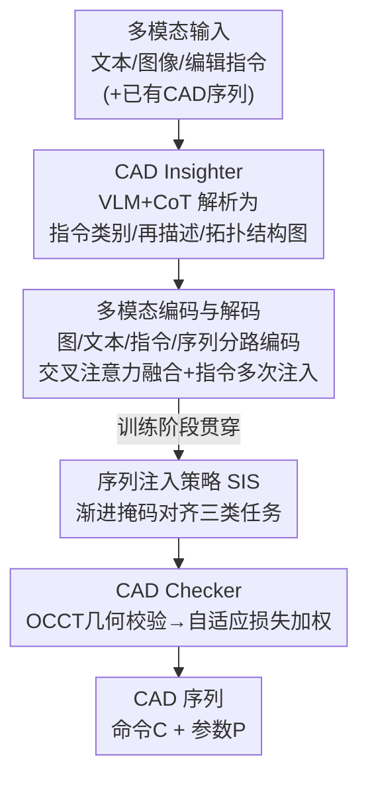

# CAD-Refiner: A Unified Framework for CAD Generation and Iterative Editing

**会议**: CVPR 2026  
**论文**: [CVF Open Access](https://openaccess.thecvf.com/content/CVPR2026/html/Yuan_CAD-Refiner_A_Unified_Framework_for_CAD_Generation_and_Iterative_Editing_CVPR_2026_paper.html)  
**代码**: 未公开  
**领域**: CAD 生成与编辑 / 多模态  
**关键词**: CAD 序列生成, 拓扑结构图, 迭代编辑, 课程式掩码, 几何校验  

## 一句话总结
CAD-Refiner 用一个 VLM 智能体把文本/图像/编辑指令解析成 CAD 模型的「拓扑结构图」作为统一条件，再配合「序列注入策略」把生成/补全/编辑三类任务对齐进同一个解码器，并用基于 OCCT 几何校验的自适应损失加权来修正几何错误，从而在单一模型里完成「先生成、后多轮迭代编辑」的完整 CAD 建模工作流。

## 研究背景与动机

**领域现状**：CAD 建模的主流路线是把模型表示成由「命令 + 参数」组成的构造序列（DeepCAD、SkexGen、Mamba-CAD 等），近年又加入点云、文本、图像等多模态条件来增强可控性。

**现有痛点**：现有方法几乎都把「生成」和「编辑」当成两个独立任务来做——生成模型只能从零产出，编辑模型（如 CAD-Editor）要专门拆成定位+填充两个子任务、专门的数据格式和训练管线。可真实设计流程是「先生成一个初稿，再一轮轮改」，两套割裂的系统在迭代场景里既不连贯也难适配。另外，多数方法是「几何驱动」的，只在外部条件下拟合形状，忽略了 CAD 模型本身「面—环—曲线」这类带明确语义的拓扑依赖，导致编辑时容易破坏结构一致性。

**核心矛盾**：生成和编辑的输入模态、目标行为差异很大（生成只吃 prompt，编辑还要吃一段已有序列），想塞进一个模型，就缺一个能横跨多任务的「共享结构化语义表示」；同时几何元素之间的拓扑关系如果不显式建模，模型就抓不住元素间依赖。

**本文目标**：在单一模型里统一 CAD 的生成、补全、编辑，让它既能从多模态输入直接产出，又能在已有结果上做多轮精修。

**切入角度**：作者的关键观察是——不论什么任务、什么模态，最终都可以抽象成「对 CAD 拓扑结构的一次操作」。于是用一个 VLM 把任意输入解析成统一的拓扑结构图，让这张图同时充当「多任务的桥梁」和「跨域不变的表示」。

**核心 idea**：用「VLM 解析出的拓扑结构图」作统一条件、用「渐进掩码的序列注入」抹平任务间输入差异、用「几何校验驱动的自适应损失」纠错，三件事合起来把生成与迭代编辑装进一个框架。

## 方法详解

### 整体框架
CAD-Refiner 的输入是自由形式的多模态 prompt（文本、图像，编辑时还带一段已有 CAD 序列和一句编辑指令），输出是一段 CAD 构造序列 $S$（每个 token 含命令 $C$ 与参数 $P$）。整条管线分四步走：先由 **CAD Insighter** 这个 VLM 智能体把输入解析成三样东西——指令类别、文本再描述、拓扑结构图；多模态编码器把图/文本/指令/CAD 序列各自编码；解码器在自注意力处理 CAD 特征后，逐层交叉注意力融合图与文本特征、并多次注入指令特征，预测精修后的序列；最后 **CAD Checker** 用几何校验给出错误反馈，转成损失权重回灌训练。其中 **序列注入策略（SIS）** 横贯训练阶段，靠动态掩码把生成/补全/编辑的输入需求对齐到同一套学习目标上。

### 关键设计

**1. CAD Insighter：把任意输入翻译成统一的拓扑结构图，当多任务的共享语义层**

针对「生成与编辑模态/行为差异大、缺共享表示」这个矛盾，作者让一个 VLM（Qwen-VL-Max）通过一套一次性思维链（one-shot CoT）prompt 来做结构化解析。CoT 模板分五块（背景设定、任务与规则说明、多模态输入、思维链引导、one-shot 示例），引导 VLM 依次完成 prompt 识别 → 指令识别 → 文本再描述 → 层级结构树构建 → 前序遍历 → 邻接关系抽取 → 结构化输出。输出包含四部分：指令类别、文本再描述、拓扑节点的前序遍历列表、邻接关系三元组。

这里的「层级结构树」按 CAD 构造序列的惯例自顶向下分层：CAD model → Sketch-Extrusion → Sketch/Extrude → Face → Loop → Curve（Curve 是底层，含 Line/Arc/Circle 等图元）。把它显式建成一棵树就能显式建模拓扑。最终输出经正则解析、结合预定义的拓扑语料库（topology corpus），被转成拓扑结构图 $G=(N,R)$，其中 $N$ 是前序遍历得到的结构节点、$R$ 编码节点间关系。这张图有两个好处：一是连接「高层语义指令」和「底层几何/拓扑关系」，把抽象意图映射到具体操作，天然支持多任务；二是有域不变性，能弥合不同模态、跨域数据之间的语义差异，提升跨域泛化。

**2. 多模态编码器与解码器：分路编码 + 交叉注意力融合 + 指令多次注入**

CAD Insighter 的产物和 CAD 序列要喂进解码器，就需要把异构信息编码到同一空间。作者用四路编码器：图编码器用 GraphGPS 学拓扑结构图的节点嵌入、建模节点间关系；文本编码器用轻量的 DistilBERT 抽文本再描述的稠密语义特征；指令编码器把 CAD Insighter 给的标量指令类型经一个可学习非线性层映射到高维嵌入；CAD 序列编码器沿用 DeepCAD 的设计编码已有序列。解码器先用自注意力处理 CAD 特征，再逐层用交叉注意力融合文本与图特征，并把指令特征多次注入以引导精修方向，最后过线性层预测命令 $C$ 和参数 $P$。这套「图+文本+指令」三条条件并行注入的解码器，是把多任务统一进单模型的结构基础。

**3. 序列注入策略 SIS：用渐进掩码的课程，把生成/补全/编辑对齐到同一目标**

生成只依赖 prompt、补全要额外吃部分 CAD 序列、编辑还要吃一整段编辑前序列——三类任务的输入需求差异大，直接混训会打架。受课程学习和扩散模型启发，SIS 让模型在前 $t_w$ 个 epoch 先在完整 CAD 序列上训练，学到稳定的数据分布和语义结构；从第 $t_w+1$ 个 epoch 起逐步引入 `[MASK]` token，掩码率 $\gamma_T$ 按下式从 0 平滑升到 1：

$$\gamma_T = \begin{cases} 0, & 0 \le T \le t_w \\ \sin\!\left(\dfrac{T-t_w}{t-t_w}\cdot\dfrac{\pi}{2}\right), & t_w < T \le t \end{cases}$$

这条渐进掩码曲线带来两种能力：中间过程（部分掩码）让模型学会重建任意残缺序列，自然获得「补全」能力；终点掩码率到 1 时，模型被逼着「从零仅凭 prompt 生成完整序列」，从而获得「生成」能力、推理时不再依赖任何输入序列。而对编辑任务，直接把 $\gamma_T$ 设为 0——保留完整输入序列，让模型专注学「在 prompt + 编辑指令条件下，从输入序列到目标序列的变换」。一套掩码调度就把三类任务的输入需求对齐进同一训练目标，配合上面的解码器即实现统一框架。

**4. CAD Checker：用 OCCT 几何校验做自适应损失加权，把「盲目拟合」变「定向纠错」**

DeepCAD 沿用的损失把命令项和参数项用固定系数加权：

$$L = \alpha\sum_{j=1}^{C_N} l(C_j,\hat C_j) + \beta\sum_{j=1}^{C_N}\sum_{k=1}^{P_N} l(P_{j,k},\hat P_{j,k})$$

其中 $l$ 是交叉熵，旧做法固定 $\alpha=1,\beta=2$。但不同样本的薄弱点不同：命令错会导致结构扭曲，参数偏差会让装配失败，固定权重无法对症下药。CAD Checker 用 Open CASCADE Technology（OCCT）把生成序列逐步解析成 BRep 并校验，自动检测三类常见错误——未闭合的环、自相交几何、参数不一致——再据错误类型动态调权：检出未闭合环（说明缺曲线）就加强命令监督（$\alpha=2,\beta=2$）；检出自相交或参数不匹配（几何精度更关键）就加强参数监督（$\alpha=1.5,\beta=2.5$）；无错时用默认权重。

这相当于一种确定性的奖励塑形（reward shaping）：几何有效性反馈隐式把优化推向物理一致的 CAD。值得注意的是 CAD Checker 本身不可微（OCCT 做的是离散拓扑检查），但它只通过「调损失权重」影响训练，整体优化仍保持可微，同时把几何有效性灌进了梯度信号。

### 损失函数 / 训练策略
训练总损失即上式（2），但 $\alpha,\beta$ 不再固定，而由 CAD Checker 逐样本按几何错误类型动态给定（伪代码见 Algorithm 1：每个样本转 BRep → `BRepCheck_Analyzer` 检错 → 选权重 → 累加命令/参数交叉熵 → 取均值）。SIS 的 warmup 轮数 $t_w$ 和总轮数 $t$ 控制掩码曲线。数据上构建了 MMCAD（基于 DeepCAD 178K 过滤后保留 80K 生成样本 + 20K 编辑对），含渲染图、真实 3D 打印照片、文本描述、CAD 序列与编辑指令，文本由 Qwen-VL-Max 生成、GLM-4v-flash 打分并人工精修。

## 实验关键数据

### 主实验（生成任务，多模态输入下与基线对比）

| 输入 | 方法 | Accc↑ | Accp↑ | VR↑ | MMD↓ | JSD↓ | 推理(s)↓ |
|------|------|-------|-------|-----|------|------|----------|
| 文本 | LLaMA3.1-8B | 52.13 | 42.09 | 52.08 | 1.05 | 12.65 | 15.96 |
| 文本 | FreeCAD (MM'25) | 74.81 | 50.20 | 42.83 | 10.01 | 48.08 | 0.89 |
| 文本 | **CAD-Refiner** | **83.78** | **57.06** | 51.80 | 3.99 | 16.99 | 1.13 |
| 图像 | GenCAD (TMLR'25) | 70.70 | 29.91 | 62.43 | 3.14 | 12.06 | 1.09 |
| 图像 | **CAD-Refiner** | **83.94** | **57.85** | 51.66 | 3.38 | 16.86 | 1.21 |
| 多模态 | FreeCAD (MM'25) | 75.44 | 50.52 | 44.44 | 7.23 | 42.11 | 1.35 |
| 多模态 | **CAD-Refiner** | **84.66** | **59.48** | **52.91** | 3.30 | 17.51 | 1.56 |

命令准确率（Accc）相对 LLaMA 提升约 35.56% 且推理时间减少约 92.91%；多模态输入比单模态再涨一截（图结构 + 文本表达更准）。GenCAD 的 MMD/JSD 更低，但作者指出这两个点云分布指标只反映粗粒度统计，扩散模型「均值收敛」倾向爱生成方块/圆柱这类简单形状，反而在分布指标上占便宜，几何保真度其实有限。

### 编辑任务对比

| 方法 | Accc↑ | Accp↑ | VR↑ | MMD↓ | JSD↓ |
|------|-------|-------|-----|------|------|
| LLaMA3.1-8B | 80.92 | 64.45 | 77.60 | 5.89 | 16.24 |
| Qwen2.5-7B | 82.67 | 65.71 | 78.00 | 6.30 | 17.82 |
| **CAD-Refiner** | **88.91** | **82.55** | 70.69 | **3.30** | **9.42** |

参数准确率 82.55%，比 LLaMA 高 28.08%、比 Qwen2.5 高 25.62%；LLM 基线推理更快、VR 更高，但生成质量（Accp/MMD/JSD）明显逊于本文。

### 消融实验（生成任务，Table 3 / Table 4）

| 配置 | Accc↑ | Accp↑ | VR↑ | JSD↓ | 说明 |
|------|-------|-------|-----|------|------|
| Decoder (text) | 83.01 | 55.99 | 51.01 | 26.61 | 仅文本模态 |
| Decoder (graph) | 83.58 | 57.78 | 51.80 | 14.21 | 仅图模态 |
| SIS† ($\gamma_T$=0.5 固定) | 60.19 | 51.83 | 18.71 | 30.61 | 固定掩码率，大幅崩 |
| SIS‡ ($\gamma_T$=0.9 固定) | 40.98 | 50.75 | 8.99 | 41.51 | 固定掩码率，崩得更狠 |
| w/o CoT | 82.75 | 53.93 | 50.55 | 29.34 | 去掉思维链引导 |
| w/o Checker | 83.98 | 58.18 | 52.19 | 17.53 | 去掉几何校验加权 |
| **CAD-Refiner (Full)** | **84.66** | **59.48** | **52.91** | 17.51 | 完整模型 |

CAD Insighter 单独消融（Table 4）：无 Insighter 时 Accp 51.66、加入后 55.52、再加 CoT 到 57.06——CoT 把 Accp 又抬约 2.77%。

### 关键发现
- **SIS 的动态掩码是命门**：换成固定 $\gamma_T$（0.5/0.9）后命令准确率从 84.66 暴跌到 60.19 / 40.98、VR 几乎崩盘，说明「渐进升到 1」的课程对统一三任务至关重要，固定掩码无法让模型既会补全又会从零生成。
- **图模态比文本模态更撑几何**：仅图（JSD 14.21）显著优于仅文本（JSD 26.61），印证拓扑结构图确实抓住了几何/拓扑依赖；两者合并才最优。
- **CoT 与 Checker 各有分工**：CoT 主要提升解析准确率（Accp +2.77%），Checker 主要提升几何有效性（JSD 略改善、VR 提升），二者去掉都会掉点。
- **泛化扎实**：跨数据集（Fusion 360，Table 6）和合成→真实图像（Table 7）无需微调即保持领先准确率；补全任务（Table 5）在仅 40% CAD token 时仍达 Accc 94.49、远超 CAD-Translator。

## 亮点与洞察
- **「拓扑结构图」当统一中间表示**很巧：它既是连接语义指令与几何操作的桥，又因域不变性顺带解决了跨域泛化——一个表示同时吃下「多任务统一」和「sim2real」两个难题。
- **用渐进掩码把三类任务揉成一个训练目标**：把「补全 = 重建残缺序列」「生成 = 掩码率到 1」「编辑 = 掩码率 0」统一成 SIS 一条曲线上的不同点，是非常优雅的任务对齐方式，可迁移到其他「条件序列生成 + 补全 + 编辑」场景。
- **不可微的几何校验也能反哺梯度**：CAD Checker 通过 OCCT 离散检错 → 调损失权重的方式，把不可微的几何有效性信号塞进可微训练，是一种轻量的确定性奖励塑形，思路可借鉴到任何「有外部 verifier、但 verifier 不可微」的生成任务。
- **诚实地拆穿分布指标**：作者主动指出 MMD/JSD 对简单形状有利、不等于几何保真，避免读者被 GenCAD 的低 MMD 误导。

## 局限与展望
- **依赖闭源 VLM 在线 API**：CAD Insighter 调 Qwen-VL-Max，作者承认推理比 DeepCAD/MambaCAD 慢约 1 秒，主要受 API 响应与网络延迟拖累；离线/低延迟场景受限。
- **VR 并非最强**：在多处对比中本文 Valid Ratio 不及 GenCAD/LLM 基线（如编辑任务 VR 70.69 低于 LLM 的 77~78），作者解释为对方爱生成简单形状，但这也意味着复杂结构下有效率仍有提升空间。⚠️ VR 的具体定义（有效模型占比）以原文为准。
- **代码与数据未开源**：MMCAD 与模型权重目前未公开，复现门槛较高。
- **可改进**：CAD Checker 目前只覆盖三类错误（未闭合环、自相交、参数不一致），可扩展更细的几何/制造可行性约束；SIS 的掩码曲线是正弦先验，能否用可学习调度进一步提升值得探索。

## 相关工作与启发
- **vs DeepCAD / MambaCAD（无条件生成）**：它们在潜空间生成、不感知用户意图、不支持交互；本文显式拓扑图 + 多模态条件，命令准确率大幅领先，代价是约 +1s 推理。
- **vs CAD-Editor**：它把编辑拆成定位+填充两个子任务、各需专门数据格式和管线；本文用 SIS 把编辑与生成/补全统一进一个模型，无需任务专属管线。
- **vs CAD-Assistant（工具增强 VLLM）**：它靠工具调用迭代执行 CAD 命令、依赖高端硬件（如四张 A800）和特定 CAD 环境；本文用通用 CAD 表示 + CoT 解析，无需微调或专用环境即可统一生成与编辑。
- **vs LLM 基线（LLaMA3.1 / Qwen2.5）**：LLM 推理更快、VR 更高，但参数量巨大（8000M 级 vs 本文 47M 总参/4.14M 可训）、几何质量明显更差；本文在准确率与效率间取得更实用的平衡。

## 评分
- 新颖性: ⭐⭐⭐⭐⭐ 拓扑结构图统一表示 + SIS 渐进掩码统一三任务 + 不可微几何校验反哺训练，组合很完整且有洞见
- 实验充分度: ⭐⭐⭐⭐⭐ 生成/编辑/补全/跨数据集/真实图像 + 多组消融，覆盖全面
- 写作质量: ⭐⭐⭐⭐ 框架清晰、对分布指标的反思难得，但部分模块细节（图/向量维度、训练超参）下放到附录
- 价值: ⭐⭐⭐⭐ 把「生成—迭代编辑」完整工作流装进单模型，贴近真实 CAD 设计需求，惜代码数据暂未开源

<!-- RELATED:START -->

## 相关论文

- [\[CVPR 2026\] Bidirectional Query-Driven Generation of Parametric CAD Sketch](bidirectional_query-driven_generation_of_parametric_cad_sketch.md)
- [\[CVPR 2026\] A Unified Framework for Knowledge Transfer in Bidirectional Model Scaling](a_unified_framework_for_knowledge_transfer_in_bidirectional_model_scaling.md)
- [\[CVPR 2026\] Event Structural Valley: A Unified Theoretical and Practical Framework for Event Camera Autofocus](event_structural_valley_a_unified_theoretical_and_practical_framework_for_event_.md)
- [\[CVPR 2026\] 4DWorldBench: A Comprehensive Evaluation Framework for 3D/4D World Generation Models](4dworldbench_a_comprehensive_evaluation_framework_for_3d4d_world_generation_mode.md)
- [\[ICML 2026\] iWorld-Bench: A Benchmark for Interactive World Models with a Unified Action Generation Framework](../../ICML2026/others/iworld-bench_a_benchmark_for_interactive_world_models_with_a_unified_action_gene.md)

<!-- RELATED:END -->
