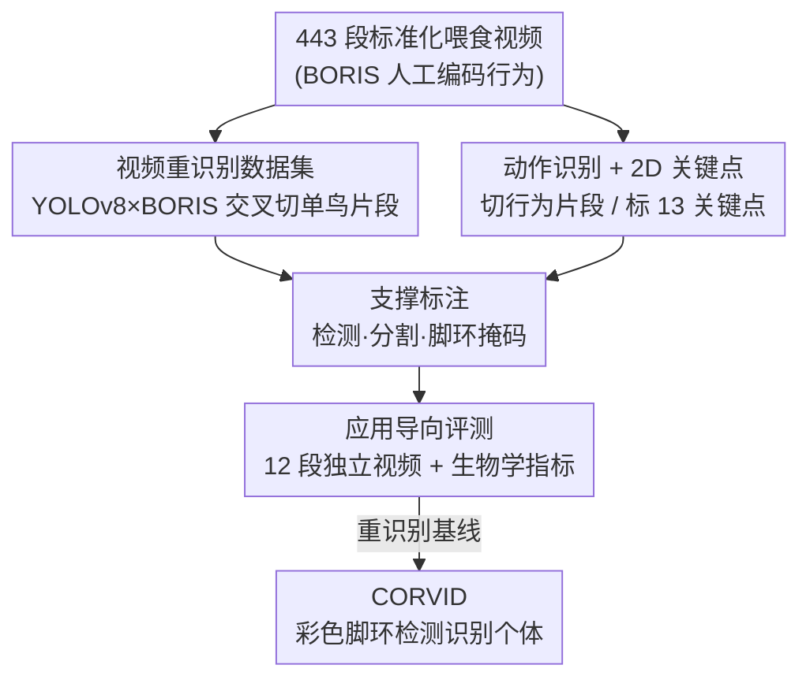

# CHIRP dataset: towards long-term, individual-level, behavioral monitoring of bird populations in the wild

**会议**: CVPR 2026  
**论文**: [CVF Open Access](https://openaccess.thecvf.com/content/CVPR2026/html/Chan_CHIRP_dataset_towards_long-term_individual-level_behavioral_monitoring_of_bird_populations_CVPR_2026_paper.html)  
**代码**: https://github.com/alexhang212/CHIRP_Dataset  
**领域**: 数据集 / 动物行为监测 / 个体重识别  
**关键词**: 野生鸟类监测, 个体重识别, 行为识别, 彩色脚环, 应用导向评测

## 一句话总结
为了让计算机视觉真正服务于野外鸟类的长期个体级行为监测，本文用瑞典拉普兰一个跨 9 年（2014–2022）的西伯利亚松鸦野生种群构建了 CHIRP 数据集（同时覆盖重识别、动作识别、2D 关键点、检测、实例分割五类任务），提出了一套以「喂食率 / 共现率」等生物学指标为核心的「应用导向评测」范式，并给出基线方法 CORVID——一条靠识别鸟腿彩色脚环来做个体识别的流水线，在「territory 约束」下重识别 Top-1 超过动物重识别基础模型 MegaDescriptor。

## 研究背景与动机
**领域现状**：行为往往是动物应对环境变化的第一反应，因此长期、连续地测量个体行为对行为生态学与保护生物学至关重要。近年计算机视觉被用来替代人工观察，从 2D/3D 姿态估计、动作识别到个体重识别都有不错进展，让生物多样性监测能够规模化、自动化。

**现有痛点**：作者点出两个具体障碍。其一，CV 研究习惯把检测、重识别、关键点估计当成各自独立的任务来解，但长期监测真正想回答的是「谁（who）做了什么行为（what）」——这要求重识别和行为识别**同时**被解决，还要靠检测、跟踪、关键点这些子任务托底，单任务方法很难直接拼起来部署。其二，传统评测把每个任务**孤立**打分（mAP、PCK 各算各的），但用户在选型时无从判断某个模型的误差会怎样传播到最终的生物学测量上，误差传播的不可预测性已被多个案例研究证实。

**核心矛盾**：CV 的「任务中心、孤立评测」范式，与生物学应用需要的「以最终生物学测量为目标、多任务联合」之间存在结构性错位——一个在 mAP 上更高的模型，未必能让「个体喂食率」估得更准。

**本文目标**：(1) 提供一份取自真实长期生物学研究、能同时支撑多类 CV 任务的数据集；(2) 设计一种直接以生物学指标衡量方法优劣的评测；(3) 给出一个能落地的重识别基线。

**切入角度**：西伯利亚松鸦是群居（群大小 2–7）、全年领域固定的鸦科鸟，每只鸟都佩戴铝环 + 2–3 个共 11 种颜色的彩色塑料脚环（最多 $11^3=1331$ 种组合），这是野外个体识别的通行做法且不受羽毛变化影响。作者敏锐地把这个「人类肉眼识别个体」的生物学线索直接搬给计算机视觉。

**核心 idea**：与其用深度度量学习去硬记每只鸟的外观，不如**显式检测并分类彩色脚环组合**来识别个体（CORVID）；同时把评测的落脚点从单任务指标改成「喂食率、共现率」这类下游生物学测量。

## 方法详解
本文是数据集论文，重心在「怎么从一个真实长期生物学研究里构建多任务标注 + 设计能反映部署效果的评测」，以及作为基线的 CORVID 流水线。

### 整体框架
CHIRP（**C**ombining be**H**aviour, **I**ndividual **R**e-identification and **P**ostures）的全部原始素材来自一套标准化行为录像协议：在每个鸟群的标准化喂食栖木处录 15–30 分钟视频（25fps，1920×1080），研究者用 BORIS 行为标注软件人工编码每只个体的喂食、屈服、驱逐等行为时间段。9 年间 443 段独立视频被用来制作数据集，每个样本都带采集日期以支持「时间感知」划分，且同一段行为视频的子样本绝不跨进同一划分（防背景泄漏）。

整条数据生产线围绕「who（谁在场）→ what（在做什么）→ 支撑标注 → 应用导向评测」组织：先用 YOLOv8 检测 + BORIS 人工标注交叉验证，自动切出单鸟片段做重识别；再切出行为片段做动作识别与关键点；再补检测/分割与脚环分割；最后单独留出 12 段从未出现过的视频做应用导向评测。

### 关键设计

**1. 五任务共数据的 CHIRP 数据集：让「who×what」在同一份真实数据上可解**

针对「单任务方法拼不起来」的痛点，CHIRP 不是再造一个孤立任务集，而是在同一个野生松鸦种群上同时给出五类标注。**视频重识别**含 16,190 段 1 秒（25 帧）片段、183 个个体（人均 89 段，32.42%/N=59 只鸟跨多年出现）；切片方式是先用 YOLOv8 在长视频里检测鸟，再用 BORIS 标注定位「只有 1 只鸟在场」的段落自动赋 ID，人工复核后剔除 8.3% 假阳性。**动作识别**含 1387 段短片，类别为 eat（啄食）、submissive（刻板抖翅）、others（警戒/休息/飞行）。**2D 关键点**含 879 张图、1176 个体实例、13 个关键点（36% 来自标准喂食视频，64% 来自地面觅食场景）。**支撑标注**包括 1156 帧 / 1669 个体的检测框与分割（用 SAM2 由框提示自动生成掩码，对 688 处人工标注验证平均 IoU 0.84）、以及 944 帧 / 2713 个脚环实例 / 12 色类的脚环框与分割。所有划分（除重识别外）取 80/20，且保证同一行为视频不跨划分。这套设计让「识别个体」与「识别行为」第一次能在同一份野外真实数据上被联合训练与评估。

**2. 三种重识别划分：把部署场景的差异直接编码进 benchmark**

野外重识别的难度高度依赖部署条件，作者据此设计三套划分（沿用 Wildlife Datasets 的定义）。**闭集（closed-set）**最贴近松鸦系统的真实用例——录像时研究者在场，新个体可随时加入 gallery，因此训练/测试集都含全部个体（80/20），任务是把测试片段匹配到训练里的个体。**不相交集（disjointed）**把约一半个体分给训练、一半给测试，用于检验跨系统泛化。**开集（open-set）**把 20% 个体设为「未知」、80% 为「已知」，模拟无人值守相机陷阱，任务先判定「已知/未知」再赋 ID。更关键的是，作者利用松鸦「领域固定、群成员稳定」的生物学特性，为每段视频提供两级元数据：领域内可能出现的个体短名单（N=2–4，均值 2.92）和加上邻居后的名单（N=9–25，均值 14.58）。这把领域知识变成了可调难度的约束，也为 CORVID 的「候选个体匹配」铺好了路。

**3. 应用导向评测：用「喂食率/共现率」而非 mAP 衡量方法**

这是全文的范式创新，针对「孤立任务评测无法反映下游影响」的核心矛盾。作者额外留出 12 段独立视频（35 个体，逐帧标注吃食行为、身份、检测框，同时充当 MOT 基准），并定义两层指标。**低层指标**：① 正确帧分配比例（被正确赋给个体的真值轨迹帧占比）；② 把视频切成 1 秒窗口，对个体啄食事件算 precision/recall/F1（同窗口内检出该个体啄食算 TP），再对个体平均。**高层生物学指标**：① 个体喂食率（次/分钟）；② 共现率（每对个体共处时长占视频总长比例）。对两个生物学量都报告绝对误差的均值/中位数/标准差与预测—真值的 Pearson 相关 $r$。这样一来，方法优化的目标从「单任务刷点」变成「让最终生物学测量更准」，并能直接暴露误差传播。

**4. CORVID：基于彩色脚环的视频重识别流水线**

作为应用导向评测的重识别基线，CORVID（**CO**lou**R**-based **VID**eo re-ID）放弃「用图像分类器死记外观」的路线，转而显式识别脚环颜色组合——这套思路的最大好处是**不依赖重识别训练集**，只要知道脚环组合就能泛化到任意新个体（前提是不引入新颜色）。流水线三步：(1) 用在脚环分割数据集上训练的 Mask2Former 实例分割模型检出每个脚环，裁剪后转 HSV、缩放到 20×20；(2) 把颜色直方图喂给随机森林，形式化为多类分类，对每个脚环输出各颜色的置信度（多类是为了容忍相近色）；(3) 匹配算法先按脚环中心点距离阈值把环配成「环对」，对每个环对颜色组合按随机森林概率求和，并在 25 帧上池化，得到颜色对的概率矩阵，最后结合该样本的「可能个体」元数据选出最可能的 ID。命名约定按鸟自身视角的「左上、左下、右上、右下」四环颜色拼成编码（如 oaor = 橙、铝、橙、红）。

### 一个完整示例
以一段 1 秒（25 帧）单鸟片段为例：Mask2Former 在各帧检出若干脚环掩码 → 每个掩码裁剪转 HSV、缩到 20×20 → 随机森林对某个环输出 `p:0.78, r:0.16, …`（橙 0.78、红 0.16 等）→ 按中心距离把检出的环配成「环对」，对每个颜色组合在 25 帧上累加概率得到颜色对概率矩阵 → 取该视频领域内候选名单（如 2–4 只鸟），把矩阵与各候选的已知脚环组合匹配打分 → 选概率最高者作为该片段的个体 ID。整个过程不用任何重识别训练样本，只要候选鸟的脚环组合在库里即可。

## 实验关键数据

### 主实验：视频重识别（Table 1）
CORVID 与动物重识别基础模型 MegaDescriptor（预训练 / 在 CHIRP 微调）对比，分三种 gallery 约束：Within Territory、+Neighbours、All。

| 方法 | 闭集 Within Terr. Top-1 | 闭集 All Top-1 | 不相交 Within Terr. Top-1 | 不相交 +Neigh. Top-1 |
|------|------|------|------|------|
| **CORVID** | **0.66** | 0.05 | **0.69** | **0.31** |
| Pre-trained Mega | 0.28 | **0.10** | 0.31 | 0.14 |
| Fine-tuned Mega | 0.27 | **0.10** | 0.41 | 0.13 |

关键发现：在「领域内 / 领域内+邻居」约束下 CORVID 明显领先（闭集 Within Territory Top-1 0.66 vs 0.28），说明显式利用脚环颜色优于深度度量学习；但当 gallery 放开到全部个体（All）时 CORVID 反而落后（0.05 vs 0.10）——它强依赖「领域内候选名单」这一生物学约束。

### 其他任务基线（Table 2/3）
| 任务 | 最佳模型 | 关键指标 |
|------|---------|---------|
| 动作识别 | C3D | Accuracy 0.72，F1 0.684（优于 SlowFast/X3D 的 0.548） |
| 2D 关键点 | ViTPose-large | Mean Error 7.77px，PCK@10 0.978，PCK@5 0.915 |

关键点各架构 PCK 普遍很高，说明标注质量足以训出可用的姿态模型支撑后续动作识别。

### 应用导向评测（Table 4/5）
把检测(YOLOv8)+跟踪(BoTSORT)+个体识别(CORVID / 微调 MegaDescriptor / 随机)+动作识别(C3D) 串成流水线，对比 ID 赋值方式：

| ID 方法 | 正确帧比例 ↑ | 啄食 F1 ↑ | 喂食率 Mean Err ↓ | 喂食率 r ↑ | 共现率 r ↑ |
|---------|------|------|------|------|------|
| **CORVID** | **0.647** | **0.537** | **9.00** | **0.582** | 0.654 |
| MegaDescriptor | 0.617 | 0.408 | 13.14 | 0.505 | 0.557 |
| Random | 0.331 | 0.327 | 9.35 | 0.437 | **0.799** |
| Human | — | — | 1.88 | 0.910 | 0.913 |

### 关键发现
- 任务级指标的差异确实会传播到应用级指标：CORVID 在重识别上更强，在喂食率/共现率上也更准，支持了「应用导向评测有意义」的论点。
- ⚠️ 令人意外：随机赋值在部分高层指标上反而最好（如共现率 r=0.799 高于 CORVID 0.654），且 MegaDescriptor 在所有高层生物学指标上都不如随机——说明单任务表现好不代表能部署，也暴露现有方法仍有大量改进空间。
- 所有流水线与人类基线（喂食率 Mean Err 1.88、r 0.910）相比误差仍然很大，恰恰凸显 CHIRP 作为「未解难题基准」的价值。

## 亮点与洞察
- **把生物学线索直接当 CV 特征**：脚环本是给人眼看的，作者第一个把它做成自动个体识别的依据，从而摆脱重识别训练数据、可泛化到任意已知组合的新个体——一个很「接地气」的迁移思路。
- **评测范式的转向**：用喂食率/共现率这类下游测量做评测，而非 mAP/PCK，直击「误差传播不可预测」的部署痛点；这个「application-specific benchmark」思路可迁移到医学、农业等任何「CV 只是中间环节」的场景。
- **诚实地报告反直觉结果**：随机赋值在某些生物学指标上胜过 SOTA 重识别模型，作者没有藏起来，反而用它论证「任务指标 ≠ 部署价值」，很有说服力。
- **时间感知 + 防泄漏划分**：每个样本带采集日期、同一视频不跨划分，为长期监测这种强时序场景立了规范。

## 局限与展望
- CORVID 强依赖「领域内候选名单」：一旦 gallery 放到全种群（All）就明显退化，无法用于无候选约束的被动相机陷阱；且不能区分「已知/未知」个体，所以开集划分上没法评测。
- 引入新颜色脚环就需要重训分割/分类，泛化边界受限于已见颜色集合。
- 所有方法离人类基线仍有数量级差距（喂食率误差 9 vs 1.88），说明这套「联合多任务的野外行为监测」远未解决，数据集更像一个开放挑战。
- 物种与场景单一（西伯利亚松鸦、标准化喂食栖木），跨物种/跨场景迁移仍待验证；⚠️ 随机基线在共现率上反超的现象也提示当前高层指标可能受样本分布影响，需谨慎解读。

## 相关工作与启发
- **vs Animal Kingdom**：后者覆盖 850 物种但素材来自 YouTube，方法对真实生物学研究的可用性未经验证；CHIRP 全部取自伦理审批的长期野外研究，标注同时支撑身份与行为。
- **vs LoTE-animal / Baboonland / 3D-POP / Bucktales**：这些来自真实研究但要么只做动作识别不含 re-id，要么只做群体跟踪/姿态不含个体活动；CHIRP 把 who 与 what 在同一数据上打通。
- **vs WILD / IndividualBirdID**：同样给鸟戴彩色脚环或用背部花纹，但都是「裁图喂分类器」，没显式利用脚环颜色；CORVID 第一个直接检测脚环颜色组合做识别。
- **vs ChimpACT**：同为长期个体级监测数据集，但只提供任务级评测，难判断单模型是否足以支撑长期个体监测；CHIRP 用应用导向评测补上这一环。

## 评分
- 新颖性: ⭐⭐⭐⭐ 数据集本身是单系统多任务集成，真正新的是「应用导向评测」范式与「脚环颜色识别个体」的 CORVID 思路。
- 实验充分度: ⭐⭐⭐⭐ 五任务都给了基线 + 三种划分 + 双层应用指标 + 人类基线，并诚实报告反直觉结果。
- 写作质量: ⭐⭐⭐⭐ 动机—痛点—方案逻辑清晰，图表完整；部分指标定义需查补充材料。
- 价值: ⭐⭐⭐⭐ 为「CV→生物学落地」提供了可复用蓝图，且明确指出现有方法离实用仍远，挑战性强。

<!-- RELATED:START -->

## 相关论文

- [\[AAAI 2026\] Predict and Resist: Long-Term Accident Anticipation under Sensor Noise](../../AAAI2026/others/predict_and_resist_long-term_accident_anticipation_under_sensor_noise.md)
- [\[CVPR 2025\] Effortless Active Labeling for Long-Term Test-Time Adaptation](../../CVPR2025/others/effortless_active_labeling_for_long-term_test-time_adaptation.md)
- [\[CVPR 2026\] Towards Stable Federated Continual Test-Time Adaptation in Wild World](towards_stable_federated_continual_test-time_adaptation_in_wild_world.md)
- [\[ACL 2025\] USDC: A Dataset of User Stance and Dogmatism in Long Conversations](../../ACL2025/others/usdc_a_dataset_of_underlineuser_underlinestance_and_underlinedogmatism_in_long_u.md)
- [\[ACL 2025\] In Prospect and Retrospect: Reflective Memory Management for Long-term Personalized Dialogue Agents](../../ACL2025/others/in_prospect_and_retrospect_reflective_memory_management_for_long-term_personaliz.md)

<!-- RELATED:END -->
