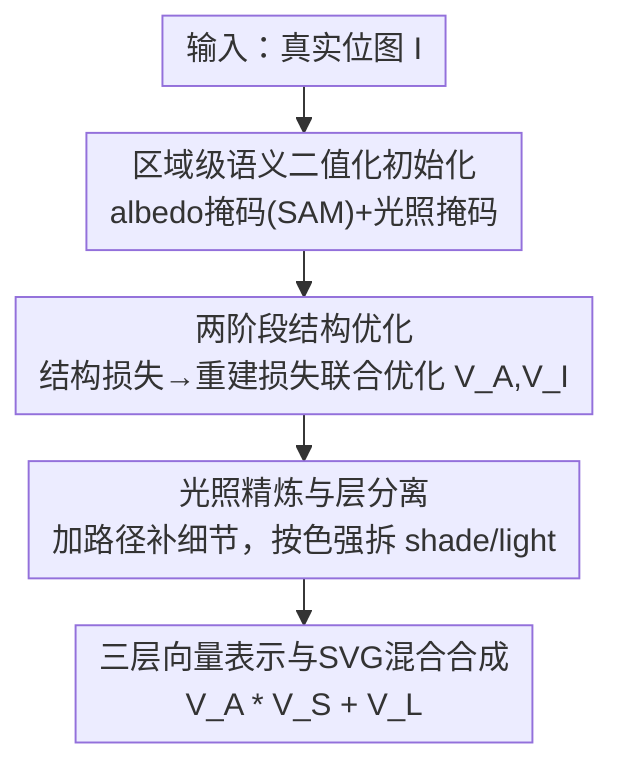

# Clair Obscur: an Illumination-Aware Method for Real-World Image Vectorization

**会议**: CVPR 2026  
**论文**: [CVF Open Access](https://openaccess.thecvf.com/content/CVPR2026/html/Lin_Clair_Obscur_an_Illumination-Aware_Method_for_Real-World_Image_Vectorization_CVPR_2026_paper.html)  
**代码**: 未公开  
**领域**: 图像矢量化 / 内禀图像分解 / 可微渲染  
**关键词**: 图像矢量化, SVG, 内禀分解, 光照感知, 可微渲染

## 一句话总结
COVec 把"明暗法（Clair-Obscur）"的光影对比思想引入图像矢量化，首次在向量域里做内禀图像分解——把一张真实照片拆成 albedo（反照率）、shade（阴影）、light（高光）三个语义连贯的 SVG 图层，靠区域级语义二值化初始化 + 两阶段可微渲染优化得到，既保真又把图层数压得很少，从而真正可编辑。

## 研究背景与动机

**领域现状**：图像矢量化要把位图转成由几何基元（多边形、贝塞尔曲线）组成的、可缩放可编辑的 SVG。现有方法分两类：基于数据集的（SVG-VAE、DeepSVG、StarVector）学一个生成模型，但受限于数据稀缺、对真实照片泛化差、常吐出残缺甚至空的 SVG；基于优化的（DiffVG、LIVE、O&R、LayerVec）直接用可微光栅化器把向量基元拟合到目标图，通用性强、不需训练数据，是目前真实图像矢量化的主流。

**现有痛点**：图标、emoji 这类色块干净的图好办，但真实照片有丰富的光照、阴影、高光导致的色调变化。为了逼近这些连续的明暗渐变，现有方法只能堆大量碎片化的小形状去近似，结果是**路径冗余、语义碎裂**——一张脸可能被切成几百个互不相干的色块，既丧失了"用少量连贯形状表达图像"的语义简洁性，又让 SVG 几乎无法编辑（改一个颜色要动几十条路径）。

**核心矛盾**：现有图层分解方法（LIVE 自底向上加路径、O&R 自顶向下剪枝、LayerVec 由粗到细）几乎都在 **RGBA 叠加**框架里工作——光照信息被隐式地塞进了颜色区域里。颜色和光照纠缠在一起，导致无论怎么分层都得用碎片路径去近似明暗渐变，简洁性和保真度二者不可兼得。

**切入角度**：作者从两个观察出发——其一是绘画里的明暗法（Clair-Obscur）：艺术家在同一语义区域（皮肤、头发）内用色调变化来表达光影和体积感，而不是把区域切碎；其二是内禀图像分解（intrinsic image decomposition）近年已能把图像拆成 albedo + 光照分量。把这两者合起来：**显式地把颜色和光照解耦成不同图层**，每层内部用连贯形状，就能同时拿到简洁性和保真度。

**核心 idea**：首次把内禀图像分解搬进向量域——用一个统一的 SVG 表示，把图像分成 albedo / shade / light 三层，借助 SVG 原生的 multiply（正片叠底）和 plus-lighter（线性减淡）混合模式来合成光影，从而做到既语义简洁又光照一致、且天然可分层编辑。

## 方法详解

### 整体框架

COVec 的目标：给定一张真实位图 $I$，输出一个由 albedo、shade、light 三层向量路径组成的统一 SVG，使得三层按内禀成像模型合成后能高保真还原 $I$，且每层内部都是少量连贯形状。

理论基石是扩展的内禀成像模型——一个像素由"反照率乘以阴影、再加上加性光照"构成：

$$I = A * S + L$$

作者把它搬到向量域，目标 SVG 表示为三个向量图层的合成：

$$V_{final} = V_A * V_S + V_L$$

其中 $V_A$（albedo 层）是不随光照变化的本征表面色，$V_S$（shade 层）建模光的几何衰减、用 multiply 模式与 albedo 相乘变暗，$V_L$（light 层）建模高光/反射等加性光照、用 plus-lighter 模式叠加。每一层 $V_*$ 是一组参数化向量路径 $V_* = \sum_n \theta_n$，每条路径 $\theta_n = \{P_n, C_n, \tau_n\}$ 由几何形状 $P_n$、填充色 $C_n$、不透明度 $\tau_n$ 定义。

直接优化三层耦合太强难收敛，作者借简化的 Lambertian 假设，**先把目标降为两层**——albedo 层 $V_A$ 和把阴影+高光合在一起的"光照层" $V_I$，联合优化 $V_{final} = V_A * V_I$；之后再固定 $V_A$ 精炼 $V_I$，最后才把 $V_I$ 拆成 shade 和 light。整条流水线是一个由粗到细的过程：层初始化 → 结构优化 → 光照精炼与层分离 → 三层 SVG 合成。

### 关键设计

**1. 区域级语义二值化初始化：让光照层的起点对齐物体边界**

好的初始化能大幅减少优化时间并稳定层分离，但两层要用不同策略起步。albedo 层先用现成内禀分解模型 [3] 得到 albedo map，再在其上跑预训练分割模型 SAM 提取与光照无关的语义掩码 $\{m^A_i\}$，作为 $V_A$ 的向量区域；这一步相对常规。真正的创新在光照层 $V_I$ 的初始化：它需要先估出阴影区域，但作者观察到**阴影强度在图像不同区域是不一样的**，全图用一个统一阈值二值化会把明暗不均的区域切得乱七八糟。于是提出区域级语义二值化——不在全图上设阈，而是**在每个语义掩码内部独立设阈**。对每个 albedo 掩码 $m^A_i$，阈值取该区域内像素强度的均值：

$$T_i = \frac{1}{|m^A_i|}\sum_{p \in m^A_i} I(p)$$

落在 $m^A_i$ 内且满足 $I(p) \le T_i$ 的像素被判为阴影像素，组成光照掩码；区域外的像素直接忽略，保证二值化只在有意义的物体区域内发生。这样得到的阴影边界天然贴合各物体几何，比 OTSU、自适应、全局阈值都更干净。拿到两层掩码后，按 LayerVec 的 back-to-front 顺序组织成层级掩码组（大掩码垫底、小掩码叠上避免遮挡），用 Douglas–Peucker 算法简化边界点，再把每个掩码转成闭合三次贝塞尔轮廓。

**2. 两阶段结构优化：先稳几何，再联合还原颜色**

初始化只给了形状，还得让两层向量在可微渲染下既保持几何结构、又共同还原出目标颜色。作者用两个独立优化器分别管 $V_A$ 和 $V_I$，跑一个两阶段（各 50 epoch）的 schedule。warm-up 阶段每层只被自己的结构损失监督 $L_A = L^A_{struct}$、$L_I = L^I_{struct}$，让向量路径稳稳贴合各自的初始化掩码。结构损失对每个路径组 $I^{group}_j$ 与其掩码组 $I^{mask}_j$ 计算：

$$L_{struct} = \sum_{j=1}^{N}\Big( \|I^{mask}_j - I^{group}_j\|_2^2 + \lambda \sum_{p} \mathrm{ReLU}(\delta - \alpha(p)) \Big)$$

第一项是逐像素 MSE 做形状对齐，第二项（$\lambda = 10^{-8}$）惩罚同组内向量路径的过度自重叠（$\alpha(p)$ 为像素透明度、$\delta$ 为重叠容忍阈值），把每组逼向紧凑、不冗余的几何。warm-up 后 50 epoch 切到共享的重建损失，两层一起对齐目标图：

$$L_{recon} = \|I - R(V_A) * R(V_I)\|_2^2$$

其中 $R(\cdot)$ 是可微渲染算子 [18]，注意这里两层是 multiply 关系。"先各自稳几何、再联合还原色"这个顺序很关键：直接联合优化会因耦合太强不稳，先用结构损失把形状钉住，重建损失才有一个稳定的几何底座去调颜色。

**3. 光照精炼与层分离：补细节后再把光照拆成阴影与高光**

两阶段优化只得到光照层的"基底"，还缺细粒度的明暗细节。精炼阶段固定 $V_A$ 和已有的光照基底，**只往 $V_I$ 里增量加新路径**——沿用 LIVE 的策略，把新路径插到重建误差大的区域，且只优化新加路径、旧路径冻结，损失仍是重建误差 $L_{refine} = \|I - R(V_A) * R(V_I)\|_2^2$；同时按 LayerVec 周期性做向量清理（合并/删冗余路径）保持表示紧凑。精炼完，再把光照层 $V_I$ 拆成 shade 层 $V_S$ 和 light 层 $V_L$，判据是**每条路径填充色的强度**：颜色值落在归一化 $[0,1]$ 内的归 shade 层，超出 $[0,1]$ 的被识别为高光、归 light 层。拆分时所有路径控制点不变；shade 路径直接继承 $V_I$ 的形状和颜色；但 light 层用的是加性混合，颜色不能照搬，需从残差里重算——先算残差图 $I - R(V_A) * R(V_S)$，每条 light 路径的最终颜色取它覆盖区域内残差像素的均值。这样高光的颜色就对应"减掉反照率和阴影后剩下的那部分光"。

**4. 三层向量表示与 SVG 混合合成：把内禀分解落成可编辑的统一 SVG**

前面三步产出了 albedo、shade、light 三组向量路径，最后按内禀成像模型 $V_{final} = V_A * V_S + V_L$ 合成为一个统一 SVG。关键是这里**不靠后处理叠图，而是直接用 SVG 原生的混合模式**：shade 用 multiply 与 albedo 相乘实现变暗，light 用 plus-lighter 加性叠加实现高光。这是 COVec 与所有像素域内禀分解方法的根本区别——后者把 albedo/shading 输出成独立的栅格图，得在 PS 等专业软件里手动合成；而 COVec 一份 SVG 就自带合成关系，且三层语义清晰、各自连贯。直接的好处是**层级可编辑**：只给 albedo 层换色、保持 shade/light 不动，整体光影结构就自然保持，混合机制会让光照颜色自动适配新的反照率色调——这正是把"颜色与光照解耦"做到位后才换来的编辑自由度。

### 损失函数 / 训练策略
PyTorch + Adam，控制点学习率 1.0、颜色参数学习率 0.01；结构优化两阶段各 50 epoch（warm-up 用 $L_{struct}$，后段用 $L_{recon}$）；精炼阶段用 $L_{refine}$。所有实验在 4 张 NVIDIA L40S 上完成。对 emoji 这类无复杂光照的简单图，用退化版 COVec——只优化单个 albedo 层、不引入 light/shade，相当于带本文初始化策略的 LayerVec 流程。

## 实验关键数据

> ⚠️ 论文的定量结果（MSE / LPIPS）以"随路径数变化的曲线图"（Fig.7）呈现，正文未给具体数值表；下表是对其结论与对比设置的归纳，非原文数字表。

### 主实验

数据集：自建三套各 100 张——Face（来自 FFHQ）、Scene（Things + TID2013，含物体/动物/自然场景）两套是复杂真实图，Emoji（Noto Emoji）是简单图。对比四个代表性方法 DiffVG、LIVE、O&R、LayerVec（其中 LayerVec 是分层矢量化当前 SOTA），统一用贝塞尔曲线基元、同样学习率。

| 对比维度 | 既有方法（LIVE/O&R/LayerVec 等） | COVec（本文） |
|--------|--------|--------|
| 分解框架 | RGBA 叠加，光照隐含在颜色里 | 内禀分解：albedo/shade/light 三层显式解耦 |
| 合成方式 | 路径色块直接叠 | SVG 原生 multiply + plus-lighter 混合 |
| 真实图细节（毛发/眼睛/嘴） | 靠冗余碎片路径近似 | 紧凑对齐形状准确表达 |
| 同路径预算下保真度（MSE/LPIPS） | 较高误差 | 多数情况下最低，用更少路径达到相当或更好 |
| 可编辑性（改色需动的路径数） | 多，且改色会破坏光照 | 极少路径即可，光照结构保持 |

### 消融实验

| 配置 | 现象 | 说明 |
|------|---------|------|
| Full（albedo初始化 + 区域级语义二值化 + 双损失） | 几何平滑、颜色忠实、层分离清晰 | 完整模型 |
| w/o albedo-map 初始化 | 本征色与光照纠缠，分不开 | albedo map 提供光照不变的结构先验 |
| 全局阈值 / OTSU / 自适应 二值化 | 阴影区与物体语义不对齐，碎裂 | 像素级阈值忽略区域差异 |
| w/o 重建损失 $L_{recon}$ | 几何稳但颜色还原不准 | 缺重建约束色彩失真 |
| w/o 结构损失 $L_{struct}$ | 边界不规则、区域碎裂 | 缺结构约束几何不稳 |

### 关键发现
- **区域级语义二值化是初始化质量的关键**：相比全局/OTSU/自适应阈值，按语义区域分别设阈让阴影边界贴合物体几何，初始化更干净，下游优化更稳——这是论文重点验证的消融。
- **两个损失各司其职、缺一不可**：去掉 $L_{recon}$ 颜色失真但几何还在，去掉 $L_{struct}$ 颜色还原但几何碎裂；只有二者联合才同时拿到平滑几何与忠实颜色。
- **简洁性直接转化为可编辑性**：因为颜色与光照解耦，只改 albedo 层 1~16 条路径就能把整图自然过渡到目标外观，而基线因路径冗余、颜色光照纠缠，改一小撮路径难以达到目标。
- **退化版兼容简单图**：emoji 上去掉光照层退化成 LayerVec-like 流程，仍靠本文初始化拿到与 LayerVec 相当的轮廓，说明框架在简单场景不会反伤。

## 亮点与洞察
- **把绘画的"明暗法"翻译成可微优化目标**：Clair-Obscur 是"在同一语义区域内用色调变化表达光影"，COVec 用三层分解 + SVG 混合模式把这个直觉落成了 $V_A * V_S + V_L$ 的可优化公式，是一个漂亮的"艺术原理 → 工程表示"的映射。
- **借用 SVG 原生混合模式做合成**，而不是自己实现叠图——multiply 天然适合阴影、plus-lighter 天然适合高光，使分解结果开箱即可编辑，这是相比像素域内禀分解（输出独立栅格图、得手动合成）最实用的差异点。
- **light 层颜色从残差重算**这个细节很巧：因为加性混合下高光颜色不能照搬光照层，作者用 $I - R(V_A)*R(V_S)$ 的残差均值反推，保证了三层合成自洽。
- **"先降到两层、再拆回三层"的解耦优化**思路可迁移：当目标变量强耦合时，先合并简化优化、再按物理判据（这里是颜色强度是否超 $[0,1]$）拆开，是处理多分量分解的通用 trick。

## 局限与展望
- **强依赖外部预训练模块**：albedo 来自内禀分解模型 [3]、掩码来自 SAM，这两者在复杂/低质真实图上的误差会直接传导到向量层，论文未分析其鲁棒性。
- **层分离判据偏启发式**：用"填充色是否超出 $[0,1]$"区分 shade/light 是个硬阈值规则，对介于阴影与高光之间的中间调可能误判，⚠️ 论文未给该判据的定量评估。
- **定量结果只有曲线、缺数值表**：MSE/LPIPS 以图呈现，难以精确复现各路径预算下的提升幅度；且编辑性实验依赖 Gemini 2.5 生成参考图来定位改色区域，引入了额外不可控变量。
- **简单图需手动切到退化版**：是否用光照层要人工按图像复杂度决定，缺一个自动判别机制。

## 相关工作与启发
- **vs LayerVec**: 都用语义引导、由粗到细的分层矢量化，本文沿用了它的 back-to-front 掩码组织和向量清理；区别在 LayerVec 仍在 RGBA 叠加框架里、光照隐含在颜色中，COVec 把光照显式拆成 shade/light 两层并用 SVG 混合模式合成，因此真实图上更简洁、更可编辑。
- **vs LIVE / O&R**: LIVE 自底向上加路径、O&R 自顶向下剪枝，都在单一 RGBA 表示上逼近明暗渐变，必然产生冗余碎片；COVec 借了 LIVE 的"在高误差区加路径"做精炼，但整体是内禀分解的多层表示，从根上避免了用碎片近似光照。
- **vs 像素域内禀分解（Careaga & Aksoy 等）**: 思想同源——都把图像拆成 albedo + 光照分量，但前者纯在像素域、输出独立栅格图需手动合成；COVec 首次把这套分解搬进向量域，得到一份自带合成关系、可缩放可编辑的统一 SVG。

## 评分
- 新颖性: ⭐⭐⭐⭐⭐ 首次把内禀图像分解引入向量域，把明暗法落成可微的三层 SVG 表示，角度新且自洽。
- 实验充分度: ⭐⭐⭐⭐ 三套数据集 + 四个基线 + 多项消融较完整，但定量只给曲线无数值表、编辑实验引入 LLM 参考图变量。
- 写作质量: ⭐⭐⭐⭐ 动机（艺术原理）讲得清晰，公式与流水线交代到位，几处判据/超参缺定量支撑。
- 价值: ⭐⭐⭐⭐ 真实图矢量化的可编辑性是实际痛点，层级解耦带来的"少路径精确改色"很有应用价值。

<!-- RELATED:START -->

## 相关论文

- [\[CVPR 2026\] Crowdsourcing of Real-world Image Annotation via Visual Properties](crowdsourcing_of_real_world_image_annotation_via_visual_properties.md)
- [\[CVPR 2026\] UniMERNet: A Universal Network for Real-World Mathematical Expression Recognition](unimernet_a_universal_network_for_real-world_mathematical_expression_recognition.md)
- [\[CVPR 2026\] Towards Stable Federated Continual Test-Time Adaptation in Wild World](towards_stable_federated_continual_test-time_adaptation_in_wild_world.md)
- [\[CVPR 2026\] Prototype-based Causal Intervention for Multi-Label Image Classification](prototype-based_causal_intervention_for_multi-label_image_classification.md)
- [\[CVPR 2026\] Advancing Image Classification with Discrete Diffusion Classification Modeling](advancing_image_classification_with_discrete_diffusion_classification_modeling.md)

<!-- RELATED:END -->
