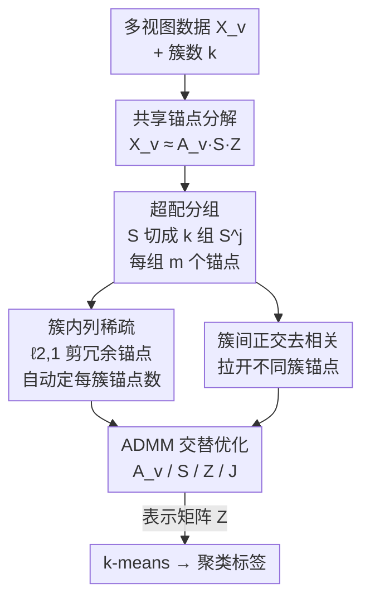

# Cluster-aware Anchor Learning for Multi-View Clustering

**会议**: CVPR 2026  
**论文**: [CVF Open Access](https://openaccess.thecvf.com/content/CVPR2026/html/Chen_Cluster-aware_Anchor_Learning_for_Multi-View_Clustering_CVPR_2026_paper.html)  
**代码**: 未公开  
**领域**: 多视图聚类  
**关键词**: anchor learning, 多视图子空间聚类, ℓ2,1 列稀疏, 簇感知锚点, 正交去相关  

## 一句话总结
针对锚点式多视图聚类"全局固定锚点数、对每个簇一视同仁"的弊病，CAL 把共识锚点矩阵按簇切成 k 组，对每组施加列稀疏惩罚自动决定该簇保留几个锚点，再用簇间正交正则拉开不同簇的锚点，在 8 个 benchmark 上 ACC/NMI 全面超越 10 个 SOTA。

## 研究背景与动机
**领域现状**：多视图聚类（MVC）里子空间方法是主流——给每个视图学一个自表示矩阵 $\mathbf{Z}_v\in\mathbb{R}^{n\times n}$ 再做谱聚类。但构造 $n\times n$ 亲和图要 $O(n^3)$ 时间、$O(n^2)$ 内存，样本一多就跑不动。为此 anchor-based 策略被引入：从 $n$ 个样本里挑/学一小撮 $l$ 个锚点，用"锚点—样本"关系矩阵替代稠密自表示，复杂度随 $n$ 线性增长。

**现有痛点**：锚点的质量直接决定表示矩阵、进而决定聚类结果，但几乎所有方法都**先验地固定锚点总数** $l$，要么取 $l=k$（簇数），要么取 $k$ 的某个小倍数，并且**隐含假设每个簇需要的锚点一样多**。现实里簇与簇之间在规模、密度、信息丰富度、内部结构上差异极大——复杂的簇被分配的锚点不够（信息丢失），简单的簇又被塞太多锚点（冗余），两头都拉低锚点质量。

**核心矛盾**：锚点预算是"全局一刀切"的，而真实数据的最优锚点数是"逐簇异质"的。已有的自适应工作（如按视图选锚点数的 3AMVC）只做到了 view-specific，没人在**簇（class）这一粒度**上去学每个簇该留几个锚点。

**本文目标**：在一个统一优化框架里，自适应地决定**每个簇**保留多少个有效共识锚点。

**切入角度**：与其去"挑"锚点数，不如先**故意超额分配**——给每个簇先发 $m$ 个锚点（共 $mk$ 个），再用结构化稀疏把多余的列"压到零"，剩下没被压掉的就是该簇真正需要的锚点。删减比挑选更可微、更好优化。

**核心 idea**：把共识锚点矩阵按簇分组 + 组内列稀疏自动定锚点数 + 组间正交拉开判别性，用"先超配再剪枝"替代"先固定再学习"。

## 方法详解

### 整体框架
CAL 的输入是 $V$ 个视图的数据 $\{\mathbf{X}_v\}_{v=1}^{V}\in\mathbb{R}^{d_v\times n}$ 和簇数 $k$，输出是表示矩阵 $\mathbf{Z}$ 上做 k-means 得到的聚类标签。它沿用经典锚点式 MVSC 的分解骨架 $\mathbf{X}_v\approx\mathbf{A}_v\mathbf{S}\mathbf{Z}$：$\mathbf{A}_v\in\mathbb{R}^{d_v\times mk}$ 是第 $v$ 个视图的正交投影，$\mathbf{S}\in\mathbb{R}^{mk\times mk}$ 是跨视图共享的**共识锚点矩阵**，$\mathbf{Z}\in\mathbb{R}^{mk\times n}$ 是表示矩阵。因为 $\mathbf{S}$ 是所有视图共享的，它天然同时吸收了跨视图一致性和视图特异互补性（在锚点层做融合）。

关键转折在于：CAL 不再让锚点数 $l=k$，而是**超配到 $mk$**，然后把 $\mathbf{S}$ 的列按簇切成 $k$ 个连续分组 $\mathbf{S}=[\mathbf{S}^1,\dots,\mathbf{S}^k]$，每组 $\mathbf{S}^j\in\mathbb{R}^{mk\times m}$ 专属一个簇。在每组内用 $\ell_{2,1}$ 列稀疏剪掉冗余锚点（自动定该簇的锚点数），同时在组间加正交去相关让不同簇的锚点互不相似。最后整套用 ADMM 交替求解，每个子问题都有闭式解或标准求解器。

### 关键设计

**1. 超配分组：把"全局固定锚点数"改成"每簇一组、留多少待定"**

这一步直接针对"先验固定 $l$、各簇一刀切"的痛点。CAL 不去预测每个簇需要多少锚点（那是个难优化的离散量），而是先**慷慨地给每个簇分 $m$ 个锚点**，总数 $mk$，然后把学到的共识锚点矩阵的列按簇切成 $k$ 个连续子块
$$\mathbf{S}=[\mathbf{S}^1,\mathbf{S}^2,\dots,\mathbf{S}^j,\dots,\mathbf{S}^k],\quad \mathbf{S}^j\in\mathbb{R}^{mk\times m}.$$
每个 $\mathbf{S}^j$ 的 $m$ 列就是第 $j$ 簇的候选锚点。这样"每簇该有几个锚点"从一个需要预设的超参，变成了一个由后续稀疏惩罚**在优化中自动确定**的结果——$m$ 只是上界，真正保留几个由数据说了算（实验显示 $m\ge 5$ 后性能就稳定，对 $m$ 不敏感）。

**2. 簇内 ℓ2,1 列稀疏：让每个簇自己决定保留几个锚点**

有了分组，怎么"剪"？CAL 对每个子块的转置施加 $\ell_{2,1}$-范数惩罚：
$$\big\|(\mathbf{S}^j)^{T}\big\|_{2,1}=\sum_{t=1}^{m}\big\|\mathbf{S}^j_{(:,t)}\big\|_2,$$
其中 $\mathbf{S}^j_{(:,t)}$ 是该簇第 $t$ 个锚点对应的列。$\ell_{2,1}$ 是"组稀疏"算子——它会把整条不重要的锚点列**整体压到零**，而不是零散地稀疏化元素，从而只保留每个簇里最具判别性的那几列锚点。被压到零的列就等于"这个簇不需要这个锚点"，于是该簇的有效锚点数被自动选出来，且各簇可以不同（异质收缩）。这正是把"固定锚点数"替换成"簇级稀疏学习"的核心机制。

**3. 簇间正交去相关：拉开不同簇的锚点，增强可分性**

光让每簇留下精炼锚点还不够——如果不同簇的锚点彼此很像，表示矩阵的块结构就糊了。CAL 对每一对锚点子块 $(\mathbf{S}^j,\mathbf{S}^h)$ 加一个去相关正则：
$$\sum_{1\le j\neq h\le k}\big\|(\mathbf{S}^j)^{T}\mathbf{S}^h\big\|_F^2.$$
最小化它会把不同簇的锚点组推向相互正交（低互相关），相当于显式鼓励"每个簇用自己一套、和别人不重叠的锚点去描述"，从而强化簇间判别性、让 $\mathbf{Z}$ 呈现更干净的块（簇）结构。消融里这一项单独加上去（变体 iii）就已显著超过 backbone，且和稀疏项互补。

把三件事合到一起，CAL 的总目标函数为：
$$
\min_{\mathbf{A}_v,\mathbf{S},\mathbf{Z}}\ \sum_{v=1}^{V}\big\|\mathbf{X}_v-\mathbf{A}_v\mathbf{S}\mathbf{Z}\big\|_F^2
+\lambda_1\sum_{j=1}^{k}\big\|(\mathbf{S}^j)^T\big\|_{2,1}
+\lambda_2\sum_{1\le j\neq h\le k}\big\|(\mathbf{S}^j)^{T}\mathbf{S}^h\big\|_F^2
+\lambda_3\|\mathbf{Z}\|_F^2,
$$
约束为 $\mathbf{A}_v^T\mathbf{A}_v=\mathbf{I},\ \mathbf{Z}\ge0,\ \mathbf{Z}^T\mathbf{1}=\mathbf{1}$。第一项是共享锚点重构；$\lambda_1$ 项做簇内剪枝；$\lambda_2$ 项做簇间去相关；$\lambda_3\|\mathbf{Z}\|_F^2$ 正则化表示矩阵。

### 损失函数 / 训练策略
因为 $\ell_{2,1}$ 项不可微，CAL 引入辅助变量 $\mathbf{J}^j$（约束 $(\mathbf{S}^j)^T=(\mathbf{J}^j)^T$）写成增广拉格朗日，用 ADMM 交替更新，每个子问题都有干净解法：

- **更新 $\mathbf{A}_v$**：固定其他变量后退化为带正交约束的 $\max_{\mathbf{A}_v}\mathrm{Tr}(\mathbf{A}_v^T\mathbf{X}_v\mathbf{Z}^T\mathbf{S}^T)$，最优解由 $\mathbf{X}_v\mathbf{Z}^T\mathbf{S}^T$ 的 SVD 给出 $\mathbf{A}_v^*=\mathbf{U}\mathbf{V}^T$。
- **更新 $\mathbf{S}$**：对每个分组求导置零后得到一个 **Sylvester 方程**，用标准 Sylvester 求解器解出 $\mathbf{S}^j$ 再拼回。
- **更新 $\mathbf{Z}$**：在 $\mathbf{Z}\ge0,\ \mathbf{Z}^T\mathbf{1}=\mathbf{1}$ 约束下逐列求解一个二次规划（QP），$\mathbf{G}=2(V\mathbf{S}^T\mathbf{S}+\lambda_2\mathbf{I})$。
- **更新 $\mathbf{J}^j$**：$\ell_{2,1}$ 最小化算子有闭式软阈值解——令 $\mathbf{M}=\frac{\mathbf{P}^j}{\mu}+(\mathbf{S}^j)^T$，则当 $\|\mathbf{M}_{:,i}\|_2>\frac{\lambda_1}{\mu}$ 时按 $\frac{\|\mathbf{M}_{:,i}\|_2-\lambda_1/\mu}{\|\mathbf{M}_{:,i}\|_2}\mathbf{M}_{:,i}$ 收缩，否则置零（这步直接实现"整列剪枝"）。
- **更新乘子 $\mathbf{P}^j$ 与 $\mu$**：$\mathbf{P}^j\leftarrow\mathbf{P}^j+\mu((\mathbf{S}^j)^T-(\mathbf{J}^j)^T)$，$\mu\leftarrow\min(\rho\mu,\mu_{\max})$。

整体复杂度 $O(m^3k^3n+m^2k^2n+m^2kn+mk^2dn+mdkn)$，因 $mk\ll n$ 故随样本量 $n$ 线性，保住了锚点法的可扩展性。$\lambda_1,\lambda_2,\lambda_3$ 在 $\{10^{-4},\dots,10^{4}\}$ 上网格搜索；收敛通常 15 轮内完成。

## 实验关键数据

### 主实验
8 个 benchmark（样本量从 210 到 63,896），对比 10 个 SOTA。下表摘 ACC（节选数据集，加粗为本文）：

| 数据集 | FPMVS | 3AMVC | CAMVC | ALPC | CAL（本文） | 较次优提升 |
|--------|-------|-------|-------|------|------|------|
| MSRC | 0.6048 | 0.6200 | 0.9190 | 0.8286 | **0.9429** | +2.39% |
| Dermatology | 0.8408 | 0.5750 | 0.9330 | 0.9469 | **0.9721** | +2.52% |
| 100Leaves | 0.3513 | 0.3378 | 0.7500 | 0.7516 | **0.8300** | +7.84% |
| OutdoorScene | 0.6693 | 0.5336 | 0.6514 | 0.7199 | **0.7716** | +5.17% |
| ALOI | 0.3318 | 0.4965 | 0.5987 | 0.0968 | **0.7417** | +11.97%* |
| YTF20 | 0.6965 | 0.6253 | 0.7648 | 0.7432 | **0.8172** | +3.45% |

NMI 同样领先：Dermatology 0.9407、100Leaves 0.9390、ALOI 0.8574、YTF20 0.8385，多数数据集为最优。在 ALOI 这种类间结构高度异质的数据上提升最猛（ACC +11.97%），正好印证"逐簇自适应锚点"对异质簇结构的价值。⚠️ ALOI 上 ALPC 仅 0.0968 异常偏低，"较次优提升"以表中第二高方法计为准。

### 消融实验
在 MSRC / Dermatology / HW 上拆三个变体（ACC）：

| 配置 | MSRC | Dermatology | HW | 说明 |
|------|------|------|------|------|
| (i) Backbone（无稀疏无去相关） | 0.6524 | 0.6508 | 0.4930 | 共享锚点重构基线 |
| (ii) + 列稀疏 | 0.8429 | 0.9358 | 0.9045 | 加簇内 ℓ2,1 剪枝 |
| (iii) + 簇间去相关 | 0.9143 | 0.9609 | 0.9285 | 加正交正则 |
| **(Full) CAL** | **0.9429** | **0.9721** | **0.9405** | 两者互补 |

### 关键发现
- **两个模块都有效且互补**：单加列稀疏（ii）在 HW 上把 ACC 从 0.4930 拉到 0.9045（+41 个点），单加去相关（iii）也稳定超 backbone；合在一起 Full 全面最优——说明"自适应剪锚点"和"拉开簇间锚点"解决的是两个正交问题。
- **去相关项贡献意外地大**：变体 iii（只加正交）在三个数据集上都超过变体 ii，说明簇间可分性是这类锚点法之前被低估的瓶颈。
- **对 $m$ 几乎不敏感**：$m\ge5$ 后 ACC 即稳定，可视化（Fig.5/6）显示不同簇收缩出的有效锚点数确实不同（异质收缩），直接佐证"逐簇锚点数"假设。
- **收敛快**：前 3–5 轮因随机初始化略有波动，之后 15 轮内目标值稳定。

## 亮点与洞察
- **"先超配再剪枝"是个很可迁移的范式**：把难优化的"离散锚点数选择"转化为连续的列稀疏问题，$\ell_{2,1}$ 的整列归零特性天然对应"删掉一个锚点"，比直接搜锚点数优雅得多——这个思路能迁到任何"该用几个原型/几个专家"的离散预算问题。
- **首个在簇粒度自适应锚点数的 MVSC**：以往自适应工作止步于 view-specific，CAL 把粒度下沉到 class-level，且统一在一个优化里完成。
- **每个子问题都有闭式/标准解**（SVD、Sylvester、QP、软阈值），ADMM 落地干净，没有难调的内层迭代，工程上好复现。
- **组间正交正则单拎出来就涨点明显**，提示后续锚点法可以把"锚点判别性"当一等公民来设计，而非只盯着重构误差。

## 局限与展望
- **复杂度对 $k$ 敏感**：总复杂度含 $O(m^3k^3n)$ 项，簇数 $k$ 很大时（如 100Leaves 有 100 类）QP 求解成本会显著上升，论文未给大 $k$ 下的运行时间对比。⚠️ 缺时间/内存的实测曲线，"线性于 $n$"主要是理论分析。
- **仍需预设 $m$ 和簇数 $k$**：虽然对 $m$ 不敏感，但 $k$ 仍是已知前提，未触及"簇数未知"的更难设定。
- **三个 $\lambda$ 靠网格搜索**：虽称对超参鲁棒，但仍是逐数据集调参，缺自适应定 $\lambda$ 的机制。
- **可改进方向**：把列稀疏换成更强的结构（如同时对锚点和样本端做双向稀疏）、或把 $k$ 也纳入学习，向"全自适应"再走一步。

## 相关工作与启发
- **vs FPMVS（Wang et al.）**：FPMVS 把锚点数 $l$ 直接设为 $k$、各簇一个锚点，统一学锚点+图但锚点预算全局固定；CAL 超配到 $mk$ 再簇内剪枝，区别在于把"锚点数"从超参变成可学结果，对异质簇明显更优。
- **vs 3AMVC（Ma et al.）**：3AMVC 用 HBNC 策略自适应选锚点数，但粒度是 **view-specific**（每个视图选多少）；CAL 下沉到 **class-level**（每个簇选多少），二者正交，CAL 在多数 benchmark 上反超 3AMVC 一大截。
- **vs CAMVC（Zhang et al.）/ ALPC（Chen et al.）**：它们通过给隐锚点施加聚类结构 / 共享语义约束来增强判别性，但锚点数仍固定；CAL 的差异化贡献是"逐簇变锚点数 + 簇间正交"，在 MSRC、ALOI 等数据上优势明显。

## 评分
- 新颖性: ⭐⭐⭐⭐ 首个在簇粒度自适应锚点数的 MVSC，"超配+列稀疏剪枝"思路干净
- 实验充分度: ⭐⭐⭐⭐ 8 数据集 ×4 指标 ×10 baseline + 消融/敏感性/可视化/收敛，较全；缺运行时实测
- 写作质量: ⭐⭐⭐⭐ 动机—机制—优化链条清楚，公式与算法完整
- 价值: ⭐⭐⭐⭐ "先超配再稀疏剪枝"范式可迁移，对异质簇结构提升显著

<!-- RELATED:START -->

## 相关论文

- [\[CVPR 2026\] Learning Anchor in Dual Orthogonal Space for Fast Multi-view Clustering](learning_anchor_in_dual_orthogonal_space_for_fast_multi-view_clustering.md)
- [\[CVPR 2026\] Scalable Multi-View Subspace Clustering with Tensorized Anchor Guidance](scalable_multi-view_subspace_clustering_with_tensorized_anchor_guidance.md)
- [\[CVPR 2026\] Reliable Clustering Number Estimation for Contrastive Multi-View Clustering](reliable_clustering_number_estimation_for_contrastive_multi-view_clustering.md)
- [\[CVPR 2026\] Anti-Degradation Lifelong Multi-View Clustering](anti-degradation_lifelong_multi-view_clustering.md)
- [\[CVPR 2026\] Multi-Hierarchical Contrastive Spectral Fusion for Multi-View Clustering](multi-hierarchical_contrastive_spectral_fusion_for_multi-view_clustering.md)

<!-- RELATED:END -->
