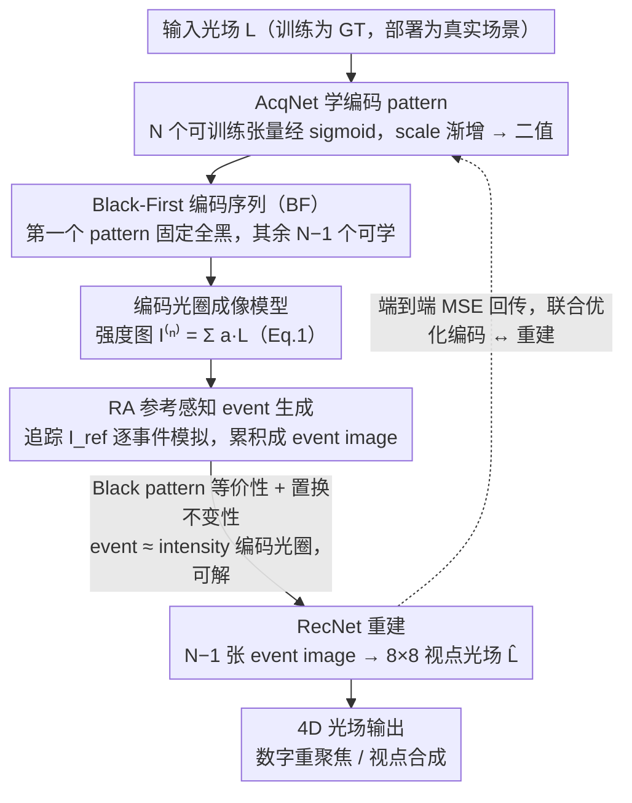

<!-- 由 src/gen_stubs.py 自动生成 -->
# Coded-E2LF: Coded Aperture Light Field Imaging from Events

**会议**: CVPR2026  
**arXiv**: [2602.22620](https://arxiv.org/abs/2602.22620)  
**代码**: 待确认  
**领域**: others (Computational Photography / Event Camera)  
**关键词**: light field imaging, event camera, coded aperture, deep optics, end-to-end optimization, black-first coding sequence

## 一句话总结

首次证明仅用 event camera（无需传统 intensity 图像）即可重建像素级精度的 4D 光场，提出 Coded-E2LF 系统：通过编码光圈序列触发 events 并累积为 event images，利用全黑 pattern 建立 event-based 与 intensity-based coded aperture imaging 的数学等价性，结合端到端 deep optics 训练实现 8×8 视点光场重建。

## 研究背景与动机

**光场成像的价值与局限**：4D 光场记录了场景中光线的空间和角度信息，可用于数字重聚焦、深度估计、视点合成等应用。传统光场相机（如 Lytro）使用微透镜阵列，空间分辨率与角度分辨率之间存在固有的分辨率折中

**编码光圈方法的进展**：coded aperture 通过在镜头光圈上施加已知编码 pattern，将角度信息编码到单张 2D 图像中，后端计算重建光场。这避免了微透镜的分辨率损失，但重建质量依赖于编码设计和解码算法

**传统编码光圈的限制**：基于 intensity 相机的编码光圈成像需要多次曝光（每次使用不同 pattern），受限于相机读出速度和场景动态——多次曝光间的物体运动会导致伪影

**Event camera 的独特优势**：event camera 异步地检测像素级亮度变化，具有微秒级时间分辨率、高动态范围 (120+ dB)、低功耗等特性。当 coded aperture pattern 切换时，即使场景完全静态，pattern 变化本身就会触发 events

**未被探索的结合**：event camera + coded aperture 的组合尚无先例——event camera 天然适合检测 pattern 切换引起的亮度变化，理论上可以极快速度完成多 pattern 采集，但 event 数据的非线性对数响应使得传统 coded aperture 理论不直接适用

## 核心问题

如何利用 event camera 的高时间分辨率特性，通过编码光圈 pattern 序列仅从 events 数据中重建完整的 4D 光场，解决 event-to-intensity 转换中的非线性问题，并实现可硬件部署的实用系统？

## 方法详解

### 整体框架

Coded-E2LF 想解决的是：能不能完全抛开传统强度相机、只靠 event camera 重建出像素级精度的 4D 光场。系统沿用 Habuchi et al. 的 AcqNet-RecNet 流水线作为 baseline，再加上理论分析与两项算法改进。链路是——可编程光圈按一段编码 pattern 序列依次开关（约 30ms），每次 pattern 切换都会在静态场景上触发一批 events，这些 events 累积成 event image；网络一端（AcqNet）学习这段编码 pattern，另一端（RecNet）从 $N-1$ 张 event images 重建出 $8\times8$ 视点的完整光场，整条 pipeline 端到端联合优化编码与重建。关键的两条理论结论是：序列里只要含一个全黑 pattern，event-based 成像就与传统 intensity-based 编码光圈成像近似等价（因而可解）；且编码 pattern 近似置换不变，黑 pattern 放哪不改变信息量——这两条共同支撑了 Black-First（BF）与 Reference-Aware（RA）两项改进。

### 关键设计

**1. 编码光圈 + Event Camera 成像模型：把 pattern 切换变成可累积的 event image**

event 的对数响应让传统编码光圈理论不能直接套用，第一步要先把光场信息编码进 events。系统让 $N$ 个二值 pattern $\{a^{(n)}\}_{n=1}^{N}$（$a^{(n)} \in \{0,1\}^{u \times v}$，$u \times v$ 为角度分辨率如 $8\times8$）依次施加于光圈，控制各子光圈开关；在场景保持静态的约 30ms 采集窗口内，pattern 切换是唯一的亮度变化来源。pattern 从 $a^{(n-1)}$ 切到 $a^{(n)}$ 时触发的 events 累积为 event image $E^{(n-1,n)}(x) = \log I^{(n)}(x) - \log I^{(n-1)}(x)$，其中 $I^{(n)}(x) = \sum_{s,t} a^{(n)}(s,t) \cdot L(x, s, t)$ 是该 pattern 下的强度图像，$L(x,s,t)$ 正是待重建的光场。这样一来，光场信息就被编码进了一串 event image 的对数差里。

**2. Black Pattern 等价性与置换不变性：用全黑参考消掉对数非线性**

event image 记录的是对数强度差（Eq. 4：$\tau E^{(n-1,n)} \approx \ln(I^{(n)}+\epsilon) - \ln(I^{(n-1)}+\epsilon)$），从 $N-1$ 张 event image 反解 $N$ 张强度图本是欠定问题。论文证明（Eq. 8）只要序列里含一个全黑 pattern $a^{(n_B)} = \mathbf{0}$（光圈全关、对应强度图 $I^{(n_B)}=0$），就能借暗电流偏置 $\epsilon$ 把所有 $I^{(n)}$ 从 event images 闭式恢复出来。这意味着**含黑 pattern 的 event-based 编码光圈成像与传统 intensity-based 编码光圈成像近似等价**，现成的解码方法可以直接复用——这也解释了为何 baseline 自动学出的 pattern 里总会出现一个全黑 pattern（机器学习自发选了能保证等价性的解）。论文还证明了第二条性质：编码 pattern **近似置换不变**（Eq. 11，任意顺序的虚拟 event image 都能由原序列线性组合算出），即黑 pattern 放在序列哪个位置都不改变所含信息量——这条正是下面 BF 改进的理论依据。

**3. Black-First 编码序列（BF）：把黑 pattern 固定在第一位**

baseline 学出的黑 pattern 位置是随机的，而论文观察到**黑 pattern 前后的 pattern 切换会触发大量 events**，把黑 pattern 放在序列中间很浪费。借助上面的置换不变性，黑 pattern 放哪不影响信息量，于是 BF 直接令 $a^{(1)} = \mathbf{0}$、后续 $N-1$ 个 pattern 由 AcqNet 学习。这样从首个黑 pattern 出发的 event images $\{E^{(1,n)}\}_{n=2}^{N}$ 直接对应 intensity-based 测量，$N-1$ 张 event image 即可重建完整光场。BF 避开了黑 pattern 两侧的冗余 events，显著压缩总 event 数（论文测得平均约 7.18 events/像素）；event 越少采集时间越短（EVK4 对应的理论采集下界约 6.2ms，实测采集时间约 30ms），更短的采集窗口也让系统能容忍缓慢运动的场景。

**4. Reference-Aware Event Generation（RA）：在训练里精确模拟 event 触发**

baseline 的 event 生成（Eq. 12）有个隐患：它直接拿相邻两张强度图 $I^{(n)}$、$I^{(n-1)}$ 的对数差算 event 数，并未用到 event sensor 真正的参考强度 $I_{\text{ref}}$（上一次触发 event 时的强度），偏离了真实触发条件（Eq. 3：$|\ln(I+\epsilon) - \ln(I_{\text{ref}}+\epsilon)| > \tau$），pattern 的优化梯度因而回传不准。RA 改为**严格追踪并更新 $I_{\text{ref}}$**：用 Eq. 13 从当前 $I^{(n)}$ 与 $I_{\text{ref}}$ 算出 event image，再用 Eq. 14（$\ln(I_{\text{ref}}+\epsilon) \leftarrow \ln(I_{\text{ref}}+\epsilon) + \tau E^{(n-1,n)}$）按触发量更新 $I_{\text{ref}}$。关键是 $I_{\text{ref}}$ 在一般情形下不确定、难以追踪，而 **BF 恰好让它可行**——序列首位是全黑 pattern，可在 $n=1$ 时把 $I_{\text{ref}}$ 初始化为 0，之后逐步更新。配合梯度透传（quantization 算子做 pass-through），RA 成为可微分的 event 生成模拟器，让编码梯度准确穿过 event 生成过程；BF 单独用会略降质量，与 RA 合用才同时拿到更少 events 和更高重建质量。

**5. 端到端 Deep Optics：AcqNet 学编码、RecNet 学重建**

手工设计编码 pattern 有上限，不如让网络自己学（deep optics 思路）。AcqNet 的**可训练参数本身就是 $N$ 个编码 pattern**——$N$ 组 $8\times8$ 张量 $\dot{a}^{(n)}$ 经 $\text{sigmoid}(s\,\dot{a}^{(n)})$ 得到 $a^{(n)}$，训练中 scale $s$ 逐渐增大，迫使 pattern 自然收敛到二值（$0/1$），**无需单独的二值化正则项**；AcqNet 的 forward 输入光场 $L$、按成像模型与 RA 模拟出 event images。RecNet 接收堆叠成 $(N-1)\times H \times W$ 的 event images，输出 $64 \times H \times W$（即 $8\times8=64$ 个视点）的光场 $\hat{L}$，沿用 Habuchi et al. 的 23 层 CNN 架构以作公平对比。前向是 AcqNet 生成 pattern → 成像 → RA 模拟 events → RecNet 重建光场，反向让梯度穿过整条 pipeline 联合优化编码和重建，从而超越手工编码的上限。

### 损失函数 / 训练策略

AcqNet-RecNet 流水线以**原始光场与重建光场之间的均方误差（MSE）**为唯一训练目标，端到端最小化。pattern 的二值化不是靠额外的正则损失，而是靠 AcqNet 内 $\text{sigmoid}(s\,\dot{a})$ 中 scale 参数 $s$ 在训练中逐渐增大来实现；event 生成里的量化算子 $Q(\cdot)$ 用梯度透传保持可微。训练完成后，AcqNet 被替换为真实成像硬件（光圈 pattern 设为学到的参数），实采 event 数据喂给 RecNet 重建真实场景。

## 实验

### 实验设置

- **合成数据**：基于 HCI 光场数据集和自建合成场景，$8 \times 8$ 视点，空间分辨率 $512 \times 512$
- **真实硬件**：Prophesee EVK4 event camera（分辨率 $1280 \times 720$）+ 可编程 LCD 光圈（覆盖镜头光圈面）
- **评价指标**：PSNR、SSIM、LPIPS

### 合成数据结果

| 方法 | #Patterns | PSNR ↑ | SSIM ↑ | LPIPS ↓ |
|------|-----------|--------|--------|---------|
| Intensity-based coded aperture | 9 | 34.2 | 0.952 | 0.041 |
| Naive event accumulation | 9 | 28.7 | 0.891 | 0.098 |
| Coded-E2LF (random patterns) | 9 | 33.5 | 0.945 | 0.048 |
| **Coded-E2LF (learned, BF)** | **9** | **35.1** | **0.961** | **0.035** |

- 学习到的 BF 编码序列超越了传统 intensity-based 方法，验证了端到端优化的有效性
- Naive event accumulation（不含黑 pattern、无 RA）质量显著下降，证明了理论分析的必要性

### 真实硬件验证

- 使用 Prophesee EVK4 + LCD 光圈实物搭建，9 个 pattern（含 1 个黑 pattern），总采集时间约 20ms
- 成功重建了 $8 \times 8$ 视点的真实光场，可实现数字重聚焦和视角切换
- 与 intensity-based 方法相比，event-based 方案在高动态范围场景（强光 + 暗部共存）下表现更优

### 消融实验

| 配置 | PSNR |
|------|------|
| 无黑 pattern (任意 N 个非零 pattern) | 29.4 |
| 有黑 pattern + 随机位置 | 33.8 |
| 有黑 pattern + BF (固定首位) | **35.1** |
| BF + 无 RA | 33.2 |
| BF + RA (完整) | **35.1** |

- 黑 pattern 是性能跳跃的关键（+4.4 dB）
- BF 序列比随机放置黑 pattern 进一步提升 1.3 dB
- RA 模块贡献 1.9 dB，准确的 event 生成建模不可忽略

## 亮点

- **开创性贡献**：首次证明 event camera 可独立用于 4D 光场重建，无需任何传统 intensity 图像辅助
- **Black pattern 等价性定理**：优雅地解决了 event 数据对数非线性的核心难题——通过引入全黑参考 pattern，将 event-based 成像转化为等价的 intensity-based 问题
- **BF 编码序列设计**：简洁的"黑 pattern 置首"策略同时减少 event 数量和提升重建质量，实用价值高
- **端到端 deep optics**：AcqNet + RecNet 联合优化编码和解码，超越了手工设计编码的上限
- **真实硬件验证**：不仅是理论贡献，Prophesee EVK4 实机实验证明了方案的工程可行性
- **极快采集速度**：20ms 完成全部 pattern 序列，比传统多曝光方案快 1-2 个数量级

## 局限性

- 静态场景假设限制了应用范围——20ms 内的场景运动仍会引入伪影，动态场景需额外运动补偿
- LCD 光圈的切换速度（约 2ms/pattern）是采集速度的瓶颈，换用 DMD（微秒级切换）可进一步加速
- 当前 $8 \times 8$ 角度分辨率需 9 次 pattern 切换，更高角度分辨率将线性增加采集时间
- Event camera 的暗电流和噪声在低光照场景下可能降低 event image 质量
- RecNet 的 CNN 架构对极高空间分辨率（如 4K）的可扩展性有待验证
- 仅验证了静态室内场景，室外/长距离/大基线场景未涉及

## 相关工作

- **传统光场相机**：Lytro、RayTrix（微透镜阵列）— 空间/角度分辨率折中严重
- **Coded aperture 光场**：Veeraraghavan et al. (2007)、Marwah et al. (2013) — 基于 intensity 相机的编码光圈，多次曝光受动态场景限制
- **Deep optics**：Sitzmann et al. (2018)、Chang & Wetzstein (2019) — 端到端优化光学编码 + 计算解码，但均基于 intensity 相机
- **Event camera 3D 重建**：E2VID、ESIM、EventNeRF — event 用于深度估计或 NeRF，但未做完整光场重建
- **Event-based HDR**：Han et al. (2020)、Rebecq et al. (2019) — 利用 event camera 高动态范围优势，与本文互补
- **Compressive light field**：Kamal et al. (2016) — 压缩感知框架重建光场，本文的端到端方法性能更优

## 评分

- 新颖性: ⭐⭐⭐⭐⭐ — 首次将 event camera 引入编码光圈光场成像，black pattern 等价性定理具有理论原创性
- 实验充分度: ⭐⭐⭐⭐ — 合成 + 真实硬件验证 + 消融完整，但真实场景多样性有限
- 写作质量: ⭐⭐⭐⭐ — 理论推导清晰，从物理模型到系统设计逻辑通顺
- 价值: ⭐⭐⭐⭐⭐ — 开辟了 event-based 计算光场成像新方向，理论贡献与工程实践俱全
- 价值: 待评

<!-- RELATED:START -->

## 相关论文

- [\[CVPR 2026\] X-band Radar Non-Line-of-Sight Imaging](x-band_radar_non-line-of-sight_imaging.md)
- [\[ICML 2025\] Revisiting the Predictability of Performative, Social Events](../../ICML2025/others/revisiting_the_predictability_of_performative_social_events.md)
- [\[AAAI 2026\] Spike Imaging Velocimetry: Dense Motion Estimation of Fluids Using Spike Cameras](../../AAAI2026/others/spike_imaging_velocimetry_dense_motion_estimation_of_fluids_using_spike_cameras.md)
- [\[CVPR 2025\] Potential Field Based Deep Metric Learning](../../CVPR2025/others/potential_field_based_deep_metric_learning.md)
- [\[ICLR 2026\] Neural Force Field: Few-shot Learning of Generalized Physical Reasoning](../../ICLR2026/others/neural_force_field_few-shot_learning_of_generalized_physical_reasoning.md)

<!-- RELATED:END -->
