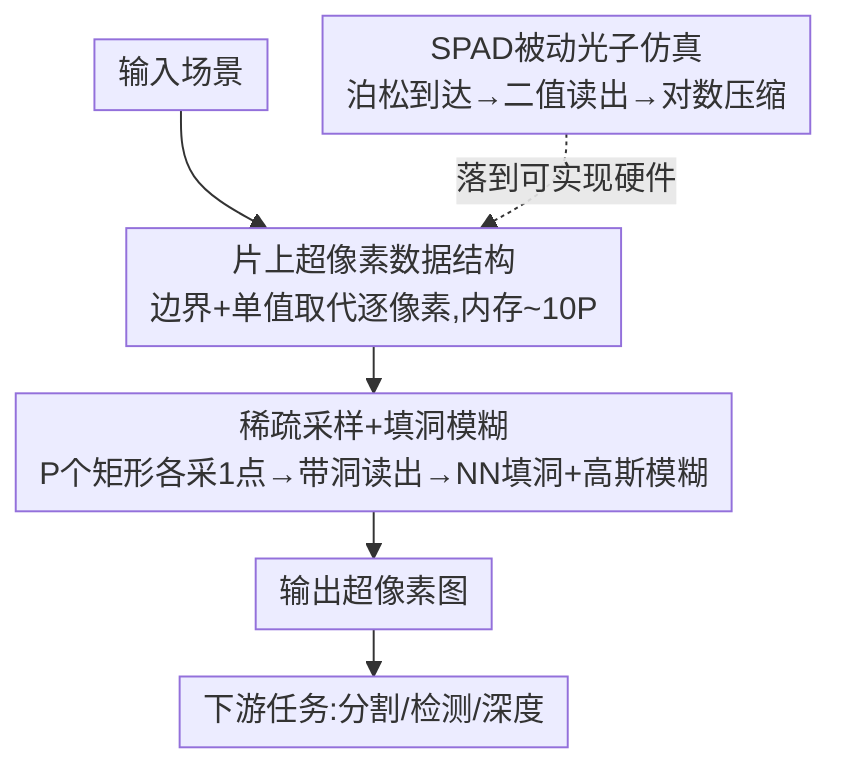

# Computer Vision with a Superpixelation Camera

**会议**: CVPR 2026  
**论文**: [CVF Open Access](https://openaccess.thecvf.com/content/CVPR2026/html/Mahalingam_Computer_Vision_with_a_Superpixelation_Camera_CVPR_2026_paper.html)  
**代码**: 无  
**领域**: 计算摄影 / 传感器  
**关键词**: 超像素相机, SPAD 单光子传感器, 片上压缩, 边缘视觉, 资源受限推理

## 一句话总结
提出一种"超像素相机"SuperCam：传感器在片上直接以稀疏采样生成超像素图，根本不存储完整高分辨率图像，用比常规图像低一两个数量级的内存就能驱动分割/检测/深度估计，在同等内存预算下分割误差比受限版 SNIC 至少好一倍。

## 研究背景与动机
**领域现状**：现代视觉系统默认"图像=方形像素的均匀网格"。超像素算法（SLIC、SNIC、ERS 等）把相似的像素聚成任意形状的区域，能压缩输入、简化下游任务的搜索空间，是一类经典的图像简化手段。

**现有痛点**：所有这些超像素算法都是**后处理**——必须先拿到一张完整的高分辨率图像，再从中聚类出超像素。也就是说传感器仍然要逐像素地采集、读出、存储数百万像素，消耗功耗与带宽，而其中绝大部分信息在做完超像素简化后被直接丢弃。在内存受限的边缘设备上，这条"先采全图再压缩"的路本身就是浪费。SNIC 这类聚类法虽轻量，但其优先队列需要把整幅图的像素强度都装进内存，内存占用同时依赖像素数 $M$ 和超像素数 $P$。

**核心矛盾**：真正想要的是"少量、自适应形状的区域表示"，但传统成像链却被迫先经过"百万方形像素的全图"这个昂贵中间态——表示的稀疏性和采集的稠密性之间存在结构性错配。

**本文目标**：能不能让传感器**跳过全图**这一步，原生地、即时地输出超像素？把超像素从"算法的输出"变成"相机的原始数据"。

**切入角度**：作者类比生物视觉——人眼并不像相机那样先形成高分辨率图像，边缘检测与感知相似区域的分组在视网膜阶段就已发生。再加上单光子（SPAD）传感器具备片上计算、能在最细时空粒度上采样的特性，恰好提供了实现这种"原生超像素"相机的硬件试验台。

**核心 idea**：设计一个维护超像素"边界+单一颜色值"数据结构的相机，在片上用稀疏自适应采样直接填充这个结构、再离片做填洞与模糊，从而在完全不形成全图的前提下产出可用于下游 CV 任务的超像素图。

## 方法详解

### 整体框架
SuperCam 不再把图像当成一张稠密栅格，而是维护一个**超像素集合** $S=(S_i, I_i)_{i=1}^{N}$：$S_i$ 是第 $i$ 个超像素的边界信息，$I_i$ 是它对应的单个 8/24 bit 强度或颜色值。整条管线分三段：① 片上保有这个紧凑数据结构（决定"存什么"）；② 片上做稀疏采样、把每次光子测量灌进对应超像素，读出一张**带洞**的超像素图，再离片用最近邻填洞 + 高斯模糊补成完整超像素图（决定"怎么采、怎么补"）；③ 用单光子 SPAD 传感器的被动光子仿真，把这个概念相机落到一个可实现的硬件模型上（决定"用什么器件实现"）。最终输出的超像素图直接喂给现成的分割/检测/深度模型。

### 关键设计

**1. 片上超像素数据结构：用"边界+单值"取代逐像素栅格**

针对"传感器被迫先存全图"这个浪费，SuperCam 把传感器的内部状态从"$M$ 个像素强度"换成"$N$ 个超像素的 $(S_i, I_i)$"。每次在坐标 $(x,y)$ 积分一段曝光、得到光通量测量 $\phi$ 后，所有满足 $(x,y)\in S_i$ 的超像素都把自己的强度估计 $I_i$ 按新测量更新一次——即测即更新，不留中间全图。对 BSD500 这种 $321\times481$ 的图，前人通常用 1000–2000 个超像素就够，于是 SuperCam（未优化实现）的内存占用约为 $\sim 10P$（每个超像素约 10 个单位的边界+颜色信息），相比"百万像素 × 8/24 bit"低了一两个数量级。这一步是整套方法省内存的根源：表示天生就是稀疏的，而不是先稠密再压。

**2. 稀疏采样 + 填洞模糊：单次曝光在片上直接生成超像素图**

有了稀疏的数据结构，还需要一套能在最少测量下填满它的采样流程（即论文的 SuperCam Algorithm）。做法直白：先把图像划成 $P$ 个等大矩形（对应 $P$ 个超像素），在每个矩形里**随机选一个**传感器平面坐标 $(x_i,y_i)$，对它曝光固定时间 $\tau$，算出强度估计 $\hat\phi(x_i,y_i)$，用它初始化该超像素的坐标与强度。这一步（算法第 4–7 行）设想跑在片上、紧贴像素，计算极轻。读出的是一张只在被采样点有值、其余为洞的稀疏超像素图；随后离片做两件事：用**最近超像素的强度值做最近邻填洞**补齐空洞，再施加一层**高斯模糊**，模糊半径取超像素网格尺寸（矩形网格则用可分离核、横纵不同半径，核大小推导见原文补充材料 ⚠️ 以原文为准）。最近邻操作可并行、能实时离片执行。模糊不是美化，而是把硬采样边界过渡平滑，作者发现对下游任务的鲁棒性有实质帮助——甚至给受限 SNIC 也加同样模糊后其下游结果也变好，所以对比里专门保留了"SNIC with blur"这一档。

**3. SPAD 被动光子仿真：把概念相机落到可实现的单光子硬件**

SuperCam 目前还没有真实硬件，作者用被动 SPAD 阵列把它仿真/落地，证明这不是纯空想。SPAD 像素在时间 $\tau$ 内、量子效率 $\eta$ 下接收的光子数服从泊松分布 $P\{Z=k\}=\frac{(\phi\tau\eta)^k e^{-\phi\tau\eta}}{k!}$；但每个 SPAD 像素最多记一个光子事件，故读出是二值 $B(x,y)$，服从伯努利分布，$P\{B=1\}=1-e^{-(\phi\tau\eta+r_q\tau)}$（$r_q$ 为暗计数率）。为了从公开 RGB 图像生成这种二值光子流，作者设一个"每像素平均光子数" $p$，令入射光通量正比于强度 $I_i$，则 $P\{B=1\}=1-e^{-cI_i}$，并通过约束 $\frac1M\sum_{i=1}^{M}(1-e^{-cI_i})=\frac{p}{N}$ 解出曝光缩放项。在低光 $cI_i\ll1$ 下用泰勒展开 $1-e^{-cI_i}\approx cI_i$，得到闭式解：

$$c=\frac{p}{N\,I_\text{avg}}$$

其中 $I_\text{avg}$ 是真值图像素均值。把 $N$ 帧二值图逐像素求和 $S(x,y)$ 再做对数压缩即可恢复真实强度：$\hat\phi(x,y)=-\ln\!\big(1-S(x,y)/M\big)/(c\eta)-r_q/\eta$。这套仿真把抽象的"光子级采样"接到了 SwissSPAD 这类真实器件能产出的数据格式上，也是后面能直接拿真实 SPAD 数据跑实验的前提。

### 损失函数 / 训练策略
SuperCam 本身**不含可学习参数、无需训练**：它是一个成像/采样模型 + 经典图像填补流程，下游用的是现成预训练模型（SAM2、YOLOv12、DepthAnythingV2）。唯一的"调参旋钮"是超像素数 $P$（等价于内存预算），$P$ 越大保真越高、内存越多，性能随之平滑提升。

## 实验关键数据

由于"即时生成超像素的相机"没有可比基线，作者构造了**等内存受限对比协议**：把现有方法（主要是 SNIC）限制到与 SuperCam 相同的片上内存预算下再比。具体做法是先设内存预算（70–700KB），再调整超像素数与图像尺寸使"图像 + 数据结构"的总内存刚好落进预算；实验发现 SNIC 在"给图像数据分配 5× 于超像素的内存"时欠分割误差最低，故按此设置。评测覆盖超像素质量本身 + 三个下游任务，数据集含 BSD500、NYUV2、SBD、SUNRGBD、COCO、KITTI 等。

### 主实验：超像素质量与下游任务（同等内存对比 SNIC）

| 任务 / 指标 | 数据集 | SuperCam（本文） | 受限 SNIC | 结论 |
|------|------|------|------|------|
| 欠分割误差 USE↓ | BSD500/NYUV2/SBD/SUNRGBD | 同内存下至少好 **2×** | 基线 | 同等内存误差减半 |
| 边界 Precision–Recall | 同上 | Recall 更高、Precision 略低 | 基线 | 同内存放更多超像素→召回高 |
| 分割 mIOU 误差↓ | NYUV2 / BSD500 | 一致低于 SNIC，随内存增大趋近"未分割全图" | 更高 | SAM2 下分割更完整 |
| 检测 mAP(50–95)↑ | COCO | 优于 SNIC，趋近分辨率匹配图 | 更低 | 低内存仍能检到 SNIC 漏掉的目标 |
| 深度 AbsRel↓ / δ1↑ | NYUV2 | 均优于 SNIC | 更差 | 低内存下 SNIC 深度图几乎不可用 |

### 与学习类方法 / 内存档位对比

| 对比维度 | SuperCam | 对照 | 说明 |
|------|---------|------|------|
| vs LNS-Net（学习类） | 68KB 档即可媲美 | LNS-Net 800 超像素、~2GB | 内存少 **>1000×**（kB vs GB）仍在 USE 上更优 |
| 内存档位（图像质量） | 68 / 205 / 615 KB | — | 边缘、混叠、面部细节随内存平滑变好 |
| 真实硬件 | SwissSPAD 二值帧 | 真值 | 三任务上接近真值，验证不止于仿真 |

### 关键发现
- **同内存预算下质量翻倍**：SuperCam 把内存花在"更多超像素"上而非"存全图"，所以欠分割误差至少减半；代价是边界精度（Precision）略降，因为同内存里塞了更多超像素。
- **下游任务一致占优、且随内存优雅收敛**：三个任务的误差都随超像素数增加单调趋近"用未分割原图"的上限——说明超像素图保留了任务所需的关键信息。
- **小目标是固有短板**：占像素极少的小物体在超像素化后会被采样丢掉，这是超像素路线的根本限制，只能靠加内存或对光学放大后的局部区域重跑来缓解。
- **高斯模糊对双方都有益**：给受限 SNIC 加同款模糊后其下游结果也变好，作者据此保留 "SNIC with blur" 档做更公平对比。

## 亮点与洞察
- **把超像素从"算法输出"重定义为"相机原始数据"**：这是范式层面的转向——不是又一个超像素算法，而是质疑"成像必须先产出方形像素全图"这一前提，让稀疏表示在采集端就成立。
- **"事件相机的空间对偶"这个类比很精到**：事件相机在时间变化大时才发数据，SuperCam 则只为色彩/强度上感知相异的空间区域存超像素——一个省时间维冗余，一个省空间维冗余。
- **零训练、即插现成大模型**：方法本身无参数，直接把超像素图喂给 SAM2/YOLOv12/DepthAnythingV2 就能用，迁移成本几乎为零；这套"在采集端压缩、模型端不动"的思路可推广到任何带片上计算的边缘视觉传感器。
- **单一旋钮平滑权衡**：用超像素数 $P$ 一个量同时控制保真度与内存，给系统工程师一个干净的内存–性能折中接口。

## 局限与展望
- **仍是概念，无真实芯片**：作者明确承认 SuperCam 目前只是概念设计，所有结果来自 SPAD 仿真/已有数据集 emulation，下一步需要做硬件原型才能验证片上采样与更新的真实可行性与功耗收益。
- **小目标检测会丢**：极小物体被超像素采样吞掉是结构性缺陷，对需要可靠检测小物的应用不友好。
- **片上"即测即更新所有相关超像素"的代价未量化**：笔记角度看，文中对"每次测量要更新所有覆盖该坐标的超像素"在真实硬件上的延迟/能耗只给了"轻量、可并行"的定性说法 ⚠️ 以原文为准；内存数 $\sim 10P$ 也是未优化实现，作者称换更精简数据结构还能再省一半。
- **依赖随机采样点的代表性**：每个矩形只随机采一点来代表整个超像素，落点不巧时（如跨越真实边界）该超像素的颜色估计会偏，文中未深入分析这种采样方差对下游的影响。

## 相关工作与启发
- **vs SNIC / SLIC（聚类超像素）**：它们都需要先有完整高分图、再用优先队列/五维空间聚类，内存随像素数 $M$ 增长；SuperCam 不访问全图、原生输出超像素，同内存下质量翻倍。本文正是把 SNIC 限到等内存当主要基线。
- **vs 单像素/压缩感知相机**：两者都想抓"场景的简约表示"，但压缩感知以重建图像质量为目标，SuperCam 明确放弃图像质量、只看下游 CV 任务表现，故连图像质量指标都不报。
- **vs 事件相机**：事件相机按时间变化阈值稀疏化输出，SuperCam 是其空间对偶，按空间感知相异性稀疏化——二者都属"在采集端降数据率"的非常规传感器思路，可互补。
- **vs 学习类超像素（LNS-Net / SPAM / 基于 Transformer 的方法）**：学习类质量高但动辄上 GB 内存，无法上轻量边缘设备；SuperCam 用 kB 级内存换来可比甚至更优的 USE，定位完全不同。

## 评分
- 新颖性: ⭐⭐⭐⭐⭐ 把超像素从后处理算法重塑为相机原始输出，是采集范式层面的新问题设定，而非增量改进。
- 实验充分度: ⭐⭐⭐⭐ 覆盖四数据集 + 三下游任务 + 真实 SPAD 数据，但无真实芯片、缺片上开销实测，定量主要靠图表呈现。
- 写作质量: ⭐⭐⭐⭐⭐ 动机（生物视觉/事件相机对偶）讲得清楚，成像模型与 SPAD 仿真推导完整自洽。
- 价值: ⭐⭐⭐⭐ 为边缘视觉的"采集端压缩"指了一个有想象力的方向，但落地仍依赖后续硬件实现。

<!-- RELATED:START -->

## 相关论文

- [\[CVPR 2026\] Towards Knowledge-augmented Bayesian Deep Learning For Computer Vision](towards_knowledge-augmented_bayesian_deep_learning_for_computer_vision.md)
- [\[CVPR 2026\] Event Structural Valley: A Unified Theoretical and Practical Framework for Event Camera Autofocus](event_structural_valley_a_unified_theoretical_and_practical_framework_for_event_.md)
- [\[CVPR 2026\] EXOTIC: External Vision-driven Incomplete Multi-view Classification](exotic_external_vision-driven_incomplete_multi-view_classification.md)
- [\[CVPR 2026\] Learning What Helps: Task-Aligned Context Selection for Vision Tasks](learning_what_helps_task-aligned_context_selection_for_vision_tasks.md)
- [\[CVPR 2026\] Align Once to Explain: Feature Alignment for Scalable B-cosification of Foundational Vision Transformers](align_once_to_explain_feature_alignment_for_scalable_b-cosification_of_foundatio.md)

<!-- RELATED:END -->
