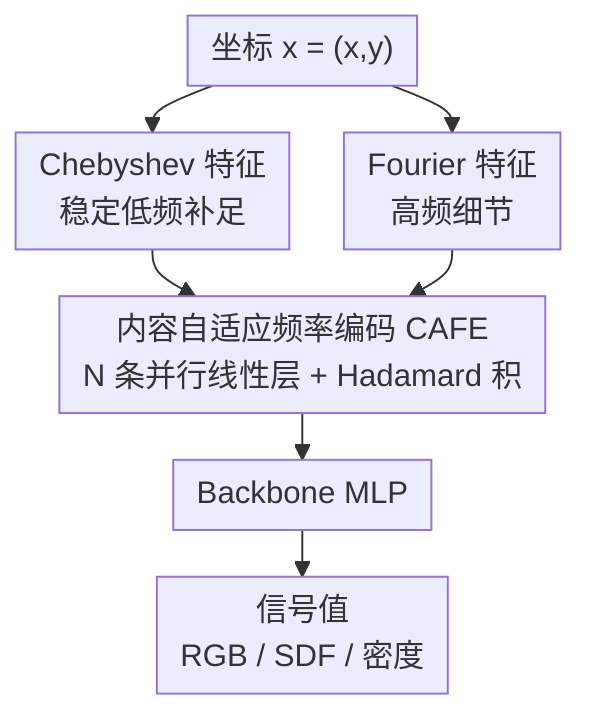

# Content-Aware Frequency Encoding for Implicit Neural Representations with Fourier-Chebyshev Features

**会议**: CVPR 2026  
**论文**: [CVF Open Access](https://openaccess.thecvf.com/content/CVPR2026/html/Ke_Content-Aware_Frequency_Encoding_for_Implicit_Neural_Representations_with_Fourier-Chebyshev_Features_CVPR_2026_paper.html)  
**代码**: https://github.com/JunboKe0619/CAFE  
**领域**: 隐式神经表示  
**关键词**: 隐式神经表示, 谱偏置, Fourier特征, Chebyshev多项式, 频率编码

## 一句话总结
针对 INR 用固定 Fourier 基、逼 MLP 自己"凑"目标频率而效率低的问题，本文提出 CAFE：把 Fourier 特征送进多条并行线性层、再用 Hadamard 积做频率相乘，把可表示频率集从 $M$ 个固定基指数级扩张到 $O(MN3^{N-1})$，并用可学权重挑选任务相关频率；再用 Chebyshev 特征补足低频稳定性（CAFE+），在图像拟合、3D 形状、NeRF 上一致超过 SIREN/FINER/SL2A 等基线（图像拟合 PSNR 最高提升约 5 dB）。

## 研究背景与动机
**领域现状**：隐式神经表示（INR）用一个 MLP 学"坐标 → 信号值"的连续映射，被广泛用于连续超分、图像压缩、逆问题、神经渲染等。为了让 MLP 能表达高频细节，主流做法是先用 Fourier 特征（如 RFF、Positional Encoding）把坐标投影到一组正弦/余弦基张成的高维空间，再喂给 MLP——这能改善神经正切核（NTK）的谱性质，缓解 MLP 天生偏好低频的"谱偏置"。

**现有痛点**：这些 Fourier 编码用的是**固定的频率基**。理论上（Theorem 1）MLP 可以把目标频率表示成初始采样频率的整数线性组合 $\sum_t s_t \Omega_t$，靠加深网络扩大可合成频率范围，但实践中 Fourier 特征网络对初始采样频率极其敏感，而且加深网络几乎不涨点（图 1：256-RFF 从 4 层加到 8 层 PSNR 几乎不动），加宽网络只带来小幅提升却要付出大量参数。换句话说，让深层 MLP 通过非线性"隐式地"合成并挑选目标频率，既低效又难优化。

**核心矛盾**：表示能力的瓶颈不在 MLP 容量，而在**频率合成的方式**——固定基 + 让 MLP 隐式凑频率，这条路径本身效率低。

**本文目标**：把"合成目标频率"这件苦差事从 MLP **搬到编码阶段**，让编码本身就能高效、显式地生成一大片频率，并能按信号内容自适应挑选，而不是一味堆网络容量。

**切入角度**：要从固定基里"凭空"生成更多频率，关键是引入**乘性交互**——三角恒等式 $\sin a \sin b$、$\cos a \cos b$ 会产生和频 $a+b$、差频 $a-b$，于是少量基相乘就能组合出指数级多的新频率。作者用可学的线性层来驱动这种相乘交互。

**核心 idea**：用"并行线性层 + Hadamard 积"在编码阶段显式合成一大片频率基，用可学权重选出任务相关频率（CAFE）；再用 Chebyshev 特征补足低频的稳定表示（CAFE+）。

## 方法详解

### 整体框架
CAFE+ 是一个**纯编码端**的改造，不动 MLP 主干结构。输入一个坐标 $\mathbf{x}\in\mathbb{R}^D$（如图像的像素坐标 $(x,y)$），先分别映射成 Fourier 特征 $\Phi_{\text{FF}}(\mathbf{x})$ 和 Chebyshev 特征 $\Phi_{\text{CF}}(\mathbf{x})$ 并拼接；拼接后的向量同时喂进 $N$ 条**并行**线性层，各自输出 $H_i$；把这 $N$ 个输出做 **Hadamard 积（逐元素相乘）**得到 CAFE+ 编码特征 $\Psi(\mathbf{x})$；最后 $\Psi(\mathbf{x})$ 送进 backbone MLP 回归出目标值（RGB、SDF、密度等）。整条管线只在"坐标 → 编码"这一段做文章，把频率合成显式地放在了编码里。

值得强调的是：和 MFN/BACON 那种**串行递归**相乘合成频率不同，CAFE 是**编码式、并行架构**——训练更快，也不需要 BACON 那种精心设计的初始化。

### 关键设计

**1. 内容自适应频率编码 CAFE：用并行线性层 + Hadamard 积把固定基指数级扩张**

直接增大 Fourier 特征数量 $M$ 并给每个频率加可学权重，看似能"从更宽频谱里选频率"，但可表示频率集只随 $M$ **线性**增长，太低效。CAFE 改走乘性交互这条路。给定坐标 $\mathbf{x}$，先算 Fourier 特征 $\Phi_{\text{FF}}(\mathbf{x})=[\sin(2\pi\boldsymbol{\omega}_i^\top\mathbf{x}),\cos(2\pi\boldsymbol{\omega}_i^\top\mathbf{x})]_{i=1}^M$，送进 $N$ 条并行线性层 $H_i(\mathbf{x})=\mathbf{W}_i\Phi_{\text{FF}}(\mathbf{x})+\mathbf{b}_i$，再做 Hadamard 积融合：

$$\Psi(\mathbf{x}) = \bigodot_{i=1}^{N} H_i(\mathbf{x})$$

为什么这样能"造"出更多频率？以两条线性层为例，$\psi = h^{(1)}\odot h^{(2)}$ 里两路正弦分量相乘，套用积化和差恒等式会同时生成**和频** $\theta_i+\theta_m$ 与**差频** $\theta_i-\theta_m$ 项，其系数由两路权重的组合 $C_a=w^{(s)}_{1}w^{(s)}_{2}$、$C_b=w^{(c)}_{1}w^{(c)}_{2}$ 等决定。这意味着网络可以通过让某些系数组合归零（如令 $C_b-C_a=0,\ C_c+C_d=0$）来**主动抑制**不需要的和频，或增强需要的频率——这正是"内容自适应"的来源：权重既造频率又选频率。Theorem 2 把这件事形式化：CAFE+ 的可表示频率集为

$$\mathcal{F}_{\rm CAFE}^{+} = \Big\{ \textstyle\sum_{i=1}^{N} \sigma_i \boldsymbol{\omega}_{k_i} \;\Big|\; \boldsymbol{\omega}_{k_i}\in\mathcal{F}_{\rm base},\ \sigma_i\in\{-1,0,+1\} \Big\}$$

规模达 $O(MN3^{N-1})$，相对 $M$ 是指数级膨胀。与 Theorem 1 里"靠加深 MLP 隐式凑频率"相比，CAFE 把这件事显式地搬到编码端，因此**编码阶段每多加一条并行线性层就实打实涨点**（图 1、图 8），而 RFF 加深 MLP 几乎不动。作者还给出 NTK 矩阵对比（图 3）：CAFE 的 NTK 条件数更好，从优化角度印证了它的优越性。

**2. Chebyshev 特征（CAFE+）：给 CAFE 补一组稳定的低频基**

CAFE 能合成的频率仍然依赖**随机初始化**的 Fourier 基。现实信号能量大多集中在低频，但随机采样不一定能覆盖到关键的低频基；由于网络倾向先学低频，一旦低频基缺位，网络就被迫"滥用"高频基去补偿缺失的低频结构，结果既在低频区引入噪声，又损害高频信号的重建。而且 Fourier 基本身对平滑的低频结构建模并不高效，容易在这些区域产生噪声。

为此作者引入 Chebyshev 特征：$\Phi_{\text{CF}}(\mathbf{x})=[T_j(x_d)]_{d=1\dots D;\,j=0\dots J-1}$，其中 $T_j$ 是第一类 Chebyshev 多项式，按 $T_0=1,\ T_1=x,\ T_{j+2}(x)=2xT_{j+1}(x)-T_j(x)$ 递推。选 Chebyshev 是因为它对平滑函数有近最优逼近性质（同阶多项式中最大误差最小）、且在 $[-1,1]$ 上正交、振荡有界、数值稳定，天生适合表示低频/平滑结构，正好和擅长高频的 Fourier 互补。更关键的是，Chebyshev 多项式同样满足积化和差恒等式 $T_p(x)T_q(x)=\tfrac12[T_{p+q}(x)+T_{|p-q|}(x)]$，所以**整套 CAFE 的相乘合成机制可以原样套到 Chebyshev 域**——把 Fourier 与 Chebyshev 特征拼接后一起喂进并行线性层：

$$\Psi(\mathbf{x}) = \bigodot_{i=1}^{N} \big\{ \mathbf{W}_i [\Phi_{\text{FF}}(\mathbf{x}),\ \Phi_{\text{CF}}(\mathbf{x})] + \mathbf{b}_i \big\}$$

推理时分别屏蔽两路特征（图 5）可以看到二者分工明确：Chebyshev 提供稳定的全局/低频结构，Fourier 负责精细高频细节。Theorem 3 进一步证明，作用在 Chebyshev 特征上的 MLP 仍保持这种"基函数线性组合"的表示形式，确保网络能稳定地用 Chebyshev 多项式拟合信号的低频部分。

### 损失函数 / 训练策略
方法本身只改编码，训练目标就是各任务标准的重建损失。所有实验用 Adam 优化，按任务选学习率与调度；图像拟合用固定 scale=30 的 RFF，NeRF 用 PE；硬件为单张 RTX 4090。超参主要是并行线性层数 $N$、Fourier scale $s$、Chebyshev 阶数 $J$。

## 实验关键数据

### 主实验
在 2D 图像拟合（DIV2K 选 8 张，PSNR）、3D 形状表示（5 个 shape，IoU）、NeRF（Blender 4 场景，PSNR）三类任务上对比 SIREN/WIRE/SCONE/FINER/SL2A/GAUSS。

2D 图像拟合（PSNR / dB，节选，Ours(L) 为训练时长对齐最快基线的大变体）：

| 方法 | D2K1 | D2K2 | D2K7 | Param | Time(s) |
|------|------|------|------|-------|---------|
| SIREN | 40.08 | 36.68 | 37.58 | 0.20M | 148 |
| FINER | 42.33 | 39.44 | 39.73 | 0.20M | 204 |
| SL2A | 41.91 | 39.87 | 40.23 | 0.46M | 271 |
| **Ours** | 42.57 | 42.13 | 42.61 | 0.22M | **108** |
| **Ours (L)** | **44.34** | **44.18** | **45.01** | 0.33M | 150 |

3D 形状（IoU %）与 NeRF（PSNR / dB）：

| 任务 | 数据 | 最强基线 | 本文 |
|------|------|----------|------|
| 3D shape | Thai statue (IoU) | SL2A 0.9987 | **0.9992** |
| 3D shape | Armadillo (IoU) | SL2A 0.9993 | **0.9996** |
| NeRF | Lego (PSNR) | FINER 30.78 | **31.86** |
| NeRF | Hotdog (PSNR) | SIREN 33.91 | **34.65** |

本文在保持相近甚至更少参数、更短训练时间下取得最佳：图像拟合上 Ours(L) 比最强基线再涨约 3–5 dB；3D 形状全 5 个 shape IoU 第一且训练最快（860s）；NeRF 四场景中三个第一、Drums 持平。

### 消融实验
拆 CAFE 与 Chebyshev 两个组件（PSNR / dB，5 张测试图）：

| CAFE | Chebyshev | D2K0 | D2K2 | D2K4 | 说明 |
|------|-----------|------|------|------|------|
| ✗ | ✗ | 26.18 | 30.98 | 30.92 | 退化为标准 RFF |
| ✗ | ✓ | 33.00 | 35.60 | 35.91 | 只加 Chebyshev 基 |
| ✓ | ✗ | 34.87 | 40.42 | 40.52 | 只用 CAFE（纯 Fourier） |
| ✓ | ✓ | **39.47** | **44.18** | **44.97** | 完整 CAFE+ |

backbone MLP 深度消融（PSNR / dB，三图均值）：

| MLP 层数 | 平均 PSNR | 说明 |
|----------|-----------|------|
| 0 | 35.56 | 去掉 MLP，明显下降 |
| 1 | 41.03 | 单层已接近 |
| 2 | 略优于 1 层 | 再加深仅边际增益 |

### 关键发现
- **CAFE 是主力，Chebyshev 是稳定器**：单加 CAFE（纯 Fourier）就把 RFF 的 ~26–31 dB 拉到 ~35–40 dB；再叠 Chebyshev 进一步到 ~39–45 dB。两者互补——Chebyshev 稳住低频、压低频噪声，Fourier 抓高频细节（图 5 屏蔽实验直观印证）。
- **频率合成确实被"外包"到了编码端**：去掉 MLP 掉点剧烈（35.56），但 1 层 MLP 就到 41.03、再加深几乎不涨——说明大部分频率合成已在编码阶段完成，MLP 不再背"凑频率"的包袱。这与图 1 的结论一致：RFF 加深无效，CAFE 加并行层有效。
- **鲁棒且开销可控**：并行层数增加时 PSNR 稳步上升并在足够多时饱和，计算量随阶数近似线性增长；Fourier scale 在 20–50、Chebyshev 阶数 $J>16$ 时性能稳定。

## 亮点与洞察
- **把"谱偏置"问题重新定位为"频率合成方式"问题**：作者没有再去设计新激活函数或堆网络，而是论证瓶颈在"让 MLP 隐式凑频率"，于是把这件事显式搬到编码端——这个问题重框（reframing）是全文最"啊哈"的地方。
- **用 Hadamard 积 + 积化和差把固定基指数级放大**：少量基相乘即可组合出 $O(MN3^{N-1})$ 个频率，且系数可学=既造频率又选频率，理论（Theorem 2）和 NTK 条件数（图 3）双重支撑，思路干净。
- **并行替代串行**：相比 MFN/BACON 的串行递归合成，并行线性层训练更快、免去 BACON 的精细初始化——一个工程上很实际的改进。
- **Fourier+Chebyshev 互补可迁移**："高频用 Fourier、低频/平滑用 Chebyshev，且两者都满足积化和差因而能套同一套相乘机制"这一思路，可迁移到任何依赖位置编码/频率编码的连续表示任务。

## 局限性 / 可改进方向
- **额外编码开销**：并行线性层和 Hadamard 积引入额外计算（虽随阶数近似线性），在极端实时/超大规模场景下的开销仍需权衡。
- **Chebyshev 阶数与 Fourier scale 仍是需调超参**：虽展示了较宽的鲁棒区间，但跨任务的最优值未必一致，论文未给自适应选取方案。
- **可表示频率集 $O(MN3^{N-1})$ 的常数与有效利用率**⚠️：理论上限很大，但"可表示"不等于"都被有效学到"，实际被激活的频率子集规模与利用效率论文未深入量化。
- **任务覆盖偏经典 INR**：集中在图像拟合/SDF/NeRF，对视频、动态场景、逆问题等更复杂信号的适配仍待验证。

## 相关工作与启发
- **vs RFF / PE（固定 Fourier 基）**：它们用预定义正弦基、逼 MLP 隐式合成频率，对初始采样敏感、加深无效；CAFE 在编码端显式合成并自适应选频，可表示频率集从线性 $O(M)$ 扩到指数 $O(MN3^{N-1})$。
- **vs MFN / BACON（Hadamard 积串行合成）**：同样用相乘造频率，但它们是串行递归、需精心初始化；CAFE 是并行编码式，训练更快、免初始化工程。
- **vs SAPE / SCONE（自适应/局部分配 Fourier 基）**：仍受限于固定 Fourier 基；CAFE+ 通过可学线性层主动合成新基，并用 Chebyshev 补低频。
- **vs SIREN / WIRE / FINER / SL2A（改激活函数路线）**：它们从激活/网络侧缓解谱偏置；本文正交地从编码侧解决，且实验上一致超过这些基线，二者原则上可叠加。

## 评分
- 新颖性: ⭐⭐⭐⭐⭐ 把谱偏置重框为"频率合成方式"，用并行线性层+Hadamard 积指数级扩张固定基并自适应选频，思路新且有理论支撑。
- 实验充分度: ⭐⭐⭐⭐ 覆盖图像拟合/3D 形状/NeRF 三类任务 + 多组消融与超参分析，但任务仍偏经典 INR。
- 写作质量: ⭐⭐⭐⭐⭐ 动机—理论—机制—实验逻辑闭环，Theorem 与图示（NTK、屏蔽实验）配合到位。
- 价值: ⭐⭐⭐⭐ 纯编码端改造、即插即用且与激活函数路线正交，对 INR 社区实用价值高。

<!-- RELATED:START -->

## 相关论文

- [\[CVPR 2026\] Convolutional Neural Networks Driven by Content Similarity](convolutional_neural_networks_driven_by_content_similarity.md)
- [\[CVPR 2026\] When Lines Meet Textures: Spatial-Frequency Aligned Diffusion Features for Cross-Sparsity Correspondence](when_lines_meet_textures_spatial-frequency_aligned_diffusion_features_for_cross-.md)
- [\[CVPR 2026\] FAST: Topology-Aware Frequency-Domain Distribution Matching for Coreset Selection](fast_topology-aware_frequency-domain_distribution_matching_for_coreset_selection.md)
- [\[ICLR 2026\] FastLSQ: Solving PDEs in One Shot via Fourier Features with Exact Analytical Derivatives](../../ICLR2026/others/fastlsq_solving_pdes_in_one_shot_via_fourier_features_with_exact_analytical_deri.md)
- [\[CVPR 2025\] EVOS: Efficient Implicit Neural Training via EVOlutionary Selector](../../CVPR2025/others/evos_efficient_implicit_neural_training_via_evolutionary_selector.md)

<!-- RELATED:END -->
