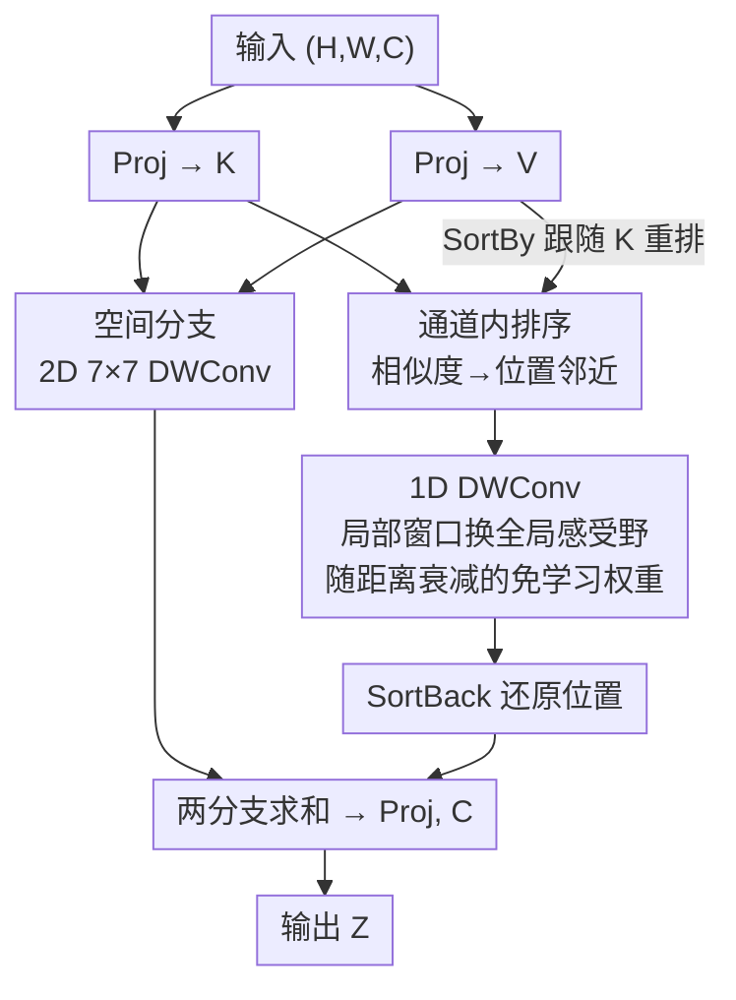

# Convolutional Neural Networks Driven by Content Similarity

**会议**: CVPR 2026  
**论文**: [CVF Open Access](https://openaccess.thecvf.com/content/CVPR2026/html/Zou_Convolutional_Neural_Networks_Driven_by_Content_Similarity_CVPR_2026_paper.html)  
**代码**: https://github.com/essenceoftheworld/ego  
**领域**: CNN 架构 / Backbone  
**关键词**: 卷积神经网络, 内容相似度, 门控卷积, 通道内排序, Token Mixer  

## 一句话总结
通过对特征做"通道内排序"把相似度高的 token 排到位置上相邻，再用一维深度卷积聚合，让卷积获得类似自注意力的"按内容聚合"能力，得到的纯 CNN 模型 Ego 在分类/分割/检测上以更低算力超过同规模 Transformer 与先进 CNN。

## 研究背景与动机
**领域现状**：ViT 之后，CNN 阵营一直在借鉴 Transformer 的思路找回竞争力——MetaFormer 把架构抽象成通用框架，VAN、Conv2Former、HorNet、MogaNet 等用大核卷积 + 门控机制不断逼近甚至超过强 baseline。门控卷积（gated convolution）已经成为后 ViT 时代 CNN token mixer 的主流积木。

**现有痛点**：尽管 CNN 借来了不少 Transformer 的"形"，卷积的"本质"没变——它**靠元素在时空维度上的相对位置**来聚合特征。而自注意力的核心逻辑是**靠特征相似度**建模全局关联。两种机制的根本差异，使 CNN 在建模"长程、依赖内容"的交互时天然受限，灵活性不如注意力模型。

**核心矛盾**：能不能在不引入注意力那套 $O(N^2)$ 两两交互、也不显式构图（GNN）的前提下，让卷积也按"内容相似度"而非"固定相对位置"来聚合信息？

**切入角度**：作者从 attention pooling 视角重新审视门控卷积，把卷积参数解读成"按相对位置查询得到的注意力权重"。由此推出一个关键设问：如果元素之间的相对位置本身就反映了它们的特征相似度（位置越近相似度越高），那么卷积参数就自然等价于按相似度生成的注意力权重了。

**核心 idea**：用一个**排序操作**把"特征相似度"翻译成"相对位置"——把相似的 token 重排到相邻位置，于是普通卷积就被间接改造成了"由内容相似度驱动"的聚合模式。

## 方法详解

### 整体框架
Ego 沿用 ConvNeXt / Swin 那种四阶段层级化 meta-architecture，每个 stage 由若干 Ego block 堆叠，block = 空间混合层（token mixer）+ FFN，stage 之间用普通卷积下采样。真正的创新全部集中在 token mixer——作者把它命名为 **SpatialEgo**。

SpatialEgo 是一个**双分支门控卷积**：输入先投影成 $K$ 和 $V$ 两路共享特征，然后兵分两路。一路是**原始空间分支**——对 $A$ 走标准的 2D 7×7 深度卷积，按空间位置聚合；另一路是本文新增的**内容相似度分支**——先把 token 按 $K$ 值做通道内排序，让相似的元素挨到一起，再用一维深度卷积在排好序的序列上聚合，最后还原回原始位置。两个分支输出相加后过线性层输出。整套机制不引入任何可学习的卷积权重（衰减权重是解析生成的），却能在局部窗口内隐式拿到全局感受野，复杂度保持 $O(N\log N)$。

### 关键设计

**1. 把门控卷积重读成"位置驱动的注意力"：找到卷积与自注意力的接口**

这是整篇论文的支点。标准门控卷积写作 $V=\text{Conv}_{pw1}(X)$、$A=\text{Conv}_{dw}(\text{Conv}_{pw2}(X))$、$Z=V\odot A$，表面上和自注意力差很远——它并不在 $V$ 里跨位置聚合，而是把聚合塞进了 $A$。作者把它换个写法：令 $K=\text{Conv}_{pw1}(X)$、$V=\text{Conv}_{pw2}(X)$，输出就能统一成注意力形式

$$Z_{i,j,c}=\sum_{\forall p,q}\varphi(K_{i,j,c},K_{p,q,c})\,V_{p,q,c},\quad \varphi(K_{i,j,c},K_{p,q,c})=\begin{cases}K_{i,j,c}W_{i,j,p,q,c}, & (p,q)\in\Omega_{i,j}\\ 0, & (p,q)\notin\Omega_{i,j}\end{cases}$$

其中 $\Omega_{i,j}$ 是以 $(i,j)$ 为中心的局部窗口，$W$ 是卷积参数矩阵。这一改写暴露出门控卷积与自注意力的**唯一本质差别**：对不同的 $V_{p,q,c}$，$K_{i,j,c}$ 是共享因子，真正决定注意力权重差异的只有 $W_{i,j,p,q,c}$；而 $W$ **只取决于元素间的相对位置**，跟 $K$ 的具体内容毫无关系。一句话——门控卷积是"位置驱动"，自注意力是"内容驱动"。找到这个接口，就有了把前者改造成后者的明确入口。

**2. 通道内排序：把"特征相似度"翻译成"位置邻近"**

既然卷积参数按相对位置生效，那只要让"内容能决定位置"，卷积就自动变成按相似度聚合。作者据此新增一条平行分支，核心是三个深度方向（逐通道）的排序算子：

$$K'=\text{Sort}_{dw}(K),\quad V'=\text{SortBy}_{dw}(V,K'),\quad Z'_{i,j,c}=\text{SortBack}_{dw}\!\Big(\sum_{\forall b}\psi(K'_{a,c},K'_{b,c})\,V'_{b,c}\Big)$$

三步含义很直白：$\text{Sort}_{dw}$ 在每个通道内把 $K$ 升序排，排完满足 $\min K_{i,j,c}=K'_{1,c}\le\cdots\le K'_{N,c}=\max K_{i,j,c}$（$N=H\times W$）；$\text{SortBy}_{dw}$ 让 $V$ 跟随 $K$ 的新顺序同步重排（若 $K_{i,j,c}$ 排到第 $a$ 位，则 $V_{i,j,c}$ 也排到第 $a$ 位）；$\text{SortBack}_{dw}$ 在聚合完成后把所有元素还原回原始空间位置。排序之后 $K$、$V$ 都变成一维序列，所以这条分支上的"卷积"其实是**一维深度卷积**。排序的妙处在于：$K$ 值越接近的元素排得越近，于是"相对位置近 ⇔ 内容相似"这条桥被真正搭起来——卷积按位置聚合，等价于按内容相似度聚合。相比 GNN，它**不显式建图、不维护邻接矩阵、不算两两关系**，只靠排序 + 标准卷积就实现了内容感知的全局聚合。

**3. 局部窗口换全局感受野：用 $2\alpha\lfloor\ln N\rfloor+1$ 的窗口避开二次复杂度**

排序带来一个额外红利——空间上相距很远的两个相似元素，排序后会挨在一起。这意味着**即便是很小的一维窗口，也隐含了全局感受野**。作者把滑动窗口取为 $2\alpha\lfloor\ln N\rfloor+1$（$N=H\times W$，$\alpha$ 为正整数）。这样设计有两个考量：其一，$N$ 越大、与某元素相似的元素往往越多，对数增长的窗口能自适应输入尺度；其二，相比全局卷积，该窗口让时间复杂度保持在 $O(N\log N)$ 且**不需要 FFT**。作者轻量扫了一遍 $\alpha$，发现 $\alpha=12$（即窗口 $24\lfloor\ln N\rfloor+1$）时性能已与全局卷积持平，遂取为默认值。

**4. 随距离衰减的免学习卷积参数：用 logspace 解析生成、跨位置跨通道共享**

排序序列里，两元素的相对距离直接反映相似程度，于是参数自然该"随距离衰减"。作者直接用 PyTorch 内置的 logspace 生成衰减序列来定义卷积参数：

$$W'_{a,b,c}=\frac{\text{base}^{\frac{\text{steps}-|b-a|}{\text{steps}}}}{\sum_{d\in\Theta_a}\text{base}^{\frac{\text{steps}-|d-a|}{\text{steps}}}}$$

其中 $\text{base}=10$、$\text{steps}=12\lfloor\ln N\rfloor+1$，以索引 $a$ 为中心向左右两侧随距离衰减并归一化。关键性质是：**权重只与相对位置有关、与通道无关**，所以全图只需生成一次、所有位置和通道共享，不引入任何可学习参数。作者还试了 linspace，性能与 logspace 几乎一致（Ego-T 上 83.9% vs 84.0%），说明"距离衰减"这个先验本身才是有效的，而非某个特定函数形式。

### 损失函数 / 训练策略
分类在 ImageNet-1K 上沿用 MetaFormer 设置：300 epoch、224×224、batch 4096、AdamW、学习率 4e-3 + cosine、20 epoch warmup、weight decay 0.05，配 RandAugment / Mixup / CutMix / Random Erasing / Label Smoothing / Stochastic Depth 等增强与正则，8×RTX 3090 训练。所有 Ego 变体都用**普通 FFN**（对比对象 OverLock 用了更强的 ConvFFN）。

## 实验关键数据

### 主实验（ImageNet-1K 分类，224×224）
| 模型 | 类型 | Params(M) | FLOPs(G) | Top-1(%) |
|------|------|-----------|----------|----------|
| Swin-T | Attn | 28 | 4.5 | 81.5 |
| ConvNeXt-T | Conv | 29 | 4.5 | 82.1 |
| Conv2Former-T | Conv | 27 | 4.4 | 83.2 |
| MogaNet-S | Conv | 25 | 5.0 | 83.4 |
| **Ego-T** | Conv | 27 | **3.8** | **84.0** |
| OverLock-T | Conv | 33 | 5.5 | 84.2 |
| OverLock-S | Conv | 56 | 9.7 | 84.8 |
| **Ego-S** | Conv | 39 | 7.4 | **84.8** |
| MogaNet-L | Conv | 83 | 15.9 | 84.7 |
| **Ego-B** | Conv | 57 | 12.6 | **85.1** |

Ego-T 以最低的 3.8 GFLOPs 拿到 84.0%，比 Conv2Former-T、MogaNet-S 高 0.6~0.8 个点；Ego-S（39M）直接追平 56M 的 OverLock-S；Ego-B 达 85.1%，超过 83M 的 MogaNet-L。下游同样领先：ADE20K 语义分割 Ego-B 52.3 mIoU（>OverLock-S 51.9、VAN-B4 52.2）；COCO 检测 Ego-B 53.3 AP$^b$（>MogaNet-B 0.7、HorNet-S 0.6）。

### 消融实验（Ego-T，ImageNet-1K）
| 配置 | Top-1(%) | 说明 |
|------|----------|------|
| Ego-T（完整） | 84.0 | 窗口 $24\lfloor\ln N\rfloor+1$ + logspace |
| 窗口 → $6\lfloor\ln N\rfloor+1$ | 83.7 | 窗口太小，掉 0.3 |
| 窗口 → $12\lfloor\ln N\rfloor+1$ | 83.7 | 仍未饱和 |
| 窗口 → $2N-1$（全局） | 84.0 | 与默认持平，证明局部窗口已够 |
| logspace → linspace | 83.9 | 换衰减函数几乎无影响 |
| 去掉一维分支（退回 GatedConv） | 83.5 | **掉 0.5**，相似度分支的核心价值 |

### 关键发现
- **一维内容分支是性能主来源**：把 SpatialEgo 退化成普通门控卷积（去掉排序 + 一维卷积分支），Ego-T 直接掉 0.5%，是所有消融里最大的单点损失。
- **"局部窗口=全局感受野"被定量验证**：窗口从 $24\lfloor\ln N\rfloor+1$ 扩到全局 $2N-1$ 时精度不再变化（都是 84.0%），说明排序已把全局信息压进了局部窗口，无需真做全局卷积。
- **衰减先验比函数形式更重要**：logspace 与 linspace 在所有窗口尺寸下差距 <0.1%，说明有效的是"随距离衰减 + 免学习"这个设计，而非具体公式。
- **检测对训练配置更敏感**：Ego 作为 backbone 时显存占用偏高，作者把 COCO 的 batch 从 16 降到 8（并相应调小学习率），Ego-T 因此略逊 MogaNet-S/HorNet-T；但规模放大后优势回归，Ego-B 反超它们。⚠️ 此处是作者自陈的配置妥协，跨规模比较时需带这个 caveat。
- **可视化佐证**：有效感受野可视化显示，Ego-T 在浅层就有明显更大的影响区域，而去掉一维分支的变体只关注锚点周围局部——直观印证排序确实增强了长程关联建模。

## 亮点与洞察
- **"排序"是把内容映射到位置的极简手段**：不引入注意力的两两交互、不显式建图，仅用排序就把"特征相似度"变成卷积天然吃的"相对位置"，机制上优雅且零额外可学习参数——这是最让人"啊哈"的一笔。
- **统一视角的价值**：把门控卷积改写成注意力形式后，"卷积只差一个内容驱动"的判断一目了然，整套方法都是顺着这个 reframing 自然长出来的，是"先讲清差在哪、再精准补上"的范例。
- **$O(N\log N)$ 且免 FFT**：用对数增长窗口 + 排序，既绕开 $O(N^2)$ 注意力，又不依赖 FFT 这类全局卷积技巧，工程上很轻。
- **可迁移思路**：先按某种 key 排序、再在排序序列上做局部一维操作，这套"sort-then-local-aggregate"模板有望迁到点云、集合、稀疏序列等"无固定网格但有相似度"的数据上。

## 局限与展望
- **理论解释偏弱**：作者承认排序机制缺乏更强的理论刻画，为什么排序后的局部窗口足以逼近全局，目前主要靠实验与可视化支撑。
- **时序数据需改造**：排序会打乱时间顺序、甚至从未来帧"泄露"信息，直接用于视频/序列不安全，需要 masked / time-aware 排序——这是明确的待解问题。
- **排序的可微与开销**：⚠️ 论文未细谈排序操作在反向传播中的可微处理与实际 GPU 时延（排序对硬件并不友好），这部分对复现与效率评估很关键。
- **检测配置妥协**：因显存被迫降 batch、调超参，使部分检测结果未必反映 Ego 的真实上限，公平性打了折扣。
- **改进方向**：作者提出把该机制与 deformable convolution 等结合，在"局部结构建模"与"内容驱动聚合"之间取得更灵活的平衡。

## 相关工作与启发
- **vs 自注意力 / Non-local**：两者都靠显式两两相似度做全局聚合（$O(N^2)$）；Ego 不算 pairwise 关系，而是排序后用局部一维卷积隐式聚合，亚二次复杂度，是注意力的"轻量平替"。
- **vs GNN（含动态建图）**：GNN 依赖显式图结构与邻接矩阵；Ego 完全不建图，靠通道内排序 + 标准深度卷积实现内容感知聚合，省掉了图构造与维护。
- **vs VAN / Conv2Former / HorNet / MogaNet**：这些先进 CNN 用大核、门控、递归门控提升表达力，但聚合依据始终是固定相对位置；Ego 的差异在于把聚合依据从"位置"换成"内容相似度"，补上了 CNN 相对注意力最本质的那块短板。
- **vs OverLock**：OverLock 用三分支多粒度 + ConvFFN 实现自顶向下注意力；Ego 用更简单的双分支 + 普通 FFN，就在同规模追平甚至反超，凸显排序机制的效率。

## 评分
- 新颖性: ⭐⭐⭐⭐⭐ 用"排序把相似度变成位置"的视角统一卷积与注意力，机制简洁且少见
- 实验充分度: ⭐⭐⭐⭐ 分类/分割/检测三任务 + 窗口/权重/分支三类消融较完整，但缺排序开销与可微性的实测
- 写作质量: ⭐⭐⭐⭐ 从门控卷积改写到内容分支的推导链清晰流畅
- 价值: ⭐⭐⭐⭐ 为 CNN 补上内容驱动聚合，提供了可迁移的"sort-then-conv"范式

<!-- RELATED:START -->

## 相关论文

- [\[CVPR 2026\] Content-Aware Frequency Encoding for Implicit Neural Representations with Fourier-Chebyshev Features](content-aware_frequency_encoding_for_implicit_neural_representations_with_fourie.md)
- [\[CVPR 2026\] Robust Spiking Neural Networks by Temporal Mutual Information](robust_spiking_neural_networks_by_temporal_mutual_information.md)
- [\[CVPR 2026\] On the Role of Temporal Granularity in the Robustness of Spiking Neural Networks](on_the_role_of_temporal_granularity_in_the_robustness_of_spiking_neural_networks.md)
- [\[CVPR 2026\] ID-Sim: An Identity-Focused Similarity Metric](id-sim_an_identity-focused_similarity_metric.md)
- [\[CVPR 2026\] Neural Differentiation in Deep Networks: A Theoretical Framework for Expressivity and Representational Diversity](neural_differentiation_in_deep_networks_a_theoretical_framework_for_expressivity.md)

<!-- RELATED:END -->
