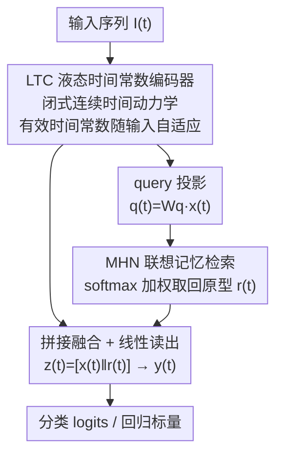

# Coupling Liquid Time-Constant Encoders with Modern Hopfield Memory

**会议**: CVPR 2026  
**论文**: [CVF Open Access](https://openaccess.thecvf.com/content/CVPR2026/html/Swain_Coupling_Liquid_Time-Constant_Encoders_with_Modern_Hopfield_Memory_CVPR_2026_paper.html)  
**代码**: 无（作者称将在发表后开源）  
**领域**: 神经架构 / 时序建模  
**关键词**: 液态神经网络, 连续时间, Modern Hopfield, 联想记忆, 损失曲面

## 一句话总结
给液态时间常数网络（LTC）外挂一个 Modern Hopfield 联想记忆模块，把"实时编码"和"长期记忆"从同一个隐状态里解耦出来，并从理论上证明这种耦合在保持有界稳定性的同时会收缩上游梯度、压低 Hessian 迹，从而让训练曲面更平滑，在 6 个时序基准上平均提升 2.3% 精度。

## 研究背景与动机

**领域现状**：时序建模这条线一路从 MLP → RNN/LSTM/GRU → Neural ODE 演进到液态神经网络（LNN）。其中 LTC（Liquid Time-Constant）单元是当下连续时间建模里很有吸引力的一支：它用闭式神经元动力学（而非 Neural ODE 那种迭代数值求解器）刻画连续时间演化，每个神经元有一个"随输入变化的有效时间常数"，因此推理轻量、天生支持多尺度动态，还自带有界稳定性保证。

**现有痛点**：LTC 有一个结构性硬伤——它只用**单一隐状态** $x(t)$ 同时承担两件事：既要编码快速变化的输入波动，又要存住缓慢累积的长期上下文。这两个角色挤在同一个向量里，导致快速输入会**覆盖或干扰**慢慢攒起来的上下文（论文称之为 information interference），让 LTC 在需要长程依赖的序列推理任务上力不从心。

**核心矛盾**：本质是一个"表征瓶颈"——在线处理（fast）和长期存储（slow）共用一套不断演化的状态，二者天然抢占同一份容量。生物神经系统的解法是**功能分离**：前额叶皮层负责实时序列控制，海马体通过联想机制存取情景记忆，两者协作而非挤在一个状态里。

**本文目标**：给连续时间编码器配一个显式的、内容可寻址的长期记忆，且必须满足三个约束——不破坏 LTC 的有界稳定性、不显著增加计算开销、能带来可度量的优化收益。

**切入角度**：作者注意到 Modern Hopfield Network（MHN）的检索规则在数学上等价于缩放点积注意力，具备指数级存储容量，而且在适当约束下其检索映射可以是**非扩张（non-expansive，L-Lipschitz 且 $L\le 1$）**的。这个"非扩张"性质正好是能和 LTC 的有界稳定性拼在一起、还能反过来约束梯度的关键钩子。

**核心 idea**：用一个简单的"投影成 query → MHN 检索记忆 → 与液态状态拼接 → 线性读出"的串行管线，把联想记忆挂到 LTC 上，让实时编码和联想回忆物理分离，同时借助非扩张检索从理论上压低曲率、平滑损失曲面。

## 方法详解

### 整体框架

整篇方法其实非常"轻"：它不是在 LTC 内部动刀，而是在 LTC 隐状态的输出端串一条记忆旁路。给定一个输入序列，LTC 层先把时间结构编码成隐状态轨迹 $x(t)$；每个时间步把 $x(t)$ 线性投影成一个 query $q(t)$，喂给 MHN 做联想检索得到记忆向量 $r(t)$；然后把 $x(t)$ 和 $r(t)$ **拼接**成 $z(t)$，过一个线性 readout 出最终预测。整条路径是单次前向（single-pass），没有额外非线性、没有循环检索，梯度可以从 loss 直接流回 LTC 和 MHN 两侧，且时序贡献与记忆贡献在特征空间里始终是可分离的两段。

### 关键设计

**1. LTC 液态时间常数编码器：用闭式动力学做连续时间编码**

这一块是底座，针对的是"如何高效地连续时间编码、又不踩 Neural ODE 数值求解的坑"。LTC 隐状态按下式演化：

$$\frac{dx(t)}{dt} = -\left(\frac{1}{\tau} + f_\theta(x(t), I(t))\right) x(t) + f_\theta(x(t), I(t))\,A$$

其中 $\tau>0$ 是基准时间常数，$A\in\mathbb{R}^n$ 是可学习的饱和向量，$f_\theta(\cdot)\ge 0$ 是非负门控。它诱导出一个**随输入变化的有效时间常数** $\tau_{\text{eff}}(t)=\frac{\tau}{1+\tau f_\theta(x(t),I(t))}$，让每个神经元能按当前输入/状态调整自己的响应快慢，这正是"液态"和多尺度动态的来源。关键是它有显式的有界性：在门控 $0\le f_\theta\le f_{\max}$ 时，$\|x(t)\|$ 被一个随时间指数衰减、且以饱和向量范数 $\|A\|$ 为界的函数压住，不会爆炸——这个有界性是后面能把记忆模块"安全"接上去的前提。

**2. MHN 联想记忆耦合：把长期记忆从单一隐状态里剥出来**

这是全文的核心动作，直接针对"单一隐状态同时扛快慢两种信号"的表征瓶颈。MHN 是一个内容可寻址的、能量驱动的记忆，存了 $N$ 个记忆模式 $\{\xi_j\}$，能量函数为 $E(q)=-\frac{1}{\beta}\log\big(\sum_{j=1}^{N}e^{\beta q^\top \xi_j}\big)$，其检索映射等价于缩放点积注意力：

$$h_\beta(q)=\sum_{i=1}^{N}\alpha_i(q)\,\xi_i,\quad \alpha_i(q)=\frac{\exp(\beta q^\top \xi_i)}{\sum_j \exp(\beta q^\top \xi_j)}$$

耦合分三步：**query 构造** $q(t)=W_q x(t)$（把 $n$ 维液态状态投到 $M$ 维记忆空间）；**记忆检索** $r(t)=h_\beta(q(t))$，$\beta>0$ 控制检索锐度（$\beta$ 大→尖锐地命中某个原型，$\beta$ 小→对所有模式平均）；**融合读出** $z(t)=[x(t)\,\|\,r(t)]$ 再过线性层 $y(t)=W_o z(t)+b_o$。这样做的妙处在于"透明且可分离"：实时时序信息留在 $x(t)$ 这一段，联想回忆的内容落在 $r(t)$ 这一段，两者拼接而非相加，互不覆盖——这正是把生物上"前额叶 vs 海马体"的功能分离落到架构里。

**3. 非扩张检索 → 梯度收缩 → 曲率下降：耦合为何能平滑优化**

光把记忆接上去还不够，作者要回答"为什么这么接会让训练更稳"。核心论证链有三环。其一，**有界稳定性（定理 1）**：当 $\|\xi_i\|\le R$ 时，由于 $\|r(t)\|\le R$、$\|x(t)\|$ 收敛到 $\|A\|$，拼接态满足 $\|z(t)\|\le\sqrt{\|A\|^2+R^2}$，与记忆规模 $N$ 和 $\beta$ 无关——readout 永远看不到爆炸激活。其二，**梯度收缩（引理 2）**：对那些只影响 query、不影响记忆模式的上游参数 $\theta$（即 LTC 参数和投影 $W_q$），由链式法则 $\nabla_\theta r(t)=J_{h_\beta}\nabla_\theta q(t)$，而非扩张性给出 $\|J_{h_\beta}\|\le L\le 1$，于是 $\|\nabla_\theta r(t)\|\le L\,\|\nabla_\theta q(t)\|$，检索映射只会收缩、绝不放大这些参数的梯度。其三，**Hessian 迹下降（定理 2）**：把上述对雅可比的界沿时间步累加，可得 $\mathrm{tr}(\nabla_\theta^2 \mathcal{L}_{\text{LTC-MHN}})\le \mathrm{tr}(\nabla_\theta^2 \mathcal{L}_{\text{LTC}})$——耦合后上游参数处的曲率不会比单独 LTC 更大。这条链就是论文对"为什么实测损失曲面更平、训练更稳"给出的理论解释。⚠️ 定理 2 原文仅给 proof sketch，且建立在 $h_\beta$ 的 Lipschitz 假设与二阶导有界假设上，结论是定性的"不大于"而非精确刻画，具体以原文为准。

### 损失函数 / 训练策略

任务相关的标准损失：分类用交叉熵、回归（Power 数据集）用 MSE。全部用 PyTorch，单卡 RTX A6000，Adam（$\beta_1=0.9,\beta_2=0.999$），学习率固定 0.001，batch size 32，每个实验跑 5 个随机种子取均值±标准差。架构超参很小：LTC 隐状态 $x(t)\in\mathbb{R}^{32}$，$W_q\in\mathbb{R}^{32\times32}$，MHN 存 $N=16$ 个 $\mathbb{R}^{32}$ 记忆向量、逆温度 $\beta=0.25$、4 个注意力头，拼接后 $z(t)\in\mathbb{R}^{64}$ 进 readout。

## 实验关键数据

### 主实验

在 6 个公开时序基准上对比 LSTM / CT-RNN / Neural ODE / CT-GRU / LTC，LTC-MHN 在 6 个里赢了 5 个（4 个分类 + 1 个异常检测 F1），仅在回归任务 Power 上不及 CT-GRU，平均提升 2.3%。

| 数据集 | 指标 | LTC（基线） | 最强对手 | LTC-MHN | 提升 |
|--------|------|------------|----------|---------|------|
| Gesture | 准确率↑ | 68.45% | 66.86%(CT-GRU) | **71.23%** | +2.78 |
| Occupancy | 准确率↑ | 93.66% | 92.57%(CT-RNN) | **95.77%** | +2.11 |
| Activity Recognition | 准确率↑ | 94.51% | 94.19%(Neural ODE) | **96.86%** | +2.35 |
| Sequential MNIST | 准确率↑ | 95.36% | 96.01%(CT-GRU) | **97.30%** | +1.29 |
| Ozone | F1↑ | 0.304 | 0.278(LSTM) | **0.321** | +0.017 |
| Power | MSE↓ | 0.592 | **0.579**(CT-GRU) | 0.629 | 劣于最佳 |

增益最明显的是分类任务：Gesture 上记忆层在稀疏异步事件流上减少误分类；Sequential MNIST 上周期性检索缓解了长程梯度衰减（+1.9%）；Ozone 这种稀有事件检测上 F1 从 0.304 提到 0.321，说明记忆有助于召回异常前兆。

### 消融实验

为证明增益来自"检索动态"而非"多塞了参数"，作者在数据集上取平均做了 6 变体对比，外加 Hessian 迹和梯度噪声尺度（GNS）两个优化诊断量。

| 变体 | #参数 | 准确率↑ | CE Loss↓ | Hessian 迹↓ | GNS | 说明 |
|------|-------|---------|----------|-------------|-----|------|
| LTC | 1653 | 87.99 | 0.267 | $1.6\times10^{-2}$ | 4.48 | 基线液态模型 |
| LTC match | 6037 | 88.47 | 0.258 | $4.02\times10^{-3}$ | 5.14 | 只把 LTC 参数堆到与 MHN 同量级 |
| **LTC-MHN** | 6053 | **90.42** | **0.197** | **$1.55\times10^{-3}$** | 3.35 | 完整模型（可学习 Hopfield 层） |
| LTC-MHN(frozen) | 6053 | 88.03 | 0.291 | $4.07\times10^{-3}$ | 4.87 | Hopfield 权重冻结在初始化 |
| LTC-MHN($\beta_0$) | 6053 | 82.21 | 0.392 | $7.02\times10^{-3}$ | 3.91 | $\beta=0$，退化成对所有模式均匀平均 |
| LTC-MHN(shuffle) | 6053 | 80.26 | 0.425 | $3.92\times10^{-3}$ | 0.98 | 每个 epoch 随机打乱记忆索引 |

### 关键发现
- **检索动态才是功臣，不是参数量**：LTC match 把参数堆到和 LTC-MHN 相当，准确率只从 87.99→88.47，曲率几乎没改善；而完整 LTC-MHN 把 Hessian 迹从基线 $1.6\times10^{-2}$ 压到 $1.55\times10^{-3}$（约一个数量级），准确率 90.42。一旦把检索冻结/均匀化/打乱，精度和曲率都退回到"容量匹配基线"水平，说明是动态联想检索在起作用。
- **损失曲面与表征几何双重佐证**：损失曲面可视化（沿两个正交随机方向重采样）显示 LTC-MHN 的盆地更宽更平、尖刺和 NaN 区域更少；PCA 嵌入显示 LTC-MHN 的类簇更紧致、类间更可分——作者解释为联想检索把状态拉向存储的原型，相当于对隐空间做了一层"去噪先验"，简化了线性 readout 的决策边界。
- **回归是软肋**：MHN 存的是有限离散原型，检索时把当前状态"吸"向最近原型，这对离散标签空间（分类）是天然契合，但对连续目标（回归）会引入阶梯式修正、overshoot 真值、增大方差——Power 数据集上误差曲线更震荡正是这个 discrete-memory bias 的体现。

## 亮点与洞察
- **把"非扩张检索"同时当成稳定性证明和正则机制来用**：同一个 $L\le 1$ 的 Lipschitz 性质，既保证了拼接态有界（不爆炸），又推出梯度收缩和 Hessian 迹下降。一个数学性质串起了"稳定性"和"好优化"两件事，这是全文最漂亮的地方。
- **架构极简、可分析性强**：整个耦合就是一次投影 + 一次注意力式检索 + 一次拼接，没引入任何新非线性，因此每一步都能写出闭式的范数/梯度界。这种"故意保持透明"的设计哲学，使理论分析成为可能。
- **可迁移的 trick**：把"单一隐状态扛快慢两类信号"显式拆成"在线状态 + 联想记忆旁路"的思路，对任何 RNN/SSM 类编码器都适用——只要外挂一个非扩张的内容寻址记忆并拼接，就有望平滑训练；GNS 和 Hessian 迹作为"诊断耦合是否真有效"的指标也值得借鉴。

## 局限与展望
- **离散记忆偏置伤回归**（作者承认）：原型吸附在连续目标上会 overshoot，未来想用插值式检索或残差修正缓解。
- **对检索温度 $\beta$ 与记忆陈旧度敏感**（作者承认）：全程用单一固定 $\beta$，分类的好值未必适合回归；记忆模式只靠反向传播更新，非平稳环境下会变陈旧，需要轻量的记忆刷新/替换。
- **基线与规模偏弱**（作者承认 + 自评）：只比了 RNN/连续时间基线，**没纳入近期 SOTA 的时序 Transformer 和 SSM**，也没测大规模/不规则采样场景——所以"赢 5/6"主要是在传统连续时间基线圈内的结论，不能外推成时序 SOTA。⚠️ 论文定位是"分析这种耦合"，而非刷榜。
- **机制解释仍偏定性**（自评）：定理 2 只有 proof sketch，"记忆如何缓解表征干扰"缺少更显式的刻画；曲率改善与精度提升之间是相关性论证，非因果证明。

## 相关工作与启发
- **vs 标准 LTC / 液态网络 [8]**：本文不改 LTC 内部动力学，而是承认其单一隐状态的容量瓶颈，外挂记忆旁路把快慢信号解耦；代价是参数从 ~1.6k 升到 ~6k，但换来一个数量级的 Hessian 迹下降。
- **vs Neural ODE**：两者都做连续时间，但 Neural ODE 靠迭代求解器、有数值不稳定和开销问题；LTC（及本文）用闭式动力学绕开求解器，本文进一步加了有界性 + 记忆。
- **vs Neural Turing Machine / Memory Networks [6,18]**：它们也提供外部记忆，但不保留液态模型的计算效率与稳定性保证；本文的 MHN 检索等价于注意力、有指数存储容量，且在非扩张约束下能写出显式稳定性与梯度界。
- **vs 记忆增强 Transformer [5] / iTransformer / SSM**：Transformer 类是离散时间、注意力二次复杂度、假设规则采样；SSM 线性复杂度但转移动力学固定、缺连续时间自适应。本文走的是"连续时间自适应 + 闭式稳定 + 高容量联想记忆"这条少有人走的组合。

## 评分
- 新颖性: ⭐⭐⭐⭐ 组件（LTC、MHN）都是现成的，但"在显式稳定性约束下把连续时间编码与联想记忆原则性耦合"并用非扩张检索同时推出有界性、梯度收缩、Hessian 迹下降，这个理论打包是新的。
- 实验充分度: ⭐⭐⭐ 6 数据集 + 5 种子 + 损失曲面/PCA/Hessian/GNS 多角度诊断，消融设计（frozen/β0/shuffle/match）很到位；但缺时序 Transformer 与 SSM 基线、缺大规模与不规则采样场景。
- 写作质量: ⭐⭐⭐⭐ 动机—机制—理论—实验链条清晰，定理与实测互相呼应，局限交代诚实。
- 价值: ⭐⭐⭐⭐ 给"如何安全地给连续时间编码器加记忆并解释其优化收益"提供了一个简洁、可分析的范式，对 RNN/SSM 类编码器有可迁移的设计与诊断启发。

<!-- RELATED:START -->

## 相关论文

- [\[ICML 2025\] Nonparametric Modern Hopfield Models](../../ICML2025/others/nonparametric_modern_hopfield_models.md)
- [\[CVPR 2026\] Curvature-Aware Zeroth-Order Optimization for Memory-Efficient Test-Time Adaptation](curvature-aware_zeroth-order_optimization_for_memory-efficient_test-time_adaptat.md)
- [\[ICML 2025\] Modern Methods in Associative Memory](../../ICML2025/others/modern_methods_in_associative_memory.md)
- [\[CVPR 2026\] DREAM: Document Recognition with Explicit Adaptive Memory](dream_document_recognition_with_explicit_adaptive_memory.md)
- [\[CVPR 2026\] Neural Collapse in Test-Time Adaptation](neural_collapse_in_test-time_adaptation.md)

<!-- RELATED:END -->
