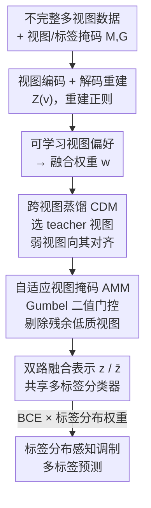

# Cross-View Distillation and Adaptive Masking for Incomplete Multi-View Multi-Label Classification

**会议**: CVPR 2026  
**论文**: [CVF Open Access](https://openaccess.thecvf.com/content/CVPR2026/html/Liu_Cross-View_Distillation_and_Adaptive_Masking_for_Incomplete_Multi-View_Multi-Label_Classification_CVPR_2026_paper.html)  
**代码**: 未公开  
**领域**: 多视图学习 / 多标签分类  
**关键词**: 不完整多视图、多标签分类、视图不平衡、跨视图蒸馏、自适应掩码  

## 一句话总结
针对"视图与标签双重缺失"的多标签分类，本文用一个强视图当 teacher 去蒸馏其余弱视图、再用一个可学习的二值门控把蒸馏后仍然不可靠的视图直接屏蔽掉，在六个数据集上稳定超过九个 SOTA。

## 研究背景与动机
**领域现状**：不完整多视图多标签学习（iM2L）要在"视图缺失（传感器故障）+ 标签缺失（标注昂贵）"双重不完整下，把多个视图的互补信息融合起来做多标签预测。主流路线包括一致性表示学习、表示解耦挖互补信息、以及对缺失视图做填充（imputation）。

**现有痛点**：不同视图之间存在天然的异质性——数据分布、特征维度、噪声水平都不同，导致各视图的学习难度和收敛速度差异巨大。若用一个统一、静态的联合训练目标硬拉所有视图，强视图会迅速过拟合、主导优化，弱视图被压制，整体性能反而次优。作者在完整 Pascal07 上做了视图组合实验，发现不同组合的性能差异显著，而"固定挑几个强视图融合"的策略一旦在真实场景里丢掉某个关键视图就会急剧掉点。

**核心矛盾**：近年缓解视图不平衡的方法（梯度调制、交替优化、单视图教师约束）都建立在一个假设上——**弱视图只是"还没优化好"**。但作者论证这个假设有缺陷：某些视图因为信息容量有限或噪声过高，存在**内在的"表示天花板"（representation ceiling）**，无论怎么自我优化都到不了高水平。硬逼模型从这种天花板视图里学，不仅学不动，还会拖累其他视图的优化。同时这些方法大多假设训练时数据完整，遇到随机缺失就很脆弱，而且很少考虑视图间的主动信息交互。

**本文目标 / 切入角度**：既然弱视图自己练不出来，那就别指望"自优化"，而是**让强视图把知识传给弱视图**；对那些蒸馏也救不回来的视图，干脆在融合前**显式剔除**，别让它污染融合表示。

**核心 idea**：用"跨视图蒸馏（强视图→弱视图对齐）+ 自适应掩码（融合前屏蔽残余低质视图）"两段式机制实现均衡的多视图优化，再叠一个标签分布感知的梯度调制处理多标签长尾。

## 方法详解

### 整体框架
CDAM 的输入是带视图掩码矩阵 $M$ 和标签掩码矩阵 $G$ 的不完整多视图数据 $\{X^{(v)}\}_{v=1}^m$（$M_{i,v}=1$ 表示第 $i$ 个样本的第 $v$ 个视图可观测，$G_{i,j}=1$ 表示第 $j$ 个标签已知），输出是多标签预测。

整条流水线是：每个视图先过各自的编码器 $E^{(v)}$ 投影到共享隐空间得到 $Z^{(v)}$，并配一个解码器做重建正则防止表示坍缩；然后用一个可学习的视图偏好向量算出每个样本的视图融合权重 $w_i^{(v)}$。**跨视图蒸馏模块（CDM）** 依据这个权重选出每个样本的 teacher 视图（权重最高的可观测视图），把其余 student 视图的表示拉去和 teacher 对齐；**自适应掩码模块（AMM）** 紧随其后，对蒸馏完仍然不可靠的视图做一次显式质量评估，用二值门控把它们从融合中剔除，得到过滤后的融合表示 $\bar z_i$；最后蒸馏融合表示 $z_i$ 和过滤融合表示 $\bar z_i$ 共享同一个多标签分类器，分类损失再被一个标签分布感知的权重调制，照顾长尾标签。

### 关键设计

**1. 跨视图蒸馏 CDM：用最强视图当 teacher，主动把知识灌给弱视图**

针对"弱视图存在表示天花板、自优化救不回来"的痛点，CDM 不再像梯度调制/交替优化那样被动地调各视图学习率，而是**主动利用视图间的信息互补**。它先在多视图融合阶段用一个全局可学习的视图偏好向量 $q\in\mathbb{R}^m$ 给每个样本算融合权重：

$$w_i^{(v)} = \frac{\exp(l_i^{(v)})}{\sum_{k=1}^m \exp(l_i^{(k)})},\qquad l_i^{(v)} = \begin{cases} q^{(v)}, & M_{i,v}=1\\ -\infty, & M_{i,v}=0 \end{cases}$$

把缺失视图的 logit 置为 $-\infty$，softmax 后权重自然为 0，天然兼容视图缺失。每个样本的 teacher 视图就取**可观测视图里融合权重最高的那个**：$v_i^* = \arg\max_v\{w_i^{(v)}\mid M_{i,v}=1\}$，对应表示记为 $z_i^*$；student 集合 $S_i$ 是该样本其余的可观测视图。蒸馏损失把所有有效 teacher-student 对的对齐误差聚合：

$$L_{dis} = \frac{\sum_{i=1}^n \sum_{v\in S_i} \lVert z_i^{(v)} - sg[z_i^*]\rVert_2^2}{\sum_{i=1}^n |S_i|}$$

关键在 $sg[\cdot]$ 这个 **stop-gradient**：teacher 被固定成稳定的学习目标，知识**单向**从 teacher 流向 student，避免双向对齐让所有视图一起坍缩到一个平凡解。$|S_i|=0$（只有一个可观测视图）的样本直接跳过。这样弱视图不是靠自己硬练，而是被强视图"带飞"，从根上缓解视图不平衡。

**2. 自适应视图掩码 AMM：可微二值门控，把蒸馏也救不回的视图直接屏蔽**

蒸馏不是万能的——对含极端噪声或信息极少的视图，对齐之后质量可能依旧很差；而静态的视图级加权忽略了样本级差异，会让低质视图污染融合表示。AMM 的思路是给每个样本的每个视图做一次**实例级二值决策**：要么纳入融合、要么整体屏蔽。它用一个 MLP 打分网络 $f_{scorer}$ 现场给每个视图表示打分 $e_i^{(v)} = f_{scorer}(z_i^{(v)})$，作为"该视图该被选中"的证据。

难点是二值选择本身不可导、会阻断反传。AMM 用 **Gumbel-Softmax 重参数化** 解决：先把证据扩成二维 $t_i^{(v)} = [e_i^{(v)}, -e_i^{(v)}]$，加 Gumbel(0,1) 噪声 $g_i^{(v)}$，用温度 $\tau$ 做连续松弛 $\tilde s_i^{(v)} = \mathrm{softmax}((t_i^{(v)}+g_i^{(v)})/\tau)$；前向用 **Straight-Through Estimator** 取硬 one-hot 保证是严格的离散选择，反传则让梯度走连续的 $\tilde s_i^{(v)}$。one-hot 的第一维即为该视图的选择掩码 $s_i^{(v)}$。推理时切到确定性模式 $s_i^{(v)} = \mathbb{I}(\sigma(e_i^{(v)})>0.5)$。最终过滤掩码是学到的选择掩码与先验视图掩码的逐元素相乘 $\bar M_{i,v} = M_{i,v}\cdot s_i^{(v)}$，据此重算融合权重得到过滤表示 $\bar z_i$。

为防止门控退化到"全选"的平凡解，作者加了一个有靶向性的掩码惩罚——**只惩罚那些被分配到已知缺失视图上的选择掩码**（缺失视图本就不该被选）：

$$L_{mask} = \frac{\sum_{i=1}^n \sum_{v=1}^m s_i^{(v)}\cdot \mathbb{I}(M_{i,v}=0)}{\sum_{i=1}^n \sum_{v=1}^m \mathbb{I}(M_{i,v}=0)}$$

更巧的是 AMM 不是无脑过滤，而是有一条"过滤不能掉点"的约束：把蒸馏表示 $z_i$ 和过滤表示 $\bar z_i$ 喂进**共享分类器** $f_{cls}$ 得到两路预测，分别算 BCE 损失 $L_{cls}$ 和 $\bar L_{cls}$，用改进损失只在过滤后变差时惩罚：

$$L_{imp} = \bar L_{cls} + \max(0,\ \bar L_{cls} - sg[L_{cls}]) + L_{mask}$$

中间的 hinge 项保证"剔除视图"这个动作只会保持或提升性能、不会反噬，让掩码学得既积极又安全。

**3. 标签分布感知调制：压制头部标签梯度，让长尾标签学得动**

多标签数据普遍长尾，优化容易被高频标签垄断，低频标签的梯度被淹没。作者在分类 BCE 里给每个标签乘一个由平滑逆频率导出的平衡权重 $h_j = (1/f_j)^\gamma$（$f_j$ 是第 $j$ 个标签的频率，$\gamma$ 用来平滑逆频率、避免对极稀有标签过度加权）：

$$L_{cls} = \frac{1}{\sum_{i,j} G_{i,j}} \sum_{i=1}^n \sum_{j=1}^c G_{i,j}\cdot h_j\cdot L_{BCE}(p_{i,j}, Y_{i,j})$$

$G_{i,j}$ 保证只对已知标签计损（兼容标签缺失），$h_j$ 给低频尾部标签更大权重，从而把被头部标签抢走的优化预算还给长尾。

### 损失函数 / 训练策略
总目标把重建、蒸馏、改进三块加权求和：

$$L_{all} = \alpha\cdot L_{rec} + \beta\cdot L_{dis} + L_{imp}$$

其中 $L_{rec}$ 是只在可观测视图上计的多视图重建损失（编码器-解码器，防表示坍缩、当表示学习的地基），$\alpha,\beta$ 控制各目标的权衡。每个 epoch 内按"编码重建 → 选 teacher 算蒸馏 → 生成二值掩码 → 双路融合预测 → 算改进损失 → 算总损失更新"的顺序训练。

## 实验关键数据

### 主实验
六个多视图多标签基准（Corel5k / Pascal07 / Espgame / Iaprtc12 / Mirflickr / ODIR，前五个 6 视图、ODIR 5 视图），50% 视图缺失 + 50% 标签缺失，对比九个 SOTA，10 次独立运行取平均。下表摘录 AP 与 AUC（值越高越好；HL/RL/OE/Cov 统一报成 1-x）：

| 数据集 | 指标 | 之前最好 baseline | CDAM | 提升 |
|--------|------|------|----------|------|
| Corel5k | AP | 0.418 (SIP) | **0.428** | +0.010 |
| Pascal07 | AP | 0.560 (VCMN) | **0.588** | +0.028 |
| Pascal07 | AUC | 0.857 (VCMN) | **0.873** | +0.016 |
| Iaprtc12 | AP | 0.340 (MSLPP) | **0.352** | +0.012 |
| Mirflickr | AP | 0.615 (MSLPP) | **0.631** | +0.016 |
| ODIR | AP | 0.683 (VCMN) | **0.701** | +0.018 |
| ODIR | AUC | 0.895 (VCMN) | **0.906** | +0.011 |

CDAM 在全部六个数据集上稳定取得 SOTA。作者分析：DICNet 虽抓视图交互但其对比学习没考虑视图间信息质量的固有差异，遇到不平衡多视图会掉点；SIP 用信息瓶颈压非共享信息追求一致表示，但共享表示的质量会被低质视图拖累——这正是 CDAM 蒸馏+掩码要解决的。30% 双缺失率下（下表）CDAM 同样全面领先，说明低缺失率时也有效：

| 数据集 | 指标 | 次优 baseline | CDAM |
|--------|------|------|------|
| Corel5k | AP / AUC | 0.479 / 0.928 | **0.488 / 0.935** |
| Pascal07 | AP / AUC | 0.610 / 0.882 | **0.637 / 0.895** |
| Mirflickr | AP / AUC | 0.651 / 0.881 | **0.664 / 0.887** |

此外在 Pascal07 上扫不同缺失率，性能随缺失率上升"优雅退化"，且模型对**视图缺失比标签缺失更敏感**；完整数据（0% 缺失）下 CDAM 依然表现优异。

### 消融实验
Corel5k / Pascal07，50% 视图 + 50% 标签缺失（去掉 $L_{imp}$ 时仍保留 $L_{cls}$ 提供分类监督）：

| 配置 | Corel5k AP / AUC | Pascal07 AP / AUC | 说明 |
|------|------|------|------|
| 仅 Backbone | 0.3730 / 0.8748 | 0.5363 / 0.8362 | 基线 |
| + $L_{rec}$ | 0.3941 / 0.9061 | 0.5651 / 0.8564 | 重建当地基，单加就涨 |
| + $L_{rec}$ + $L_{dis}$ | 0.4230 / 0.9154 | 0.5849 / 0.8707 | 加蒸馏继续涨 |
| + $L_{rec}$ + $L_{imp}$ | 0.4188 / 0.9155 | 0.5750 / 0.8655 | 加掩码也单独有效 |
| 完整 CDAM | **0.4281 / 0.9178** | **0.5876 / 0.8733** | 两模块互补，最高 |

### 关键发现
- **重建损失是地基**：没有 $L_{rec}$ 把表示学好，蒸馏和掩码都发挥不出来；它单加就把 Corel5k AP 从 0.373 拉到 0.394。
- **蒸馏与掩码独立有效且互补**：单加 $L_{dis}$ 或 $L_{imp}$ 都涨，但二者一起（完整模型）最高，证明"先把弱视图拉强、再把救不回的剔掉"是两个互补的环节。
- **对视图缺失更敏感**：视图缺失比标签缺失更伤性能，符合直觉——丢一个关键视图等于丢掉一整路信息源。
- **超参鲁棒**：$\alpha,\beta$ 网格搜索显示峰值落在一片较平的区域，多组组合都接近最优，$\alpha$ 增大性能先升后稳，$\beta$ 的最优值与 $\alpha$ 有交互。

## 亮点与洞察
- **"表示天花板"这个观察很关键**：它直接否定了"弱视图只是没练好"的隐含假设，把研究问题从"怎么把弱视图练强"重构成"怎么让强视图带弱视图 + 实在救不了就剔除"，是整篇方法的逻辑起点。
- **stop-gradient 让蒸馏方向单向、稳**：teacher 固定为稳定目标，避免多视图互相对齐坍缩到平凡解——这个 trick 可迁移到任何"用同一批表示里挑一个当锚点拉齐其余"的场景。
- **改进损失里的 hinge 项很巧**：$\max(0,\bar L_{cls}-sg[L_{cls}])$ 把"过滤不能掉点"写成一条软约束，让 AMM 的剔除行为只升不降，既鼓励积极过滤又防止误删——比单纯加掩码惩罚更安全。
- **靶向掩码惩罚而非全局稀疏**：只惩罚选中"已知缺失视图"的掩码，避免门控退化到全选，同时不盲目鼓励稀疏，设计很有针对性。

## 局限与展望
- 代码未公开，复现成本偏高；六个数据集都是相对传统的多视图多标签 benchmark（图像描述类特征视图 GIST/HSV/SIFT 等），在更现代的多模态/大特征视图上的表现待验证。
- teacher 视图按"全局可学习偏好 + 实例可观测性"选取，本质仍依赖学到的全局视图偏好 $q$；当某样本里恰好缺了真正最强的视图、只剩次强当 teacher 时，蒸馏目标的质量可能下降，⚠️ 这一点论文未深入讨论。
- 改进损失只约束"过滤表示不比蒸馏表示差"，但 $z$ 与 $\bar z$ 共享同一分类器、两路预测如何协同/推理时用哪一路融合，原文交代略简，⚠️ 以原文为准。
- AMM 的二值门控对极端噪声视图能整体剔除，但做不到视图内部分通道/部分区域的细粒度过滤；后续可探索更细粒度的质量评估。

## 相关工作与启发
- **vs 梯度调制 / 交替优化（如 OGM、PMR 系）**：它们被动地放慢强视图、催弱视图，假设弱视图能靠自优化追上来；CDAM 直接用强视图蒸馏弱视图、主动做信息交互，并承认部分视图有天花板、该剔则剔。
- **vs 单视图教师约束（teacher view guidance）**：传统做法预训练单视图教师去引导弱视图编码器；CDAM 不需要额外预训练，teacher 是**样本级动态选取**的内部最强视图，且天然兼容视图缺失。
- **vs DICNet（对比学习抓视图交互）**：DICNet 没区分视图信息质量差异，不平衡时会掉点；CDAM 显式按融合权重区分强弱并做单向蒸馏。
- **vs SIP（信息瓶颈求一致表示）**：SIP 的共享表示会被低质视图拖累；CDAM 用 AMM 在融合前就把低质视图屏蔽，保护融合表示不被污染。

## 评分
- 新颖性: ⭐⭐⭐⭐ "表示天花板"观察 + 主动跨视图蒸馏 + 可微二值掩码的组合在 iM2L 里较新颖。
- 实验充分度: ⭐⭐⭐⭐ 六数据集、九 baseline、多缺失率、消融与超参敏感性齐全；但缺失现代多模态视图的验证。
- 写作质量: ⭐⭐⭐⭐ 动机层层递进、公式完整、模块职责清晰。
- 价值: ⭐⭐⭐⭐ 对多视图不平衡提出可复用的"蒸馏+掩码"两段式范式，hinge 改进损失与靶向掩码惩罚有借鉴价值。

<!-- RELATED:START -->

## 相关论文

- [\[CVPR 2026\] EXOTIC: External Vision-driven Incomplete Multi-view Classification](exotic_external_vision-driven_incomplete_multi-view_classification.md)
- [\[CVPR 2026\] DF²-VB: Dual-level Fuzzy Fusion with View-specific Boosting for Multi-view Multi-label Classification](df2-vb_dual-level_fuzzy_fusion_with_view-specific_boosting_for_multi-view_multi-.md)
- [\[CVPR 2026\] Imbalanced View Contribution Evaluation and Refinement for Deep Incomplete Multi-View Clustering](imbalanced_view_contribution_evaluation_and_refinement_for_deep_incomplete_multi.md)
- [\[CVPR 2026\] Prototype-based Causal Intervention for Multi-Label Image Classification](prototype-based_causal_intervention_for_multi-label_image_classification.md)
- [\[CVPR 2026\] Revisiting F-measure Optimization in Multi-Label Classification: A Sampling-based Approach](revisiting_f-measure_optimization_in_multi-label_classification_a_sampling-based.md)

<!-- RELATED:END -->
