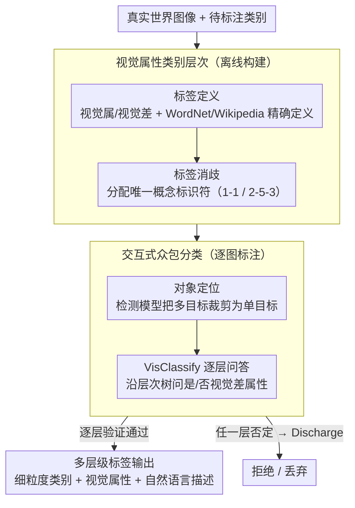

# Crowdsourcing of Real-world Image Annotation via Visual Properties

**会议**: CVPR 2026  
**arXiv**: [2604.14449](https://arxiv.org/abs/2604.14449)  
**代码**: 无  
**领域**: 数据集构建/标注方法论  
**关键词**: image annotation, crowdsourcing, visual properties, semantic gap, object hierarchy

## 一句话总结

提出一种基于视觉属性约束的图像标注方法论，通过知识表示构建对象类别层次结构并结合交互式众包框架，利用视觉属和视觉差引导标注过程，减少标注者主观性和语义鸿沟问题。

## 研究背景与动机

现有图像数据集（如 ImageNet、Open Images）的构建过程存在主观性问题：标注者根据个人理解将图像匹配到预定义类别，导致多对多映射问题和标注不一致。例如同一图像在 ImageNet 中被标注为三个不同粒度的类别，或明显不同的图像（实物、玩具、卡通、人偶）被标为同一"棕熊"类别。根源是自然语言的复杂性和多义性引入的语义鸿沟问题 (SGP)。

## 方法详解

### 整体框架

这是一篇标注方法论，要解决的是 ImageNet、Open Images 这类数据集里标注者凭主观把图像硬塞进抽象类别名所导致的多对多映射和标注不一致（同一图像被标成三种粒度、实物/玩具/卡通被标为同一"棕熊"）。它把标注拆成四步流水线，并归为三件事：**离线构建**视觉属性类别层次——先基于知识库给每个类别精确定义视觉属性（标签定义 Label Definition），再为每个标签分配唯一概念标识符消歧（标签消歧 Label Disambiguation）；**逐图标注**——先识别并裁剪出单个对象（对象定位 Object Localization），再让标注者沿层次树逐层验证视觉属性来分类（视觉分类，由 VisClassify 算法驱动）；最后**输出**多层级标签。核心是把"匹配抽象类名"换成"验证具体视觉属性"。

### 关键设计

**1. 视觉属性类别层次：用视觉属/视觉差替代抽象类名**

针对标注者直接匹配抽象类别名带来的主观性。层次以视觉属（visual genus）作为父类共享属性（如"金翅雀"的视觉属是"雀"），以视觉差（visual differentia）作为区分兄弟类别的属性（如"深红色面部和黄黑色翅膀"）；标注时要求验证这些具体视觉属性，而不是凭印象判断它属于哪个抽象类，从源头压低主观性。这一层次分两步离线构建：标签定义（Label Definition）通过 WordNet、Wikipedia 等知识库为每个类别精确定义视觉属性，消除自然语言多义带来的模糊；标签消歧（Label Disambiguation）为每个标签分配唯一概念标识符（如 "1-1"、"2-5-3"），解决同名多义问题。最终得到一棵可逐层提问的层次树 $H$。

**2. 交互式众包问答（VisClassify）：把分类变成逐层是/否提问**

针对让标注者自由判断类名认知负担重、易出错。标注每张图前先做对象定位（Object Localization）：用目标定位模型自动把多目标图像裁剪为单目标图像，消除"一图多物"的对象歧义。随后进入 VisClassify（Algorithm 1）递归问答——以层次树 $H$ 为基础从根节点提问，每个分支点的问题都由知识库预定义的视觉差属性生成，标注者只需判断"是否具有某视觉差属性"。回答"否"就直接 Discharge（丢弃）该图像；回答"是"则记录当前层级标签并继续遍历子节点，直到当前节点无子类、或标注者否定所有子类的视觉差为止。例如区分"金翅雀"和"绿雀"，只需回答"是否有深红色面部"这一视觉差即可。

**3. 多层级标签输出：一次标注产出多粒度监督**

针对单一类别标签信息量有限。VisClassify 自上而下遍历层次树时会记录沿途每一层的标签，因此最终每张图获得多层级标签：不同粒度的细粒度类别标签、视觉属性标签和视觉特征的自然语言描述，从而可同时服务于对象识别、细粒度分类、零样本识别和图像描述等多种任务。

### 损失函数 / 训练策略

本文为标注方法论工作，不涉及模型训练。

## 实验关键数据

### 主实验

通过众包实验验证方法有效性，标注者反馈讨论了优化众包设置的方向。与无约束自由标注相比，基于视觉属性的约束标注显著提高了标注一致性和准确性。实验中标注者通过回答层次化视觉属性问题来标注鸟类图像（如区分"金翅雀"和"绿雀"需验证"深红色面部"这一视觉差），结果显示不同背景的标注者在视觉属性引导下达成了更高一致性。最终构建的数据集包含多粒度标签、视觉属性标签和自然语言描述，可直接服务于对象识别、细粒度分类、零样本识别和图像描述等多任务。

### 关键发现

- 视觉属性约束有效减少了标注者间的主观性差异
- 层次化问答流程降低了标注任务的认知负担
- 多层级标签为多种下游任务提供了更丰富的监督信号

## 亮点与洞察

- 从语义鸿沟问题出发系统性地重新设计标注流程，立意好
- 视觉属/视觉差的概念化设计具有哲学深度
- 多层级标签输出增加了数据集的通用性
- 标注过程中每个类别通过 WordNet 和 Wikipedia 等知识库精确定义，消除了自然语言多义性引入的模糊
- Label Disambiguation 步骤为每个标签分配唯一概念标识符（如 "1-1" 和 "2-5-3"），解决多义词问题
- Object Localization 步骤使用目标定位模型自动裁剪多目标图像为单目标图像，消除对象歧义

## 局限与展望

- 预定义视觉属性层次需要领域专家参与构建，扩展成本高
- 仅针对对象识别场景，对场景理解、动作识别等任务适用性有限
- 实验规模较小，未在大规模数据集上充分验证
- 视觉差属性的定义依赖分类学中的 canons 准则，对不同文化背景的标注者适应性待验证
- 未探讨与自动化标注工具（如 MLLM 辅助标注）的结合可能性

## 相关工作与启发

- 对现有基准数据集标注质量问题的系统分析有参考价值
- 视觉属性引导标注思路可融入主动学习和人机协作标注
- 层次化标签方案对构建更高质量数据集有指导意义
- ImageNet 和 Open Images 中的具体案例分析揭示了现有标注的系统性缺陷

## 评分

5/10 — 问题定义有价值，但缺乏大规模实验验证和量化改进指标。

标注方法论的四步策略（Label Definition → Label Disambiguation → Object Localization → Visual Classification）体现了从知识表示到众包执行的完整流程设计。

<!-- RELATED:START -->

## 相关论文

- [\[CVPR 2026\] Clair Obscur: an Illumination-Aware Method for Real-World Image Vectorization](clair_obscur_an_illumination-aware_method_for_real-world_image_vectorization.md)
- [\[CVPR 2026\] UniMERNet: A Universal Network for Real-World Mathematical Expression Recognition](unimernet_a_universal_network_for_real-world_mathematical_expression_recognition.md)
- [\[CVPR 2026\] Event-based Visual Deformation Measurement](event-based_visual_deformation_measurement.md)
- [\[CVPR 2026\] Modeling the Visual Ambiguity of Human Sketches](modeling_the_visual_ambiguity_of_human_sketches.md)
- [\[CVPR 2026\] Towards Stable Federated Continual Test-Time Adaptation in Wild World](towards_stable_federated_continual_test-time_adaptation_in_wild_world.md)

<!-- RELATED:END -->
