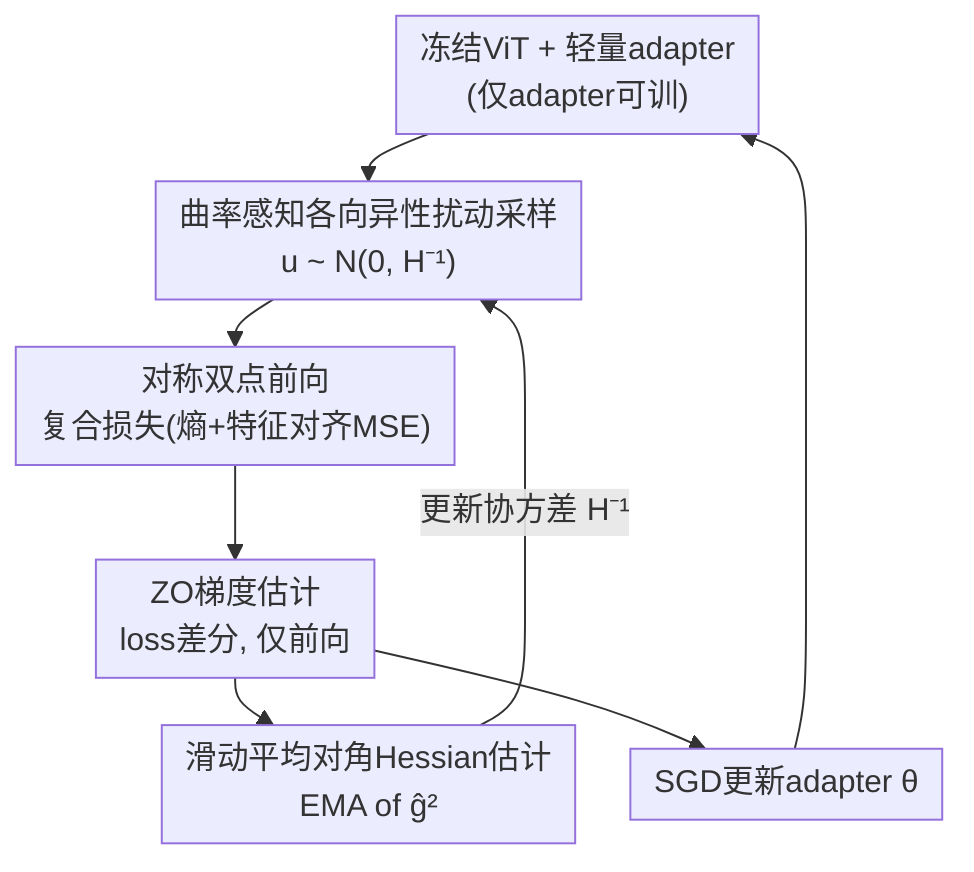

# Curvature-Aware Zeroth-Order Optimization for Memory-Efficient Test-Time Adaptation

**会议**: CVPR 2026  
**论文**: [CVF Open Access](https://openaccess.thecvf.com/content/CVPR2026/html/Zhang_Curvature-Aware_Zeroth-Order_Optimization_for_Memory-Efficient_Test-Time_Adaptation_CVPR_2026_paper.html)  
**代码**: https://github.com/Hollyming/CAZO  
**领域**: 模型压缩 / 测试时自适应  
**关键词**: 零阶优化, 测试时自适应, 曲率感知, Hessian低秩, 内存高效  

## 一句话总结
针对设备端测试时自适应（TTA）需要省内存的场景，本文用**只做前向、不做反向**的零阶优化（ZO）来微调一个轻量 adapter，并利用「TTA 过程中 Hessian 持续低秩且缓变」这个观察，把各向同性的随机扰动换成**曲率感知的各向异性扰动**，大幅压低 ZO 梯度估计的方差——在 ImageNet-C 上达到 69.0% 的 SOTA，同时比 BP 方法省约 70% 显存。

## 研究背景与动机
**领域现状**：测试时自适应（TTA）让预训练模型在推理阶段用无标签的测试数据在线适应分布漂移（domain shift），是边缘设备上对抗 OOD 数据的主流范式。绝大多数 TTA 方法（TENT、CoTTA、SAR 等）都靠反向传播（BP）来微调，用熵最小化或自监督损失做目标。

**现有痛点**：BP 需要保存激活值做反向计算，显存开销很大。实测 TENT 要 6,404 MB、CoTTA 因数据增广要 17,773 MB，对内存受限的端侧部署很不友好。于是 BP-free 的 TTA（只靠前向、采样或启发式）成为刚需，零阶优化（ZO）是其中最有代表性的一支——它**只用函数值（loss）差分来估计梯度**，无需反向图，显存几乎只等于一次前向。

**核心矛盾**：ZO 的天生缺陷是**梯度估计方差极高**。标准随机梯度估计（RGE）的方差正比于参数维度 $d$，即 $O(d/k)$；理论上朴素 ZO-SGD 要比一阶方法多花 $O(d)$ 倍迭代才能达到同等精度。在高维神经网络上，这个方差让 ZO 收敛慢到几乎没法用于 TTA。所以「在不引入反向传播的前提下，把 ZO 的方差压下去」是能否让 ZO 真正服务于 TTA 的关键。

**切入角度**：作者去观察 TTA 过程中 loss landscape 的曲率，发现 Hessian 矩阵在整个适应过程中**始终是低秩的，而且主曲率方向缓慢变化**——top-20 特征值占了 96%+ 的方差，有效秩只占总维度的 0.22%，相邻步之间主子空间的投影比稳定在 0.9 左右。这意味着：只有极少数方向真正"陡"，大部分维度都在平坦区。

**核心 idea**：既然曲率只集中在少数方向且稳定可估，那就别再用各向同性的随机扰动「平均用力」——而是把扰动协方差设成 $\tilde H^{-1}$，**在陡方向上少扰、在平坦方向上多扰**，用更"信息密集"的采样把 ZO 梯度方差压下来。这就是 Curvature-Aware Zeroth-Order（CAZO）。

## 方法详解

### 整体框架
CAZO 把 TTA 转成一个**纯前向的在线优化循环**：冻结预训练 ViT-B/16 的全部权重，只在第 3 层插一个轻量 adapter 作为可训练参数 $\theta_{\text{adapt}}$。每个适应步里，先在当前参数上做对称双点扰动 $\theta\pm\epsilon u$ 各跑一次前向、算复合损失，用 loss 差分估计 ZO 梯度；关键改动是扰动向量 $u$ 不再从标准高斯采，而是从 $\mathcal N(0,\tilde H_t^{-1})$ 采——这个 $\tilde H_t$ 是用 ZO 梯度的逐元素平方做滑动平均（EMA）在线维护的对角 Hessian 近似。估出的梯度一边用来 SGD 更新 adapter，一边回灌去更新 Hessian 估计，形成闭环。整个过程没有任何反向传播。

复合损失沿用前向友好的设计：测试数据上的无监督熵损失 + 用 clean 数据特征统计做特征对齐的 MSE 损失。

### 关键设计

**1. 低秩且缓变的 Hessian 观察：为各向异性采样提供地基**

这一步不是算法而是支撑全篇的关键实证。作者在 ImageNet-C（Gaussian 损坏、severity-5）上对 ViT-B/16 的 adapter 参数计算经验 Hessian，在第 0/25/50/99 步分别看其特征谱，得到两个性质：(i) **持续低秩**——top-20 特征值始终占总方差 96% 以上，有效秩只占参数维度 0.22%，而且特征值衰减和累计解释方差随时间高度稳定；(ii) **主子空间缓变**——取每步 top-$r$ 特征向量 $U_t^{(r)}$ 构投影矩阵 $P_t=U_t^{(r)}(U_t^{(r)})^\top$，再算相邻步的投影比

$$\rho_t^{(r)}=\frac{\|P_t H_{t+1}\|_F}{\|H_{t+1}\|_F},$$

对 $r\in\{5,10,15,20\}$，$\rho_t^{(r)}$ 在整个适应过程都稳定在 0.9 附近，且 batch 越大轨迹越平滑。低秩说明"只有少数方向值得扰"，缓变说明"这些方向可以在线可靠估计、不必每步从头算"——这正是后面用 EMA 估 Hessian、用 $\tilde H^{-1}$ 当采样协方差的合法性来源。

**2. 曲率感知各向异性扰动采样：把方差从陡方向挪走**

标准 ZO（RGE）从 $\mathcal N(0,I)$ 采各向同性扰动，等于在所有方向平均用力，浪费在平坦的无信息方向、又对陡方向探测不足。CAZO 的核心改动是把采样分布换成预条件高斯：扰动 $u_i\sim\mathcal N(0,\tilde H_t^{-1})$，梯度估计变成

$$\hat g(\theta_t)=\frac1k\sum_{i=1}^k\frac{\mathcal L(\theta_t+\epsilon u_i)-\mathcal L(\theta_t-\epsilon u_i)}{2\epsilon}u_i,\quad u_i\sim\mathcal N(0,\tilde H_t^{-1}).$$

直觉是协方差 $\tilde H^{-1}$ **在高曲率（陡）方向上压小扰动、在低曲率（平）方向上放大扰动**，让有限次函数评估更"信息密集"，从而直接降低梯度估计方差。由于对高维网络直接算 $\tilde H^{-1}$ 不可行，作者用对角近似 $\Sigma=\tilde H^{-1}=\mathrm{diag}(\sigma_1^2,\dots,\sigma_d^2)\succ0$，既保留了各向异性的核心收益，又把曲率信息的存储/计算压到与参数维度同阶（对角），显存几乎不随扰动数 $k$ 增长。理论上作者还给出了非凸光滑假设下 $O(1/\sqrt T)$ 的收敛保证，且收敛常数显式依赖曲率界 $\beta_l,\beta_u$——当曲率代理条件较好（$\beta_l$ 不太小、$\beta_l^2>\beta_u$）时常数比各向同性 ZO 更小，呼应了实测中的样本效率提升。

**3. 滑动平均对角 Hessian 估计：用前向梯度在线追踪曲率**

剩下的问题是 $\tilde H_t$ 从哪来——既不能反向算二阶导，又要随适应在线更新。CAZO 借「Hessian 缓变」这一观察，用 ZO 梯度估计 $\hat g$ 的**逐元素平方**做指数滑动平均来近似对角曲率：

$$D_t=(1-\nu)D_{t-1}+\nu\,\hat g^2(\theta_{t-1}),\qquad \tilde H_t=\mathrm{diag}\!\left(\frac{D_t}{1-(1-\nu)^t}\right),$$

其中 $\nu\in[0,1]$ 是 EMA 系数，分母 $1-(1-\nu)^t$ 是偏差修正项（Adam 式）。这等于复用前向就能拿到的 ZO 梯度做副产品来估二阶信息，零额外反向开销；EMA 的"记忆"恰好匹配主子空间缓变的性质——在一个时间上稳定的子空间里平滑追踪曲率漂移，使适应动态更鲁棒。整个流程见 Algorithm 1：每步采 $K$ 个扰动、对称双点算 loss、估梯度、按式 (6) 更新对角 Hessian、再 SGD 更新参数。$\nu$ 取中等值（0.8）最好，取 1.0（完全不平滑）会失稳。

### 损失函数 / 训练策略
复合损失 = 测试数据上的无监督熵损失 + 用 clean 数据特征统计做特征对齐的 MSE 损失（沿用 FOA）。优化器是标准 SGD，但梯度来自 ZO 估计；adapter 默认插在第 3 层、down-sampling ratio 取 384、扰动数 $k=20$、EMA 系数 $\nu=0.8$。

## 实验关键数据

### 主实验（ImageNet-C severity-5，ViT-B/16，每损坏重置）
CAZO 平均精度 69.0%，同时击败 BP-free 与 BP-based 两类方法。

| 方法 | 是否 BP | 平均 Acc.(%) | 备注 |
|------|---------|-------------|------|
| NoAdapt | × | 55.5 | 不适应基线 |
| T3A | × | 56.9 | BP-free |
| FOA | × | 65.8 | CMA-ES 演化 prompt |
| ZOA | × | 67.5 | 零阶 + 域知识 bank |
| TENT | ✓ | 59.8 | 熵最小化 |
| SAR | ✓ | 62.7 | |
| CoTTA | ✓ | 61.9 | 师生 + 增广 |
| DeYO | ✓ | 64.7 | |
| EATA | ✓ | 66.8 | |
| **CAZO** | × | **69.0** | 比 FOA/ZOA 高 +3.2/+1.5，比 SAR/CoTTA 高 +6.3/+7.1 |

在更难的持续 TTA（CTTA，不重置、连续遍历所有损坏）下，CAZO 仍以 65.3% 居首，比 LCoTTA / ETA / SAR 高 +3.0 / +3.6 / +3.7；在 ImageNet-R/V2/Sketch 上平均 63.5%，同样有竞争力。

### 内存与运行时（Table 4，50,000 样本，H20 GPU）
| 方法 | 是否 BP | Acc.(%) | 时间(s) | 显存(MB) |
|------|---------|---------|---------|----------|
| TENT | ✓ | 59.8 | 210 | 6,404 |
| CoTTA | ✓ | 61.9 | 961 | 17,773 |
| FOA (p=28) | × | 65.8 | 2,885 | 1,553 |
| ZOA | × | 67.5 | 398 | 1,660 |
| ZO (k=20) | × | 62.9 | 3,166 | 1,695 |
| CAZO (k=2) | × | 65.2 | 417 | 1,693 |
| CAZO (k=8) | × | 67.9 | 1,260 | 1,695 |
| **CAZO (k=20)** | × | **69.0** | 3,127 | **1,695** |

显存只有 BP 方法的 1/4~1/10（1,695 vs 6,404~17,773，约省 70%+），且因为用对角曲率代理 + 轻量 adapter，**显存几乎不随扰动数 $k\in\{2,4,8,20\}$ 变化**。相比裸 ZO（k=20 只有 62.9%），曲率感知在相同前向预算下把精度抬到 69.0%，直接验证了方差缩减的实际收益。

### 量化模型（Table 5）
在 8-bit 下 CAZO 仍达 67.8%（几乎不掉点），6-bit 下保持 61.2%，均显著高于 ZO/FOA/T3A，说明对低比特边缘部署友好。

### 消融与敏感性（Fig. 6 / Table 4）
| 配置 | 关键指标 | 说明 |
|------|---------|------|
| adapter 插第 3 层 | Acc 峰值 | 低层特征更利于快速域对齐；后层更差 |
| down-sampling ratio=384 | 最佳平衡 | 更小 ratio（96/128）参数暴涨却无增益甚至掉点 |
| 扰动数 $k$: 2→6 | 59.3%→62.1% | ECE 急降；>6 后边际收益递减，$k=20$ 为默认 |
| 单点扰动 | 显著掉点 | 故采用对称多点扰动 |
| EMA $\nu=0.8$ | 69.0% 最优 | $\nu=1.0$（不平滑）会失稳 |

### 关键发现
- **曲率感知是涨点主力**：裸 ZO 62.9% → CAZO 69.0%（+6.1%），唯一区别就是把各向同性扰动换成 $\mathcal N(0,\tilde H^{-1})$。
- **省内存来自对角代理 + adapter**：显存不随 $k$ 变化是工程上很实用的性质，意味着可以加大扰动数换精度而不增显存。
- **更大 adapter ≠ 更好**：性能增益不是靠增加适应容量堆出来的，过大的 adapter 反而掉点——说明收益确实来自更优的采样几何而非参数量。

## 亮点与洞察
- **把二阶信息塞进零阶采样**：通常二阶优化要算/存 Hessian，这里反过来——只用前向就能拿到的 ZO 梯度平方做 EMA，零额外反向就近似出对角 Hessian，再当扰动协方差用，思路很巧。
- **观察驱动设计**：先用投影比 $\rho_t^{(r)}$ 严格量化"主子空间缓变"，再用它合法化 EMA 在线估计，是"先实证后建模"的范本。
- **可迁移性**：曲率感知各向异性采样不限于 TTA——任何高维、只能前向的 ZO 场景（黑盒攻击、LLM 前向微调、不可导优化）都可以套这套对角 Hessian-EMA 预条件来降方差。

## 局限与展望
- **只用对角近似**：忽略了曲率方向间的耦合（off-diagonal），在 Hessian 主子空间非轴对齐时，对角代理可能不是最优各向异性。
- **运行时仍偏长**：$k=20$ 要 3,127s，和 FOA 同量级，但远慢于 ZOA（398s）；精度-速度权衡里精度赢、速度并不占优，小 $k$（如 k=2，417s）精度会回落到 65.2%。
- ⚠️ 收敛界里 $\beta_l^2>\beta_u$ 才保证常数优于各向同性，这个条件在实际曲率代理上是否总成立、敏感性如何，正文未充分讨论（以原文/附录为准）。
- **复合损失依赖 clean 特征统计**：特征对齐 MSE 需要源域特征统计，纯无源（source-free）极端场景下这一项是否可得需注意。

## 相关工作与启发
- **vs ZO / RGE 基线**：两者都只用前向 loss 差分估梯度，区别在采样分布——RGE 用各向同性 $\mathcal N(0,I)$，CAZO 用曲率预条件 $\mathcal N(0,\tilde H^{-1})$，把方差从平坦/陡方向重新分配，相同前向预算下精度 +6.1%。
- **vs FOA**：FOA 用 CMA-ES 演化 prompt 向量、population 大（p=28 要 28 次前向），CAZO 用对称双点 ZO + 对角 Hessian，精度更高（69.0% vs 65.8%）、显存相近。
- **vs ZOA（并行工作）**：ZOA 面向量化模型、强调长期适应的域知识管理；CAZO 聚焦曲率感知采样来降 ZO 方差，相近显存下精度更强（+1.5%）。
- **vs BP-based（TENT/CoTTA/SAR）**：它们靠反向梯度，精度未必更高却要 4~10× 显存；CAZO 用前向-only 在精度和显存上同时取胜。

## 评分
- 新颖性: ⭐⭐⭐⭐ 把"Hessian 低秩缓变"观察转成 ZO 各向异性采样的曲率预条件，角度新且自洽。
- 实验充分度: ⭐⭐⭐⭐ 覆盖标准/持续 TTA、4 个数据集、内存/运行时、8/6-bit 量化和多项消融。
- 写作质量: ⭐⭐⭐⭐ 观察→动机→方法→理论链路清晰，公式与算法完整。
- 价值: ⭐⭐⭐⭐ 让前向-only TTA 在精度上追平甚至超过 BP，且省 70% 显存，端侧部署实用价值高。

<!-- RELATED:START -->

## 相关论文

- [\[CVPR 2026\] Neural Collapse in Test-Time Adaptation](neural_collapse_in_test-time_adaptation.md)
- [\[CVPR 2026\] Back to Source: Open-Set Continual Test-Time Adaptation via Domain Compensation](back_to_source_open-set_continual_test-time_adaptation_via_domain_compensation.md)
- [\[CVPR 2026\] WiTTA-Bench: Benchmarking Test-Time Adaptation for WiFi Sensing](witta-bench_benchmarking_test-time_adaptation_for_wifi_sensing.md)
- [\[CVPR 2026\] Towards Stable Federated Continual Test-Time Adaptation in Wild World](towards_stable_federated_continual_test-time_adaptation_in_wild_world.md)
- [\[ECCV 2024\] MemBN: Robust Test-Time Adaptation via Batch Norm with Statistics Memory](../../ECCV2024/others/membn_robust_test-time_adaptation_via_batch_norm_with_statistics_memory.md)

<!-- RELATED:END -->
