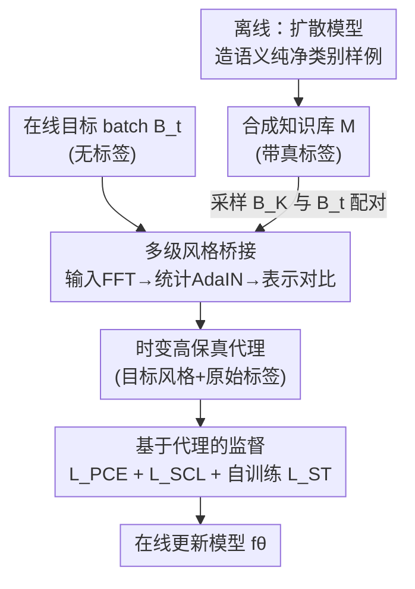

# Dance Across Shifts: Forward-Facilitation Continual Test-Time Adaptation through Dynamic Style Bridging

**会议**: CVPR 2026  
**arXiv**: [2605.18608](https://arxiv.org/abs/2605.18608)  
**代码**: https://github.com/z1358/DAS (有)  
**领域**: 测试时适应 / 持续学习 / 域泛化  
**关键词**: 持续测试时适应(CTTA)、前向促进、合成知识库、风格桥接、扩散模型

## 一句话总结
针对持续测试时适应(CTTA)里"监督信号又少又不可靠"的老大难，本文不再像以往那样把变化的测试数据硬拉回源域静态锚点(backward-alignment)，而是反过来——离线用扩散模型造一批语义纯净的类别样例，测试时把它们动态"染"上当前目标域的风格(输入/统计/表示三级桥接)，从而现场产出带真标签、又贴合当前分布的可靠监督，在 ImageNet-C / CIFAR100-C / CIFAR10-C 上把平均错误率分别降到 44.1% / 29.8% / 9.1%，且显存和延迟远低于扩散类方法。

## 研究背景与动机
**领域现状**：CTTA 要让部署后的模型在线适应一串不断变化的目标域(如各种图像损坏),既拿不到源数据、也没有标签,只能靠自己的伪标签做自训练。主流做法是 **backward-alignment(后向对齐)** 范式：从源域知识里造一个"监督替身",再逼着当前不断演化的模型状态去对齐这个替身——具体形式包括参数正则(EATA)、表示对齐(RMT)、统计先验匹配,以及近年的扩散方法(DDA/SDA)把输入"去噪"投影回一个合成域。

**现有痛点**：这些替身本质上是对"真监督"的弱近似,而且是**静态锚点**。当目标分布持续漂移时,模型当前状态(算自无标注目标数据)被强行和一个陈旧、含噪的锚点比较,结果就是被噪声或过时的对齐线索牵着走,误差累积、灾难性遗忘。扩散类方法(SDA)更要在测试时反复跑去噪,延迟和显存爆炸(见效率表 SDA 延迟是源模型的 1719 倍),还自带生成偏置。

**核心矛盾**：后向对齐的根本问题在于"方向反了"——它把会动的目标数据去迁就不会动的旧知识,而 CTTA 真正缺的是**贴合当前上下文的、可信的监督**。静态锚点和演化分布之间存在天然张力,怎么调都是个憋屈的折中。

**本文目标**：(1) 找到一个比源域替身更可信的语义基底;(2) 让这个基底能随数据流实时"跟着分布走",在线现场产出与当前目标域对齐的监督。

**切入角度**：与其后向约束,不如**前向促进(forward-facilitation)**——主动把可靠知识演化到当前语境,为模型量身定制监督。生成模型恰好能提供"语义纯净的类别样例"作为可信基底,缺的只是把它适配到当前域的桥接手段。

**核心 idea**：离线造一个语义纯净的合成知识库(带真标签),测试时用多级风格桥接把它"染"成当前目标域的样子(只换风格、不改语义),用这些高保真代理产出按需监督——把先验知识从"静态约束"变成"动态资产"。

## 方法详解

### 整体框架
方法叫 **Dynamic Style Bridging(动态风格桥接,DAS)**,核心是把"先验知识"从静态锚点改造成随数据流共同演化的时变监督源。整条流程分两段:**离线一次性**用扩散模型建一个紧凑的合成知识库(每类几张语义纯净的样例,带真标签);**在线每个 batch** 从知识库采一批合成样本 $B_K$、与当前目标 batch $B_t$ 配对,经过输入级 FFT 风格注入、浅层统计对齐、表示级对比三级桥接,把合成样例"染"成当前目标域的风格(语义不变),再用这些"已对齐、带真标签"的代理通过 proxy 交叉熵监督模型,辅以目标侧自训练损失稳住在线适应。

### 关键设计

**1. 前向促进范式 + 离线合成知识库：给 CTTA 一个可信的语义基底**

后向对齐范式最大的硬伤是手里压根没有一个可靠的语义锚——它只能从源域反推弱替身,或者把输入去噪回合成域,本质都是拿"会动的数据"去迁就"不会动的旧知识"。本文反其道而行,先在**部署前一次性**用预训练扩散模型(如 Stable Diffusion 1.5)为每个类别生成 $M$ 张"语义纯净"的原型样例:用诸如 "a realistic, clear photo of [CLS], on a clean background" 的提示词,生成单物体、无背景杂乱、无遮挡的样本,得到知识库 $\mathcal{M}=\{(x_i^K, y_i^K)\}_{i=1}^{C\times M}$。它有两个关键好处:一是**语义纯净**——每张图就是该类的理想锚点,不含真实世界的干扰物;二是**计算高效**——预生成意味着在线适应时**完全不碰扩散模型**,避免了 DDA/SDA 那种测试时反复去噪的天价开销。这一步把"先验知识从模糊替身变成显式可信的带标签基底",是整个前向促进范式能立得住的前提

**2. 多级风格桥接机制：让静态知识跟着目标分布实时进化**

光有语义纯净的合成样例还不够——它们自带**生成偏置**,风格和真实目标域(尤其是各种损坏图像)差很远,直接拿来监督会带偏。本文不去做静态对齐,而是**主动把合成知识染成当前目标 batch 的风格**,且分三级从外观到表示层层递进(合成 batch $B_K$ 与目标 batch $B_t$ 按 index 顺序配对,纯为实现方便,保证 batch 级风格对齐):

- **输入级(FFT 振幅替换)**:傅里叶变换能把图像风格(振幅谱 $\mathcal{F}^{\mathcal{A}}$)和内容(相位谱 $\mathcal{F}^{\mathcal{P}}$)解耦。对每个合成-目标对 $(x_i^K, x_j^t)$,用目标的振幅谱替换合成图的振幅谱,内容(相位)保持不变:
$$\tilde{x}_i^K = \mathcal{F}^{-1}\big([\mathcal{F}^{\mathcal{A}}(x_j^t),\ \mathcal{F}^{\mathcal{P}}(x_i^K)]\big)$$
这让合成样例在进编码器前就先获得了目标域的外观特征。

- **统计级(AdaIN 式对齐)**:在浅层特征图 $z$ 上,按通道沿空间维算实例级均值 $\mu$、标准差 $\sigma$,把合成特征的统计量对齐到目标样本:
$$\tilde{z}(\tilde{x}_i^K) = \sigma_j^t \left(\frac{z(\tilde{x}_i^K)-\tilde{\mu}_i^K}{\tilde{\sigma}_i^K}\right) + \mu_j^t$$
强制浅层特征的一阶、二阶统计与目标一致。

- **表示级(监督对比)**:用模型预测给目标样本打伪标签,在联合 batch 上做监督对比学习 $\mathcal{L}_{SCL}$,把跨域的同类样本在表示空间聚到一起、异类推开,完成深层语义对齐。

三级合起来,静态知识库就被改造成一个**时变**的形态,在外观、特征统计、语义表示三个层面都和当前目标域高度对齐,从而现场产出和瞬时分布强耦合的按需监督——这正是前向促进"知识跟着分布走"的落地

**3. 基于代理的监督目标：用染好风格的带标签代理直接喂干净监督**

桥接后的代理 $\tilde{x}_i^K$ 既贴合当前目标风格、又携带知识库里的**真标签** $y_i^K$,于是可以直接当作有监督样本来训练模型。本文据此定义 **proxy 交叉熵** $\mathcal{L}_{PCE}$:
$$\mathcal{L}_{PCE} = -\sum_{c=1}^{C} y_{i,c}^K \log p_{i,c},\quad p_i = \text{softmax}(f_\theta(\tilde{x}_i^K))$$
由于代理风格已对齐当前域,$\mathcal{L}_{PCE}$ 提供的是**直接、无偏**的语义迁移信号——这是它和"靠模型自己伪标签自训练"的本质区别:伪标签在域漂移下又噪又会累积误差,而这里的标签是真的。为稳住在线适应,再叠加教师-学生式的对称交叉熵自训练损失 $\mathcal{L}_{ST}$(目标侧)。总损失等权相加:
$$\mathcal{L} = \mathcal{L}_{PCE} + \mathcal{L}_{SCL} + \mathcal{L}_{ST}$$
等权就够稳,无需额外调权

## 实验关键数据

### 主实验
骨干统一用 ViT-B/16(ImageNet-1K 预训练),batch size 50,Adam lr=1e-5,合成知识库用 SD 1.5 生成,在线适应全程不碰扩散模型。三个标准 CTTA benchmark 均在最高损坏等级 5、全在线顺序适应 15 个损坏域,报告 15 域平均分类错误率(越低越好)。

| 数据集 | 指标 | 本文 | 之前SOTA | 提升 |
|--------|------|------|----------|------|
| ImageNet-to-ImageNet-C | 平均错误率% | **44.1** | 47.6 (DPCore, ICML'25) | 相对 ↓7.3% |
| ImageNet-C vs 扩散方法 | 平均错误率% | **44.1** | 55.8 (SDA, CVPR'25) | 相对 ↓20.9% |
| CIFAR100-to-CIFAR100-C | 平均错误率% | **29.8** | 33.7 (RMT) / 36.4 (REM) | 相对 ↓30.5% (vs SDA 42.9) |
| CIFAR10-to-CIFAR10-C | 平均错误率% | **9.1** | 11.1 (REM, ICML'25) | ↓2.0 |

源模型在 ImageNet-C 上裸跑错误率高达 60.3%,本文降到 44.1%。值得注意:DDA/SDA 这类输入级去噪方法在 Gaussian/shot/impulse 噪声上表现不错,但在更广的损坏类型(如 contrast 上 SDA 高达 89.3%)上崩盘,暴露了去噪策略的局限;本文则在 15 类损坏上整体稳健。

### 消融实验
在 ImageNet-to-ImageNet-C 上逐步激活各组件(Tab. 3):

| 配置 | 平均错误率↓ | 说明 |
|------|---------|------|
| $Ex_1$ 仅自训练 | 50.0 | 无可靠监督的 baseline |
| $Ex_2$ +知识库($\mathcal{L}_{PCE}$,无桥接) | 47.4 | 注入显式语义,但仍有生成偏置 |
| $Ex_3$ +输入级 FFT | 45.8 | 在 $Ex_2$ 上加外观风格注入 |
| $Ex_4$ +统计级 | 45.4 | 在 $Ex_2$ 上加统计对齐 |
| $Ex_5$ +表示级 $\mathcal{L}_{SCL}$ | 46.5 | 在 $Ex_2$ 上加对比对齐 |
| $Ex_6$ +输入+统计 | 44.6 | 两级桥接叠加 |
| $Ex_7$ 完整模型 | **44.1** | 三级全开,协同最优 |

效率对比(CIFAR100-C,Tab. 4):

| 方法 | 显存(GiB)↓ | 相对延迟↓ | 平均错误率↓ |
|------|-----------|----------|-----------|
| Source | 2.1 | 1.0 | 44.0 |
| OBAO (ECCV'24) | 21.6 | 10.3 | 33.9 |
| SDA (CVPR'25) | 95.8 | 1719.2 | 42.9 |
| **Ours** | 19.9 | 9.0 | **29.8** |

### 关键发现
- **合成知识库本身已是大头**:仅加 $\mathcal{L}_{PCE}$(无任何桥接)就把 50.0→47.4,说明"显式语义锚"这一步价值很高;三级桥接再把 47.4→44.1,逐级递进、彼此互补。
- **扩散方法贵到不可用**:SDA 测试时反复去噪,显存 95.8 GiB、延迟是源模型的 1719 倍,精度反而只有 42.9%;本文延迟仅 9 倍、精度 29.8%,效率-效果双赢。
- **知识库极小就够**:每类仅 1 张合成样例就能拿到优异表现,超过 2 张后基本不敏感;最终设为 2000 张(ImageNet-1K 约每类 2 张),存储开销可忽略——这与 OBAO 缓存越大伪标签噪声越严重形成对比。
- **对生成器鲁棒**(Tab. 5):BigGAN 45.0 / SD 1.5 44.1 / SD 3.0 43.8,换更强生成器还能继续涨,说明框架能搭生成模型进步的便车。
- Grad-CAM 显示本文在不同损坏下都能稳定聚焦前景物体,而源模型注意力随域剧烈漂移、SDA 仅对特定损坏有效。

## 亮点与洞察
- **范式翻转最值得品**:把"让数据迁就静态旧知识"翻成"让知识进化去贴合当前数据",一句话点破了 CTTA 监督不可靠的病根。这种"换方向"的思路可迁移到任何"在线适应却缺监督"的场景(如在线域增量、流式分割)。
- **风格/内容解耦用得巧**:FFT 振幅换、AdaIN 统计对齐都是老技术,但组合成"只换风格不动语义"的桥接,正好满足"代理标签必须保真"的诉求——三级从外观到表示层层递进,设计动机非常清楚。
- **把扩散模型的成本挪到离线**:核心 trick 是"预生成 + 在线零扩散调用",既吃到生成模型的语义红利,又避开了 DDA/SDA 的测试时去噪天价开销,工程上极其讨巧,可复用到一切"想用生成知识但怕慢"的部署场景。
- **代理带真标签**这点很关键:大多数 TTA 方法只能靠伪标签,本文给出了一个"在无源、无标签的测试时仍能拿到真监督"的路子。

## 局限与展望
- **依赖类别能被文本生成**:知识库靠文生图,对于细粒度类别(扩散模型难以准确生成)或开放词表/无法用文本描述的类别,语义纯净度和覆盖度可能打折。
- **风格桥接假设"风格可迁、语义不变"**:对于损坏不仅改风格还破坏内容结构(如严重 elastic/pixelate)的情况,FFT/AdaIN 这类外观级对齐能否完全弥合域差有待商榷;表格里 elastic、jpeg 等本文相对优势确实较小。
- **batch 内按 index 配对**:合成-目标样本按序配对仅为实现方便,batch 内类别分布不均时,这种随意配对是否最优、能否用更聪明的匹配(如按预测类配对)进一步提升,论文未深入。
- $\mathcal{L}_{ST}$ 的具体形式放在补充材料,正文未展开,自训练这部分对整体稳定性的真实贡献需看补充。
- 仅验证了图像分类的损坏域漂移,迁到检测/分割等密集预测任务、或真实世界(非合成损坏)漂移上的有效性还需进一步验证。

## 相关工作与启发
- **vs SDA / DDA(扩散后向对齐)**: 它们把目标数据**去噪投影回合成域**这个静态锚点,测试时反复跑扩散,贵且自带生成偏置;本文反向——把合成知识**染成目标域风格**送过去,在线零扩散调用,延迟从 1719× 降到 9×,精度还更高(CIFAR100-C 42.9%→29.8%)。
- **vs OBAO(动态缓存高置信样本)**: OBAO 在数据流里缓存低熵目标样本当知识库,缓冲越大伪标签噪声越严重;本文用扩散造的**带真标签**合成样本,每类 1-2 张就够,既无伪标签噪声又几乎不占存储。
- **vs RMT / EATA 等源域替身对齐**: 它们从源域知识造弱替身做后向约束,在持续漂移下被陈旧锚点牵着走;本文提供的是随分布共同演化的时变监督,直接绕开"静态锚 vs 演化分布"的折中。
- **vs 训练时用合成数据增广**: 已有工作多在训练阶段拿合成数据做数据增强;本文强调的是**部署阶段持续演化合成知识**来现场生成监督信号,用法和目标都不同。

## 评分
- 新颖性: ⭐⭐⭐⭐⭐ 把 CTTA 从后向对齐翻成前向促进,范式级别的重新框定,角度清新且自洽
- 实验充分度: ⭐⭐⭐⭐ 三大 benchmark + 逐组件消融 + 效率/生成器/知识库规模分析齐全,但仅限分类任务、未覆盖密集预测与真实漂移
- 写作质量: ⭐⭐⭐⭐⭐ 动机推导(backward vs forward)讲得极清楚,图表组织到位
- 价值: ⭐⭐⭐⭐⭐ 效率-效果双优、即插即用、对生成器鲁棒,部署友好,实用价值高

<!-- RELATED:START -->

## 相关论文

- [\[CVPR 2026\] Towards Stable Federated Continual Test-Time Adaptation in Wild World](towards_stable_federated_continual_test-time_adaptation_in_wild_world.md)
- [\[CVPR 2026\] Back to Source: Open-Set Continual Test-Time Adaptation via Domain Compensation](back_to_source_open-set_continual_test-time_adaptation_via_domain_compensation.md)
- [\[CVPR 2026\] Neural Collapse in Test-Time Adaptation](neural_collapse_in_test-time_adaptation.md)
- [\[CVPR 2026\] WiTTA-Bench: Benchmarking Test-Time Adaptation for WiFi Sensing](witta-bench_benchmarking_test-time_adaptation_for_wifi_sensing.md)
- [\[CVPR 2026\] Curvature-Aware Zeroth-Order Optimization for Memory-Efficient Test-Time Adaptation](curvature-aware_zeroth-order_optimization_for_memory-efficient_test-time_adaptat.md)

<!-- RELATED:END -->
