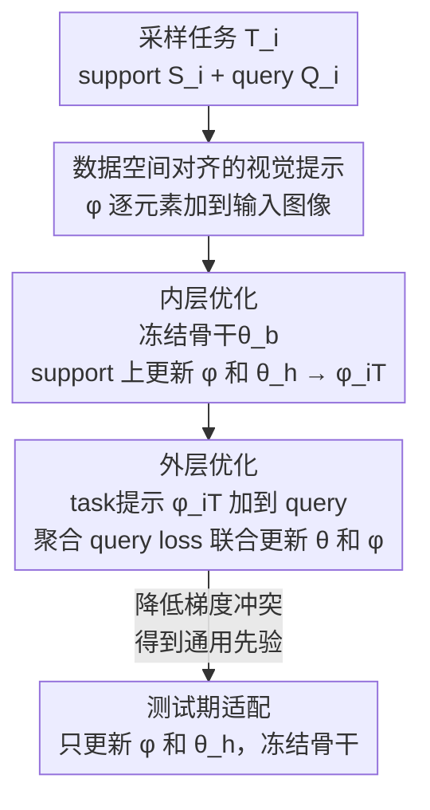

# Data-Centric Meta-Learning for Robust Few-Shot Generalization

**会议**: CVPR 2026  
**论文**: [CVF Open Access](https://openaccess.thecvf.com/content/CVPR2026/html/Lim_Data-Centric_Meta-Learning_for_Robust_Few-Shot_Generalization_CVPR_2026_paper.html)  
**代码**: 无  
**领域**: 少样本元学习  
**关键词**: 优化型元学习, 少样本跨域泛化, 可视化提示(visual prompt), 梯度冲突, 双层优化  

## 一句话总结
针对优化型元学习在跨域少样本场景下泛化崩塌的问题，本文把"可学习视觉提示"从测试期辅助件升格为贯穿整个元训练过程的核心机制——通过在数据空间对各任务输入做对齐，压低任务间梯度方向冲突，从而学到更通用的先验知识，并在测试期只更新提示和分类头即可高效适配。

## 研究背景与动机
**领域现状**：优化型元学习（以 MAML 为代表）用双层优化框架获取跨任务的"先验知识"：内层针对每个任务做少步梯度适配，外层把各任务的学习信号聚合起来更新共享初始参数 $\theta$。后续工作（GAP 学几何自适应预条件子、Meta-AdaM 学自适应学习率）大多在**参数空间**里改进适配规则。

**现有痛点**：当测试任务分布显著偏离训练分布（跨域少样本）时，这套方法的效果明显退化。作者把退化归因为"学不到可泛化的先验知识"，而根因是**梯度冲突（gradient discrepancies）**——元训练里任务分布多样，各任务在内层算出的 task-specific 梯度方向差异巨大。

**核心矛盾**：外层把这些方向相互冲突的 task 梯度平均成 meta-gradient，冲突信号互相抵消，导致外层优化失效。作者用实证支撑这点：在 5-way 5-shot miniImageNet 上，MAML 的 meta-gradient 与各 task 梯度间余弦相似度低、$\ell_2$ 距离大；更关键的是——尽管 MAML 的 meta-gradient 范数不小，但参数从初始点的"位移量（parameter shift）"却很有限，说明更新确实在互相抵消。

**切入角度**：既然根因是不同任务的**输入分布**对不齐共享先验，那与其在参数空间里给每个任务做复杂调制（如 MMAML 用 task embedding 调制、L2F 按梯度衰减无关先验），不如换一个**数据中心（data-centric）视角**：直接改造每个任务的输入数据空间，让它去贴合共享先验。

**核心 idea**：引入一个**可元学习的视觉提示 $\phi$**，把它逐元素加到任务输入上，并让它**贯穿元训练的内层与外层全过程**——用提示把各任务输入"拉"到同一个先验知识能解释的分布上，从而诱导出方向一致的梯度。这与以往把视觉提示只当作测试期适配工具的做法是本质区别。

## 方法详解

### 整体框架
DCML（Data-Centric Meta-Learning）在标准 MAML 双层优化骨架上做了两点改动：① 把骨干网络 $\theta^{\text{b}}$ 全程冻结；② 引入一个共享的可学习视觉提示 $\phi$，逐元素加到输入图像上。整套流程是：采一批任务 → 内层针对每个任务把 $\phi$ 加到 support 图像、只更新提示 $\phi$ 和分类头 $\theta^{\text{h}}$ 得到 task-specific 提示 $\phi_{i,T}$ → 外层把 $\phi_{i,T}$ 加到 query 图像、用聚合后的 query loss **联合更新先验知识 $\theta$ 和提示 $\phi$**。关键在于：内层产出的 task-specific 提示在外层被复用到 query 上，使各任务输入分布对齐到共享先验，从而压低 meta-gradient 里的方向冲突。测试期则只更新轻量的 $\phi$ 和 $\theta^{\text{h}}$、冻结骨干，实现参数高效适配。

模型记为 $f_\theta(\cdot) = f_{\theta^{\text{h}}}(f_{\theta^{\text{b}}}(\cdot))$，其中 $\theta = \{\theta^{\text{b}}, \theta^{\text{h}}\}$ 分别是骨干与分类头参数。

### 关键设计

**1. 数据中心视角：把可学习视觉提示注入整个元学习过程，对齐输入分布而非调制参数**

这是本文最根本的重定义。以往视觉提示（Visual Prompt）的玩法是：在像素空间加一块可学习的 padding/patch，让**冻结的模型**去完成下游任务，且通常只在**测试期**使用。本文反其道而行：把提示 $\phi$ 当成**获取可泛化先验知识的核心机制**，让它在元训练里就主动参与。直觉上，梯度冲突的根因是各任务输入分布彼此不一致、也不贴合共享先验；与其在参数空间为每个任务做复杂调制，不如在**数据空间**给每个任务的输入"打个补丁"，把它平移到一个共享先验能统一解释的区域，方向一致的梯度自然就出来了。提示模板（padding / fixed patch / random patch）与尺寸 $p$ 都不限定，参数量按 patch 模板 $Cp^2$、padding 模板 $2Cp(H+W-2p)$ 计算，默认用 $p=5$ 的 padding。

**2. 内层优化：冻结骨干，用 support set 把提示和分类头适配到当前任务**

内层不再像 MAML 那样适配整套 $\theta$，而是**冻结骨干 $\theta^{\text{b}}$**，把提示 $\phi$ 逐元素加到 support 图像上，只更新提示与分类头。第 $t$ 步的 support 损失是 prompt 对齐后输入上的交叉熵：

$$\mathcal{L}^{\text{support}}_{\mathcal{T}_i} := -\log p\left(y_i^s \mid f_{\theta^{\text{h}}_{i,t}}\left(f_{\theta^{\text{b}}}(\mathbf{x}_i^s + \phi_{i,t})\right)\right)$$

提示与分类头按下式联合内层更新（初值 $\theta_{i,0}=\theta$、$\phi_{i,0}=\phi$）：

$$(\phi_{i,t+1}, \theta^{\text{h}}_{i,t+1}) = (\phi_{i,t}, \theta^{\text{h}}_{i,t}) - \alpha_t \nabla_{(\phi_{i,t}, \theta^{\text{h}}_{i,t})} \mathcal{L}^{\text{support}}_{\mathcal{T}_{i,t}}$$

经过 $T$ 步得到 task-specific 提示 $\phi_{i,T}$ 与 $\theta^{\text{h}}_{i,T}$，骨干 $\theta^{\text{b}}$ 始终不动。这里冻结骨干是关键意图：迫使"输入对齐"这件事由提示去承担，而不是让骨干迁就单个任务。内层学习率 $\alpha_t$ 采用 per-step 可学习形式（沿用 [1,3,33] 的做法）以稳定训练。

**3. 外层优化：把 task 提示复用到 query，联合更新先验知识与提示以压低梯度冲突**

外层是数据空间对齐真正发挥作用的地方。DCML 把内层得到的 task-specific 提示 $\phi_{i,T}$ **加到该任务的 query set** 上——因为 $\phi_{i,T}$ 已经在 support 上学会了如何让该任务输入贴合共享先验，复用到 query 上就能把各任务输入拉到同一片表征区域，使各任务的 query 梯度方向更一致。query 损失为：

$$\mathcal{L}^{\text{query}}_{\mathcal{T}_i} := -\log p\left(y_i^q \mid f_{\theta^{\text{h}}_{i,T}}\left(f_{\theta^{\text{b}}}(\mathbf{x}_i^q + \phi_{i,T})\right)\right)$$

随后用聚合后的 query loss **同时**对先验知识 $\theta$ 和提示 $\phi$ 做 meta-gradient 更新：

$$(\theta, \phi) \leftarrow (\theta, \phi) - \beta \nabla_{(\theta, \phi)} \mathbb{E}_{\mathcal{T}_i \sim p(\mathcal{T})}\left[\mathcal{L}^{\text{query}}_{\mathcal{T}_i}\right]$$

这个联合优化一举两得：既让 $\theta$ 学到更通用的先验，又让 $\phi$ 学会"如何把多样的任务输入分布对齐到共享知识"。正因为提示同时参与内层和外层，它才成为主动引导整个元训练的核心组件，而非测试期的事后补丁。

### 损失函数 / 训练策略
- 内/外层均为交叉熵损失（式 3、5），无额外正则项；外层对 $(\theta,\phi)$ 联合做 meta-gradient 下降（式 6）。
- 内层步数 $T=5$，内层学习率 $\alpha=0.01$（per-step 可学习），外层学习率 $\beta=0.0001$。
- 骨干用 4-CONV 或 ResNet-12，单卡 RTX 4090 训练。完整双层流程见原文 Algorithm 1。

## 实验关键数据

### 主实验
五个标准 few-shot 分类基准（miniImageNet / tieredImageNet / CIFAR-FS / FC100 / CUB），4-CONV 骨干，5-way 设定。

**域内分类（accuracy %）**：

| 数据集 / 设定 | MAML | GAP（之前最强） | DCML（本文） |
|--------------|------|----------------|--------------|
| miniImageNet 1-shot | 48.70 | 54.86 | **55.52** |
| miniImageNet 5-shot | 63.11 | 71.55 | **73.31** |
| tieredImageNet 5-shot | 67.48 | 74.90 | **75.96** |
| CIFAR-FS 5-shot | 70.10 | 78.53 | **80.32** |
| FC100 5-shot | 47.58 | 55.53 | **56.36** |

**跨域分类（miniImageNet 训练 → 迁移，5-way 5-shot，accuracy %）**：

| 方法 | →CUB | →CIFAR-FS |
|------|------|-----------|
| MAML | 52.70 | 55.82 |
| GAP（之前最强） | 64.88 | 65.27 |
| **DCML（本文）** | **66.14** | **67.33** |

DCML 在所有数据集上一致领先，且**跨域**场景下优势更明显（→CUB 比 GAP 高 1.26、→CIFAR-FS 高 2.06），印证了"数据空间对齐增强泛化"的核心主张。

### 消融实验

**提示使用阶段的消融**（miniImageNet，accuracy %）：

| 提示使用配置 | 1-shot | 5-shot | 说明 |
|-------------|--------|--------|------|
| 仅测试期使用 | 46.40 | 65.10 | 等价于以往 prompt 用法，最差 |
| 仅训练期使用 | 50.44 | 72.97 | 提示参与训练即大幅提升 |
| 训练+测试全程（DCML） | **55.52** | **73.31** | 全程整合最优 |

**测试期可学习组件与参数量对比（4-CONV）**：

| 方法 | 骨干 θ_b | 分类头 θ_h | 视觉提示 φ | 适配参数量 |
|------|---------|-----------|-----------|-----------|
| MAML | ✓ | ✓ | – | $4.62\times10^5$ |
| ANIL | – | ✓ | – | $0.16\times10^5$ |
| BOIL | ✓ | – | – | $4.46\times10^5$ |
| **DCML** | – | ✓ | ✓ | $0.21\times10^5$ |

DCML 测试期只更新分类头+提示，参数量仅约 ANIL 量级（$0.21\times10^5$，约为 MAML 的 1/22），却在域内和跨域都全面胜出。

### 关键发现
- **提示的价值主要来自"参与训练"而非"测试期适配"**：仅测试期用提示（46.40 / 65.10）反而比 MAML 还差，而仅训练期用就能涨到 50.44 / 72.97——这直接支撑了把提示重定义为"训练期获取先验"的核心论点。
- **数据空间确实被对齐了**：用 MMD 度量任务间特征分布距离，MAML 随训练 MMD 越来越大（任务越来越散），DCML 则持续把 MMD 压低，且 MMD 方差保持非零——说明对齐没有把任务"压成无差别"，保留了任务间必要的区分度。
- **优化动力学被改善**：相比 MAML，DCML 的 meta-gradient 与 task 梯度余弦相似度更高、$\ell_2$ 距离更低；虽然 meta-gradient 范数更小，但参数位移更大——"步子小但方向稳"，更新能有效累积，而非互相抵消。
- **快速适配**：内层步数从 5 减到 1，5-shot 仍有 68.40、1-shot 54.31，说明少步即可适配；提示模板/尺寸的变化对精度影响很小（鲁棒）。
- **Grad-CAM 定性**：跨域 miniImageNet→CUB 下，MAML 常关注背景或残缺物体，DCML 始终聚焦类相关区域。

## 亮点与洞察
- **把"梯度冲突"作为可观测、可干预的抓手**：作者没停留在"跨域难"的定性描述，而是用余弦相似度/$\ell_2$距离/参数位移把退化机制量化出来，再针对性地用数据对齐去消解——诊断与方法形成闭环，说服力强。
- **视觉提示的角色重定义**：从"测试期 frozen-model 辅助件"变成"元训练期获取通用先验的核心机制"，这个视角迁移很轻量却很反常识，是本文最"啊哈"的地方。
- **数据中心 vs 参数中心的路线对比**：同样是治"任务多样导致先验学不好"，MMAML/L2F 在参数空间做复杂调制，DCML 只加一块像素级补丁就拿到更好的跨域结果且参数更省——提示"改输入比改模型更省更稳"这条思路可迁移到其他需要跨分布对齐的元学习/持续学习任务。
- **极致参数效率**：测试期只动 $0.21\times10^5$ 参数（提示+分类头、骨干冻结），适合数据/算力受限的真实少样本场景。

## 局限与展望
- **作者承认**：当前提示在所有任务间是**共享设计**（同一个 $\phi$ 初值），未来计划探索以 task embedding 为条件的 task-adaptive 提示，进一步缓解多样任务间的梯度冲突。
- **自己发现**：① 主表多基于 4-CONV，ResNet-12 结果放在补充材料，正文未直接呈现更大骨干下的优势幅度；② 跨域实验只覆盖 miniImageNet→CUB / →CIFAR-FS 两条迁移路径，缺少更剧烈的域偏移（如自然图→医学/遥感）验证；③ "对齐输入分布到共享先验"在语义上为何不会损失跨类判别力，主要靠 MMD 方差非零这一间接证据，缺乏更直接的理论刻画。
- **改进思路**：把共享提示换成"基于 support 特征生成的条件提示"，或在外层显式加入鼓励 task 梯度方向一致的正则项，可能比单纯靠数据对齐更直接地压低梯度冲突。

## 相关工作与启发
- **vs MAML / ANIL / BOIL**：三者都在参数空间分配适配权（MAML 全更新、ANIL 只更新分类头、BOIL 只更新骨干）。DCML 借鉴 ANIL 的"冻骨干、更新分类头"思路，但额外引入数据空间提示，把"对齐"从参数侧搬到输入侧，跨域更稳。
- **vs GAP / Meta-AdaM**：它们改进的是内层**更新规则**（几何自适应预条件子 / 自适应学习率），仍是参数中心；DCML 不碰更新规则，靠改输入降低冲突，且测试期参数量小一个量级。
- **vs MMAML / L2F**：同样针对"任务分布多样"，但 MMAML 用 task embedding 调制先验、L2F 按梯度衰减无关先验，都在参数空间引入额外网络；DCML 用一块轻量像素补丁替代复杂调制，主张数据中心路线更简洁有效。
- **vs 传统 Visual Prompt（VP）**：VP 把可学习 patch 加进像素空间让冻结模型做下游任务，且多限于测试期；DCML 把提示拉进元训练内外层，使其参与"先验知识的获取"，这是角色上的根本差异。

## 评分
- 新颖性: ⭐⭐⭐⭐ 把视觉提示从测试期辅助件重定义为元训练核心机制，数据中心视角切入梯度冲突，角度新颖。
- 实验充分度: ⭐⭐⭐⭐ 五基准+域内/跨域+多维分析（MMD/梯度动力学/Grad-CAM/参数量），但正文主依赖 4-CONV、跨域路径偏少。
- 写作质量: ⭐⭐⭐⭐ 诊断—方法—验证闭环清晰，公式与图表配合到位。
- 价值: ⭐⭐⭐⭐ 参数高效、思路可迁移，为优化型元学习提供了一条轻量的数据中心改进路线。

<!-- RELATED:START -->

## 相关论文

- [\[CVPR 2026\] DDSF: Robust Few-Shot Learning via Disentangled Subspaces with Determinantal Point Process](ddsf_robust_few-shot_learning_via_disentangled_subspaces_with_determinantal_poin.md)
- [\[ICML 2025\] Provably Improving Generalization of Few-Shot Models with Synthetic Data](../../ICML2025/others/provably_improving_generalization_of_few-shot_models_with_synthetic_data.md)
- [\[CVPR 2026\] Hyperbolic Defect Feature Synthesis for Few-Shot Defect Classification](hyperbolic_defect_feature_synthesis_for_few-shot_defect_classification.md)
- [\[CVPR 2026\] Language Does Matter for Cross-Domain Few-Shot Visual Feature Enhancement](language_does_matter_for_cross-domain_few-shot_visual_feature_enhancement.md)
- [\[ICCV 2025\] Is Meta-Learning Out? Rethinking Unsupervised Few-Shot Classification with Limited Entropy](../../ICCV2025/others/is_meta-learning_out_rethinking_unsupervised_few-shot_classification_with_limite.md)

<!-- RELATED:END -->
