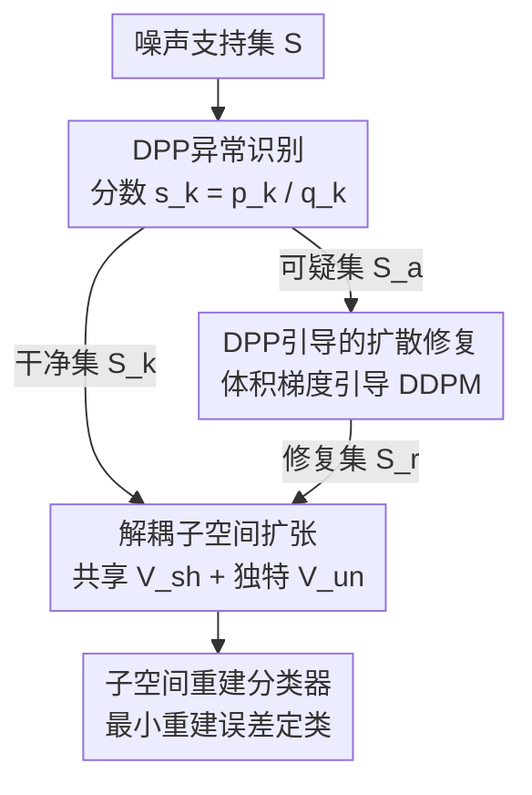

# DDSF: Robust Few-Shot Learning via Disentangled Subspaces with Determinantal Point Process

**会议**: CVPR 2026  
**论文**: [CVF Open Access](https://openaccess.thecvf.com/content/CVPR2026/html/Ye_DDSF_Robust_Few-Shot_Learning_via_Disentangled_Subspaces_with_Determinantal_Point_CVPR_2026_paper.html)  
**代码**: https://github.com/24sleeping90/DDSF  
**领域**: 小样本学习  
**关键词**: 鲁棒小样本学习, 行列式点过程(DPP), 子空间解耦, 扩散修复, 原型网络  

## 一句话总结
针对小样本支持集被噪声/难正样本污染导致原型漂移的问题，DDSF 用行列式点过程(DPP)统一驱动一套「过滤—修复—扩张」流程：先用 DPP 概率推断挑出可疑样本而非丢弃，再用 DPP 体积梯度引导扩散过程把它们"修"成有效特征，最后把类表示从脆弱的均值点扩展成解耦的共享/独特子空间，在 OOD 污染的 Meta-Dataset 上把 70% 噪声下的精度从 SOTA 的 47.0% 提到 61.6%。

## 研究背景与动机
**领域现状**：小样本学习(FSL)的主流是基于原型的度量学习，以 Prototypical Networks 为代表——把每个类的支持样本特征求均值得到一个"原型点"，查询样本按到各原型点的距离分类。它简单有效，是长期的 benchmark。

**现有痛点**：原型法有个隐含假设——支持集是干净、有代表性的。但真实场景里采集数据难免带标签噪声或 OOD 样本，而支持集本来就只有几张图，几个坏样本就能把均值点拽偏，造成"原型漂移"。为对抗噪声，当前主流走的是"Filter-Compress(过滤—压缩)"路线：显式过滤(如 DETA++ 用离群检测直接丢掉可疑样本)或隐式过滤(如 TraNFS 用注意力给可疑样本降权)，先净化再压成一个原型点。

**核心矛盾**：作者指出这条路线有两个交织的结构性缺陷。其一是**表示混淆(Representation Confusion)**——原型网络把高方差、非判别性的"共享特征"(如各类共有的背景纹理)和低方差、判别性的"独特特征"(区分类别的关键)混在一起压成一个均值点，二者纠缠不清。其二是**信息破坏(Information Destruction)**——"过滤即丢弃"这件事本身的副作用：在数据稀缺时，真噪声和"难正样本(hard positive)"几乎无法区分，过滤模块为了纯净会把难正样本连同噪声一起扔掉，既丢了关键判别信息，又让剩下的原型被高方差共享特征主导，反而加剧了表示混淆。

**本文目标**：构建对污染支持集鲁棒的类表示，同时解决"丢弃式过滤损失信息"和"均值点表示混淆"这两个问题。

**切入角度**：作者发现 DPP(行列式点过程)这一同时刻画"质量"和"多样性"的概率模型，恰好能贯穿三件事——用边缘概率定位异常、用体积最大化引导修复、用体积扩张构造多样子空间。于是把"过滤"重新定义为"定位待修复样本"而非"丢弃"。

**核心 idea**：提出"Filter-Repair-Expand(过滤—修复—扩张)"范式，由 DPP 理论统一驱动：**定位**异常而不丢、把异常**修复**成有效特征、再把类表示从一个点**扩张**成解耦的共享+独特子空间。

## 方法详解

### 整体框架
DDSF 把一个噪声支持集 $S=\{x_i\}_{i=1}^{K}$ 顺序送过三个协同模块，最终输出每个类的鲁棒子空间用于分类。整条流水线都以 DPP 为理论基座：DPP 给定核矩阵 $L$(特征的 Gram 矩阵 $L=FF^{T}$)后，子集 $Y$ 被采样的概率 $P(Y)=\det(L_Y)/\det(L+I)$，其中分子 $\det(L_Y)$ 在几何上等于 $Y$ 中特征向量张成的平行多面体体积的平方——"体积大"即"既高质量又多样"。

三个阶段是：**① DPP 异常识别**先用 DPP 的两路边缘信息算出每个样本的异常分 $s_k$，把支持集切成"可疑集 $S_a$"和"已知干净集 $S_k$"；**② DPP 引导修复**对 $S_a$ 跑一个被 DPP 体积梯度引导的扩散逆过程，把污染特征"拉"成能贡献多样性的有效特征 $S_r$，与 $S_k$ 合并成净化集 $S_f=S_k\cup S_r$；**③ 解耦子空间扩张**把 $S_f$ 喂给两个协同损失，学出共享子空间 $V_{sh}$ 和各类独特子空间 $V_{un}^{(c)}$；最后用基于子空间重建误差的分类器出预测。

### 关键设计

**1. DPP 概率异常识别：用"多样性÷质量"区分真噪声与难正样本**

针对"丢弃式过滤会误伤难正样本"的痛点，这一步不再做二分类的离群剔除，而是给每个样本算一个连续的异常分，只挑出"待修复候选"。它从 DPP 核 $L$ 里抽出两路互补信息：**多样性**用 DPP 边缘概率 $p_k=[L(L+I)^{-1}]_{kk}$ 度量(异常样本通常与干净流形正交、独特性高)；**质量/凝聚度**用 $q_k=\sum_{j\neq k}(L_{kj})^2$ 度量(与同类其它样本的聚合相似度，异常样本凝聚度低)。关键在于二者的融合方式 $s_k=p_k/q_k$：真噪声是"高多样性 + 低质量"→ $s_k$ 大；而难正样本虽然 $p_k$ 也高，但它和同类有真实关联、$q_k$ 也高，相除后 $s_k$ 被压下来，从而和真噪声拉开。再用一个全局阈值 $\tau$ 做数据驱动的划分，把 $s_k$ 偏异常的样本归入 $S_a$，其余归入 $S_k$。消融里单用 $p_k$ 或单用 $q_k$ 各只 +2.3%/+2.4%，融合后的 $s_k$ 达 +3.6%，印证了"质量×多样性两路融合"比任一单指标都更稳。

**2. DPP 引导的扩散修复：把噪声特征"修"成有效特征而非删掉**

这是范式里"Repair"的核心，专治信息破坏。它用一个**无参数**的 DDPM 逆过程(不引入额外大网络，轻量灵活)，但在每一步去噪时注入一个 DPP 体积引导。引导损失定义为待修复特征 $f_{t-1}$ 与干净集 $S_k$ 合起来的负对数体积 $L_g(f_{t-1})=-\log\det(K_{\{f_{t-1}\}\cup S_k})$。它通过修正逆过程的均值实现：

$$\mu'(f_t,t)=\mu(f_t,t)-\gamma\Sigma_t\nabla_f L_g$$

其中 $\mu$ 是标准 DDPM 逆过程均值，$\nabla L_g$ 是体积损失的梯度——指向"让这个特征与 $S_k$ 集体多样性最大"的方向，$\gamma$ 是引导强度。直观说，扩散过程一边去污染，一边把这个特征往"能给类表示补充新的、互补的判别方向"上推，于是原本要被丢掉的异常样本被转化成对鲁棒类表示有贡献的有效特征。消融显示激活修复带来本阶段最大的 +2.7% 提升。

**3. 协同解耦子空间扩张：用两个对立目标把均值点扩成共享+独特子空间**

针对"均值点表示混淆"，这一步把类表示从一个点升级成子空间。它基于解耦假设 $f=f_{sh}+f_{un}+\epsilon$，用两个可学习线性投影 $P_{sh}$、$P_{un}^{(c)}$(图中的 MLP)把特征拆成共享分量 $f_{sh}=P_{sh}f$ 和独特分量 $f_{un}=P_{un}^{(c)}f$，再用两个**作用相反**的目标协同驱动。**共享重建损失** $L_{sh}=\frac{1}{|S_f|}\sum_{f\in S_f}\|f-P_{sh}f\|_2^2$ 逼共享子空间 $V_{sh}$ 去重建所有类的共性(如"狗"这一泛概念)，把高方差的共有背景吸收进 $V_{sh}$。**独特体积损失** $L_{un}$ 先取残差 $f_{res}^{(c)}=f^{(c)}-P_{sh}f^{(c)}$(共享子空间解释不了的部分)，再对残差的 Gram 矩阵做体积最大化：

$$L_{un}=-\sum_{c=1}^{N}\log\det(G_{res}^{(c)}+\epsilon I)$$

最小化 $L_{un}$ 等价于最大化残差张成的体积，迫使每个独特子空间 $V_{un}^{(c)}$ 尽量"撑开"去容纳剩余的类特异判别信息(如哈士奇独有的面部花纹)。一个负责"收"共性、一个负责"撑"独特性，二者协同把纠缠的特征分而治之。消融里把这块从标准正交损失换成 DPP 的 $L_{un}$ 单独再带来 +1.9%(噪声)/+2.0%(干净)。

**4. 子空间重建分类器：在推理时复刻训练范式**

既然类被表示成子空间而非点，分类自然也不用点到点的距离。对一个查询特征 $f_q$，预测其属于"用自己组合基底重建误差最小"的那个类：

$$\hat{y}=\arg\min_{c\in\{1,\dots,N\}}\|f_q-(P_{sh}+P_{un}^{(c)})f_q\|_2^2$$

即把共享投影 $P_{sh}$ 和类独特投影 $P_{un}^{(c)}$ 拼成该类的总重建子空间，看哪个类能用最小误差解释 $f_q$。这把训练时的解耦假设直接搬到推理，评估的是"查询与各类子空间的兼容性"而非邻近度。训练时总损失为 $L_{total}=L_{cls}+\lambda_{sh}L_{sh}+\lambda_{un}L_{un}$，其中 $L_{cls}$ 是在"负重建误差作为 logits"上的交叉熵。

## 实验关键数据

### 主实验
在 OOD 污染的 Meta-Dataset(varied-way 10-shot、SwinT 骨干)上与各类 SOTA 对比，所有噪声档位全面领先；尤其与同骨干的 DETA++ 直比优势随噪声加大而扩大：

| 噪声比例 | 本文 DDSF (SwinT) | DETA++ (SwinT) | 领先 |
|----------|-------------------|----------------|------|
| 0% | **91.9** (±0.43) | 86.5 | +5.4 |
| 10% | **89.9** (±0.50) | 80.9 | +9.0 |
| 30% | **85.3** (±0.65) | 77.3 | +8.0 |
| 50% | **75.9** (±0.88) | 64.2 | +11.7 |
| 70% | **61.6** (±1.09) | 47.0 | +14.6 |

从 0%→50%，DETA++ 掉 22.3 个点，DDSF 只掉 16.0 个点，鲁棒性更强。骨干通用性上，DDSF 在五种骨干(ResNet-50 / SwinT / ViT-S / ConvNeXt-B / CLIP)上都稳：0% 噪声 89.1%~93.1%，30% 噪声仍 ≥82.2%，其中 CLIP(ViT-B/32) 峰值最高(93.1% / 86.1%)。

### 消融实验
组件递增式消融(30% 噪声为主，标准正交损失为 baseline，最后一行换成 DPP 的 $L_{un}$)：

| Idx | 配置 | 0% | 30% | 说明 |
|-----|------|----|----|------|
| A | 无过滤(baseline) | 84.4 | 77.1 | 起点 |
| B | 仅多样性 $p_k$ | 86.3 | 79.4 | +2.3 |
| C | 仅质量 $q_k$ | 86.2 | 79.5 | +2.4 |
| D | 融合分 $s_k=p_k/q_k$ | 87.3 | 80.7 | 融合 +3.6 |
| E | D + DPP 修复 | 89.9 | 83.4 | 修复 +2.7(本阶段最大) |
| F | E + 独特体积损失 $L_{un}$(完整) | **91.9** | **85.3** | Expand +1.9 |

### 关键发现
- **修复 > 丢弃**：从 D→E(加 DPP 修复)在噪声档带来本阶段最大的 +2.7%，直接验证"把异常修成有效特征"优于"剔除"。
- **DPP 体积扩张 > 标准正交约束**：E→F 仅把正交损失换成 $L_{un}$ 就 +1.9%(噪声)/+2.0%(干净)，说明最大化残差体积比正交约束更能撑开独特子空间。
- **对更难的噪声也稳**：在语义混淆型的 SLS(对称标签交换)噪声下，30% 时仍达 83.2%(DETA++ 75.1%)，说明 DPP 概率识别抓的是语义不一致而非单纯几何距离。
- **超参不敏感**：$\lambda_{sh}$、$\lambda_{un}$ 的网格里存在大片 >90% 的高性能区(只要 $\lambda_{un}\geq0.1$)，最差格点也有 88.11%，几乎不依赖精细调参。

## 亮点与洞察
- **一个理论统一三件事**：把 DPP 的"质量×多样性"同时用作异常定位(边缘概率)、修复引导(体积梯度)、子空间扩张(体积最大化)，三处机制由同一数学对象贯穿，概念非常干净，是本文最"啊哈"的地方。
- **重新定义"过滤"**：把 noise filtering 从"删除"改成"定位+修复"，绕开了数据稀缺下"真噪声 vs 难正样本不可分"的死结，这个视角可迁移到任何"样本稀少又怕误删"的鲁棒学习场景。
- **$s_k=p_k/q_k$ 的相除技巧**：用一个简单比值就把"高多样性的真噪声"和"高多样性但高凝聚的难正样本"分开，廉价且有效，值得复用。
- **无参数扩散修复**：不训练额外大网络，只在标准 DDPM 逆过程里注入一个梯度引导，轻量、即插即用。

## 局限与展望
- **DPP 的复杂度**：核矩阵的行列式/求逆随集合规模增长开销不小，论文主打 10-shot 小支持集所以可控，但放大到更大支持集或更高维特征时的效率未充分讨论(⚠️ 效率分析放在补充材料，正文未给具体数字)。
- **解耦假设较强**：$f=f_{sh}+f_{un}+\epsilon$ 的线性可加假设和线性投影 $P_{sh}/P_{un}$ 对复杂非线性纠缠是否成立，缺乏更强骨干/更复杂数据上的压力测试。
- **阈值 $\tau$ 的脆弱区间**：作者自承 $\tau$ 过高(≥0.5)会过于保守漏检噪声、过低(=0.1)会过度检测，虽然整体不敏感，但极端档位仍需留意。
- **修复可能引入幻觉**：扩散把异常"修"成有效特征，若引导方向把 OOD 样本拉进了某个类的子空间，可能制造看似合理实则错误的判别信息，文中未做这类失败案例分析。

## 相关工作与启发
- **vs DETA++ (Filter-Compress, 显式过滤)**：DETA++ 用对比相关性聚合算权重、直接丢噪声样本压成点原型；DDSF 不丢而是定位+修复，并把点原型升级成子空间。同 SwinT 骨干下 DDSF 在各噪声档全面领先 5~15 个点，且噪声越大差距越大。
- **vs TraNFS (隐式过滤)**：TraNFS 用注意力给可疑样本软降权，本质仍是"减少坏样本影响"；DDSF 主动把坏样本转化为有用特征，从源头避免信息破坏。
- **vs 子空间/分布式原型(如建模为高斯分布、低秩子空间、DeepEMD)**：这些工作也想超越均值点、用更丰富的类表示，但 DDSF 进一步把表示**解耦**成共享+独特两块，并用 DPP 体积显式控制独特子空间的多样性。
- **vs MetaDiff 等生成式 FSL**：以往扩散/生成主要用来"增加数据量"做样本/特征合成；DDSF 反其道——用扩散去**修复已有噪声样本**，目的不是变多而是变干净有效。

## 评分
- 新颖性: ⭐⭐⭐⭐⭐ 用 DPP 一个理论统一"过滤—修复—扩张"三阶段，并把噪声过滤从丢弃改为修复，视角新颖。
- 实验充分度: ⭐⭐⭐⭐ 多噪声档/多骨干/两类噪声/递增消融都覆盖，但效率与跨域分析推到了补充材料。
- 写作质量: ⭐⭐⭐⭐ 范式命名清晰、公式完整、动机层层递进；部分符号(如 $w_{en}$、阈值描述)略显仓促。
- 价值: ⭐⭐⭐⭐ 在鲁棒 FSL 上显著刷新 SOTA，"定位+修复"思路对样本稀缺的鲁棒学习有普适启发。

<!-- RELATED:START -->

## 相关论文

- [\[CVPR 2026\] Data-Centric Meta-Learning for Robust Few-Shot Generalization](data-centric_meta-learning_for_robust_few-shot_generalization.md)
- [\[CVPR 2026\] Hyperbolic Defect Feature Synthesis for Few-Shot Defect Classification](hyperbolic_defect_feature_synthesis_for_few-shot_defect_classification.md)
- [\[CVPR 2026\] Language Does Matter for Cross-Domain Few-Shot Visual Feature Enhancement](language_does_matter_for_cross-domain_few-shot_visual_feature_enhancement.md)
- [\[ICLR 2026\] Neural Force Field: Few-shot Learning of Generalized Physical Reasoning](../../ICLR2026/others/neural_force_field_few-shot_learning_of_generalized_physical_reasoning.md)
- [\[CVPR 2026\] Affine Perspective-Three-Point Problem](affine_perspective-three-point_problem.md)

<!-- RELATED:END -->
