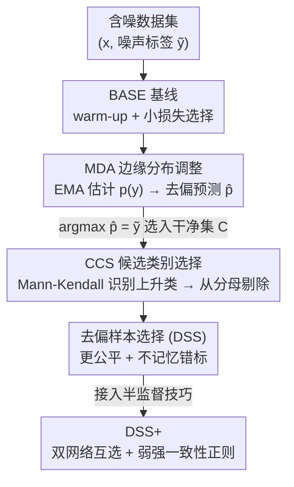

# Debiased Sample Selection for Learning with Noisy Labels

**会议**: CVPR 2026  
**论文**: [CVF Open Access](https://openaccess.thecvf.com/content/CVPR2026/html/Pan_Debiased_Sample_Selection_for_Learning_with_Noisy_Labels_CVPR_2026_paper.html)  
**代码**: https://github.com/Aliinton/DSS  
**领域**: 噪声标签学习  
**关键词**: 噪声标签学习, 样本选择, small-loss trick, 确认偏差, 即插即用模块

## 一句话总结
本文指出主流噪声标签学习里"小损失即干净"(small-loss trick)的样本选择策略暗藏两类确认偏差——类级偏差（易学类被过度选中、难学类被忽略）和实例级偏差（伪低损失的错标样本被当作干净样本记忆），并提出两个即插即用模块 MDA（边缘分布调整）与 CCS（候选类别选择）分别消除这两类偏差，组合成 DSS，在 CIFAR-10/100 合成噪声及 CIFAR-N、Clothing1M、WebVision 真实噪声上稳定提升各类选择器与 SOTA 流水线。

## 研究背景与动机
**领域现状**：噪声标签学习（LNL）的主流范式是 small-loss trick，它利用 DNN 的"记忆效应"——网络在过拟合噪声之前会先学会干净样本，因此损失低的样本被认为是干净的、留下来训练，损失高的被丢弃或重标注。多数实现用一个双峰高斯混合模型（GMM）去拟合 loss 分布，把低均值那一簇当作干净样本。

**现有痛点**：作者指出 small-loss trick 有两个一直被忽视的确认偏差。其一是**类级确认偏差**：易学的类天然损失更低，于是它们的样本被过度选中，而难学的类被系统性地欠采样、欠拟合。其二是**实例级确认偏差**：有些错标样本因为图像和错标签弱相关，会表现出"虚假的低损失"，被错误地当成干净样本保留，反过来逼着模型去记忆错误标签。这两类偏差都会在训练中**累积放大**，最终拖累泛化。

**核心矛盾**：根子在于"低损失"这个信号本身是有偏的——它既受类的边缘分布 $p(y)$ 影响（导致类级偏差），又会被弱相关错标样本伪造（导致实例级偏差）。直接用它做选择，等于让模型的偏见自我强化。

**本文目标**：在不重写整条选择流水线的前提下，把这两类偏差分别"拆掉"——一个修正类间不公平，一个阻止模型记忆错标。

**切入角度**：作者把贝叶斯后验拆开 $p(y|x)=p(y)p(x|y)/p(x)$，发现类级偏差正是 $p(y)$ 不均匀造成的；又借助"训练动态"——CT 等工作发现真标签的置信度在训练中会持续上升——来识别错标样本背后那个"可能的真标签"。

**核心 idea**：用 MDA 把预测分布动态拉向均匀（消类级偏差），用 CCS 把"可能的真标签"临时从分类任务中剔除、而不是直接重标注（消实例级偏差），两者都是即插即用、可挂到任意现有选择器上的轻量模块。

## 方法详解

### 整体框架
方法建立在一个极简基线 **BASE** 之上：先用标准交叉熵 warm-up 几个 epoch，之后每个 epoch 把"模型预测的最大类 = 标注标签"的样本选为干净集 $C$，只对 $C$ 里的样本算 loss，其余置零忽略。公式上，选择准则为 $C=\{(x_i,\tilde y_i)\mid \arg\max_y p_\theta(x_i)=\tilde y_i\}$。作者发现这个朴素基线就已能匹敌很多高级选择器，因此把它当作干净的"实验台"，在其上挂两个去偏模块。

MDA 改的是"用什么预测去做选择"——把原始预测 $p_\theta$ 换成去偏后的 $\hat p$；CCS 改的是"选中后怎么算 loss"——把交叉熵分母里那些"可能的真标签"剔掉。两者正交：MDA 作用在选择信号上消类级偏差，CCS 作用在监督信号上消实例级偏差。BASE+MDA+CCS 即为 **DSS**。进一步把 DSS 接入语义级半监督技巧（双网络互选 + 弱强一致性正则）后得到 **DSS+**，用于和 SOTA 流水线公平对比。

### 关键设计

**1. MDA 边缘分布调整：把预测拉向均匀，消除类级偏差**

针对"易学类损失低 → 被过度选中"这个类级偏差，MDA 的思路是：类级偏差来自后验 $p(y|x)=\frac{p(y)p(x|y)}{p(x)}$ 里那个不均匀的类边缘 $p(y)$。作者保留类条件似然 $p(x|y)$ 不动，强行把类边缘换成均匀分布 $\tfrac1k$，得到重加权后验 $\hat p(y|x)=\frac{p(x|y)\frac1k}{\sum_c p(x|c)\frac1k}$。把 $p(x|y)=p(y|x)p(x)/p(y)$ 代入并约掉 $p(x)$，最终落到一个非常简洁的形式：

$$\hat p(y|x)=\frac{p(y|x)/p'(y)}{\sum_{c\in Y} p(c|x)/p'(c)},$$

其中 $p'(y)$ 是用 batch 内预测的指数滑动平均动态估计的类边缘：$p'(y)=\lambda\, p'(y)+(1-\lambda)\tfrac{1}{|b|}\sum_{x\in b}p(y|x)$，初始化为均匀分布，$\lambda$ 控制动量（实验取 0.99）。然后用去偏预测 $\hat p$ 替换 $p_\theta$ 去做选择：$C=\{(x_i,\tilde y_i)\mid \arg\max_y \hat p(y|x_i)=\tilde y_i\}$。它和长尾学习里的 logit adjustment 形似，但关键区别在于：logit adjustment 补偿的是**静态**的类频不平衡，而 MDA 是在线动态地压制"易学类被过度选中"、把被忽略的难学类救回来，针对的是训练过程中累积的确认偏差而非数据集先验。

**2. CCS 候选类别选择：临时剔除"可能的真标签"，消除实例级偏差**

针对"弱相关错标样本伪低损失 → 被当干净样本记忆"这个实例级偏差，CCS 不做重标注，而是把那些"看起来是真标签"的类临时从该样本的分类任务中拿掉。它分两步：

第一步**识别可能的真标签**——借助训练动态：如果某个类的置信度在训练中持续上升，它很可能就是真标签（CT 工作发现真标签即便绝对置信度低，其趋势也是稳定上升的）。作者用 **Mann-Kendall 趋势检验**（一种对离群点鲁棒的非参数检测）判断每个类是否处于上升趋势，得到上升类集合 $I_i$（标注标签 $\tilde y_i$ 永远被排除在 $I_i$ 之外）。文中报告该识别的 AUROC/AUPRC 在训练中迅速升到 0.95 以上，说明可靠。

第二步**剔除**——把交叉熵的分母从全部 $k$ 类缩成 $k-|I_i|$ 类：

$$\ell_{ccs}(\tilde y_i,f_\theta(x_i),I_i)=-\log\frac{\exp(f_\theta(x_i)_{\tilde y_i})}{\sum_{c\in Y\setminus I_i}\exp(f_\theta(x_i)_c)}.$$

为什么有效，作者给了梯度分析：设 $(x_i,\tilde y_i)$ 是错标样本、真标签 $y_i\in I_i$，标准交叉熵对真类 logit 的梯度 $\partial\ell_{ce}/\partial f_\theta(x_i)_{y_i}=p_\theta(x_i)_{y_i}>0$ 会**压制**真类；而 CCS 把真类从分母剔除后该梯度为 $0$，真类不再被负梯度压制，置信度得以继续上升、模型最终能恢复正确预测。更妙的是它把"错但弱相关"的标注转成了**有用监督**：图 1 那个被标成 Bird 的飞机图，剔掉 Airplane 后，"Bird > Cat""Bird > Ship"这些约束依然成立且有用。作者特别强调 CCS **不重标注**——上升类也可能仍是错的；剔除是临时的，视觉相似类（如飞机图里的 bird）早期因共享特征置信度上升而被剔除，等模型学到更细特征后其置信度回落、又被放回分类任务，形成一种天然课程：先学易分样本，相似但不同的类等模型准备好了再引入。

**3. DSS+：把去偏模块接入高级 LNL 流水线**

针对"sample-selection-only 和 SOTA 流水线没法直接公平比"的问题，作者把 DSS 接上两项当前 SOTA 常用技巧得到 DSS+：一是**双网络互选**（cross-selection，沿 Co-teaching 路线，同时训两个网络、互相为对方挑干净标签与可能真类，进一步降低单网络自训练偏差）；二是**弱强一致性正则**（weak-strong consistency，沿 ReMixMatch 路线，在弱增强视图上生成伪标签、让强增强视图去预测它，把被丢弃的噪声样本也利用起来）。这一节本质是"控制变量"的工程封装：让 MDA/CCS 的增益能在和 SOTA 同样的半监督脚手架下被单独量出来（消融见表 5）。

### 损失函数 / 训练策略
整体损失沿用"选中样本算 CCS 损失、未选中置零"：$L_x=\tfrac1n\sum_i \mathbb{I}((x_i,\tilde y_i)\in C)\,\ell_{ccs}(\tilde y_i,f_\theta(x_i),I_i)$。训练流程（Algorithm 1）：初始化 $p'_y=\tfrac1k$、$I_i=\varnothing$、$C=D$；warm-up 之后每个 epoch 用 Eq.(9) 更新干净集 $C$、用 Mann-Kendall 更新每个 $I_i$；每个 minibatch 内用 EMA 更新 $p'_y$、算去偏预测 $\hat p$ 并存储、用 CCS 损失更新 $\theta$。CIFAR 用 PreActResNet-18，训练 150 epoch，SGD（momentum 0.9，weight decay 0.001，batch 128），学习率 0.02 在 80 epoch 后降到 0.002；$\lambda=0.99$，Mann-Kendall 显著性水平 $\alpha=0.10$。

## 实验关键数据

### 主实验
样本选择类方法在 CIFAR-10/100 四种噪声下的对比（测试精度 %，越高越好）。DSS 在非对称、实例相关（IDN）、真实噪声上提升显著，IDN 50% 上对 BASE 提升尤为夸张：

| 方法 \ 噪声 | C10 Sym50% | C10 IDN50% | C10 Real40% | C100 Asym40% | C100 IDN50% | C100 Real40% |
|------|------|------|------|------|------|------|
| BASE | 88.7 | 78.9 | 86.4 | 68.2 | 62.7 | 62.0 |
| BASE+MDA | 88.8 | **88.5** | 86.8 | 69.2 | 66.1 | 63.8 |
| DSS (BASE+MDA+CCS) | **89.3** | **90.1** | **87.9** | **70.0** | **67.1** | **64.5** |
| DIST+CT（之前最强） | 88.3 | 81.5 | 87.0 | 69.1 | 62.8 | 62.2 |

与 SOTA 流水线在真实噪声数据集上的对比（DSS+ 全面领先）：

| 方法 | CIFAR-10N-Worst | CIFAR-100N-Noisy | Clothing1M | WebVision top1 | ILSVRC12 top1 |
|------|------|------|------|------|------|
| DivideMix | 92.56 | 71.13 | 74.76 | 77.32 | 75.20 |
| UNICON | 94.52 | 70.30 | 74.98 | 77.60 | 75.29 |
| LSL | 94.57 | 74.46 | - | 81.40 | 77.00 |
| DULC | 92.73 | 72.04 | 75.09 | 79.90 | 76.90 |
| **DSS+ (ours)** | **94.74** | **74.67** | **75.13** | **82.40** | **78.48** |

### 消融实验
DSS+ 各组件消融（测试精度 ACC + 干净样本选择的 Precision/Recall，%）：

| 配置 | C10N P | C10N ACC | C100N P | C100N ACC | 说明 |
|------|------|------|------|------|------|
| DSS+ 完整 | 94.32 | 94.74 | 85.86 | 74.67 | 完整模型 |
| w/o MDA | 94.08 | 94.54 | 85.37 | 72.59 | 100 类上掉点明显（类级偏差更重） |
| w/o CCS | 89.29 | 92.67 | 80.84 | 72.84 | 两数据集精度都掉、选择精度大幅下滑 |
| w/o 双网络互选 | 94.25 | 94.15 | 85.47 | 72.89 | 单网络自训练偏差回升 |
| w/o 弱强一致性正则 | 85.90 | 88.26 | 76.47 | 65.95 | 掉得最多，等于只在有限子集上训练 |

CCS 不是软标签：把 CCS 换成 label smoothing（BASE+MDA+LS）在四种噪声下均逊于 BASE+MDA+CCS（如 C10 IDN50% 89.2 vs 90.1，Real40% 86.6 vs 87.9），说明"动态剔除可能真类"带来的收益超出单纯软化目标分布。

### 关键发现
- **CCS 对选择精度提升最直接**：去掉 CCS 后干净样本选择 Precision 从 94.32%→89.29%（C10N）、85.86%→80.84%（C100N），印证它的核心作用是阻止模型记忆被错选进来的错标样本。
- **MDA 在类多时才吃香**：CIFAR-10N（10 类）去掉 MDA 几乎不掉，而 CIFAR-100N（100 类）去掉 MDA 明显掉点——类级偏差在类多时才严重。MDA 在 CIFAR-10 IDN50% 上单独带来约 10% 的暴涨，源于该设置下选择高度倾斜、MDA 把被忽略的少数类救了回来。
- **弱强一致性正则是 DSS+ 的"地基"**：去掉它掉点最猛（C10N 94.74→88.26），因为没有它就只在被选中的有限子集上训练，极易过拟合。
- **正交、可插**：MDA/CCS 挂到 GMM、DIST、DIST+CT 等不同选择器上都能稳定增益（附录 8.4），证明是通用工具而非绑定某一流水线。

## 亮点与洞察
- **把"小损失偏差"拆成两个可独立修的子问题**：类级（边缘分布造成）和实例级（弱相关错标造成），再各配一个轻量模块——这种"先归因再对症"的拆解很干净，也让两模块天然正交、可叠加。
- **CCS 用"剔除"代替"重标注"的取舍很巧**：上升趋势类可能仍错，重标注会引入新噪声；临时从分母剔除既不冒重标注的险，又自然把"错但弱相关"标签转成了"Bird>Cat、Bird>Ship"这类仍然成立的有用约束，还顺带形成相似类的课程式引入。
- **梯度分析点睛**：一句"标准 CE 对真类梯度 $p_\theta(x)_{y}>0$ 在压制真类，CCS 让它变 0"就把 CCS 为什么能避免记忆错标讲透了，比纯实验更有说服力。
- **可迁移性强**：MDA 的"EMA 估计边缘 + 后验除以边缘"这套去偏，以及 CCS 的"Mann-Kendall 趋势识别 + 从 softmax 分母剔除候选类"，都可迁移到长尾、半监督等其它存在选择偏差的场景（作者已在长尾 CIFAR 上验证 MDA 的扩展）。

## 局限与展望
- 作者承认主要在类平衡 benchmark 上做实验，类不平衡场景下 MDA 需要把边缘调整目标从均匀换成估计/指定的类先验（附录 8.1 验证），但正文未深入。
- **依赖训练动态的可靠性**：CCS 用 Mann-Kendall 检测置信度趋势，需要积累足够 epoch 的历史才稳定；warm-up 不足或训练很短时趋势信号噪声大，识别可能失准——⚠️ 文中只在 150 epoch 设置下报告 0.95+ 的识别 AUROC，更短训练预算下的表现未知。
- **超参敏感性**：$\lambda$（EMA 动量）和 $\alpha$（显著性水平）的取值（0.99 / 0.10）沿用前作，正文没给这两个超参的敏感性扫描，跨数据集是否需要重调不清楚。
- **对称噪声增益有限**：CCS 在特征无关的对称噪声下只有小幅提升（模型学错标更慢），主要收益集中在特征相关噪声（非对称/IDN/真实）上，适用面有边界。

## 相关工作与启发
- **vs CT (Pan et al. 2025)**：两者都用 Mann-Kendall 趋势检验监控置信度，但目标相反——CT 是个**样本选择**方法，专门把 small-loss trick 漏掉的"高损失但干净"样本救回来；CCS 是个**去偏模块**，专门阻止模型记忆"低损失但错标"的样本。二者互补，CCS 叠在 CT 上还能再涨（附录 8.4）。
- **vs UNICON**：UNICON 也想解决选择倾斜，靠强制每类样本数平衡；MDA 不强制 hard 配额，而是在预测分布层面动态去偏（除以 EMA 边缘），更软、可插。
- **vs logit adjustment（长尾学习）**：形式相近（都对 logit/后验按类频率调整），但 logit adjustment 补偿静态数据集类频，MDA 在线消除训练中累积的类级确认偏差，目标和动态性不同。
- **vs 重标注/标签修正类方法（如 DivideMix）**：它们直接给可疑样本换标签，有引入新噪声的风险；CCS 坚持不重标注、只临时剔除候选类，规避了这一风险。

## 评分
- 新颖性: ⭐⭐⭐⭐ 把 small-loss trick 的偏差系统拆成类级/实例级两类并各给一个轻量模块，视角清晰且 CCS"剔除而非重标注"的设计有新意。
- 实验充分度: ⭐⭐⭐⭐⭐ 覆盖 CIFAR-10/100 四种噪声 + 三个真实数据集，既比 selection-only 又比 SOTA 流水线，消融与选择精度分析齐全。
- 写作质量: ⭐⭐⭐⭐⭐ 动机—归因—方法—梯度分析—实验逻辑链顺畅，图 1 把 CCS 讲得很直观。
- 价值: ⭐⭐⭐⭐ 即插即用、正交可叠加、代码开源，对 LNL 社区是实用的轻量去偏工具箱。

<!-- RELATED:START -->

## 相关论文

- [\[ICCV 2025\] Joint Asymmetric Loss for Learning with Noisy Labels](../../ICCV2025/others/joint_asymmetric_loss_for_learning_with_noisy_labels.md)
- [\[ECCV 2024\] Foster Adaptivity and Balance in Learning with Noisy Labels](../../ECCV2024/others/foster_adaptivity_and_balance_in_learning_with_noisy_labels.md)
- [\[CVPR 2026\] Bootstrapping Multi-view Learning for Test-time Noisy Correspondence](bootstrapping_multi-view_learning_for_test-time_noisy_correspondence.md)
- [\[CVPR 2026\] Learning What Helps: Task-Aligned Context Selection for Vision Tasks](learning_what_helps_task-aligned_context_selection_for_vision_tasks.md)
- [\[CVPR 2026\] A Debiased Reconstruction-based Framework for Training-Free Detection of AI-Generated Images](a_debiased_reconstruction-based_framework_for_training-free_detection_of_ai-gene.md)

<!-- RELATED:END -->
