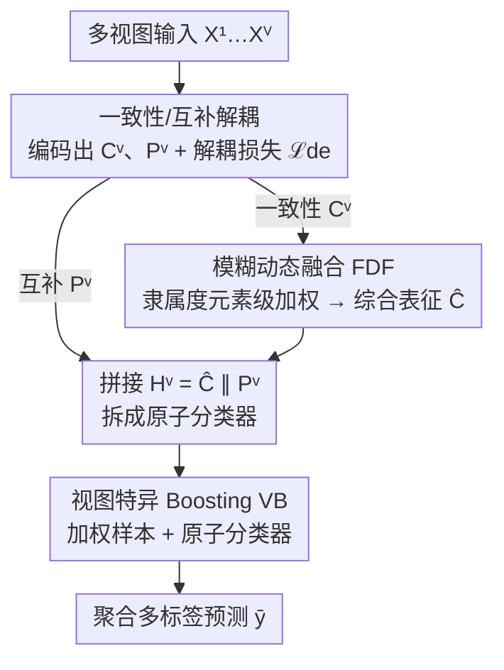

# DF²-VB: Dual-level Fuzzy Fusion with View-specific Boosting for Multi-view Multi-label Classification

**会议**: CVPR 2026  
**论文**: [CVF Open Access](https://openaccess.thecvf.com/content/CVPR2026/html/Lin_DF2-VB_Dual-level_Fuzzy_Fusion_with_View-specific_Boosting_for_Multi-view_Multi-label_CVPR_2026_paper.html)  
**代码**: 未公开  
**领域**: 多视图多标签分类  
**关键词**: 多视图多标签分类, 模糊集理论, 特征级融合, 决策级融合, Boosting  

## 一句话总结
针对多视图多标签分类（MVMLC）里"特征级融合表达力强但不用标签、决策级融合用标签但表征弱"这对此消彼长的矛盾，DF²-VB 把两级融合拧成一个统一框架——用模糊隶属函数在元素粒度上动态加权一致性特征（FDF），再用 Boosting 自适应衡量样本与各视图原子分类器的重要性（VB），让表达力与判别力互相补强，在 6 个公开数据集上全面刷新 SOTA。

## 研究背景与动机
**领域现状**：多视图多标签分类要同时处理多个异质视图（如情感分析里不同模态的数据）和多个相关标签。主流做法分两派：**特征级融合**把各视图特征整合进统一特征空间，常用视图级加权缓解异质冲突，目标是学出更有表达力的表征；**决策级融合**让多个视图各自的分类器先出预测，再聚合，直接和标签监督交互来提升可靠性。

**现有痛点**：两派各有死穴。特征级融合只顾把特征融得"漂亮"，**没有充分利用标签监督**，学出的表征判别力不足；决策级融合虽然贴着监督信号走，却**不关心视图表征本身够不够有表达力**，建立在弱表征之上限制了上限。更细的问题是：特征级融合普遍只做**视图级**加权，对"同一视图内部哪些特征元素重要、哪些冗余"这种**元素粒度**的取舍束手无策。

**核心矛盾**：表达力（expressiveness）与判别力（discriminability）之间存在结构性割裂——单做特征级缺监督引导，单做决策级缺表征支撑。两者恰好互补：特征级融合能缓解视图间冲突造出更强表征，决策级融合能借监督把表征的判别力提上来。

**本文目标**：把特征级与决策级融合统一进一个框架，让两者互相弥补短板，且要解决三个子问题——(1) 一致性与互补表征纠缠在一起怎么干净地拆开；(2) 怎么在元素粒度而非视图粒度自适应衡量特征重要性；(3) 怎么在多标签场景下自适应衡量样本难度与各视图分类器可靠性。

**核心 idea**：用**模糊集理论**把一致性特征映射到一个更"兼容"的模糊表征空间，在元素粒度上识别有效特征、压制冗余特征（FDF）；再把多标签预测拆成多个二分类原子分类器，用 **Boosting** 自适应给样本和原子分类器加权（VB）。FDF 负责表达力、VB 负责判别力，两者拴在一起循环增强。

## 方法详解

### 整体框架
DF²-VB 把一个样本的多视图特征送进三段流水线：**特征抽取与解耦 → 特征级融合（FDF）→ 决策级融合（VB）**。先给每个视图配一对编码器，分别抽出"跨视图相似"的一致性表征 $C^v$ 和"视图独有"的互补表征 $P^v$，并用解耦损失 $\mathcal{L}_{de}$ 把两者推开、断掉相互纠缠。接着 FDF 把所有视图的一致性表征映射进模糊空间，在元素粒度上算出隶属度当作特征重要性，加权融合成一个综合一致性表征 $\hat{C}$。最后在决策级，把 $\hat{C}$ 注回每个视图的互补表征拼成最终视图表征 $H^v$，每个视图分类器拆成多个原子分类器（每个原子分类器只判一个标签），VB 用 Boosting 给样本和原子分类器动态加权，聚合出可靠的多标签预测。整套结构通过 $\mathcal{L}=\mathcal{L}_{cls}+\alpha\mathcal{L}_{de}$ 端到端训练。

### 关键设计

**1. 一致性/互补表征解耦：让两类信息各融各的，互不干扰**

直接把一致性和互补表征一锅炖会出问题：一致性表征要求跨视图相似（适合融合但判别力弱），互补表征带着各视图的异质信息（信息丰富但会破坏融合）。两者混在一起，融合时互补信息的异质性会干扰一致性的对齐，反而两头不讨好。本文用一个解耦损失把它们在统计依赖层面推开：

$$\mathcal{L}_{de} = -\frac{1}{V}\sum_{v=1}^{V}\log\frac{\ell_1^v}{\ell_1^v+\ell_2^v+\ell_3^v}$$

其中 $\ell_1^v=\sum_u e^{\vartheta(\bar{c}^v,\bar{c}^u)/\tau_{ind}}$ 度量一致性之间的相似、$\ell_2^v$ 度量一致性与互补之间的相似、$\ell_3^v$ 度量互补之间的相似，$\vartheta$ 是余弦相似度。最小化它等于**拉高一致性表征之间的统计依赖**（分子变大）、同时**压低一致性—互补、互补—互补之间的依赖**（分母里的 $\ell_2^v,\ell_3^v$ 变小），论文用 Theorem 3.1 给出对互信息下界的对应保证。一个工程亮点是：不同于常见的实例级解耦损失（复杂度 $O(V^2N^2)$），这里先对每个视图做均值池化得到 $\bar{c}^v,\bar{p}^v$ 再算，复杂度降到 $O(V^2)$，与样本数无关。

**2. 模糊动态融合 FDF：用隶属函数在元素粒度上挑特征，而非粗暴的视图级加权**

特征级融合的老问题是只在**视图**这一层加权，对同一视图里"哪个特征元素重要、哪个冗余"无能为力。FDF 借模糊集理论把一致性表征搬进一个模糊表征空间——这个空间被视为比普通特征空间更"广义"、因此更适合融合异质视图特征。具体地，引入 $K$ 个高斯隶属函数，对第 $v$ 个视图样本的第 $j$ 个特征元素 $c_{i,j}^v$ 算 $K$ 个隶属度：

$$s_{i,j,k}^v = \exp\!\left(-\frac{(c_{i,j}^v - m_{j,k})^2}{2\delta_{j,k}^2}\right),\quad k=1,\dots,K$$

其中 $m_{j,k},\delta_{j,k}$ 是**可学习**的均值与标准差。隶属度 $s_{i,j,k}^v$ 衡量该特征元素与第 $k$ 个模糊子空间的匹配度，即特征重要性，注意这是**元素级**而非视图级的细粒度度量。再用 max-pooling 取最有信息量的那一个 $\tilde{s}_{i,j}^v=\max_k\{s_{i,j,k}^v\}$，最后把各视图加权融合成综合一致性表征：

$$\hat{C} = \mathrm{Norm}\!\left(\sum_{v=1}^{V}\tilde{S}^v\odot C^v\right)$$

$\odot$ 是 Hadamard 积。因为权重可学且作用在元素上，FDF 能自适应保留有效信息、压制无意义元素。论文用 Theorem 3.2 论证这种特征级加权比一般视图级加权有**更小的 Rademacher 复杂度**，对应更好的泛化能力——这是 FDF 优于视图级加权的理论依据。

**3. 视图特异 Boosting VB：把多标签拆成原子分类器，自适应衡量样本与分类器的可靠性**

光有融合好的一致性表征还不够，互补表征剥离了一致性信息后单独预测会"信息不全"。VB 先把综合一致性表征注回每个视图：$H^v=\hat{C}\,\|\,P^v$（拼接），补全预测所需信息；再把"一个视图的多标签分类器"拆成 $L$ 个**原子分类器**，每个只管一个标签 $\tilde{o}_{i,j}^v$、$\tilde{y}_{i,j}^v=\sigma(\tilde{o}_{i,j}^v)$，从而能逐标签地刻画"视图表征与某个标签之间的激活关系"。

VB 的核心是用 Boosting 思路给原子分类器和样本动态加权。先在 mini-batch 上算每个原子分类器的错误率 $\epsilon_{j,t}^v=\frac{\sum_i\omega_{i,t}\cdot\mathbb{I}(\hat{y}_{i,j}^v\neq y_{i,j})}{\sum_i\omega_{i,t}}$，据此更新分类器权重：

$$\beta_{j,t+1}^v=\begin{cases}\frac{1}{2}\log\frac{1-\epsilon_{j,t}^v+\eta}{\epsilon_{j,t}^v+\eta}, & \epsilon_{j,t}^v<0.5\\[4pt] 0, & \epsilon_{j,t}^v\geq 0.5\end{cases}$$

错误率超过 0.5 的原子分类器（不可靠）权重直接清零，避免它拖垮强分类器；再对 $\beta$ 跨视图做 softmax 归一化得 $\tilde{\beta}_{j,t+1}^v$。样本权重则按"难分的样本权重升高、易分的降低"更新（式 11），让协同决策更关注困难样本。最终预测聚合所有视图的加权 logit：$\bar{y}_{i,j}=\sigma\!\left(\sum_v\tilde{\beta}_{j,T}^v\cdot\tilde{o}_{i,j}^v\right)$。这条决策级路径反过来又通过监督信号强化了特征级融合阶段的判别力——FDF 与 VB 由此形成"表达力↔判别力"的相互增强闭环。

### 损失函数 / 训练策略
总损失为多标签分类的二元交叉熵加解耦正则：

$$\mathcal{L}=\mathcal{L}_{cls}+\alpha\mathcal{L}_{de},\quad \mathcal{L}_{cls}=-\sum_{i=1}^{N}\sum_{j=1}^{L}\big[y_{i,j}\log\bar{y}_{i,j}+(1-y_{i,j})\log(1-\bar{y}_{i,j})\big]$$

$\alpha$ 是解耦项的惩罚系数。训练时每个 epoch 依次跑：特征抽取 → 解耦 → 算隶属度权重得 $\hat{C}$ → 拼 $H^v$ → 内层做 $T$ 轮 Boosting 迭代更新原子分类器与样本权重 → 聚合预测 → 反传更新参数（见原文 Algorithm 1）。推理时各原子分类器权重已确定，直接按式（12）聚合出预测。

## 实验关键数据

### 主实验
在 6 个公开 MVMLC 数据集（Emotions、Scene、Yeast、Corel5k、Pascal、Espgame）上做五折交叉验证，对比 6 个 SOTA baseline（FIMAN、D-VSM、DIMC、ML-BVAE、VAMS、TMvML），用 5 个指标：AP↑、MiF1↑（越高越好），OE↓、RL↓、Cov↓（越低越好）。下面摘取代表性结果（粗体为本文）：

| 数据集 | 指标 | DF²-VB | 次优 baseline | 说明 |
|--------|------|--------|---------------|------|
| Emotions | AP↑ / MiF1↑ | **0.840 / 0.724** | 0.835 / 0.700 (D-VSM) | 表达力+判别力双优 |
| Scene | OE↓ / RL↓ | **0.183 / 0.058** | 0.189 / 0.058 (D-VSM) | 与最强 baseline 持平或更好 |
| Corel5k | AP↑ / MiF1↑ | **0.540 / 0.437** | 0.475 / 0.414 (D-VSM/TMvML) | AP 大幅领先约 6.5 个点 |
| Espgame | AP↑ / Cov↓ | **0.375 / 82.39** | 0.364 / 86.75 (D-VSM) | 大规模标签集上仍最优 |

总体上 210 组实验里，DF²-VB 全面优于 ML-BVAE、FIMAN、TMvML、VAMS，对 DIMC、D-VSM 分别在 93.3%、90.0% 的情形胜出。Friedman 检验在 0.05 显著性水平拒绝"各算法无差异"原假设，Bonferroni-Dunn 后验检验（CD=3.290）显示 DF²-VB 在所有指标上排名第一。

### 消融实验
在 Emotions / Scene 上比较四个退化变体（去 FDF、去 VB、两者都去、去解耦损失 DL）：

| 配置 | Emotions AP↑ | Emotions MiF1↑ | Scene AP↑ | 说明 |
|------|--------------|----------------|-----------|------|
| W/o FDF & VB | 0.828 | 0.595 | 0.884 | 仅平均一致性表征，最弱 |
| W/o VB | 0.829 | 0.633 | 0.888 | 只有 FDF，缺监督加权 |
| W/o FDF | 0.834 | 0.716 | 0.890 | 只有 VB，表征表达力弱 |
| W/o DL（去解耦损失） | 0.838 | 0.722 | 0.892 | 不解耦，略掉点 |
| **DF²-VB（完整）** | **0.840** | **0.724** | **0.893** | 各组件齐全最优 |

### 关键发现
- **每个组件都正贡献**：从最弱的"两者都去"逐步加回组件，AP/MiF1 单调上升，去掉解耦损失也会掉点，说明三件套缺一不可。
- **特征级融合比决策级更关键**：W/o VB（只剩 FDF）整体优于 W/o FDF（只剩 VB），意味着 FDF 带来的表达力提升比 VB 带来的判别力提升更"打底"。这与作者动机一致——决策级融合本就依赖一个够强的表征。
- **超参敏感性温和**：隶属函数个数 $K$ 和惩罚系数 $\alpha$ 增大时性能先升后降，存在明显最优区间（如 Scene/Corel5K 各有各的最优 $K,\alpha$），整体对超参不过分敏感，且各数据集 100 epoch 内损失平稳收敛。

## 亮点与洞察
- **把"模糊隶属度"当特征重要性**：用可学习高斯隶属函数在元素粒度打分，比传统视图级加权细一档，还配了 Rademacher 复杂度更小的泛化保证——这套"模糊空间更兼容异质视图"的视角可迁移到任何需要融合异质特征的场景。
- **解耦损失的均值池化技巧**：先按视图均值池化再算对比式解耦，把 $O(V^2N^2)$ 砍到 $O(V^2)$，是个低成本、可直接复用的工程 trick，尤其适合大 batch / 大样本的多视图任务。
- **Boosting 进神经网络多标签**：把多标签拆成原子分类器再上 AdaBoost 式样本/分类器加权，是个少见但自然的组合——错误率≥0.5 的原子分类器直接置零，避免坏分类器污染聚合，思路清晰可借鉴。
- **最"啊哈"的点**：FDF 管表达力、VB 管判别力，两者通过共享的 $\hat{C}$ 注入与监督回流形成闭环，把两派此消彼长的矛盾真正"中和"成互补，而不是简单拼接两个模块。

## 局限与展望
- 论文未公开代码，复现门槛偏高；FDF 引入 $K$ 个高斯隶属函数、VB 引入 $T$ 轮 Boosting 迭代，超参与训练开销都比纯特征级方法大。
- 实验集中在传统 MVMLC benchmark（特征维度已抽好的向量视图），**未在原始图像/文本等高维端到端场景验证**，FDF 的元素级隶属度在超高维特征上是否仍高效有待观察。⚠️ 这是笔者的推断，原文未讨论。
- VB 的内层 Boosting 迭代次数 $T$ 的敏感性、以及原子分类器拆分在标签数 $L$ 很大时的计算成本，论文没给完整分析，规模化时可能成为瓶颈。
- 改进方向：把 FDF 的模糊隶属机制做成可插拔模块接到深度骨干网络上端到端学；或探索更轻量的样本加权策略替代逐轮 Boosting。

## 相关工作与启发
- **vs 纯特征级融合（FIMAN / DIMC / SIMM / E2FS）**：它们把多视图融成统一表征但很少用标签监督，判别力受限；DF²-VB 在 FDF 之外接了 VB 直接吃监督，MiF1 提升尤其明显。
- **vs 纯决策级融合（ML-BVAE / TMvML / I2VSLC）**：它们聚合各视图分类器的决策却不在意表征是否够强，建立在弱表征上；DF²-VB 用 FDF 的元素级自适应加权先把表征做强，再做决策聚合，全指标显著领先。
- **vs 视图级加权方法**：传统方法在视图粒度加权，DF²-VB 用模糊隶属函数下沉到特征元素粒度，理论上（更小 Rademacher 复杂度）和实验上都更优。

## 评分
- 新颖性: ⭐⭐⭐⭐ 把模糊集理论的元素级隶属加权与 Boosting 式决策融合统一进 MVMLC，组合新颖且有理论支撑。
- 实验充分度: ⭐⭐⭐⭐ 6 数据集 5 指标 + 显著性检验 + 完整消融与超参分析，但限于传统向量化 benchmark。
- 写作质量: ⭐⭐⭐⭐ 动机—方法—理论逻辑清晰，两个定理点出 FDF/解耦的合理性；公式记号略密。
- 价值: ⭐⭐⭐⭐ 思路（元素级模糊加权、低复杂度解耦、原子分类器 Boosting）可迁移性强，对多视图融合研究有参考价值。

<!-- RELATED:START -->

## 相关论文

- [\[CVPR 2026\] Cross-View Distillation and Adaptive Masking for Incomplete Multi-View Multi-Label Classification](cross-view_distillation_and_adaptive_masking_for_incomplete_multi-view_multi-lab.md)
- [\[CVPR 2026\] Multi-Hierarchical Contrastive Spectral Fusion for Multi-View Clustering](multi-hierarchical_contrastive_spectral_fusion_for_multi-view_clustering.md)
- [\[CVPR 2026\] EXOTIC: External Vision-driven Incomplete Multi-view Classification](exotic_external_vision-driven_incomplete_multi-view_classification.md)
- [\[CVPR 2026\] Learning Anchor in Dual Orthogonal Space for Fast Multi-view Clustering](learning_anchor_in_dual_orthogonal_space_for_fast_multi-view_clustering.md)
- [\[CVPR 2026\] Imbalanced View Contribution Evaluation and Refinement for Deep Incomplete Multi-View Clustering](imbalanced_view_contribution_evaluation_and_refinement_for_deep_incomplete_multi.md)

<!-- RELATED:END -->
