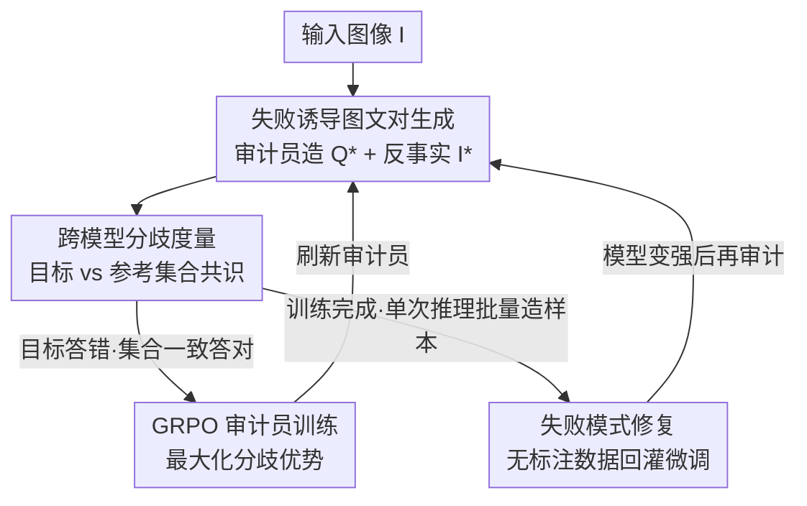

# Differences That Matter: Auditing Models for Capability Gap Discovery and Rectification

**会议**: CVPR 2026  
**论文**: [CVF Open Access](https://openaccess.thecvf.com/content/CVPR2026/html/Liu_Differences_That_Matter_Auditing_Models_for_Capability_Gap_Discovery_and_CVPR_2026_paper.html)  
**代码**: 项目页 https://auditdm.github.io/ （未见开源代码）  
**领域**: 模型审计 / 多模态VLM评测  
**关键词**: 模型审计, 能力差距发现, 跨模型分歧, GRPO, 无标注数据生成  

## 一句话总结
AuditDM 把一个 MLLM 微调成"审计员"，让它主动生成"能让目标模型答错、但参考模型集合却一致答对"的图文对，从而系统性挖出目标模型的能力盲点，再把这些盲点变成无标注训练数据回灌——结果让 PaliGemma2-3B 在多个 benchmark 上反超官方 28B 版本。

## 研究背景与动机
**领域现状**：评估 MLLM 主流靠固定 benchmark（VQAv2、AI2D、MMBench 等）跑一个聚合分数，谁分高谁赢。

**现有痛点**：固定 benchmark 有两个根本缺陷。其一，闭集评测被预设的知识范围框死，必然留下盲点，比较结果天然带选择性偏差；其二，benchmark 把复杂行为压缩成稀疏的几个分数，掩盖了不同数据切片上的异质性差异，而真正重要的能力差距往往纠缠、集中在长尾里。于是实践者拿到两个模型，只知道"谁排行榜高"，却答不出真正关心的问题——"到底哪些输入翻车了、什么技能变强了、哪里还脆"。

**核心矛盾**：模型重训/微调/边端部署后，目标能力可能提升，但对更广泛能力的影响完全不透明；而要靠人去在线测试找盲点，又贵又慢，规模化不了。

**本文目标**：提出一种自动化评估范式，能（1）系统性发现能力差距、（2）把差距总结成可解释的弱点类别、（3）给出反馈指导修复。

**切入角度**：作者的关键观察是——模型之间的"分歧"本身就是信号。如果一组参考模型对某个图文对一致答对、唯独目标模型答错，那这个图文对几乎必然命中了目标模型的真实盲点（而不是问题本身有歧义）。

**核心 idea**：训练一个 MLLM 审计员，用强化学习（GRPO）去主动生成"最大化跨模型分歧"的刁钻问题和反事实图像，把暴露出来的失败模式直接转成无标注训练数据回灌目标模型。

## 方法详解

### 整体框架
AuditDM 是一个强化学习框架，核心是把一个 MLLM（这里用 Gemma3-4B）微调成审计员 $A$，配上扩散模型，专门生成"让目标模型 $M_{tar}$ 翻车、但参考模型集合却一致同意"的图文对 $(Q^*, I^*)$。整条管线分两段闭环：**发现段**（审计员造样本 → 比对目标与参考集合的分歧 → 用分歧信号 GRPO 更新审计员）和**修复段**（用训练好的审计员单次推理批量造盲点数据 → 回灌微调目标模型 → 模型变强后再刷新审计员、再审计）。

给定输入图像 $I$ 和提示 $p$，审计员有两条造样本的路：一条是直接生成刁钻问题 $Q^*$，另一条是借助扩散模型 $G$ 或图像编辑模型 $E$ 造反事实图像 $I^*$。生成出的图文对喂给目标模型和参考模型集合，用一个二值"语义是否一致"的判别器度量分歧；只在"目标答案与集合共识冲突"的样本上更新审计员。训练完成后，审计员对任意图像单次推理就能吐出针对性的盲点样本，直接用于修复。

### 关键设计

**1. 失败诱导图文对生成：让审计员同时攻击文本和视觉两条软肋**

固定 benchmark 找不到盲点，是因为它的问题和图像都是死的；AuditDM 让审计员去"主动造题"，且造题覆盖文本与视觉两个维度。文本侧，审计员根据图像生成复杂、细致的探测问题 $Q^* = A(I', p_q)$，逼自己去识别图中难缠的语义概念、学习目标模型在文本/视觉上的薄弱模式，再针对性出题。视觉侧，审计员造"反事实图像"：要么先给输入图像写一段被刻意加入挑战性语义元素的描述 $C = A(I, p_c)$，让扩散模型 $G$ 重新合成 $I_g = G(C)$；要么生成编辑指令 $E = A(I, p_e)$，让图像编辑模型对原图做受控修改得到 $I_e = E(I, \mathcal{E})$。实践中三种配对层级全用上：$(Q^*, I^*)$、$(Q^*, I)$、$(Q, I^*)$。作者特别指出图像编辑虽然产出的反事实比整图重生成少，但修改更精准、可解释性更强——能精确定位"是哪个视觉因素驱动了模型行为"。

**2. 跨模型分歧度量：用参考集合的共识当"廉价正确答案"**

审计员造出来的题不一定有标注，怎么判断目标模型是真错了、还是题本身有问题？这里是全文最关键的机制。作者不用人工标注，而是用一个参考模型集合的共识当 oracle：审计单个模型时，搜索能让目标模型 $M_{tar}$ 与集合共识最大分歧的 $(Q^*, I^*)$；审计两个模型差异时，第二个模型直接当参考。分歧信号定义为

$$s(Q^*, I^*) = D\big(M_{tar}(Q^*, I^*),\ M_{ref}(Q^*, I^*)\big)$$

其中 $D$ 是一个二值语义一致性判别器：两个答案语义不同返回 1、相同返回 0。这套机制成立靠两个假设：（1）**可答性**——若集合一致同意某答案，则该图文对大概率是有意义、可答的（排除审计员出了无意义的题、或扩散模型生成了不真实图像的情况）；（2）**目标独对的稀有性**——目标模型唯一答对、而集合全错的情况极罕见。在这两个假设下，集合共识被当作"正确"的强代理，审计员只在"目标预测与共识冲突"的样本上更新。这样就把"找盲点"从需要人工标注，变成了纯靠模型间不一致驱动。

**3. GRPO 审计员训练：在不可微的语言接口上优化"最大化分歧"**

造题是一个离散的、不可微的语言生成动作，没法直接梯度回传，所以作者用 Group Relative Policy Optimization（GRPO）这种 RL 方式来训。对每个生成的图文对，先算上面的分歧信号 $s(Q^*, I^*)$，再在组内做相对归一化得到优势：

$$\hat{A}^k(Q^*, I^*) = \frac{s^k(Q^*, I^*) - \mathrm{mean}_j[s^j(Q^*, I^*)]}{\mathrm{std}_j[s^j(Q^*, I^*)] + \epsilon}$$

优化 GRPO 目标，让审计员倾向于生成那些最大化跨模型分歧的样本。这套 RL 写法的好处是：它能在"可解释但不可微"的自然语言接口上做优化，产出的是人类可读的失败模式（如"读时钟""比大小"这类成系统的弱点类别），而不是一堆孤立的错误点。训练完成后，审计员已经学会了"什么样的题会让目标模型翻车"，所以推理时单次前向就能暴露盲点。

**4. 失败模式修复：把盲点变成无标注数据闭环回灌**

发现盲点只是一半，作者还要把它转成训练信号修复模型。直接在失败样本上微调容易过拟合到孤立例子，所以给了两条策略。其一**增广有标注数据**：用审计员生成的样本扩充原训练集（每条训练实例配一条新样本），形成专门覆盖已识别弱点的综合训练集，缓解对孤立样本的过拟合。其二**自举无标注数据**：对一批无标注图像，用未训练的审计员 + 不同训练步保存的审计员 checkpoint 各自生成问题、新图和伪标签，聚合去重成训练集；然后迭代——微调 MLLM、用最新 MLLM 刷新审计员 checkpoint、再从无标注池重新生成数据，直到性能收敛。这就形成了"造盲点数据 → 重训 → 再审计"的持续改进闭环。

### 损失函数 / 训练策略
审计员统一用 Gemma3-4B 微调，训 1K 步，AdamW，初始学习率 $3\times10^{-6}$（10% warm-up + cosine 衰减到 $1\times10^{-6}$），global batch size 256。图像生成用 FLUX.1-dev，图像编辑用 FLUX.1-Kontext-dev。目标模型族为 PaliGemma2 和 Gemma3，集合由这些模型的不同变体混合而成。

## 实验关键数据

### 找盲点的有效性
在 VQAv2 训练集随机抽 20K 图文对，AuditDM 和 baseline（同系统但不微调、纯 prompt engineering 找失败）各为每对生成一个新图文对去测 PaliGemma2-3B，用 Gemini 2.5 Pro + GPT-5 API（分歧处人工复核）产可靠伪标注，度量"暴露出验证有效错误"的搜索成功率。

| 方法 | 搜索成功率（20K 次尝试） |
|------|------|
| Baseline（仅 prompt engineering） | 21.4% |
| AuditDM（Ours） | **91.1%** |

微调后的审计员找盲点效率是 baseline 的 4 倍多，且发现的弱点横跨世界知识、读时钟、比大小等多样技能，更可解释。一个有意思的发现：AuditDM 揭示出 PaliGemma2-28B 在若干类别上反而**比 3B 更差**——幻觉规避、计数、颜色识别上 28B 失败率更高，说明大模型并不必然更鲁棒，且两者依赖不同的视觉线索、决策边界不同。

### 逐任务微调结果（PaliGemma2-3B，448px²）
| 模型 | VQAv2 | GQA | OK-VQA | AI2D | DocVQA | ChartQA | RefCOCO | COCOCap |
|------|-------|-----|--------|------|--------|---------|---------|---------|
| PaliGemma2-10B | 85.8 | 68.3 | 68.6 | 84.4 | 76.6 | 66.4 | 78.2 | 145.0 |
| PaliGemma2-28B | 85.8 | 68.3 | 70.6 | 84.6 | 76.1 | 61.3 | 77.3 | 145.2 |
| PaliGemma2-3B | 84.8 | 68.1 | 64.1 | 76.0 | 73.6 | 54.0 | 76.3 | 143.4 |
| **3B + AuditDM** | **86.7**(+1.9) | **71.1**(+3.0) | 69.2(+5.1) | **85.3**(+9.3) | **77.5**(+3.9) | 63.8(+9.8) | 77.8(+1.5) | 145.1(+1.7) |

3B 模型加 AuditDM 后在所有 benchmark 上大幅提升，且在 VQAv2、AI2D、DocVQA、GQA 等多个任务上**反超官方在原数据上微调的 28B 版本**。grounding 类任务（RefCOCO）涨幅较小，因为合成/编辑图像会挪动物体位置、与 bbox 标注错位。

### 通用 benchmark 结果（Gemma3-4B）
| 模型 | MMBench-v1.1 | MMTBench | Seed-IMG | MME | MMMU | MMStar | RealWorldQA | POPE |
|------|------|------|------|------|------|------|------|------|
| Gemma3-12B | 73.8 | 58.5 | 70.6 | 1517.3 | 44.8 | 55.7 | 58.3 | 86.0 |
| Gemma3-27B | 78.3 | 59.2 | 73.2 | 1526.6 | 49.7 | 58.7 | 62.5 | 85.2 |
| Gemma3-4B | 67.6 | 53.2 | 65.7 | 1376.0 | 39.6 | 46.1 | 54.5 | 85.1 |
| **4B + AuditDM** | 75.0(+7.4) | 58.9(+5.7) | 72.9(+7.2) | 1450.3(+74.3) | 45.2(+5.6) | 52.4(+6.3) | 61.4(+6.9) | 85.5(+0.4) |

无任何人工标注下每个 benchmark 都显著提升，且在 Seed-Bench-IMG、MMMU、RealWorldQA 上 4B+AuditDM 反超 12B。

### 消融：三个审计组件的贡献（PaliGemma2-3B，224px²）
| 配置 | GQA | RefCOCO | AI2D |
|------|------|---------|------|
| Baseline | 66.2 | 73.4 | 74.7 |
| 仅探测问题 | 68.5 | -（随数据增多下降） | 78.2 |
| 仅图像生成 | 66.9 | - | - |
| 仅图像编辑 | 67.2 | 74.6 | 76.3 |
| 最佳组合 | **69.8** | **74.6** | **79.4** |

### 关键发现
- **探测问题（probing question）贡献最大**：在 GQA、AI2D 上单独用它涨得最多，说明"问出更有信息量、更针对性的问题"是提升 MLLM 最有效的途径。
- **图像编辑 > 整图重生成**：编辑只做小的风格/偏差改动，重生成会引入生成模型自带的偏差和伪影、加大分布偏移；但编辑发现的弱点多样性不如重生成。
- **任务相关性强**：grounding 任务（RefCOCO）靠精心过滤的图像编辑（保证目标物体位置不变）才有稳定增益；OCR/图表任务（AI2D）里整图重生成反而掉点（扩散模型画不准图表），探测问题则格外有效。

## 亮点与洞察
- **"分歧即信号"这个切入点很巧**：把"找盲点需要标注"这个老大难，转化成"参考模型集合一致 vs 目标模型分歧"，用模型间不一致当免费的正确性代理，绕开了人工标注瓶颈。
- **审计是闭环不是一次性**：发现的盲点直接变成无标注训练数据回灌，且模型变强后再刷新审计员重审，形成持续改进循环——在数据见顶、scaling 边际收益递减的当下，这是个很实际的方向。
- **"大模型不一定更鲁棒"的实证**：AuditDM 揪出 28B 在幻觉、计数、颜色上反而比 3B 差，且对任务无关的微小图像扰动高度敏感，说明当前 MLLM 可能没把视觉推理 ground 在正确证据上——这个诊断价值本身就很有意思。
- **可迁移性**：用 GRPO 在"可解释但不可微"的语言接口上优化、产出人类可读的成系统弱点类别，这套思路可迁移到任何需要"主动找模型弱点 + 生成针对性数据"的诊断场景（如纯文本 LLM、代码模型）。

## 局限与展望
- **图像生成是瓶颈**：grounding/分割任务需要密集标注才能造探测问题；密集文字和复杂图表（OCR 任务）扩散模型画不准，整图重生成反而掉点。作者建议用强视觉标注器自举伪标签、或用文字/图表专用生成器缓解。
- **计算成本高**：单次推理虽能暴露一个失败案例，但管线同时依赖 MLLM 和扩散模型，大规模合成耗时——微调 Gemma3-4B 花了约 8×H100 跑 5 天来生成图文对。
- ⚠️ 自己发现的局限：整套机制高度依赖"参考集合共识 = 正确"这个假设，若集合本身有系统性共同偏差（如都来自同一预训练范式），可能把"集合的盲点"误判为"目标的盲点"；论文用两个假设和 Supp 实证来兜底，但跨架构异质集合下的稳健性值得进一步验证。

## 相关工作与启发
- **vs 传统 benchmark 评测**：固定闭集、只给聚合分数、无法主动找弱点、不可解释、不能修复；AuditDM 是开放集、主动找弱点、文本+视觉双覆盖、可解释、能修复（Table 1 里六个维度全占）。
- **vs 对抗攻击（jailbreak / 视觉对抗）**：对抗攻击聚焦安全（越狱、数据泄露、恶意意图），多靠基于优化的方法刻意制造攻击；AuditDM 针对的是模型固有弱点和反复出现的失败模式，无需刻意攻击，单次推理即可定位失败，是 optimization-free 的。
- **vs 合成数据方法（caption 生成 / prompt 改写 / 概念扰动）**：那些方法目标是通用对齐和多样性，被动或不主动找弱点；AuditDM 用审计员、靠跨模型分歧生成"针对弱点"的样本，直接闭合能力差距、支持无标注持续修复。
- **vs 自进化 / 弱到强学习（self-play / self-instruct）**：同样是从自生成数据迭代改进，但 AuditDM 显式训练一个"模型特定"的审计员去挖目标 MLLM 的能力差距，再合成针对性数据闭环。

## 评分
- 新颖性: ⭐⭐⭐⭐⭐ 把"模型审计"立为新评估范式，用跨模型分歧当无标注信号 + RL 审计员，切入角度新颖。
- 实验充分度: ⭐⭐⭐⭐⭐ 两个模型族、16 个 benchmark、逐任务+通用+组件消融齐全，且有 3B 反超 28B 的强力证据。
- 写作质量: ⭐⭐⭐⭐ 动机和机制讲得清楚，Table 1 定位精准；部分公式排版较乱，需对照原文。
- 价值: ⭐⭐⭐⭐⭐ 在数据 scaling 见顶背景下给出"审计驱动诊断+修复"的实际路径，诊断洞察（大模型不更鲁棒）也有独立价值。

<!-- RELATED:START -->

## 相关论文

- [\[CVPR 2026\] Language Does Matter for Cross-Domain Few-Shot Visual Feature Enhancement](language_does_matter_for_cross-domain_few-shot_visual_feature_enhancement.md)
- [\[ICLR 2026\] Missing Mass for Differentially Private Domain Discovery](../../ICLR2026/others/missing_mass_for_differentially_private_domain_discovery.md)
- [\[ICML 2026\] Target-Agnostic Calibration under Distribution Shift with Frequency-Aware Gradient Rectification](../../ICML2026/others/target-agnostic_calibration_under_distribution_shift_with_frequency-aware_gradie.md)
- [\[AAAI 2026\] Bridging the Skills Gap: A Course Model for Modern Generative AI Education](../../AAAI2026/others/bridging_the_skills_gap_a_course_model_for_modern_generative_ai_education.md)
- [\[ACL 2025\] I0T: Embedding Standardization Method Towards Zero Modality Gap](../../ACL2025/others/i0t_embedding_standardization_method_towards_zero_modality_gap.md)

<!-- RELATED:END -->
