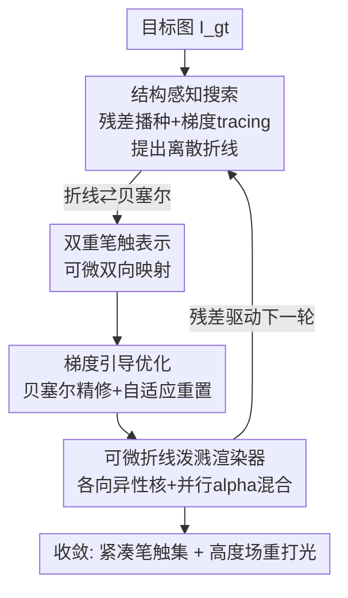

# Differentiable Stroke Planning with Dual Parameterization for Efficient and High-Fidelity Painting Creation

**会议**: CVPR 2026  
**论文**: [CVF Open Access](https://openaccess.thecvf.com/content/CVPR2026/html/Liu_Differentiable_Stroke_Planning_with_Dual_Parameterization_for_Efficient_and_High-Fidelity_CVPR_2026_paper.html)  
**代码**: 无  
**领域**: 图像矢量化 / 笔触绘画渲染  
**关键词**: 笔触渲染, 双重参数化, 可微渲染, 高斯泼溅初始化, 非真实感渲染  

## 一句话总结
把一根笔触同时表示成「离散折线」和「连续贝塞尔曲线」并让二者可微互转，用残差引导的离散搜索负责全局结构、用梯度优化负责像素级精修，再配一个高斯泼溅式的可微折线渲染器并行优化上千笔，从而在比现有方法少 30–50% 笔触、快 30–40% 的前提下把复杂纹理的 PSNR 抬高 4–5 dB。

## 研究背景与动机
**领域现状**：笔触渲染（stroke-based rendering，又叫图像矢量化）要把一张照片自动翻译成一组可编辑的笔触，得到油画/素描风格的非真实感艺术图。现有方法分两大派：搜索派沿局部像素梯度去 trace 笔触（多用矩形 primitive），优化派用可微渲染做梯度下降拟合颜色。

**现有痛点**：搜索派因为笔触是离散摆放，容易陷入局部极小，结果结构破碎、对噪声敏感，往往要上万根笔触才能勉强还原一张图，优化又慢，复杂纹理上 PSNR 常低于 27 dB；优化派每根笔触收敛快、更稳，但缺少显式的结构先验，整个优化被像素级 loss 主导，画出来的笔触布局凌乱、抓不住图像的连贯走势，也陷在局部极小、可编辑性差。

**核心矛盾**：离散搜索有「结构感知」却没法做可微精修，连续优化能精修却没有「结构先验」——两种范式各有一半本事，但用的是互不相通的两套表示，没法协同。

**本文目标**：让离散搜索和连续优化在同一根笔触上协同工作——既能高效探索大尺度结构，又能做精确的像素级拟合。

**切入角度**：作者观察到离散搜索与连续优化的优势是互补的，关键卡点只是「表示不通」。如果能造一座可微的双向桥，让连续域的梯度回流去改离散结构、让离散搜索的结构提议喂给连续优化，两者就能扬长补短。

**核心 idea**：用一个**双重笔触表示**（离散折线 ⇄ 连续贝塞尔，可微双向映射）把搜索与优化耦合起来，搭成「搜索定结构、梯度精细节」的两阶段迭代管线，并借鉴高斯泼溅做并行初始化与渲染。

## 方法详解

### 整体框架
给定目标图 $I_{\text{gt}}\in\mathbb{R}^{H\times W\times 3}$，目标是找到一组笔触 $\mathcal{S}=\{s_i\}$，使其渲染结果 $I$ 最小化重建损失 $\mathcal{L}(I,I_{\text{gt}})$。整条管线是一个**搜索-优化交替的迭代循环**，建立在双重笔触表示之上。每次迭代两步走：① 结构感知搜索在「重建误差高」的区域提出新笔触结构；② 梯度引导优化精修当前所有笔触的参数。两步背后由一个可微折线渲染器把所有笔触并行泼溅到画布上，再回传梯度。论文强调大部分结构在**第一轮迭代**就被搜索拿下，后续迭代只做渐进精修，因此默认只跑 3 轮就收敛。

### 关键设计

**1. 双重笔触表示：给离散搜索和连续优化造一座可微双向桥**

这是全文的核心，直击「两种范式表示不通」的痛点。一根笔触 $s_i$ 同时被表示成两种形态：**离散折线** $\mathbf{P}_i=[\mathbf{p}_{i,0},\dots,\mathbf{p}_{i,M_i-1}]$（一串有序顶点，直观、便于结构提议与编辑）和**连续贝塞尔曲线** $\mathbf{C}_i=[\mathbf{c}_{i,0},\dots,\mathbf{c}_{i,K-1}]$（光滑参数曲线，适合可微精修）。两者通过共享参数化做**可微双向映射**。

折线→贝塞尔方向（可微拟合）：先用弦长参数化给每个顶点 $\mathbf{p}_{i,m}$ 配一个归一化参数 $t_{i,m}\in[0,1]$；贝塞尔曲线上参数 $t$ 处的点是 $\mathbf{B}(t;\mathbf{C}_i)=\sum_{k=0}^{K-1}\mathbf{c}_{i,k}\,B_{k,K-1}(t)$，其中 $B_{k,K-1}$ 是 Bernstein 基函数。最优控制点由最小二乘求得：

$$\mathbf{C}_i^*=\underset{\mathbf{C}_i}{\arg\min}\sum_{m=0}^{M_i-1}\big\|\mathbf{p}_{i,m}-\mathbf{B}(t_{i,m};\mathbf{C}_i)\big\|_2^2.$$

这是个凸问题，有**伪逆闭式解**，因此拟合过程天然可微，梯度能从连续曲线回流到离散折线顶点。反方向贝塞尔→折线（可微采样）更直接：在固定参数集上对曲线取样 $\mathbf{p}_{i,m}=\mathbf{B}(t_{i,m};\mathbf{C}_i)$，本质是控制点的线性组合，对 $\mathbf{C}_i$ 可微。这座双向可微桥让连续优化的梯度信号能去精修搜索提出的离散结构，全局布局和局部细节一起被优化——这正是搜索派和优化派以前各缺的另一半。

**2. 结构感知笔触搜索：用残差梯度场牵着离散折线长出来，专攻高误差区**

针对「搜索派结构破碎、易陷局部极小」的痛点，本模块不再用固定方向的短段去 trace，而是让折线沿着重建误差的梯度场「生长」。每轮 $t$ 先算重建残差和它的梯度场：$R^t(\mathbf{x})=\|I^t(\mathbf{x})-I_{\text{gt}}(\mathbf{x})\|_2^2$，$\mathbf{G}^t(\mathbf{x})=\nabla R^t(\mathbf{x})$。再用**非极大值抑制（NMS）**从残差分布里采种子点 $\{\mathbf{x}_j\}$，保证笔触优先落在结构显著、误差大的地方。

从种子 $\mathbf{p}_0=\mathbf{x}_j$ 出发，按可微步长 $\eta$ 沿梯度流方向迭代生长 $\mathbf{p}_{k+1}=\mathbf{p}_k+\eta\cdot\mathbf{d}_k$，方向 $\mathbf{d}_k$ 直观上是在残差场上做梯度上升，把笔触推向高误差区。为了不被局部噪声带偏，方向取「当前局部梯度」与「上一步方向」的加权混合以鼓励平滑：

$$\tilde{\mathbf{d}}_k=\frac{\mathbf{G}^t(\mathbf{p}_k)}{\|\mathbf{G}^t(\mathbf{p}_k)\|+\epsilon},\qquad \mathbf{d}_k=\lambda\,\tilde{\mathbf{d}}_k+(1-\lambda)\,\mathbf{d}_{k-1}.$$

当笔触不再降低重建 loss、且连续失败次数超阈值时停止 tracing。这样长出来的折线 $S_{\text{search}}=\{\mathbf{P}_i\}$ 每个顶点都由梯度流显式决定，因此既结构连贯、又从一开始就「为降 loss 而生」，随后经双重表示转成贝塞尔，喂给下一阶段精修。

**3. 梯度引导优化 + 可微折线泼溅渲染器：分工「粗搜索、细精修」，并借高斯泼溅并行加速**

搜索已经解决了大尺度结构分配，本阶段就在连续贝塞尔域 $\{\mathbf{C}_i\}$ 上把所有笔触**并行精修**到像素级保真，且不必担心塌进全局糟糕布局。控制点先均匀采样成稠密折线 $\tilde{\mathbf{P}}_i$，整组笔触用可微泼溅核一次前向渲染成画布 $I_{\text{render}}$，最小化目标 $\mathcal{L}=\|I_{\text{render}}-I_{\text{gt}}\|_2+\lambda_\ell\mathcal{L}_{\text{len}}+\lambda_w\mathcal{L}_{\text{width}}$（后两项正则笔触长度与宽度），梯度对几何、颜色、不透明度、宽度全程回传。

渲染器把每段笔触近似成**软的各向异性泼溅**，在精确贝塞尔光栅化的开销和完全可微之间折中。一段 $e_{i,j}$ 对像素 $\mathbf{x}$ 的影响由基于最短距离 $d_{i,j}(\mathbf{x})$ 的各向异性核给出：

$$k_{i,j}(\mathbf{x})=\frac{\sigma\!\big(\tfrac{w_i/2-d_{i,j}(\mathbf{x})}{\tau}\big)-\sigma\!\big(\tfrac{-w_i/2}{\tau}\big)}{1-2\sigma\!\big(\tfrac{-w_i/2}{\tau}\big)},$$

$w_i$ 是笔宽、$\tau$ 是软硬度参数、$\sigma$ 是 logistic，得到的不透明度 $\alpha_{i,j}(\mathbf{x})=\mathbf{o}_i\cdot\max(0,k_{i,j}(\mathbf{x}))$。所有段在一次 GPU 并行 pass 里做前到后 alpha 混合合成 $C(\mathbf{x})=\sum_{(i,j)\in\pi(\mathbf{x})}\alpha_{i,j}(\mathbf{x})\,\mathbf{c}_i\prod_{(p,q)<(i,j)}(1-\alpha_{p,q}(\mathbf{x}))$，这里**可学习的透明度**让笔触平滑叠加、显著减少所需笔触数。这套泼溅范式借鉴高斯泼溅，能高度并行地光栅化所有段，从而支持**高斯泼溅式初始化**——按图像特征密度铺一大批笔触种子，从第一轮就同时优化上千笔，大幅加速收敛。优化阶段还用了类 3DGS 的自适应策略：由于本文笔触长而结构重要，直接 split/prune 会破坏全局轮廓，所以只对「近零不透明度且重建 loss 极小」的笔触做重置，交回搜索模块重新分配参数，兼顾结构完整与稳定收敛。此外为每根笔触回归一个高度值 $h_i$（初值由预训练单目深度模型 Depth Anything 估计，再加相邻笔触平滑约束），最终高度场可在新光照下重打光，模拟厚涂油画的表面浮雕。

### 损失函数 / 训练策略
重建目标为 $\mathcal{L}=\|I_{\text{render}}-I_{\text{gt}}\|_2+\lambda_\ell\mathcal{L}_{\text{len}}+\lambda_w\mathcal{L}_{\text{width}}$。实现基于 PyTorch、单张 RTX 4090；默认 3 轮搜索-优化迭代。搜索阶段从 top 12% 残差像素用 7×7 NMS 取种子，自适应步长起始 1.2 像素、平滑因子 $\lambda=0.8$，笔触最多长到 20 个顶点、需至少降 loss 0.01 才被接受、连续 20 次拒绝后停止。优化阶段把折线转成分段三次贝塞尔、采样 10 个离散点渲染，用 Adam 优化全部参数最多 4000 步/阶段，基础学习率 0.01，颜色与宽度更新分别缩放 0.1 和 0.01。

## 实验关键数据

### 主实验
在 DIV2K 验证集（1200×1200 自然图）和 Im2Oil 画廊数据集（600×800 经典油画）上，与 Im2Oil、CNP、Paint Transformer、Learning to Paint、SNP 五个 SOTA 对比（baseline 在 DIV2K 用 16K 笔、Im2Oil 用 8K 笔对齐参数）：

| 数据集 | 方法 | PSNR↑ | SSIM↑ | LPIPS↓ | Time(s)↓ |
|--------|------|-------|-------|--------|----------|
| DIV2K | Im2Oil | 27.59 | 0.72 | 0.211 | 727.8 |
| DIV2K | CNP | 27.91 | 0.64 | 0.296 | 125.5 |
| DIV2K | Learning to Paint | 27.19 | 0.70 | 0.330 | 167.9 |
| DIV2K | SNP | 20.63 | 0.42 | 0.405 | 5837.2 |
| DIV2K | **本文** | **32.16** | **0.93** | **0.076** | **87.6** |
| Gallery | Im2Oil | 28.54 | 0.71 | 0.204 | 392.8 |
| Gallery | Learning to Paint | 28.58 | 0.73 | 0.318 | 80.6 |
| Gallery | **本文** | **32.53** | **0.86** | **0.192** | **42.7** |

PSNR 在两个数据集都比最强 baseline 高约 4 dB，SSIM 的大幅提升说明全局结构与语义连贯被很好保留；同时运行时间显著下降。另有一项 100 人用户研究（含约 30% 受过美术训练）在结构/纹理/颜色/整体四项 1–5 Likert 评分上，本文以 4.32/4.28/4.41/4.35 全面居首，远超次优的 Learning to Paint（约 3.5 档）。

### 消融实验
**双重表示消融**（DIV2K，Bézier-only 因渲染开销限 2000 笔、其余 16000 笔）：

| 变体 | PSNR↑ | SSIM↑ | LPIPS↓ | Time(s)↓ |
|------|-------|-------|--------|----------|
| Search-only（只搜索不精修） | 27.8 | 0.76 | 0.227 | 57.2 |
| Polyline-only 优化 | 31.2 | 0.89 | 0.126 | 31.6 |
| Bézier-only 优化 | 30.4 | 0.86 | 0.138 | 3978.4 |
| Full model（本文） | **32.16** | **0.93** | **0.076** | 87.6 |

**搜索/优化组件消融**：

| 模块 | 变体 | PSNR↑ | SSIM↑ | LPIPS↓ |
|------|------|-------|-------|--------|
| 搜索 | w/o 残差播种 | 26.6 | 0.68 | 0.263 |
| 搜索 | w/o 梯度 tracing | 26.3 | 0.71 | 0.249 |
| 搜索 | Full search | 27.8 | 0.76 | 0.227 |
| 优化 | w/o opacity reinit | 30.3 | 0.85 | 0.158 |
| 优化 | w/o loss reinit | 29.9 | 0.86 | 0.152 |
| 优化 | w/o any reinit | 28.1 | 0.83 | 0.173 |
| 优化 | Full optimization | 31.2 | 0.89 | 0.126 |

### 关键发现
- **双重表示缺一不可**：只搜索缺细节（27.8 dB）、只优化折线梯度不稳、只优化贝塞尔缺离散引导且渲染奇慢（3978 s）；完整模型在精度和稳定性上都最好，印证「离散搜索给结构先验、贝塞尔给可微精修空间」的分工。
- **第一轮就吃下大部分结构**：迭代逐轮分析里 $t=1$ 的优化阶段已达 28.4 dB / 47.2 s，$t=3$ 升到 32.2 dB / 87.6 s，$t=4$ 仅微涨到 32.4 dB，作者据此把默认迭代定为 3，是性能-效率最佳折中。
- **搜索两件套都关键**：去掉残差播种或梯度 tracing，PSNR 都从 27.8 掉到约 26.x、SSIM 明显下滑；自适应重置（按 opacity / loss 选择性重置）比完全不重置（28.1 dB）稳定且更高。
- **软硬度 $\tau$ 可调美学**：$\tau=0.7$ 出平滑写实，$\tau=0.1$ 出锐利分明的笔刷感并配合高度场重打光做出 3D 浮雕效果。

## 亮点与洞察
- **「双表示 + 可微双向映射」是真正的桥**：以前搜索和优化是两条平行线，本文用伪逆闭式解让折线↔贝塞尔互转可微，梯度第一次能从连续域反向去改离散结构——这是把两种范式拼起来的关键 trick，思路可迁移到任何「离散提议 + 连续精修」的问题（如可微 CAD、矢量图编辑）。
- **把高斯泼溅搬进笔触渲染**：用各向异性软泼溅核近似笔段、GPU 并行 alpha 混合，既换来可微又换来「从第一轮就并行优化上千笔」的吞吐，是少笔触、快收敛的工程底座。
- **可学习透明度直接砍笔触预算**：让笔触平滑叠加、用更少的笔覆盖同样区域，是 30–50% 笔触缩减的直接来源。
- **分工哲学清晰**：粗探索交给搜索、细利用交给梯度，并用「只重置废笔、不 split/prune 长笔」保护全局轮廓——这套自适应策略对长结构尤其友好。

## 局限性 / 可改进方向
- 高度场依赖预训练单目深度模型（Depth Anything）做初值，深度估计在复杂/平面场景出错时，重打光浮雕效果可能失真（作者未量化这一依赖的影响）。⚠️ 论文未给高度回归本身的消融。
- 评测集中在自然图（DIV2K）和油画（Im2Oil），未涉及线稿/水墨/极端高分辨率等更广风格，泛化性待验证。
- 迭代数、NMS 比例（top 12%）、$\lambda$、步长等超参较多且偏经验，跨数据集是否需重调未充分讨论。
- 表 1 里本文在 Gallery 上的 LPIPS（0.192）反而高于 DIV2K（0.076），说明油画纹理域上的感知保真没有自然图那么强，值得注意。

## 相关工作与启发
- **vs 搜索派（Im2Oil/SBP/ALPA 等）**：他们沿局部梯度 trace 离散矩形/段，结构破碎、动辄上万笔、易陷局部极小；本文也用梯度 tracing 提结构，但提出来后能转成贝塞尔做可微精修，笔触少且布局连贯。
- **vs 可微优化派（SNP/CNP 等）**：他们用梯度下降拟合颜色、收敛快但缺结构先验、布局凌乱；本文先用搜索注入结构先验再让梯度精修，规避了「被像素 loss 主导」的乱布局。
- **vs Paint Transformer / Learning to Paint（神经/RL 生成笔触序列）**：它们靠学习模型生成笔触、泛化与可控性受限；本文是优化式、无需训练大模型，且产出的矢量笔触高度可编辑。
- **vs 3DGS**：借用其自适应密度控制思想，但因笔触是长结构、不做 split/prune 而只选择性重置废笔，避免破坏轮廓连贯。

## 评分
- 新颖性: ⭐⭐⭐⭐⭐ 双重可微表示把离散搜索与连续优化真正耦合，是笔触渲染里少见的范式融合。
- 实验充分度: ⭐⭐⭐⭐ 两数据集 + 用户研究 + 多组消融较扎实，但风格域和高度场依赖的验证略欠。
- 写作质量: ⭐⭐⭐⭐ 动机-方法-实验逻辑清晰，公式与框架图到位，符号偶有冗余。
- 价值: ⭐⭐⭐⭐⭐ 少 30–50% 笔触、快 30–40%、复杂纹理 +4–5 dB，对实用高保真笔触渲染是实打实的推进。

<!-- RELATED:START -->

## 相关论文

- [\[CVPR 2026\] RealAppliance: Let High-fidelity Appliance Assets Controllable and Workable as Aligned Real Manuals](realappiance_let_high-fidelity_appliance_assets_controllable_and_workable_as_ali.md)
- [\[CVPR 2026\] Lens Component Deletion based on Differentiable Ray Tracing](lens_component_deletion_based_on_differentiable_ray_tracing.md)
- [\[AAAI 2026\] Learning Compact Latent Space for Representing Neural Signed Distance Functions with High-fidelity Geometry Details](../../AAAI2026/others/learning_compact_latent_space_for_representing_neural_signed_distance_functions_.md)
- [\[ECCV 2024\] High-Fidelity 3D Textured Shapes Generation by Sparse Encoding and Adversarial Decoding](../../ECCV2024/others/high-fidelity_3d_textured_shapes_generation_by_sparse_encoding_and_adversarial_d.md)
- [\[CVPR 2026\] DiffBMP: Differentiable Rendering with Bitmap Primitives](diffbmp_differentiable_rendering_with_bitmap_primitives.md)

<!-- RELATED:END -->
