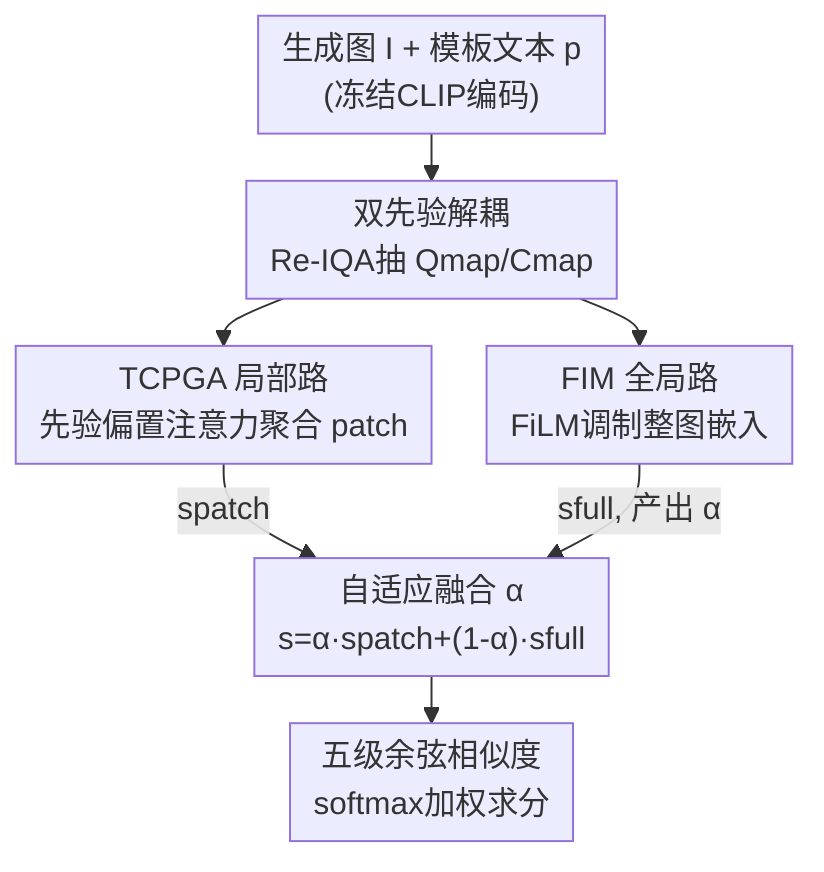

# DPGF-Net: Dual-Prior Guided Fusion Network for Joint Assessment of Perceptual Quality and Semantic Consistency in AI-Generated Images

**会议**: CVPR 2026  
**论文**: [CVF Open Access](https://openaccess.thecvf.com/content/CVPR2026/html/Li_DPGF-Net_Dual-Prior_Guided_Fusion_Network_for_Joint_Assessment_of_Perceptual_CVPR_2026_paper.html)  
**代码**: https://github.com/leeto221/AGIQA (有)  
**领域**: 图像质量评估 / 多模态VLM  
**关键词**: AI生成图像质量评估, AGIQA, 双先验解耦, 跨模态融合, CLIP  

## 一句话总结
DPGF-Net 用 Re-IQA 的双编码器抽出"失真先验 Qmap"和"内容先验 Cmap"来把渲染失真和语义内容解耦，再配合单一文本模板与"局部 TCPGA + 全局 FIM"双路自适应融合，在一个 CLIP 框架里同时打"感知质量"和"文图一致性"两个分，在三个 AGIQA 数据集和跨数据集上 12 项指标拿下 11 项第一。

## 研究背景与动机
**领域现状**：文生图越来越普及，但生成图既可能"画得糊/不自然"（感知质量差），也可能"没按 prompt 画对"（文图对齐差）。AGIQA（AI-generated image quality assessment）就是要给这两个维度自动打分，给生成模型提供反馈。当前主流是 CLIP-based 方法（如 IP-IQA、IPCE），用文本 prompt 去对齐图像表征。

**现有痛点**：作者指出两类方法都不行。一是传统自然图像 IQA（DBCNN、HyperIQA、TReS）只盯压缩/噪声这类常见失真、完全不用文本，在生成图特有失真上甚至打不过简单的 CLIP 方法；二是现有 CLIP-based 方法在跨数据集上泛化差，根因有两点：(a) 只用原始/细粒度文本、把质量和对齐**分开**评，没建模两者的**交互关系**；(b) 模板方法虽能同时表示两个维度，却**分不清两个维度各自的任务目标**——而实测里质量好的图对齐未必好（Figure 1(b)），两个维度经常打架。

**核心矛盾**：感知质量来自"失真线索"，语义对齐来自"内容线索"，二者在生成图里**紧密耦合又目标相反**；现有方法要么忽略图像侧信息只啃文本，要么把两个维度混在一起算，无法回答"这张图差到底是渲染坏了还是没对上 prompt"。

**本文目标**：在一个统一框架里既建模感知质量与语义对齐、又系统刻画两者交互；具体拆成——(1) 把失真和内容在图像侧解耦；(2) 让局部与全局表征都参与跨模态评分；(3) 按任务/内容自适应平衡两者贡献。

**切入角度**：既然失真和内容是两类不同线索，那就在图像侧引入两个互补先验（distortion prior 与 content prior）显式把它们拆开，再用文本模板模拟"在评一个维度时另一维度的影响"。

**核心 idea**：用"双图像先验解耦失真/内容 + 文本模板模拟交互 + 局部-全局双路自适应融合"代替"单一文本分支分开评分"，做到一个 CLIP 框架联合打两个分。

## 方法详解

### 整体框架
DPGF-Net 学习一个任务条件评分函数 $f_\theta(I,p,\tau)$：给定生成图 $I$、文本 prompt $p$、评估维度 $\tau\in\{\text{qual},\text{align}\}$，输出与人类主观分一致的得分。整条管线是一个**双路融合 pipeline**：先把图像编码成 patch 级局部特征和整图全局特征、把模板文本编成多粒度语义嵌入；同时用一个冻结的 Re-IQA 双编码器抽出失真先验 Qmap 与内容先验 Cmap。接着进入双路——局部路 TCPGA 在文本与先验共同引导下对 patch 做加权聚合，全局路 FIM 用先验调制整图嵌入，二者经一个可学习系数 $\alpha$ 自适应融合；最后融合后的视觉表征与文本嵌入算余弦相似度，softmax 后按五个质量等级加权求和得到连续分。CLIP 全程冻结，Qmap 走质量预测、Cmap 走对齐判断。

### 关键设计

**1. 双图像先验解耦：把渲染失真和内容拆成两路先验**

针对"现有方法只啃文本、忽略图像侧信息，导致分不清失真和内容"的痛点，DPGF-Net 在图像侧引入两个互补先验。它借用 Re-IQA 的双编码器结构，分别抽失真感知特征和内容感知特征：$Q_{map}=f_q(I)$、$C_{map}=f_c(I)$，其中 $f_q$ 是质量感知编码器、$f_c$ 是内容感知编码器。这两组**部分解耦**的特征就当作失真先验和内容先验，给后续模块提供互补的感知线索与语义线索。关键在于按任务切换：评感知质量时用 Qmap（盯失真敏感区），评文图对齐时用 Cmap（盯语义相关区）——这样一个网络靠换先验就能服务两个目标，同时增强对视觉退化的敏感度、抑制无关语义。

**2. 单模板文本侧引导：用一句带质量副词的模板模拟两维交互**

针对"分开评质量和对齐、不建模交互"的痛点，作者沿用 Peng 等人（IPCE）的单一 prompt 模板把内容描述和质量等级绑在一起：`"A photo where {adv} matches 'prompt.'"`，其中 `{adv}` 取 badly/poorly/fairly/well/perfectly 五档，`prompt` 是内容描述。这一句话同时编码了"内容是否匹配"和"匹配得多好"，于是在评一个维度时天然带上了另一维度的影响，把"内容-失真交互"显式写进文本语义里。冻结的视觉-语言模型据此产出跨五个质量等级的多粒度文本嵌入 $T(p)\in\mathbb{R}^{K\times d}$，作为后续局部/全局两路共享的可控文本侧锚点。

**3. TCPGA 局部路：把空间先验直接塞进注意力打分，而非读出阶段**

针对"局部感知缺乏先验引导、注意力容易飘"的问题，文本条件先验引导聚合（TCPGA）在 patch 嵌入 $E_p\in\mathbb{R}^{N_p\times d}$ 和文本锚点 $T(p)\in\mathbb{R}^{K\times d}$ 之间做 anchor-to-patch 注意力。先把空间先验图给每个 patch 的标量权重 $q_i$ 过一个可学习门控得到显著性先验：$P_i=\sigma(\lambda_q q_i+\lambda_0)$（质量任务 $q_i$ 取自 Qmap、对齐任务取自 Cmap）。然后把 $\log P_i$ 作为偏置**直接加进注意力 logit**：

$$A_{k,i}=\frac{\exp\!\big(Q_k^\top K_i/\sqrt{d'}+\log P_i\big)}{\sum_{j=1}^{N_p}\exp\!\big(Q_k^\top K_j/\sqrt{d'}+\log P_j\big)}$$

再做注意力加权聚合 $F_k=\sum_i A_{k,i}V_i$，拼成 $F_{loc}\in\mathbb{R}^{K\times d'}$，最后投影回 CLIP 嵌入空间并做 $\ell_2$ 归一化对齐多模态度量。妙处在于：把先验注入放在**特征匹配阶段**而不是最后读出阶段，等于让"自底向上的失真敏感"和"自顶向下的语义引导"在算注意力时就融合，可解释地决定哪些 patch 重要。

**4. FIM 全局调制 + 自适应融合：FiLM 调整整图表征并动态平衡局部-全局**

针对"只有局部 patch 会丢整体感知、单路预测不稳"的问题，全局路全图调制（FIM）对冻结 CLIP 的整图嵌入 $z_{full}$ 做 FiLM 调制。它用任务特定全局先验 $S_\tau(I)\in\mathbb{R}^{2048}$ 喂三个轻量 MLP，生成调制参数 $\gamma,\beta$ 和融合系数 $\alpha$，得到 $\tilde z_{full}=\dfrac{z_{full}\odot\gamma+\beta}{\|z_{full}\odot\gamma+\beta\|_2+\varepsilon}$，再与文本锚点算余弦相似度 $s_{full}$。最终两路用 $\alpha$ 自适应融合：$s=\alpha\,s_{patch}+(1-\alpha)\,s_{full}$，对 $s$ 做 softmax 得 $p$，按五个等级加权求和得到连续分 $\hat y_\tau=\sum_{k=1}^{K}k\,p_k$。$\alpha$ 由 FIM 按图像内容和任务类型动态产出，等于让模型自己决定"这张图该多信局部失真、还是多信全局语义"，从而在感知敏感度与语义一致性间取得平衡，也压住单分支的极端预测误差。

### 损失函数 / 训练策略
训练目标是预测分与真值分的平均绝对误差（MAE，一个面向一致性的回归损失）。骨干用冻结的 CLIP ViT-B/32，训 25 epoch、AdamW；分组学习率 TCPGA/FIM 为 $5\times10^{-5}$、PriorGate 为 $1\times10^{-5}$，全局梯度裁剪 0.5；输入 224×224 按 CLIP 归一化，每图采 12 个 patch，batch 64，单张 RTX 4090。

## 实验关键数据

### 主实验
三个 AGIQA 数据集（AGIQA-3K 2982 张、AIGCIQA2023 2400 张、PKU-I2IQA 1600 张），8:2 划分，PLCC/SRCC 评估。DPGF-Net 在 12 个指标里拿下 11 项第一。下表摘取部分维度（SRCC/PLCC，越高越好）：

| 数据集·维度 | 指标 | DPGF-Net | IPCE | QMI-Net | MANIQA |
|------|------|------|------|------|------|
| AGIQA-3K·质量 | SRCC | **0.9010** | 0.8810 | 0.8703 | 0.8723 |
| AGIQA-3K·质量 | PLCC | **0.9292** | 0.9214 | 0.9128 | 0.9098 |
| AGIQA-3K·对齐 | SRCC | **0.8013** | 0.7697 | 0.7821 | 0.7603 |
| AIGCIQA2023·质量 | SRCC | **0.8806** | 0.8640 | 0.8561 | 0.8566 |
| AIGCIQA2023·对齐 | SRCC | **0.8278** | 0.7979 | 0.8082 | 0.7647 |
| PKU-I2IQA·对齐 | SRCC | **0.8119** | 0.7700 | 0.7939 | 0.7024 |

跨数据集泛化（Table 2，两两迁移取平均，SRCC/PLCC）也全面领先：

| 设置 | 维度 | 指标 | DPGF-Net | IPCE | MANIQA |
|------|------|------|------|------|------|
| 平均 | 质量 | PLCC | **0.8038** | 0.7583 | 0.7440 |
| 平均 | 质量 | SRCC | **0.7694** | 0.7415 | 0.7234 |
| 平均 | 对齐 | PLCC | **0.6736** | 0.6641 | 0.5758 |
| 平均 | 对齐 | SRCC | 0.6387 | **0.6317** | 0.5639 |

> ⚠️ 跨数据集"对齐 SRCC 平均"DPGF-Net 0.6387 略高于 IPCE 0.6317，但优势很小；其余跨集指标领先更明显。

### 消融实验
在 AIGCIQA2023 上拆模块（PLCC/SRCC）：

| 配置 | 质量 SRCC | 对齐 SRCC | 说明 |
|------|---------|---------|------|
| w/o TCPGA, FIM | 0.8647 | 0.7964 | 两路都去，只剩基础模板 |
| w/o TCPGA | 0.8773 | 0.8015 | 去局部路 |
| w/o FIM | 0.8744 | 0.8067 | 去全局路 |
| 完整模型 | **0.8806** | **0.8278** | TCPGA + FIM |

patch 数量分析（Table 3，平均分）：Patch=4/6/8/10/12/14 的平均分分别为 0.8490/0.8511/0.8523/0.8503/**0.8544**/0.8510，12 个 patch 最优——太少抓不到全局语义、太多引入冗余噪声。

### 关键发现
- **两个模块各自小、合起来大**：单去 TCPGA 或 FIM 只小幅掉点，但同时去掉两个模块对齐维度掉得最狠（SRCC 0.8278→0.7964），说明"内容-失真解耦 + 局部-全局动态融合"是耦合生效的，缺一不可。
- **对齐维度比质量维度更吃这套设计**：消融里掉点更明显的是 alignment，印证了作者主打的"建模两维交互"对语义对齐帮助最大。
- **自适应 $\alpha$ 撑住了跨数据集稳定性**：可视化（Figure 5）显示 $\alpha$ 在测试集上分布有规律地变化，全局路能压住单分支极端误差，复杂 prompt / 多失真下预测更稳。

## 亮点与洞察
- **先验注入放在"匹配"而非"读出"**：TCPGA 把 $\log P_i$ 直接加进注意力 logit，让先验在算 attention 时就生效，比"先算分再乘个权重"更可解释，也更彻底——这个 trick 可迁移到任何"想让某种显著性先验引导 cross-attention"的任务。
- **双先验解耦复用现成编码器**：失真/内容解耦没有从头训，直接借 Re-IQA 双编码器当冻结先验，工程上轻、又把"渲染失真 vs 语义内容"这对核心矛盾显式拆开。
- **一个网络换先验服务两任务**：质量用 Qmap、对齐用 Cmap，参数共享、靠 $\tau$ 切换，是处理"多目标但目标相反"的一种优雅写法。
- **单模板编码两维交互**：用一句带五档质量副词的模板把"对不对 + 多好"绑一起，让评一维时自动带上另一维影响，省掉了多分支设计。

## 局限与展望
- 作者承认当前仍是"按任务切换先验"的准统一框架，未来想做真正**联合预测**质量与对齐、更好捕捉两者内在耦合。
- ⚠️ 失真/内容解耦完全依赖 Re-IQA 的预训练编码器，先验本身只是"部分解耦"，若 Re-IQA 在某类生成失真上失效，整条链路的先验质量都会受限——论文未讨论这一上游依赖的鲁棒性。
- 跨数据集"对齐"维度提升幅度有限（平均 SRCC 仅与 IPCE 持平），说明对齐这一最难维度的泛化仍有空间。
- 只在三个 AGIQA 数据集、CLIP ViT-B/32 上验证；换更大 backbone 或换更新的文生图模型分布时表现如何未知。

## 相关工作与启发
- **vs 传统 NR-IQA（DBCNN / HyperIQA / TReS / MANIQA）**：它们只建模自然图失真、不用文本，做 AGIQA 时甚至打不过简单 CLIP 方法；本文显式引入文本模板 + 图像先验，把语义对齐也纳进来，质量维度也反超它们。
- **vs IPCE（模板方法）**：IPCE 同样用模板文本同时表示两维，但没区分两维各自的任务角色、也没解耦图像侧失真/内容；本文用 Qmap/Cmap 显式解耦 + TCPGA/FIM 区分任务角色，在两维和跨集上全面领先 IPCE。
- **vs Re-IQA**：本文直接把 Re-IQA 的双编码器当冻结先验提取器复用，但 Re-IQA 自己做 AGIQA 反而垫底（跨集质量 PLCC 仅 0.5030），说明价值不在编码器本身、而在"用它当先验去引导跨模态融合"这套上层设计。

## 评分
- 新颖性: ⭐⭐⭐⭐ 双先验解耦 + 把先验偏置塞进注意力 logit 的组合较新，但各部件（Re-IQA 先验、IPCE 模板、FiLM 调制）多为现成模块拼装。
- 实验充分度: ⭐⭐⭐⭐ 三数据集 + 跨数据集 + 消融 + patch 数 + 可视化都齐，12 项拿 11 项第一；但 backbone 单一、对齐维度跨集提升偏小。
- 写作质量: ⭐⭐⭐⭐ 问题动机（Figure 1 两维打架）讲得清楚，公式完整；图 2 的模块图密集、文字描述偏简。
- 价值: ⭐⭐⭐⭐ AGIQA 是文生图反馈闭环的关键一环，方法实用、有开源代码，对工业评测有直接参考价值。

<!-- RELATED:START -->

## 相关论文

- [\[CVPR 2026\] A Difference-in-Difference Approach to Detecting AI-Generated Images](a_difference-in-difference_approach_to_detecting_ai-generated_images.md)
- [\[CVPR 2026\] Rethinking Knowledge Transfer in Image Quality Assessment: A Perceptual Preference Structure Alignment Perspective](rethinking_knowledge_transfer_in_image_quality_assessment_a_perceptual_preferenc.md)
- [\[CVPR 2026\] A Debiased Reconstruction-based Framework for Training-Free Detection of AI-Generated Images](a_debiased_reconstruction-based_framework_for_training-free_detection_of_ai-gene.md)
- [\[CVPR 2026\] ArtiMuse: Fine-Grained Image Aesthetics Assessment with Joint Scoring and Expert-Level Understanding](artimuse_fine-grained_image_aesthetics_assessment_with_joint_scoring_and_expert-.md)
- [\[CVPR 2026\] DF²-VB: Dual-level Fuzzy Fusion with View-specific Boosting for Multi-view Multi-label Classification](df2-vb_dual-level_fuzzy_fusion_with_view-specific_boosting_for_multi-view_multi-.md)

<!-- RELATED:END -->
