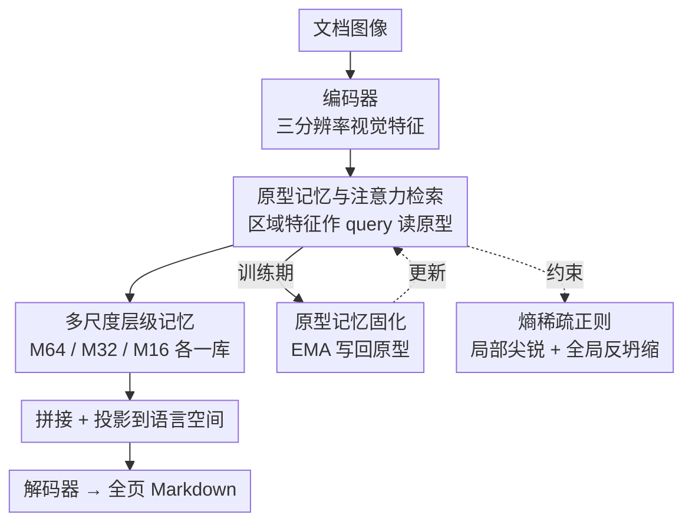

# DREAM: Document Recognition with Explicit Adaptive Memory

**会议**: CVPR 2026  
**论文**: [CVF Open Access](https://openaccess.thecvf.com/content/CVPR2026/html/Zhao_DREAM_Document_Recognition_with_Explicit_Adaptive_Memory_CVPR_2026_paper.html)  
**代码**: https://github.com/TianqiZhao-THU/DREAM  
**领域**: 文档识别(OCR) / 多模态VLM  
**关键词**: 原型记忆, 文档识别, 交叉注意力, EMA固化, 即插即用

## 一句话总结
DREAM 给文档识别模型挂了一块「显式原型记忆」——把训练语料里反复出现的版面结构和书写风格（页边、斜排文字、表格线…）压缩成一组可检索的原型向量，区域特征用交叉注意力去稀疏地「读」这些原型、训练时再用 EMA「写」回去，作为非参数化的结构知识拼进视觉特征喂给解码器，在 Fox / DreamDoc / SCUT 手写数据集上以 0.6B 参数超过了数十倍体量的大模型。

## 研究背景与动机
**领域现状**：当前文档解析与识别的主流是大多模态模型（LMM，如 GOT、Monkey、InternVL、DeepSeek-VL），它们把文本、版面、视觉信号统一建模，end-to-end 直接吐 Markdown，效果很强。

**现有痛点**：这些模型是彻头彻尾的黑箱参数模型——所有知识都隐式地塞在网络权重里。这带来三个具体问题：一是**不可解释**，没法分辨究竟是哪个空间因素或风格因素在贡献识别结果；二是**表示能力直接绑死在参数量上**，哪怕训练数据很充足，想提升表示能力也只能堆参数；三是**扩展更新昂贵**，遇到新风格、新领域文档就得 fine-tune，缺一个能快速扩充知识的非参数记忆机制。

**核心矛盾**：文档区域的视觉表示天然被两类信息「污染」——文字本身的语义，外加与语义共现的版面结构（页眉页脚、多栏、表格、图文混排）和视觉风格（倾斜、模糊、字号变化、边缘过渡）。纯参数化模型没有显式机制把这些加性因素拆开，所以一碰到复杂/没见过的版面就不稳。

**切入角度**：作者的关键观察是——文档不同于自然图像，它由**有限的、反复出现的结构模式**支配，这种内在规律性使它天然适合做原型聚类。既然版面/风格是「有限套路」，就可以学一组原型把它们显式存下来。

**核心 idea**：用一块「显式、自适应、多尺度的原型记忆」给识别模型补上语料级（corpus-level）的非参数结构知识——并从数学上证明 GMM 的后验责任度可以被交叉注意力精确表示，从而把「检索记忆」实现成一个可学习的注意力读写机制。

## 方法详解

### 整体框架
DREAM 是一个**即插即用模块**，插在任意 encoder-decoder 文档识别架构的编码器与解码器之间。编码器吐出多分辨率的视觉 token，每个分辨率对应一个独立的原型记忆库；区域特征作为 query 去注意力地「读」原型，读到的结构因子和原始视觉特征拼接、投影到语言嵌入空间后送进解码器；训练时同一注意力权重还会把特征「写」回原型（EMA），让原型逐步聚合高频模式，整套读写都受熵稀疏正则约束。把这块模块插到基于 GOT（ViT-Det 编码器 + 0.5B Qwen 解码器）的文档模型上，就得到主模型；同样的模块也能插到 ResNet+Transformer 的手写行识别模型上。

### 关键设计

**1. 原型记忆 = GMM 中心，检索 = 交叉注意力（理论等价 + 读取融合）**

痛点直指「视觉表示被结构/风格因素纠缠、无显式机制拆解」。DREAM 把局部区域抽取的特征 token $\mathbf{x}$ 建模成若干高斯子分量的加权混合（GMM）：$p(\mathbf{x})=\sum_{m=1}^{M}\pi_m\,\mathcal{N}(\mathbf{x}\mid\boldsymbol{\mu}_m,\boldsymbol{\Sigma}_m)$，其中每个原型就是某个子分布的均值 $\boldsymbol{\mu}_m$，对应一种高频版面或风格模式。检索一个原型的权重被定义为它的「责任度」，即后验概率 $r_m(\mathbf{x})=p(z{=}m\mid\mathbf{x})$。作者把协方差近似成各向同性 $\sigma^2\mathbf{I}$，取对数后责任度的打分函数化简为 $s_m(\mathbf{x})=\frac{1}{\sigma^2}\boldsymbol{\mu}_m^\top\mathbf{x}-\frac{1}{2\sigma^2}\lVert\boldsymbol{\mu}_m\rVert^2+\log\pi_m+C$，于是 $r_m(\mathbf{x})=\mathrm{softmax}_m(s(\mathbf{x}))$。

关键一步在于：带 bias 的交叉注意力 $\mathrm{CA}(\mathbf{q},\mathbf{k},\mathbf{v})=\mathrm{softmax}\!\left(\frac{\mathbf{q}W_qW_k^\top\mathbf{k}^\top}{\sqrt{D}}+B\right)(\mathbf{v}W_v)$，若令区域特征作 query（$\mathbf{q}=\mathbf{x}$）、原型均值同时作 key 和 value（$\mathbf{k}_m=\mathbf{v}_m=\boldsymbol{\mu}_m$），则注意力权重 $\alpha_m(\mathbf{x})$ 与上面的责任度 softmax 形式完全同构——只要存在可学习的 $W_q,W_k,B$ 满足 $\frac{\mathbf{x}^\top W_q^\top W_k\boldsymbol{\mu}_m}{\sqrt{D}}\approx\frac{1}{\sigma^2}\mathbf{x}^\top\boldsymbol{\mu}_m$ 且 $B_m\approx\log\pi_m-\frac{1}{2\sigma^2}\lVert\boldsymbol{\mu}_m\rVert^2$，注意力权重就是责任度的可学习逼近。这给「用注意力检索记忆」提供了概率论依据，而非拍脑袋设计。读出的记忆 $\mathrm{M}(\mathbf{x})$ 是所有原型按注意力权重的线性组合，再与原特征拼接、投影后入解码器：$\tilde{\mathbf{x}}=\mathrm{Proj}\,[\mathbf{x}\oplus\mathrm{M}(\mathbf{x})]$。这样解码器拿到的是「视觉特征 + 显式结构上下文」，而非纠缠在一起的混合表示。

**2. 原型记忆固化：注意力路由 + EMA 平滑写入**

光能读还不够，原型本身需要在训练中不断聚合高频模式。作者要求写入满足两点：**可微寻址**——每个 token 按自己对各原型的责任度自动选写入目标；**平滑更新**——逐步更新以避免灾难性遗忘。于是复用读取时的同一套注意力权重 $\alpha_m(\mathbf{x})$ 做路由：对一个 batch 的特征 $\{\mathbf{x}_{b,n}\}$，按权重聚合得到每个原型的写入增量 $\Delta\boldsymbol{\mu}_m=\sum_{b}\sum_{n}\alpha_m(\mathbf{x}_{b,n})\,\mathbf{x}_{b,n}$，再用动量式 EMA 更新：

$$\boldsymbol{\mu}_m^{(t+1)}=(1-\eta_t)\,\boldsymbol{\mu}_m^{(t)}+\eta_t\,\Delta\boldsymbol{\mu}_m,\quad \eta_t=\eta_0\,e^{-\kappa t}$$

更新率 $\eta_t$ 随训练步指数衰减，前期快速塑形、后期稳定收敛；分布式训练时写入增量跨设备平均以保证全局一致。这条「读写共享注意力」的设计让记忆既是被检索的对象、又是被监督信号间接塑形的载体，整体可端到端训练。

**3. 多尺度层级记忆：粗中细三库各司其职**

真实文档是多尺度层级结构：同一区域粗看是表格、细看是被竖线分隔的文字，单层记忆没法同时兼顾语义、结构、风格。DREAM 因此在三个空间分辨率上各建一个独立原型库——$M^{(64)}$（对应原图 64×64 像素 patch）捕捉语义级全局版面，$M^{(32)}$ 建模中层结构模式，$M^{(16)}$ 表示细粒度视觉风格。每个尺度 $s$ 的特征 $\mathbf{x}^{(s)}$ 在各自记忆库里独立读写，读出结果下采样对齐到最终编码器输出后拼接投影：$\tilde{\mathbf{x}}=\mathrm{Proj}[\mathbf{x}\oplus_{s}\mathrm{M}^{(s)}(\mathbf{x}^{(s)})]$。对手写行识别这种极端长宽比（>12:1）的输入，方形多尺度记忆失效，作者改用一套**跨记忆自注意力**让原型能跨整行建模全局风格与结构。

**4. 熵稀疏正则：局部尖锐 + 全局反坍缩**

要让 2048 个原型槽学到「有代表性且彼此区分」的中心，必须鼓励每个 token 只与少数原型交互——否则注意力会糊成一片或全挤到几个槽上（坍缩）。作者在注意力分布上加熵正则，分两项。**局部熵损失**让单个 token 的注意力分布更尖锐，只激活少量原型：$\mathcal{L}_{\text{local\_entropy}}=\mathbb{E}_{b,n}\!\left[-\sum_{m}\alpha_{b,n,m}\log\alpha_{b,n,m}\right]$。但只压局部熵会导致所有 token 一起坍缩到极少数原型，因此再加**全局负熵损失**，用 batch/空间位置上的平均注意力 $\mathbb{E}_{b,n}[\alpha_{b,n,m}]$ 计算其负熵，鼓励原型使用率在整体上保持均衡：$\mathcal{L}_{\text{global\_neg\_entropy}}=-\sum_{m}\mathbb{E}_{b,n}[\alpha_{b,n,m}]\log\mathbb{E}_{b,n}[\alpha_{b,n,m}]$。两者相加构成稀疏正则 $\mathcal{L}_{\text{sparse}}$，这一对「个体要稀疏、群体要分散」的张力正是消融里最关键的一环（见下）。

### 损失函数 / 训练策略
总目标把识别交叉熵与多尺度稀疏正则相加：$\mathcal{L}=\mathcal{L}_{\text{CE}}+\lambda\sum_s\mathcal{L}^{(s)}_{\text{sparse}}$，$\lambda=0.1$。原型数 $M=2048$，$\eta_0=1\times10^{-5}$。文档模型从 GOT 预训练 checkpoint 初始化，采用**部分冻结**——视觉编码器冻结，只训投影层、多尺度记忆模块和解码器；AdamW，学习率 $2\times10^{-5}$，8 张昇腾 910B、batch size 2。推理时记忆切到只读快照模式，注意力权重显式指出激活了哪些原型，整套机制天然可解释。

## 实验关键数据

### 主实验
在 Fox 数据集（212 页中英混合长文档）上，DREAM 仅用 0.6B 参数就超过了 7B~100B+ 的大模型：

| 数据集/语言 | 方法 | 参数 | Edit Dist↓ | F1↑ | BLEU↑ |
|------|------|------|-----------|------|-------|
| Fox-EN | Vary | 7B | 0.092 | 0.918 | 0.885 |
| Fox-EN | Qwen-VL-Plus | >100B | 0.096 | 0.931 | 0.893 |
| Fox-EN | Baseline | 0.6B | 0.107 | 0.925 | 0.896 |
| Fox-EN | **DREAM** | 0.6B | **0.082** | **0.939** | **0.909** |
| Fox-CN | Baseline | 0.6B | 0.112 | 0.944 | 0.753 |
| Fox-CN | **DREAM** | 0.6B | **0.101** | **0.964** | **0.767** |

在自建 DreamDoc 测试集（108 页，七类版面）上对比 GOT 与 Baseline：

| 方法 | Edit Dist↓ | F1↑ | BLEU↑ | METEOR↑ |
|------|-----------|------|-------|---------|
| GOT | 0.473 | 0.744 | 0.354 | 0.657 |
| Baseline | 0.254 | 0.868 | 0.731 | 0.815 |
| **DREAM** | **0.248** | **0.869** | **0.735** | **0.819** |

手写行识别（即插即用到 ResNet+Transformer）也涨点：SCUT-HCCDoc 上 AR 从 Yao et al. 的 92.78% → **93.36%**；SCUT-EPT 上 78.48% → **78.82%**，验证模块跨任务通用。

### 消融实验
在 Fox 上逐项拆解（Edit Distance 取 EN）：

| 配置 | EN Edit↓ | EN F1↑ | 说明 |
|------|---------|--------|------|
| Baseline | 0.107 | 0.925 | 无记忆 |
| 单尺度记忆 + $\mathcal{L}_{\text{sparse}}$ | 0.097 | 0.941 | 缺多尺度 |
| 多尺度记忆（无正则） | 0.096 | 0.919 | 缺稀疏约束 |
| 多尺度 + 仅 $\mathcal{L}_{\text{local\_entropy}}$ | 0.087 | 0.926 | 缺反坍缩项 |
| **多尺度 + $\mathcal{L}_{\text{sparse}}$（Full）** | **0.082** | **0.939** | 完整模型 |

### 关键发现
- **全局反坍缩项是命门**：去掉 $\mathcal{L}_{\text{global\_neg\_entropy}}$（只留局部熵）后 CN Edit Distance 反弹到 0.136、明显劣于完整模型，作者归因于注意力坍缩——只压局部稀疏会让所有 token 挤到极少数原型，必须有全局均衡项托底。
- **多尺度 > 单尺度**：单尺度记忆已优于 Baseline，但叠加多尺度后中英两侧普遍再涨，印证文档的层级结构确实需要粗/中/细三库分工。
- **可解释性可视化**：在 $M^{(32)}$ 上对每个 patch 取最大响应原型上色，发现表格边框沿线的 cell 共享同一主导原型（紫）、空白区域激活另一原型（黄），说明原型确实学到了可区分的结构模式，而非黑箱。

## 亮点与洞察
- **「GMM 责任度 ≡ 带 bias 交叉注意力」的等价证明**最让人「啊哈」：它把一个直觉上的「用注意力查记忆」升格成有概率解释的操作，原型 = 高斯均值、注意力权重 = 后验责任度，读写都落在同一套数学框架里，这种「先有原理再有模块」的思路可迁移到其他需要可解释检索的任务。
- **读写共享同一注意力**是省事又自洽的设计：检索用的 $\alpha_m$ 直接复用为 EMA 写入的路由权重，无需额外写头，且天然满足「可微寻址」。
- **语料级（corpus-level）记忆**区别于大多数视觉记忆网络只在单样本内做上下文——把整个训练集的高频版面/风格沉淀成跨样本可复用的非参数知识，这正契合「文档由有限套路支配」的先验。
- 0.6B 打过 100B+ 体现了非参数记忆的杠杆：表示能力不再死绑参数量，给小模型 + 外挂知识的路线提供了一个文档场景的实证。

## 局限与展望
- **EMA 更新偏慢**（作者承认）：动量式写入对新数据分布的适应速度有限，难以快速适配新风格/新领域，与「灵活扩展」的初衷有张力。
- **融合机制仍是黑箱**：检索来的原型确实提升了性能，但解码器内部究竟如何整合利用这些表示尚不清楚——可解释性只到「激活了哪些原型」，没到「解码器怎么用它」。
- 自己看：主实验在 DreamDoc 上相比强 Baseline 的增量很小（Edit 0.254→0.248、F1 0.868→0.869），更大的增益主要来自 Fox 和手写集；模块的收益似乎依赖测试分布与原型库覆盖的版面是否吻合，跨域稳健性仍待更系统的验证。原型数固定 2048、各向同性协方差近似等也未做敏感性分析。
- 展望：作者计划引入短期/长期记忆协同——对短期记忆做动态聚类，逐步固化成更稳健的长期原型，以缓解 EMA 慢适应问题。

## 相关工作与启发
- **vs GOT / Monkey / InternVL 等 LMM**：它们把版面知识隐式压进权重、表示能力绑死参数量；DREAM 在编码器与解码器之间挂一块显式非参数记忆，结构知识可检索、可视化、可扩展，且以 0.6B 反超数十倍体量模型。
- **vs Neural Turing Machine / DNC 等外部记忆**：经典外部记忆做通用读写但缺概率解释；DREAM 把记忆专门实例化为 GMM 原型、并证明其检索等价于注意力，针对文档「有限结构模式」的先验更对症。
- **vs 视频领域的记忆网络（MovieChat+ 等）**：后者多在单样本/单序列内建模时序依赖；DREAM 强调跨样本的语料级记忆，是把记忆从「样本内上下文」推到「数据集级原型抽象」。

## 评分
- 新颖性: ⭐⭐⭐⭐ 首次把原型记忆引入文档识别，并给出 GMM 责任度与交叉注意力的等价证明，原理扎实
- 实验充分度: ⭐⭐⭐⭐ 覆盖文档+手写两任务四数据集、消融定位到反坍缩项，但 DreamDoc 增量偏小、缺原型数/协方差等敏感性分析
- 写作质量: ⭐⭐⭐⭐ 动机—理论—模块链条清晰，公式推导完整，可视化直观；个别公式排版有 OCR 噪声
- 价值: ⭐⭐⭐⭐ 即插即用、跨架构通用，为「小模型 + 外挂可解释记忆」提供了文档场景的有力实证

<!-- RELATED:START -->

## 相关论文

- [\[CVPR 2026\] Smart Replay: Adaptive Scheduling of Memory Rehearsal for Computational Resource-Aware Incremental Learning](smart_replay_adaptive_scheduling_of_memory_rehearsal_for_computational_resource-.md)
- [\[CVPR 2026\] Adaptive Data Augmentation with Multi-armed Bandit: Sample-Efficient Embedding Calibration for Implicit Pattern Recognition](adaptive_data_augmentation_with_multi-armed_bandit_sample-efficient_embedding_ca.md)
- [\[AAAI 2026\] Axis-Aligned Document Dewarping](../../AAAI2026/others/axis-aligned_document_dewarping.md)
- [\[CVPR 2026\] Confusion-Aware Spectral Regularizer for Long-Tailed Recognition](confusion-aware_spectral_regularizer_for_long-tailed_recognition.md)
- [\[CVPR 2026\] Coupling Liquid Time-Constant Encoders with Modern Hopfield Memory](coupling_liquid_time-constant_encoders_with_modern_hopfield_memory.md)

<!-- RELATED:END -->
