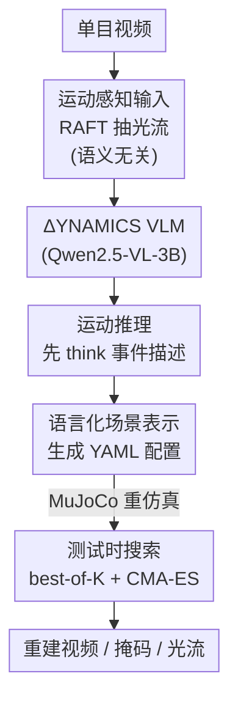

# Dynamics: Language-Based Representation for Inferring Rigid-Body Dynamics From Videos

**会议**: CVPR 2026  
**论文**: [CVF Open Access](https://openaccess.thecvf.com/content/CVPR2026/html/Kao_Dynamics_Language-Based_Representation_for_Inferring_Rigid-Body_Dynamics_From_Videos_CVPR_2026_paper.html)  
**代码**: https://iandrover.github.io/2026_dynamics/ (项目页)  
**领域**: 视频理解 / 3D视觉（物理推断 video-to-simulation）  
**关键词**: 刚体动力学, 视觉语言模型, 结构化文本表示, 光流, 测试时搜索

## 一句话总结
本文把"从单目视频反推刚体物理状态与参数"重新定义成一个**文本生成**问题：训练一个 VLM（ΔYNAMICS，基于 Qwen2.5-VL-3B）直接吐出一段描述整个场景的 YAML 配置（几何 / 初速 / 材料 / 相机 / 重力），交给 MuJoCo 重新仿真，并辅以"先用自然语言推理运动事件、再生成配置"和"光流输入"两招提升泛化，在 CLEVRER 上分割 IoU 比主流 VLM 高 7 倍，并能迁移到 235 段真实视频。

## 研究背景与动机

**领域现状**：从视频里恢复物体的物理属性（摩擦、弹性、初速、相机位姿）是物理感知与仿真的基础。以往工作（滑动盒子、台球、抛体等）在受限场景里估计一组固定长度的物理参数向量。

**现有痛点**：这类方法有两个硬伤。一是**表示僵硬**——它们假定一个特定物理系统、特定物体类型、固定长度的参数向量（比如"球"或"盒子"专用），换个物体数量或交互类型就不适用；二是**假设固定相机**——大多预设已知或固定的相机位姿，无法适应真实世界里变化的视角和物距。结果就是只能解决 video-to-simulation 问题里很窄的一个子集。

**核心矛盾**：问题的根在于**场景该如何参数化**。回归一个定长数值向量天然无法容纳"任意数量物体、任意交互类型"的开放场景，于是表示能力和泛化性互相掐死。

**本文目标**：要一个统一表示，既能描述单物体也能描述多物体场景，既覆盖滚动/滑动/弹跳/碰撞各种运动，还能把相机参数一起估出来，并且能从合成数据迁移到真实视频。

**切入角度**：作者观察到，结构化图形程序（SVG、TikZ、MuJoCo XML/JSON）早已被用来表示视觉内容，而语言天然是可变长、可读、可编辑、可组合的。那把物理场景写成一段**文本配置**，不就同时解决"变长"和"可解释"了吗？

**核心 idea**：用**语言作为刚体动力学的统一表示**——不再回归定长向量，而是让 VLM 生成一段结构化 YAML 场景配置，直接喂给物理引擎仿真。

## 方法详解

### 整体框架

ΔYNAMICS 的核心是把"视频→物理参数"换成"视频→一段可被物理引擎直接执行的文本"。形式化地说：给定视频 $X$，模型 $F_\omega$ 预测配置 $c = F_\omega(X)$，再交给物理引擎 $S$ 重建序列 $\hat{X} = S(c)$，训练目标是让 $\hat{X}$ 忠实复现 $X$ 里观察到的运动。

整条管线分训练侧和推理侧。**训练侧**：采样一份 YAML 场景配置 → 转成 MuJoCo XML 渲染出合成视频 → 用 RAFT 抽光流 → 训练 ΔYNAMICS 在给定光流时生成回这份配置（共 40 万条合成场景）。**推理侧**：真实视频先抽光流，VLM 生成配置，再用 MuJoCo 重仿真出 RGB / 分割掩码 / 光流来评估。模型有两个变体：基础版直接出配置；运动推理版先吐一段 `<think>` 运动事件描述、再吐 `<answer>` 配置。推理后还可叠加测试时搜索进一步精修。

### 关键设计

**1. 语言化场景表示：把定长向量换成一段 YAML 配置**

针对"定长参数向量装不下开放场景"这个根本痛点，作者把物理估计从**数值回归**改成**符号生成**：模型自回归地输出一段 YAML 文本，编码整个场景——物体几何（半径/高/宽/深/质量）、初始状态（位置、线速度、角速度、四元数朝向）、材料（滚动/滑动摩擦、阻尼）和全局参数（相机高度/俯仰角/FOV、重力）。场景由三种基本体（球、圆柱、盒子）拼装，足以覆盖网球、易拉罐、马克杯、书、木箱等常见刚体的弹/滚/滑/撞。配置长度随物体数自然伸缩——比如 4 个盒子场景就是 $20\times4$（每盒 20 个参数）$+\,3$（相机）$+\,1$（重力）$= 84$ 个待估参数。

为什么有效：文本表示天生可变长、可读、可编辑，支持反事实分析；而且把仿真当文本生成后，可以直接端到端训练一个 VLM、无需多阶段工程，目标格式简单写成 `<answer> configuration </answer>` 即可。这是全文的立身之本——把"物体数量/类型/相机"全塞进同一个生成接口。

**2. 运动推理：先用自然语言描述运动事件，再生成配置**

光看光流直接回归配置容易"知其然不知其所以然"。作者让模型先生成一段关于动力学的自然语言描述、再输出配置，即 `<think> description </think> <answer> configuration </answer>`。这段描述的监督信号来自仿真留下的痕迹（state history、contact history、分割掩码）：用规则函数从这些 trace 里挖出三类关键事件——**可见性**（物体何时进/出相机视野）、**运动变化**（何时停止滚动/滑动）、**碰撞**（何时触地或撞到别的物体），再把事件填进预定义模板，生成结构化的运动描述当作训练目标。

为什么有效：在预测参数前先把"谁在 t=0.13s 撞了谁、谁在 t=0.43s 停下"这类轨迹/交互讲清楚，模型对底层动力学的表示更丰富，后续参数估计更准。实验里它在跨引擎和真实迁移上都稳定优于不带推理的版本——直觉是这段中间表示给采样提供了"更结构化、物理更合理"的落脚区，让搜索探索到更宽但更靠谱的解集，而非漂进不可行的参数空间。

**3. 运动感知输入：用光流替代 RGB，做语义无关的输入**

原始 RGB 里塞满了和运动无关的视觉语义（纹理、背景、外观），对一个只关心"怎么动"的模型是混淆因子。作者改用 RAFT 算出的光流场作为输入——它对视觉语义和外观不敏感，只给出显式的运动线索。实现上把光流转成每通道一个 2D 数组（即 RGB 化的光流图），无需改 VLM 架构就能喂进去。

为什么有效：合成数据上光流输入把全序列分割 IoU 从 0.19 提到 0.24（相对 +26%），并大幅压低光流 EPE；对象组成准确率在加光流后冲到 97%。代价是个别情况 RGB 版在阻尼估计上略好（因为棋盘地面提供了估阻尼的额外视觉线索），但整体上"丢掉外观、只留运动"对跨域泛化是净收益。

**4. 测试时搜索：best-of-K 采样 + CMA-ES 演化，免标注地精修**

贪心解码不保证落在模型输出分布里质量最优的那个参数集（最优解常在长尾）。作者上三种互补的测试时策略，且都**不需要目标域标注**。其一是 **best-of-K 采样**：每个样例用温度 0.1、top-p 0.9 生成 $N=32$ 个配置，报告 Best@32。其二是**偏好优化**：用前向渲染和输入视频的相似度（如掩码 IoU）当隐式奖励来选配置（细节在附录）。其三是 **CMA-ES 演化搜索**：从 Best@32 样本初始化，固定物体类型、优化尺寸/初速/物理参数/相机位姿，适应度函数为 $\text{IoU} - \text{EPE}$（最大化分割 IoU、最小化光流端点误差），种群 128、迭代 100 轮。

为什么有效：采样靠多次尝试触达长尾里更准的解；CMA-ES 在不可微的黑盒物理引擎上做非凸优化，配上 Best@32 的好初始化，拿到全序列对齐的最高精度。这套机制让一个固定权重的模型在推理时还能继续"找补"，无需任何目标域监督。

### 损失函数 / 训练策略

训练就是标准的自回归负对数似然。设数据集 $D=\{(X_i, c_i)\}$，配置 $c$ 被 token 化，似然按 token 自回归分解：

$$p_\omega(c \mid X) = \prod_{t=1}^{|c|} p_\omega(c_t \mid X, c_{<t})$$

优化目标为最小化 NLL：

$$\mathcal{L}_{\text{VLM}} = -\sum_{(X,c)\in D} \log p_\omega(c \mid X)$$

实现：基座 Qwen2.5-VL-3B，从 1 秒 / 30 FPS 视频均匀采 10 帧，全参微调 10 个 epoch（bfloat16 混合精度，8×A100-40G），AdamW，学习率 $2\times10^{-5}$，weight decay 0.01，全局 batch 128。两个变体（纯配置 / 带运动推理）只是目标文本格式不同。数据侧 40 万条 MuJoCo 场景，过滤掉初始重叠、超过一个物体始终出画、以及物体过小（总面积 < 8000 像素）的场景，并刻意 hold out 四种四物体组合做组合泛化测试。

## 实验关键数据

### 主实验（合成数据，分布内）

| 方法 | 输入 | 对象组成 Acc↑ | 首帧 IoU↑ | 全序列 IoU↑ | 全序列 EPE↓ |
|------|------|------|------|------|------|
| ViViT（非 VLM 回归） | 光流 | 0.00 | 0.07 | 0.06 | 8.90 |
| Qwen2.5-VL-7B | RGB | 0.27 | 0.03 | 0.03 | 16.33 |
| Claude-4-Sonnet | RGB | 0.45 | 0.09 | 0.07 | 11.07 |
| ΔYNAMICS | RGB | 0.60 | 0.52 | 0.32 | 19.66 |
| ΔYNAMICS | 光流 | 0.97 | 0.88 | 0.49 | 9.24 |
| ΔYNAMICS + 运动推理 | 光流 | **0.99** | **0.91** | **0.54** | **8.52** |

主流 VLM（含 Claude-4）顶多大致认出物体组成，重建轨迹和估参数都很差（IoU ≤0.09、EPE >11）。ΔYNAMICS 即便用 RGB 也已全面领先；换成光流后对象组成冲到 97%、EPE 大降；再加运动推理把全序列 IoU 推到 0.54。RGB 版 EPE 偏高是因为预测初态偶有穿模，MuJoCo 施加大的纠正接触力导致突兀运动、抬高了光流误差。

### 跨引擎 / 真实世界与测试时搜索

| 设置 | 配置 | 首帧 IoU↑ | 全序列 IoU↑ | 全序列 EPE↓ |
|------|------|------|------|------|
| CLEVRER（Blender，跨引擎零样本） | 主流 VLM 最佳(Claude-4) | 0.03 | 0.04 | — |
| CLEVRER | ΔYNAMICS+推理(光流) | 0.67 | 0.30 | — |
| CLEVRER | +Best@32 | 0.76 | 0.38 | 5.17 |
| CLEVRER | +CMA-ES | 0.62 | **0.66** | **0.11** |
| 真实视频(235 段) | ΔYNAMICS+推理 | 0.54 | 0.29 | 0.58 |
| 真实视频 | +Best@32 | **0.72** | 0.41 | 0.46 |
| 真实视频 | +CMA-ES | 0.57 | **0.65** | **0.36** |

跨引擎从 MuJoCo 训练零样本迁到 Blender 渲染的 CLEVRER，ΔYNAMICS 把全序列 IoU 从主流 VLM 的 0.04 拉到 0.30，加测试时搜索后 CMA-ES 把全序列 IoU 顶到 0.66、EPE 压到 0.11。真实 235 段视频上同样成立：运动推理把 IoU 提 12%、EPE 提 13%，Best@32 进一步精修，CMA-ES 给出最佳全序列对齐。

### 复杂场景鲁棒性（OOD 物体数）

| 物体数 | 模型 | 首帧 IoU↑ | 全序列 IoU↑ |
|------|------|------|------|
| 4（含 held-out 组合） | +运动推理 | 0.89 | 0.54 |
| 5（超训练物体数） | +运动推理 | 0.88 | 0.54 |
| 6（超训练物体数） | +运动推理 | 0.81 | 0.52 |

### 关键发现
- **光流输入贡献最大**：从 RGB 换光流，对象组成 0.60→0.97、首帧 IoU 0.52→0.88，是单招涨幅最猛的设计；运动推理在此基础上再稳定加一档。
- **CLEVRER 上 best-of-32 把首帧 IoU 从 0.30 提到 0.38（+27%）**，运动推理变体的采样收益明显大于 vanilla 版（后者只 0.24→0.28，+14%），印证"中间推理给采样提供了更靠谱的探索区域"。
- **CMA-ES 是全序列精度的天花板**：靠 Best@32 的好初始化 + 黑盒演化，在跨引擎和真实视频上都拿到最低 EPE / 最高全序列 IoU，但它需要重仿真做适应度评估、成本不低。
- **泛化平滑**：训练只到 4 物体，测到 5、6 物体时 IoU 只缓慢下降（0.54→0.52），说明语言表示+运动推理对未见复杂度有韧性。

## 亮点与洞察
- **把物理反演变成"写一份可执行的场景脚本"**：YAML 配置既是模型输出、又能直接喂 MuJoCo 跑仿真，天然闭环、可解释、可编辑（附录还演示了物理合理的视频编辑），这是比回归定长向量优雅得多的接口设计。
- **用仿真 trace 自动造"运动推理"监督**：从 state/contact/分割 trace 里规则化地挖可见性/运动变化/碰撞事件、填模板生成 think 文本，等于免费造了一份 CoT 数据，这个"用引擎内部信息反向生成推理链"的思路可迁到任何带模拟器的任务。
- **光流当语义无关输入**：丢掉外观只留运动，既缩小合成↔真实的域差、又无需改 VLM 架构，是个低成本高回报的 trick。
- **测试时免标注精修**：用"重渲染和输入的相似度"当隐式奖励（IoU−EPE），让黑盒不可微引擎也能上 CMA-ES，把固定模型的长尾误差进一步压下去。

## 局限与展望
- **基本体只有球/圆柱/盒子三种**，复杂或不规则物体（论文真实数据里提到苹果等）只能近似，几何表达力受限。
- **依赖光流质量**：RAFT 抽不准（强遮挡、剧烈运动模糊、低纹理）时输入就退化；真实视频的掩码/光流还要靠预训练模型做伪标注，误差会传导。⚠️ 阻尼估计上 RGB 版反而略好，说明纯光流丢掉的视觉线索对部分材料参数是有用的，单一模态并非全胜。
- **CMA-ES 成本高**：种群 128、迭代 100 轮，每次评估都要重仿真，实时性差；它带来的全序列 IoU 暴涨（0.30→0.66）也提示前馈模型本身的轨迹精度仍有较大缺口，靠搜索补。
- **相机模型受限**：相机固定放在 $(0,-2,h)$、只变俯仰、roll/yaw 置零，真实场景的一般 6-DoF 位姿尚未覆盖。

## 相关工作与启发
- **vs 传统物理参数估计（滑盒/台球/抛体）**：它们回归特定系统的定长向量、且假设固定相机；本文用语言表示统一了任意物体数/类型并把相机一起估，泛化面宽得多，代价是需要大规模合成数据训 VLM。
- **vs 结构化图形程序（SVG/TikZ/JSON 渲染）**：那一脉把图像/3D 场景翻成结构化文本交给图形引擎；本文把同一思想专门用到**视频里的运动动力学**，并补上运动推理这一中间表示。
- **vs 可微仿真/逐场景优化**：可微管线要预定义物理模型、要可微引擎、还得逐场景优化；本文不要可微引擎、不预设物理模型，用一个前馈 VLM 单次出整份配置，再用黑盒搜索可选精修。

## 评分
- 新颖性: ⭐⭐⭐⭐⭐ 把刚体物理反演整体重构成 VLM 生成可执行 YAML 的范式，接口和泛化都漂亮
- 实验充分度: ⭐⭐⭐⭐ 合成/跨引擎/真实三层评测 + 多种测试时策略消融扎实，但缺与传统物理估计方法的同台直比（作者称不可比）
- 写作质量: ⭐⭐⭐⭐ 动机—表示—推理—输入—搜索的逻辑清晰，图表完整
- 价值: ⭐⭐⭐⭐ 给"感知↔仿真"搭了条语言桥，对具身/物理推理有启发，但实时性与基本体覆盖仍待扩展

<!-- RELATED:START -->

## 相关论文

- [\[CVPR 2026\] MooCap: A Multi-View Benchmark for Cow-Object-Human Interaction and Behavior Dynamics](moocap_a_multi-view_benchmark_for_cow-object-human_interaction_and_behavior_dyna.md)
- [\[ICML 2026\] Learning Permutation-Invariant Macroscopic Dynamics](../../ICML2026/others/learning_permutation-invariant_macroscopic_dynamics.md)
- [\[AAAI 2026\] Deviation Dynamics in Cardinal Hedonic Games](../../AAAI2026/others/deviation_dynamics_in_cardinal_hedonic_games.md)
- [\[NeurIPS 2025\] Normalization in Attention Dynamics](../../NeurIPS2025/others/normalization_in_attention_dynamics.md)
- [\[AAAI 2026\] A Phase Transition for Opinion Dynamics with Competing Biases](../../AAAI2026/others/a_phase_transition_for_opinion_dynamics_with_competing_biase.md)

<!-- RELATED:END -->
