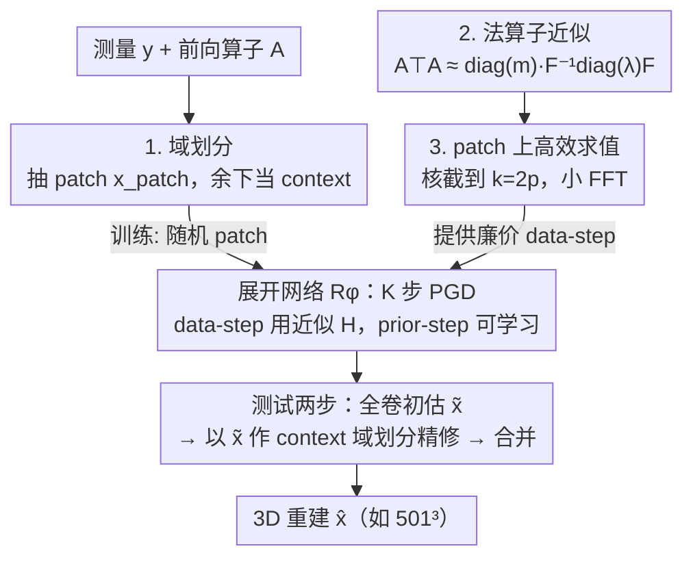

# Efficient Unrolled Networks for Large-Scale 3D Inverse Problems

**会议**: CVPR 2026  
**论文**: [CVF Open Access](https://openaccess.thecvf.com/content/CVPR2026/html/Vo_Efficient_Unrolled_Networks_for_Large-Scale_3D_Inverse_Problems_CVPR_2026_paper.html)  
**代码**: https://github.com/romainvo/efficientunrolling  
**领域**: 图像重建 / 逆问题  
**关键词**: 展开网络, 逆问题, 域划分, 法算子近似, 3D重建  

## 一句话总结
针对展开网络（unrolled network）在 3D 逆问题里因为「网络步必须在整卷全分辨率上跑」而显存爆炸的痛点，本文用**域划分**（只重建一个 patch、其余当已知 context）+ **法算子 $A^\top A$ 的对角-循环矩阵近似**两招，让带前向算子的展开网络第一次能在单卡上训练并部署到 $501^3$ 体素的稀疏视角 CBCT 与多线圈加速 MRI，并取得 SOTA。

## 研究背景与动机

**领域现状**：线性逆问题 $y = Ax^* + \varepsilon$（CT、MRI、遥感等）的深度学习解法主要分两类。一类是**后处理网络**：从一个快速低质重建（如伴随 $A^\top y$ 或伪逆 $A^\dagger y$）直接映射到真值，简单、能用 patch 训练所以好扩到大体积，但完全不用前向算子 $A$ 的知识，重建容易不满足数据一致性。另一类是**展开网络（unrolling）**：把优化算法（如近端梯度 PGD）的固定 $K$ 次迭代展开成网络，把先验步换成可学习模块，端到端训练，因为把 $A$ 嵌进了架构，性能通常最好。

**现有痛点**：展开网络的迭代式 $x_{k+1} = D_\phi\big(x_k - \eta \nabla_x d(Ax_k, y)\big)$ 里，data-consistency 步要在**整卷**上算 $Ax_k$，因此网络先验步 $D_\phi$ 也必须在全分辨率上前向+反传。论文 Fig.1 给出关键观察：**瓶颈在网络步**——它的显存随体积 $N^3$ 迅速爆炸，而 data-step 即使在高分辨率下也还能扛。2D 问题单卡能训，但 3D 上一个全分辨率前向就让显存难以承受。Deep equilibrium 训练能把显存降到单次前向的量级，但**每次迭代仍要在整卷上评估整个网络**，对 $\approx 512^3$ 的真实 3D 问题在单卡上依旧不可行。

**核心矛盾**：后处理网络能切 patch 扩大规模，但展开网络不能——因为它的 data-step 把所有体素耦合在一起（尤其 CBCT 的锥束几何，前向算子不存在「坐标友好」的分块结构 $A = \mathrm{blkdiag}$），naive 切 patch 会破坏数据一致性。于是「用前向算子提升性能」和「能切 patch 扩展到大体积」这两件好事，在 3D 上无法兼得。

**本文目标**：让展开网络能在**任意大**的线性逆问题上训练和部署，且只用一张 GPU，同时不牺牲性能。拆成两个子问题——(1) 训练时如何把大问题切小以适配显存；(2) 切小之后 data-step 仍需全局算子，如何让它算得快。

**核心 idea**：用**域划分**把「只重建一个 patch、其余体素当作已知 context」变成一个等价的小尺度逆问题，从而像后处理那样切 patch 训练展开网络；再用**法算子 $A^\top A$ 的对角×循环矩阵近似**（FFT 可对角化），把切片后仍需的全局 data-step 算子换成廉价的 FFT 卷积，而且这个近似可以**不依赖任何任务数据**靠梯度下降拟合出来。

## 方法详解

### 整体框架

输入是测量 $y \in \mathbb{R}^m$ 和已知前向算子 $A \in \mathbb{R}^{m\times n}$，输出是重建体积 $\hat{x} \in \mathbb{R}^n$（如 $501^3$ 的 walnut CBCT 或多线圈 MRI 脑扫描）。整条流水线围绕「把全卷展开换成 patch 上展开」这一目标，由两个互补技术组合而成：

- **训练阶段**：把整卷分解成「待求 patch」+「已知 context」，只对 patch 跑 $K$ 步展开 PGD（设计 1）；展开里的 data-step 需要 $A^\top A$，用对角-循环近似 $H$ 代替（设计 2），并把这个近似限制到 patch 邻域上的小尺寸 FFT 高效求值（设计 3）。这样网络只在 $384^2$ / $8\times128^2$ 这种小 patch 上前向反传，显存可控。
- **测试阶段**：真值 context 不可得，于是两步走——先做一次「全卷初估」（data-step 在整卷算，先验步 $D_\phi$ 沿 patch 顺序逐块跑再拼），得到 $\tilde{x}$；再用 $\tilde{x}$ 当 context，对每个 patch 跑域划分子问题精修，最后合并。

### 关键设计

**1. 域划分：把「整卷重建」改写成「在已知 context 下补一个 patch」**

痛点很直接：展开网络的 data-step 把整卷体素耦合，无法像后处理那样朴素切 patch。本文的做法是把信号空间正交分解为两块 $\mathbb{R}^n = \mathbb{R}^p \oplus \mathbb{R}^q$（$q = n-p$），用选择算子 $S \in \mathbb{R}^{p\times n}$、$S_\perp \in \mathbb{R}^{q\times n}$ 抽出两部分。假设我们已经掌握真值里属于 $\mathbb{R}^q$ 的那部分 $x_{\text{context}} = S_\perp x^*$，只去恢复 patch $x_{\text{patch}} \in \mathbb{R}^p$，那么真值写成 $x^* = S^\top x_{\text{patch}} + S_\perp^\top x_{\text{context}}$。利用线性性，原线性系统 $y = Ax^*$ 就被改写成一个等价的小系统

$$\tilde{y} = \tilde{A}\,x_{\text{patch}}, \quad \tilde{A} = A S^\top, \quad \tilde{y} = y - A S_\perp^\top x_{\text{context}}.$$

也就是说，把 context 对测量的贡献从 $y$ 里减掉，剩下的就是只关于 patch 的逆问题。训练时像 patch-based 训练那样随机移动子空间 $\mathbb{R}^p$ 的位置（取矩形/立方体 patch），最小化 $L_{\text{PART}}(\phi) = \mathbb{E}_S\mathbb{E}_{x^*,y}\,\|\tilde{R}_\phi(\tilde{y}, \tilde{A}) - Sx^*\|_2^2$。关键在于：这套改写**不要求前向算子存在坐标友好的分块结构**，所以对 CBCT 这种「锥束几何让所有体素耦合、$A$ 无法天然按 patch 拆」的算子同样成立——这是它比传统块可分（block-separable）分解更通用的地方。

**测试时两步推理**：真实测试没有真值 context，本文用一个两段式过程绕过。第一步「初估」：不做域划分地跑一次展开 $\tilde{x} = R_\phi(y, A)$，其中 data-step 在整卷上算，但先验步 $D_\phi$ 沿 patch 顺序逐块评估再拼回，避免一次性在整卷上跑网络。第二步「精修」：把初估结果当 context，$x_{\text{context}} = S_\perp \tilde{x}$，对每个 patch 独立解 $\hat{x}_{\text{patch}} = \tilde{R}_\phi(\tilde{y}, \tilde{A})$（用同一个网络 $D_\phi$），合并得到最终 $\hat{x}$。实验观察到：CBCT 上这步精修能稳定提升质量，而 MRI 上初估 $\tilde{x}$ 已经够好、精修收益可忽略。

**2. 法算子近似：把 data-step 里的 $A^\top A$ 换成 FFT 可算的对角×循环近似**

域划分之后，子问题的 data-step 仍要算 $\tilde{A}^\top\tilde{A}\,x_{\text{patch}} = S A^\top A S^\top x_{\text{patch}}$，本质还是要碰全局法算子 $A^\top A$。梯度下降式 data-step 为 $h(x) = x - \eta(A^\top A)x + \eta A^\top y$，丢掉可预计算的常数项 $A^\top y$ 后，唯一要反复算的就是 $A^\top A x$（即便 data-step 是近端步，共轭梯度等主流解法的核心也仍是 $A^\top A$，所以聚焦它并不局限）。本文把 $A^\top A$ 近似成一个对角-循环乘积：

$$A^\top A \approx H = \mathrm{diag}(m)\, F^{-1}\mathrm{diag}(\lambda)\, F,$$

其中 $F, F^{-1}$ 是傅里叶/逆傅里叶变换，$\lambda \in \mathbb{C}^n$ 是 $A^\top A$ 对应卷积核的频率响应，$m \in \mathbb{R}^n$ 是空间域上的敏感度图/掩码。直觉是：若 $A$ 平移等变，则 $A^\top A$ 是卷积算子，可直接在傅里叶域对角化（$A^\top A x = F^{-1}\mathrm{diag}(\lambda)F x$）；外面再乘一个空间对角 $\mathrm{diag}(m)$ 就能覆盖非平移等变的算子（如 inpainting、CT 的笛卡尔重采样补偿）。对 CT，傅里叶切片定理保证每行前向算子对应频域一条径向线，恰是频域对角操作，$\mathrm{diag}(m)$ 解释成补偿 FFT 笛卡尔采样的重采样图。理论上可叠多个对角-循环因子提升表达力，但实验发现单因子（$N=1$）已足够好且最省算力。⚠️ 多线圈 MRI 的法算子 $A^\top A = \sum_c S_c^\top F^{-1}M^\top M F S_c$ 无法被该形式精确表示，作者改用 $H = \mathrm{diag}(m) F^{-1}\mathrm{diag}(\lambda)F\,\mathrm{diag}(m)$ 来近似，具体以原文为准。

这个设计最漂亮的一点是**拟合不需要任务数据**：在随机高斯向量上最小化 $\mathcal{L}(m,\lambda) = \mathbb{E}_{x\sim\mathcal{N}(0,I)}\|A^\top A x - H(m,\lambda)x\|_2^2$。利用标准高斯向量的性质，这个期望恰好等于残差的 Frobenius 范数平方 $\|A^\top A - H(m,\lambda)\|_F^2$。于是只要知道前向算子 $A$（可调用 $Ax$、$A^\top y$ 的 matrix-free 实现），就能用梯度下降把 $(m,\lambda)$ 拟合出来，**完全不碰训练样本**，在「算子已知但数据稀缺」时尤其有用。

**3. patch 上的高效法算子求值：把核截断到 $k = 2p$，只跑小 FFT**

光有近似还不够。把近似代回子问题，$\tilde{A}^\top\tilde{A}\,x_{\text{patch}} \approx S\,\mathrm{diag}(m)F^{-1}\mathrm{diag}(\lambda)F S^\top x_{\text{patch}}$，拆成三步会发现两处低效：(i) $S^\top x_{\text{patch}}$ 是把 $p$ 维 patch 零填充回 $n$ 维整卷；(ii) $F^{-1}\mathrm{diag}(\lambda)F$ 等价于一个**全卷尺寸 $n$ 的卷积**。也就是为算一个小 patch，又被迫回到整卷做 FFT，白白浪费。

关键观察：卷积的输入是个零填充的立方体，所以只要把卷积核限制到更小的尺寸 $k = 2p \ll n$，结果**依然精确**（边界外都是零，不影响 patch 区域）。于是写成

$$\tilde{A}^\top\tilde{A}\,x_{\text{patch}} \approx \mathrm{diag}(Sm)\, F_k^{-1}\mathrm{diag}(\lambda_k)\, F_k\, x_{\text{patch}},$$

其中 $F_k, F_k^{-1}$ 是限制到尺寸 $k$ 的（逆）傅里叶变换，$\lambda_k$ 是截断到 $k$ 的频率响应。这样 data-step 完全在 patch 邻域的小尺度上算，再也不用回到整卷。Tab.1 显示这一步把 data-consistency 的速度显著拉高（Walnut-CBCT 上 $4.19 \to 12.5$ step/s，约 3 倍）。设计 2 解决「能不能用 FFT 算 data-step」，设计 3 解决「在 patch 上算 FFT 还要不要回整卷」，二者合起来才让域划分真正省下显存又省时间。

### 损失函数 / 训练策略
展开网络用绑定权重（tied-weights），MC-MRI 取 $K=5$ 次迭代、CBCT 取 $K=3$ 次。骨干统一用 DRUNet（残差 UNet 式卷积网络，2D 版 36.2M 参数、3D 版约 96.5M）。CBCT 上本文方法用 batch size 1 训练（其余方法用 4），靠梯度累积 4 步对齐有效 batch。法算子近似的 $(m,\lambda)$ 在随机高斯向量上单独预拟合。全部实验单张 H100（80GB）训练，CBCT/MRI 算子分别用 astra-toolbox 与 deepinverse 库。

## 实验关键数据

### 主实验

稀疏视角 Walnut-CBCT（$501^3$ 体素，从 1200 投影里抽 30/50/100 视角）：标准 3D 展开网络直接 OOM 训不动，本文方法不仅能训，3D 版还拿下最佳重建。

| 方法 | SSIM↑ (30/50/100) | PSNR↑ (30/50/100) | VRAM↓(GB) | s/step↓ |
|------|-------------------|-------------------|-----------|---------|
| FDK（解析） | 0.197 / 0.263 / 0.375 | 18.53 / 21.16 / 24.74 | N/A | N/A |
| TV（变分） | 0.799 / 0.850 / 0.893 | 27.88 / 29.72 / 31.63 | N/A | N/A |
| INR[3D] | 0.805 / 0.862 / 0.913 | 29.97 / 32.18 / 33.74 | N/A | N/A |
| PnP-αPGD[3D] | 0.803 / 0.868 / 0.884 | 28.63 / 31.69 / 33.72 | 67.50 | 1.39 |
| DRUNet[3D]（后处理） | 0.857 / 0.905 / 0.931 | 29.47 / 32.49 / 35.22 | 67.50 | 1.39 |
| Unrolled[3D]（标准展开） | ✗ / ✗ / ✗ | ✗ | **OOM** | ✗ |
| **Unrolled[3D] - ours** | **0.877 / 0.926 / 0.947** | **31.17 / 34.21 / 37.07** | 44.70 | 1.20×4 |

多线圈加速 MRI（Calgary-Campinas，加速率 R=5/10）：本文方法在显存上远省于标准 3D 展开，性能接近 SOTA。

| 方法 | SSIM↑ (R5/R10) | PSNR↑ (R5/R10) | VRAM↓(GB) | s/step↓ |
|------|----------------|----------------|-----------|---------|
| DRUNet[3D]（后处理） | 0.930 / 0.900 | 35.02 / 32.67 | 17.85 | 0.610 |
| Unrolled[3D]（标准展开） | **0.952 / 0.926** | **37.74 / 34.72** | 75.93 | 2.16 |
| **Unrolled[3D] - ours** | 0.948 / 0.919 | 37.36 / 34.25 | **37.02** | 1.10 |

### 消融实验

Tab.4：分别拆出域划分与法算子近似的贡献（PSNR 为各子采样配置平均）。

| 配置 | Calgary MC-MRI PSNR↑ / VRAM↓ / s·step | Walnut-CBCT PSNR↑ / VRAM↓ / s·step |
|------|------|------|
| Unrolled[3D]（基线） | 36.23 / 75.93 / 2.16 | ✗ / **OOM** / ✗ |
| + 仅法算子近似 | 35.12 / 74.48 / 2.15 | OOM |
| + 仅域划分 | 35.85 / 37.02 / 1.10 | 34.11 / 44.70 / 1.65×4 |
| + 域划分 + 法算子近似 | 35.09 / 37.04 / 1.09 | **34.15 / 44.70 / 1.21×4** |

### 关键发现
- **域划分是「让 3D 展开网络能训」的决定性一招**：CBCT 上没它直接 OOM，加上它显存从「不可训」降到 44.70GB 并直接拿 SOTA；MRI 上它把显存近乎砍半（75.93→37.02GB），PSNR 仅掉约 0.38 dB。
- **法算子近似的收益取决于原 data-step 贵不贵**：CBCT 的 data-step 本来昂贵，近似让训练再提速近 30%（1.65×4 → 1.21×4 s/step）且性能不降反升；MRI 因为底层已经是高效 FFT、data-step 只占前向 5%，单独上近似反而掉点（见 Remark 4.3 的多线圈表示误差），作者预期它在非笛卡尔 MRI 这类法算子昂贵的场景才会显著见效。
- **近似可数据无关地拟合**：$(m,\lambda)$ 只在随机高斯向量上拟合就等价于最小化 $\|A^\top A - H\|_F^2$，无需任何任务样本——这是「算子已知、数据稀缺」时的实用优势。

## 亮点与洞察
- **「只补 patch、其余当 context」这个改写很巧**：靠线性性把 $\tilde{y} = y - AS_\perp^\top x_{\text{context}}$ 一减，就把不可分块的全局逆问题变成 patch 上的等价小问题，绕开了「前向算子必须块可分」的硬约束——这是把 patch 训练真正推广到展开网络的关键。
- **把 data-step 的近似和 patch 求值打通**：单有对角-循环近似还会被零填充逼回整卷 FFT，作者用「核截到 $k=2p$ 结果仍精确」把它压回 patch 尺度，这一步才让显存与速度同时受益，是工程上最解渴的细节。
- **数据无关拟合的洞察可迁移**：用高斯向量把算子近似误差转成 Frobenius 范数，意味着任何「已知线性算子、想要 FFT 友好代理」的场景（去卷积、inpainting）都能照搬这套拟合，不依赖训练集。

## 局限与展望
- 作者承认：方法聚焦**高斯噪声**模型（data-step 依赖最小二乘的 $A^\top A$）；泊松噪声（如低剂量 CT）更合适且不走法算子，但已有工作显示高斯展开网络在非高斯下也常常 SOTA，所以认为仍广泛适用。
- 法算子近似对**多线圈 MRI 不精确**（Remark 4.3），单用会掉点，需要改参数化才勉强可用；其增益高度依赖「原 data-step 是否昂贵」，在已是 FFT 的笛卡尔 MRI 上几乎无收益。
- ⚠️ 自己看：两步测试推理里「初估的先验步逐 patch 跑再拼」可能引入拼接边界伪影，论文未深入分析合并策略对最终质量的影响；patch 尺寸（如 CBCT 的 $384^2$）对性能/显存的权衡放在附录，正文未充分展开。

## 相关工作与启发
- **vs 后处理网络（DRUNet）**：后处理天然能 patch 训练、扩展性好，但不用前向算子、易不满足数据一致性；本文把「能 patch 训练」这一优势第一次带进展开网络，既保留前向算子又能切 patch，CBCT 上 PSNR 全面反超后处理 3D 版。
- **vs 标准展开网络（Unrolled[3D]）**：标准展开必须全卷训，3D 上直接 OOM；本文用域划分+近似把它压到单卡可训，CBCT 上从「训不了」变 SOTA，MRI 上显存砍半、性能仅微降。
- **vs Deep Equilibrium / 可逆网络 / checkpointing**：这些只降到「单次前向」的显存，但每次迭代仍要在整卷上评估整个网络，对 $\approx512^3$ 仍不可行；本文从「缩小问题本身」入手而非压训练显存开销，路线互补。
- **vs INR（隐式神经表示）**：INR 参数少但需逐样本优化、不利用数据先验、3D 上质量偏弱；本文是前馈式、利用数据训练，重建质量明显更高。

## 评分
- 新颖性: ⭐⭐⭐⭐⭐ 用域划分+数据无关法算子近似让展开网络首次扩到 $501^3$ 单卡 3D 逆问题，切入角度新且实用
- 实验充分度: ⭐⭐⭐⭐ CBCT/MRI 两模态、多采样率、含显存/速度与消融，但 patch 尺寸等敏感性放在附录
- 写作质量: ⭐⭐⭐⭐⭐ 公式推导清晰，Fig.1 把瓶颈定位讲得很明白，方法可复现性高
- 价值: ⭐⭐⭐⭐⭐ 直接解决 3D 医学成像重建的单卡可训性，对资源受限部署很有现实意义

<!-- RELATED:START -->

## 相关论文

- [\[CVPR 2026\] MSPT: Efficient Large-Scale Physical Modeling via Parallelized Multi-Scale Attention](mspt_efficient_large-scale_physical_modeling_via_parallelized_multi-scale_attent.md)
- [\[CVPR 2026\] Large-scale Robust Enhanced Ensemble Clustering via Outlier Decoupling](large-scale_robust_enhanced_ensemble_clustering_via_outlier_decoupling.md)
- [\[CVPR 2026\] Adaptive Bayesian Early-Exit Networks for Efficient Non-Transferable Learning](adaptive_bayesian_early-exit_networks_for_efficient_non-transferable_learning.md)
- [\[CVPR 2026\] Electromagnetic Inverse Scattering from a Single Transmitter](electromagnetic_inverse_scattering_from_a_single_transmitter.md)
- [\[ICML 2026\] Torus Graphs for Large-Scale Neural Phase Analysis](../../ICML2026/others/torus_graphs_for_large_scale_neural_phase_analysis.md)

<!-- RELATED:END -->
