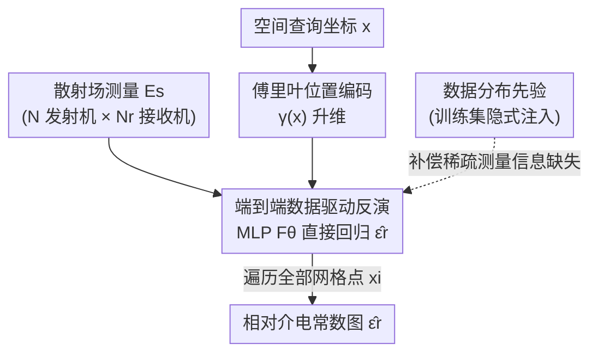

# Electromagnetic Inverse Scattering from a Single Transmitter

**会议**: CVPR 2026  
**论文**: [CVF Open Access](https://openaccess.thecvf.com/content/CVPR2026/html/Cheng_Electromagnetic_Inverse_Scattering_from_a_Single_Transmitter_CVPR_2026_paper.html)  
**代码**: https://gomenei.github.io/SingleTX-EISP/  
**领域**: 计算成像 / 电磁逆散射  
**关键词**: 电磁逆散射, 相对介电常数重建, 数据驱动反演, 单发射机, 隐式神经表示  

## 一句话总结
本文把电磁逆散射问题（EISP）从"逐样本物理优化"改写成"端到端数据驱动回归"——用一个 MLP 直接把接收到的散射场和空间坐标映射成该点的相对介电常数，靠训练集学到的数据分布先验补偿稀疏测量的信息缺失，首次实现了仅用**单个发射机**的高质量重建，且推理比此前 SOTA 快 7 万倍。

## 研究背景与动机
**领域现状**：电磁波能穿透物体表面，因此 EISP（电磁逆散射问题）是无创成像的核心——给定发射机打出的入射场、接收机测到的散射场，反推物体内部的相对介电常数 $\epsilon_r$，可作为 X 光 / MRI 的低成本替代。传统做法分两类：非迭代法（Born 近似、Rytov 近似、BP 反传）用线性近似换速度，质量差；迭代法（2-fold SOM、Gs SOM）质量好但慢且不可泛化。近年的机器学习方法（PGAN、Physics-Net）多走"BP 出初值 + 图像翻译网络精修"两段式，最新的 Img-Interiors 则把散射机制塞进网络做逐样本优化。

**现有痛点**：要拿到稳定的反演解，传统流程需要**大量发射机和接收机**来采集足够数据，这直接推高了设备成本和操作时间，限制了实用性。一旦把发射机数量压到很少（极端情况只有一个），现有方法集体崩溃：BP 连大致轮廓都重建不出来；Physics-Net 这类两段式方法死死依赖 BP 初值，BP 一错它们无法纠正（因为不是端到端），只能照着不可靠的初值"幻觉"出一个数字形状；Img-Interiors 即使优化收敛，重建出的散射体仍可能和真值差很远。

**核心矛盾**：稀疏发射机 → 测量数据量骤减 → **物理信息严重不足**。逆问题本身就病态（接收机数 $N_r \ll M^2$ 网格点数），数据再不够时直接求解在数学上根本不可解，任何只靠物理机制的尝试都注定脆弱。作者用 Img-Interiors 的失败案例点破了这个本质：它重建出的散射体正向仿真出来的散射场和实测高度吻合，可散射体本身却完全错了——这正是逆问题"多解歧义"的体现。

**核心 idea**：既然单发射机下的物理信息天然不足，就**用数据分布先验把缺失的信息补回来**。具体做法是放弃 BP 这根拐杖，训练一个完全端到端的 MLP，直接学习"散射场 → 介电常数"的非线性映射，让模型在大量场景上隐式吸收数据统计规律来消解病态性。

## 方法详解

### 整体框架
方法极简却切中要害：核心是一个充当"逆求解器"的 MLP。给定所有发射机/接收机测到的散射场 $E_s$ 和一个空间查询坐标 $x$，MLP 直接吐出该坐标处的相对介电常数预测 $\hat\epsilon_r(x)$；把网格上所有点都查一遍，就拼出整张介电常数图。整条 pipeline 没有任何 BP 初值、没有逐样本优化、没有迭代，是一次前馈推理。

先看正向物理过程（这是设计反演模型的依据）。发射机打出入射场 $E_i$ 激发感应电流 $J$，用矩量法（Method of Moments）可写出总场：

$$E_t = E_i + G_d \cdot J$$

其中 $G_d$ 是离散自由空间格林函数矩阵（$M^2 \times M^2$ 常量），感应电流满足 $J = \text{Diag}(\xi)\cdot E_t$，$\xi = \epsilon_r - 1$（对比度）。$J$ 再作为新源辐射出散射场 $E_s = G_s \cdot J$，$G_s$ 是 $N_r \times M^2$ 的格林函数矩阵。由于 $N_r \ll M^2$，从 $E_s$ 反推 $J$（进而反推 $\epsilon_r$）天然病态。本文的反演模型就是要用神经网络绕过这条解析反演链路。

### 关键设计

**1. 端到端数据驱动反演：抛弃 BP，直接回归散射场到介电常数**

针对的痛点是两段式方法"BP 一失败就全盘皆错"。本文不再让任何传统数值方法掺一脚，而是把整个反演当成一个可微的非线性回归函数来学：

$$\hat\epsilon_r(x_i) = F_\theta(E_s, \gamma(x_i)), \quad x_i \in \mathbb{R}^2$$

$F_\theta$ 是带可训练参数的 MLP，输入是散射场向量 $E_s$ 加上编码后的查询坐标，输出是该点的介电常数。整张图通过在所有网格点采样得到 $\hat\epsilon_r = \{F_\theta(E_s, \gamma(x_i))\}_{i=1}^{M^2}$。这样做的关键好处是**端到端可纠错**：模型不依赖任何外部初值，所有误差都能通过梯度被监督信号修正，从根本上摆脱了 BP 在稀疏发射机下的瓶颈。它把逆问题从"解析反演 + 后处理"变成"端到端学映射"，让数据驱动学习的优势得以完全释放。

**2. 数据分布先验补偿信息缺失：让单发射机也能解病态逆问题**

这是全文真正的洞察。单发射机下物理信息不足，直接求解逆问题"在数学上不可解"。本文不像生成式方法那样用一个显式解耦的先验模块（如建模 $p(x)$ 的去噪器），而是让 MLP 在大量多样化散射场景上训练时**隐式地吸收数据统计规律**：当某个散射场对应多个可能的散射体（歧义）时，训练学到的数据分布会把解拉向"训练集里真实存在的那类形状"，从而消解逆问题的多解性。换句话说，缺的物理信息由"先验知识：真实散射体长什么样"补上。这解释了为什么 Img-Interiors 这种逐样本优化会失败——它只对单个样本拟合散射场、不知道形状先验，于是落进一个散射场吻合、形状却荒谬的局部最优；而本文的模型见过成千上万个样本，天然带着"合理形状"的约束。

**3. 逐点查询 + 傅里叶位置编码：用隐式表示提升空间细节**

介电常数图需要刻画清晰的边界和高频细节，但坐标本身是低频输入，直接喂 MLP 难以表达高频。本文借用 NeRF 式的位置编码，把空间坐标映到高维傅里叶特征空间：

$$\gamma(x) = [\sin(x), \cos(x), \dots, \sin(2^{\Omega-1}x), \cos(2^{\Omega-1}x)]$$

超参 $\Omega$ 控制谱带宽。这种逐点查询的隐式表示让单一 MLP 能在任意分辨率下采样、并保留锐利结构。输入侧的散射场也做了统一编码：单发射机下 $E_s$ 是长度 $2N_r$ 的实向量（$N_r$ 个接收机复测量的实部+虚部）；多发射机下则把 $N$ 个发射机的复测量拼成 $2N\cdot N_r$ 维向量，代表不同照射条件下的传播与散射行为，让同一套架构无缝支持任意发射机数量、也能直接扩展到 3D（坐标维度改成 3 即可）。

### 损失函数 / 训练策略
训练目标极简，只有一个直接监督介电常数重建精度的 MSE 损失：

$$L = \|\hat\epsilon_r - \epsilon_r\|^2$$

最小化预测与真值介电常数之间的均方误差，模型即学会从散射场直接推断材料属性。作者强调这种单一损失保证了训练的稳定与高效——没有对抗损失、没有物理一致性正则、没有多阶段调度。对相同发射机/接收机配置的数据集会合并成统一训练集，对不同噪声水平（5%、30%）分别训练独立模型。

## 实验关键数据

### 主实验
在 MNIST、Circular-cylinder 两个合成数据集（各含 5% / 30% 噪声）和真实 Institut Fresnel（IF）数据集上对比 7 个 baseline，指标为 MSE↓ / SSIM↑ / PSNR↑。下表节选 N=16（多发射机）与 N=1（单发射机）两个关键设定，本文记为 Ours：

| 设定 | 数据集(噪声) | 指标 | Img-Interiors | PGAN | 本文 |
|------|------|------|------|------|------|
| N=16 | MNIST(5%) | MSE↓ / PSNR↑ | 0.200 / 26.41 | 0.084 / 25.80 | **0.039 / 32.11** |
| N=16 | Circular(5%) | MSE↓ / PSNR↑ | 0.036 / 35.05 | 0.026 / 35.56 | **0.020 / 36.92** |
| N=1 | MNIST(5%) | MSE↓ / PSNR↑ | 0.305 / 16.06 | 0.133 / 21.69 | **0.085 / 26.09** |
| N=1 | MNIST(30%) | MSE↓ / PSNR↑ | 0.467 / 12.47 | 0.153 / 20.41 | **0.127 / 22.56** |
| N=1 | Circular(5%) | MSE↓ / PSNR↑ | 0.096 / 26.19 | 0.033 / 32.02 | **0.031 / 33.18** |

多发射机下本文已是全面最优或持平 SOTA；单发射机下差距被拉开——所有此前方法在 MNIST(30%) 单发射机几乎全线失效（Img-Interiors MSE 高达 0.467、PSNR 仅 12.47），而本文仍有 0.127 / 22.56，是唯一能在如此极端条件下给出合理形状的方法。效率上，本文前馈推理约 0.01 s/case，相比 Img-Interiors 的逐样本优化（数百到上万秒）实现 **7 万倍以上**加速。

### 消融实验
| 配置 | MSE↓ | SSIM↑ | PSNR↑ | 说明 |
|------|------|------|------|------|
| 噪声 5% | 0.039 | 0.978 | 32.11 | 多发射机 MNIST 基准 |
| 噪声 20% | 0.043 | 0.974 | 31.34 | 退化平缓 |
| 噪声 30% | 0.050 | 0.966 | 29.91 | 强噪下仍保结构 |
| 训练数据 100% | 0.039 / 0.050 | — | — | 5% / 30% 噪声 |
| 训练数据 50% | 0.048 / 0.068 | — | — | 数据减半，弱噪掉点温和 |
| 训练数据 25% | 0.064 / 0.101 | — | — | 高噪下数据缩减惩罚明显更重 |

### 关键发现
- **噪声鲁棒性是平滑退化而非崩溃**：噪声从 5% 升到 30%，MSE 仅从 0.039 升到 0.050，PSNR 仅掉约 2.2 dB；多数 baseline 在强噪下出现明显伪影甚至完全失效。
- **数据先验是性能来源、对抗噪声尤其依赖数据量**：训练数据从 100% 砍到 25%，弱噪（5%）下 MSE 0.039→0.064 还能扛，高噪（30%）下 0.050→0.101 翻倍——印证了"消解病态靠的是充足数据学到的鲁棒先验"这一核心论点。
- **可无缝扩展到 3D**：同架构把输入维改成 3，在 3D MNIST 单发射机下达 MSE 0.120 / IoU 0.769，远超 Img-Interiors 的 0.372 / 0.094；3D ShapeNet 单发射机下 MSE 0.064 / IoU 0.762，验证了对多样 3D 结构的泛化。

## 亮点与洞察
- **把"逆问题病态"重新诊断为"信息缺失"**：作者没有去发明更复杂的物理正则，而是先用 Img-Interiors 的失败案例证明"散射场吻合 ≠ 形状正确"，把问题根因定位到数据/信息不足，再顺势引出"用数据先验补"。这个诊断—对策的逻辑链比方法本身更有价值。
- **方法极简却打穿了 baseline**：核心就是一个 MLP + 位置编码 + MSE，没有任何花哨模块，却在最难的单发射机设定上把此前全部方法甩开。它说明在病态反演里，"端到端可纠错 + 数据先验"这套组合拳比"塞物理机制 + 逐样本优化"更本质。
- **隐式表示思路可迁移**：把"坐标查询 + 位置编码 + 逐点回归"从 NeRF/SDF 这类视觉重建迁到电磁参数场重建，提示了一个通用范式——任何"测量 → 连续物理场"的反演都可以这样写成隐式回归。

## 局限与展望
- **强依赖训练数据分布**：性能本质来自数据先验，测试形状若严重偏离训练分布（论文也展示了 3D ShapeNet 的 failure case），泛化会打折扣；这与传统物理方法"无需训练即可用"形成 trade-off。
- **未显式利用物理前向模型**：方法完全黑箱回归，丢掉了式 (1)(2) 的可微物理结构。⚠️（个人判断）引入正向散射一致性作为额外监督，或许能在分布外样本上更稳。
- **噪声模型为合成加噪**：实验主要在合成噪声（5%–30%）下评估，真实传感器的复杂噪声/标定误差下的表现仍待更系统验证。
- **介电常数动态范围与多材料**：实验对象多为相对简单的圆柱/数字形状，面对高对比度、多材料混合的复杂散射体能否保持精度，论文着墨不多。

## 相关工作与启发
- **vs Img-Interiors**: 二者都用神经网络且都做隐式表示，但 Img-Interiors 是把散射机制嵌入网络、对每个样本单独优化（无数据先验、易陷局部最优、单发射机下歧义导致失败、每例数百~上万秒）；本文是端到端前馈、跨数据集训练、隐式吸收数据先验，单发射机下不崩、推理 7 万倍快。
- **vs Physics-Net / PGAN / BPS（两段式）**: 它们用 BP 出初值再用图像翻译网络精修，BP 一失败便无法纠正，单发射机下倾向"幻觉"出错误数字形状；本文完全抛弃 BP，端到端从散射场直接回归，绕开了初值瓶颈。
- **vs BP / SOM 等传统数值法**: 传统法靠线性近似（BP）或迭代子空间优化（SOM），不可泛化且迭代慢，稀疏数据下只能给出模糊轮廓；本文用数据驱动一次前馈给出锐利且准确的重建。

## 评分
- 新颖性: ⭐⭐⭐⭐ 把 EISP 病态性重诊断为信息缺失、并首次实现单发射机高质量重建，视角新；方法本身（MLP+位置编码）较朴素。
- 实验充分度: ⭐⭐⭐⭐ 覆盖多发射机/单发射机、合成+真实 IF、2D/3D、噪声与数据量消融，对比 7 个 baseline，较全面。
- 写作质量: ⭐⭐⭐⭐⭐ "Revisiting EISP"一节用反例把动机讲得极清晰，逻辑链干净。
- 价值: ⭐⭐⭐⭐ 把昂贵的多发射机设备需求压到单发射机，对低成本电磁成像落地有实际意义。

<!-- RELATED:START -->

## 相关论文

- [\[CVPR 2026\] Efficient Unrolled Networks for Large-Scale 3D Inverse Problems](efficient_unrolled_networks_for_large-scale_3d_inverse_problems.md)
- [\[CVPR 2026\] OmniFood8K: Single-Image Nutrition Estimation via Hierarchical Frequency-Aligned Fusion](omnifood8k_nutrition_estimation.md)
- [\[CVPR 2025\] TensoFlow: Tensorial Flow-based Sampler for Inverse Rendering](../../CVPR2025/others/tensoflow_tensorial_flow-based_sampler_for_inverse_rendering.md)
- [\[ICLR 2026\] A Single Architecture for Representing Invariance Under Any Space Group](../../ICLR2026/others/a_single_architecture_for_representing_invariance_under_any_space_group.md)
- [\[CVPR 2025\] Towards In-the-Wild 3D Plane Reconstruction from a Single Image](../../CVPR2025/others/towards_in-the-wild_3d_plane_reconstruction_from_a_single_image.md)

<!-- RELATED:END -->
