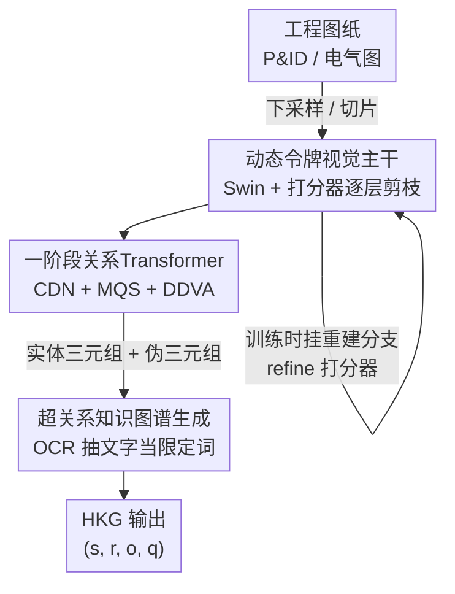

# End-to-End Hyper-Relational Information Extraction for Engineering Diagrams via Dynamically Tokenized Relation Transformer

**会议**: CVPR 2026  
**论文**: [CVF Open Access](https://openaccess.thecvf.com/content/CVPR2026/html/Bai_End-to-End_Hyper-Relational_Information_Extraction_for_Engineering_Diagrams_via_Dynamically_Tokenized_CVPR_2026_paper.html)  
**代码**: https://github.com/Tianyou-Bai/DTRT-Diagram-Parsing-in-Scene-Graph  
**领域**: 文档理解 / 场景图生成  
**关键词**: 工程图纸解析, 超关系知识图谱, 一阶段场景图生成, 动态令牌剪枝, P&ID  

## 一句话总结
把工程图纸（管道仪表图 P&ID、电气图 ED）的解析从"多模型分别检测符号/线/文字"重构成一次性的场景图生成任务，用一个带动态令牌剪枝的视觉主干 + 一阶段关系 Transformer（DTRT）端到端输出"实体 + 连接关系 + 文字限定词"的超关系知识图谱，在 P&ID 上 SGDET R@2000 达 94.84%、计算量却只有两阶段方法的约 1/8。

## 研究背景与动机
**领域现状**：工程图纸（P&ID、电气图、单线图）是工业流程里记录设备、参数、拓扑连接和控制逻辑的核心载体，但大多以纸质或扫描件形式存在，数字化需求迫切。现有解析普遍走"目标检测"路线：用 YOLO / DETR 类模型分别检测符号、线、文字框，再拼回结构。

**现有痛点**：作者点出三个具体问题。其一，符号、线、文字往往要分别用独立模型检测，工作流冗长、效率低；其二，工程图纸分辨率极高（常 8K 甚至 10K），现有模型计算开销巨大；其三，纯目标检测框架只能定位"组件在哪、是什么类别"这类低层语义，无法建立符号与符号之间的连接关系、也建不起符号与其文字标签之间的对应，于是拿到一堆框却拼不出可检索的结构化知识。

**核心矛盾**：图纸里真正有价值的信息是**拓扑连接 + 文字限定（型号、参数）**这类隐含语义，而它恰恰是检测框架最难产出的；同时高分辨率带来的海量视觉令牌中，超过 70% 信息量极低，却仍被均匀地参与昂贵计算。

**本文目标**：用一个端到端框架同时解决（1）多模型拼接的繁琐工作流、（2）超高分辨率的计算爆炸、（3）连接关系与文字限定这类高层语义的缺失。

**切入角度**：既然目标是"组件 + 关系 + 文字"，那本质上就是一张**场景图**——把"连接两个符号的线"看成符号间的连接关系 $r_{ss}$，把"符号与它的文字标签"看成限定关系 $q_{st}$，于是检测任务被重述成场景图生成任务，连"长直线检测、不规则边框检测"这些检测里的硬骨头都被绕过了。

**核心 idea**：用一阶段关系 Transformer 直接生成 (主语, 谓词, 宾语) 三元组、避开关系预测的 $O(n^2)$ 复杂度，并给视觉主干插入"打分器—重建器"把 70% 的无用令牌剪掉，最终输出带文字限定词的**超关系知识图谱（HKG）**。

## 方法详解

### 整体框架
DTRT（Dynamically Tokenized Relation Transformer）针对"工作流繁琐、计算过大、高层语义缺失"三个问题串成一条流水线。一张工程图纸先做无损预处理（整图下采样或切片，保细节）；再进入**动态令牌视觉主干**——基于 Swin Transformer，每个 stage 末插一个 MLP 打分器，给令牌打分并剪掉低价值令牌，训练时再挂一条 Transformer 重建分支帮打分器收敛；剪枝后的特征送入**一阶段关系 Transformer**，先用特征编码器拿全局上下文，再用实体解码器和三元组解码器直接生成并逐层优化 $[e_{s_i}, r_{s_is_j}, e_{s_j}]$ 这样的三元组；最后把其中"符号—文字"伪三元组挑出来、用 OCR 识别文字内容，作为限定词挂回实体与关系，组装成超关系知识图谱 $\{\hat{s}, \hat{r}, \hat{o}, \hat{q}\}$。

整个方法的底层重构是：把图纸 $d$ 表示为符号实体 $e_s$、线实体 $e_l$、文字实体 $e_t$ 的组合，把连接符号的线转成连接关系 $r_{ss}$、把符号与文字的对应转成限定关系 $q_{st}$，从而构建关系标注数据集 $D=\{[e_s, e_t, r_{ss}, q_{st}]_1, \dots\}$，把检测任务整体转成场景图生成任务。

### 关键设计

**1. 场景图重构：把"分模型检测"改写成一次性关系预测**

这一步针对的是"多模型拼接 + 检测拼不出关系"这个最根本的痛点。作者不再让模型去检测"线"这种又长又细、边框不规则的东西，而是直接把"连接两个符号的线"标注成符号间的连接关系 $r_{ss}$（分实线、非实线两类），把"符号旁边的文字标签"标注成限定关系 $q_{st}$，于是图纸被表示成 $D=\{[e_s, e_t, r_{ss}, q_{st}]\}$，解析目标从"一堆框"变成"一张场景图"。这样做的好处是双重的：一方面输出的本就是结构化高层语义（谁连谁、谁的参数是什么），不用再后处理拼接；另一方面绕开了长直线检测、不规则边框检测这些目标检测里公认的硬骨头。这个重构是后面所有模块的前提，决定了模型直接预测三元组而不是边框集合。

**2. 打分器—重建器动态令牌剪枝：先把 70% 没用的令牌扔掉再算**

高分辨率图纸里超过 70% 的视觉令牌信息量极低却照样吃满算力，这是计算爆炸的直接来源。DTRT 在 Swin 主干每个 stage 末尾插一个轻量 MLP 打分器：先把令牌特征过 MLP 得 $z_l=\mathrm{MLP}(x_{i+1})$，再按当前保留掩码做全局池化 $z_g=\frac{\sum_i \hat{D}[i]\cdot z_l[i]}{\sum_i \hat{D}[i]}$，拼成 $z=[z_l, z_g]^T$ 后预测保留概率 $\pi=\mathrm{Softmax}(\mathrm{MLP}(z))$；用 Gumbel-Softmax 把概率变成可微的二值剪枝决策更新掩码 $\hat{D}\leftarrow\hat{D}\odot\mathrm{Gumbel\text{-}Softmax}(\pi)$，每个 stage 按比例 $\rho_r$（取 0.7）保留得分最高的令牌，被剪的令牌在注意力里用掩码矩阵 $G_{ij}$ 屏蔽掉，从而省下 $QK^T$ 的注意力计算。

但作者发现打分器**很难训**：早期实体查询匹配质量差、给不出有效监督信号，而纯视觉理解任务又抓不住长直线、文字这类低层细节，于是简单的打分器会把这些关键令牌误剪。解决办法是挂一条 **Transformer 重建分支**：把剪后特征 $x^*_{s+1}$ 和被掩令牌 $x^m_{s+1}$ 一起送进重建器，经编码—解码后逆投影重组出重建图 $d_{rc}$，用像素级重建损失 $L_r=\frac{1}{NC}\sum_i\sum_c(d_{rc}[i][c]-d[i][c])^2$ 反过来给打分器加监督。最终总损失把重建、实体、关系三项加权 $L=\lambda_{rc}L_{rc}+\lambda_e L_e+\lambda_{re}L_{re}$。这条分支只在训练期存在、推理时不付出代价，却让打分器更快收敛、并主动保住长线和文字。

**3. 一阶段关系 Transformer：直接吐三元组，绕开 $O(n^2)$**

工程图纸里关系数量巨大，两阶段场景图方法要给每个实体查询去匹配关系查询，复杂度 $O(N^2)$，又慢又不准。DTRT 改成一阶段：特征编码器先产出带全局上下文的 $z_e$，实体解码器（$L_e=6$ 层）输出实体表示，三元组解码器（$L_t=9$ 层）直接生成并逐层精炼 $\{\hat{s},\hat{r},\hat{o}\}$。为了又快又准，作者叠了三个改进。**混合查询选择（MQS）**：用一个 MLP 打分器从 $z_e$ 里选出高置信实体候选 $I_e$，与可学习查询 $\Theta_e$ 拼成实体查询 $E=\mathrm{LN}(\mathrm{Shuffle}([W_\eta\cdot z_e[I_e], \Theta_e]))$，加速收敛、提高实体覆盖。**对比去噪训练（CDN）**：对真值加噪声造正负样本，正样本低噪 $\sigma_{small}=0.03$、负样本高噪 $\sigma_{large}=0.15$，对比损失逼模型优先匹配正样本、把同类实体在特征空间里聚得更紧，为后续关系预测提供更可靠的先验。**关系感知可变形解耦视觉注意力（DDVA）**：从交叉注意力分布里定位主语—宾语的关联区域，用 $[b^m_s, b^m_o]=W_\kappa\cdot[S^{csa}_m, O^{csa}_m]$ 估出关联框、再以其中心 $p_m$ 偏置可变形注意力的采样点 $[S^{ddva}_m, O^{ddva}_m]=\delta\text{-}a([S^{csa}_m, O^{csa}_m], z, \Delta p_b+\lambda_p\cdot p_m)$，让注意力对准"两个符号之间那段连接区域"。三者叠加后，关系预测精度被显著拉高（消融里 DDVA 单项最多贡献 7.16%）。

**4. 超关系知识图谱生成：把文字标签变成实体的限定词**

普通三元组 $(s, r, o)$ 装不下"这个阀门的型号是 XX、压力是 YY"这种附加信息，而这恰是工程图纸最有价值的部分。DTRT 的做法是：在生成的三元组里，按关系类别识别出由限定关系 $r_{st}$ 构成的**伪三元组**（即"符号—文字"对），用 OCR（PaddleOCR）抽出文字内容 $\hat{q}_i=\{\hat{s}_i, \hat{r}_{st}, \hat{o}_k\}$，再把这些限定词挂回对应实体与关系，组装成超关系三元组 $\{\hat{s}_i, \hat{r}_{ss}, \hat{o}_j, \hat{q}_i\}$，最终形成超关系知识图谱 $\{\hat{s}, \hat{r}, \hat{o}, \hat{q}\}$。这样符号、连接关系、文字标签被绑在一起，人和 agent 都能快速检索"某设备连到哪、参数多少"。为支撑训练，作者还给现有数据集补了超关系标注和文字标注。

### 损失函数 / 训练策略
总损失 $L=\lambda_{rc}L_{rc}+\lambda_e L_e+\lambda_{re}L_{re}$，分别对应重建、实体检测、关系预测。架构超参 $\{L_r{=}3, L_e{=}6, L_t{=}9, \rho_r{=}0.7, \sigma_{small}{=}0.03, \sigma_{large}{=}0.15, \Delta p_b{=}0.8, \lambda_p{=}0.6\}$；视觉主干用预训练 tiny Swin，OCR 用预训练 PaddleOCR；AdamW，基础学习率 $1\times10^{-4}$，余弦退火，单张 A6000 约 0.4 小时/epoch。

## 实验关键数据

数据集：重组的 P&ID 数据集（基于 Digitize-PID + PID2Graph，762 张 8K 图，16 类实体、2 类连接关系、2 类限定词）和 ED 电气图数据集（4768 张图，12 类实体）。指标：实体检测用 AP/AR；关系抽取用场景图生成的 R@R（输出列表长度等于真值关系数时的召回）和 R@N（固定长度 N 的召回）。

### 主实验

关系抽取（场景图）对比，P&ID 数据集（SGDET 是基于原图直接预测关系的较难设定）：

| 方法 | SGDET R@2000 | SGCLS R@R | GFLOPs |
|------|------|------|------|
| RelTR | 79.17 | 83.41 | 287.8 |
| Relationformer（两阶段） | 91.58 | 87.72 | 791.9 |
| SGTR | 76.94 | 80.76 | 749.3 |
| **DTRT（本文）** | **94.84** | **88.62** | **90.5** |

电气图 ED 数据集（更难，连接复杂、标注质量更低）：

| 方法 | SGDET R@200 | SGCLS R@200 | GFLOPs |
|------|------|------|------|
| RelTR | 77.91 | 90.98 | 209.9 |
| Relationformer | 89.15 | 97.29 | 589.4 |
| SGTR | 77.12 | 90.65 | 561.1 |
| **DTRT（本文）** | **92.52** | 97.63 | **67.3** |

DTRT 在最难的 SGDET 上明显领先，且计算量只有两阶段方法（Relationformer 791.9 / 589.4 GFLOPs）的约 1/8——两阶段方法即便把关系查询合并成一个，仍要让每个实体查询去匹配它，逃不掉 $O(N^2)$。实体检测上 DTRT 与 RT-DETR 持平（P&ID 符号 AP50 99.01 vs 99.27），但召回高出约 0.6 个百分点，作者归因于对比去噪训练对实体定位的引导。

> ⚠️ 摘要写"P&ID R@1000 94.84%"，但 Table 5 里 DTRT 的 94.84% 实际对应 SGDET R@2000（R@1000 为 87.42%）。以表格为准，摘要的 R@1000 标注疑似笔误。

### 消融实验

关系 Transformer 逐项叠加（P&ID）：

| 配置 | AP50 | SGDET R@2000 |
|------|------|------|
| baseline | 90.12 | 79.24 |
| +DN | 93.94 | 82.45 |
| +DN +DDVA | 94.51 | 87.98 |
| +DN +DDVA +CDN | 97.86 | 92.11 |
| +DN +DDVA +CDN +MQS（Full） | **99.01** | **94.84** |

动态视觉主干消融（剪枝 + 重建）：

| 配置 | OCR CER↓ | SGCLS R@R | GFLOPs↓ |
|------|------|------|------|
| 无剪枝 | 1.21 | 68.92 | 299.2 |
| 仅打分器剪枝（S） | 9.86 | 51.89 | 90.5 |
| 打分器 + 重建分支（S+R） | 1.53 | 68.75 | 90.5 |

### 关键发现
- **重建分支是动态剪枝能用的关键**：只插打分器虽把 GFLOPs 从 299.2 砍到 90.5（降 >69%），但 OCR CER 从 1.21 飙到 9.86、SGCLS R@R 从 68.92 跌到 51.89——简单 MLP 打分器读不懂文字和长线，会误剪关键令牌；加上重建分支后，性能损失被压到 OCR ≤0.93%、SGCLS ≤0.57%，几乎白嫖了 70% 的计算缩减。
- **DDVA 对关系预测贡献最大**：单项最多带来 7.16% 的场景图精度提升，因为它能精准对准主语—宾语的关联区域，建模多尺度实体间关系。
- **ED 比 P&ID 难**：连接更复杂、标注质量更低，但 DTRT 仍拿到 92.52% SGDET R@200，说明框架的泛化性。

## 亮点与洞察
- **把"难检测的东西"重述成"易预测的关系"**：长直线、不规则边框是检测的老大难，作者干脆把"线"看成符号间的连接关系、把"文字"看成限定词，用场景图生成绕开检测硬骨头——这个问题重构比任何网络结构改动都更解决问题。
- **限定词机制让知识图谱"装得下参数"**：普通三元组只能说"A 连 B"，HKG 用 qualifier 把"A 的型号/压力是多少"也挂上去，这对工业检索和下游 agent 调用是实打实的可用性提升。
- **剪枝 + 重建的组合可迁移**：在任何高分辨率、含细长结构/文字的文档场景（电路图、地图、表格扫描件）里，"训练期重建分支监督剪枝、推理期零开销"这一招都值得借。

## 局限与展望
- 数据规模偏小（P&ID 仅 762 张、ED 4768 张），且大量依赖作者自己补的超关系/文字标注，跨厂家、跨绘图风格的泛化未充分验证。
- 强依赖外部 OCR（PaddleOCR）抽限定词文字，OCR 错误会直接污染知识图谱，文中未单独分析这条误差链。
- 对比对象基本是复现的场景图生成模型（RelTR/Relationformer/SGTR），缺少与工业界专门的图纸解析商用流水线的对比。
- ⚠️ 关系预测召回是按"输出列表长度"算的（R@1000/R@2000），列表越长越容易召回高，跨方法比较时需留意 N 的设定是否一致。
- 展望：作者计划继续做图纸理解与视觉知识推理，走向工程图纸的通用多模态智能。

## 相关工作与启发
- **vs Relationformer（两阶段 DETR）**: 它先检测再加关系查询，每个实体查询都要匹配关系查询，复杂度 $O(N^2)$、791.9 GFLOPs；DTRT 一阶段直接吐三元组，90.5 GFLOPs 还把 SGDET R@2000 从 91.58 提到 94.84，证明一阶段在"海量关系"场景下的计算/精度双优。
- **vs SGTR（一阶段二部图）**: 它把场景图当实体节点与谓词节点的二部图、靠空间距离和类别相似度连边，缺少关联区域的视觉感知，R@R 仅 80.76；DTRT 用 DDVA 显式对准连接区域，视觉提示利用更充分。
- **vs DynamicViT / EViT（通用令牌剪枝）**: 它们在自然图像上有效，但在文档场景训练困难、掉点明显；DTRT 借鉴"生成式重建约束剪枝"（类似 Allakhverdov 的 selector-reconstructor），用重建损失保住文字和长线，使剪枝在图纸场景可用。

## 评分
- 新颖性: ⭐⭐⭐⭐ 把图纸解析重构成超关系场景图生成、一阶段直出带限定词的 HKG，问题视角和系统设计都有新意。
- 实验充分度: ⭐⭐⭐⭐ 主对比 + 实体/关系两套指标 + 双数据集 + 细致消融到位，但数据集偏小、缺商用流水线对比。
- 写作质量: ⭐⭐⭐⭐ 公式与流程清晰，仅摘要 R@1000/R@2000 标注有笔误。
- 价值: ⭐⭐⭐⭐ 工程图纸数字化是真实工业刚需，端到端 + 低算力的方案落地价值高。

<!-- RELATED:START -->

## 相关论文

- [\[CVPR 2026\] Bias at the End of the Score](bias_at_the_end_of_the_score.md)
- [\[ICML 2026\] CyberGym-E2E: Scalable Real-World Benchmark for AI Agents' End-to-End Cybersecurity Capabilities](../../ICML2026/others/cybergym-e2e_scalable_real-world_benchmark_for_ai_agents_end-to-end_cybersecurit.md)
- [\[ACL 2025\] Behavioural vs. Representational Systematicity in End-to-End Models: An Opinionated Survey](../../ACL2025/others/behavioural_vs_representational_systematicity_in_end-to-end_models_an_opinionate.md)
- [\[CVPR 2026\] 3D-Object Perception Transformer (3PT)](3d-object_perception_transformer_3pt.md)
- [\[CVPR 2026\] Robust Spiking Neural Networks by Temporal Mutual Information](robust_spiking_neural_networks_by_temporal_mutual_information.md)

<!-- RELATED:END -->
